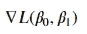
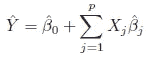
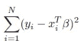
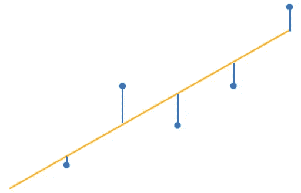
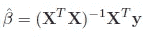
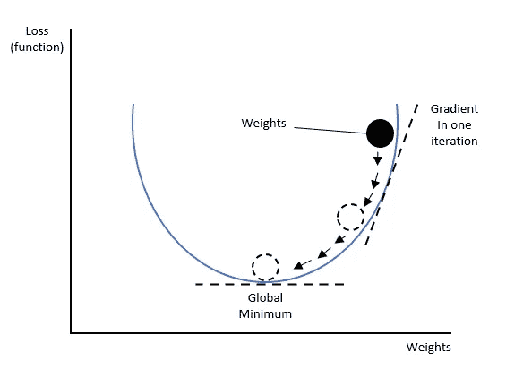
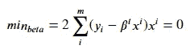
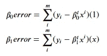
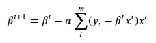
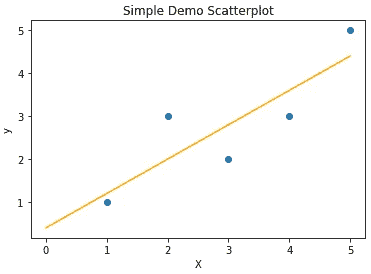

# 梯度下降的简单指南

> 原文：<https://towardsdatascience.com/gradient-descent-f7458de38365>

## 用 Python 演示了多元线性回归示例中的算法

当研究一本机器学习书籍时，很有可能在第一页就遇到臭名昭著的梯度下降。虽然这种算法背后的想法需要一点数学直觉，但梯度下降的应用程序的有用性和通用性令人难以置信。这篇文章为你提供了所有你需要了解的实用知识。

无论你是否深入研究**深度学习**(反向传播)或者只是对如何导出**线性回归**(普通最小二乘法)中的系数感兴趣，梯度下降(GD)都是这些方法学不可或缺的一部分，不应该对用户保持黑盒模型。本解释旨在**将几个简单的数学表达式与相关代码**联系起来。

> **本文介绍了一个简单的四步算法来实现梯度下降。你需要的一切！**


渐变的日落——作者图片

## 为什么探索梯度下降？

当我们将算法直接放在线性回归的上下文中时，GD 可能是最容易理解的——因此我将使用回归作为主要参考。

目标是找到最小化直线/超平面到所有数据点的距离的系数。这可以通过矩阵运算(和求逆)来实现，但是计算量非常大。由于这个原因**使用 GD 是一个很好的方法来获得解决方案**。网上有各种指南展示如何一步一步地应用梯度下降(即更新一个系数&迭代，更新下一个系数&迭代，..)，然而，这使得很难掌握通过矩阵运算一次更新几个权重/系数的过程。这是至关重要的，因为更新权重/系数矩阵是深度学习文献中经常使用和讨论的主题。

为了使 GD 的整体计算概念更加具体，我将详细说明 GD 如何实际应用于导出矩阵符号**中的线性回归系数**。

> 我将举例说明几个简单的数学表达式，如果你觉得不太舒服，就继续进行，我相信代码部分最终会清除烟雾。下面的等式解释了“为什么”，而代码部分是“如何”的问题。

## 什么是梯度下降？

你可能还记得在学校的时候，找到一个函数的最小值/最大值直接导致了**导出函数**的任务。如果我们使用这个导数，一点一点地降低函数值，我们最终会收敛到最小值。关于 GD，我们试图最小化一个损失函数，这完全符合我们的学校数学工具包。

换句话说，GD 是一个一阶优化算法，它允许我们找到一个函数的最小值(希望是全局的)。下面的视频展示了我们如何从一个随机点(红色区域)开始，迭代下降到这个函数的最小值(蓝色区域)。

Gif 由[angryinconsequentialdiplodocus](https://gfycat.com/angryinconsequentialdiplodocus)

起初看起来有点挑战性的是，几个系数需要几个**偏导数。**然后，每个导出值被存储在一个向量中，即梯度。在论文中，你可能会遇到“nabla”的符号，这是一个倒置的三角形:



最小化损失函数[1]

但在我们实际做 GD(这有助于我们最小化损失函数，通常表示为" *J* 或" *L* ")之前，让我们首先确定我们在看什么损失函数。

## 基本思想——线性回归

首先，理解我们想要解决的的**潜在问题是很重要的——在这种情况下，这是一个回归问题，我们需要最小化普通最小二乘方程。真实值 *y* 的**估计值(" y hat")** 表示如下:**



给定一个线性模型对 Y 的估计[2]

为了使用 GD，一个函数必须在所有点上都是可微的，并且是 ***凸的*** —这对于普通的最小二乘(OLS)问题是已知的，其中我们计算**估计值和真实的 *y* 值**之间的偏差平方和——这是我们的**损失函数**:



最小化 RSS —剩余平方和(凸函数)[3]

如果残差平方和最小化，我们将获得一条直线，其特征是到所有数据点的距离最短，如下图所示:



真实易值(蓝点)与回归线(y _ hats)-作者图片

RSS 简单地表示真实 y 值和 X 值之间的平方差之和乘以它们的系数(β)。误差项被视为**随机噪声**(高斯分布[0，1])，因此，如果数据点不完全位于直线或超平面上，该等式将产生非零值——这是一般情况。



贝塔系数的估计值[4]

为了估计β，我们需要对 X 矩阵(值 *xij)* 求逆，这将直接引导我们估计系数(“hat”)。搞定了，那么**又何必纠结于梯度下降呢？**

## 开始梯度下降旅程

对一个矩阵求逆可能是**计算上的挑战(即昂贵)，这是 GD 算法真正闪光的地方**。作为矩阵求逆的替代，我们可以简单地取偏导数，使用这些值和学习率(α)来更新当前权重(β)。然后，我们重复这个步骤，以便**迭代地逼近函数**的最小值(再次查看上面的 GIF)**。**

## **最小化损失函数**

我们使用梯度来调整我们的初始权重/系数，这最终使我们达到函数的最小值(假设函数是**凸**)。定义我们多快接近这个最小值的**“速度”参数**被称为**学习率**。

*我在这里不展开关于学习率的想法，但如果你打算这么做，也可以考虑考察一下“***”在这种背景下，作为动量对于克服***局部极小值是非常有用的。***

****

**最小化损失函数—作者图片**

**如前所述，我们可以使用 GD 来代替昂贵的矩阵求逆。首先，我们需要我们的函数关于 beta 的偏导数(在我们简单的回归例子中， *b0* 和 *b1* )。**

**让我们推导损失函数。偏导数的矢量由下列截距和斜率系数的单独计算组成(分别为 *b0 和 b1* )。我们最小化所有贝塔系数(在多元线性回归的情况下，可能有 *p* 系数):**

****

**最小化所有 betas 上的 L[5]**

**将这两个贝塔系数分解开来，我们就有了两个等式，稍后可以轻松实现:**

****

**注意区别:(1)！= (x) [6][7]**

**考虑到定义的 ***学习率，我们进一步使用导出值通过减去*导出值来**减少初始权重**/系数。******

**

*使用导数的广义视图迭代更新贝塔系数[8]*

*上面概括的符号表明我们**需要使用 1 的堆栈向量作为*X*的第一列。这是必要的，以确保在将 *X* 矩阵乘以系数矩阵时添加截距( *b0* 是截距)。*可以跳转到下面的第 15 行和第 16 行代码来观察堆叠。****

*我发现下面的链接很好地解释了如何通过迭代更新两个值 *b0* 和 *b1* 来计算和更新权重(回归意义上的系数)——一次一个。同样，为了理解我们如何以及何时更新权重，链接给出了一个很好的解释。*

*为了更加通用，同时也允许**同时处理多个权重**，我将用矩阵表示法解决这个问题，并将结果与下面的 **Scikit-Learn 的实现进行比较。***

*<https://machinelearningmastery.com/linear-regression-tutorial-using-gradient-descent-for-machine-learning/>  

## 从头开始实现梯度下降

以下步骤概述了如何继续这个 GD 回归示例:

```
1\. Setting up the data
2\. Defining the learning rate (alpha)
3\. Defining the initial values for b0 and b1 (initialization)
4\. Start iterating # for i in 1000
**4.1 Taking partial derivatives
4.1.1 Calculate the error for the intercept (b0)
4.1.2 Calculate the error for the coefficient(s) (b1)
4.2 Update the parameters**Done.
```

*X* 和 *y* 变量定义如下:

```
X = array([[1., 1.],
           [1., 2.],
           [1., 4.],
           [1., 3.],
           [1., 5.]])y = array([1, 3, 3, 2, 5])b = array([0., 0.]) # Initialized b => coefficients/weights
```

数据点可以显示为简单的散点图。回归的目标是在点之间画一条线，使到真实点的距离最小。



带有我们目标回归线的散点图—图片由作者提供

这正是我们所说的 OLS(普通最小二乘)问题。

显然，橙色线设法非常接近所有数据点。此外，这条线有一个截距。

为了再次具体说明**偏导数**，我举例说明了**的两个代码行**。相关的数学表达式分别是 6、7 或 8，可以在上述文本中找到:

```
# d/db0: (b0+b1.dot(x) — y ) * (1) 
# d/db1: (b0+b1.dot(x) — y ) * (x) 
```

## GD 实施

下面的代码初始化变量并开始迭代。前两行计算我们存储为梯度的值。

这种迭代算法为我们提供了截距为 0.39996588 和系数为 0.80000945 的结果，将其与从 ***sklearn*** 实现中获得的 0.399999 进行比较，结果似乎非常匹配。

## Scikit Learn 的实现

这段代码使用线性回归的 sklearn 实现来验证前面获得的结果:* 

## *概述*

**我总是通过在例子中直接应用学习概念来接受它们，这在机器学习领域尤其如此*。对梯度下降的简要介绍旨在提供一个易于理解和实现的算法，让你找到凸函数的最小值。通过使用这种迭代算法来连续更新权重/系数，GD 允许我们克服诸如矩阵求逆(如线性回归示例中)之类的昂贵过程的计算工作。*

*GD 是几乎任何机器学习和深度学习程序的一个组成部分，这就是为什么它经常在相关大学课程中作为“先决条件”教授的原因。*

*如果你觉得这篇文章有帮助，我会很感激“关注”🫀，直到那时:*

**{照顾好自己，如果可以的话，也照顾好别人}**

**—借鉴史蒂芬·都伯纳**