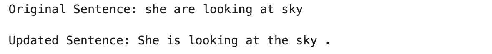
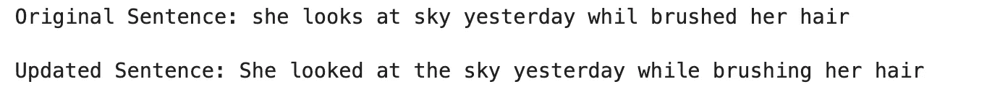
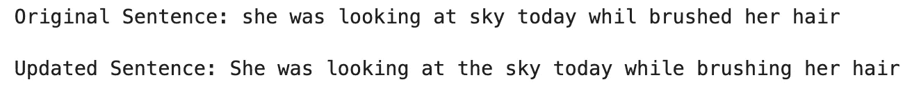
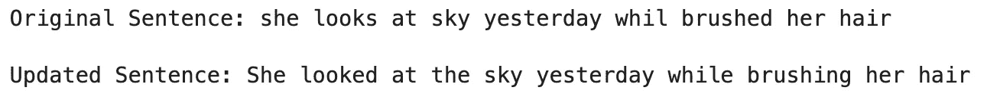
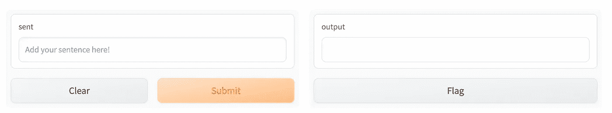
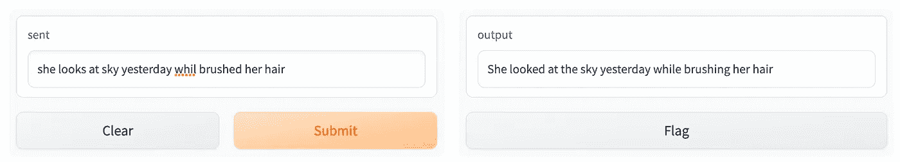

# 基于机器学习的语法纠错——综述与实现

> 原文：<https://towardsdatascience.com/grammatical-error-correction-with-machine-learning-overview-and-implementation-ccd0b50a1700>

## 使用语法纠错:标记，而不是重写(GECTor)


“两个机器人在沙滩上纠正电子邮件中的错别字”，由 [DALL 创作。E 2](https://openai.com/dall-e-2/)

# 1.介绍

自然语言处理(NLP)管道依赖于机器学习模型，这些模型出于各种目的消费、分析和/或转换文本数据。例如，Google Translate 接收一种语言的输入文本，并返回一种目标语言的输出文本(这个任务称为机器翻译)。情感分析算法接收文本数据并确定文本是正面的、负面的还是中性的。文本摘要模型，接收文本输入并将其总结成较小的文本输出。有许多因素可以影响这种模型的性能/输出质量，其中之一是传入文本的质量。具体来说，错误文本形式的噪声会对神经机器翻译模型的结果质量产生不利影响([别林科夫和比斯克，2018](https://arxiv.org/abs/1711.02173) )。因此，在这样的文本数据到达机器翻译、情感分析、文本摘要等的下游任务之前，已经有集中于改进跨 NLP 管道的输入文本数据的语法正确性的努力。

语法纠错模型通常使用两种方法:

1.  序列到序列(seq2seq)文本生成，可以认为是一个翻译引擎，从一种给定的语言翻译到同一种语言，同时纠正语法错误(例如:)袁和 Briscoe，2014 )
2.  序列标记，其中输入文本被标记化、标记，然后映射回正确的标记(例如 [Malmi 等人，2019](https://aclanthology.org/D19-1510/) )

虽然 seq2seq 神经机器翻译方法已被证明实现了最先进的性能(例如 [Vaswani 等人，2017](https://arxiv.org/abs/1706.03762) )，但它仍然存在某些缺点，例如:(1)推理和生成输出需要很长时间，(2)训练需要大量数据，以及(3)与非神经架构相比，模型的神经架构使得结果的解释具有挑战性( [Omelianchuk 等人，2020](https://aclanthology.org/2020.bea-1.16/) )。为了克服这些缺点，我们将在本帖中讨论并实现的方法是一个使用 Transformer 编码器的序列标记器。 [Omelianchuk 等人，2020](https://aclanthology.org/2020.bea-1.16/) 的工作是对合成数据进行预训练。然后分两个阶段对预训练的模型进行微调。一个阶段纯粹包括有错误的语料库，然后第二个微调阶段包括有错误和无错误数据的组合。最终的工作速度是 Transformer seq2seq 系统的十倍，并在 [GitHub](https://github.com/grammarly/gector) 上公开发布。这种方法改善了 seq2seq 模型的推理时间问题，并且可以在给定较小训练数据的情况下实现更高水平的定制，因为它基于预训练模型，但是仍然将可解释性和可解释性作为未来工作的改进机会。

在下一节中，我们将使用这个库实现一种方法来纠正给定句子中的语法错误。然后，我们将创建一个可视化的用户界面来演示结果。

# 2.语法错误纠正—实施

我将把这一部分分成三个步骤:

1.  **准备需求:**这一步包括克隆存储库，下载预先训练好的模型，安装实现语法纠错模型所需的需求。我使用命令行界面(CLI)来完成这些步骤。
2.  **模型实现:**实现并测试语法纠错模型。我在 Jupyter 笔记本上实现了这些步骤。
3.  **用户界面:**创建用户界面，提升用户体验

## 2.1.准备需求

准备需求的第一步是将公开可用的存储库克隆到我们的本地系统中。换句话说，我们将使用以下命令在我们的计算机上创建一个来自 GitHub 的库副本:

```
git clone https://github.com/grammarly/gector.git
```

有三种预先训练好的模型可用。对于练习的这一部分，我们将依赖于使用 [RoBERTa](https://github.com/facebookresearch/fairseq/blob/main/examples/roberta/README.md) 作为预训练编码器的模型，该模型在现有模型中具有最高的总得分。让我们使用以下命令下载预先训练好的模型:

```
wget https://grammarly-nlp-data-public.s3.amazonaws.com/gector/roberta_1_gectorv2.th
```

既然我们已经将模型下载到本地，我将使用以下命令将它移动到“gector”目录，该目录位于我们从 GitHub 克隆的目录中:

```
mv roberta_1_gectorv2.th ./gector/gector
```

接下来，我们将转到适当的目录，使用以下命令开始运行模型:

```
cd ./gector
```

这个包依赖于其他库来执行，所以我们将使用以下命令来安装这些需求:

```
pip install -r requirements.txt
```

现在，我们已经将所有文件放在了正确的位置，可以开始下一步创建语法错误纠正模型了。

## 2.2.实现模型

现在我们已经有了这个模型需要的所有目录和文件，我们将开始使用这个库。我们将采取以下步骤:

1.  导入必要的包
2.  创建模型的实例
3.  在一个有语法错误的句子上测试模型，以查看输出。为此，我们将使用下面的句子:“她正在看天空”。你认为正确的句子是什么？把它写下来，和结果进行比较！

```
# Import libraries
from gector.gec_model import GecBERTModel

# Create an instance of the model
model = GecBERTModel(vocab_path = "./data/output_vocabulary", model_paths = ["./gector/roberta_1_gectorv2.th"])

# Add the sentence with grammatical errors
sent = 'she are looking at sky'

# Create an empty list to store the 
batch = []
batch.append(sent.split())
final_batch, total_updates = model.handle_batch(batch)
updated_sent = " ".join(final_batch[0])
print(f"Original Sentence: {sent}\n")
print(f"Updated Sentence: {updated_sent}")
```

结果:



更新的句子相当惊人！让我们来看看变化:

1.  句首大写的 she 改为 She
2.  将“are”改为“is ”,使“she”和“is”的主谓一致
3.  在“天空”前增加了“the”
4.  在句末加了一个句号

这些都是好的改变，如果我来纠正这个句子，我也会这么做，但是…如果我们有一个更复杂的句子呢？让我们混合时态，看看模型如何执行。

```
# Add the sentence with grammatical errors
sent = 'she looks at sky yesterday whil brushed her hair'

# Create an empty list to store the 
batch = []
batch.append(sent.split())
final_batch, total_updates = model.handle_batch(batch)
updated_sent = " ".join(final_batch[0])
print(f"Original Sentence: {sent}\n")
print(f"Updated Sentence: {updated_sent}")
```

结果:



这个也很有意思。让我们总结一下变化:

1.  句首大写的 she 改为 She
2.  将“看起来”改为“看起来”，现在与“昨天”一致
3.  在“天空”前增加了“the”
4.  将丢失的字母添加到“while”中
5.  把“刷”改成了“刷”，这是“while”之后的预期形式

注意，这个模型决定了动词的时态是过去时。另一种方法可能是决定预期的动词时态存在，并将“昨天”改为“今天”，但是基于训练的数据，模型决定使用过去时态。

现在让我们再看一个例子，看看我们是否可以突破模型的界限，用时态来混淆它:

```
# Add the sentence with grammatical errors
sent = 'she was looking at sky later today whil brushed her hair'

# Create an empty list to store the 
batch = []
batch.append(sent.split())
final_batch, total_updates = model.handle_batch(batch)
updated_sent = " ".join(final_batch[0])
print(f"Original Sentence: {sent}\n")
print(f"Updated Sentence: {updated_sent}")
```

结果:


最后，我们发现了一种极端情况，即模型不能识别正确的动词时态。更新后的句子是关于“今天晚些时候”的，暗示的是将来时，而模型生成的句子是过去式。那么为什么这比以前对模型更有挑战性呢？答案是“今天晚些时候”是在用两个词暗示时间，这需要模型更深层次的上下文感知。请注意，如果没有“稍后”这个词，我们将得到一个完全可以接受的句子，如下所示:



在这种情况下，“今天”可以指今天早些时候(即过去)，这将使语法校正完全可接受。但是在最初的例子中，“今天晚些时候”没有被模型识别为将来时态的指示。一般来说，在各种用例上测试这些模型以了解这些限制是一个很好的实践。

## 2.3.用户界面

现在我们已经看了几个例子，我们将做两个更新来通过用户界面改善用户体验:

1.  创建一个函数，接受一个句子并返回更新后的(即语法正确的)句子
2.  添加易于使用的可视化界面

```
# Define a function to correct grammatical errors of a given sentence
def correct_grammar(sent):
    batch = []
    batch.append(sent.split())
    final_batch, total_updates = model.handle_batch(batch)
    updated_sent = " ".join(final_batch[0])
    return updated_sent
```

让我们在我们的一个句子上测试一下这个功能，确保它能像预期的那样工作。

```
sent = 'she looks at sky yesterday whil brushed her hair'

print(f"Original Sentence: {sent}\n")
print(f"Updated Sentence: {correct_grammar(sent = sent)}")
```

结果:



该函数按预期执行。接下来，我们将添加一个可视化用户界面来改善用户体验。出于这个目的，我们将使用 [Gradio](https://github.com/gradio-app/gradio) ，这是一个开源的 Python 库来创建演示和 web 应用程序，正如我们将在下面看到的。

***提示:*** *如果没有安装，可以用下面的命令安装:*

```
pip install gradio
```

安装 [Gradio](https://github.com/gradio-app/gradio) 后，让我们继续导入和创建用户界面，如下所示:

```
# Import Gradio
import gradio as gr

# Create an instance of the Interface class
demo = gr.Interface(fn = correct_grammar, inputs = gr.Textbox(lines = 1, placeholder = 'Add your sentence here!'), outputs = 'text')

# Launch the demo
demo.launch()
```

结果:



语法纠错模型的用户界面(使用 [Gradio](https://github.com/gradio-app/gradio)

现在我们有了演示界面，让我们再次测试我们的句子，看看它是如何工作的！我们只需在左边的框中键入句子，然后按“提交”。然后，结果将显示在右侧的框中，如下所示:



语法错误纠正模型结果(使用 [Gradio](https://github.com/gradio-app/gradio)

演示工作正常。试一试，测试其他句子，看看效果如何！

# 3.结论

在这篇文章中，我们看到了在现有的 NLP 管道中添加语法纠错模型的好处，比如神经机器翻译。然后，我们回顾了两类目前在文献中使用的方法来解决这一任务。最后，我们使用一个公开可用的库来实现一个预训练的语法错误纠正模型，在几个错误的句子上测试它，找到模型工作良好的地方，也面临一些限制，最后添加一个可视化界面来改善用户体验。

# 感谢阅读！

如果你觉得这篇文章有帮助，请[在媒体](https://medium.com/@fmnobar)上关注我，订阅接收我的最新文章！

[](https://medium.com/@fmnobar/membership) [## 加入我的介绍链接-法扎德 Mahmoodinobar 媒体

### 阅读法扎德(以及媒体上的其他作家)的每一个故事。你的会员费直接支持法扎德和其他…

medium.com](https://medium.com/@fmnobar/membership)