# 图形注意网络:自我注意的解释

> 原文：<https://towardsdatascience.com/graph-attention-networks-in-python-975736ac5c0c>

## 使用 PyTorch 几何图形的带自我注意的 GNNs 指南

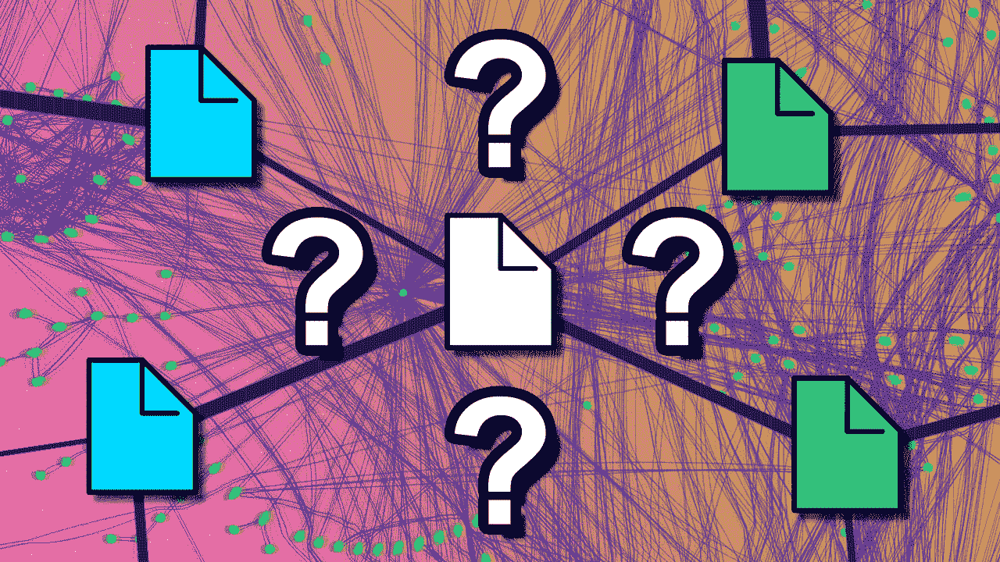

图片由作者提供，文件图标由[open moji](https://openmoji.org/)([CC BY-SA 4.0](https://creativecommons.org/licenses/by-sa/4.0/#))提供

图形注意力网络是**最流行的图形神经网络类型**之一。理由很充分。

在图*卷积*网络(GCN)中，每个邻居都有**相同的重要性**。显然，情况不应该是这样的:有些节点比其他节点更重要。

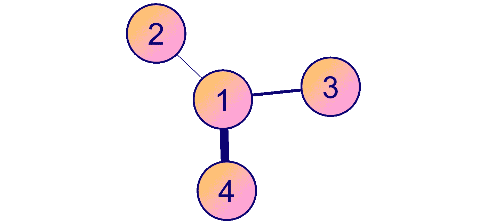

节点 4 比节点 3 重要，节点 3 比节点 2 重要(图片由作者提供)

图表*注意*网络为这个问题提供了一个解决方案。为了考虑每个邻居的重要性，注意机制为每个连接分配一个**加权因子。**

在本文中，我们将看到如何**计算**这些注意力分数，以及如何**在 PyTorch Geometric (PyG)中实现**一个高效的 GAT。你可以用下面的 [Google Colab 笔记本](https://colab.research.google.com/drive/1B0vLpH_gSfrOLgsc2UZVyXrcofzA-t0L?usp=sharing)运行本教程的代码。

# 🌐一.图表数据

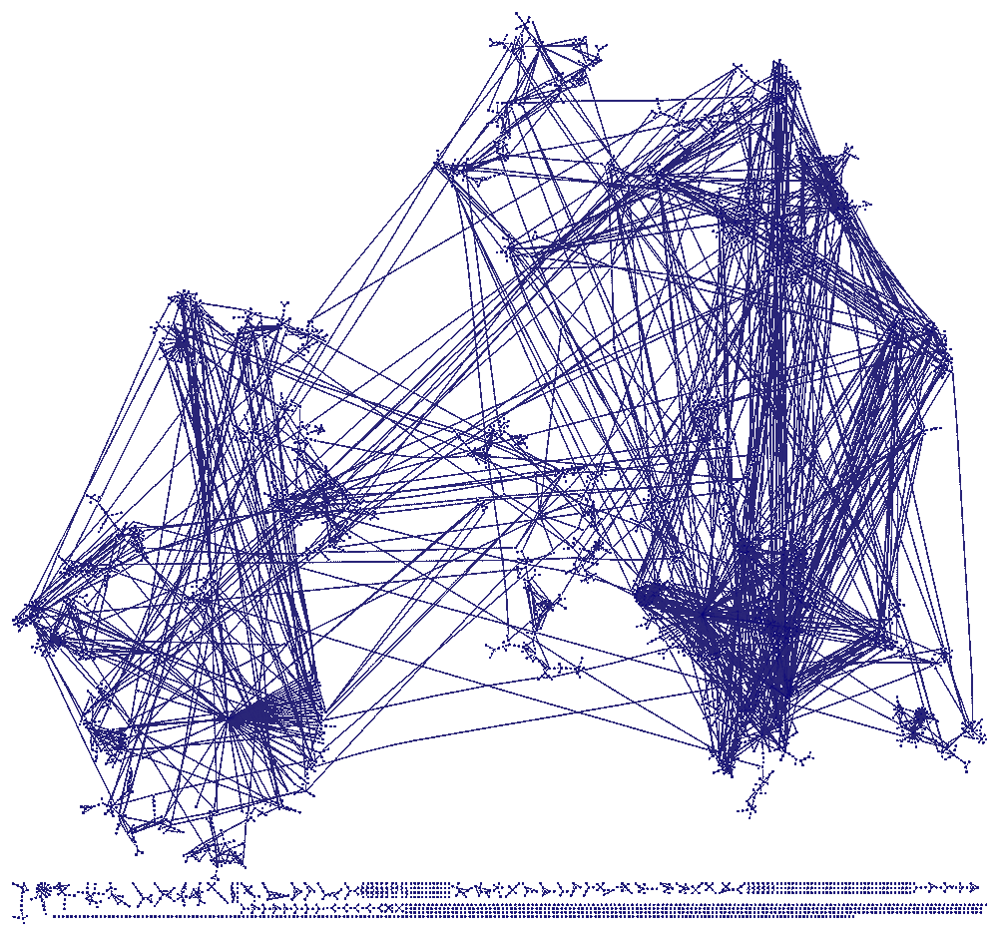

CiteSeer 数据集(图片由作者提供，由 [yEd Live](https://www.yworks.com/yed-live/) 制作)

我们可以在这项工作中使用三个经典的图形数据集(麻省理工学院许可)。它们代表了研究论文的网络，每个连接都是一个引用。

*   [**Cora**](http://www.kamalnigam.com/papers/cora-jnl.pdf) :由 2708 篇属于 7 个类别之一的机器学习论文组成。
    ➡️节点特征表示一篇论文中 1433 个单词的存在(1)或不存在(0)(二进制[包单词](https://en.wikipedia.org/wiki/Bag-of-words_model))。
*   [**CiteSeer**](https://clgiles.ist.psu.edu/papers/DL-1998-citeseer.pdf) :这是一个更大但相似的数据集，包含 3312 篇科学论文，可归为 6 个类别之一。
    ➡️节点特征表示论文中 3703 个单词的存在(1)或不存在(0)。
*   [**PubMed**](http://eliassi.org/papers/ai-mag-tr08.pdf) :这是一个更大的数据集，有来自 PubMed 数据库的 19717 篇关于糖尿病的科学出版物，分为 3 类。
    ➡️节点特征是来自 500 个唯一单词的字典的 [TF-IDF 加权单词向量](https://en.wikipedia.org/wiki/Tf%E2%80%93idf)。

这些数据集已经被科学界广泛使用。作为一项挑战，我们可以使用**多层感知器** (MLPs)、 **GCNs** 和 **GATs** 将我们的准确度分数与在[文献](https://arxiv.org/pdf/1710.10903.pdf)中获得的分数进行比较:

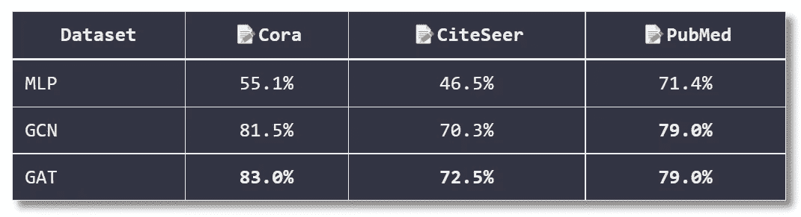

PubMed 非常大，所以处理它和在它上面训练一个 GNN 需要更长的时间。Cora 是文献中研究最多的一个，所以让我们**把 CiteSeer** 作为中间地带。

我们可以用[小行星类](https://pytorch-geometric.readthedocs.io/en/latest/modules/datasets.html#torch_geometric.datasets.Planetoid)将这些数据集直接导入 PyTorch Geometric:

```
Number of graphs: 1
Number of nodes: 3327
Number of features: 3703
Number of classes: 6
Has isolated nodes: True
```

有趣的是，我们有 3327 个节点，而不是 3312 个。我发现 PyG 实际上使用了本文的[CiteSeer 的](https://arxiv.org/pdf/1603.08861.pdf)实现，它也显示 3327 个节点。谜团暂时解开了。

但是，我们观察到**有些节点是孤立的**(准确的说是 48)！正确分类这些孤立的节点将是一个挑战，因为我们不能依赖任何聚合。

让我们用`degree`画出每个节点的连接数:

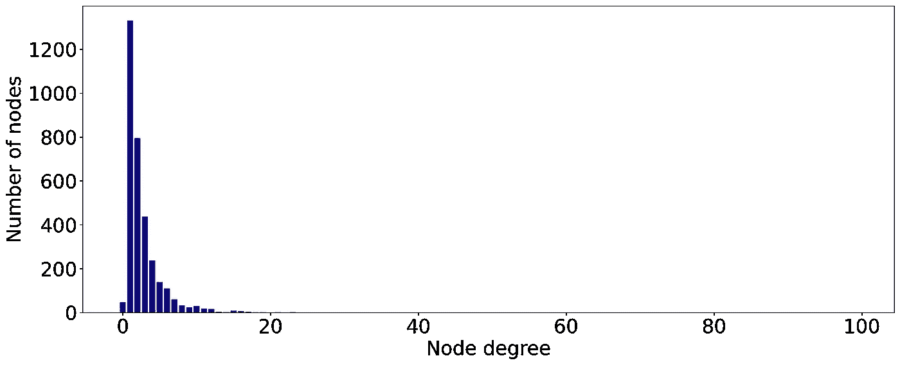

大多数节点只有 **1 或 2 个邻居**。这可以解释为什么 CiteSeer 获得的准确度分数比其他两个数据集低…

# ⚠️二世。自我关注

由[veli kovi 等人](https://arxiv.org/abs/1710.10903)在 2017 年提出，GNNs 中的自我关注依赖于一个简单的想法:**节点不应该都具有相同的重要性**。

我们谈论*自我*——注意力(不仅仅是注意力)，因为输入是相互比较的。

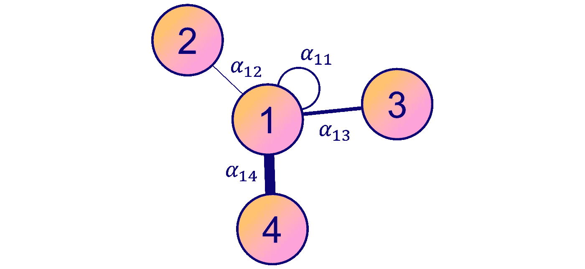

作者图片

该机制为每个连接分配一个**加权因子**(关注分数)。姑且称之为 ***α* ᵢⱼ** 节点 *i* 和 *j* 之间的关注度得分。

以下是如何计算节点 1 的嵌入，其中𝐖是共享权重矩阵:


但是我们如何计算注意力分数呢？我们可以写一个静态公式，但是有一个更聪明的解决方案:我们可以用神经网络来**学习** **他们的值。这个过程有三个步骤:**

1.  **线性变换**；
2.  **激活功能**；
3.  **Softmax 归一化。**

## 1️⃣线性变换

我们想要计算每个连接的**重要性，所以我们需要成对的隐藏向量。创建这些对的一个简单方法是连接两个节点的向量。**

只有这样，我们才能应用一个新的**线性变换**和一个权重矩阵𝐖 **ₐₜₜ** :

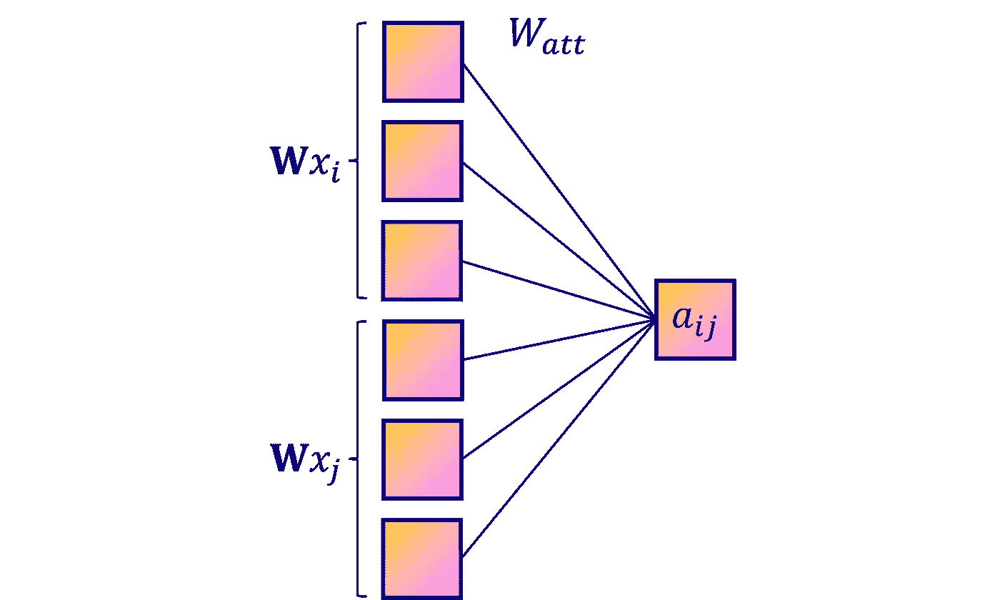

作者图片

## 2️⃣激活函数

我们正在构建一个神经网络，所以第二步是添加一个激活函数。在这种情况下，论文的作者选择了 *LeakyReLU* 函数。

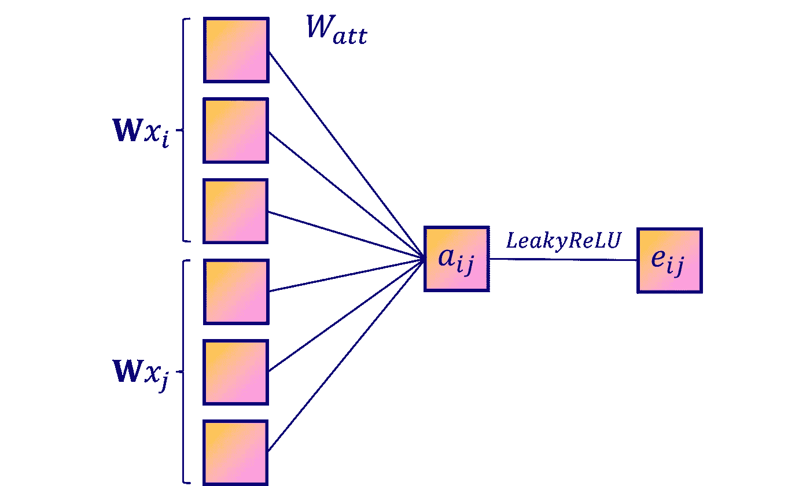

作者图片

## 3️⃣软件最大归一化

我们的神经网络的输出是**而不是归一化的**，这是一个问题，因为我们想要比较这些分数。为了能够说节点 2 对于节点 1 是否比节点 3 更重要(*α*₁₂>t24】α₁₃)，我们需要共享相同的尺度。

使用神经网络的一个常见方法是使用 ***softmax*** 函数。这里，我们将其应用于每个相邻节点:

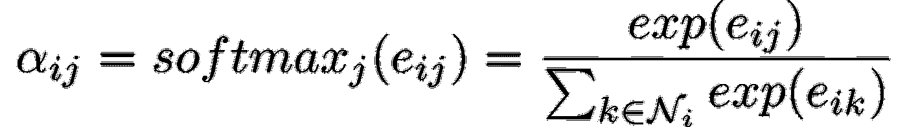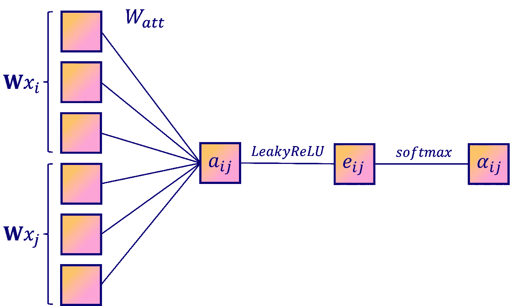

作者图片

现在你知道了:我们可以计算每一个ᵢⱼ.唯一的问题是… **自我关注不是很稳定**。为了提高性能， [Vaswani 等人](https://arxiv.org/abs/1706.03762)在变压器架构中引入了多头关注。

## 4️⃣奖金:多头关注

这只是稍微令人惊讶，因为我们已经谈论了很多关于自我关注的话题，但是，事实上，**变形金刚是伪装的 GNNs**。这就是为什么我们可以在这里重用自然语言处理中的一些思想。

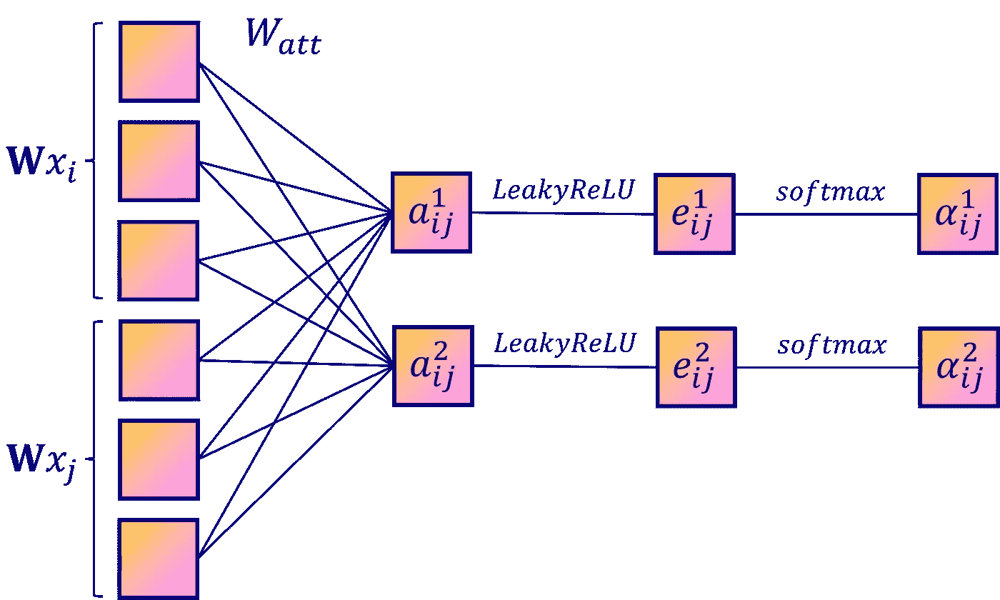

多头关注(图片由作者提供)

在 GATs 中，多头注意力包括**多次重复相同的 3 个步骤**，以便平均或连接结果。就是这样。代替单一的 *h₁* ，我们为每个注意力头得到一个隐藏向量 *h₁ᵏ* 。然后可以应用以下两种方案之一:

*   **平均值**:我们将不同的 *hᵢᵏ* 相加，并通过注意力头数 *n* 将结果归一化；


*   **串联**:我们串联不同的 *hᵢᵏ* 。​


实际上，当它是一个隐藏层时，我们使用**连接方案**，当它是网络的最后一层时，我们使用**平均方案**。

# 🧠三世。图形注意网络

让我们在 PyTorch 几何中实现一个 GAT。这个库有**两个不同的图形关注层** : `GATConv`和`GATv2Conv`。

到目前为止，我们谈论的是`GatConv`层，但在 2021 年 [Brody 等人](https://arxiv.org/abs/2105.14491)通过修改操作顺序引入了一种改进。在串联后应用权重矩阵𝐖**，在*泄漏*函数**后使用**注意力权重矩阵𝐖 **ₐₜₜ** 。总而言之:**

*   `GatConv`:

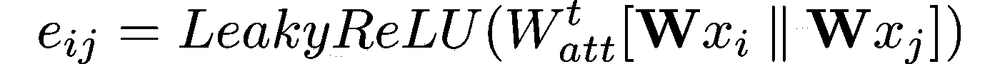

*   `Gatv2Conv`:


你应该用哪一个？根据 Brody 等人的说法，`**Gatv2Conv**` **始终优于** `**GatConv**` ，因此应该首选。

现在让我们对 CiteSeer 的论文进行分类！我试着**大致重现原作者的实验**而不增加太多复杂性。你可以在 GitHub 上找到 GAT [的官方实现。](https://github.com/PetarV-/GAT)

请注意，我们在两种配置中使用图形关注层:

*   **第一层**串接 8 路输出(多头注意)；
*   **第二层**只有 1 个头，产生我们的最终嵌入。

我们还要训练和测试一个 GCN 来比较准确率。

```
GCN(
  (gcn1): GCNConv(3703, 16)
  (gcn2): GCNConv(16, 6)
)Epoch   0 | Train Loss: 1.782 | Train Acc:  20.83% | Val Loss: 1.79 
Epoch  20 | Train Loss: 0.165 | Train Acc:  95.00% | Val Loss: 1.30 
Epoch  40 | Train Loss: 0.069 | Train Acc:  99.17% | Val Loss: 1.66 
Epoch  60 | Train Loss: 0.053 | Train Acc:  99.17% | Val Loss: 1.50 
Epoch  80 | Train Loss: 0.054 | Train Acc: 100.00% | Val Loss: 1.67 
Epoch 100 | Train Loss: 0.062 | Train Acc:  99.17% | Val Loss: 1.62 
Epoch 120 | Train Loss: 0.043 | Train Acc: 100.00% | Val Loss: 1.66 
Epoch 140 | Train Loss: 0.058 | Train Acc:  98.33% | Val Loss: 1.68 
Epoch 160 | Train Loss: 0.037 | Train Acc: 100.00% | Val Loss: 1.44 
Epoch 180 | Train Loss: 0.036 | Train Acc:  99.17% | Val Loss: 1.65 
Epoch 200 | Train Loss: 0.093 | Train Acc:  95.83% | Val Loss: 1.73 

**GCN test accuracy: 67.70%** 
CPU times: user 25.1 s, sys: 847 ms, total: 25.9 s
Wall time: **32.4 s**
```

```
GAT(
  (gat1): GATv2Conv(3703, 8, heads=8)
  (gat2): GATv2Conv(64, 6, heads=1)
)Epoch   0 | Train Loss: 1.790 | Val Loss: 1.81 | Val Acc: 12.80%
Epoch  20 | Train Loss: 0.040 | Val Loss: 1.21 | Val Acc: 64.80%
Epoch  40 | Train Loss: 0.027 | Val Loss: 1.20 | Val Acc: 67.20%
Epoch  60 | Train Loss: 0.009 | Val Loss: 1.11 | Val Acc: 67.00%
Epoch  80 | Train Loss: 0.013 | Val Loss: 1.16 | Val Acc: 66.80%
Epoch 100 | Train Loss: 0.013 | Val Loss: 1.07 | Val Acc: 67.20%
Epoch 120 | Train Loss: 0.014 | Val Loss: 1.12 | Val Acc: 66.40%
Epoch 140 | Train Loss: 0.007 | Val Loss: 1.19 | Val Acc: 65.40%
Epoch 160 | Train Loss: 0.007 | Val Loss: 1.16 | Val Acc: 68.40%
Epoch 180 | Train Loss: 0.006 | Val Loss: 1.13 | Val Acc: 68.60%
Epoch 200 | Train Loss: 0.007 | Val Loss: 1.13 | Val Acc: 68.40%

**GAT test accuracy: 70.00%** 
CPU times: user 53.4 s, sys: 2.68 s, total: 56.1 s
Wall time: **55.9 s**
```

这个实验并不是超级严格的:我们需要**重复 *n* 次**，取平均精度和标准偏差作为最终结果。

在这个例子中，我们可以看到 **GAT 在精度方面优于 GCN**(70.00%对 67.70%)，但训练时间更长(55.9 秒对 32.4 秒)。在处理大型图形时，这种折衷会导致可伸缩性问题。

作者获得了 GAT 的 72.5%和 GCN 的 70.3%，这明显优于我们所做的。这种差异可以通过**预处理**、模型中的一些**调整、**和不同的**训练设置**来解释(例如，*耐心为 100，而不是固定的周期数)。*

让我们想象一下猫学到了什么。我们将使用 [t-SNE](https://en.wikipedia.org/wiki/T-distributed_stochastic_neighbor_embedding) ，这是一种在 2D 或 3D 中绘制高维数据的强大方法。首先，让我们看看在任何训练之前嵌入是什么样子的:它应该是绝对**随机的**，因为它们是由随机初始化的权重矩阵产生的。

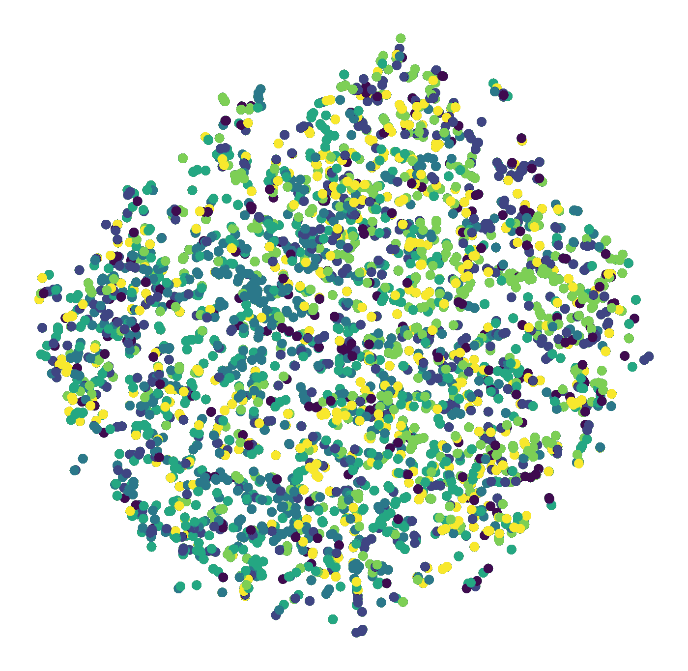

的确，这里没有**没有明显的结构**。但是由我们训练的模型产生的嵌入看起来更好吗？

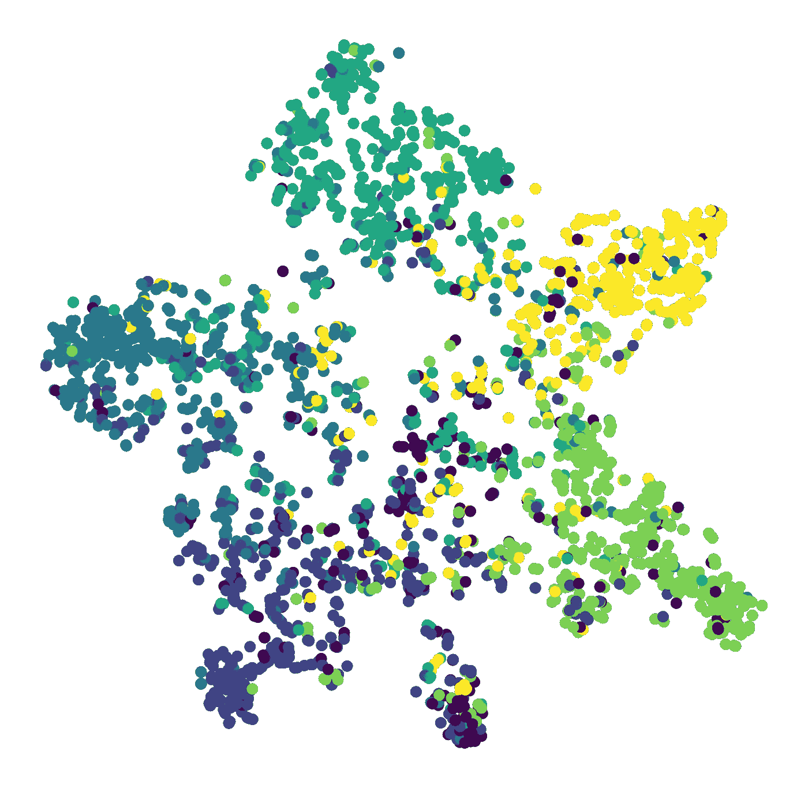

区别是显而易见的:**属于相同类的节点聚集在一起**。我们可以看到 6 组，对应于 6 类论文。有异常值，但这是意料之中的:我们的准确度分数远非完美。

之前，我推测连接不良的节点可能会对 CiteSeer 上的**性能产生负面影响。让我们计算每一个度数的模型精度。**

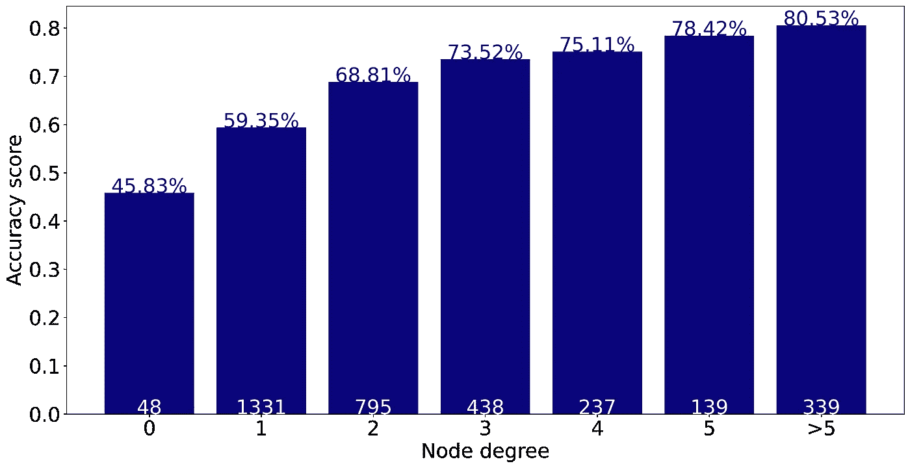

这些结果证实了我们的直觉:邻居少的节点确实**更难分类**。这是由 GNNs 的性质决定的:你拥有的相关连接越多，你能聚集的信息就越多。

# 结论

虽然 GATs 需要更长的训练时间，但在准确性方面比 gcn 有了很大的提高。自关注机制自动计算加权因子而不是静态系数，以产生更好的嵌入。在这篇文章中，

*   我们了解了应用于 GNNs 的**自我关注**机制；
*   我们在 PyTorch Geometric 中实现并**比较了**两个架构(一个 GCN 和一个 GAT)；
*   我们用一个 t-SNE 图和每一个学位的准确度分数形象化了 GAT 如何学习和学习什么；

《服务贸易总协定》是许多 GNN 申请中事实上的标准。然而，当应用于大规模图形数据集时，它们的**缓慢的训练时间**会成为一个问题。可扩展性是深度学习的一个重要因素:通常情况下，更多的数据可以带来更好的性能。

在下一篇文章中，我们将看到**如何使用迷你批处理和一个名为 GraphSAGE 的新 GNN 架构来提高可伸缩性**。

如果你喜欢这个教程，请随时在 Twitter 上关注我，了解更多关于 GNN 的内容。谢谢大家，下一篇文章再见！📣

# 相关文章

</introduction-to-graphsage-in-python-a9e7f9ecf9d7>  </how-to-design-the-most-powerful-graph-neural-network-3d18b07a6e66> 