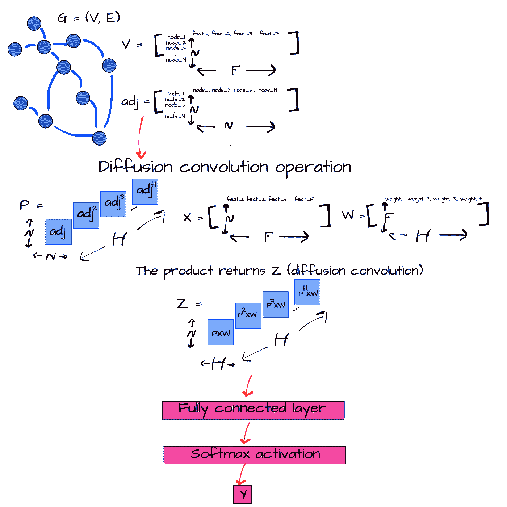
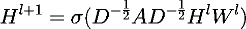
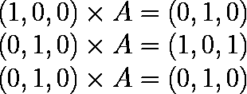
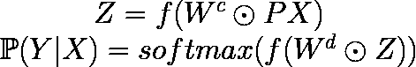

# 图形神经网络:2008 年以来的学习之旅——扩散卷积神经网络

> 原文：<https://towardsdatascience.com/graph-neural-networks-a-learning-journey-since-2008-diffusion-convolutional-neural-networks-329d45471fd9>

图中邻接矩阵的真正威力是什么？什么是扩散卷积？请跟随我探索图形和机器学习的新冒险，探索 DCNN 理论

图片由[杰里米·贝赞格](https://unsplash.com/@jeremybezanger)在 [Unsplash](https://unsplash.com/photos/XyoEsSW6UG8) 上拍摄

我以前关于图形和 ML 的帖子:

*   [图形神经网络:2008 年以来的学习之旅——第一部分](/graph-neural-networks-a-learning-journey-since-2008-part-1-7df897834df9?source=your_stories_page----------------------------------------)
*   [图形神经网络:2008 年以来的学习之旅——第二部分](/graph-neural-networks-a-learning-journey-since-2008-part-2-22dbf7a3b0d?source=your_stories_page----------------------------------------)
*   [图形神经网络:2008 年以来的学习之旅——深度行走](/graph-neural-networks-a-learning-journey-since-2008-deep-walk-e424e716070a?source=your_stories_page----------------------------------------)
*   [图形神经网络:2008 年以来的学习之旅——Python&深度行走](/graph-neural-networks-a-learning-journey-since-2008-python-deep-walk-29c3e31432f?source=your_stories_page----------------------------------------)
*   [图神经网络:2008 年以来的学习之旅——图卷积网络](/graph-neural-networks-a-learning-journey-since-2008-graph-convolution-network-aadd77e91606)
*   [图神经网络:2008 年以来的学习之旅——Python&图卷积网络](/graph-neural-networks-a-learning-journey-since-2008-python-graph-convolutional-network-5edfd99f8190)

*通过我的推荐链接支持我的写作加盟媒介:*

 [## 通过我的推荐链接加入 Medium-Stefano Bosisio

### 作为一个媒体会员，你的会员费的一部分会给你阅读的作家，你可以完全接触到每一个故事…

medium.com](https://medium.com/@stefanobosisio1/membership) 

在这个系列中，我们正在跟踪和研究机器学习算法处理图的演变[1，2]。图表可以以非常简洁的方式存储大量信息[3–6]，它们可以用于根据人们的社会关系评估人群[7–9]或利用简单线性分析无法检测的潜在特征[10]。另一方面，图形是复杂的数学结构[11，12]，它们的输入信号不能在网格上描述，并且很难定义主要的局部统计，除非我们对节点的邻居进行平均。由于这些原因，卷积神经网络[13–15]等强大的最大似然算法的应用有时很复杂，需要了解图形的数学基础。

[在上一篇帖子中，我们学习了 Kipf 和布鲁纳的卷积神经网络](/graph-neural-networks-a-learning-journey-since-2008-graph-convolution-network-aadd77e91606)【11，12】，突出了一个图的谱分析和卷积运算之间的关系。今天我们将继续这项研究，分析 Atwood 和 Towsley 关于扩散卷积神经网络的论文[16，17]。在这种方法中，作者利用邻接矩阵和频谱分析之间的关系，利用邻接矩阵的内在属性，得出马尔可夫链公式[18–20]。

# 扩散卷积神经网络

扩散卷积神经网络(DCNN)通过学习“过滤器”来解决图形分类问题，这些过滤器通过扩散过程总结局部信息。这些信息是通过利用邻接矩阵属性获得的图的潜在表示来检索的。最后的算法大量使用张量运算，它需要一种稀疏表示，以允许 DCNN 处理数百万或数十亿节点的图形。

图 DCNN 的总结。根据图的邻接矩阵，我们可以计算从一个起始节点到给定 H 跳的最终节点的概率转移张量。这个张量反映了邻接矩阵的相同特征以及节点之间的“扩散”行为。张量 P、输入特征 X 和神经网络权重之间的乘积给出了扩散卷积层 z。该层可被完全连接的层接收，以返回输入图上的预测。

从 GCN 及其理论[21–25]中，我们了解到图的拉普拉斯描述与傅立叶变换密切相关。从这里，我们可以通过将自连接邻接矩阵 *A* 与节点的特征相乘来直接获得卷积运算，为图定义一个卷积神经网络层:

等式 1: l+1 卷积层的 l+1 激活矩阵，其被用作图形卷积神经网络(GCN)算法的传播规则

其中 *H* 是第*l*或*l+1*层的激活矩阵，σ是类似于 *ReLu* 的激活函数， *D* 是图度矩阵， *A* 是自连接邻接矩阵， *W* 是层特定的可训练权重矩阵。

从这个基本计算出发，阿特伍德和陶斯利在卷积运算中加入了扩散。这种扩散允许节点“浏览”它们的邻居，并考虑来自它们的社会影响——这是 GCN 和 DeepWalk 的一种混合。然而，我们如何在一个图上添加扩散呢[26]？让我们考虑一个简单的 3 个顶点的图和它们的邻接矩阵(图 2)

图 2:一个简单的 3 顶点图及其邻接矩阵 A

每个顶点都可以与这些坐标相关联: *(1，0，0)* 表示 *v1* ， *v2* ， *(0，0，1)* 表示 *v3* 。如果我们把顶点乘以邻接矩阵，我们就能得到它的邻居的视图:

图 3:顶点邻接矩阵乘法返回给定顶点的邻居

图 3 显示，如果我们从*顶点 1* 开始，我们可以跳到*顶点 2，*对于*顶点 2* 我们可以跳到 *v1* 或 *v3* ，从*顶点 3* 我们可以跳到*顶点 2* 。现在，如果我们多次应用邻接矩阵会怎么样？我们以 *v2* 为例。 *v2* 和 *A* 之间的乘积返回两次 *v2* ，即如果我们沿着图中从 *v2* 开始的路径走两次，我们将返回到 *v2* 。因此，我们可以陈述这个定理:*给定邻接矩阵 a 的幂 h，Aʰ(i，j)等于长度正好为 h 的图 g 中从 I 到 j 的路径数。*这意味着邻接矩阵 *A* 的幂 *h* 给了我们一个图，该图给出了每个起始顶点在 *h* 跳中的去向——因此我们在图上是“扩散”的。

我们能给这个公式增加一点概率吗？我们当然可以！如果我们对邻接矩阵进行归一化，我们将获得一个转移矩阵，即给定一些跳数，从节点 *i* 到节点 *j* 的概率 *h.* 这里应该有一个铃声在你脑海中响起，让你思考马尔可夫链。这里的归一化邻接矩阵可以充当转移概率矩阵，就像在马尔可夫链过程中一样。这个矩阵的力量可以给我们一个关于如何在图上扩散每个顶点的想法。

现在可以将卷积运算与扩散概念结合起来。如图 1 所示，扩散卷积算子可以认为是*转移概率张量 P，*与输入节点特征矩阵 *X* 和层随机初始化权重矩阵 *W 的乘积，P* 是一个*N×H×N*张量， *X* 是一个 *N x F* 矩阵，而 *W* 是一个 *F x N* 矩阵，其中 *N* 是节点数， *H* 是跳数(或邻接矩阵的幂)，而 *F* 是输入特征数。 最终的扩散卷积算子 *Z* 是一个 *N x H x H* 张量。这个张量可以被一个完全连接的神经网络层摄取，其输入节点与存储在张量中的矩阵一样多。然后可以通过 *softmax* 激活处理完全连接层的结果，以返回概率标签 *Y.*

总之，等式 2 报告了在 DCNNs 中执行的操作。首先，根据转移概率矩阵 P 和输入特征计算扩散卷积层 Z。然后，通过对来自完全连接的神经网络的输出的 softmax 激活来产生概率，该神经网络已经摄取了 z。

等式 DCNNs 操作总结。最初，根据输入概率转移张量 P 和节点特征 x 计算扩散卷积算子 Z。最后，在全连接层输出上，通过 softmax 激活返回概率预测。

今天就到这里吧！请继续关注我们的下一篇文章，在那里我们将编写 Python 代码来实现 DCNNs！

如果有任何问题或意见，请随时给我发电子邮件，地址是:stefanobosisio1@gmail.com，或者直接在 Medium 这里。

# 文献学

1.  克劳德·贝尔热。*图论*。快递公司，2001 年。
2.  弗朗西斯·安斯科姆，《统计分析中的图表》美国统计学家 27.1(1973):17–21。
3.  沃索伊，索罗什，德布罗伊和西南阿拉尔。"真假新闻在网上的传播."*理科*359.6380(2018):1146–1151。
4.  维拉、何塞和约兰达·戈麦斯。"从图表中提取商业信息:眼球追踪实验."*商业研究杂志*69.5(2016):1741–1746。
5.  特鲁科，欧内斯特。"关于图的信息量的一个注记."数学生物物理学通报 18.2(1956):129–135。
6.  González-Díaz，Humberto，et al .〈基于分子图和社会网络信息指数的美国县级抗 HIV 药物活性与艾滋病流行率的人工神经网络多尺度模型〉。*化学信息与建模杂志*54.3(2014):744–755。
7.  尹，郝，等，“局部高阶图聚类”第 23 届 ACM SIGKDD 知识发现和数据挖掘国际会议论文集。2017.
8.  拉蒂根，马修 j，马克梅尔和大卫·延森。"用网络结构指数进行图聚类."第 24 届机器学习国际会议论文集。2007.
9.  张，邓杰，陈金印，陆。"区块链钓鱼诈骗检测通过多通道图分类."*区块链和可信系统国际会议*。新加坡斯普林格，2021。
10.  佩罗齐、布莱恩、拉米·艾尔弗和史蒂文·斯基纳。"深度行走:社交表征的在线学习."*第 20 届 ACM SIGKDD 知识发现和数据挖掘国际会议论文集*。2014.
11.  基普夫，托马斯 n，和马克斯韦林。"图卷积网络的半监督分类." *arXiv 预印本 arXiv:1609.02907* (2016)。
12.  琼·布鲁纳等着《图上的谱网络和深局部连通网络》*第二届国际学习代表大会，ICLR* 。第 2014 卷。2014.
13.  阿尔巴维、萨阿德、塔里克·阿贝德·穆罕默德和萨阿德·扎维。"了解卷积神经网络." *2017 国际工程与技术大会(ICET)* 。Ieee，2017。
14.  卡尔·布伦纳、纳尔、爱德华·格雷芬斯特特和菲尔·布伦松。"一个用于建模句子的卷积神经网络." *arXiv 预印本 arXiv:1404.2188* (2014)。
15.  克里日夫斯基、亚历克斯、伊利亚·苏茨基弗和杰弗里·e·辛顿。"使用深度卷积神经网络的图像网络分类."*神经信息处理系统进展*25(2012):1097–1105。
16.  阿特伍德，詹姆斯和唐·陶斯利。"扩散卷积神经网络."*神经信息处理系统的进展*。2016.
17.  稀疏扩散-卷积神经网络。 *arXiv 预印本 arXiv:1710.09813* (2017)。
18.  叶，侬。"用于异常检测的时间行为的马尔可夫链模型."2000 年 IEEE 系统、人和控制论信息保证和安全研讨会会议录。第 166 卷。纽约西点军校，2000 年。
19.  海因斯布莱恩。"马尔可夫链中的第一个环节."*美国科学家* 101.2 (2013): 252。
20.  奥雷，史蒂文。*马尔可夫链转移概率的极限定理*。伦敦:范·诺斯特朗，1971 年。
21.  学习分子指纹的图形卷积网络。 *arXiv 预印本 arXiv:1509.09292* (2015)。
22.  哈蒙德、大卫·k、皮埃尔·范德盖恩斯特和雷米·格里邦瓦尔。"通过谱图论研究图上的小波."*应用和计算谐波分析*30.2(2011):129–150。
23.  学习仿射变换。*模式识别*32.10(1999):1783–1799。
24.  李，文静，和唐利。"仿射不变匹配的 Hopfield 神经网络."《IEEE 神经网络汇刊》12.6(2001):1400–1410。
25.  离散傅立叶变换和卷积的算法。斯普林格，1989 年。
26.  邻接矩阵的好资源在这里:[https://www . bowaggoner . com/courses/2019/csci 5454/docs/spectral . pdf](https://www.bowaggoner.com/courses/2019/csci5454/docs/spectral.pdf)