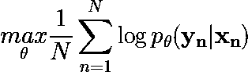
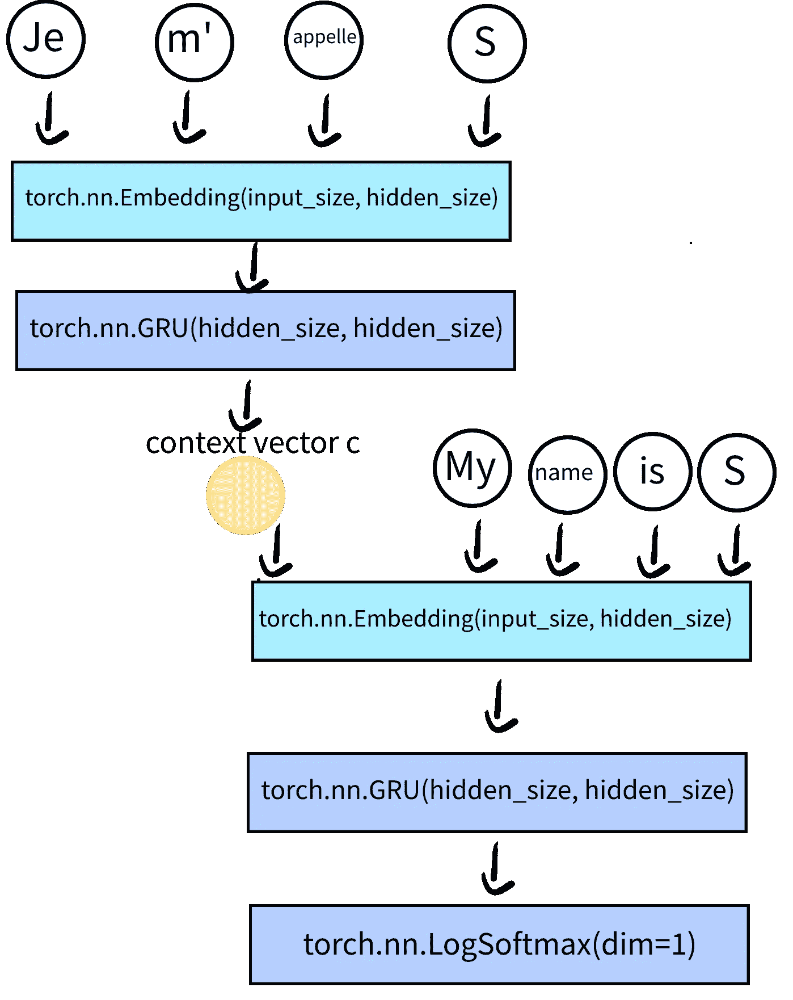
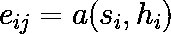
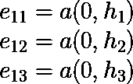
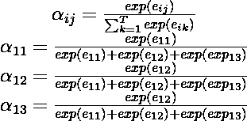
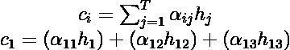
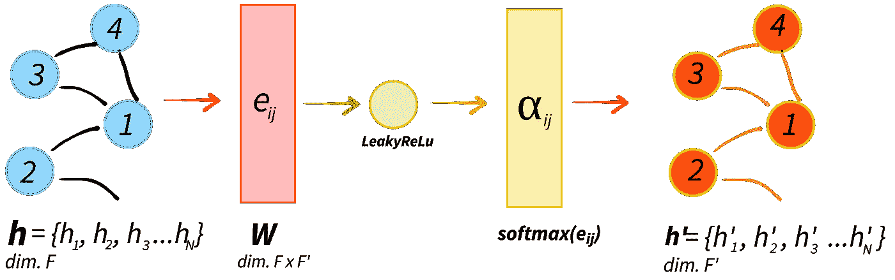
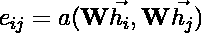
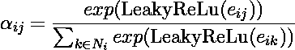

# 图形神经网络:2008 年以来的学习之旅——图形注意网络

> 原文：<https://towardsdatascience.com/graph-neural-networks-a-learning-journey-since-2008-graph-attention-networks-f8c39189e7fc>

## 今天我们将深入研究图形注意力网络(GAT)的理论和实现。一言以蔽之:关注摇滚，图表摇滚，GAT 的作者摇滚！

图片由 [Unsplash](https://unsplash.com/photos/Q4RuIsRuMcs) 上的 [Pascale Amez](https://unsplash.com/@pascale_amez) 拍摄

*通过我的推荐链接加入 Medium 来支持我的写作和项目:*

  

我以前关于图和 M 的帖子

*   [图形神经网络:2008 年以来的学习之旅——第一部分](/graph-neural-networks-a-learning-journey-since-2008-part-1-7df897834df9?source=your_stories_page----------------------------------------)
*   [图形神经网络:2008 年以来的学习之旅——第二部分](/graph-neural-networks-a-learning-journey-since-2008-part-2-22dbf7a3b0d?source=your_stories_page----------------------------------------)
*   [图形神经网络:2008 年以来的学习之旅——深度行走](/graph-neural-networks-a-learning-journey-since-2008-deep-walk-e424e716070a?source=your_stories_page----------------------------------------)
*   [图形神经网络:2008 年以来的学习之旅——Python&深度行走](/graph-neural-networks-a-learning-journey-since-2008-python-deep-walk-29c3e31432f?source=your_stories_page----------------------------------------)
*   [图形神经网络:2008 年以来的学习历程——图形卷积网络](/graph-neural-networks-a-learning-journey-since-2008-graph-convolution-network-aadd77e91606)
*   [图神经网络:2008 年以来的学习之旅——Python&图卷积网络](/graph-neural-networks-a-learning-journey-since-2008-python-graph-convolutional-network-5edfd99f8190)
*   [图形神经网络:2008 年以来的学习之旅——扩散卷积神经网络](/graph-neural-networks-a-learning-journey-since-2008-diffusion-convolutional-neural-networks-329d45471fd9)

欢迎回到我的图形神经网络系列。今天我要向大家介绍一个最伟大的图形神经网络框架下的基础理论:图注意力网络(GAT)[1]由 Velickovic，Cucurull，Casanova，Romero，莉雅和 Bengio 于 2018 年发表(你应该只听到这些名字就起鸡皮疙瘩！)这种 ML-graph 方法有什么新的地方？我们来分析一下前几集看到的内容。

最初，Gori 和 Scarselli[5–9]提出了图形神经网络(GNNs ),其中递归神经网络被推广为直接与图形对象交互。gnn 基于 Banach 不动点定理。一旦达到平衡，运行神经网络以返回输出。相比之下，GNN 不能利用表征学习，其可扩展性非常有限，由于收敛问题。

我们看到的另一种方法是 Perozzi 在 2014 年提出的 Deep Walk [6]及其在 2017 年的演变[7]。深度行走标志着节点嵌入的概念，即通过 skip gram[8–12]获得的节点的潜在表示(或社会表示)。这个模型在半无人监督的模式下工作，尽管可扩展性和表示学习可能仍有问题。

因此，已经提出了进一步的图形神经网络框架。谱方法[13–17]，其中图形拉普拉斯表示、特征值分解和卷积是关键要素。卷积可以通过扩散概念来进一步利用。在这种方法[18–22]中，算法学习每个节点的特定权重矩阵，计算转换矩阵的幂来描述节点的邻域。虽然这些技术非常成功，但它们直接依赖于拉普拉斯的特征基，限制了我们可以研究的图形种类。因此，一旦我们将我们的模型训练到一个特定的图，我们就不能使用这个模型在不同的结构图上运行预测。

在 GAT 中，作者强调了注意力的力量。注意力算法直接来源于神经机器翻译问题或序列对序列(Seq2Seq)。如果我从法语翻译成英语，我将不得不考虑输入和输出序列之间的长度差异，以及在给定词汇和目标序列的情况下我可以使用的最佳术语。注意力不仅可以解决不同长度的问题，还可以检测输入的最相关部分，以优化和最大化给定输入序列的输出概率。

现在让我们跳到注意力是如何工作的，以及一切是如何开始的。

# 注意:什么？谁啊。在哪里？什么时候？为什么？

注意力算法起源于 Cho 的 RNN 编码器-解码器模型[14]。作者正在寻找一种有效的方法来改进 seq2seq 翻译的 ML 模型。编码器-解码器模型是递归神经网络(RNN)的堆叠组合。编码器将符号序列编码成固定长度的向量表示，而解码器以另一种符号范例对给定的表示进行解码。

图 1 显示了 Cho 算法的工作原理。给定输入序列 **x** (例如`Je m'appelle S`)，该模型试图最大化目标序列 **y:** 的条件对数似然

等式 1:给定输入序列 x 和目标序列 y，RNN 编码器-解码器试图最大化条件对数似然

输入序列用大小为`hidden_size`的嵌入层解码，然后在 GRU 单元中处理。GRU 的隐藏状态，称为`context_vector`，与目标序列一起被提供给解码器。解码器将输入序列和上下文向量一起投影到嵌入空间。最后，一个 GRU 和一个线性层在 **x** 和 **y** 之间创建一个映射

图 Cho 的 RNN 编码器-解码器模型的逻辑示意图。编码器对输入序列进行消化。编码器的隐藏状态与目标序列一起被用作解码器的输入，以便找到序列到序列的正确映射。

图 2 显示了如何在 Pytorch 中对 Cho 的编码器和解码器进行编码的示例代码。一个关键的区别是解码器类将在嵌入的目标空间中映射输入。

图 Cho 的 RNN 模型的编码器和解码器的示例代码。这两个模型都依赖于嵌入层和 GRU。

Keras 提供了进一步的可视化帮助，我们可以用一种简单的方式对这个模型进行编码，以显示输入信息是如何处理的:

图 Cho 的 RNN 编码器-解码器的 Keras 实现。在这里，您可以进一步看到当将编码器 GRU 的隐藏状态传递给解码器时，注意力是如何被触发的。

2016 年晚些时候，Bahdanau 扩展了 Cho 的模型[26，28]，用*比对分数构建了注意力算法。*校准分数进一步增强了编码器的输出，定义了它与给定输出的匹配程度*:

*   每个编码器的 GRU 输入 *x₁、x₂、x₃* …都有各自的隐藏状态 *h₁、h₂、h₃*
*   解码器开始计算比对分数，例如 e *₁₁* ，e *₁₂* ，e *₁₃* (等式 2)。校准分数是通过函数 *a —* 通常是前馈线性神经网络来定义的，该函数作用于解码器的输出状态 *s* 和编码器的输出 *h.*

等式 2:对准分数被定义为作用于解码器的输出状态 s 和编码器的输出 h 的函数 a

*   在第一步，解码器输出为 0，因此校准分数定义为:

等式 3:第一次迭代中的对齐分数，其中解码器的输出为 0。

*   *是简单的`pytorch.nn.Linear`前馈神经网络，其输出α 然后用 softmax 函数(等式 4)归一化:*

**

*等式 4:来自神经网络的一般 softmax-ed 输出以及等式 3 的 3 个输入的示例*

*   *然后，归一化对齐分数被用于更新输出编码器的上下文向量 c，并被注入到解码器 GRU 中:*

**

*等式 5:输出对齐权重用于将每个上下文向量与给定目标对齐*

*   *循环重复，新解码器的输出 *s* 用于计算比对分数*

*通过添加由前馈神经网络、softmax 和注意权重/对齐分数与编码器输出之间的矩阵乘法组成的注意层，可以在 PyTorch 中将该方案容易地应用于 Cho 的模型(图 2 ):*

*图 4:在 Cho 的 RNN 编码器-解码器中添加注意层。*

*总之，Bahdanau 的方法旨在将编码器的所有隐藏状态传递给 RNN 解码器，并进一步将注意力/对准分数层应用于解码器架构。从这里我们可以开始研究图形注意力网络算法*

# *图形注意网络*

*从 Bahdanau 的注意力方法开始，Velickovic 等人开始使用图形注意力网络框架——然而，我必须强调，GAT 对注意力机制的特定选择是不可知的。现在，让我们考虑一个有 *N* 个节点的图，每个节点有 *F* 个特征。这里注意机制的整体过程是摄取一组节点特征**(维度为 *F* )并返回这些特征的一个输出表示**'*(维度为 *F'* )。要素的输出表示将调用一些潜在要素，这允许网络在节点级别运行预测。****

****

**图 GAT 工作流程和注意力的示意图。**

**图 5 报告了 GAT 的作用方案。节点共享一个权重矩阵***W*** ，其维数为*FxF’。*权重矩阵 ***W*** 与每个节点的特征矩阵相乘以执行第一线性变换。它遵循第二线性变换，通过*自关注*机制，通过应用前馈神经网络 *a，*返回*关注系数 e:***

****

**等式 6:表示节点 j 的特征对节点 I 的重要性的关注系数**

**从 *a* 输出的注意系数在到达 softmax 层之前通过 LeakyReLu。softmax 在节点 *j* 的特征上被归一化，以使所有系数在不同节点之间容易比较:**

****

**等式 7:相对于节点 j 特征的归一化(softmax)关注系数**

**最后，应用非线性 *σ* 得到最终的特征描述***h’***。为了进一步稳定自我注意机制中的学习过程，作者扩展了该算法以使用*多头注意。*这种方法包括在图表的不同部分运行多个注意力层，以便掌握一些长期的依赖关系。长程相关性是指相距很远的节点之间的关系。最终的特征集合可以连接在一起，并且如 GAT 的论文中所提议的，进行平均以返回最终节点的预测。这种平均过程突出了 GAT 的输出是来自目标节点邻域的聚集信息。**

**现在让我们看看如何在 PyTorch 中实现 GAT 方法，而在下一个故事中，我们将处理数据集和预测以及优化 GAT 的技巧！**

# **加特&皮托奇**

**图 6 显示了 GAT 核心部分的简单 PyTorch 实现。在`call`函数中，GAT 接收节点的特征和边(`input`)作为输入，报告图形结构信息。输入节点状态/特征最初乘以权重矩阵 **W** 以执行第一线性变换:`node_states_transformed = tf.matmul(node_states, self.kernel)`。将转换后的状态与结构信息`node_states_expanded`收集在一起，并从那里运行进一步的线性转换以获得关注系数:`attention_scores = tf.nn.leaky_relu(tf.matmul(node_states_expanded, self.kernel_attention))`。**

**图 PyTorch 中注意机制的实现**

**最后，softmax 被应用到`attention_scores`(第 70–79 行)，来自关注层的邻域特征信息被返回到主函数。**

**第二个最重要的一点是实现了*多头关注。*该类定义了并行运行的关注层的数量，以及关注层单元。最终输出是所有串联注意力输出的平均值:`tf.reduce_mean(tf.stack(outputs, axis=-1), axis=-1)`。**

**图 7:多头注意力的实现**

**让我们以 GAT 的最终实现来结束这个故事，对算法有一个全面清晰的了解:**

**图 GAT 模型的最终代码。**

**今天到此为止，请在下一个故事中欣赏我，我们将把 GAT 应用于数据集，看看 GAT 的真正威力是什么:)**

**如果有任何问题或意见，请随时给我发电子邮件，地址是:stefanobosisio1@gmail.com，或者直接在 Medium 这里。**

# **文献学**

1.  **《图形注意网络》 *arXiv 预印本 arXiv:1710.10903* (2017)。**
2.  **《图形神经网络模型》 *IEEE 神经网络汇刊*20.1(2008):61–80。**
3.  **《图形神经网络的计算能力》IEEE 神经网络汇刊 20.1(2008):81–102。**
4.  **《网页排序的图形神经网络》。*2005 年 IEEE/WIC/ACM 网络智能国际会议(WI'05)* 。IEEE，2005 年。**
5.  **哥里、马尔科、加布里埃尔·蒙法迪尼和佛朗哥·斯卡塞利。"一个在图形领域学习的新模型."*议事录。2005 年 IEEE 神经网络国际联合会议*。第二卷。№2005.2005.**
6.  **佩罗齐、布莱恩、拉米·艾尔弗和史蒂文·斯基纳。"深度行走:社交表征的在线学习."*第 20 届 ACM SIGKDD 知识发现和数据挖掘国际会议论文集*。2014.**
7.  **佩罗齐、布莱恩等人“不要走，跳过！多尺度网络嵌入的在线学习。”*2017 年 IEEE/ACM 社交网络分析与挖掘进展国际会议论文集 2017* 。2017.**
8.  **《向量空间中单词表征的有效估计》 *arXiv 预印本 arXiv:1301.3781* (2013)。**
9.  **单词和短语的分布式表征及其组合性。*神经信息处理系统的进展*。2013.**
10.  **大卫·格思里等着，〈跳过语法建模的更近距离观察〉。 *LREC* 。第六卷。2006.**
11.  **Gittens，Alex，Dimitris Achlioptas 和 Michael W. Mahoney。" Skip-Gram Zipf+Uniform =矢量可加性."*计算语言学协会第 55 届年会论文集(第 1 卷:长篇论文)*。2017.**
12.  **明诺、大卫和劳雷·汤普森。"负抽样跳跃图的奇异几何."*自然语言处理中的经验方法*。2017.**
13.  **基普夫，托马斯 n，和马克斯韦林。"图卷积网络的半监督分类." *arXiv 预印本 arXiv:1609.02907* (2016)。**
14.  **琼·布鲁纳等着《图上的谱网络和深局部连通网络》第二届学习代表国际会议，ICLR。第 2014 卷。2014.**
15.  **迪费拉德、米歇尔、泽维尔·布列松和皮埃尔·范德盖恩斯特。"具有快速局部谱滤波的图上的卷积神经网络."*神经信息处理系统进展*29(2016):3844–3852。**
16.  **学习分子指纹的图形卷积网络。 *arXiv 预印本 arXiv:1509.09292* (2015)。**
17.  **哈蒙德、大卫·k、皮埃尔·范德盖恩斯特和雷米·格里邦瓦尔。"通过谱图论研究图上的小波."*应用和计算谐波分析*30.2(2011):129–150。**
18.  **阿特伍德，詹姆斯和唐·陶斯利。"扩散卷积神经网络."*神经信息处理系统的进展*。2016.**
19.  **稀疏扩散-卷积神经网络。 *arXiv 预印本 arXiv:1710.09813* (2017)。**
20.  **叶，侬。"用于异常检测的时间行为的马尔可夫链模型."2000 年 IEEE 系统、人和控制论信息保证和安全研讨会会议录。第 166 卷。纽约西点军校，2000 年。**
21.  **海因斯布莱恩。"马尔可夫链中的第一个环节."*美国科学家* 101.2 (2013): 252。**
22.  **奥雷，史蒂文。*马尔可夫链转移概率的极限定理*。伦敦:范·诺斯特朗，1971 年。**
23.  **使用统计机器翻译的 RNN 编码解码器学习短语表达 *arXiv 预印本 arXiv:1406.1078* (2014)。**
24.  **基于注意力的语音识别模型。*神经信息处理系统进展* 28 (2015)。**
25.  **基于端到端注意力的大词汇量语音识别。 *2016 年 IEEE 声学、语音和信号处理国际会议(ICASSP)* 。IEEE，2016。**
26.  **Bahdanau、Dzmitry、Kyunghyun Cho 和 Yoshua Bengio。"通过联合学习对齐和翻译的神经机器翻译." *arXiv 预印本 arXiv:1409.0473* (2014)。**
27.  **你所需要的只是关注。*神经信息处理系统进展* 30 (2017)。**
28.  **Luong，Minh-Thang，Hieu Pham 和 Christopher D. Manning。"基于注意力的神经机器翻译的有效方法." *arXiv 预印本 arXiv:1508.04025* (2015)。**

***:[https://jalammar . github . io/visualizing-neural-machine-translation-mechanics-of-seq 2 seq-models-with-attention/](https://jalammar.github.io/visualizing-neural-machine-translation-mechanics-of-seq2seq-models-with-attention/)这里是 seq2seq with attention 的优秀可视化流程**