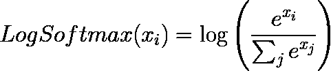
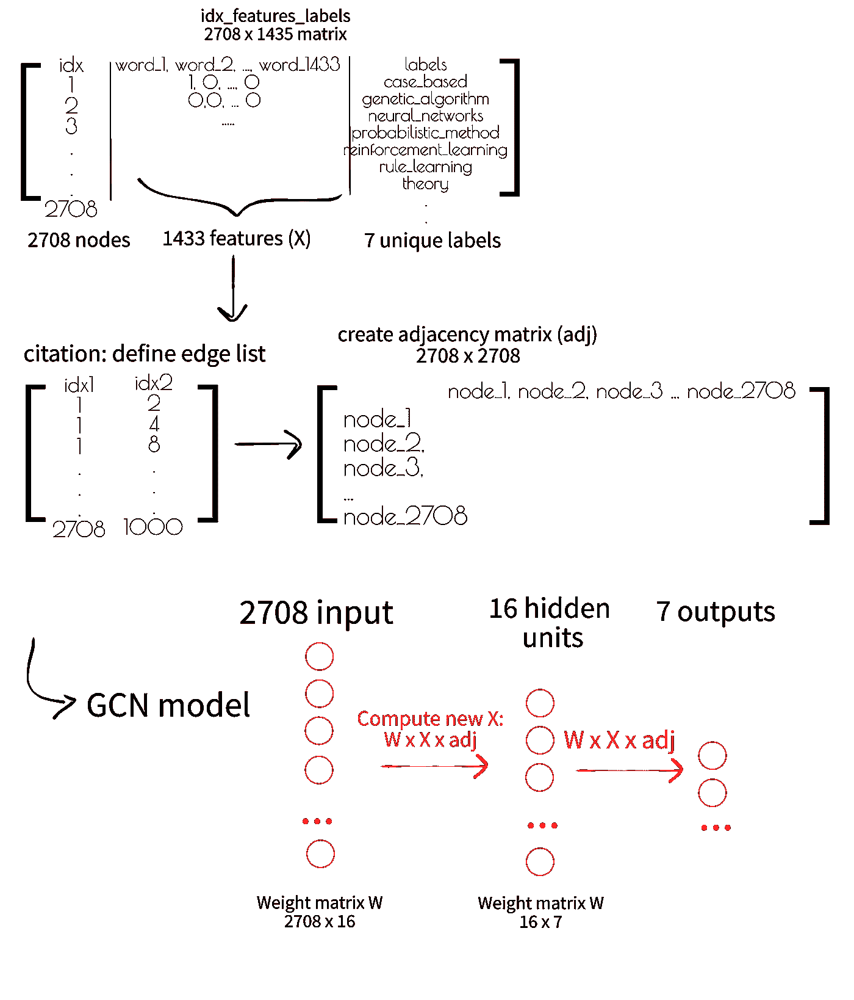
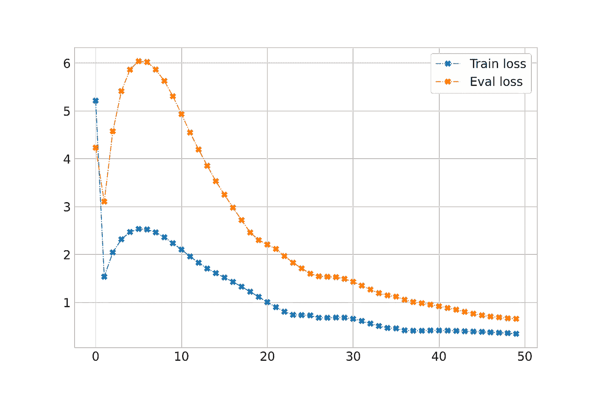

# 图形神经网络:2008 年以来的学习之旅——Python 和图形卷积网络

> 原文：<https://towardsdatascience.com/graph-neural-networks-a-learning-journey-since-2008-python-graph-convolutional-network-5edfd99f8190>

今天，我们对 GCN 理论有了清晰而实用的认识。我们会穿过基普夫的火炬🔦GCN 的实施👩‍🎓。然后，我们将把我们所学到的应用到可恶的 Twitter 数据集上🔥


图片由[龙之介菊野](https://unsplash.com/@ryunosuke_kikuno)在 [Unsplash](https://unsplash.com/photos/n0T2yNKYdwQ)

我以前关于图形和 ML 的帖子:

*   [图形神经网络:2008 年以来的学习之旅——第一部分](/graph-neural-networks-a-learning-journey-since-2008-part-1-7df897834df9?source=your_stories_page----------------------------------------)
*   [图形神经网络:2008 年以来的学习之旅——第二部分](/graph-neural-networks-a-learning-journey-since-2008-part-2-22dbf7a3b0d?source=your_stories_page----------------------------------------)
*   [图形神经网络:2008 年以来的学习之旅——深度行走](/graph-neural-networks-a-learning-journey-since-2008-deep-walk-e424e716070a?source=your_stories_page----------------------------------------)
*   [图形神经网络:2008 年以来的学习之旅——Python&深度行走](/graph-neural-networks-a-learning-journey-since-2008-python-deep-walk-29c3e31432f?source=your_stories_page----------------------------------------)
*   [图神经网络:2008 年以来的学习之旅——图卷积网络](/graph-neural-networks-a-learning-journey-since-2008-graph-convolution-network-aadd77e91606)

*通过我的推荐链接支持我的写作加盟媒介:*

<https://medium.com/@stefanobosisio1/membership>  

欢迎回到我的图形神经网络系列！在之前的文章[中，我们研究了图论、卷积神经网络的理论和数学基础](/graph-neural-networks-a-learning-journey-since-2008-graph-convolution-network-aadd77e91606)。今天我们将讨论 Kipf 对 GCN 的 PyTorch 实现，试图简化实现，并将 GCN 应用于 Twitter 仇恨/正常用户数据集。享受:)

# 将 GCN 理论翻译成 PyTorch

## 传承 PyTorch nn。组件

在 PyTorch 中常见的做法是制作一个定制模块来创建一个模型，使用`torch.nn.Module`这就创建了一个 Python 对象，从而允许创建复杂的模块。定制模块是类，它是包`torch.nn.Module`的子包，继承了所有的方法和属性:

图 1:使用 torch.nn 定义一个定制模块，新定义的模块继承了所有的 nn。模块属性和方法，并可以很容易地适应实现自定义模型。

`class MyNetwork(nn.Module)`定义了子类，然后，类似于`nn.Module`，它希望用输入和输出网络大小(分别是`in_size`和`output_size`)来定义构造函数。在构造函数中，调用超级构造函数`super()`。这允许从对象`MyNetwork`内的包`torch.nn.Module`创建对象，而不需要显式初始化它。然后，可以设置网络层和`forward`步骤，这也是从`nn.Module`继承而来的。

## 应用神经网络。基本 GCN 操作模块:layers.py

同样的方案之后是 Kipf 在`layers.py`:[https://github.com/tkipf/pygcn/blob/master/pygcn/layers.py](https://github.com/tkipf/pygcn/blob/master/pygcn/layers.py)中实现 GCN 逻辑。图 2 显示实现了 GCN 的基本层功能，它是邻接图矩阵与输入图特征数组和第 I 层权重的乘积:

图 2:作为 torch.nn.Module 实现的 GCN 的基本操作。这里，Kipf 定义了 GCN 步骤，这是一个简单的基于拉普拉斯的矩阵乘法。权重和偏差被均匀采样，前一步执行所需的乘法。

权重和偏差参数被定义为`torch.nn.parameter`对象，通过从均匀分布中随机取样产生。`forward`步骤更新了前一篇文章的[等式 10 中的层权重计算。](/graph-neural-networks-a-learning-journey-since-2008-graph-convolution-network-aadd77e91606#8c18)

## 堆叠图层:models.py 中的 GCN 模型

既然我们已经实现了基本的构建模块，我们就可以继续实现 GCN 模型了。根据 Kipf 的论文，GCN 由两层组成，一个输入层，一个隐藏层，它们通过 ReLu 激活来组合。此外，我们可以有一个丢弃层，其中输入训练数据的一部分被丢弃，以进一步加强层预测。最终输出为 softmax 的对数，等式。一



等式 1:对数 softmax 函数。首先，对第 I 个输入执行 softmax，然后计算 log。

图 3:GCN 模型的实现。该模型由两层组成，一个输入层，一个隐藏层和一个可能的下降步骤。

## 准备输入数据

一旦基本模型已经建立，我们可以看看输入数据。Kipf 提供了来自 Cora 数据集([https://paperswithcode.com/dataset/cora](https://paperswithcode.com/dataset/cora))的数据；
CC0:公共领域)[1，4]。Cora 数据集由机器学习论文组成，分为 7 类:`case_based`、`genetic_algorithms`、`neural_networks`、`probabilistic_methods`、`reinforcement_learning`、`rule_learning`、`theory`。论文总数为 2708，这将是节点数。去除词干和停用词后，最终数据集只有 1433 个唯一词，这将是要素的数量。因此，该图可以用一个 2708 x 1433 的矩阵来表示，1 和 0 取决于特定单词的存在。从论文引用文件可以获得边列表，并从那里创建一个 2708 x 2708 邻接矩阵。[数据通过实用程序脚本](https://github.com/tkipf/pygcn/blob/master/pygcn/utils.py) `[utils.py](https://github.com/tkipf/pygcn/blob/master/pygcn/utils.py)`创建。一旦创建了这些元素，就可以继续进行培训步骤。

## 用 Cora 数据集训练 GCN 模型

图 4 总结了所有的 GCN 步骤。加载数据，以创建特征矩阵`X`和邻接矩阵`adj`。这些元素可以被 GCN 模型摄取，该模型通过拉普拉斯乘法来转换数据，返回每个节点的 7 个类的概率。



图 Kipf 代码概述。对初始 Cora 数据集进行处理，以获得特征矩阵 X 和邻接矩阵 adj。这些元素可在 GCN 模型中直接用于计算每个结点的输出类。

图 5 显示了用于训练 GCN 模型的 Kipf 代码的摘录。核心位是火车功能。这里，最初通过`optimiser.zero_grad()`将梯度设置为零。然后，模型的输出被计算为`output = model(features, adj)`。最后，运行模型性能检查和损失，计算负对数似然性和准确性，负对数似然性更新网络权重，准确性评估模型相对于评估数据集的良好性。

图 5:GCN 模型的训练程序。函数串是调用模型的核心位，权重通过负对数似然更新，并通过计算准确度分数来执行评估。

# 玩 GCN，预测推特上可恶的用户

现在是时候玩一个奇特的数据集和 GCN 了。[数据集是 Twitter 可恶的用户](https://www.kaggle.com/manoelribeiro/hateful-users-on-twitter)【2】(CC0:公共领域许可证)在其论文中有描述【2】。该数据集拥有 100，000 名用户。5，000 名用户被贴上了仇恨的标签，也就是说，他们在 Twitter 上发布仇恨帖子。每个用户都有一组定义好的和人工设计的特征`users_neightborhood_anon.csv`，其中推文已经通过手套嵌入进行编码【3】。其目的是利用网络信息来预测哪些用户也可能是可恨的。这个例子是自由地受这个教程的启发:[https://stellar graph . readthedocs . io/en/v 1 . 0 . 0 rc1/demos/interpretatibility/gcn/evidence-twitters-interpretatibility . html](https://stellargraph.readthedocs.io/en/v1.0.0rc1/demos/interpretability/gcn/hateful-twitters-interpretability.html)

## 下载数据和预处理

首先，我们需要下载数据并解压文件。在本例中，我们将通过 Google Colab 笔记本使用 Kaggle APIs:

```
!pip install kaggle --upgrade
# download from your kaggle account the token file kaggle.json
!mkdir /root/.kaggle 
!cp kaggle.json /root/.kaggle/. 
!mkdir dataset 
!kaggle datasets download -d manoelribeiro/hateful-users-on-twitter -p dataset/
# unzip the files 
!unzip dataset/*.zip
```

这个例子需要的文件是`users_neighborhood_anon.csv`和来自`users.edges`的边缘列表

节点的特征是人工设计的，然而，图形神经网络的优点在于它们可以去除这些特征，因为它们能够检索网络信息，这对于正确的分类是至关重要的。为此，我们将清理输入数据集，并将要素的大小从 1039 缩小到 206:

图 6:读取输入节点的特征并清理它们，以便将维数减少到 206。

从这里，我们可以开始准备一个数据集，用于 GCN 预测。首先，我们选择所有被标记为`normal`和`hate`的用户(总共 4971 个)。然后，可以读取边并选择带有已过滤节点索引的子图，最后，我们可以创建邻接表。

图 7:只选择标签不是 2 的用户，正常用户和讨厌用户，从他们的索引中提取相关的边子图。然后，使用 networkx 创建邻接矩阵，并使用 scipy 将其转换为稀疏矩阵

邻接矩阵是一种稀疏类型，通过`scipy.sparse.coo_martrix`创建，正如我们在 Kipf 代码中看到的。

最后一步是为 GCN 摄取准备邻接和特征矩阵。在这种情况下，我们将对要素的值进行归一化，因为相邻要素已经进行了归一化，我们将为训练(0–1000)、评估(1000–1200)和测试(1200–1400)定义一些样本索引。

图 8:归一化节点特征矩阵，定义训练、评估和测试的指标。

## 在推特上训练 GCN 可恶的数据集

最后一步完全遵循 Kipf 的代码。我们称之为 GCN 模型和亚当优化器。从那里开始，我们运行一系列的训练程序，然后我们将测量精确度。

图 9:根据节点的特征形状准备输入尺寸的 GCN 模型，设置隐藏层尺寸和优化器参数。然后，运行一组定义的时期

在这种情况下，我们定义的隐藏层大小为 16，但可以随意修改，输出类的数量为 2 ( `normal`或`hate`)。我们可以收集各个时期的损失和准确度，并看到在 50 个时期后有一个收敛，而评估集的准确度达到 0.89。



图 10:训练和评估 Twitter 数据集的负对数似然损失。两个数据集通过大约 0.34(训练)和 0.65(评估)的损失收敛。进一步的时代将会加强趋同

这只是 GCN 美丽的一个小小的例子。你可以带着这些作业进一步练习和探索 GCN 的力量:

*   修改输入数据集大小
*   从输入数据集中提取更多要素
*   从第二层提取信息，用分解算法作图，看网络在训练时如何分裂网络。

今天它是一切:)请继续关注下一个图表冒险！

如果有任何问题或意见，请随时给我发电子邮件，地址是:stefanobosisio1@gmail.com，或者直接在 Medium 这里。

# 文献学

1.  网络数据中的集体分类。*艾杂志*29.3(2008):93–93。
2.  《推特上仇恨用户的描述和检测》第十二届 AAAI 国际网络和社交媒体会议。2018.
3.  彭宁顿、杰弗里、理查德·索彻和克里斯托弗·d·曼宁。"手套:单词表示的全局向量."*2014 年自然语言处理经验方法会议论文集*。2014.
4.  《用机器学习自动化互联网门户的构建》*信息检索*3.2(2000):127–163。