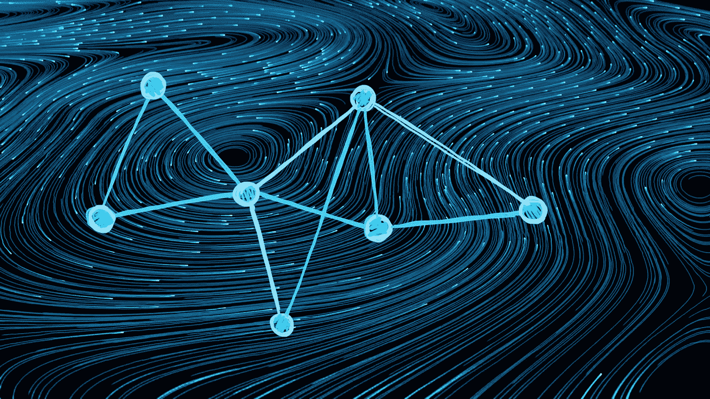
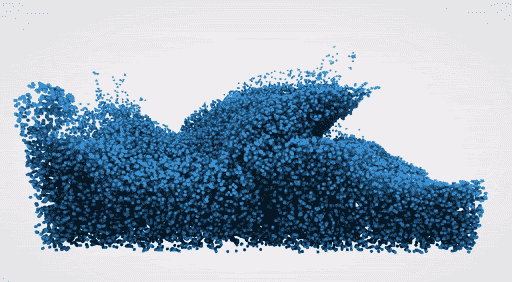
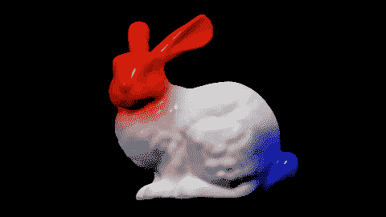
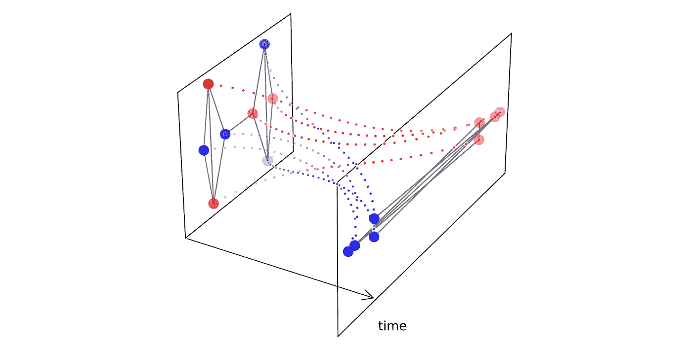
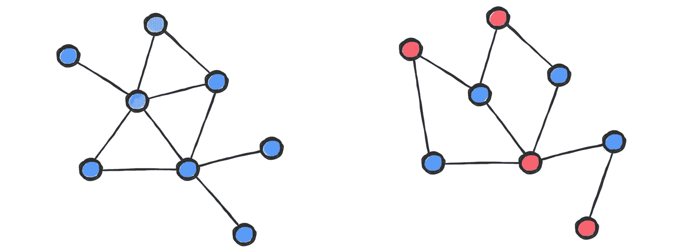
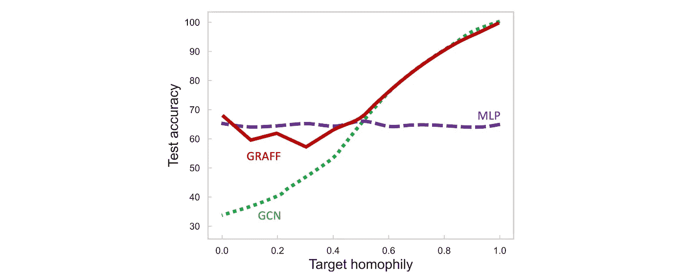
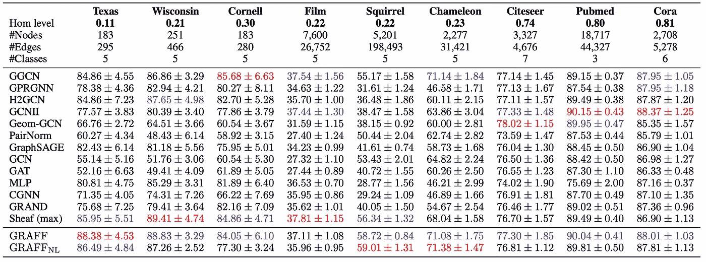
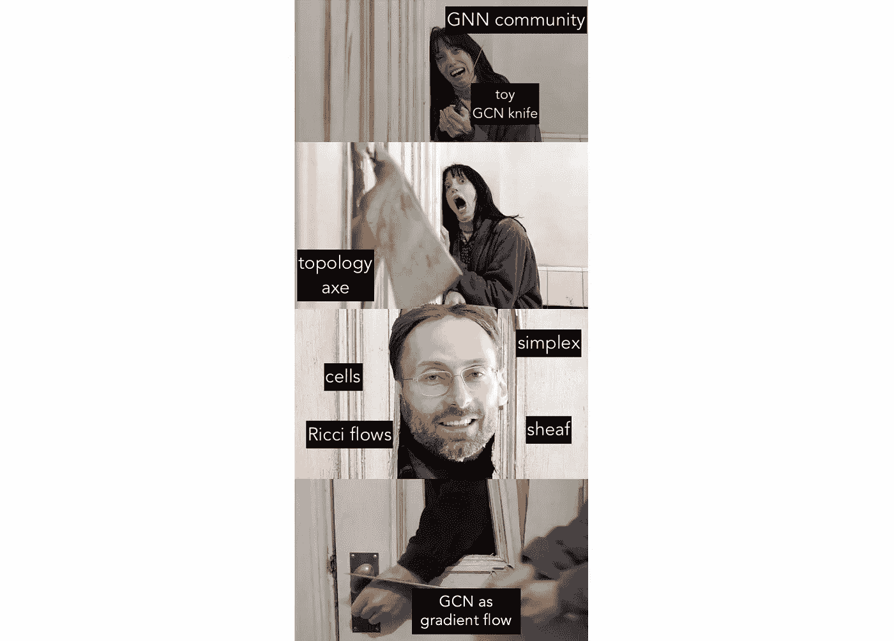

# 作为梯度流的图形神经网络

> 原文：<https://towardsdatascience.com/graph-neural-networks-as-gradient-flows-4dae41fb2e8a>

## 基普夫&韦林反击战

## 在一些简单的约束下，图形神经网络可以被导出为梯度流，该梯度流最小化描述特征空间中吸引力和排斥力的可学习能量。这种形式主义允许将 gnn 解释为物理系统，并揭示了图形频率和通道混合频谱之间的相互作用如何决定节点特征的演变，并控制动力学是“平滑”还是“锐化”它还导致了一个令人惊讶的结论:即使是非常简单的具有共享权重的图卷积模型也不一定会遭受过度平滑，并且在嗜异性设置中可能是有效的。

图片:Shutterstock。

*本文与 Francesco Di Giovanni、James Rowbottom、Ben Chamberlain 和 Thomas Markovich 合著，基于 F. Di Giovanni、J. Rowbottom 等人的论文* [*【图神经网络作为梯度流*](https://arxiv.org/pdf/2206.10991.pdf)*【2022】，arXiv:2206.10991。请看一段*[*Francesco 在*](https://youtu.be/pG_akmY02Bo) [*首届意大利暑期学校关于几何深度学习*](https://www.sci.unich.it/geodeep2022/) *的演讲录音以及我们之前关于* [*神经扩散*](/graph-neural-networks-as-neural-diffusion-pdes-8571b8c0c774?sk=cf541fa43f94587bfa81454a98533e00)*[*细胞束*](/neural-sheaf-diffusion-for-deep-learning-on-graphs-bfa200e6afa6?sk=0b2f814a1180a64460699f6a3277053a) *和* [*物理启发图 ML*](/graph-neural-networks-beyond-weisfeiler-lehman-and-vanilla-message-passing-bc8605fa59a?sk=3a058b427798d601ebb2d618fca89a8f)*

*raph 神经网络经常被批评为*过度平滑*(多个消息传递层逐渐产生接近常数的节点特征的趋势【1-2】)以及在*异嗜性*设置中的糟糕性能(当相邻节点具有不同标签时【3】)。应对这些现象的尝试最近导致了[更复杂的信息传递方案](/a-new-computational-fabric-for-graph-neural-networks-280ea7e3ed1a?sk=3d4185067ef3c1cf81793deada08e18f)的“寒武纪大爆发”，其中一些求助于非常奇特的结构，如[蜂窝滑轮](/neural-sheaf-diffusion-for-deep-learning-on-graphs-bfa200e6afa6?sk=0b2f814a1180a64460699f6a3277053a)【4】。*

*最重要的是，图形神经网络面临深度学习的普遍问题:可解释性差。总的来说，机器学习社区对 GNNs 有一种爱恨交加的关系:有时最新和最伟大的架构提供了最先进的结果，而在其他情况下，简单的旧方法(如图形卷积模型[5]或甚至节点式多层感知器)几乎一样好。对于某些模型在什么时候以及为什么表现良好，并没有清晰的认识，一种多少有些不健康的“民间传说”从一张纸重复到另一张纸上。*

*在最近的出版物中【6】，我们认为 GNNs 是离散的粒子动力系统，它在微分方程(称为*梯度流)*下演化，使一些能量最小化。这种受物理学启发的方法，我们称之为*梯度流框架(GRAFF)* ，提供了对现有 GNN 建筑的更好理解(导致一些令人惊讶的结论！)以及派生新的更有效的方法的原则性方法。*

# ***梯度流***

*考虑一个由*演化方程*支配的动力系统*

***ẋ**(*t*)=**f**(**x**(*t*))*

*从某个初始状态 **X** (0)开始，运行时间 *t* > 0。这个微分方程的结构(在我们的符号中是 **F** )取决于底层的物理系统。例如，矩阵 **X** 的行可以表示以矢量场**F**给出的速度移动的粒子系统的空间坐标。如果粒子带电，它们相互施加[静电力](https://en.wikipedia.org/wiki/Coulomb%27s_law)，导致*耦合的*常微分方程系统，其中不同行的 **X** 之间存在相关性。*

**

*模拟流体的复杂粒子动力系统。图片:[李大卫](http://david.li/fluid/)。*

*在深度学习中，人们可以将微分方程系统的输入演变视为深度神经网络的连续版本，这是一种称为“神经微分方程”的方法[7–8]。然后，就有可能在用于求解方程的数值方案的时间步骤和神经网络的层之间画出一条平行线。*

**梯度流*【9】是特殊类型的演化方程的形式*

**f*(**x**(*t*)= –∇ℰ(**x**(*t*)，*

*ℰ是某种能量函数。梯度流使得ℰ在演化过程中单调下降[10]。许多物理系统都可以用一些能量来表征，这些能量被它们的动力学最小化了。ℰ的知识提供了对系统的更好的理解，并且经常允许一个人对动力学的主要影响和它的渐近行为作出陈述。*

*一个原型梯度流是*扩散方程*，它控制着物理介质中的热传播。扩散方程的正式推导可以追溯到 19 世纪约瑟夫·傅立叶关于*热分析理论*【11】的论文。这种方程在物理学中有很多应用，也已经用于图像处理、计算机视觉[12]和[graph ML](/graph-neural-networks-as-neural-diffusion-pdes-8571b8c0c774?sk=cf541fa43f94587bfa81454a98533e00)【13】。*

*在其最简单的形式中，𝒢图上的扩散方程由下式给出*

***ẋ**(*t*)=–**δx**(*t*)，*

*其中 **X** 为 *n* × *d* 节点特征矩阵**δ**为 *n* × *n* 图拉普拉斯[14]。这是一个耦合的 ode 系统:图中的每个节点( **X** 的行)都与其邻居相互作用。*

*扩散方程原来是*狄利克雷能量*的梯度流*

*ℰᴰᴵᴿ(**x**)= trace(**x**ᵀ**δx**)=∑*ᵤᵥ||*(∇**x**)*ᵤᵥ*| |，*

*其中∇ **X** 表示在图的每条边上定义的特征的梯度。狄利克雷能量测量图[15]上特征的*平滑度*。在极限 *t* →∞时，扩散会丢失输入特征中包含的信息，因为所有节点都变得“相同”[16]——这种现象在 GNN 文献中通常被称为“过度平滑”*

**

*流形上的热扩散方程。*

# ***卷积图神经网络***

*T 平滑节点特征的简单扩散方程在图形 ML 问题中可能不太有用【17】，其中图形神经网络提供了更多的灵活性和能力。人们可以把 GNN 想象成一个由参量演化方程支配的更一般的动力系统*

***ẋ**(*t*)=gnn(𝒢，**x**(*t*)； **θ** ( *t* )，*

*使用欧拉方法[18]离散，固定时间步长 0*<τ<*1*为**

****x**(*t*+*τ*)=**x**(*t*)+*τ*gnn(𝒢，**x**(*t*)； **θ** ( *t* ))。**

**每次迭代对应于一个 GNN 层，该层通常可以有一组不同的参数 **θ** ( *t* )。**

**如何实现上述等式中的函数“GNN”是不同图形神经网络架构之间的关键区别。*卷积*类型的 gnn[19]将共享线性变换应用于特征(可学习的*d*×*d*‘信道混合’矩阵 **W** 和**ω**)，随后沿边缘传播(通过归一化邻接矩阵**‘扩散’)，并可能进行元素式非线性激活 *σ* :****

******X**(*t*+*τ*)=**X**(*t*)+*▽*(—**X**(*t*)**ω**(*t*)+**āX**(*t*)【T24****

****选择**ω**=**W**=**I**和 *σ=* id 恢复了我们之前看到的离散化图形扩散方程。由 Thomas Kipf 和 Max Welling [5]介绍的最简单的图卷积模型之一 GCN 的残差版本是上述模型的特例，其中**ω**= 0。****

****我们的例子展示了 GNN 建筑的通常设计过程，从参数化一个演化方程开始。我们认为，另一种方法，即参数化*能量*并导出 GNN 作为其离散梯度流，提供了更好的可解释性，并导致更有效的架构。这是我们 GRAFF 方法的精髓:我们对一类可以写成梯度流的 gnn 感兴趣****

******ẋ**(*t*)=−∇ℰ(𝒢，**x**(*t*)； **θ** ( *t* )，****

****一些参量能量ℰ(.； **θ** ，参数 **θ** 通过任务损失函数的反向传播学习。****

****能量和演化方程之间的联系提出了理解和设计 GNNs 的双重水平:从能量到演化方程，我们导出了更有原则和更有效的图形卷积模型版本，作为 Dirichlet 型参数能量族的梯度流。我们表明，这种模型具有避免过度平滑的理论保证和处理嗜异性数据的能力。****

****相反，从演化方程到能量，我们证明了许多现有的非线性图卷积模型，尽管不是梯度流，仍然可以在我们的框架内进行分析。特别地，我们证明了它们的演化方程降低了前面提到的狄利克雷型能量。****

# ******从能量到演化方程******

****让我们考虑一族二次能量****

****ℰᶿ(**x**)=∑*ᵤ*⟨**x***ᵤ*，**ωx***ᵤ*⟩∑*ᵤᵥāᵤᵥ*⟨**x***， **Wx*******

*****由矩阵**ω**和 **W** 参数化。我们称ℰᶿ为“广义参数狄利克雷能量”，因为经典ℰᴰᴵᴿ是它的特例[20]。*****

*******物理解释。** ℰᶿ是与*粒子系统*(图中的节点，其在特征空间中的位置由矩阵 **X** 表示)相关联的能量，可以解释如下:第一项表示作用于所有粒子的‘外部’能量。第二项考虑了沿着图的边缘的*成对相互作用*，因此代表了粒子系统的“内部”能量。成对交互由通道混合矩阵 **W** 控制。第二能量项的最小化使得相邻节点*的特征**x**ᵤ*、**x**t20】ᵥ沿着对应于正特征值的特征向量 **W** 吸引。同样的， **W** 的负本征值诱发*斥力*【21】。*****

******梯度流动。**ℰᶿ的梯度流量由下式给出****

******ẋ**(*t*)= −∇ℰ(**x**(*t*)=-**x**(*t*)(**ω+ω**ᵀ)/2+**+x**(*t*)(**w+w**ᵀ)/2.****

****由于**ω**和 **W** 以对称形式出现在梯度流中，在不失一般性的情况下，我们可以假设它们是*对称的*:****

******ẋ**(*t*)=-**x**(*t*)**ω**+**āx**(*t*)**w**。****

****当以固定时间步长 *τ、*离散化时，该演化方程成为具有*共享对称权重*的图卷积模型****

******X**(*t*+*τ*)=**X**(*t*)+*τ*(-**X**(*t*)**ω**+**+X**(*t*****

****由于**ω**和 **W** 独立于层 *t* 。逐层共享权重将一个 *L* 层卷积 GNN 中的参数总数从 2*d*L 减少到 *d* 。重要的是，对称约束不会削弱 GNN 的表现力[22]。****

********

****格拉夫诱导的排斥和吸引动力学的例子:节点位置代表它们的特征坐标，颜色是标签。斥力沿着特征空间的 x 轴(W**的负特征向量**的方向)发生，引力沿着 y 轴(W**的正特征向量**发生。****

******动力学中的显性效应。**我们对 GNN 粒子系统的物理解释允许分析其梯度流诱发的动力学。吸引力使边缘梯度最小化，产生平滑效应(“模糊”)，放大了图中节点特征的低频[23]。另一方面，排斥力增加了边缘梯度，产生了增强高频的“锐化”效应。****

****这可以通过监测沿归一化解的狄利克雷能量来定量表示:如果在极限ℰᴰᴵᴿ(**x**(*t*)/| |**x**(*t*)| |)趋向于零，我们就有了*低频主导的* (LFD)动力学。在收敛到图的拉普拉斯最大特征值的情况下，我们称动力学*高频* *支配*(HFD)【24】。****

********

****嗜同性(左)和嗜异性(右)图表示例。不同类型的节点用颜色编码。****

****多项研究表明，LFD 过程对于同形图中的节点分类是成功的。直观地，在这样的图中，邻居包含相似的信息，并且平滑过程聚集邻居，同时平均掉噪声。在*异嗜性*情况下，平滑通常是有害的，因为高频成分可能包含更多相关信息【27】。因此，一个理想的 GNN 模型必须通过能够诱导 LFD 或 HFD 动力学来适应这两种相反的情况。****

****我们表明，基于扩散的模型，如连续 GNN [28]，PDE-GCN-D [29]，和[图神经扩散](/graph-neural-networks-as-neural-diffusion-pdes-8571b8c0c774?sk=cf541fa43f94587bfa81454a98533e00) (GRAND) [13]无法诱导 HFD 动力学，因此可能会在嗜异性设置中遭受可预见的痛苦[30]。其中一个原因是，GRAND 等方案不允许通道混合:GRAND 在节点特征的每个通道上独立地执行非线性扩散，这可以被解释为一种图形注意力[31]的形式。****

****另一方面，根据**w**【32】的光谱，通过离散化我们的参数能量ℰᶿ的梯度流获得的格拉夫模型可以学习成为 LFD(主要是边缘方向吸引)或 HFD(主要是边缘方向排斥)。这使得格拉夫既适用于嗜同性也适用于嗜异性。****

********

****具有受控同质性的合成 Cora 数据集上的节点分类实验。GCN [5]通过利用节点特征的局部相似性，在高同质性的情况下表现良好；当同质性低时，这变成导致性能恶化的缺点。多层感知器(MLP)通过独立考虑每个节点的特征而忽略了图的结构。这使得 MLP 对低同性免疫，但也无法利用高同性。我们受物理学启发的格拉夫模型在两种情况下都工作得很好，因为它能够诱导低频和高频主导的动力学。图改编自[6]。****

****格拉夫系统动态的驱动因素是拉普拉斯图{ *λₗ* }的频谱和通道混合矩阵{*ₖ*}【33】的频谱的相互作用。 **W** 的正特征值(*ₖ>t13】0)放大低频(*λₗ*t29】1)，负特征值(*ₖ>t17】0)放大高频(*λₗ*t31】1)[33 *]。******

**如果 **W** 的负特征值比正特征值【35】大得多，那么排斥力和高频占主导地位。在相反的情况下，低频占主导地位，导致极限*t*→∞1，36】中的过度平滑。**

**此外，负特征值{ *ₖ <* 0}的影响等同于翻转边的符号；这是为嗜异性数据集[37]提出的一种启发式方法，最近在我们关于神经层扩散 T26 的 NeurIPS 论文[4]中也被赋予了代数拓扑动机。**

# **基普夫&韦林公司**

**我们应该强调的是，虽然 GRAFF 是一个允许将 gnn 导出为任何能量泛函的离散梯度流的通用框架，但是从我们的二次能量ℰᶿ中产生的模型是标准的卷积型 gnn。梯度流形式主义为他们的行为以及如何做出正确的架构选择提供了重要的见解。**

**我们的分析的一个结果是，如果信道混合矩阵具有足够负的特征值，卷积 GNNs 可以处理图异构。这与图形 ML 文献中经常重复的相反的“民间传说”陈述相矛盾。**

**然而，有一个重要的细微差别:由于我们使用欧拉离散化，我们总是有一个*残差* GCN 模型。这个架构特征被证明是至关重要的:我们证明了一个没有剩余连接的模型(即迭代公式为**X**(*t*+*τ*)=*τ***āX**(*t*)**W**最初由 Kipf 和 Welling [5]提出)只能诱导独立于**W**的谱的 LFD 动力学******

**其次，我们的模型是残差 GCNs 的特定版本，其中信道混合矩阵是对称的，并且跨层共享。这也与 graph ML 社区中的常见做法相矛盾:通常，多层 GCN 模型每层都有不同的通道混合矩阵，并且还包括非线性激活[39]。我们通过实现 GRAFF 模型来证明这是不必要的，其中演化方程是线性的，唯一的非线性是在特征编码器和解码器中。**

****

**不同同质性水平数据集上的节点分类精度。GRAFF 及其非线性版本(GRAFF-NL)实现了与最近一些专门为嗜异性设置设计的方法(如 GGCN 和 GPRGNN)相当或更好的结果，同时在计算复杂性和参数数量方面明显更轻便。表来自[6]。**

**考虑到我们的理论和实验结果，简单的图卷积证明了简单的图卷积是正确的:我们得出结论，简单的图卷积在许多实际情况下足够强大，其性能与复杂得多的 GNN 模型相当，甚至更好。**

****

**简单图卷积模型反击。原始迷因:米哈伊尔高尔金。**

# **从演化方程到能量**

**梯度流形式主义为 GNNs 的设计带来了一种新的思维模式:我们不是将演化方程参数化，而是将梯度流最小化的能量参数化[41]。我们已经证明，通过这种方式，人们可以做出更明智的设计选择，并为 GCNs 等“旧”模型带来新的生命。**

**人们可能想知道如何处理现有的进化方程不是梯度流的 gnn？GRAFF 在这种情况下仍然提供了重要的见解:例如，我们表明，如果权重是对称的，使用非线性激活的更一般的卷积模型仍然会降低能量ℰᶿ[42]——再次注意，从通用近似的角度来看，这不是限制性的[22],事实上为在图形神经网络中使用对称权重提供了更具理论原则性的理由。**

**我们的分析概括了现有的结果[2，4],这些结果监测了用 ReLU 激活的 Kipf-Welling GCNs 中的狄利克雷能量ℰᴰᴵᴿ:我们考虑了更广泛的一类能量以及无限类非线性激活函数。我们相信，这种方法可以提供一种新的视角，通过考虑哪种能量泛函沿着学习的节点特征减少来分析新旧 GNNs 的学习动力学。**

**更广泛地说，GRAFF 是一种受 T2 物理学启发的图形学习方法，我们最近已经看到了几个这样的例子，包括我们自己的作品。这种方法的主要思想是使用物理系统作为学习的隐喻，并通过系统的状态来参数化解的空间。在某种意义上，这是对[物理信息神经网络](https://en.wikipedia.org/wiki/Physics-informed_neural_networks) (PINN)的补充，后者将物理定律作为其归纳偏差，以便更好地逼近现实生活中的物理系统。**

**受物理学启发的方法的一个重要方面是，它们带来了不同于 graph ML 中传统使用的工具。例如，GNNs 的表达能力通常通过诉诸消息传递和 [Weisfeiler-Lehman 图同构测试](/expressive-power-of-graph-neural-networks-and-the-weisefeiler-lehman-test-b883db3c7c49?sk=5c2a28ccd38db3a7b6f80f161e825a5a)【45】之间的等价性来分析。后者通常限制太多，因为它假设信息传播在输入图上完成，而在实施某种形式的图重布线的实际 gnn 中，情况往往不是这样[46]。**

**通过研究动力系统的渐近行为(例如，扩散方程[4]的极限)，人们可以表达 GNNs 的分离能力，而无需求助于 WL 形式。这种技术自然允许图形重新布线，这假定了对基础微分方程的不同离散化的解释。**

**我们的工作表明，物理启发的方法甚至可以在以前研究得很好的图形学习模型中提供新的见解，并将鼓励在这个方向上的更多研究。**

**[1] K. Oono 和 t .铃木，[图神经网络对节点分类的表达能力呈指数级丧失](https://openreview.net/pdf?id=S1ldO2EFPr) (2020) ICLR。**

**[2]蔡春华，王永元，.关于图神经网络过光滑问题的一个注记.(2020)arXiv:2006.13318 .**

**[3] J. Zhu 等，[超越图神经网络中的同向性:当前的局限与有效设计](https://proceedings.neurips.cc/paper/2020/file/58ae23d878a47004366189884c2f8440-Paper.pdf) (2020) *NeurIPS* 。**

**[4] C .博德纳尔，f .迪·乔瓦尼等，神经束扩散:GNNs 中异嗜性和过度光滑的拓扑透视(2022) *NeurIPS* 。参见附带的[博文](/neural-sheaf-diffusion-for-deep-learning-on-graphs-bfa200e6afa6?sk=0b2f814a1180a64460699f6a3277053a)。**

**[5] T. Kipf 和 M. Welling，[带图卷积网络的半监督分类](https://arxiv.org/abs/1609.02907) (2017)， *ICLR* 。**

**[6] F. Di Giovanni，J. Rowbottom 等人，[将神经网络图化为梯度流](https://arxiv.org/pdf/2206.10991.pdf) (2022)，arXiv:2206.10991。**

**[7] E. Haber 和 L. Ruthotto，深度神经网络的稳定架构(2017) *逆问题* 34 (1)。**

**[8] R. Chen 等，[神经常微分方程](https://papers.nips.cc/paper/2018/file/69386f6bb1dfed68692a24c8686939b9-Paper.pdf) (2019) *NeurIPS。***

**[9]梯度流可被视为最陡下降法的连续版本，该方法最初由 A.-L .柯西、[méthode générale pour la résolution des systèmes d 'éequations simultanées](http://sites.mathdoc.fr/cgi-bin/oeitem?id=OE_CAUCHY_1_10_399_1)(1847)*Comptes Rendus de l ' académie des Sciences*提出，用于解方程组(该方法出现在术语*梯度*之前，后者由 Horace Lamb 于 2004 年提出[术语“流”来自流体力学，粒子系统的一个重要设置。](https://mathshistory.st-andrews.ac.uk/Miller/mathword/g/)**

**[10]梯度流单调减少底层能量的事实源于∂/∂*t*ℰ(**x**(*t*)= –||∇ℰ(**x**(*t*))| |。**

**[11] J .傅立叶，<https://archive.org/details/bub_gb_TDQJAAAAIAAJ>**(1822)。傅立叶在 1807-1811 年间发展了后来成为同名的分析。这项工作在接下来的十年里没有被公开，因为他的职责是伊泽尔省的省长，这是一个由拿破仑亲自任命的高级职位(他在埃及的战役中就认识傅立叶)。****

****[12] P .佩罗娜和 j .马利克，[使用各向异性扩散的尺度空间和边缘检测](https://authors.library.caltech.edu/6498/1/PERieeetpami90.pdf) (1990)，*PAMI*12(7):629–639。****

****[13]例如，参见我们的论文 B. Chamberlain，J. Rowbottom 等人，[GRAND:Graph Neural Diffusion](https://arxiv.org/abs/2106.10934)(2021)*ICML*，附带的博文，以及其中的许多参考文献。****

****[14]我们使用对称归一化图拉普拉斯算子**δ**= I–**ā**，其中**ā= d**ᐨᐟ**ad**ᐨᐟ是归一化邻接矩阵。我们的分析可以针对拉普拉斯算子的其他变体进行重复，参见[6]中的附录 A.2。****

****[15]ℰᴰᴵᴿ的二次型表达式允许导出图傅立叶基(图拉普拉斯的正交特征向量)为**φ**= arg min**ₓ**trace(**x**ᵀ**δx**s . t .**x**ᵀ**x**=**I**，这可以解释为狄利克雷能量意义上的“最光滑正交基”。****

****[16]更正确的说法是 **X** (0)在 ker(**δ**)上的投影。对于归一化的拉普拉斯算子，扩散方程的极限是节点度数的向量。对于非规格化的拉普拉斯**δ**= I-**A**，结果是一个常数向量。****

****[17]固定扩散*在某些情况下*是有用的。比如 D. Zhou 和 b . schlkopf 提出的标签传播(label propagation)，离散空间上的正则化(2005)，*联合模式识别研讨会*，是一个带边界条件(已知节点标签)的扩散方程，是很多直推式图 ML 问题的很好的基线。在最近的一篇论文中，E. Rossi 等人，[关于在具有缺失节点特征的图上学习的特征传播的不合理有效性](https://arxiv.org/abs/2111.12128) (2021)，arXiv:2111.12128 表明[特征传播](/learning-on-graphs-with-missing-features-dd34be61b06?sk=ca026cec16a3ba6bfdbae660bc7065bf)在具有缺失特征的同形图上有效地工作。****

****[18]欧拉离散化(也称为*显式*或*前向*方案)用前向时差、**ẋ**(*t*)≈(**x**(*t*+*τ*)–**x**(*t*)/*代替时间导数这总是导致*剩余*架构。*****

***[19]我们在这里采用了我们书中的“GNN 风味”术语，M. M. Bronstein 等人，[几何深度学习:网格、组、图、测地线和规范](https://arxiv.org/abs/2104.13478) (2021) arXiv:2104.13478。在这种情况下，*卷积*类型的 gnn 可以写成以下形式:**X**(*t*+*τ*)=**AX**(*t*)**)(更新由与特征无关的矩阵完成)， *注意力*为**x**(*t*+*τ*)=**a**(**x**(*t*)**x**(*t*)**(特征相关矩阵值函数)*消息传递********

*******[20] ℰᶿ = ℰᴰᴵᴿ当**ω**=**w**=**I**。在[6]的附录 B.5 中，我们还表明ℰᶿ可以认为是一个离散版的谐波能量ℰ(*x*)=∫⟨∇*x*(*u*),∇*x*(*u*)⟩*ₕ*d*u*一个流形嵌入*x*:ℳ→ℝ*******

*****[21]参见[6]中的公式 10。直观上注意如果 **x** *ᵤ* 和 **x** *ᵥ* 是相邻节点特征并且都是满足**wx***ᵤ*=***x***ᵤ*和 **Wx** *的特征向量 **wx***ᵥ*⟩=*⟨**x***ᵤ*， **x** *ᵥ* ⟩和我们看到，如果> 0 那么 **x** *ᵤ* 和 **< 0 反之亦然。**********

*****[22] S. X. Hu，S. Zagoruyko 和 N. Komodakis，探索深度神经网络中的权重对称性(2019) *计算机视觉和图像理解*，187 表明具有对称权重的神经网络是通用近似器。*****

*****[23]本文中的“频率”是指归一化图拉普拉斯的频谱分解，提供了傅立叶基础的类比。节点特征可以写成拉普拉斯正交本征向量的线性组合，对应的特征值在 0 ≤ *λₗ* ≤ 2 的范围内。第零特征值对应于恒定的特征向量(使用谐波分析术语的‘DC’)；对应于较大特征值的特征向量不太光滑，并且具有较高的狄利克雷能量。*****

*****[24]见[6]中的定义 3.1。注意，LFD/HFD 动力学的定义是通用的，不要求演化方程是梯度流。*****

*****[25] J .克利茨佩拉等，[扩散改善图形学习](https://proceedings.neurips.cc/paper/2019/file/23c894276a2c5a16470e6a31f4618d73-Paper.pdf) (2019) *NeurIPS* 。*****

*****[26]吴等，[简化图神经网络](https://arxiv.org/abs/1902.07153) (2019) *。******

*****[27]经典例子是分离二部图的**∈**的最大特征向量。参见 D. Bo 等人，超越图卷积网络中的低频信息(2021) *AAAI* 。*****

*****[28] L.-P. Xhonneux 等人，[连续图神经网络](http://proceedings.mlr.press/v119/xhonneux20a/xhonneux20a.pdf) (2020) *ICML* 。*****

*****[29] M. Eliasof、E. Haber 和 E. Treister。PDE-GCN:由偏微分方程驱动的图形神经网络的新架构(2021) *NeurIPS* 。*****

*****[30]文献[6]中的定理 3.3。*****

*****[31]p . veli kovi 等人，[图形注意网络](https://arxiv.org/abs/1710.10903) (2018) *ICLR* 。*****

*****[32]文献[6]中的定理 3.2。*****

*****[33]文献[6]中的定理 4.1。*****

*****[34]我们表明，可以根据图形和通道混合频率明确地写出每一层的学习节点表示，从而得出每一个主导效应。这种对动力系统的“剖析”也强调了 **W** 的光谱和特征向量比条目本身更重要。*****

*****[35]在[6]中的方程 13 的意义上。*****

*****[36] H. Nt 和 T. Maehara，重新审视图形神经网络:我们所拥有的只是低通滤波器(2019) arXiv:1812.08434v4。*****

*****[37]d . Bo 等人在《超越图形卷积网络中的低频信息》(2021)*和 Y. Yan 等人在《同一枚硬币的两面:图形卷积神经网络中的异嗜性和过度平滑》(2021) arXiv:2102.06462 中使用了异嗜性数据集的负边缘加权。******

******[38]文献[6]中的定理 4.3。******

******[39]没有非线性激活(*σ*= id)an*m*-层 gcn**x**(*t*+*τ*)=*σ*(*σ*(**ā**σ(**ax**(*t*)**w 可以写成单层**x**(*t*+*)=*τ***ā***ᵐ***x**(*t*)**w**带 *m* -hop 扩散**ā***ᵐ*通过吸收 这个特性在[26]中被用于一个被称为简化 GCN (SGCN)的建筑。这种方法的优点是扩散特征**ā***ᵐ***x**可以预先计算，允许将 gcn 缩放到非常大的图，如我们的论文 Frasca 等人的[sign:scalable inception graph neural networks](https://grlplus.github.io/papers/77.pdf)(2020)*icml workshop on graph re presentation learning and beyond*以及附带的[博客帖子](/simple-scalable-graph-neural-networks-7eb04f366d07?sk=2127a086dd3e91b06235ef0f74016e64)所示。注意，这种简化不会发生在 GCN 的残差版本中，如[6]中的方程(34)所示。*********

***[40]在[6]中的方程 17。***

***[41]我们注意到,“最小化”在这里指的是能量沿着演化方程的行为(即，在通过网络的正向传递期间),并且不同于用于学习的行为(即，通过反向传播最小化关于模型参数的一些特定任务损失函数)。***

***[42]文献[6]中的定理 5.1。在我们最近的工作中，Dirichlet 能量的指数衰减被用于形式化超光滑现象[43]。***

***[43] B. P. Chamberlain 等人， [Beltrami 流和图形上的神经扩散](https://arxiv.org/pdf/2110.09443.pdf) (2021) NeurIPS。***

***[44] T. K. Rusch 等人，[图耦合振荡器网络](https://proceedings.mlr.press/v162/rusch22a/rusch22a.pdf) (2022) *ICML* 。***

***[45] B. Weisfeiler 和 A. Lehman，将图简化为标准形式和其中出现的代数(1968)*Nauchno-techniceskaya informatisia*2(9):12–16。WL 与用内射聚合器传递消息的等价性在例如 K. Xu 等人的文章中示出。[图神经网络有多强大？](https://arxiv.org/abs/1810.00826) (2019) *ICLR* 。参见我们的[博客文章](/expressive-power-of-graph-neural-networks-and-the-weisefeiler-lehman-test-b883db3c7c49?sk=5c2a28ccd38db3a7b6f80f161e825a5a)。***

***[46]传统的 gnn 使用输入图来传播信息，通过这种方式获得反映图的结构和其上的特征的表示。然而，由于“瓶颈”导致来自太多节点的信息被“挤压”到单个节点表示中，一些图对信息传播不太友好，这种现象被称为“过度压制”。现代 GNN 实现通过将输入图与计算图解耦(或为计算目的对其进行优化)来处理这种现象，这是一套被称为“图重布线”的技术。在我们最近的论文 J. Topping，F. Di Giovanni 等人的[通过曲率理解图的过度挤压和瓶颈](https://arxiv.org/pdf/2111.14522.pdf)(2022)*ICLR*中，我们将重布线与图曲率和 Ricci 流联系起来。参见我们的[博客文章](/over-squashing-bottlenecks-and-graph-ricci-curvature-c238b7169e16?sk=f5cf01cbd57b4fee8fb3a89d447e56a9)。***

****我们非常感谢大卫·艾纳德、尼尔斯·哈默拉、托马斯·基普夫、伊曼纽·罗西和康斯坦丁·鲁施对这篇文章的校对。关于图形深度学习的其他文章，请参见 Michael 在《走向数据科学》中的* [*其他帖子*](https://towardsdatascience.com/graph-deep-learning/home) *，* [*订阅他的帖子和*](https://michael-bronstein.medium.com/subscribe) [*YouTube 频道*](https://www.youtube.com/c/MichaelBronsteinGDL) *，获取* [*中等会员*](https://michael-bronstein.medium.com/membership) *，或关注他的*<https://twitter.com/mmbronstein>***