# 超越 Weisfeiler-Lehman 和普通消息传递的图神经网络

> 原文：<https://towardsdatascience.com/graph-neural-networks-beyond-weisfeiler-lehman-and-vanilla-message-passing-bc8605fa59a>

## **图形学习的新蓝图**

## 基于图的物理学启发的连续学习模型允许克服传统 GNNs 的限制

## **消息传递范式多年来一直是图形深度学习的“战马”，使图形神经网络在从粒子物理到蛋白质设计的广泛应用中取得了巨大成功。从理论角度来看，它建立了与 Weisfeiler-Lehman 等级的联系，允许分析 GNNs 的表达能力。我认为，当前图形深度学习方案的“以节点和边为中心”的思维模式施加了不可逾越的限制，阻碍了该领域的未来进展。作为替代方案，我提出了受物理学启发的“连续”学习模型，该模型从微分几何、代数拓扑和微分方程领域开辟了一个新的工具宝库，迄今为止，这些领域在 graph ML 中基本上没有被探索过。**

图片:Shutterstock。迷宫隐喻:多米尼克·比艾尼。

*本文基于克里斯蒂安·博德纳尔、董晓文、本·张伯伦、大卫·艾纳德、法布里齐奥·弗拉斯卡、弗朗切斯科·迪·乔瓦尼、玛利亚·戈里诺瓦、皮埃特罗·里ò、朱利亚·路易斯、锡德·米什拉、吉多·蒙图法尔、伊曼纽·罗西、康斯坦丁·鲁施、尼娜·奥特、詹姆斯·罗博顿、杰克·托平、于·王光和斯特凡·韦布的近期作品。另见我之前关于* [*图神经网络通过微分几何和代数拓扑*](/graph-neural-networks-through-the-lens-of-differential-geometry-and-algebraic-topology-3a7c3c22d5f?source=your_stories_page----------------------------------------) *的帖子。*

图是抽象复杂的关系和交互系统的一种便捷方式。从社交网络到高能物理再到化学，图结构数据的日益突出(所有这些都处理相互交互的对象，无论是人、粒子还是原子)，这些应用中的一系列初步成功，以及工业采用，使图的深度学习成为机器学习研究的最热门话题之一[1]。到目前为止，图形神经网络(GNNs)是图形 ML 方法中最常见的，并且在撰写本文时，是最流行的神经网络架构之一[2]。

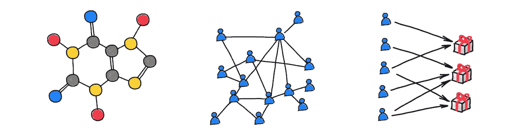

图形抽象了复杂的关系和交互系统。从左到右显示:分子图(代表构成分子的原子之间的化学键)、社交网络(代表用户之间的关系和交互)、推荐系统(代表用户和产品之间的关联)。

GNNs 是如何工作的？图形神经网络将具有节点和边特征的图形作为输入，并计算取决于特征和图形结构的函数。消息传递型 gnn(也称为 MPNN [3])通过在相邻节点之间交换信息来传播图上的特征。典型的 MPNN 架构包括几个传播层，其中每个节点基于其邻居特征的集合进行更新。不同形式的聚合函数(是参数化的，其参数在训练期间学习)产生了三种不同的图形神经网络“味道”:*【卷积】*(相邻特征的线性组合，权重仅取决于图形的结构)*(线性组合，权重也取决于特征)*(一般非线性函数)【4】。在这三种味道中，后者是最普遍的，而前者可以被看作是信息传递的特例。**

**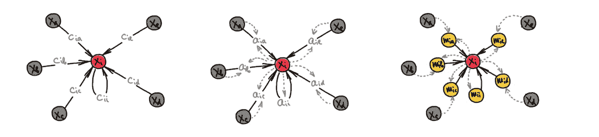**

**GNNs 的三种“味道”，从左到右:卷积、注意力和一般非线性消息传递味道。所有这些都是信息传递的形式。图改编自 P. Velič ković。**

**传播层由基于下游任务学习的参数构成。典型的用例包括*节点* *嵌入*(将每个节点表示为向量空间中的一个点，以这种方式，这些点的接近程度恢复了原始图的连通性，这种任务称为“链接预测”)，*节点方式的*分类或回归(例如，推断社交网络用户的属性)，或*图方式的*预测，通过进一步聚合节点方式的特征(例如，预测分子图的化学属性)。**

# ****消息传递 GNNs 怎么了？****

**D 尽管 GNNs 在所有方面都取得了令人印象深刻的成功，并且最近的研究具有显著的广度和深度，但公平地说，当前图形深度学习方案的主要模型是采用图形并通过消息传递的方式沿其边缘传播节点信息。我相信正是这种“以节点和边缘为中心”的思维模式设置了阻碍该领域未来发展的主要障碍。我在下面概述了当今一般 gnn 的一些突出的局限性:**

**魏斯费勒-雷曼类比是有局限性的。适当选择求和等局部聚合函数[5]使得消息传递等同于 Weisfeiler-Lehman 图同构测试[6]，允许图神经网络从信息在其上传播的方式中发现图的某些结构。这种与图论的重要联系[7]已经产生了关于 GNNs 表达能力的多种理论结果，确定了图上的某些函数是否可以通过消息传递的方式来计算[8]。然而，这种类型的结果通常不能说明这种表示的*效率*(即计算一个函数需要多少层)【9】，也不能说明 GNNs 的*泛化*能力。**

**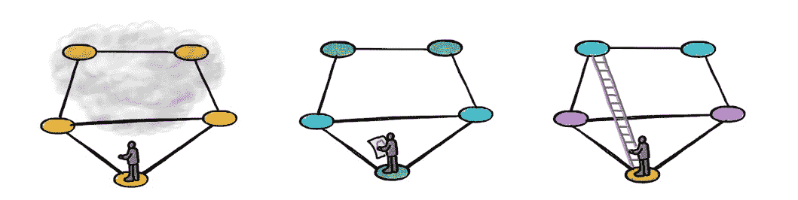**

**Dominique Beaini 为 Weisfeiler-Lehman 测试提出了一个比喻:试图通过在没有地图的情况下行走来理解迷宫的结构。位置编码提供了迷宫的“地图”，而重新布线则提供了爬过“墙”的梯子。**

**Weisfeiler-Lehman 算法甚至无法检测简单的图形结构，如三角形，这让试图将信息传递神经网络用于分子图形的从业者非常失望:例如，在有机化学中，环等结构非常丰富，并在分子行为方式中起着重要作用(例如，芳香环因其在萘等具有强烈气味的化合物中的突出地位而得名)。**

****

**十氢萘(左)和双环戊基(右)的两个分子图的例子，它们在结构上不同(一个有 6 个环，另一个有 5 个环)，但是不能通过 Wesifeiler-Lehman 测试来区分。**

**在过去的几年中，已经提出了几种更具表现力的 GNN 模型的方法。这些包括 Weisfeiler-Lehman 层次结构中的高维同构测试[10](以更高的计算和存储复杂性以及缺乏局部性为代价)，将 wes feiler-Lehman 测试应用于子图集合[11]，或者对图的节点进行“着色”的位置或结构编码[12]，从而帮助打破“混淆”Weisfeiler-Lehman 算法的规律性。位置编码是迄今为止在变形金刚[13]中流行的最常见的技术，现在在 GNNs 中无处不在。虽然存在多种位置编码，但公平地说，特定的选择是依赖于应用程序的，而是凭经验的。**

**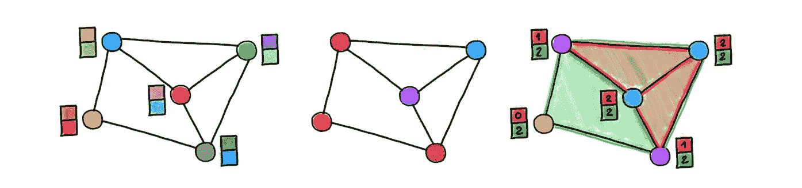**

**位置编码示例。从左到右显示:随机特征、拉普拉斯特征向量(类似于变形金刚中使用的正弦曲线)、结构特征(三角形和矩形的数量)。**

****图重布线打破了 GNNs 的理论基础。【GNNs 和 CNN 之间的一个重要而微妙的区别是，图形既是输入的*部分，也是*的计算结构*。传统的 gnn 使用输入图来传播信息，通过这种方式获得反映图的结构和其上的特征的表示。然而，由于某些结构特征(“瓶颈”)，一些图对信息传播不太友好，导致来自太多节点的信息被“挤压”到单个节点表示中，这种现象被称为“过度挤压”[14]。*****

*现代的 GNN 实现通过将输入图与计算图解耦(或者为了计算的目的对其进行细化)来处理这种现象，这种技术被称为“图重布线”。重新布线可以采取邻域采样的形式(如 GraphSAGE [15]中所做的，最初是为了处理可扩展性)、虚拟节点[16]、连通性扩散[17]或进化[18]或者节点和边缘丢失机制[19]。变形金刚和 GAT [20]等注意力型 gnn 通过给每条边分配不同的权重，有效地“学习”了一个新图，这也可以理解为一种“软”重新布线的形式。最后，“潜在图形学习”方法建立一个特定任务的图形，并在每一层更新它[21](从一些位置编码、初始图形开始，或者有时根本没有图形)也可以归入这一类。总的来说，如果说几乎没有现代 GNN 模型在*原始*输入图上传播信息，这可能只是稍微夸大了情况。*

*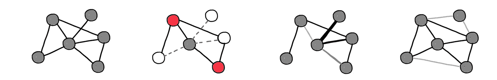*

*GNNs 中使用的不同图形重布线技术。从左到右:原图、邻域采样(如 GraphSAGE [15])、注意(如 GAT [20])、连通性进化(如 DIGL [17])。*

*然而，这对于依赖于消息传递的等价性和 Weisfeiler-Lehman 测试的理论分析来说是个坏消息，weis feiler-Lehman 测试从信息在图上传播的方式获得对图的描述。重新布线打破了这种理论联系，将我们置于机器学习中并不罕见的情况:理论上可以分析的模型与实践中使用的模型并不相同。*

***图的“几何”太差。**图形神经网络可以作为“几何深度学习蓝图”[22]的一个实例获得，这是一个群论框架，允许从数据下的域的对称性中导出深度学习架构。在图的情况下，这种对称性是*节点置换*，因为图没有规范的节点排序。由于这种结构特征，在图上局部操作的 MPNNs 必须依赖于*置换不变*特征聚合函数，这意味着图上没有“方向”的概念，并且信息的传播是各向同性的*【23】。这种情况与在连续域、网格甚至网格上学习明显不同[24]，并且是对 GNNs 的早期批评之一，认为各向同性滤波器不是很有用[25]。**

**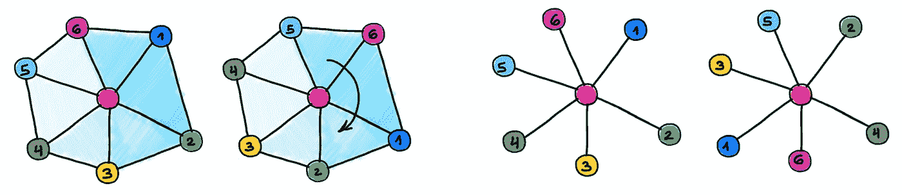**

**左图:网格是具有局部欧几里得结构的离散流形。相邻节点被定义为旋转，允许“方向”的概念。右图:图的结构较少，相邻节点被定义为排列。**

****图的“几何”太丰富了。**“距离而非方向”的问题也与构建节点嵌入时遇到的问题有些关系，在构建节点嵌入时，某个空间中的节点表示之间的距离用于捕捉图的连通性(粗略地说，嵌入空间中靠近的节点预期由图中的边连接)。典型的用例是推荐系统，其中图嵌入用于在由节点表示的实体(例如，在 Twitter 上关注谁)之间创建关联(边)。**

**图形嵌入的质量和它们表达图形结构的能力主要取决于嵌入空间的几何形状及其与图形“几何形状”的兼容性。欧几里得空间是表示学习的真正“战马”，也是迄今为止最简单、最方便的工作对象，但对于许多自然图来说，它却是一个相当糟糕的选择:原因之一是欧几里得度量球的体积增长在半径上是多项式的，但在维度上是指数的[26]，而许多真实世界的图表现出指数的体积增长[27]。结果，嵌入变得“太拥挤”，迫使使用高维空间，这导致更高的计算和空间复杂度。**

**最近流行的一种替代方法是使用负曲线(双曲线)空间[28]，这种空间的指数体积增长与图[29]的指数体积增长更兼容。双曲几何的使用通常导致更低的嵌入维数，从而导致更紧凑的节点表示。然而，图通常倾向于*异质*(即，一些部分可能看起来像树，而其他部分像集团，具有非常不同的体积增长属性)，而双曲嵌入空间是*同质的*(每个点都具有相同的几何形状)。**

**此外，通常不可能在嵌入空间[30]中精确地表示一般图形的度量结构，即使该空间具有非欧几里德几何。因此，图嵌入不可避免地*近似*。然而，更糟糕的是，因为嵌入是用“链接预测”标准构建的，所以高阶结构(三角形、矩形等)的失真。)可能会大得无法控制[31]。在一些应用中，包括社会和生物网络，这种结构发挥着重要作用，因为它们捕捉更复杂的非配对相互作用和基序[32]。**

**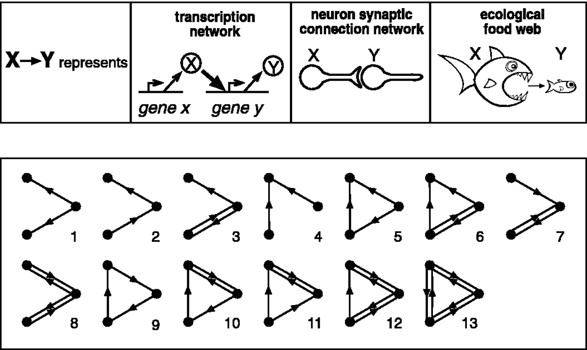**

**图形主题是高阶结构的例子。这种结构已经在许多生物现象的模型图中观察到。图:米洛等人。**

**当数据的结构与底层图形的结构不兼容时，gnn 就会陷入困境。许多图学习数据集和基准对数据*同向性*做出默认假设(即相邻节点的特征或标签相似，或者，使用信号处理术语，“平滑”)。在这种设置下，即使简单的低通滤波(例如，取邻居平均值)也能很好地工作。早期的基准，包括仍然无处不在的 Cora 数据集，是在具有高度同向性的图上进行的，这使得 GNNs 的评估“太容易了”。**

**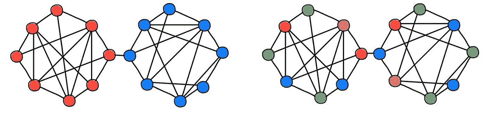**

**嗜同性(左)和嗜异性(右)数据集。在前一种情况下，节点特征或标签的结构与图的结构兼容(即，节点与其邻居“相似”)。相似节点用匹配颜色表示。**

**然而，当处理嗜异性数据时，许多模型显示出令人失望的结果，在这种情况下，必须使用更细微的聚合[33]。在这种情况下观察到的两个典型现象是完全避免使用邻居信息(因此 GNNs 本质上归结为节点式多层感知器)或“过度平滑”，即节点表示的现象随着 GNN 的每一层变得更加平滑，最终崩溃为单个点[34]。后一种现象也发生在嗜同性数据集，似乎是一些类型的 MPNNs 的更基本的困境，使得[难以实现深度图学习模型](/do-we-need-deep-graph-neural-networks-be62d3ec5c59?sk=8daa06935676e78bdb229017d3c4bac9) [35]。**

****通常很难理解 GNNs 学什么。**对深度学习系统的一个批评特别适用于 gnn:这些是难以解释的“黑箱”。虽然可解释性是一个有点模糊的范畴，很大程度上取决于旁观者的观点，但我们可以诚实地承认，在大多数情况下，我们并不真正理解 gnn 所学的东西。最近的几项工作试图通过以紧凑的子图结构和在 GNN 的预测中起关键作用的节点特征的小子集的形式为基于 GNN 的模型提供“解释”来减轻这一缺点[36]。潜在图形学习架构[21]学习的图形也可以看作是“解释”的一种形式。**

**限制通用的消息传递函数有助于排除不可信的输出，并确保 GNN 学习的内容有意义，并在特定领域的应用中得到更好的理解。特别是，有可能赋予消息传递额外的“内部”数据对称性，以便更好地“理解”潜在的问题[37]。一个完美的例子是 E(3)-等变消息传递，它正确地处理了分子图中的原子坐标，最近为蛋白质结构预测架构的胜利做出了贡献，如 AlphaFold [38]和 RosettaFold [39]。**

**另一个例子是 Miles 和 Kyle Cranmer 合著的工作(没有家庭关系)[40]，其中在多体动力系统上学习的消息传递功能被符号公式取代，允许“学习物理方程”。最后，有人试图将 GNNs 与因果推理[41]联系起来，在这种情况下，人们试图构建一个解释不同变量之间因果关系的图。总体来说，这还是一个处于起步阶段的研究方向。**

**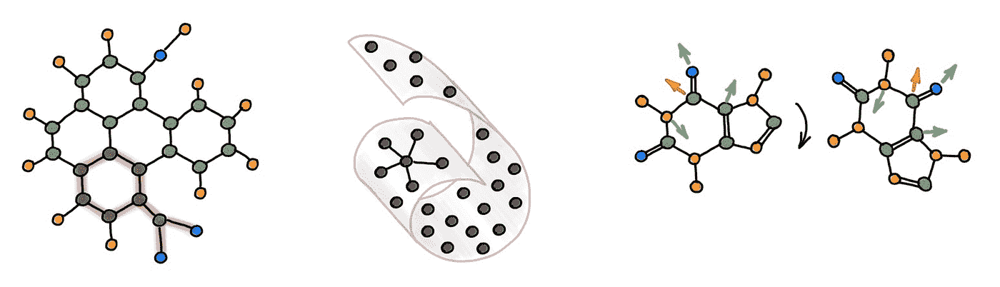**

**不同的“可解释的”GNN 模型(从左到右):图形解释器[36](显示导致致突变性的化学结构)，潜在图形学习[21]和等变信息传递。**

**大多数 GNNs 的实现都是硬件无关的。当今的大多数 gnn 依赖于 GPU 实现，并默认数据适合内存。在处理生物和社交网络等大型图表时，这往往是一厢情愿的想法。在这种情况下，了解底层硬件的限制，如不同的带宽和内存层次的延迟，并有利地使用它是至关重要的。大致来说，同一物理内存中的两个节点和不同芯片上的两个节点之间的消息传递成本(例如，在延迟和功耗方面)可能存在数量级的差异。让 GNNs 对现有的硬件友好是一个重要而又经常被忽视的问题。考虑到设计新芯片所需的时间和精力，以及机器学习技术的发展速度，开发新型以图形为中心的硬件是一个更大的挑战。**

# ****“连续”模型作为图形学习的新蓝图****

**当前“离散”gnn 的一个新兴和有前途的替代方案是“连续”学习模型，其受物理系统的启发，并从微分几何、代数拓扑和微分方程领域开辟了一个新的工具宝库，迄今为止在 graph ML 中基本上没有探索过。**

****把基因想象成连续的物理过程。**我们可以考虑在连续时间内在某个域(也可以是连续的，例如流形，并离散为图)上发生的物理过程(代替离散层)，而不是在图上传递多层消息。时空中某一点的过程状态，取代了 GNN 层所产生的图形中某个节点的潜在特征。该过程由一组参数(代表底层物理系统的属性)控制，这些参数取代了消息传递层的可学习权重。**

**从经典和量子系统中可以构建出大量不同的受物理启发的过程。在一系列论文[42–44]中，我们已经表明，许多现有的 gnn 可能与扩散过程有关，这可能是传播信息的最“自然”的方式，但其他更奇特的方式，如耦合振荡器系统[45]也是可能的，并可能提供某些优势。**

**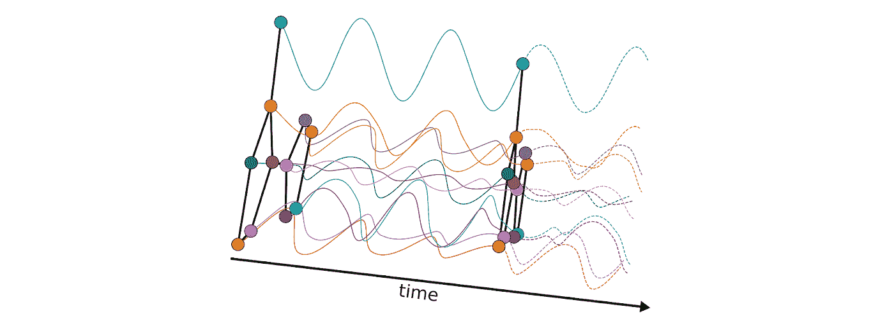**

**图形耦合振荡器系统的动力学[45]。**

**连续系统在时间和空间上都可以离散化。空间离散化，以连接连续区域上邻近点的图形的形式，并且可以在整个时间和空间中改变。这种学习范式彻底背离了传统的 Weisfeiler-Lehman 方案，该方案受到基础输入图假设的严格限制。更重要的是，它带来了一套新的工具，至少在原则上允许解决现有图论技术目前无法解决的重要问题。**

**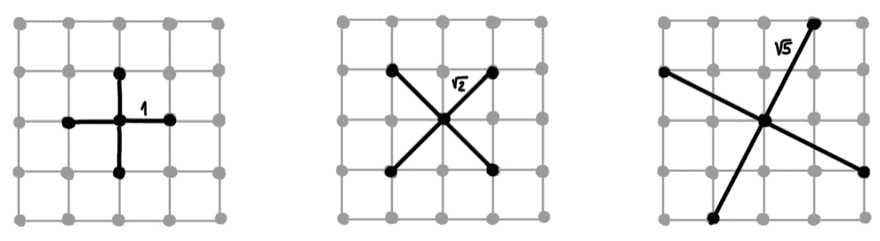**

**2D 拉普拉斯算子的不同离散化。**

**作为最优控制问题的学习。过程在给定时刻的所有可能状态的空间，可以看作是可以表示的函数的一个“假设类”。以这种方式学习被提出为最优控制问题[46]，即，是否可以控制过程(通过选择参数空间中的轨迹)以使其达到某个期望的状态。表达能力可以表述为是否可以通过在控制过程的参数空间中适当选择轨迹来达到给定的功能(使用最优控制理论的术语“可达性”)；效率与达到某个状态需要多长时间有关；而泛化关系到这个过程的稳定性。**

**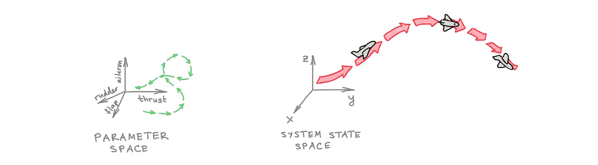**

**作为控制问题的学习:飞机是一个物理系统的隐喻，其 xyz 坐标(“系统状态”)通过操纵推力、副翼和方向舵(“参数空间”)来控制。**

****GNNs 可以从离散化的微分方程中导出。**物理系统的行为通常由微分方程控制，其解产生系统的状态。在某些情况下，这种解决方案可以推导出一个封闭的形式[47]，但更普遍的是，一个人不得不求助于数值解决方案的基础上适当的离散。经过一个多世纪的研究，数值分析文献中积累的不同迭代求解器的财富为图形深度学习提供了潜在的全新架构。**

**例如，我们在[42]中表明，GNNs 的注意力味道可以解释为离散化的扩散 PDEs，具有使用显式数值方案求解的可学习的扩散率。在这种情况下，求解程序的每次迭代(时间上的离散步长)都对应于 GNN 的一个图层。更复杂的求解器，例如使用自适应步长或多步方案，目前在 GNN 建筑的“动物园”中没有直接的类比，但可能会导致未来的建筑洞察力。隐式方案需要在每次迭代中求解线性系统，可以解释为“多跳”滤波器[48]。此外，数值方案具有稳定性和收敛性保证，当它们工作时提供条件，当它们失败时提供理解[49]。**

**数值解算器可以是硬件友好的。迭代求解器比数字计算机更古老，从数字计算机诞生的那一刻起，它就必须意识到底层硬件并有效地利用它。科学计算中的大规模问题通常必须在计算机集群上解决，这些问题在集群中至关重要。**

**图形深度学习的“连续”方法允许以与模拟它们的硬件兼容的方式离散化基础微分方程，潜在地利用来自超级计算社区的大量文献，例如[区域分解技术](https://en.wikipedia.org/wiki/Domain_decomposition_methods)【50】。具体而言，可以使图形重新布线和自适应迭代求解器知道存储器层级，例如，在不同物理位置的节点之间执行少量不频繁的信息传输步骤，而在相同物理存储器中的节点之间执行更频繁的步骤。**

****将进化方程解释为与物理系统相关的能量泛函的梯度流提供了对学习模型的洞察。**许多物理系统都有相关的能量泛函(有时也包含某些对称性或守恒定律)，其中控制系统动力学的微分方程是最小化梯度流[51]。例如，扩散方程最小化了狄利克雷能量[42],其非欧几里得版本(贝尔特拉米流)最小化了波利亚科夫泛函[43],给出了学习模型正在做什么的直观理解。利用最小作用量原理，某些能量泛函产生双曲方程，如波动方程。这类方程的解是“波动的”(振荡的)，与典型的 GNNs 动力学有很大的不同。**

**分析此类流量的极限情况是一项标准工作，可提供对模型行为的深刻见解，否则很难获得这种见解。例如，[在我们最近的论文](/neural-sheaf-diffusion-for-deep-learning-on-graphs-bfa200e6afa6?sk=0b2f814a1180a64460699f6a3277053a)【44】中，我们证明了传统的 GNNs(类似于各向同性扩散方程)必然导致过度光滑，并且只有在同质性假设下才具有分离能力；通过在图上使用额外的结构(细胞束)，可以获得更好的分离能力[52]。在另一篇最近的论文[45]中，我们证明了一个振荡系统避免了极限中的过度振荡。这些结果可以解释为什么在一些 GNN 建筑中会出现某些不良现象，以及如何设计建筑来避免这些现象。此外，将流动的极限情况与分离联系起来揭示了模型表达能力的界限。**

**图形可以被赋予更丰富的结构。我们已经提到，图形可能同时“太差”(即无法捕捉非成对关系等更复杂的现象)和“太丰富”(即难以在同质空间中表示)。处理前一个问题的方法是用额外的结构来“丰富”图。一个很好的例子是前面提到的分子图，其中包含环(图形术语中的环)，化学家将其视为单个实体，而不仅仅是原子和键(节点和边)的集合。**

**在一系列工作[53–54]中，我们展示了图可以被“提升”到更高维度的拓扑结构，称为*单纯型-* 和*细胞复合体*，在此基础上可以设计一个[更复杂的消息传递方案](https://michael-bronstein.medium.com/a-new-computational-fabric-for-graph-neural-networks-280ea7e3ed1a?sk=3d4185067ef3c1cf81793deada08e18f)，不仅允许在传统 GNNs 中的节点之间传播信息，还允许在环(“细胞”)等结构之间传播信息。“提升”操作的适当构造使得这种模型比传统的 Weisfeiler-Lehman 测试更具表现力[55]。**

**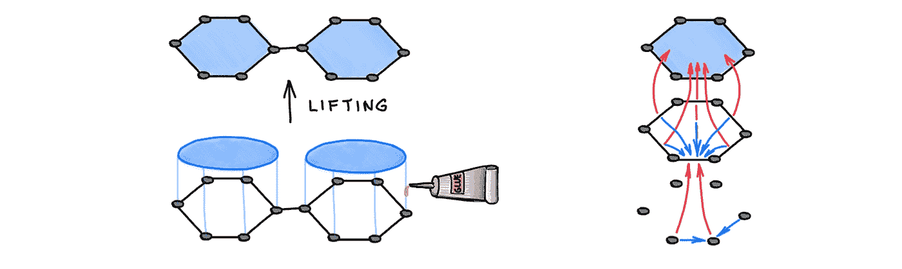**

**左图:将图形提升为细胞复合体。右图:手机信息传递。图改编自[54]。**

**在最近的另一篇论文【44】中，我们展示了通过给节点和边分配向量空间和线性映射，图可以配备一个额外的“几何”结构，称为*细胞层*。传统的 GNNs 隐含地假设一个图具有平凡的底层，这反映在相关的扩散方程的性质和图的拉普拉斯算子的结构中。与传统的 gnn 相比，使层非平凡(并可从数据中学习)产生更丰富的扩散过程，并对其渐近行为给予更大的控制。例如，适当选择的层结构上的扩散方程可以在有限的多个类别中分离，即使在嗜异性设置中[52]。**

**从几何角度来看，层结构类似于*连接*，这是微分几何中描述向量在流形上平行传输的概念【56】。从这个意义上来说，我们可以把层学习看作是一种依赖于下游任务来进化图的“几何”结构的方式。我们表明，通过将层的结构组(使用代数拓扑术语的“限制图”)限制到特殊的正交组，允许节点特征向量仅旋转，可以获得有趣的见解。**

**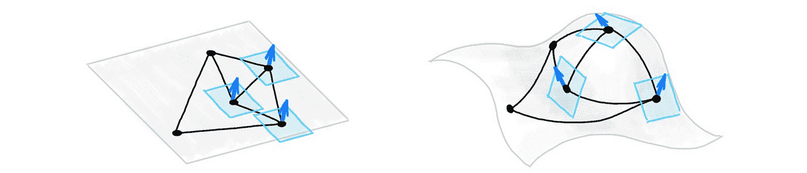**

**建立在图上的细胞层由连接到每个节点的向量空间和连接它们的线性“限制图”组成。在几何术语中，这可以被认为是赋予图形“几何”，而限制映射类似于连接。**

**图中“几何”结构的另一个例子是*曲率*的离散模拟，这是微分几何领域中描述流形局部行为的标准工具。在[18]中，我们表明负图 Ricci 曲率产生篡改图上信息流的“瓶颈”,并导致 GNNs [14]中的过压制现象。离散 Ricci 曲率说明了在许多应用中很重要的高阶结构(三角形和矩形)。这种结构对于传统的图嵌入来说“太丰富了”，因为图是异质的(具有非恒定曲率)，而通常用于嵌入的空间，甚至是非欧几里得空间，是同质的(恒定曲率)。**

**在另一篇最近的论文[57]中，我们展示了一种具有可控 Ricci 曲率的*异构*嵌入空间的构造，可以选择这些嵌入空间来匹配图的曲率，从而不仅可以更好地表示邻域(距离)结构，还可以更好地表示更高阶的结构，如三角形和矩形。此类空间被构造为齐次和旋转对称流形的乘积，并允许使用标准黎曼梯度下降法进行有效优化[58]。**

**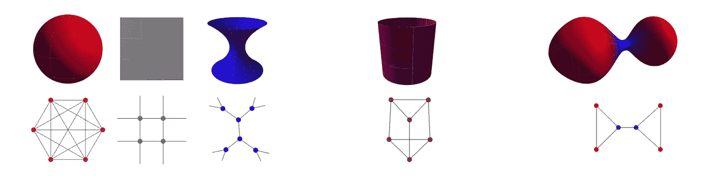**

**左图:具有恒定的正、零和负 Ricci 曲率的空间形式(球面、平面和双曲面)及其具有相应离散 Forman 曲率的图形类比(团、网格和树)。中间:一个乘积流形(圆柱体可以认为是一个圆和一条线的乘积)。右图:变曲率异质流形及其图形类比。详见[57]。图:弗朗西斯科·迪·乔瓦尼。**

****位置编码可以被视为域的一部分。**将图形视为连续流形的离散化，可以将节点位置和特征坐标视为同一空间的不同维度。在这种情况下，该图可用于表示由这种嵌入诱导的黎曼度量的离散模拟，与嵌入相关的调和能量是狄利克雷能量的非欧几里得扩展，在弦理论中称为波利亚科夫泛函[59]。这种能量的梯度流是一个扩散型方程，它发展了位置和特征坐标[43]。在节点的位置上构建图形是特定任务图形重新布线的一种形式，它也随着扩散的迭代(层)而改变。**

**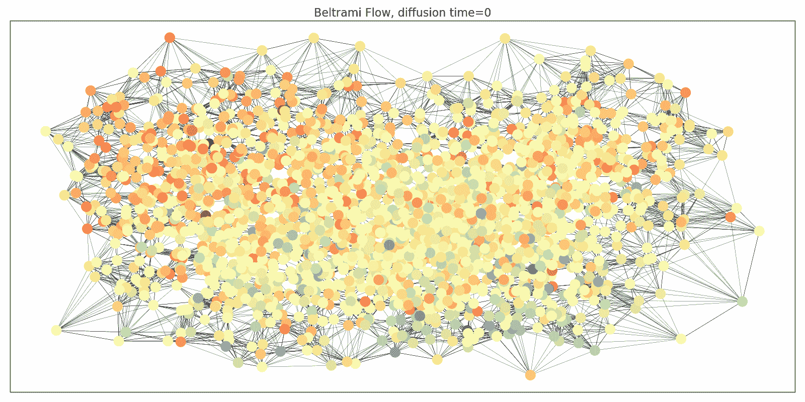**

**通过重新布线的 Beltrami 流，Cora 图的位置和特征分量的演变(颜色表示特征向量)。动画:詹姆斯·罗博特姆。**

****域的进化取代了图的重布线。**扩散方程也可以应用于图的连通性，作为预处理步骤，旨在改善信息流和避免过度抑制。克利茨佩拉等人[17]提出了一种基于个性化页面排名的算法，这是一种图形扩散嵌入的形式。在[18]中，我们分析了这个过程，指出了它在异构环境中的问题行为，并提出了一个替代的图形重布线方案，该方案是由 Ricci 流启发的。这种重新布线减少了导致图形瓶颈的负向弯曲边的影响。 *Ricci 流*是流形的几何演化方程，非常类似于应用于黎曼度量的扩散方程，并且是微分几何中流行且强大的技术，包括著名的庞加莱猜想的证明。更一般地说，我们可以考虑一个演化过程的耦合系统，而不是作为预处理步骤来执行图的重新布线:一个演化特性，另一个演化域(图)。**

**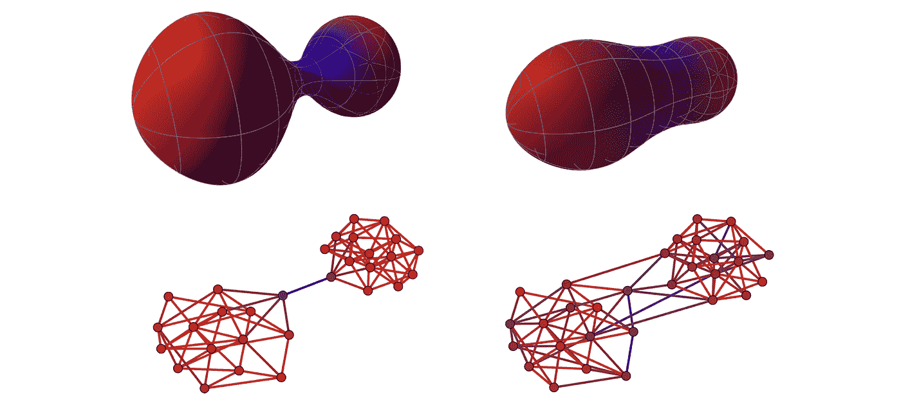**

**上图:一个哑铃形的黎曼流形，具有负弯曲的瓶颈(负曲率由冷色编码)，经历了基于曲率的度量演化，变得“更圆”，更少“瓶颈”。下图:基于曲率的图形重布线的类似过程，减少了瓶颈，使图形对消息传递更友好。参见[我们的博客文章](/over-squashing-bottlenecks-and-graph-ricci-curvature-c238b7169e16?sk=f5cf01cbd57b4fee8fb3a89d447e56a9)了解更多详情。图:杰克托普。**

# ****结束语****

****这真的是新的吗？我们必须避免陷入的一个陷阱是，新模型基于“名义上”的花哨的数学形式主义，而底层模型仍然大致做着上一代 gnn 所做的事情。例如，人们可以认为[44]中研究的层扩散是消息传递的一个特例。微分几何[18，43]和代数拓扑学[44，53–54]的工具使深刻的理论结果成为可能，这使我相信这已经不太可能了。然而，新的理论框架能带我们走多远，以及它是否能够解决该领域目前尚未回答的问题，仍然是一个开放的问题。****

**这些方法会在实践中实际使用吗？对于实践者来说，一个至关重要的问题是这些方法是否会产生新的更好的架构，或者仍然是一个脱离现实世界应用的理论装置，仅仅用于证明定理。我相信该领域将是务实的，通过拓扑和几何工具获得的理论见解将允许为现有的 GNN 架构做出更好的选择，例如，如何限制消息传递功能以及何时使用这种特定选择。**

****我们已经超越了信息传递吗？**最后，一个有点语义性质的问题是，所描述的方法是否仍然可以被称为“消息传递”。虽然观点可能各不相同，从将 GNN 的每一种形式都视为信息传递[60]到宣称需要超越这种范式[61]，但我有点不愿意使用这个术语。在数字计算机上的任何计算都是一种信息传递的形式。然而，在 GNNs 的*严格意义上的*中，消息传递是一个计算概念，通过将信息从一个节点发送到另一个节点来实现，这是一个固有的离散过程。另一方面，所描述的物理模型以连续的方式在节点之间共享信息(例如，在图耦合振荡器的系统中，一个节点的动态取决于其邻居在每个时间点的动态)。当描述这种系统的微分方程被离散化和数值求解时，相应的迭代方案确实通过消息传递来实现。**

**然而，人们可以假设使用这种物理系统的实际实现[62]或其他计算范例，如模拟电子学或光子学[63]。在数学上，基本微分方程的解有时可以以封闭形式给出:例如，各向同性扩散方程的解是具有高斯核的卷积。在这种情况下,“邻居”的影响被吸收到内核的结构中，没有实际的“消息传递”发生。因此，这种模式的连续性需要一个更合适的术语——例如，在此时没有更好的想法的情况下，“空间耦合”或“信息传播”。作为一种计算原语，当与其他角度(如本文介绍的角度)协同应用时，消息传递现在和将来都可能是有用的。**

**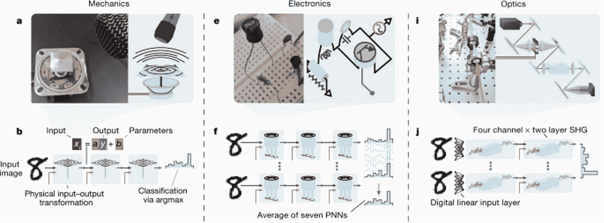**

**通过真实物理系统反向传播的深度学习。图片:Wright 等人[61]。**

**[1]参见 ICLR 2021 年[统计数据。](https://twitter.com/chrmanning/status/1332725903470706688?s=20&t=jkQ8nc6YO5JzLlU4Lj3WVw)**

**[2]我把变形金刚算作 GNNs 的[实例。](https://thegradient.pub/transformers-are-graph-neural-networks/)**

**[3]我使用术语“GNN”来指代任意图形神经网络架构，使用“MPNN”来指代基于本地消息传递的架构。**

**[4]卷积风格的典型代表是从图形信号处理领域出现的“光谱”图形神经网络，如 M. Defferrard 等人[具有快速局部光谱过滤的图形卷积神经网络](https://papers.nips.cc/paper/6081-convolutional-neural-networks-on-graphs-with-fast-localized-spectral-filtering.pdf) (2016) NIPS 和 T. Kipf 和 M. Welling，[具有图形卷积网络的半监督分类](https://arxiv.org/pdf/1609.02907.pdf) (2017) ICLR。Petar Velič ković在[16]中介绍了注意力的味道，尽管人们可以考虑由 F. Monti 等人开发的 Monet 架构，使用混合模型 CNN(2017)CVPR 在图形和流形上的几何深度学习，作为对位置坐标的注意力形式。J. Gilmer 等人在《量子化学的神经信息传递》( 2017 年)ICML 使用了一种通用的信息传递形式和名称 MPNN。**

**我们在 M. M. Bronstein 等人的“原型书”[几何深度学习:网格、组、图形、测地线和量规](https://arxiv.org/abs/2104.13478) (2021) arXiv:2104.13478 中采用的风味命名是由 Petar Velič ković提出的。在我这种二分法的早期版本中(如 MLSS Moscow 2019 的[教程)，我使用了术语*“线性”*(其中特征计算的形式为 **Y** = **AX** ，其中 **A** 通常是图邻接矩阵的某种形式)、*“线性特征相关”*(**y**=**a**(【t22 这比书中采用的符号更不通用，因为它假设基于总和的聚合。](https://www.dropbox.com/s/z6lh612kpphx8g8/MLSS%202019.pdf?dl=0)**

**[5]局部聚集函数必须是内射的。参见 K. Xu 等人[图神经网络有多强大？](https://arxiv.org/abs/1810.00826) (2019) ICLR。**

**[6] B. Weisfeiler 和 A. Lehman，将图简化为标准形式以及其中出现的代数(1968)。信息技术 2(9):12–16。**

**[7]参见 C. Morris 等人，Weisfeiler 和 Leman go 机器学习:迄今为止的故事(2021) arXiv:2112.09992，了解历史笔记和深入综述。**

**[8] Z. Chen 等人用 GNNs (2019) NeurIPS 关于图同构测试与函数逼近的等价性，给出了图同构测试与置换不变图函数逼近的等价性。**

**[9]例如，N. Dehmamy，A.-L. Barabási，于荣，[理解图神经网络在学习图拓扑中的表示能力](https://papers.nips.cc/paper/9675-understanding-the-representation-power-of-graph-neural-networks-in-learning-graph-topology.pdf) (2019) NeurIPS 表明，学习图上的某些函数(某些阶的图矩)需要某些最小深度的 gnn。另见 F. Geerts 和 J. L. Reutter,《图形神经网络的表达能力和近似性质》( 2022 年), ICLR。**

**[10]所谓的严格递增权力的“k-WL 检验”的等级制度。拉斯洛·巴拜将 *k* 的发明归功于 WL 与[鲁道夫·马顿](https://www.cs.toronto.edu/dcs/people-faculty-combin.html)和[尼尔·伊莫曼](https://en.wikipedia.org/wiki/Neil_Immerman)和[埃里克·兰德](https://en.wikipedia.org/wiki/Eric_Lander)的独立测试。参见 L. Babai，[拟多项式时间内的图同构](https://arxiv.org/abs/1512.03547) (2015)，arXiv:1512.03547 第 27 页。**

**[11]已经有几篇论文提出在子图集合上应用 GNNs，包括我们自己的 B. Bevilacqua 等人，[等变子图聚合网络](https://arxiv.org/abs/2110.02910) (2021) arXiv:2110.02910。见[我们关于这个话题的帖子](/using-subgraphs-for-more-expressive-gnns-8d06418d5ab?sk=8806ffcd9ecf74c440d40df53528c1c7)。**

**[12]通过计数局部子结构的结构编码由 G. Bouritsas，f .弗拉斯卡等人在 GNNs 的背景下提出[通过子图同构计数提高图神经网络表达能力](https://arxiv.org/abs/2006.09252) (2020)。arXiv:2006.09252。另见 P. Barceló等人的《具有局部图形参数的图形神经网络》( 2021) arXiv:2106.06707。**

**[13] A. Vaswani 等人，[注意力是你所需要的全部](https://papers.nips.cc/paper/2017/file/3f5ee243547dee91fbd053c1c4a845aa-Paper.pdf) (2017) NIPS。**

**[14]过度抑制现象不是 GNNs 独有的，以前在 seq2seq 模型中也观察到过。但是，在体积呈指数增长的图表中，这种情况会变得特别严重。参见 U. Alon 和 E. Yahav，[关于图神经网络的瓶颈及其实际含义](https://arxiv.org/pdf/2006.05205.pdf) (2020)。arXiv:2006.05205 和我们的论文[14]对这一现象进行了描述和分析。**

**[15] W. Hamilton 等人，[大型图上的归纳表示学习](https://proceedings.neurips.cc/paper/2017/file/5dd9db5e033da9c6fb5ba83c7a7ebea9-Paper.pdf) (2017) NIPS 使用邻域采样来应对可扩展性。**

**[16] P. W .巴塔格利亚等人，关系归纳偏差、深度学习和图网络(2018)，arXiv:1806.01261。**

**[17] J .克利茨佩拉等人，[扩散改善图形学习](https://proceedings.neurips.cc/paper/2019/file/23c894276a2c5a16470e6a31f4618d73-Paper.pdf) (2019) NeurIPS 通过个性化页面排名嵌入(一种“连通性扩散”的形式)使用重新布线。**

**[18] J. Topping，F. Di Giovanni 等人，[通过曲率了解图的过度挤压和瓶颈](https://arxiv.org/pdf/2111.14522.pdf) (2022) ICLR。**

**[19]丢弃可以在边或节点上完成，并且也导致更好的表达能力(原因类似于子图 GNNs)，参见例如 Y. Rong 等人， [DropEdge:走向节点分类上的深度图卷积网络](https://openreview.net/pdf?id=Hkx1qkrKPr) (2020)和 P. A. Papp 等人， [DropGNN:随机丢弃增加了图神经网络的表达能力](https://arxiv.org/pdf/2111.06283.pdf) (2021) arXiv:2111.06283。**

**[20]p . veli kovi 等人，[图形注意网络](https://arxiv.org/abs/1710.10903) (2018) *ICLR* 。**

**[21]最早的“潜图学习”架构之一是我们的工作 Y. Wang et al. [用于在点云上学习的动态图 CNN](https://arxiv.org/pdf/1801.07829.pdf)(2019)ACM Trans .点云上的图形 38(5):146，其中初始的“位置编码”(点的 xyz 坐标)表示数据的几何形状，图形用于在相关部分之间传播信息。A. Kazi 等人考虑了更一般的情况，[用于图卷积网络的可微分图模块(DGM)](https://arxiv.org/pdf/2002.04999.pdf)(2020)arXiv:2002.04999，其中没有明显的数据几何，并且为手头的任务学习适当的“位置编码”。另见我的[关于主题](/manifold-learning-2-99a25eeb677d?sk=1c855a020f09b72edfa50a8aba5f24a0)的博文。**

**[22]在我的 [ICLR 主题演讲](https://youtu.be/w6Pw4MOzMuo)中有更多关于这方面的内容。**

**[23]在图中进行“各向异性”传播的尝试有几种，最近的一种是 D. Beaini 等人的《定向图网络》(2020)，arXiv:2010.02863，旧的一种是我们的论文 F. Monti，K. Otness，M. M. Bronstein，motif net:a motif-based Graph Convolutional Network for directed graphs(2018)，arXiv:1802.01572。必须提供某种形式的外部信息，例如，在 DGNNs 的情况下，图的拉普拉斯特征向量的梯度，以及在 MotifGNNs 的情况下，一些选择的子结构。**

**[24] D. Boscaini 等人，利用各向异性卷积神经网络学习形状对应(2016) NIPS。**

**[25]例如，见 [Ferenc Huszar 的博客文章](https://www.inference.vc/how-powerful-are-graph-convolutions-review-of-kipf-welling-2016-2/)。**

**[26]回忆一下二维和三维体积的经典公式， *πr* 和 4π *r* /3:这些是 *r* 中的多项式。一个 2 *n* 维球的通式是 v =π*ⁿ*t20】rt22】ⁿ/*n*！，显示出对 *n* 的指数依赖性。**

**[27]社会和生物网络等现实世界的图表显示出等级结构和与负曲率相关的幂律度分布。**

**[28] Q. Liu，M. Nickel，D. Kiela，双曲图神经网络(2019)。**

**[29]参见，例如，m .博古等人，[网络几何学](https://arxiv.org/abs/2001.03241) (2021)《自然评论物理学》3:114–135。**

**[30]更正式地说，不存在*等距嵌入*，即没有办法在欧几里得空间中表示图的距离度量。一个简单的例子是建立在球赤道上的三个点和极点上的一个点上的图，所有这些点都有单位测地线距离。这样的图不能嵌入任何有限维的欧几里得空间。**

**[31] C. Seshadhri 等人，富三角形复杂网络的低秩表示的不可能性(2020)，PNAS 117(11):5631–5637。**

**[32]r . Milo 等人在《网络主题:复杂网络的简单构建模块》( 2002)Science 298(5594):824–827 中提供了现实世界网络中高阶结构的经典证据。更多最近的结果，见 f .巴蒂斯顿等人,《超越成对相互作用的网络:结构和动力学》( 2020)物理学报告 874:1–92。**

**[33] J. Zhu 等，超越图神经网络中的同质性:当前的限制和有效设计(2020)，NeurIPS。**

**[34]在 H. Nt 和 T. Maehara 的《再访图形神经网络:我们拥有的只是低通滤波器》( 2019) arXiv:1812.08434v4 和 K. Oono 和 t .铃木,《图形神经网络指数地失去对节点分类的表达能力》( 2020) ICLR。**

**[35]见我有点争议的[上一篇](/do-we-need-deep-graph-neural-networks-be62d3ec5c59?sk=8daa06935676e78bdb229017d3c4bac9)。从那时起，已经出现了几个非常深的 gnn，但总的来说，这似乎比其他深度学习架构更难。**

**[36] R. Ying 等人，GNNExplainer:为图形神经网络生成解释(2019)，NeurIPS**

**[37]在物理学中，通常区分空间的外部对称和场的内部对称。这在 Taco Cohen 的[博士论文中解释得很透彻。](https://pure.uva.nl/ws/files/60770359/Thesis.pdf)**

**[38] J. Jumper 等人，用 AlphaFold 进行高度精确的蛋白质结构预测，Nature 596:583–589，2021。**

**[39] M. Baek 等人，使用三轨道神经网络准确预测蛋白质结构和相互作用，科学 373:871–876，2021。**

**[40] M. Cranmer 等人，[从具有归纳偏差的深度学习中发现符号模型](https://arxiv.org/pdf/2006.11287.pdf) (2020) arXiv:2006.11287**

**[41]m . ze EVI 等人将图形神经网络与结构因果模型联系起来(2021 年)arXiv:2109.04173。**

**[42] B. Chamberlain，J. Rowbottom 等人，[GRAND:Graph Neural Diffusion](https://arxiv.org/abs/2106.10934)(2021)ICML。**

**[43] B. P. Chamberlain 等人， [Beltrami 流和图形上的神经扩散](https://arxiv.org/pdf/2110.09443.pdf) (2021) NeurIPS。**

**[44] C .博德纳尔，f .迪·乔瓦尼等人，神经束扩散:对 GNNs 中异嗜性和过度光滑的拓扑透视(2022) arXiv:2202.04579。参见附带的[博文](/neural-sheaf-diffusion-for-deep-learning-on-graphs-bfa200e6afa6?sk=0b2f814a1180a64460699f6a3277053a)。**

**[45] T. K. Rusch 等人,《图形耦合振荡器网络》( 2022 年)ICML。**

**[46]深度学习问题作为最优控制的观点已经在例如 M. Benning 等人的《深度学习作为最优控制问题:模型和数值方法》( 2019) arXiv:1904.05657 中讨论过。**

**[47]欧几里得域ℝ *ⁿ* 上的各向同性扩散方程的解析解作为与*热核*(δ初始条件下热方程的“基本解”)的卷积给出，这是形式为 *h* ( *x* ， *y* ，*t*)=(4π*t*)*ⁿᐟ*exp()在非欧情况下，热核可以在拉普拉斯特征基中展开，并且是位置相关的(即 *h* ( *x* ， *y* ， *t* )不能像以前那样写成*h*(*x*-*y*， *t* )。热核已广泛用于计算机图形和几何处理文献，包括 J. Sun、M. Ovsjanikov 和 L. Guibas 的著名热核签名，这是一种基于热扩散的简明且可证明信息丰富的多尺度签名(2009 年)《计算机图形论坛》28(5):1383–1392。马克斯·奥夫斯贾尼科夫小组最近在网格深度学习的背景下使用了类似的想法，参见 n .夏普等人，扩散网:表面上的离散化不可知论学习(2020) arXiv:2012.00888。**

**[48]弗拉斯卡等人， [SIGN:可扩展的初始图神经网络](https://grlplus.github.io/papers/77.pdf) (2020)关于图表示学习的 ICML 研讨会。**

**[49]在我们的框架和研究数值格式特性的典型环境之间有一个微妙但重要的区别。在后一种情况下，人们感兴趣的是获得给定偏微分方程的*精确*数值解。在我们的例子中，我们使用一个偏微分方程的解来参数化一个函数空间，而不是求解一个特定的方程。**

**[50]区域分解方法将一个大规模问题分解成较小的子问题，这些子问题可以在多处理器机器上并行独立解决。通信仅沿着相邻子域的界面发生。**

**【51】一个*梯度流*可以看作是变分问题中梯度下降的连续类比。它源于泛函的最优性条件(变分法中称为[欧拉-拉格朗日方程](https://en.wikipedia.org/wiki/Euler%E2%80%93Lagrange_equation))。**

**[52]关于分离能力的结果，参见我们论文[44]中的定理 13、14、16、18、19、21 和 23，关于过度光滑的结果，参见定理 25-28。**

**[53] C .博德纳尔，f .弗拉斯卡等人，[魏斯费勒和雷曼 go 拓扑:消息传递单纯网络](http://proceedings.mlr.press/v139/bodnar21a/bodnar21a.pdf) (2021) ICML。**

**[54] C .博德纳尔、f .弗拉斯卡等人，[魏斯费勒和雷曼 go cellular:CW Networks](https://arxiv.org/pdf/2106.12575.pdf)(2021)neur IPS。参见附带的[博文](https://michael-bronstein.medium.com/a-new-computational-fabric-for-graph-neural-networks-280ea7e3ed1a?sk=3d4185067ef3c1cf81793deada08e18f)。**

**[55]在某种程度上，更高维的 gnn 如 C. Morris 等人 [Weisfeiler 和 Leman go neural:高阶图神经网络](https://aaai.org/ojs/index.php/AAAI/article/view/4384/4262) (2019) AAAI，H. Maron 等人[不变和等变图网络](https://arxiv.org/abs/1812.09902) (2019) ICLR，也可以归入这一类。**

**[56]联系是微分几何中描述流形上两个不同点处的切空间之间的关系的对象。它用于流形上向量的并行传输。关于图，A. Singer 和 H.-T. Wu 研究了离散版本，向量扩散图和连接拉普拉斯算子(2012)纯数学和应用数学通讯 65(8)，他们也使用了术语“连接拉普拉斯算子”(它是我们具有正交限制图的细胞层的特定设置)。具有正交消息传递的图形神经网络已经由例如 K. Guo，Orthogonal Graph Neural Networks(2021)arXiv:2109.11338 进行了探索。**

**[57] F. Di Giovanni，G. Luise 和 M. M. Bronstein，曲率感知图嵌入的异构流形(2022) arXiv:2202.01185。**

**[58]黎曼优化是一类约束优化方法，其中假设数据点位于一个流形上。黎曼优化通过在局部切空间中操作在流形上执行梯度下降，参见 N. Boumal 的优秀参考文献，[光滑流形上的优化介绍](http://sma.epfl.ch/~nboumal/book/index.html) (2022)。在我们构造的非均匀流形中，旋转对称因子只有一个坐标，参见我们论文[56]的 4.1 节。**

**[59] A .波利亚科夫,《玻色子弦的量子几何》( 1981 年)《物理学通讯》B 103:207。**

**[60]p . veli kovi，信息一路向上传递(2022) arXiv:2202.11097。**

**[61]参见[我们对 2021 年的预测](/predictions-and-hopes-for-graph-ml-in-2021-6af2121c3e3d?sk=e2dfa5d2f63dab879a2d097382a3cf66)。**

**[62] L. G. Wright 等人，用反向传播训练的深度物理神经网络(2022 年),《自然》601:549–555。**

**[63] R. Hamerly，[深度学习的未来是光子](https://spectrum.ieee.org/the-future-of-deep-learning-is-photonic) (2021) IEEE 频谱。**

**我感谢多米尼克·比艾尼、克里斯蒂安·博德纳尔、乔治·布里特萨斯、本·张伯伦、董小文、弗朗切斯科·迪·乔瓦尼、尼尔斯·哈默拉、哈盖·马龙、锡德·米什拉、克里斯多夫·莫利斯、詹姆斯·罗博顿和佩塔尔·韦利奇科维奇进行了富有成效的讨论和评论，其中一些内容非常充实，相当于“集体编辑”。不用说，任何遗留的遗漏或错误都是我的责任。**

***关于图形深度学习的其他文章，请参见《走向数据科学》中我的* [*其他帖子*](https://towardsdatascience.com/graph-deep-learning/home) *，* [*订阅我的帖子*](https://michael-bronstein.medium.com/subscribe) *和* [*YouTube 频道*](https://www.youtube.com/c/MichaelBronsteinGDL) *，获取* [*中等会员*](https://michael-bronstein.medium.com/membership) *，或者关注我的***