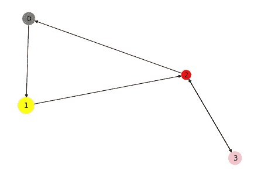
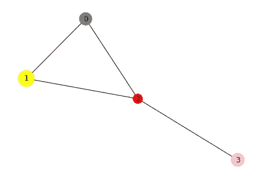
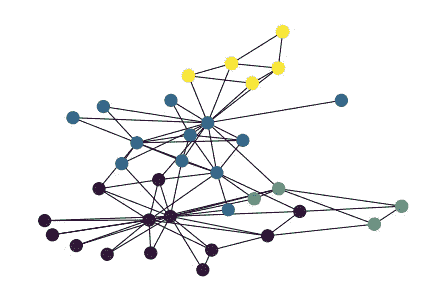
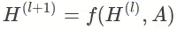
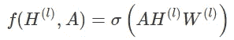
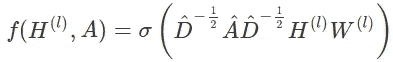
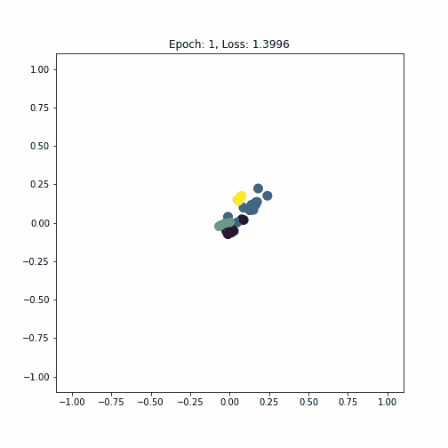

# Python 中的图形神经网络

> 原文：<https://towardsdatascience.com/graph-neural-networks-in-python-c310c7c18c83>

## 简介和逐步实施

最近，图机器学习领域发展迅速，该领域的大多数模型都是用 Python 实现的。本文将介绍图形的概念以及使用 Python 处理图形的一些基本方法。之后，我们将创建一个图卷积网络，并让它在 PyTorch 的帮助下在现实世界的关系网络上执行节点分类。这里描述的整个工作流程可以从[的 Colab 笔记本](https://colab.research.google.com/drive/17eRoYIBxlgxAMKHV4qmXmBYL2-Wkl3Xx?usp=sharing)中获得。

# 什么是图？

一个图，在其最一般的形式下，仅仅是节点以及节点之间的一组边的集合。形式上，一个图 *G* 可以写成 *G = (V，E)* ，其中 *V* 表示节点， *E* 表示相应的边集。有两种主要类型的图，有向图和无向图。有向图的边从它们的原点 *u* 节点指向目标节点 *v* ，而无向图中的边是没有方向的，因此( *u，v*)*∑*e*⇔*(*v，u*)*∑*e .*图可以用一个可以通过让每个节点索引特定的行和列来创建该矩阵。然后，边的存在可以被表示为邻接矩阵中的条目，意味着如果( *u，v*)∈*E*和 **A** [ *u* ， *v* ] = 0，则 **A** [ *u* ， *v* ] = 1，否则。如果图仅由无向边组成，邻接矩阵将是对称的，但是如果图是有向的，就不一定是对称的。***

**为了在 Python 中操作图形，我们将使用非常流行的 networkx 库[1]。我们首先创建一个空的有向图 *H* :**

```
**import networkx as nxH = nx.DiGraph()**
```

**然后，我们将向图中添加 4 个节点。每个节点有两个特征，颜色和大小。机器学习问题中的图通常具有带有特征的节点，例如社交网络中某个人的姓名或年龄，然后模型可以使用这些特征来推断复杂的关系并进行预测。Networkx 附带了一个内置的实用函数，用于以列表形式填充带有节点的图形，此外还有以下特性:**

```
**H.add_nodes_from([
  (0, {"color": "gray", "size": 450}),
  (1, {"color": "yellow", "size": 700}),
  (2, {"color": "red", "size": 250}),
  (3, {"color": "pink", "size": 500})
])for node in H.nodes(data=True):
  print(node)> (0, {'color': 'gray', 'size': 450})
> (1, {'color': 'yellow', 'size': 700})
> (2, {'color': 'red', 'size': 250})
> (3, {'color': 'pink', 'size': 500})**
```

**图中的边被定义为包含源节点和目标节点的元组，因此例如边`(2, 3)`将节点 2 连接到节点 3。因为我们有一个有向图，所以也可以有一条指向相反方向的边`(3, 2)`。多条边可以作为列表的一部分添加到图表中，方式与节点相似:**

```
**H.add_edges_from([
  (0, 1),
  (1, 2),
  (2, 0),
  (2, 3),
  (3, 2)
])print(H.edges())> [(0, 1), (1, 2), (2, 0), (2, 3), (3, 2)]**
```

**现在我们已经创建了一个图表，让我们定义一个函数来显示关于它的一些信息。我们验证了该图确实是有向的，并且它具有正确的节点数和边数。**

```
**def print_graph_info(graph):
  print("Directed graph:", graph.is_directed())
  print("Number of nodes:", graph.number_of_nodes())
  print("Number of edges:", graph.number_of_edges())print_graph_info(H)> Directed graph: True
> Number of nodes: 4
> Number of edges: 5**
```

**绘制您正在使用的图表也非常有帮助。这可以通过使用`nx.draw`来实现。我们使用节点的特征来给每个节点着色，并在绘图中给每个节点指定它们自己的大小。因为节点属性是以字典的形式出现的，而且 draw 函数只接受列表，所以我们必须首先转换它们。生成的图看起来像是应该有 4 个节点、5 条边和正确的节点特征。**

```
**node_colors = nx.get_node_attributes(H, "color").values()
colors = list(node_colors)node_sizes = nx.get_node_attributes(H, "size").values()
sizes = list(node_sizes)nx.draw(H, with_labels=True, node_color=colors, node_size=sizes)**
```

****

**有向图，作者的图像。**

**让我们把有向图 *H* 转换成无向图 *G* 。之后，我们再次打印关于该图的信息，我们可以看到转换成功了，因为输出表明它不再是一个有向图。**

```
**G = H.to_undirected()
print_graph_info(G)> Directed graph: False
> Number of nodes: 4
> Number of edges: 4**
```

**奇怪的是，边的数量减少了一个。如果我们仔细观察，我们可以看到边`(3, 2)`已经消失了，这是合理的，因为一个无向边只能由一个元组来表示，在这种情况下是`(2, 3)`。**

```
**print(G.edges())> [(0, 1), (0, 2), (1, 2), (2, 3)]**
```

**当我们想象无向图时，我们可以看到边的方向消失了，而其他一切都保持不变。**

```
**nx.draw(G, with_labels=True, node_color=colors, node_size=sizes)**
```

****

**一个无向图，作者的图像。**

# **空手道俱乐部网络**

**现在我们已经对如何在 Python 中处理图形有了一个高层次的理解，我们将看看一个真实世界的网络，我们可以使用它来定义一个机器学习任务。扎卡里的空手道俱乐部网络[2]就是为此而选择的。它代表了 w .扎卡里在七十年代研究的空手道俱乐部成员之间的友谊关系。如果两个人在俱乐部之外进行社交，则图中的一条边将他们连接起来。**

**空手道俱乐部数据集可通过 PyTorch Geometric (PyG ) [3]获得。PyG 库包含了对图形和其他不规则结构进行深度学习的各种方法。我们首先检查数据集的一些属性。它似乎只包含一个图形，这是意料之中的，因为它描述了一个俱乐部。此外，数据集中的每个节点被分配一个唯一代表每个节点的 34 维特征向量。俱乐部的每个成员都是机器学习术语中 4 个派别或类别之一的一部分。**

```
**from torch_geometric.datasets import KarateClubdataset = KarateClub()
print("Dataset:", dataset)
print("# Graphs:", len(dataset))
print("# Features:", dataset.num_features)
print("# Classes:", dataset.num_classes)> Dataset: KarateClub()
> # Graphs: 1
> # Features: 34
> # Classes: 4**
```

**我们可以进一步探索数据集中唯一的图形。我们看到该图是无向的，它有 34 个节点，每个节点有 34 个特征，如前所述。边用元组表示，一共有 156 个。然而，在 PyG 中，无向边被表示为两个元组，每个方向一个，也称为双向，这意味着在空手道俱乐部图中有 78 个唯一的边。PyG 只包括 **A** 中非零的条目，这就是为什么边是这样表示的。这种类型的表示被称为*坐标格式*，通常用于稀疏矩阵。每个节点都有一个标签， *y* ，它保存了相应节点属于哪个类的信息。该数据还包含一个`train_mask`,它具有我们在训练期间已知的基础事实标签的节点的索引。有 4 个真实节点，每个派系一个，现在的任务是推断其余节点的派系。**

```
**data = dataset[0]print(data)
print("Training nodes:", data.train_mask.sum().item())
print("Is directed:", data.is_directed())> Data(x=[34, 34], edge_index=[2, 156], y=[34], train_mask=[34])
> Training nodes: 4
> Is directed: False**
```

**我们将空手道俱乐部网络转换为 Networkx 图，这允许我们使用`nx.draw`函数来可视化它。节点根据它们所属的职业(或派别)进行着色。**

```
**from torch_geometric.utils import to_networkxG = to_networkx(data, to_undirected=True)
nx.draw(G, node_color=data.y, node_size=150)**
```

****

**扎卡里的空手道俱乐部网络，由作者图像。**

# **半监督节点分类**

**当训练模型来执行节点分类时，它可以被称为半监督机器学习，这是用于在训练期间组合有标签和无标签数据的模型的通用术语。在节点分类的情况下，我们可以访问图中的所有节点，甚至是那些属于测试集的节点。唯一缺少的信息是测试节点的标签。**

**图卷积网络(GCNs)将用于对测试集中的节点进行分类。为了给出简单的理论介绍，图形神经网络中的层可以写成非线性函数 *f* :**

****

**以图的邻接矩阵 ***A*** 和某层的(潜在)节点特征**l*作为输入。图形神经网络的简单分层传播规则如下所示:***

****

**其中 ***W*** 为第 *l* 个神经网络层的权重矩阵， *σ* 为非线性激活函数。将权重与邻接矩阵相乘意味着对每个节点的所有(1 跳)相邻节点的所有特征向量进行求和和聚合。但是，不包括节点本身的特征向量。**

**为了解决这个问题，Kipf 和 Welling [4]将单位矩阵添加到邻接矩阵中，并将这个新矩阵表示为***—***=***A***+***I***。邻接矩阵的乘法也将改变特征向量的比例。为了抵消这个***—***被对称地乘以其对角度矩阵，产生最终的 GCN 传播规则:**

****

**GCN 层已经是 what PyG 的一部分，它可以很容易地作为`GCNConv`类导入。与在普通神经网络中层叠层的方式相同，也可以层叠多个 GCN 层。具有 3 层 GCN 将导致三个连续的传播步骤，导致每个节点用来自 3 跳之外的信息进行更新。模型的第一层必须具有与每个节点的要素数量一样多的输入单元。与最初的 GCN 论文一致，除了最后一个维度被设置为 2 之外，潜在维度被设置为 4。这允许我们稍后将所学习的潜在嵌入绘制为二维散点图，以查看该模型是否设法学习对于属于同一类的节点来说相似的嵌入。双曲正切激活函数在 GCN 层之间用作非线性函数。输出层将二维节点嵌入映射到 4 个类中的 1 个。**

```
**from torch.nn import Linear
from torch_geometric.nn import GCNConvclass GCN(torch.nn.Module):
  def __init__(self):
    super(GCN, self).__init__()
    torch.manual_seed(42)
    self.conv1 = GCNConv(dataset.num_features, 4)
    self.conv2 = GCNConv(4, 4)
    self.conv3 = GCNConv(4, 2)
    self.classifier = Linear(2, dataset.num_classes) def forward(self, x, edge_index):
    h = self.conv1(x, edge_index)
    h = h.tanh()
    h = self.conv2(h, edge_index)
    h = h.tanh()
    h = self.conv3(h, edge_index)
    h = h.tanh()
    out = self.classifier(h)
    return out, hmodel = GCN()
print(model)> GCN(
>   (conv1): GCNConv(34, 4)
>   (conv2): GCNConv(4, 4)
>   (conv3): GCNConv(4, 2)
>   (classifier): Linear(in_features=2, out_features=4, bias=True)
> )**
```

**我们使用交叉熵作为损失函数，因为它非常适合于多类分类问题，并初始化 Adam 作为随机梯度优化器。我们创建一个标准的 PyTorch 训练循环，并让它运行 300 个周期。注意，虽然所有节点确实获得了对它们的节点嵌入的更新，但是仅针对训练集中的节点计算损失。在训练期间，损失急剧减少，这意味着分类效果良好。来自最后一个 GCN 层的二维嵌入被存储为一个列表，以便我们可以在训练期间动画化嵌入的演变，给出对模型的潜在空间的一些洞察。**

```
**criterion = torch.nn.CrossEntropyLoss()
optimizer = torch.optim.Adam(model.parameters(), lr=0.01)def train(data):
  optimizer.zero_grad()
  out, h = model(data.x, data.edge_index)
  loss = criterion(out[data.train_mask], data.y[data.train_mask])
  loss.backward()
  optimizer.step()
  return loss, hepochs = range(1, 301)
losses = []
embeddings = []for epoch in epochs:
  loss, h = train(data)
  losses.append(loss)
  embeddings.append(h)
  print(f"Epoch: {epoch}\tLoss: {loss:.4f}")> Epoch: 1    Loss: 1.399590
> Epoch: 2    Loss: 1.374863
> Epoch: 3    Loss: 1.354475
> ...
> Epoch: 299  Loss: 0.038314
> Epoch: 300  Loss: 0.038117**
```

**Matplotlib 可以用来制作节点嵌入的散点图，其中每个点都根据它们所属的派系进行着色。对于每一帧，除了该时期的训练损失值之外，我们还显示该时期。最后，动画被转换成 GIF 格式，如下图所示。**

```
**import matplotlib.animation as animationdef animate(i):
  ax.clear()
  h = embeddings[i]
  h = h.detach().numpy()
  ax.scatter(h[:, 0], h[:, 1], c=data.y, s=100)
  ax.set_title(f'Epoch: {epochs[i]}, Loss: {losses[i].item():.4f}')
  ax.set_xlim([-1.1, 1.1])
  ax.set_ylim([-1.1, 1.1])fig = plt.figure(figsize=(6, 6))
ax = plt.axes()
anim = animation.FuncAnimation(fig, animate, frames=epochs)
plt.show()gif_writer = animation.PillowWriter(fps=20)
anim.save('embeddings.gif', writer=gif_writer)**
```

****

**节点嵌入的演变，作者图片。**

**GCN 模型设法线性分离不同类的几乎所有节点。这是令人印象深刻的考虑到它只给了每个派系一个标记的例子作为输入。**

**希望你对图形神经网络的介绍感兴趣。gnn 是非常通用的算法，因为它们可以应用于复杂的数据和解决不同类型的问题。例如，通过在我们的神经网络末端使用一些置换不变池(如 mean)来简单地聚集节点特征，它可以对整个图进行分类，而不是对单个节点进行分类！**

**[1] A. Hagberg，D. Schult 和 P. Swart，“使用 NetworkX 探索网络结构、动力学和功能”， *SciPy2008* ，2008，【networkx.org】T2**

**[2] W .扎卡里，“小群体中冲突和裂变的信息流模型”， *J. Anthropol .Res* 。doi:10.1086/jar . 33 . 4 . 3629752**

**[3] M. Fey 和 J. Lenssen，“用 PyTorch 几何快速图形表示学习”， *ICLR，* 2019，[pyg.org](https://www.pyg.org)，麻省理工学院许可**

**[4] T. Kipf 和 M. Welling，“基于图卷积网络的半监督分类”， *ICLR* ，2016， [arXiv: 1609.02907](https://arxiv.org/abs/1609.02907)**