# 基于 PyG 的图神经网络在节点分类、链路预测和异常检测方面的应用

> 原文：<https://towardsdatascience.com/graph-neural-networks-with-pyg-on-node-classification-link-prediction-and-anomaly-detection-14aa38fe1275>

## Pytorch 几何在主要图问题上的实现

照片由 [DeepMind](https://unsplash.com/ja/@deepmind?utm_source=unsplash&utm_medium=referral&utm_content=creditCopyText) 在 [Unsplash](https://unsplash.com/s/photos/graph-neural-network?utm_source=unsplash&utm_medium=referral&utm_content=creditCopyText) 上拍摄

图形神经网络是一种机器学习算法，设计用于图形结构数据，如社交图、网络安全中的网络或分子表示。在过去的几年中，它发展迅速，并被用于许多不同的应用中。在这篇博文中，我们将回顾它在主要图问题上的代码实现，以及 GNN 的所有基础知识，包括它的应用和算法细节。

# 图形神经网络的应用

GNN 可用于解决各种与图形相关的机器学习问题:

*   **节点分类**
    预测节点的类别或标签。例如，在网络安全中检测网络中的欺诈实体可以是节点分类问题。
*   **链接预测**
    预测节点之间是否存在潜在的链接(边)。例如，社交网络服务基于网络数据建议可能的朋友联系。
*   **图形分类**
    将图形本身分类成不同的类别。一个例子是通过观察一种化合物的图形结构来确定它是有毒的还是无毒的。
*   **社区检测** 将节点划分成簇。一个例子是在社交图中寻找不同的社区。
*   **异常检测**
    以无监督的方式发现图中的离群节点。如果您的目标上没有标签，可以使用这种方法。

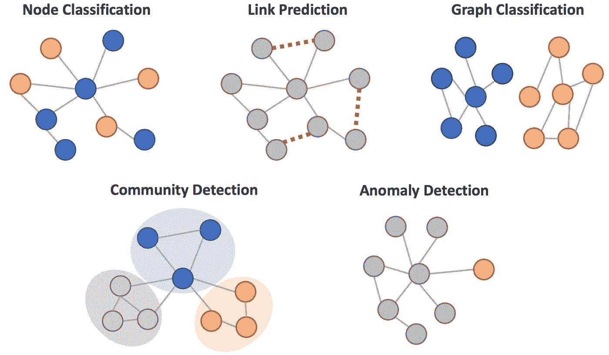

GNN 应用程序(图片由作者提供)

在这篇博文中，我们将回顾节点分类、链接预测和异常检测的代码实现。

# 图形卷积——直觉

图形神经网络在过去几年中发展迅速，已经发明了许多变体(更多细节，请参见[本调查](https://arxiv.org/pdf/1901.00596.pdf))。在这些 GNN 变体中，[图卷积网络](https://tkipf.github.io/graph-convolutional-networks/)可能是最流行和最基本的算法。在本节中，我们将回顾其算法的高级介绍。

图卷积是基于图结构提取/总结节点信息的有效方法。它是卷积神经网络的卷积运算的变体，通常用于图像问题。

在图像中，像素在网格中按结构排序，卷积运算中的过滤器(权重矩阵)以预先确定的步长在图像上滑动。像素的相邻像素由过滤器大小决定(在下图中，过滤器大小为 3 x 3，蓝色过滤器中的八个灰色像素是相邻像素)，过滤器中的加权像素值聚合为一个值。此卷积运算的输出比输入图像的大小小，但具有更高级别的输入视图，这对于预测图像问题(如图像分类)非常有用。

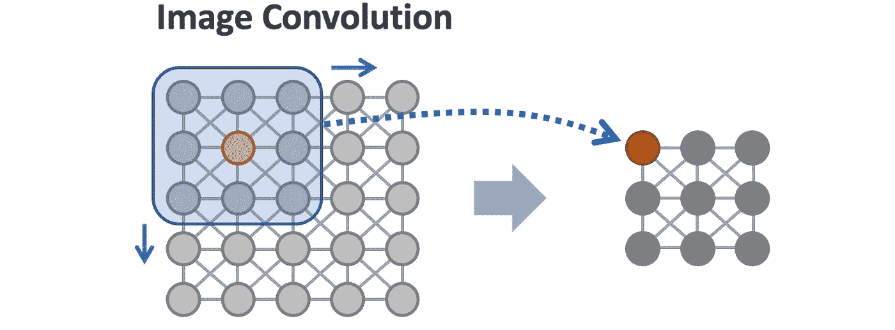

作者图片

在图中，节点以非结构化的方式排序，并且节点之间的邻域大小不同。图表卷积采用给定结点(下图中的红色结点)及其相邻结点(蓝色圆圈内的灰色结点)的结点要素的平均值来计算该结点的更新结点制图表达值。通过这种卷积运算，节点表示捕获了局部化的图形信息。

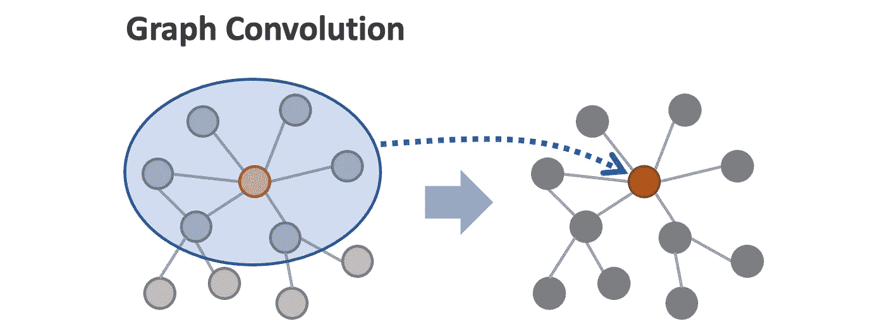

作者图片

下图显示了图形卷积操作的更多细节。对邻近结点(蓝色)的结点要素和目标结点(红色)的结点要素进行平均。然后将其乘以权重向量(W ),其输出更新目标节点的节点特征(更新的节点值也称为节点嵌入)。

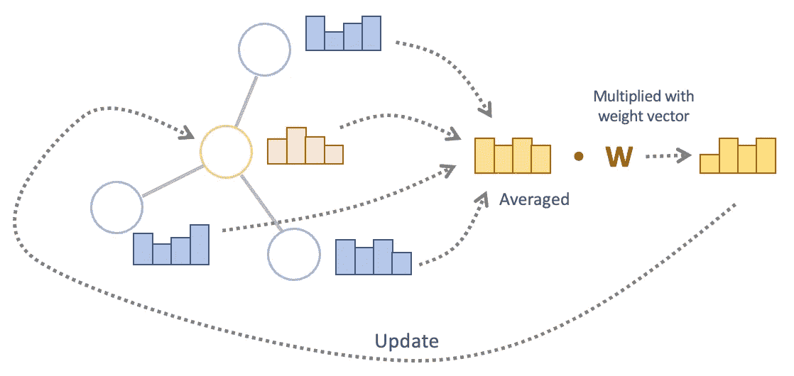

图形卷积运算(图片由作者提供)

*对感兴趣的人来说，利用度矩阵的逆矩阵将节点特征归一化后聚合在* [*原论文*](https://arxiv.org/pdf/1609.02907.pdf) *中，而不是简单的平均(论文中的方程(8))。*

在此卷积运算中需要注意的一点是，图形卷积的数量决定了将多少步以外的节点要素聚合到每个节点中。在下图中，第一个卷积将蓝色节点的要素聚合到橙色节点中，第二个卷积可以将绿色节点的要素合并到橙色节点中。

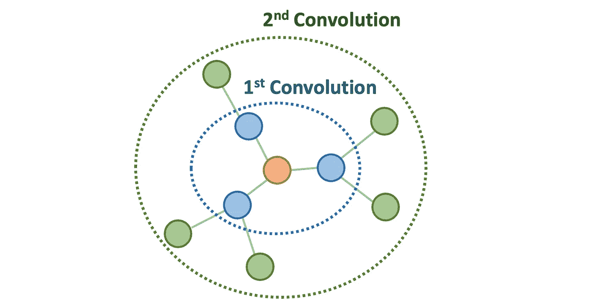

卷积的数量决定了节点要素聚合的程度(图片由作者提供)

# Cora —图表基准数据集

在接下来的几节中，我们将回顾 GCN 代码的实现。在我们深入研究它们之前，让我们先熟悉一下我们将要使用的数据集。 [Cora 数据集](https://paperswithcode.com/dataset/cora)是一个论文引用网络数据，包含 2708 篇科学出版物。图中的每个节点代表一个出版物，如果一篇论文引用了另一篇论文，则一对节点用一条边连接。

通过这篇文章，我们使用 [PyG (Pytorch Geometric)](https://www.pyg.org/) 来实现 GCN，这是一个流行的 GNN 库。Cora 数据集也可以使用 PyG 模块加载:

*来源于 Pytorch Geometric 的 Cora 数据集最初来自于“* [*用机器学习*](https://doi.org/10.1023/A:1009953814988) *”论文。*

节点特征和边信息如下所示。节点特征是 1433 个单词向量，指示每个出版物中单词的不存在(0)或存在(1)。边用邻接表表示。

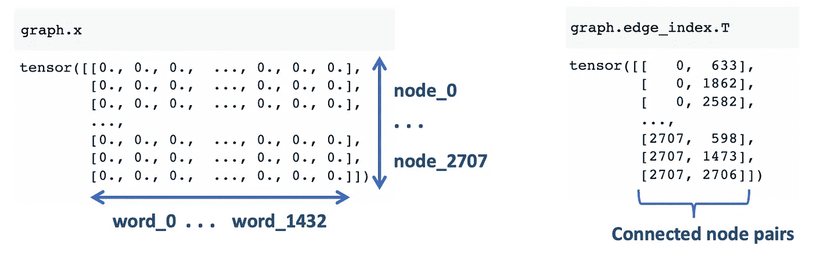

节点特征和边列表(图片由作者提供)

每个节点都有七个类中的一个，这将是我们的模型目标/标签。

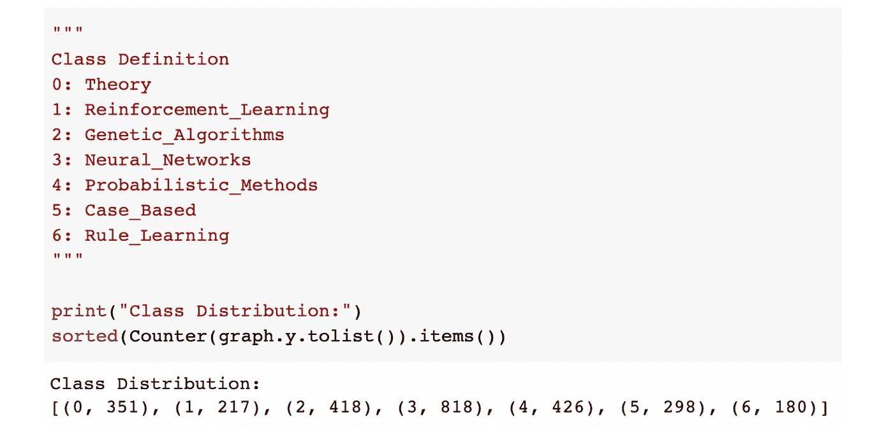

班级分布(图片由作者提供)

使用 [NetworkX](https://networkx.org/) 库可以可视化图形数据。节点颜色代表节点类。

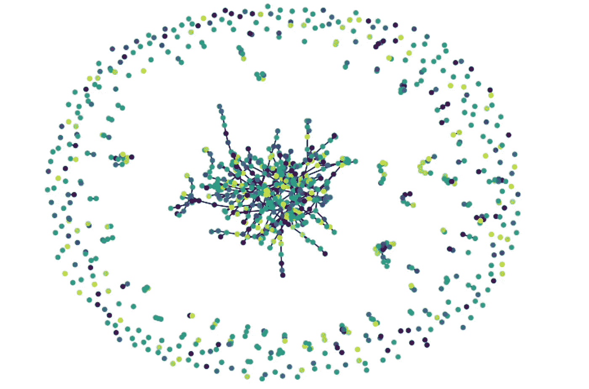

Cora 数据集的可视化(图片由作者提供)

# 节点分类

对于节点分类问题，我们使用 PyG 的`RandomNodeSplit`模块将节点分为 train、valid 和 test(我们替换了数据中的原始分割掩码，因为它的 train 集太小)。

请注意，数据分割被写入图形对象的`mask`属性(见下图),而不是分割图形本身。这些掩码用于训练损失计算和模型评估，而图卷积使用整个图数据。

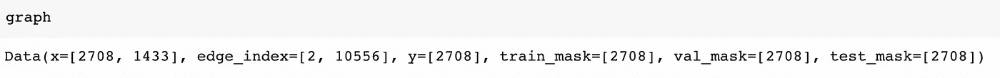

图形对象具有遮罩属性(按作者分类的图像)

## 节点分类的基线模型(MLP)

在我们建立 GCN 之前，我们只使用节点特征来训练 MLP(多层感知器，即前馈神经网络)以设置基线性能。该模型忽略了节点连接(或图结构),并试图仅使用单词向量对节点标签进行分类。模型类如下所示。它有两个隐藏层(`Linear`)，带有 ReLU 激活，后跟一个输出层。

我们将使用普通 Pytorch 培训/评估设置来定义培训和评估功能。

该模型的测试精度为 **73.2%** 。

## GCN 论节点分类

接下来，我们将训练 GCN，并将它的表现与 MLP 进行比较。我们使用一个非常简单的模型，它有两个图形卷积层，并在它们之间重新激活。这种设置与[原 GCN 论文](https://arxiv.org/pdf/1609.02907.pdf)(方程式 9)相同。

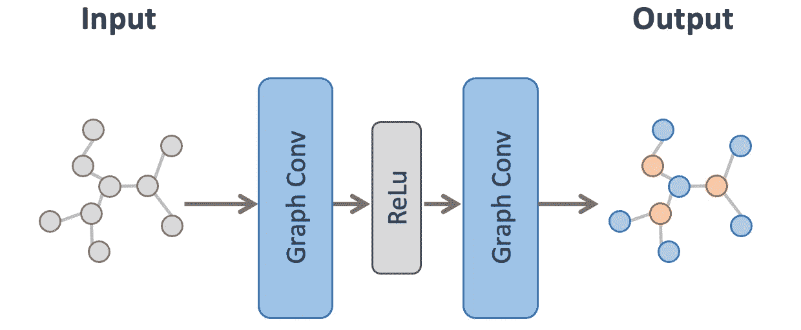

GCN 节点分类模型架构(图片由作者提供)

该模型的测试集精度为 **88.0%** 。我们从 MLP 获得了大约 15%的准确性改进。

# 链接预测

链接预测比节点分类更棘手，因为我们需要一些调整来使用节点嵌入对边进行预测。预测步骤描述如下:

1.  编码器通过用两个卷积层处理图形来创建节点嵌入。
2.  我们在原图中随机添加负面链接。这使得模型任务具有来自原始边的正链接和来自添加边的负链接的二元分类。
3.  解码器使用节点嵌入对包括负链接的所有边进行链接预测(即二进制分类)。它根据每条边上的一对节点计算节点嵌入的点积。然后，它聚合嵌入维度上的值，并在每条边上创建一个代表边存在概率的值。

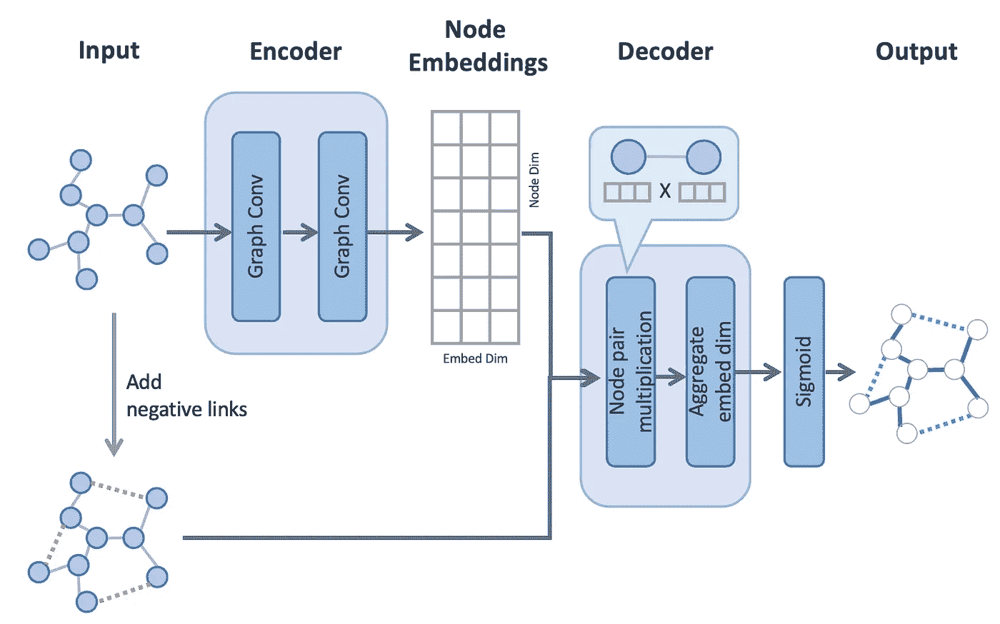

链接预测模型架构(图片由作者提供)

该模型结构来自[变分图自动编码器](https://github.com/tkipf/gae)中的原始链接预测实现。代码如下所示。这改编自[PyG repo](https://github.com/pyg-team/pytorch_geometric/blob/master/examples/link_pred.py)中的代码示例，该示例基于图形自动编码器实现。

对于此链接预测任务，我们希望将链接/边随机分为训练数据、有效数据和测试数据。我们可以使用 PyG 的`RandomLinkSplit`模块来实现。

输出数据如下所示。

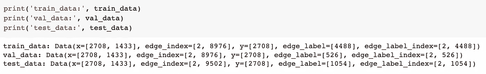

随机链接拆分输出(图片由作者提供)

关于这个输出数据，有几点需要注意。

首先，在`edge_index`上执行分割，使得训练和验证分割不包括来自验证和测试分割的边(即，仅具有来自训练分割的边)，并且测试分割不包括来自测试分割的边。这是因为编码器使用`edge_index`(和`x`)来创建节点嵌入，这种设置确保了在对验证/测试数据进行预测时，节点嵌入上没有目标泄漏。

第二，两个新属性(`edge_label`和`edge_label_index`)被添加到每个分割数据。它们是对应于每个分割的边标签和边索引。`edge_label_index`将用于解码器进行预测，而`edge_label`将用于模型评估。

第三，负链接被添加到`val_data`和`test_data`两者，其数量与正链接(`neg_sampling_ratio=1.0`)相同。它们被添加到`edge_label`和`edge_label_index`属性中，但没有添加到`edge_index`中，因为我们不想在编码器上使用负链接(或节点嵌入创建)。此外，我们不会在此向训练集添加负面链接(通过设置`add_negative_train_samples=False`)，因为我们会在上述`train_link_predictor`的训练循环中添加它们。训练期间的这种随机化被认为是使模型更健壮。

下图总结了编码器和解码器如何执行边缘分割(每个阶段都使用彩色边缘)。

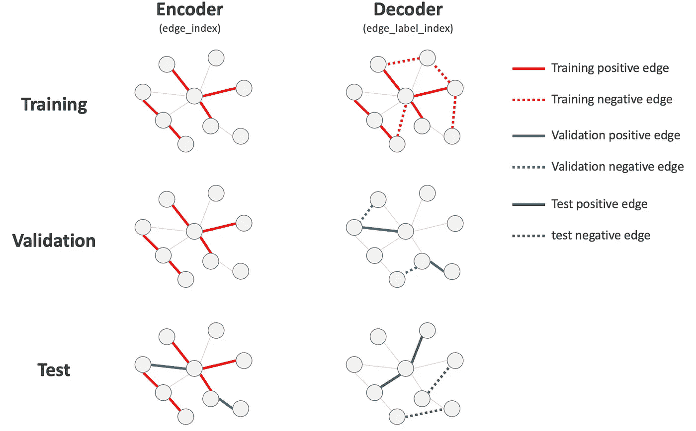

边缘分割总结(图片由作者提供)

我们现在可以用下面的代码来训练和评估这个模型。

该模型的检验 AUC 为 92.5%。

# 异常检测

我们再次使用 Cora 数据集进行异常检测任务，但它与上一个略有不同:异常值被合成注入。数据集有两种不同类型的异常值(异常值定义来自[本文](https://arxiv.org/pdf/2206.10071.pdf)):

*   **结构异常值**
    密集连接的节点与稀疏连接的常规节点形成对比
*   **上下文异常值**
    属性与其相邻节点显著不同的节点

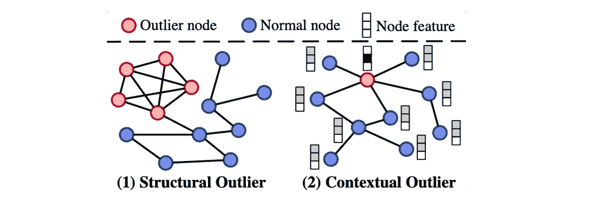

节点异常类型(来源:【https://arxiv.org/pdf/2206.10071.pdf】T21

对于这个异常检测任务，我们使用的是 [PyGOD 库](https://docs.pygod.org/en/latest/index.html)，这是一个构建在 PyG 之上的图形异常检测库。我们可以通过 PyGOD 模块加载异常值注入的 Cora 数据集。

下面的代码显示了异常值类型分布。

输出:`Counter({0: 2570, 1: 68, 2: 68, 3: 2})`

如果你对这些异常值是如何注入的感兴趣，你可以看看[关于异常值生成器模块](https://docs.pygod.org/en/dev/pygod.generator.html)的 PyGOD 文档，它解释了操作细节。请注意，标签`y`将仅用于模型评估，而不用于训练标签，因为我们正在训练一个无监督的模型。

为了检测这些异常值，我们正在训练来自本文的`DOMINANT`(属性网络上的深度异常检测)模型。这是一个具有图形卷积层的自动编码网络，其重构误差将是节点异常分数。该模型按照以下步骤进行预测。

1.  ***属性化网络编码器*** 用创建节点嵌入的三个图卷积层处理输入图。
2.  ***结构重构解码器*** 使用学习到的节点嵌入来重构原始图边(即邻接矩阵)。它从每个可能的节点对计算节点嵌入的点积，从而在每个节点对上创建指示边存在的概率分数。
3.  ***属性重构解码器*** 使用获得的节点嵌入重构原始节点属性。它有一个图表卷积层来预测属性值。
4.  在最后一步中，通过在每个节点上加权平均来组合来自上述两个解码器的重构误差，并且组合的误差将是最终的误差/损失。这些最终误差也是节点的异常分数。

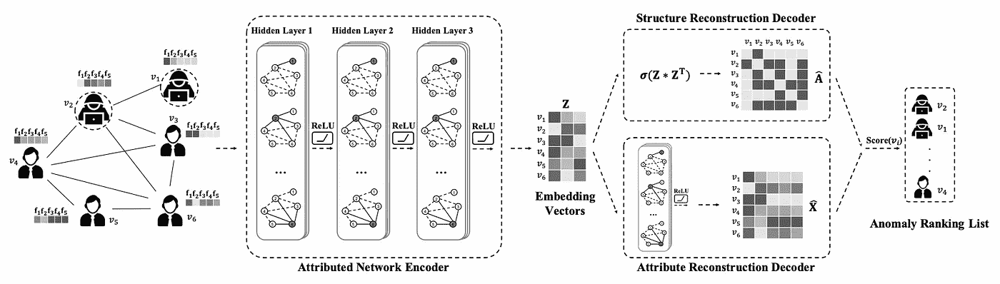

主导模型架构(来源:[属性网络上的深度异常检测](https://www.public.asu.edu/~kding9/pdf/SDM2019_Deep.pdf)

正如您在下面看到的，使用 PyGOD 可以很容易地实现`DOMINANT`模型。

该模型的 AUC 为 84.1%，而其平均精度为 20.8%。这种差异很可能是由于目标不平衡造成的。由于这是一个无监督的模型，我们可能无法期待一个非常准确的模型，但你可以在原始论文中看到[它仍然优于任何其他流行的异常检测算法。](https://www.public.asu.edu/~kding9/pdf/SDM2019_Deep.pdf)

这篇文章到此为止！

如果你感兴趣，完整的代码可以在下面的 Google Colab 和 GitHub repo 中找到。

 [## 谷歌联合实验室

### 用 PyG 实现 GNN

colab.research.google.com](https://colab.research.google.com/drive/1Ksca_p4XrZjeN0A6jT5aYN6ARvwFVSbY?usp=sharing)  [## gnn _ pyg _ implementations . ipynb at tomonori-masui/graph-neural-networks

### 用 PyG 实现 GNN

github.com](https://github.com/tomonori-masui/graph-neural-networks/blob/main/gnn_pyg_implementations.ipynb) 

# 参考

*   Benjamin Sanchez-Lengeling 等人，[图形神经网络简介](https://distill.pub/2021/gnn-intro/)
*   Ameya Daigavane 等人，[理解图上的卷积](https://distill.pub/2021/understanding-gnns/)
*   弗朗切斯科·卡萨莱格诺，[图卷积网络——图上的深度学习](/graph-convolutional-networks-deep-99d7fee5706f)
*   Thomas N. Kipf，Max Welling，[图卷积网络的半监督分类](https://arxiv.org/pdf/1609.02907.pdf) (2017)，ICLR，2017
*   Thomas N. Kipf，Max Welling，[变分图自动编码器](https://arxiv.org/pdf/1611.07308.pdf) (2016)
*   丁等人**。**，[属性网络上的深度异常检测](https://www.public.asu.edu/~kding9/pdf/SDM2019_Deep.pdf) (2019)
*   Kay Liu 等，[图的基准节点离群点检测](https://arxiv.org/pdf/2206.10071.pdf) (2022)