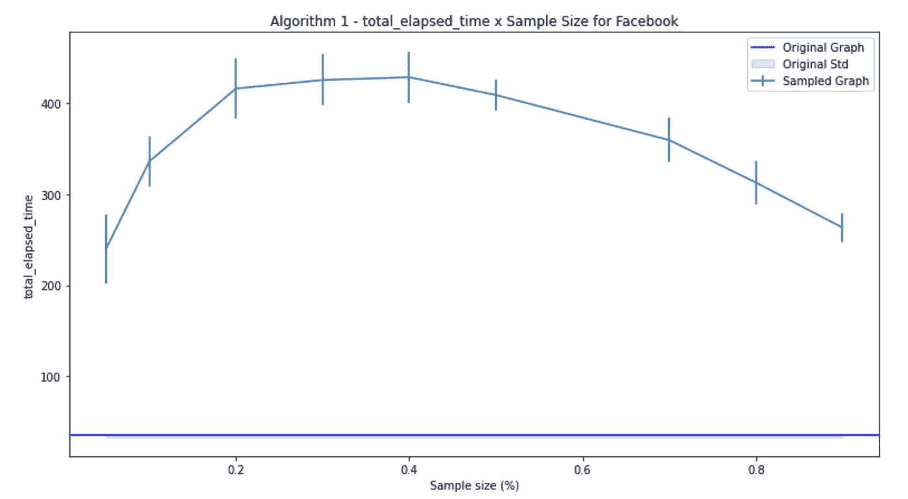
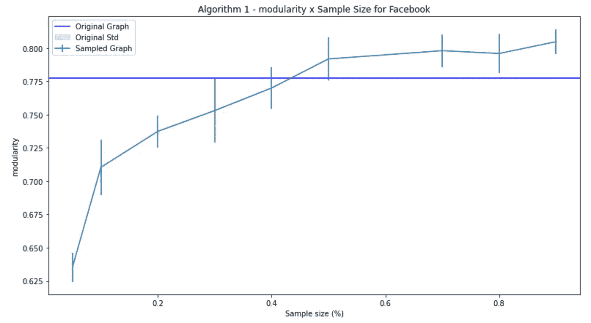
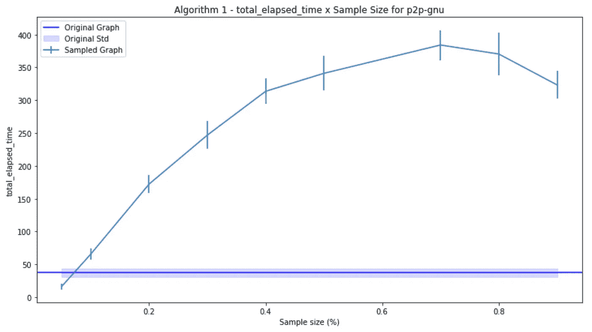
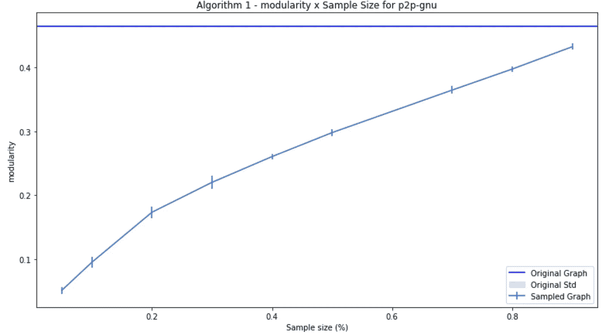
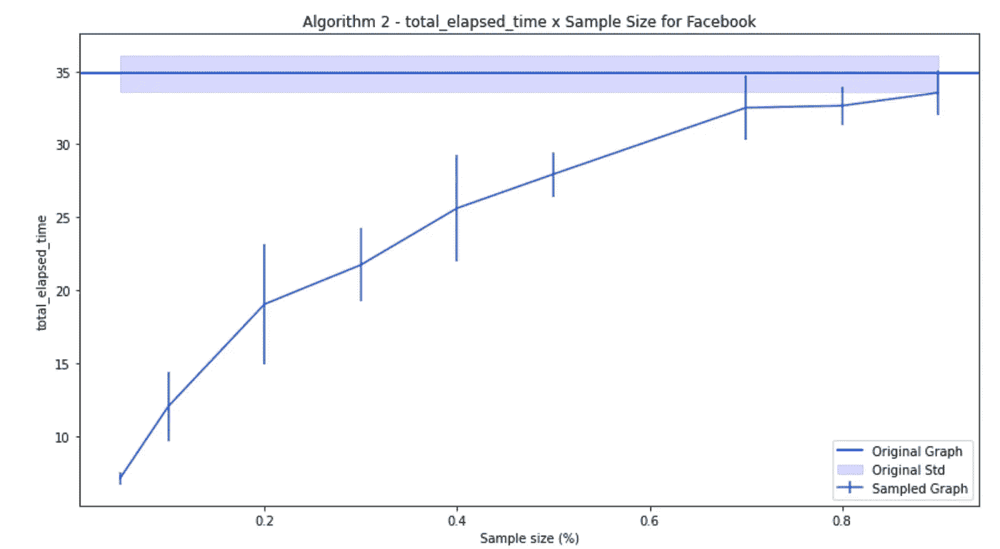
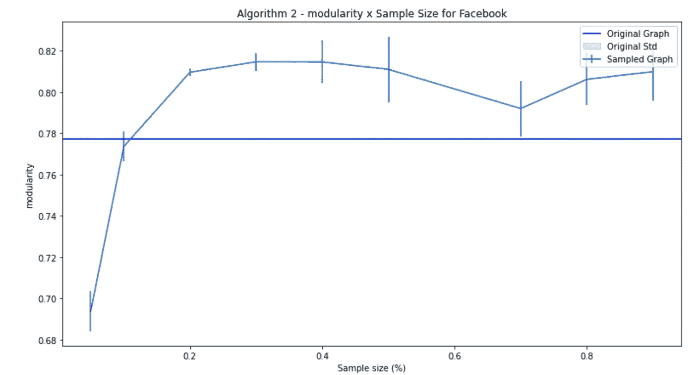
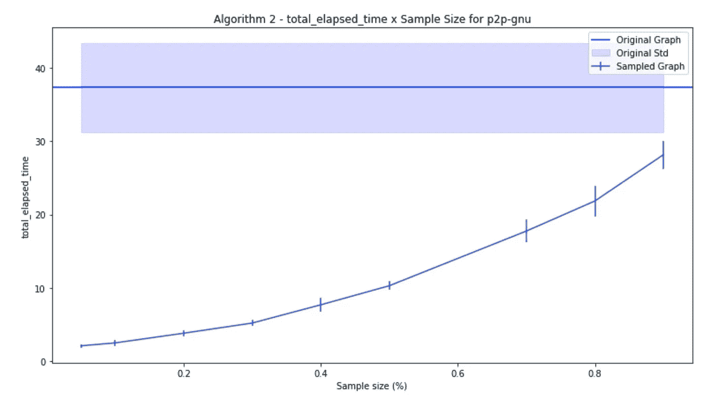
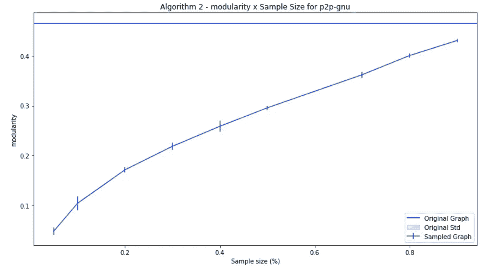

# 聚类的图抽样策略

> 原文：<https://towardsdatascience.com/graph-sampling-strategies-for-clustering-42a05a61a5d3>

## 如何在采样图上生成高模块性聚类


纳斯蒂亚·杜尔希尔在 [Unsplash](https://unsplash.com?utm_source=medium&utm_medium=referral) 上的照片

图表是需要分析的复杂结构，如果它们变得太大，处理起来会很有挑战性。在过去的几年中，对巨大图表的分析一直是一个热门的研究领域，产生了像 [OGB](https://ogb.stanford.edu/) 和 [OGB-LSC](https://ogb.stanford.edu/docs/lsc/) 这样的倡议。

尝试处理这些大型图表的一种方法是，以保持原始结构在样本上的方式对它们进行采样，然后在采样的图表上进行分析。

然而，图形不容易取样。当您删除节点或边时，如何处理您将拥有的信息丢失？为了开始研究这个主题，今天我们将回顾并实现论文[不完全网络上的聚类、显著性和社会网络分析](https://www.semanticscholar.org/paper/Clustering%2C-Prominence-and-Social-Network-Analysis-Hegde-Magdon-Ismail/cf65c5e1fa99947c9402cd4ed43c9485fcd1b197) [1]，该论文提出了两种图的边采样算法。

我们将从理解论文的观点、局限性和作者提出的结果开始。然后，我们将实现它，尝试解决它的一个限制，看看这个方法是否真的有效。

用于分析的笔记本可在 [Kaggle](https://www.kaggle.com/tiagotoledojr/incomplete-networks-analysis) 和我的 [Github](https://github.com/TNanukem/paper_implementations/blob/main/Incomplete%20Networks%20Analysis.ipynb) 上获得。

## 初步考虑

首先，我们来介绍一下论文的基本假设。通过对采样图应用聚类方法来测试采样方法，以查看在原始图上得到的聚类是否类似于或优于在完整图上应用相同算法。

为此，他们使用了一种叫做 SpeakEasy 的算法。因为我找不到这个算法的 Python 实现，所以我使用了 NetworkX 上的[贪婪模块化最大化](https://networkx.org/documentation/stable/reference/algorithms/generated/networkx.algorithms.community.modularity_max.greedy_modularity_communities.html)算法。

他们还分析了几个指标。对于这个分析，我只考虑了模块化，这是本文中考虑的许多因素之一。

该论文指出，这种方法仅用于无向图。对于使用邻接矩阵对称性的第一种算法来说尤其如此。然而，在这个分析中，我考虑了一个旨在观察这些方法如何成立的网络。

最后，需要记住的一件重要事情是，这些方法依赖于邻接矩阵的创建，对于具有数十亿个节点的图来说，表示邻接矩阵以生成样本是不可行的。作者指出，其他表示是可能的，但没有进一步深入细节。

为了分析结果，我考虑了 4 个网络，它们都可以在斯坦福大学的快照上免费获得。在这篇文章中，我将向你展示其中两个的结果:[自我-脸书网络](http://snap.stanford.edu/data/ego-Facebook.html) [2]，一个由来自脸书的朋友列表组成的无向网络，和 [p2p-Gnutella08](http://snap.stanford.edu/data/p2p-Gnutella08.html) 网络[3]，一个由点对点文件共享网络组成的有向图。

每种算法和样本大小都应用了几次，以说明结果的随机性。

## 采样策略 1

第一种策略使用邻接矩阵上的采样，然后使用线性回归来尝试估计被采样掉的丢失链接。使用来自该回归的预测，创建新的邻接矩阵，并对其应用该算法。

算法如下:

*   是图 G 的邻接矩阵
*   从邻接矩阵中随机抽取 K 列，并将它们的索引保存在变量 K 中
*   样本 X -> X = A(:，K)
*   创建一个目标 Y，用 A -> Y(K，:= X(N-K，:)的对称性质部分填充。T
*   使用 X -> Y_hat = X(X- Y)的 Moore-Pensore 伪逆进行线性回归
*   用采样的列生成新的邻接矩阵:A_hat(:，K) = X
*   添加重建的列:A_hat(:，N-K) = Y_hat

如您所见，这里直接使用了矩阵的对称属性来定义 y。让我们看看这个实现在 Python 中是什么样子的:

```
def algorithm_1(A, sample_size, n, N): k = sample_size
    K = randsample(N, k) X = A[:, K]

    set_ = list(set(N) - set(K))

    Y = np.zeros((n, n-k)) Y[K, :] = X[set_, :].T
    Y_hat = np.dot(X, np.dot(np.linalg.pinv(X), Y))
    A_hat = np.zeros((n,n)) A_hat[:, K] = X
    A_hat[:, list(set(N) - set(K))] = Y_hat G_algo1 = nx.from_numpy_matrix(A_hat)
    return G_algo1
```

其中 randsample 方法实现为:

```
def randsample(N, k):
    K = np.random.choice(N, size=k, replace=False)
    if type(K[0]) == str:
        K = [int(i) for i in K] return K
```

如您所见，这是论文中提出的算法的直接实现。注意，在纸上，矩阵 Y_hat 的维数是错误的，它应该是(n，n)否则矩阵运算将没有意义。

在实现了这个方法之后，我注意到线性回归并没有生成比原始图更小的图，而是生成了更多的边。我们将在分析中看到，这使得聚类算法在采样图上比在原始图上花费更长的时间。

对于脸书网络，就执行时间而言，正如我所说的，采样图更糟:



脸书网络中算法 1 的运行时间。由作者开发。

当我们谈到模块性时，在大约 40%的样本大小之后，采样图能够超过原始图上的模块性，但是以更大的运行时间为代价。



算法 1 采样的脸书网络上的聚类的模块性。由作者开发。

然而，重要的是要注意，对于这里没有展示的一个网络，也是无向的，这种采样方法不能超越模块性，并且花费的时间也更长。更多详情请参考笔记本。

现在，对于 p2p-Gnutella 网络，在经过的时间上发生了相同的现象，但是这一次，模块性甚至没有接近最初的模块性，如下图所示:



p2p-gnu 网络中算法 1 的运行时间。由作者开发。



算法 1 采样的脸书网络上的聚类的模块性。由作者开发。

## 采样策略 2

第二种采样策略包括对原始邻接矩阵进行多次采样，然后汇总结果以生成要考虑的新图。

这种方法具有改变边的权重的效果，使其补偿从网络中移除的边。算法如下:

*   是图 G 的邻接矩阵
*   从邻接矩阵中随机抽取 K 列，并将它们的索引保存在变量 K 中
*   从 A -> X1(:，K) = A(:，K)中得到 K 列
*   应用对称属性-> X1(K，)= A(K，:)。T
*   通过由节点数量的平方根的倒数构成的矩阵 a P 中的缩放因子来缩放 X-> X1 = diag(P1)* X1
*   生成一组新的列，删除先前采样的列，并将其保存到 X2
*   生成新的邻接矩阵作为对样本的思考-> A_hat = alpha * X1 + (1-alpha)*X2

用 Python 实现它，就变成了:

```
def algorithm_2(A, sample_size, n, N, symmetric=True):

    def construct_X(N, k):
        K = randsample(N, k) X1 = np.zeros((n, n))
        X1[:, K] = A[:, K] if symmetric:
            X1[K, :] = A[:, K].T P1 = np.full((n,n), np.sqrt(1 / n))
        X1 = np.diag(P1) * X1

        return X1, K

    k = int(np.floor(sample_size / 2)) alpha = 0.5
    X1, K1 = construct_X(N, k)
    X2, K2 = construct_X(list(set(N) - set(K1)), k) A_algo2 = alpha * X1 + (1 - alpha) * X2
    G_algo2 = nx.from_numpy_matrix(A_algo2)

    return G_algo2
```

我必须在这里提请你注意，我做了一个在论文中提出的简化版本。本文利用线性代数中的一些特定的采样机制生成第二矩阵。为了简单起见，我又做了一次随机抽样。这可能会影响该方法的性能。

现在，看看结果:



脸书网络中算法 2 的运行时间。由作者开发。



算法 2 采样的脸书网络上聚类的模块性。由作者开发。

正如我们可以看到的，对于脸书网络，该算法能够生成更快的聚类，甚至能够超过全网络上的原始模块性，这是一个非常好的结果，因为该方法简单。

然而，对于 p2p-gnu 网络，我们不能说同样的话:



p2p-gnu 网络中算法 2 的运行时间。由作者开发。



算法 2 采样的 p2p-gnu 网络聚类的模块性。由作者开发。

正如我们所看到的，聚类运行得更快，但是，即使使用更高的采样方法，采样图也无法实现完整图的模块性度量。

在上面链接的笔记本上，Ca-Gr 网络取得了很好的模块化效果。这表明放松该算法的对称条件会严重损害其性能。

## 结论

在本文中，我们探讨了两种用于聚类目的的图形采样机制。我们试图验证这些方法的对称性假设是否真的有必要，并试图重现这篇论文的观点。

再次注意，在开发过程中对算法做了一些简化。

我希望这能对您作为数据科学家的旅程有所帮助。

[1] Hegde，k .，Magdon-Ismail，m .，Szymanski，B.K .，& Kuzmin，K. (2016)。不完全网络上的聚类、突出和社会网络分析。*复杂网络*。

[2]麦考利和莱斯科维奇。[学习在自我网络中发现社交圈](http://i.stanford.edu/~julian/pdfs/nips2012.pdf)。NIPS，2012。

[3] M. Ripeanu 和 I. Foster 和 A. Iamnitchi。[绘制 Gnutella 网络:大规模对等系统的特性和系统设计的含义。](http://snap.stanford.edu/data/p2p-Gnutella08.html) IEEE 互联网计算杂志，2002 年。