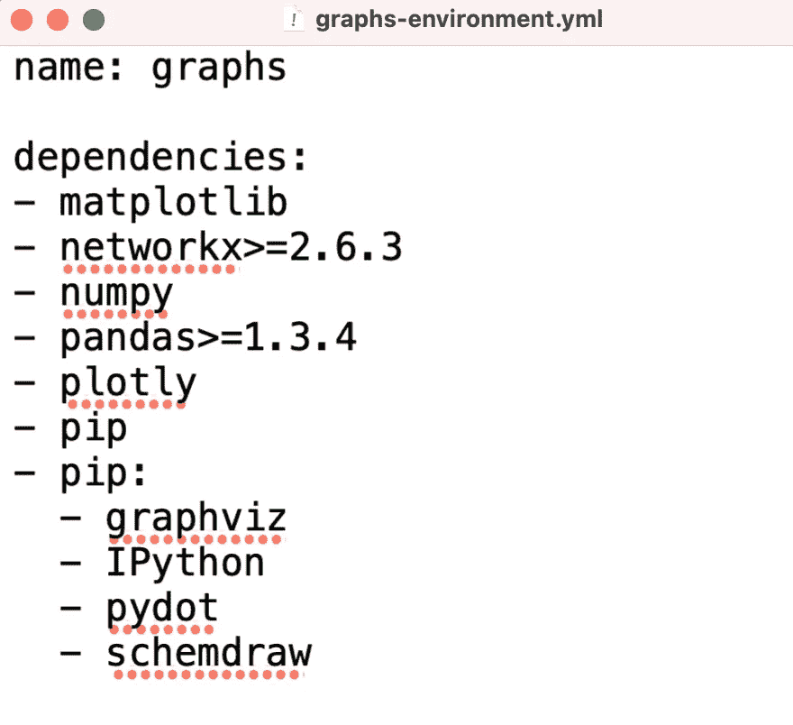
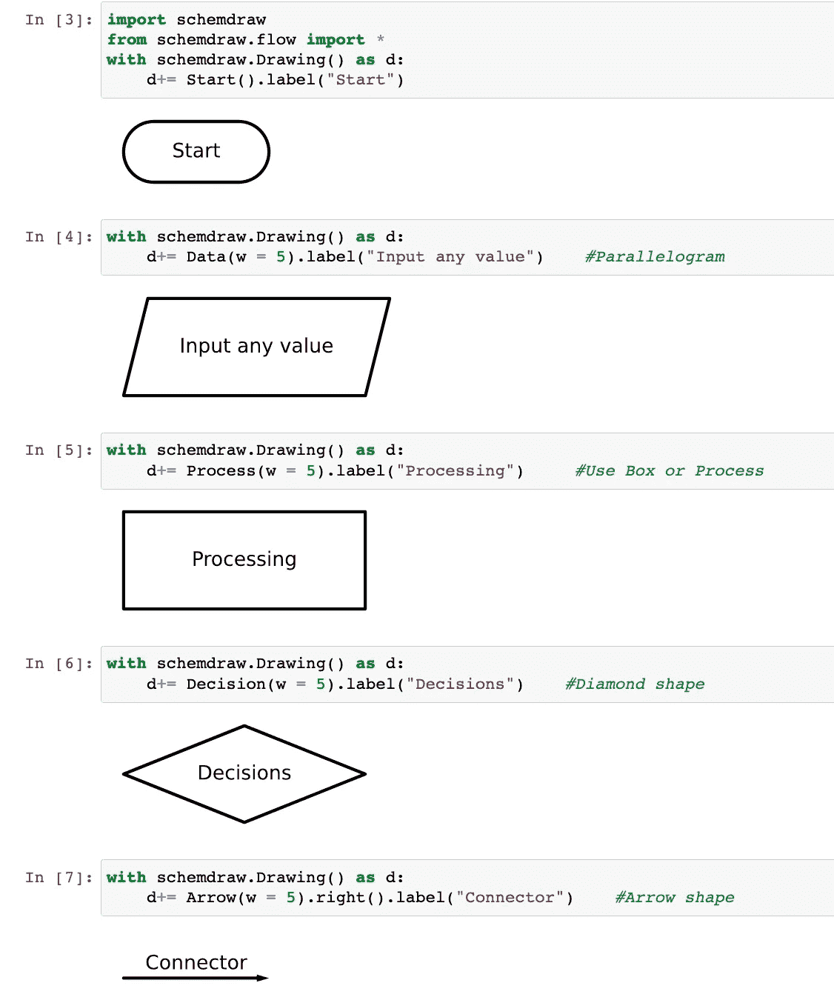
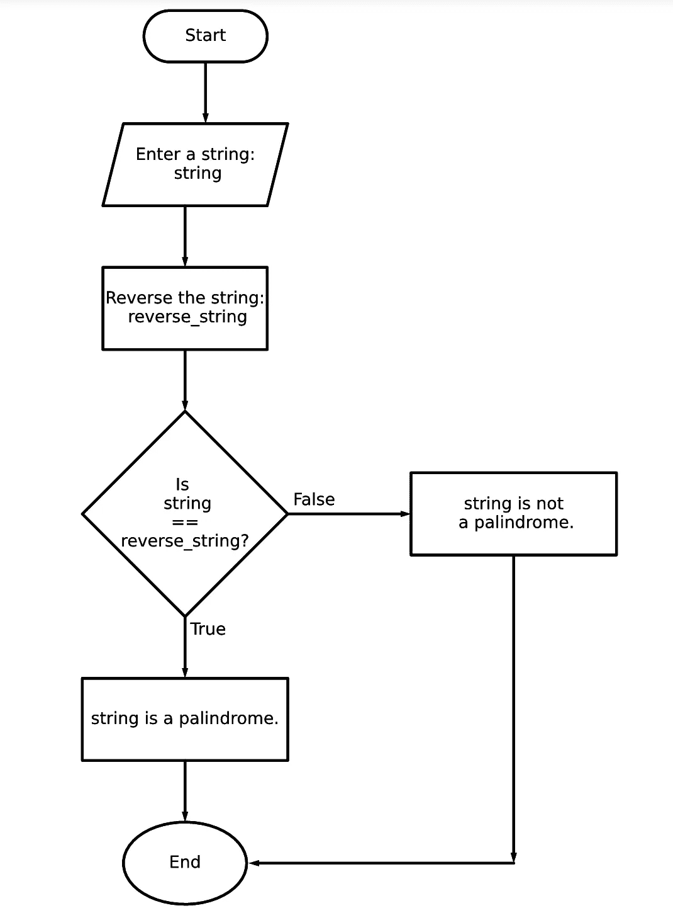

# Python 图形可视化基础第一部分:流程图

> 原文：<https://towardsdatascience.com/graph-visualisation-basics-with-python-part-i-flowcharts-6298c4f412e0>

## 使用 SchemDraw 包创建流程图

最近，我被分配了一项任务，创建一个逻辑树形图来表示我工作中的问题解决过程。在逻辑树中，我必须表示各种方程来解决问题。显然，我可以用 MS PowerPoint 或 Paint 之类的程序创建一个逻辑树。但是使用这些程序将是一个手动的过程，这可能会导致在可视化的形状和大小方面的一些不一致。此外，手动修改这些图可能是一个乏味的过程。

我想自动化这个过程。所以我从探索用 Python 创建逻辑树的可能性开始。我遇到了不同的可以满足我的目的的包，比如`networkx`和`graphviz`。我想进一步探索用 Python 来表示问题解决过程的可能性。在这个系列中，我将分享我关于使用 Python 实现图形可视化的不同可能性的发现。在本系列的第一部分中，我将分享一项我发现的使用 [SchemDraw](https://schemdraw.readthedocs.io/en/latest/) 包用 Python 创建流程图的技术。在接下来的部分中，我将分享可视化树形结构的方法，比如逻辑树，以及使用其他包的组织图。让我们开始吧。


图片来自 [Unsplash](https://unsplash.com/) 的 [Kelly Sikkema](https://unsplash.com/@kellysikkema)

# 该项目的虚拟环境

我首先为这个项目创建一个名为`graphs`的虚拟环境。Python 虚拟环境为项目创建了一个隔离的环境。这意味着每个项目都有自己的依赖关系(Real Python，2018)。使用虚拟环境避免了全局安装 Python 包，这可能会破坏系统工具或其他项目(PyPA，2022)。

为了创建虚拟环境，我创建了一个 yml 文件，如下所示。它由该项目所需的依赖项列表组成。



环境文件来创建名为 graphs 的虚拟环境。

为了使用给定的 yml 文件创建名为`graphs`的虚拟环境，我在终端中运行以下命令:

```
conda env create -n graphs --file graphs-environment.yml
```

创建环境后，我使用以下命令激活它:

```
conda activate graphs
```

还可以在 jupyter notebook 中为这个虚拟环境创建一个独特的内核，这是我在终端中使用以下命令创建的:

```
python -m ipykernel install --user --name graphs --display-name "graphs"
```

安装内核后，要在给定的环境中运行笔记本，我只需进入内核，更改内核，然后选择图形。如果不再需要该环境，也可以使用以下方法轻松将其删除:

```
conda env remove -n graphs
```

# 流程图

流程图是按顺序表示流程中不同步骤的图片。流程图可以有不同的类型，但它们的主要目的是反映解决问题或实现目标的流程。我记得在我高中的计算机科学课上第一次学习流程图。用纸和笔画出流程图来解决简单的问题，例如计算 n 个数的总和或打印一系列数字，在当时是一个有趣的挑战。

在下一节中，我将描述一种使用 [SchemDraw](https://schemdraw.readthedocs.io/en/latest/index.html) 包在 Python 中创建流程图的方法。我将考虑一个问题的例子，检测一个字符串是否是回文。

## 流程图的要素

由 Colling J. Delker 开发的 S [chemDraw](https://schemdraw.readthedocs.io/en/latest/index.html) 软件包允许创建高质量的电路原理图。然而，我发现这个软件包也可以用来创建定制的流程图。

流程图中有六个主要元素。开始或结束节点由椭圆形表示。平行四边形代表用户定义的输入，而矩形代表一个过程。菱形说明了决策过程中的一个阶段。不同的形状由指向箭头连接，也称为连接符。使用 SchemDraw，可以通过导入`schemdraw.Drawing()`并为每个元素传递相应的参数和标签来在 Python 中构造这些基本形状。此外，这个包允许用户控制元素的大小，如宽度和高度，以及箭头的方向，如下图所示。



使用 SchemDraw 包构造流程图的基本元素。图片作者。

## 表示回文问题的流程图

回文是一个向前或向后读都一样的单词或序列。这个问题的算法很简单。首先，我要求用户输入一个字符串。接下来，我反转绳子。如果字符串和它的反码相同，那么字符串是一个回文，如果不相同，它就不是回文。这个问题在 Python 中可以表述为如下所示的几行代码:

```
string = input(“Enter a string: “)reverse_string = string[::-1]if string == reverse_string:
 print (f”{string} is a palindrome.”)

else:
 print (f”{string} is not a palindrome.”)
```

下面的要点给出了使用 SchemDraw 获得这个问题的流程图的代码。它从一个开始节点开始，然后是一个输入框来输入字符串。接下来，有一个进程框来反转字符串，还有一个菱形框来检查字符串和它的反转是否相同。根据决策是对还是错，有两个不同的箭头从决策框中分叉出来。打印结果后，箭头最终到达结束节点。

结果我得到如下图的流程图，也可以保存为图片文件。



解决使用 SchemDraw 创建的回文问题的流程图。图片作者。

# 结论

图形可视化是一个有趣的概念，用来表示网络、流程(如供应链或解决问题的流程)、树形结构(如决策树、组织树、逻辑树和文件夹树)。虽然 Python 中有复杂的数据可视化软件包，如 matplotlib、seaborn、Bokeh、Plotly 等。，现在有一些包可以用 Python 来表示图形和网络，尽管它们并不流行。

在这篇文章中，我首先为这个项目创建了一个虚拟环境。然后我解释了使用 SchemDraw 包用 Python 创建简单流程图的方法。在本系列的后续部分中，我将分享我发现的一些使用 networkx 和 graphviz 之类的包来表示树结构(如组织图和逻辑树)的方法。

感谢您的阅读！

# 参考

PyPA，2022。使用 pip 和虚拟环境安装软件包。

真正的 Python，2018。 [Python 虚拟环境:初级读本。](https://realpython.com/python-virtual-environments-a-primer/#:~:text=At%20its%20core%2C%20the%20main,dependencies%20every%20other%20project%20has.)