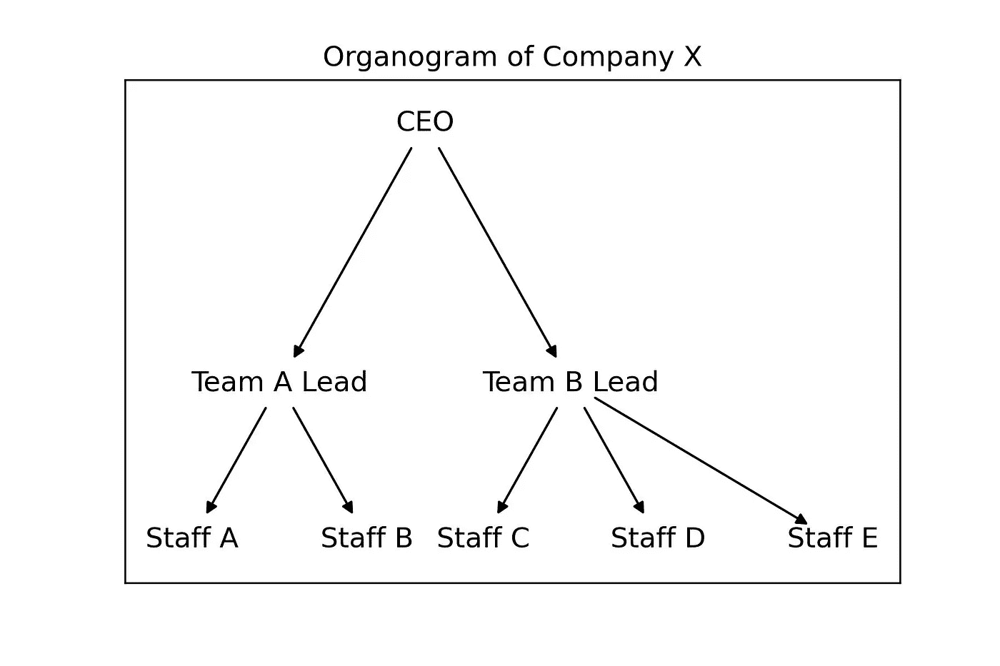
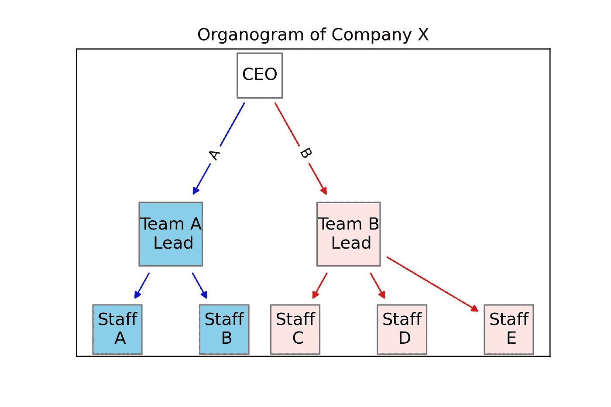
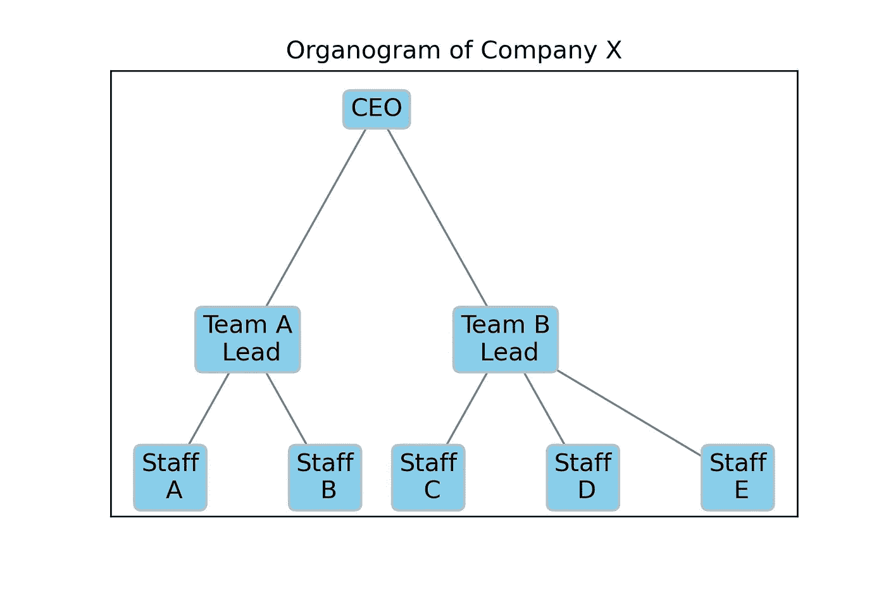
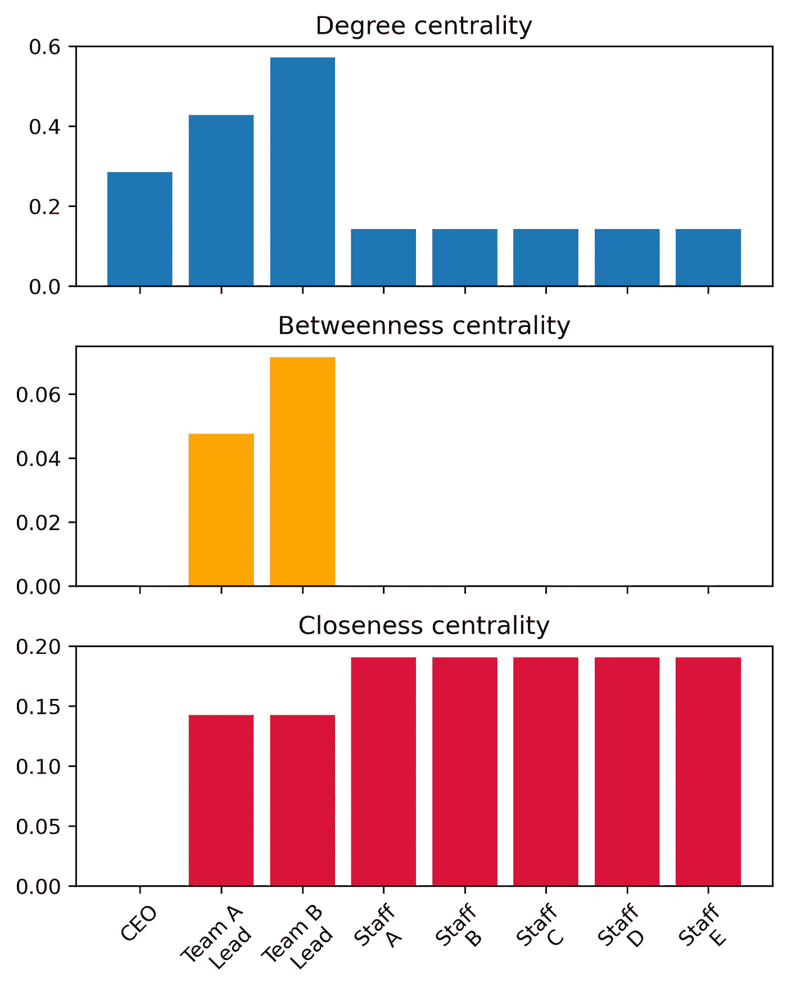
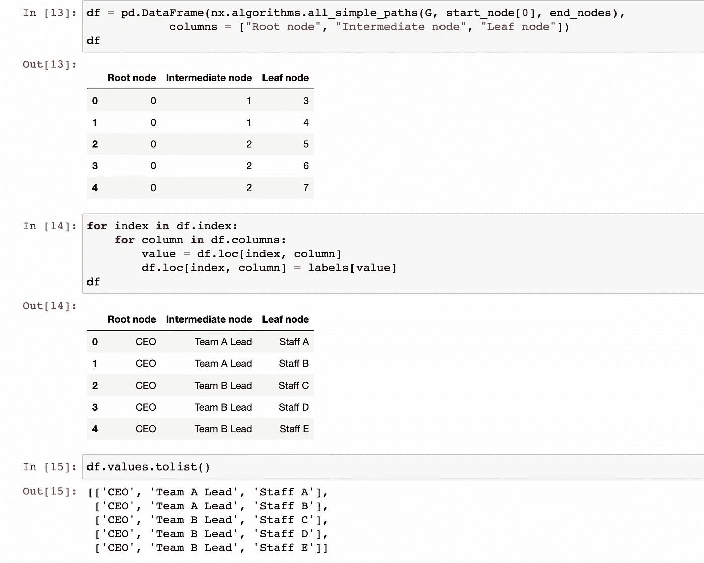

# Python 图形可视化基础第二部分:NetworkX 有向图

> 原文：<https://towardsdatascience.com/graph-visualisation-basics-with-python-part-ii-directed-graph-with-networkx-5c1cd5564daa>

## 用 NetworkX 软件包创建有向无环图

在本系列的第一部分中，我分享了如何使用 Python 中的 SchemDraw 包创建流程图。我对学习 Python 中图形可视化技术的探索让我探索了一些包，比如 NetworkX 和 graphviz。

一个图 *G = (V，E)* 是顶点 *V* 和边 *E* 的集合，其中每条边 *(u，v)* 是顶点之间的连接，其中 *u，v ∈ V* (可约，2020)。在 Python 中，使用节点和边来可视化图形。虽然节点表示任何特征，但是边表示图中特征之间的交互。

图形可视化可以有重要的领域应用，例如网络、空间数据科学、软件工程、生物信息学、能源信息学、机器学习和其他技术领域的可视化界面。在这篇文章中，我将分享一个使用 NetworkX 创建有向无环图的示例，探索包括中心性概念在内的图的特征，以及获取从图的根(开始节点)到叶(结束节点)的所有路径的方法。让我们开始吧。

# 网络 x

[Network](https://networkx.org/) X 是一个 Python 包，用于创建、操作和研究复杂网络的结构、动态和功能。在 NetworkX 中，节点可以是任何[可散列的](https://docs.python.org/3/glossary.html#term-hashable)对象(除了 None ),例如数字、文本串、图像、另一个图形、定制的节点对象等。

## 有向和无向图

边表示节点之间的连接，可以保存任意数据，如权重、方向或节点之间的关系。如果边是无向的，那么图形对象被称为**无向图(图形)**。如果这些边是有向的，那么这个图形对象就称为**有向图(DiGraph)** 。有向图中允许自循环，但不允许多条(平行)边。

## 循环和非循环图

**有向无环图**是一种特殊类型的没有有向环的有向图，因此沿着边的方向走永远不会形成一个闭环。另一方面，如果图的边在任一节点形成闭环，则称为**有向循环图**。


图片由 [Unsplash](https://unsplash.com/) 的 [Fabrice Villard](https://unsplash.com/@fabulu75) 拍摄。

# 使用 NetworkX 包的有机图

有向无环图的例子包括系谱树、组织层级树、文件夹树等。一个**树**是一个具有一组连接节点的分层的非循环数据结构。树中的每个节点可以与许多**子节点**连接，但必须恰好连接到一个**父节点**，除了没有父节点的**根节点**。

组织图是显示一个组织的等级结构，以及不同级别的员工和不同部门之间的关系的图表。虽然可以使用 MS PowerPoint 和 Paint 等程序手动创建组织图，但我想探索使用 Python 创建组织图的可能性，以便可以通过编码轻松调整形状、大小和元素。

考虑一个公司 X，它有两个团队 A 和 B。假设公司有八名员工:一名 CEO，团队 A 和 B 各有两名团队领导，团队 A 有两名员工，团队 B 有三名员工。在本例中，只有一个根节点(CEO)，根节点和任何节点之间只有一条路径。由于每个节点最多有三个子节点，这是一个三叉树**的例子。如果每个节点最多有两个子节点，那将是一棵**二叉树**。使用 Python 中的 NetworkX 构建有机图的步骤将在下面逐步描述。**

## 平面图

我从创建一个有向图对象开始。我为这个对象添加了 8 个节点，从 0 到 7，代表每个雇员。接下来，我添加了从 CEO 到每个团队领导的边，以及从团队领导到相应团队中的员工的边。可以在 NetworkX 中绘制不同布局的图形对象，如圆形、随机、壳形、光谱、平面、弹簧等。此处可用[。然而，我在一个字典中手动设置每个节点的 x 和 y 位置，给它一个分层的倒树状结构。我还以字典的形式为每个节点分配了标签。](https://networkx.org/documentation/stable/reference/drawing.html)

```
G = nx.DiGraph()nodes = np.arange(0, 8).tolist()G.add_nodes_from(nodes)G.add_edges_from([(0,1), (0,2),
 (1,3), (1, 4),
 (2, 5), (2, 6), (2,7)])pos = {0:(10, 10),
 1:(7.5, 7.5), 2:(12.5, 7.5),
 3:(6, 6), 4:(9, 6),
 5:(11, 6), 6:(14, 6), 7:(17, 6)}labels = {0:”CEO”,
 1:”Team A Lead”, 2: “Team B Lead”,
 3: “Staff A”, 4: “Staff B”,
 5: “Staff C”, 6: “Staff D”, 7: “Staff E”}nx.draw_networkx(G, pos = pos, labels = labels, arrows = True,
 node_shape = “s”, node_color = “white”)plt.title(“Organogram of a company.”)
plt.savefig(“Output/plain organogram using networkx.jpeg”,
 dpi = 300)
plt.show()
```

上面的代码产生了如下所示的简单组织图:



使用上面的代码创建的普通组织图。图片作者。

## 带有彩色节点和边的图

我发现可以以列表的形式分别为`node_color`和`node_size`的每个节点分配唯一的颜色和大小。然而，所有节点的`node_shape`必须是一致的，可用的形状也有限制。可以在[这里](https://networkx.org/documentation/stable/reference/generated/networkx.drawing.nx_pylab.draw_networkx_nodes.html)找到用于在图形中绘制节点的参数。在下面的代码中，我为 CEO 提供了白色，为团队 A 提供了天蓝色，为团队 B 的节点提供了米色。类似地，与其他节点相比，我增加了团队领导节点的大小。我还为团队 A 和 B 分别分配了蓝色和红色作为`edge_color`，为节点的边界分配了灰色作为`edgecolors`。

此外，我为从 CEO 到团队领导的边缘添加了标签。这是通过使用`nx.draw_networkx_edge_labels()`并以字典的形式传递`G`、`pos`和`edge_labels`来完成的。

```
colors = ["white", "skyblue","mistyrose", "skyblue",
          "skyblue","mistyrose", "mistyrose", "mistyrose"]edge_colors = ["blue", "red", "blue","blue", "red","red","red"]sizes = [1000, 2000, 2000, 1200, 1200, 1200, 1200, 1200]nx.draw_networkx(G, pos = pos, labels = labels, arrows = True,
                 node_shape = "s", node_size = sizes,
                 node_color = colors,
                 edge_color = edge_colors,  #color of the edges
                 edgecolors = "gray")     #edges of the box of nodenx.draw_networkx_edge_labels(G, pos = pos,
                             edge_labels={(0, 1): 'A', (0, 2): 'B'},
                             font_color='black')plt.title("Organogram of Company X")
plt.show()
```

因此，我得到了下面的组织图:



使用上面的代码创建的彩色组织图。图片作者。

**以边界框为节点的图形**

接下来，我想在每个节点的边界框内标注标签。为此，我没有为节点指定任何形状、大小或颜色。相反，我以 dict 的形式为 bbox 添加了一个参数。我为 bbox 指定了 facecolor、boxstyle、edgecolor 和 pad。可以为 bbox 传递的参数在这里[可用](https://matplotlib.org/stable/tutorials/text/annotations.html)。

```
nx.draw_networkx(G, pos = pos, labels = labels, 
                 bbox = dict(facecolor = "skyblue",
                 boxstyle = "round", ec = "silver", pad = 0.3),
                 edge_color = "gray"
                )
plt.title("Organogram of Company X")
plt.show()
```

结果我得到了如下图的器官图。要注意的是，边界框隐藏了边缘末端的箭头，并且不可能给单个 bbox 分配不同的颜色、形状或大小。



边界框内有标签的有机图。图片作者。

## 有向图的特征

我想探索有向图对象`G`的特征。使用`G.nodes`获得`G`中所有节点的列表，使用`G.edges`获得边的列表。`G.degree`返回一个节点所连接的边的数量。在有向图的情况下，度数被进一步分为不度数和外度数。`G.in_degree`返回指向每个节点的边数。对于`G`，CEO 为 0，其他员工为 1。类似地，`G.out_degree`返回从每个节点指向外的边的数量。对于`G`，CEO 为 2，A 组领导为 2，B 组领导为 3，下面每个员工为 0。下面的代码片段描述了这一点。


探索表示组织图的有向图的特征。图片作者。

# 中心性概念

在图形分析中，中心性概念是指通过测量节点相对于其他节点(包括其邻居(连接节点)或图形中的边)的中心性来识别图形中的重要节点(Bhasin，2019)。有各种中心性概念，它们从不同的角度定义节点的重要性，并提供进一步的信息来分析图及其节点。

**节点的度中心性**是它所连接的全部节点的分数。具有高度中心性的节点通常被认为是高度活跃的。在 G 中，节点 3，即团队 B 领导具有最高的中心度，因为它连接到四个其他节点。

**中间中心性**是一个特定节点位于图中所有节点对之间的最短路径上的次数的度量。在`G`中，团队 B 领导的中间中心性最高，其次是团队 A 领导。这意味着团队领导是 CEO 和员工之间的桥梁。首席执行官和员工的中间中心性为零，因为他们不位于任何两个节点之间。

**接近中心性**是一个节点与其他节点接近程度的度量。它被计算为网络中从一个节点到所有其他节点的最短路径长度的平均值(Golbeck，2013)。在接近中心性的情况下，具有较低值的节点具有较高的中心性。这意味着与员工相比，首席执行官和团队领导拥有更大的中心地位(Golbeck，2013)。

具有高度中心性的节点将可能具有更高的介数中心性和接近中心性，如本例中团队领导的情况。要注意的是，如果`G`是无向图，则中间中心性和接近中心性值将改变，而度中心性将保持不变。

通过分别使用`nx.degree_centrality(G)`、`nx.betweenness_centrality(G)`和`nx.closeness_centrality(G)`获得不同节点的上述中心性值。



显示不同节点的度中心性、中间中心性和接近中心性的图。图片作者。

# 获取从树根到树叶的所有路径的列表

从给定的有向图对象`G`中，我想获得所有简单路径的列表，而不重复从 CEO(根节点)到各个员工(叶节点)的任何节点。这可以通过使用`nx.algorithms.all_simple_paths()`并将有向图对象、源节点(CEO)和目标节点列表(所有人员)传递给它来实现。然后我用生成器对象创建了一个熊猫数据帧`df`。通过遍历`df`的索引和列，我分别得到了根节点、中间节点和叶节点的准确位置，如下所示。`df.values.tolist()`以列表的形式返回每个路径。



以数据帧和列表的形式检索有向图中从起点到终点的所有可能路径。图片作者。

# 结论

在这篇文章中，我使用了一个有机图的例子来描述一种使用 NetworkX 包绘制有向无环图的方法。我讨论了利用节点、边和边界框的形状、大小和颜色等属性定制图形的可能性。我描述了使用 NetworkX 探索图形对象的特征和分析其中心性的可能性。最后，我展示了一种方法来获得从给定图形对象的根到叶的所有简单路径的列表。

根据我的经验，NetworkX 包对于图形网络分析和操作非常有效。然而，它在图形可视化方面有一定的局限性。例如，可用于表示节点的形状存在局限性。节点可以是正方形、圆形、三角形等形状。但是椭圆形是不可能的，因为标签可能会出现在节点之外。此外，不能为不同的节点设置不同的节点形状。使用边界框标注标签时，不能为不同的节点设置不同的面颜色。在本系列的下一篇文章中，我将分享如何利用 graphviz 包中的技术不仅克服这些限制，而且方便地创建更全面的图形。

感谢您的阅读！

# 脚注

[1]如果一个对象的哈希值在它的生命周期中从不改变，并且可以与其他对象进行比较，那么这个对象就是可哈希的。哈希值可以通过简单地将对象传递给`hash()`来获得。哈希值是一个整数，用于在查看字典时快速比较字典关键字。

# 参考

巴辛，2019。[图形分析——中心性的介绍和概念。](/graph-analytics-introduction-and-concepts-of-centrality-8f5543b55de3)

戈尔贝克，2013。[第三章:网络结构和措施。分析社交网络。](https://dl1.cuni.cz/pluginfile.php/730998/mod_resource/content/0/Jennifer%20Golbeck-Analyzing%20the%20Social%20Web-Morgan%20Kaufmann%20%28%20%202013%29.pdf)

可约，2020。[图论入门——计算机科学视角](https://www.youtube.com/watch?v=LFKZLXVO-Dg&ab_channel=Reducible)。