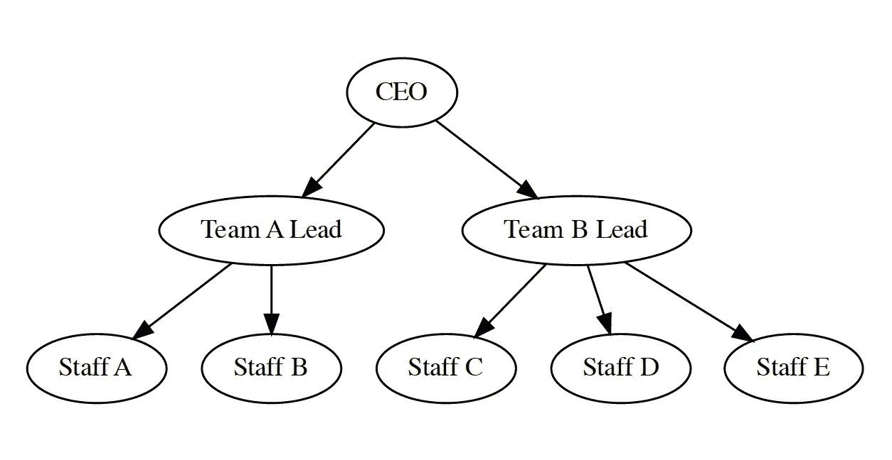
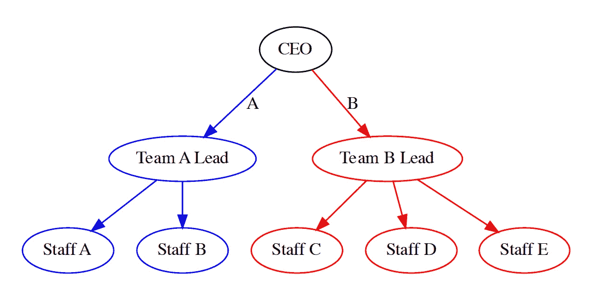
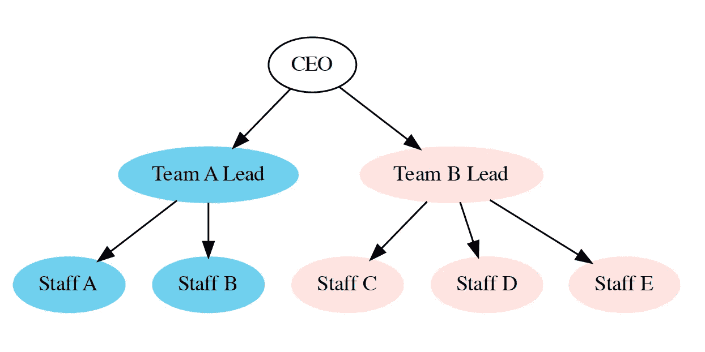
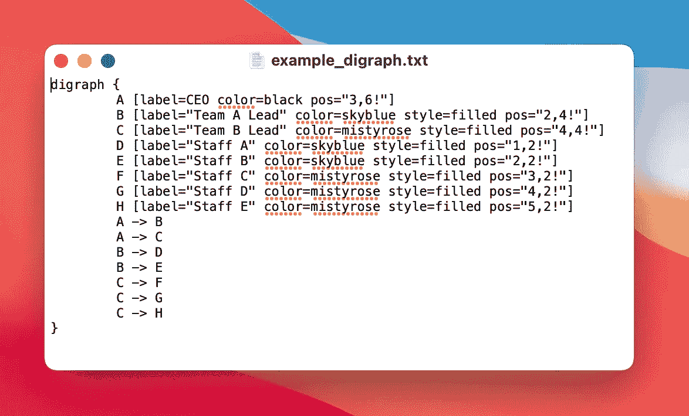
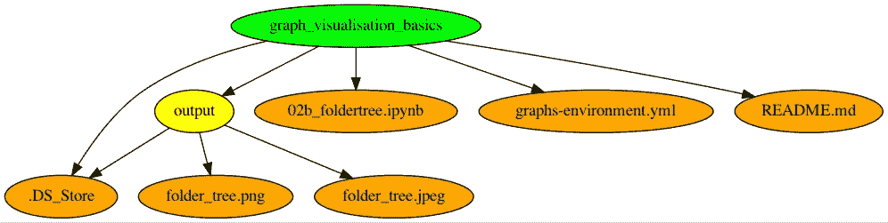

# Python 图形可视化基础，第三部分:graphviz 有向图

> 原文：<https://towardsdatascience.com/graph-visualisation-basics-with-python-part-iii-directed-graphs-with-graphviz-50116fb0d670>

## 使用 graphviz 和 Pydot 包创建有向图

在本系列的第一部分中，我分享了如何使用 SchemDraw 包创建流程图。在[第二部分](https://medium.com/towards-data-science/graph-visualisation-basics-with-python-part-ii-directed-graph-with-networkx-5c1cd5564daa)中，我描述了用 NetworkX 包创建一个有向无环图，同时探索特征、中心性概念并检索从根节点到叶子的所有可能路径。这一部分将着重于使用 graphviz 和 pydot 包构建有向无环图。我还将解释一下 graphviz 的样式和属性选项。让我们开始吧。


图片来自[施韦策](https://unsplash.com/@kunosch)来自 [Unsplash](https://unsplash.com/)

# graphviz 包

Graphviz 是一款开源的图形可视化软件。在 Python 3.7+下工作的 graphviz 包为这个软件提供了一个纯 Python 接口。这个包允许使用[点](https://www.graphviz.org/doc/info/lang.html)语言创建无向图和有向图。

使用 graphviz 构建 Graph 或 DiGraph 对象类似于使用 NetworkX，因为我们只需要简单地定义 Graph 对象的节点和边，并相应地分配属性。然而，也有一些关键的区别。例如，在 NetworkX 包中，节点可以定义为任何可散列的对象(None 除外)。但是在 graphviz 中，一个节点只能定义为一个字符串。

在我之前的 [pos](/graph-visualisation-basics-with-python-part-ii-directed-graph-with-networkx-5c1cd5564daa) t 中，我指出了 NetworkX 包的图形可视化的不同限制，例如节点形状的有限选项，为单个节点获取唯一形状和边界框(bbox)属性的限制，等等。在这篇文章中，我将分享 graphviz 包不仅克服了这些限制，还为图形可视化提供了更多的灵活性选项。我将通过重建在之前的[帖子](https://medium.com/towards-data-science/graph-visualisation-basics-with-python-part-ii-directed-graph-with-networkx-5c1cd5564daa)中使用 NetworkX 创建的组织图来描述这一点，但在这篇帖子中使用 graphviz。

## 使用 graphviz 绘制器官图

为了使用 graphviz 包创建一个普通的 organogram，我首先初始化一个 graph 对象，比如说将`f`初始化为`graphviz.Digraph(filename)`，其中`filename`是所创建的输出文件的名称。我创建了一个从 A 到 H 的八个名字的列表，以及该公司所有职位的列表。接下来，通过一个 for 循环，我为每个名字创建了八个节点，并添加了个人在组织中的相应位置作为标签。我指定了 CEO 和两个团队领导之间的界限，以及团队领导和他们相应的员工之间的界限。相同的代码如下所示:

```
import graphvizf = graphviz.Digraph(filename = “output/plain organogram 1.gv”)names = [“A”,”B”,”C”,”D”,”E”,”F”,”G”,”H”]positions = [“CEO”,”Team A Lead”,”Team B Lead”, “Staff A”,”Staff B”, “Staff C”, “Staff D”, “Staff E”]for name, position in zip(names, positions):
     f.node(name, position)

#Specify edges
f.edge(“A”,”B”); f.edge(“A”,”C”) #CEO to Team Leads
f.edge(“B”,”D”); f.edge(“B”,”E”) #Team A relationship
f.edge(“C”,”F”); f.edge(“C”,”G”); f.edge(“C”,”H”) #Team B relationship

f
```

结果，我得到了如下所示的简单组织图:



使用 graphviz 创建的普通组织图。图片作者。

在上图中，每个节点的大小会自动调整以适应节点内的标签。对于 NetworkX 包来说，情况并非如此。

# graphviz 包的样式和属性

如前所述，graphviz 包提供了各种样式选项和属性来定制图形。下面详细描述了其中的一些可能性:

## 节点形状

使用 graphviz 创建的图中节点的默认形状是椭圆。使用 graphviz 可以获得各种各样的节点形状，可以在这里找到。这些形状可以是基于多边形的、基于记录的或用户定义的。此外，对于不同节点，也可以得到不同的形状。在下面的代码中，我将 CEO 的节点形状更改为椭圆形，将两个团队领导的节点形状更改为箱形，将员工的节点形状更改为纯文本。

```
import graphvizf = graphviz.Digraph(filename = "output/plain organogram 2.gv")names = ["A","B","C","D","E","F","G","H"]positions = ["CEO","Team A Lead","Team B Lead", "Staff A","Staff B", "Staff C", "Staff D", "Staff E"]for name, position in zip(names, positions):
    if name == "A":
        f.node(name, position, shape = "oval")

    elif name in ["B","C"]:
        f.node(name, position, shape = "box")
    else:
        f.node(name, position, shape = "plaintext")#Specify edges
f.edge("A","B"); f.edge("A","C")   #CEO to Team Leads
f.edge("B","D"); f.edge("B","E")   #Team A relationship
f.edge("C","F"); f.edge("C","G"); f.edge("C","H")   #Team B relationship

f
```


普通组织图，不同员工有不同形状的节点。作者图片。

## 节点颜色和边颜色

还可以使用 graphviz 为不同的节点和边分配不同的颜色。我创建了一个颜色列表，然后使用下面代码中的 for 循环为每个节点分配一种颜色。我将黑色分配给 CEO，将蓝色分配给团队 A，将红色分配给团队 b。同样，我将蓝色分配给连接团队 A 的边，将红色分配给连接团队 b 的边。

```
import graphvizf = graphviz.Digraph(filename = "output/colorful organogram 1.gv")names = ["A","B","C","D","E","F","G","H"]positions = ["CEO","Team A Lead","Team B Lead", "Staff A","Staff B", "Staff C", "Staff D", "Staff E"]colors = ["black", "blue", "red", "blue", "blue", "red", "red", "red"]for name, position, color in zip(names, positions, colors):
    f.node(name, position, color = color)

#Specify edges
#CEO to Team Leads
f.edge("A","B", color = "blue", label = "A"); f.edge("A","C", color = "red", label = "B")   
#Team A
f.edge("B","D", color = "blue"); f.edge("B","E", color = "blue")   
#Team B 
f.edge("C","F", color = "red"); f.edge("C","G", color = "red"); f.edge("C","H", color = "red")   

f
```



使用 graphviz 创建的具有指定节点和边颜色的有机图。图片作者。

## 用颜色填充节点

在这一步，我通过填充节点内部的颜色来进一步定制图表。只需在定义节点和分配颜色时声明`style = “filled"`即可。

```
import graphvizf=graphviz.Digraph(filename='output/filled_colorful_organogram.gv')names = ["A","B","C","D","E","F","G","H"]positions = ["CEO","Team A Lead","Team B Lead", "Staff A","Staff B", "Staff C", "Staff D", "Staff E"]colors = ["black", "skyblue", "mistyrose", "skyblue", "skyblue", "mistyrose", "mistyrose", "mistyrose"]for name, position, color in zip(names, positions, colors):
    if name== "A":
        f.node(name, position, color = color)
    else:
        f.node(name, position, style = "filled", color = color)

#Specify edges
f.edge("A","B"); f.edge("A","C")   #CEO to Team Leads
f.edge("B","D"); f.edge("B","E")   #Team A relationship
f.edge("C","F"); f.edge("C","G"); f.edge("C","H")   #Team B relationship

f
```



组织图中用指定颜色填充的节点。图片作者。

## 从终端运行 gv 文件

有向图对象`f`可以显示在`gv`扩展名的输出 Graphviz 点文件中，并使用`f.view()`保存。也可以打印这个用点语言编写的有向图对象的源代码，只需在笔记本中使用`f.source`即可。



上面 DOT 语言中有向图对象的源代码。图片作者。

上面的 txt 文件包含了点语言中有向图的源代码。我已经使用`pos`手动指定了节点的 x 和 y 位置。可以使用以下代码在终端中运行该文件:

```
dot -Kfdp -n -Tjpeg -Gdpi=300 -O example_digraph.txt
```

它将 digraph 对象生成为分辨率为 300 dpi 的 jpeg 文件。

# Pydot 包

pydot 包是 Graphviz 的一个接口。它是用纯 Python 编写的，可以解析并转储到 Graphviz 使用的 DOT 语言中。计算机中的文件夹树结构，由目录、子目录、文件等组成。也是有向图的一个例子。在下一节中，我将解释如何使用 pydot 包来获得文件夹树结构。

## 使用 Pydot 包的文件夹树

我首先创建一个名为`G`的有向图对象。Python 中的 [os](https://docs.python.org/3/library/os.html#os-file-dir) 模块提供了一种使用操作系统相关功能的可移植方式。`os.getcwd()`返回当前工作目录，包括路径，我指定为`rootDir`。从`rootDir`中，我只获得目录的名称(graph _ visualisation _ basics)并将其作为`currentDir`传递。我为`currentDir`添加一个节点，并用绿色填充。通过使用 for 循环，我为每个子目录和文件定义了节点，并在它们之间添加了边。接下来，我用黄色填充子目录的节点，用橙色填充文件。同时，我会忽略名称以`.`开头的隐藏文件夹。

使用`Image(G.create_jpeg()`创建图形对象的图像，并通过`IPython.display.display()`显示。使用`G.write_jpeg(filename)`将图像文件保存为 jpeg 格式，其中`filename`是保存文件的名称。



文件夹树结构包括使用上述代码创建的根目录、子目录和文件的层次结构。图片作者。

# 结论

这是 Python 图形可视化基础系列的第三部分。这个系列背后的动机是分享我在使用 SchemDraw、NetworkX 和 graphviz 等包创建流程图和 Python 中的 graph 对象时学到的简单技术。在这篇文章中，我以 organogram 为例描述了如何使用 graphviz 包创建有向图对象。我还展示了为 graphviz 提供的图形组件设置样式和添加属性的各种选项。最后，我分享了如何使用 Pydot 包将系统中的文件夹树结构构建成一个图形。

本系列文章的笔记本可以在这个[库](https://github.com/hbshrestha/graph_visualisation_basics_with_Python)中找到。感谢您的阅读！