# GraphGPS:导航图形转换器

> 原文：<https://towardsdatascience.com/graphgps-navigating-graph-transformers-c2cc223a051c>

## 图 ML 的最新进展

## 烹饪最佳图形转换器的食谱

2021 年，图形转换器(GT)赢得了最近的分子性质预测挑战，这要归功于缓解了许多与普通消息传递 GNNs 有关的问题。在这里，我们试图将众多新开发的 GT 模型组织到一个单一的 GraphGPS 框架中，为所有类型的 Graph ML 任务提供通用的、强大的、可扩展的线性复杂度的图形转换器。事实证明，仅仅一辆调校良好的 GT 就足以展示 SOTA 在许多实际任务中的成果！

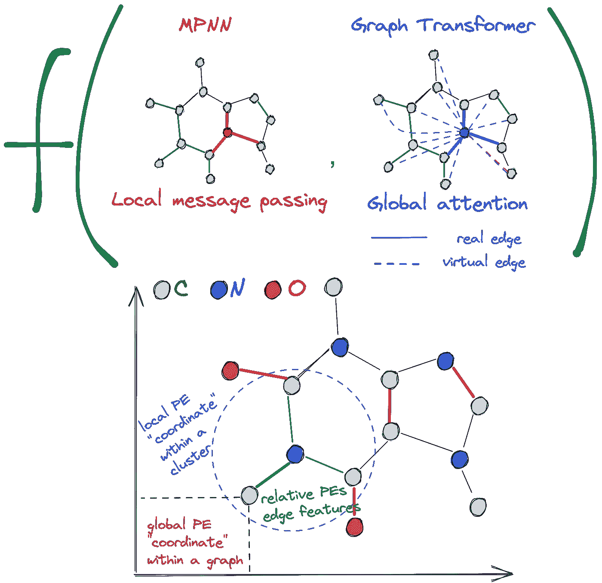

消息传递 gnn、全连接图形转换器和位置编码。作者图片

*这篇文章是与* [*拉迪斯拉夫·拉帕塞克*](https://rampasek.github.io/)*[*多米尼克·比艾尼*](https://twitter.com/dom_beaini?lang=en) *和* [*维贾伊·普拉卡什·德威迪*](https://vijaydwivedi.com.np/) *共同撰写的，是基于论文* [*的一个通用、强大、可扩展的图形转换器(2022)*](https://arxiv.org/abs/2205.12454) 【T24)*

*大纲:*

1.  *[消息传递 GNNs vs 图形转换器](#675f)*
2.  *[图形转换器的优缺点和种类](#3975)*
3.  *[graph GPS 框架](#40a9)*
4.  *[概要:蓝图](#e373)*
5.  *[功能强大；结构和位置特点](#cf65)*
6.  *[可扩展:线性变压器](#6be7)*
7.  *[烹饪时间——如何充分利用你的 GT](#beae)*

# ***消息传递 GNNs vs 图形转换器***

*消息传递 GNN(通常从 [Weisfeiler-Leman 的角度](/graph-neural-networks-beyond-weisfeiler-lehman-and-vanilla-message-passing-bc8605fa59a)进行分析)众所周知地遭受 [**过度平滑**](https://openreview.net/forum?id=S1ldO2EFPr) (增加 GNN 层数，特征倾向于收敛到相同的值) [**过度挤压**](https://openreview.net/forum?id=i80OPhOCVH2) (当试图将来自许多邻居的消息聚集到单个向量时丢失信息)，并且可能最重要的是，在小而稀疏的分子图上已经明显的长程相关性捕捉不佳。*

*今天，我们知道了许多打破消息传递玻璃天花板的方法——包括[高阶 GNNs](/using-subgraphs-for-more-expressive-gnns-8d06418d5ab) ，更好地[理解图拓扑](https://openreview.net/forum?id=7UmjRGzp-A)，[扩散模型](/graph-neural-networks-as-neural-diffusion-pdes-8571b8c0c774)，[图重布线](https://arxiv.org/abs/2110.09443)，以及[图转换器](https://arxiv.org/abs/2012.09699)！*

*在消息传递方案中，一个节点的更新是其**邻居**的函数，而在 GTs 中，一个节点的更新是图中所有**节点的函数(由于 Transformer 层中的自关注机制)。也就是说，GT 实例的输入就是整个图形。***

*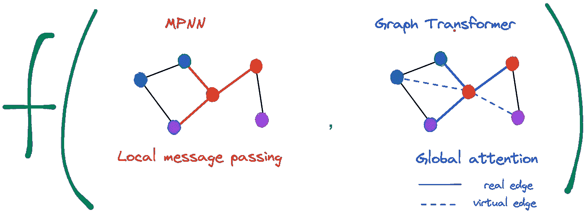*

*更新目标节点表示(红色)，局部消息传递仅聚集直接邻居，而全局注意力是图中所有节点的函数。在 GraphGPS 中，我们将两者结合起来！作者图片*

# ***图形转换器的利与弊***

*将整个图形输入到 Transformer 层会带来一些直接的好处和缺点。*

*✅优点:*

*   *类似于图的重新布线，我们现在将节点更新过程从图结构中分离出来。*
*   *处理远程连接没有问题，因为所有节点现在都相互连接在一起(我们经常分离来自原始图的*真实*边和在计算关注矩阵时添加的*虚拟*边——查看上面的插图，其中实线表示真实边，虚线表示虚拟边)。*
*   *用“在迷宫中导航”来类比，我们可以使用地图，摧毁迷宫的墙壁，并使用魔法翅膀，而不是四处走动和寻找🦋。不过，我们必须事先学习地图，稍后我们将看到如何使导航更加精确和高效。*

*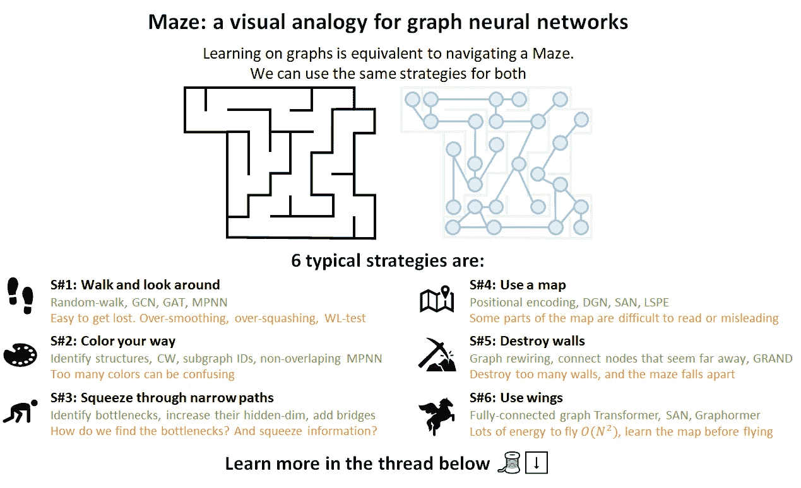*

*图表变形金刚给你翅膀🦋。来源:[多米尼克·比艾尼@推特](https://twitter.com/dom_beaini/status/1499019741234704385)*

*🛑缺点类似于在 NLP 中使用变压器产生的缺点:*

*   *语言输入是连续的，而图对于节点排序是排列不变的。我们需要图中节点更好的**可识别性**——这通常通过某种形式的位置特征来实现。例如，在 NLP 中，[原始变换器](https://arxiv.org/abs/1706.03762)使用正弦位置特征作为序列中令牌的绝对位置，而最近的 [AliBi](https://openreview.net/forum?id=R8sQPpGCv0) 引入了相对位置编码方案。*
*   *失去使 GNNs 在具有**明显局部性**的图形上工作良好的归纳偏差，这是许多真实世界图形的情况。特别是在那些边代表相关/接近的地方。通过重新连接图形使其完全连接，我们必须以某种方式将结构放回原处，否则，我们很可能会“将婴儿与水一起扔掉”。*
*   *最后但并非最不重要的是，限制可以是节点数量的**平方**计算**复杂度** O(N ),而消息传递 gnn 是边数量 O(E)的线性。图形通常是稀疏的，即 N ≈ E，因此计算负担随着较大的图形而增加。我们能做点什么吗？*

*2021 年为 GTs 带来了各种各样的位置和结构特征，使节点更容易区分。*

*在 graph transformers 中，Dwivedi & Bresson 的[第一个 GT 架构使用拉普拉斯**特征向量**作为位置编码，等人的](https://arxiv.org/abs/2012.09699)的【SAN】也增加了拉普拉斯**特征值**相应地重新加权注意力，Ying 等人的[graph former](https://arxiv.org/pdf/2106.05234.pdf)增加了**最短路径距离**作为注意力偏差，Wu、Jain 等人的 graph trans 在一个图通过后运行 GT*

*在图的位置特征领域，除了拉普拉斯导出的特征，最近的一批工作包括 Dwivedi 等人的[随机行走结构编码(RWSE)采用 m 次幂随机行走矩阵的对角，Lim，Robinson 等人的](https://arxiv.org/abs/2110.07875)[sign net](https://arxiv.org/abs/2202.13013)确保拉普拉斯特征向量的符号不变性，以及 Wang 等人的[等变和稳定 PEs](https://openreview.net/pdf?id=e95i1IHcWj)分别确保节点和位置特征的排列和旋转等变。*

*嗯，他们太多了🤯我如何知道什么最适合我的任务？*

> *是否有一种原则性的方法来组织和使用所有这些图形转换器图层和位置要素？*

*是啊！这就是我们在最近的论文[中提出的通用、强大、可扩展的图形转换器](https://arxiv.org/abs/2205.12454)的配方。*

# ***graph GPS 框架***

*在 GraphGPS 中，GPS 代表:*

***🧩综合医院**——我们提出了一个构建图形转换器的蓝图，将特征(预)处理、本地消息传递和全局注意力的模块合并到一个管道中*

***🏆强大的** —当与适当的位置和结构特征配对时，GPS 图形转换器被证明比 1-WL 测试更强大*

***📈可扩展的** —我们引入了线性全局注意力模块，突破了长期以来只在分子图上运行图转换器的问题(平均少于 100 个节点)。现在我们可以在每张有数千个节点的图上做这件事！*

*或者可能是指有位置和结构的图形？😉*

# ***将军:蓝图***

*如果我们可以利用这两个世界的优点，为什么我们需要修补消息传递 gnn 和图形转换器来实现某个特性呢？让模型决定对于一组给定的任务和图表什么是重要的。一般来说，蓝图可以用一张图来描述:*

*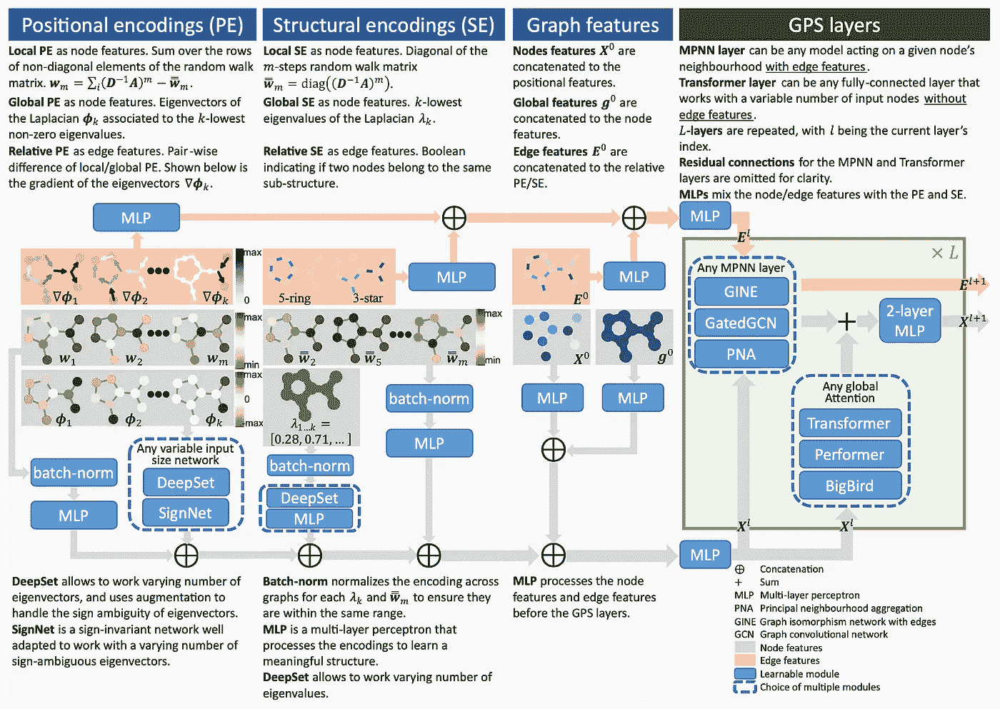*

*GraphGPS 蓝图提出了一种模块化架构，用于构建具有各种位置、结构特征以及局部和全局关注的图形转换器。来源: [arxiv](https://arxiv.org/abs/2205.12454) 。点击放大*

*它看起来有点庞大，所以让我们把它一部分一部分地分解，看看那里发生了什么。*

*总的来说，蓝图由三个主要部分组成:*

1.  *通过位置和结构编码的节点标识。在分析了最近发表的许多增加图中位置性的方法后，我们发现它们可以大致分为三类:**局部**、**全局**和**相对**。这些特性非常强大，有助于克服臭名昭著的 1-WL 限制。更多信息请见下文！*
2.  *具有原始图表要素的结点标识的聚合-即输入结点、边和图表要素。*
3.  *处理层(GPS 层)-我们如何实际处理具有构造要素的图表，这里结合了本地消息传递(任何 MPNNs)和全局注意力模型(任何图表转换器)*
4.  *(奖金🎁)您可以将任何位置和结构特征与我们基于 [PyTorch-Geometric](https://www.pyg.org/) 的新 [GraphGPS](https://github.com/rampasek/GraphGPS) 库中的任何处理层相结合！*

# ***功能强大；结构和位置特征***

*结构和位置特征旨在对每个节点或边的独特特征进行编码。在最基本的情况下(如下图所示)，当所有节点都具有相同的初始特征或根本没有特征时，应用位置和结构特征有助于区分图中的节点，为它们分配不同的特征，并至少提供某种意义上的图结构。*

*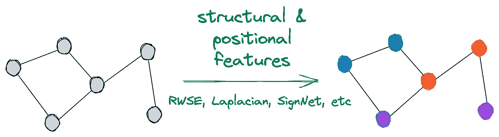*

*结构和位置特征有助于区分图中的节点。作者图片。*

*我们通常将*位置*与*结构*特征分开(尽管在理论上也有类似于[斯里尼瓦桑&里贝罗](https://arxiv.org/abs/1910.00452)的作品)。*

> *直观地，位置特征帮助节点回答问题**“我在哪里？”当结构特征回答“我的邻居看起来像什么？”***

***位置编码(PEs)** 提供了图形中给定节点的空间位置的一些概念。它们帮助一个节点回答问题**“我在哪里？”**。理想情况下，我们希望每个节点都有某种笛卡尔坐标，但是由于图是拓扑结构，并且在 2D 平面上有无限多种定位图的方法，我们必须考虑一些不同的方法。谈到 PEs，我们将现有的(和理论上可能的)方法分为 3 个分支——局部 PEs、全局 PEs 和相对 PEs。*

*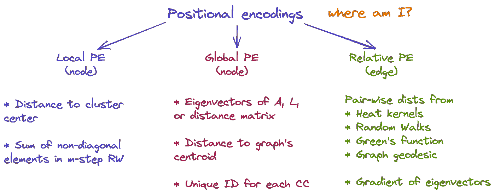*

*位置编码(PE)的分类。点击放大。作者图片。*

*👉局部 PE(作为节点特征)—在一个**簇**内，两个节点彼此越接近，它们的局部 PE 就越接近，比如一个单词在句子中的位置(而不是在文本中)。例子:(1)节点和包含该节点的簇的质心之间的距离；(2)m 步随机游走矩阵的非对角元素之和(m 次方)。*

*👉全局 PEs(作为节点特征)—在一个**图**中，两个节点越接近，它们的全局 PEs 就越接近，例如一个单词在文本中的位置。例子:(1)原[图变换器](https://arxiv.org/abs/2012.09699)和[三](https://arxiv.org/abs/2106.03893)中使用的邻接或拉普拉斯的特征向量；(2)到整个图形的质心的距离；(3)每个连接组件的唯一标识符*

*👉相对 PE(作为边要素)-与任何局部或全局 PE 给出的距离相关的边表示，例如两个世界之间的距离。例子:(1)从热核、随机游走、[格林函数](https://en.wikipedia.org/wiki/Green%27s_function)、图测地线得到的成对距离；(2)邻接或拉普拉斯的特征向量的梯度，或者任何局部/全局 PEs 的梯度。*

*让我们来看一个关于这个著名分子☕️的各种 PE 的例子([根据他的 iclr’21 主题演讲](https://youtu.be/w6Pw4MOzMuo?t=387)，这是迈克尔布朗斯坦最喜欢的分子)。*

*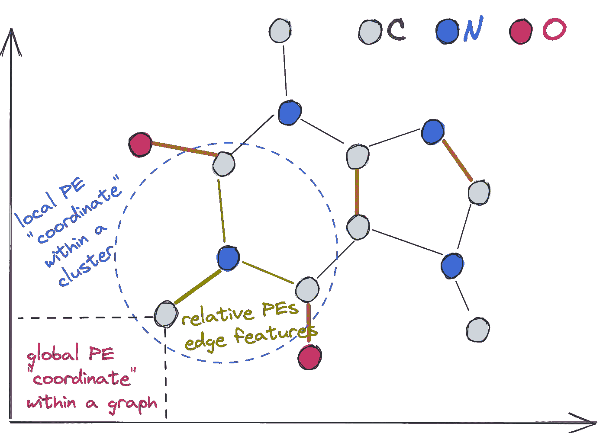*

*咖啡因分子☕️.的局部、全局和相对位置编码的图示作者图片*

***结构编码** **(SEs)** 提供了图和子图的结构表示。它们帮助一个节点回答问题**“我的邻居看起来像什么？”**。类似地，我们将可能的 SEs 分为局部、全局和相对，尽管是在不同的酱料下。*

*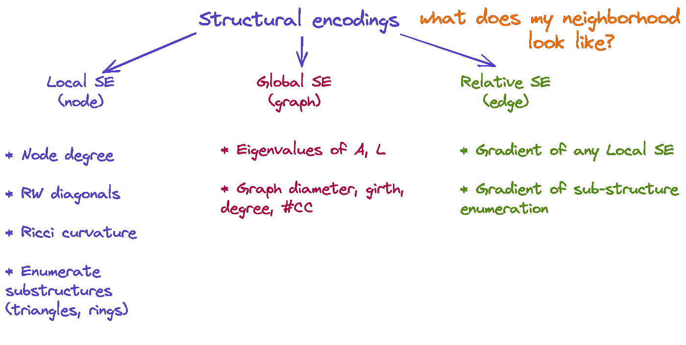*

*结构编码的分类。点击放大。作者图片。*

*👉本地 SEs(作为节点特征)允许节点理解它是什么子结构的一部分。也就是说，给定两个节点和半径为 m 的 se，这些节点周围的 m 跳子图越相似，它们的局部 SE 就越接近。例子:(1)节点度(用于[graphformer](https://arxiv.org/pdf/2106.05234.pdf))；(2)m 步随机行走矩阵的对角线[(RWSE)](https://arxiv.org/abs/2110.07875)；③[瑞西曲率](https://openreview.net/forum?id=7UmjRGzp-A)；(4)枚举或统计三角形和环形等子结构([图子结构网络](https://arxiv.org/abs/2006.09252)， [GNN 为核](https://openreview.net/forum?id=Mspk_WYKoEH))。*

*👉全局 SEs(作为图形特征)向网络提供关于图形的全局结构的信息。如果我们比较两个图，如果它们的结构相似，它们的全局 SEs 将是接近的。例子:(1)邻接或拉普拉斯算子的特征值(用于[三](https://arxiv.org/abs/2106.03893))；(2)众所周知的图的性质，如直径、连通分支数、围长、平均度。*

*👉相对 SEs(作为边特征)允许两个节点了解它们的结构有多少不同。当两个节点在同一个子结构中时，这些可以是任何局部 se 的梯度或布尔指示器(例如，在 [GSN](https://arxiv.org/abs/2006.09252) 中)。*

*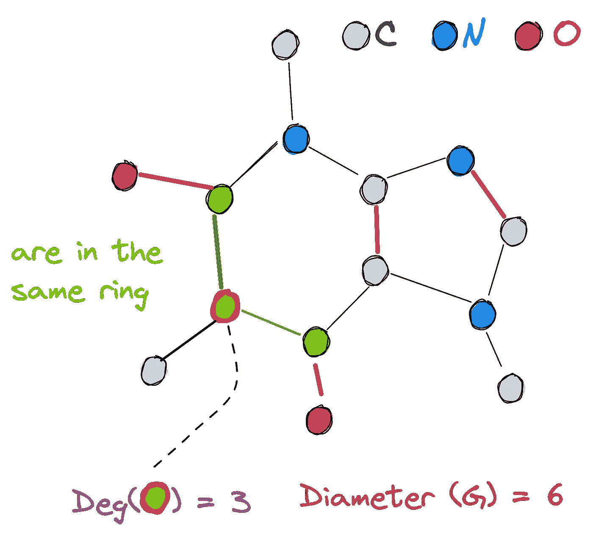*

*咖啡因分子☕️.的局部、整体和相对结构编码的图解作者图片*

*根据图的结构，位置和结构特征可能会带来许多超越 1-WL 极限的表达能力。例如，在高度规则的[循环跳跃链接(CSL)](https://github.com/PurdueMINDS/RelationalPooling/tree/master/) 图中，拉普拉斯的特征向量(我们框架中的全局 PEs)为 CSL (11，2)和 CSL (11，3)图分配唯一且不同的节点特征，使它们明显可区分(其中 1-WL 失败)。*

*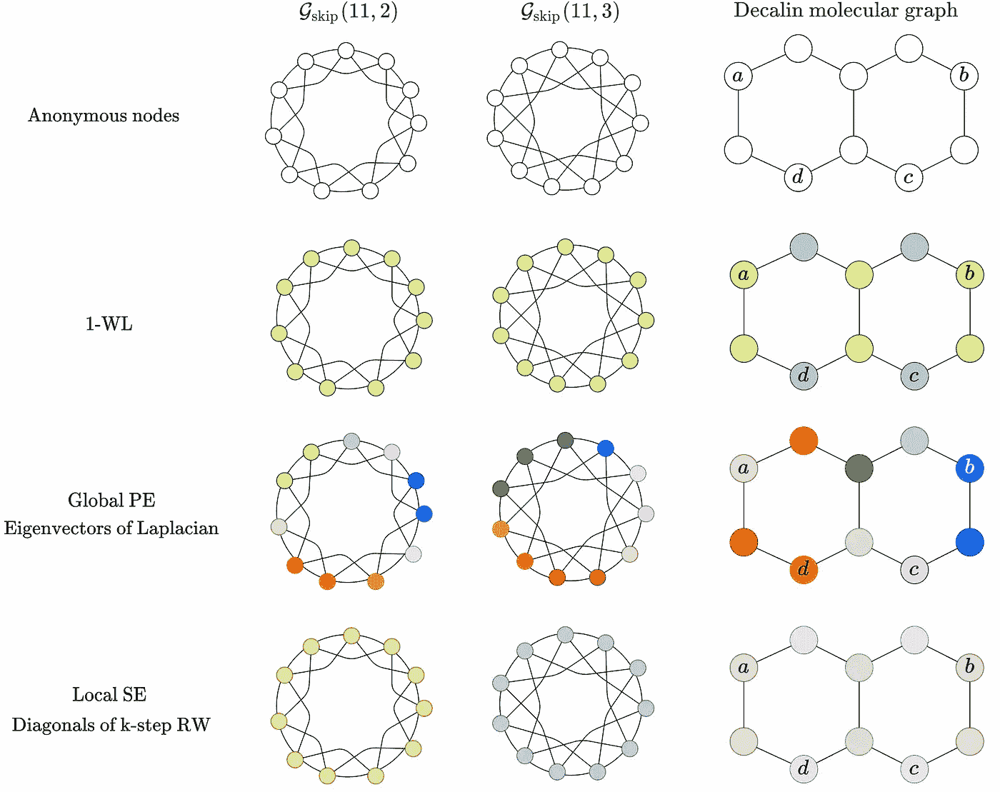*

*位置(PEs)和结构(SEs)特征比 1-WL 更强大，但它们的有效性可能取决于图形的性质。作者图片。*

***PEs 和 SEs 的集合***

*考虑到 PEs 和 SEs 在不同的场景中可能是有益的，为什么你要用一个位置/结构特征来限制模型呢？*

*在 GraphGPS 中，我们允许组合任意数量的 PE 和 SE，例如，16 个拉普拉斯特征向量+特征值+ 8d RWSE。在预处理中，每个节点可能有许多向量，我们使用集合聚合函数将它们映射到要添加到节点特征的单个向量。*

*该机制允许使用[子图 GNNs](/using-subgraphs-for-more-expressive-gnns-8d06418d5ab) 、[符号网](https://arxiv.org/abs/2202.13013)、[等变和稳定 PEs](https://openreview.net/pdf?id=e95i1IHcWj) 、[k-子树 SATs](https://arxiv.org/abs/2202.03036) 以及其他将节点特征构建为复杂聚合函数的模型。*

*现在，有了表达性的位置和结构特性，我们可以应对最后的挑战——可伸缩性。*

# ***可扩展:线性变压器🚀***

*几乎所有现有的图转换器都采用标准的自关注机制，将整个 N 矩阵具体化为 N 个节点的图(因此假设该图是完全连通的)。一方面，它允许向 GTs 注入边缘特征(像在[图形成器](https://arxiv.org/pdf/2106.05234.pdf)中一样，该图形成器使用边缘特征作为注意力偏差)并将真实边缘与虚拟边缘分开(像在 [SAN](https://arxiv.org/abs/2106.03893) 中一样)。另一方面，具体化注意力矩阵的平方复杂度为 O(N ),这使得 GTs 很难扩展到超过 50-100 个节点的分子图。*

*幸运的是，NLP 中围绕变压器的大量研究最近提出了许多线性变压器架构，如 [Linformer](https://arxiv.org/abs/2006.04768) 、 [Performer](https://openreview.net/forum?id=Ua6zuk0WRH) 、 [BigBird](https://arxiv.org/abs/2007.14062) ，以线性地将注意力扩展到输入序列 O(N)。整个[远程竞技场](https://arxiv.org/abs/2011.04006)基准测试旨在评估超长序列的线性变压器。线性转换器的本质是绕过全注意力矩阵的计算，而是通过各种数学“技巧”来近似其结果，如 Linformer 中的低秩分解或 Performer 中的 softmax 内核近似。一般来说，这是一个非常活跃的研究领域🔥我们预计不久将会有越来越多有效的方法出现。*

*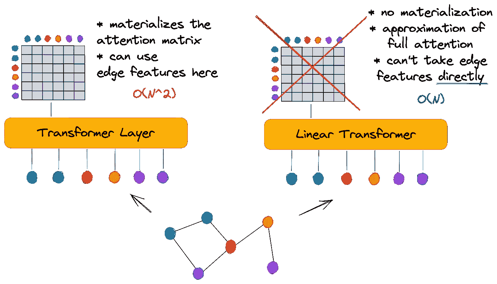*

*普通的 N 变压器(左)实现了完整的注意力矩阵，而线性变压器(右)通过各种近似绕过了这一阶段，而没有明显的性能损失。作者图片。*

*有趣的是，关于图转换器的线性注意力模型的研究并不多——到目前为止，我们只知道 Choromanski 等人最近的 [ICML 2022 工作，不幸的是，这些工作没有在相当大的图上进行实验。](https://arxiv.org/abs/2107.07999)*

*在 GraphGPS 中，我们建议用几乎任何可用的线性注意力模块来代替全局注意力模块(普通的变压器)。运用线性注意力会引出两个重要的问题，这两个问题需要我们做大量的实验来回答:*

1.  *既然没有显式的注意矩阵计算，如何融入边缘特征？我们在 GTs 中到底需要不需要边缘特性？
    **回答**:根据经验，在我们基准测试的数据集上，我们发现 GraphGPS 中的线性*全局*注意力即使在没有边缘特征的情况下也能很好地工作(假设边缘特征是由一些经过 GNN 的*局部*消息处理的)。此外，我们从理论上证明了当输入节点特征已经编码了边缘特征时，线性全局注意不会丢失边缘信息。*
2.  *线性注意力模型的速度和性能之间的权衡是什么？
    **回答**:权衡是相当有利的——我们在从方形注意力模型切换到线性注意力模型时没有发现重大的性能下降，但发现了巨大的内存提升。也就是说，至少在当前的基准测试中，您可以简单地将全部注意力转移到大得多的图上的线性和训练模型，而不会有巨大的性能损失。尽管如此，如果我们想对线性整体注意力表现更有把握，就需要有更大的图表和长期依赖性的更大的基准。*

# ***👨‍🍳烹饪时间——如何让你的 GT 发挥最大功效***

*长话短说——一个经过调整的 GraphGPS，结合了本地和全球的关注，与更复杂和计算更昂贵的模型相比表现非常有竞争力，并在许多基准上树立了一个新的 SOTA！*

*例如，在分子回归基准锌中，GraphGPS 达到历史新低 0.07 MAE。该领域的进步非常快—去年的 SAN 确实设定了 0.139 的 SOTA，因此我们将错误率提高了 50%！📉*

*此外，由于高效的实施，我们显著提高了图形转换器的速度——大约快了 400%🚀—ogbg-molp CBA 上的时间为 196 s/epoch，而之前的 SOTA 图形转换器型号 SAN 的时间为 883 s/epoch。*

*我们使用 [Performer](https://openreview.net/forum?id=Ua6zuk0WRH) 和 [BigBird](https://arxiv.org/abs/2007.14062) 作为线性全局注意力模型进行实验，并将 GraphGPS 扩展到多达 10，000 个节点的图形，适合标准 32 GB GPU，这是以前任何图形转换器都无法实现的。*

*最后，我们开源了 [GraphGPS 库](https://github.com/rampasek/GraphGPS)(类似于 [GraphGym](https://arxiv.org/abs/2011.08843) 环境)，在这里您可以轻松地插入、组合和配置:*

*   *具有和不具有边缘特征的任何本地消息传递模型*
*   *任何全局注意力模型，例如，全变压器或任何线性架构*
*   *任何结构(SE)和位置(PE)编码方法*
*   *SEs 和 PEs 的任意组合，例如拉普拉斯 PEs 和随机游走 RWSE！*
*   *聚合 se 和 PE 的任何方法，如 SignNet 或 DeepSets*
*   *在 PyG 支持的任何图形数据集上运行它，或者使用自定义包装器运行它*
*   *使用 Wandb 跟踪进行大规模实验*
*   *当然，还要复制我们的实验结果*

*📜arxiv 预印本:[https://arxiv.org/abs/2205.12454](https://arxiv.org/abs/2205.12454)*

*🔧Github 回购:[https://github.com/rampasek/GraphGPS](https://github.com/rampasek/GraphGPS)*