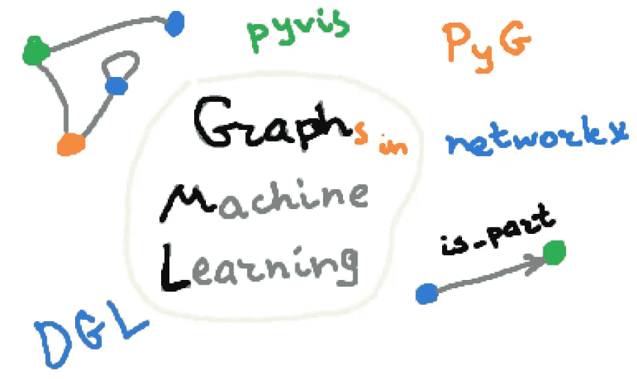
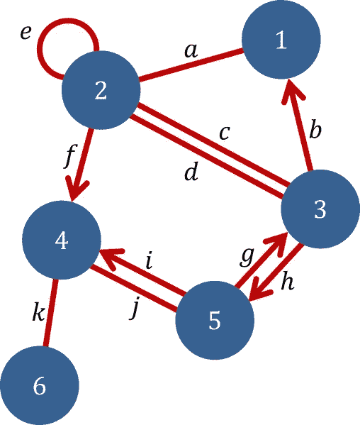
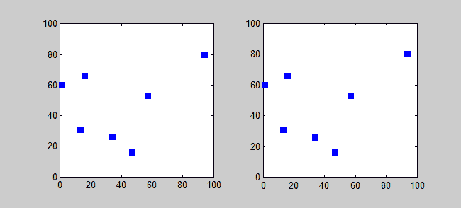
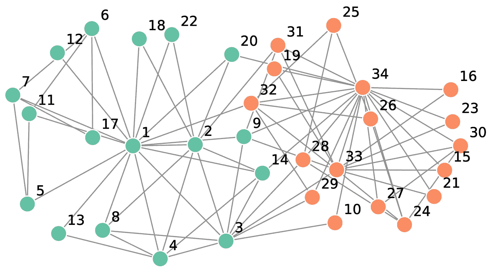
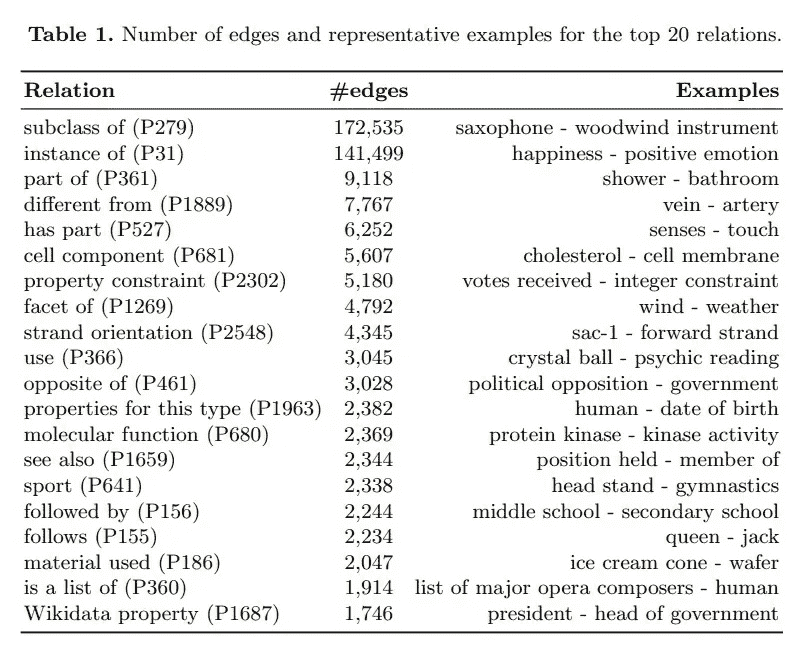
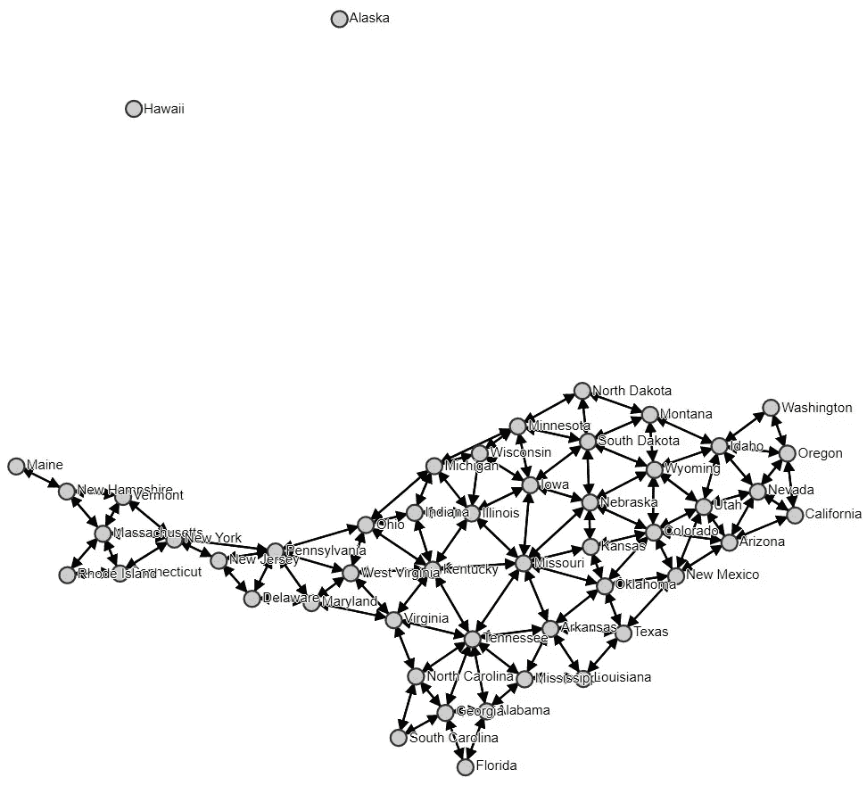
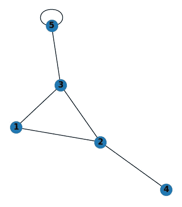
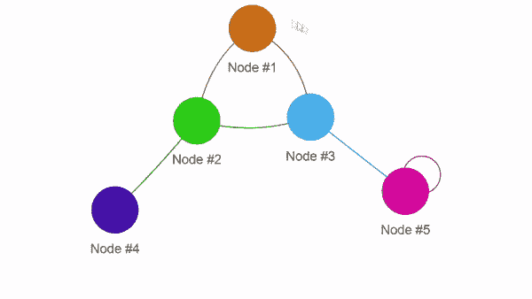
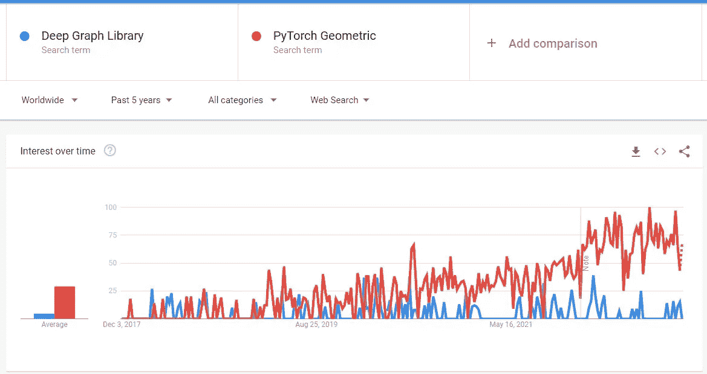

# Python 图形:概述和最佳库

> 原文：<https://towardsdatascience.com/graphs-with-python-overview-and-best-libraries-a92aa485c2f8>

## 图形分析、交互式可视化和图形机器学习

预览。作者图片

一个**图**是一个相对古老的数学数据实体，它是一组相连的元素。由于图是一种非常*灵活的*结构，并且允许你以人类熟悉和方便的形式存储信息，所以图一直被用于计算机科学和技术中。随着机器学习和深度学习的兴起，通过创建**图机器学习**领域，图获得了更多的流行。

在这篇文章中，我想与你分享我用于图形/网络分析、可视化和机器学习的最有用的 Python 库。今天，我们将回顾:

*   [NetworkX](https://networkx.org/) 用于一般图形分析；
*   [PyVis](https://pyvis.readthedocs.io/en/latest/) 在您的浏览器中实现交互式图形可视化；
*   [PyG](https://www.pyg.org/) 和 [DGL](https://www.dgl.ai/) 用于解决各种图形机器学习任务。

在此之前，我先给大家讲几句**图论**和**图机器学习**的知识，并提供一些可能对你有帮助的学习资源。如果你不知道什么是图或图机器学习，那是揭开保密面纱的绝好机会！

# 图论和图机器学习:简介

图形只是一组相互连接的元素。

图表示例。[公共领域](https://commons.wikimedia.org/wiki/File:Graph_example_%28Graph_theory%29.png)

然而，这些元素(称为*节点*)可以包含任何信息，并且可以以任何方式连接(用*边*)的事实使得图成为**最通用的数据结构**。事实上，我们熟悉的任何复杂数据都可以用一个简单的图形来表示:例如，一幅图像——一个像素或文本的网格——一个单词序列(或单词链)。

你可能会想:图表真的如此重要吗？嗯，有些任务没有它们根本无法解决，甚至无法公式化，因为有些信息无法用数据来组织。想象一下下面的情况:你需要访问一个城市列表，比如旅游或工作。你有从一个城市到另一个城市的距离的信息，或者说，不同交通方式的票价——这就更有趣了！如何打造一条*最优路线*，即花最少的钱或开最短的距离？

对我来说，这个任务相当实际——至少想想它在物流方面的应用。这是一个没有图表帮助就无法解决的问题的例子。想想你将如何表示数据，在任何情况下，你仍然会得到*加权*图(图的边有一些值，称为*权重*)。顺便说一下，如果每个城市都需要恰好被访问一次，那么这个任务就变成了著名的[旅行商问题(TSP)](https://www.youtube.com/watch?v=1pmBjIZ20pE) ，这个问题不那么容易解决。原因之一是可能的路线数量增长非常快，甚至对于 7 个城市来说，已经有 360 条了！

用蛮力搜索法求解 7 城市 TSP。[公共领域](https://en.wikipedia.org/wiki/Travelling_salesman_problem#/media/File:Bruteforce.gif)

**图论**(起源于 18 世纪)从事图的研究，解决各种图的问题:在图中寻找一条可能的或最优的路径，建立并研究*树*(一种特殊类型的图)等等。图论被成功地应用于社会科学、化学、生物学和其他领域。但是随着计算机的发展，使用图形的过程达到了另一个层次。

真正重要的是，这个基础:*一组相关元素*，通常具有不同的元素和连接类型，对于建模真实世界的任务和数据集非常有用。这就是图机器学习发挥作用的地方(尽管在它之前也解决了惊人的任务)。在人类收集了适当的数据集并开发了对它们进行建模的技术(如 [*【图卷积网络(GCNs)】*](/graph-convolutional-networks-deep-99d7fee5706f)，以此类推 [*【卷积神经网络(CNN)*](/a-comprehensive-guide-to-convolutional-neural-networks-the-eli5-way-3bd2b1164a53))之后，解决大范围的图任务成为可能:

*   节点级任务，如**节点分类** —为图中的每个节点分配一个标签。下面一点我们会看到一个例子——把一群人分成两个集群，知道他们是如何相互交流的；但是其他应用程序可能会非常不同。这里的直觉来自*社会科学*，它说我们依赖于我们的环境。事实上，任何实体都可以被更有效地分类，不仅考虑一些特征集，而且考虑关于其邻域的数据。例如，如果你的朋友吸烟，你更有可能吸烟，如果你的朋友去健身房，你更有可能去健身房。
*   边缘级任务，如**边缘预测** —预测两个节点是否有一条边缘，或者更常见的是，预测*边缘类型*(有几种边缘类型的图称为*多图*)。这个任务对于我们几分钟后看到的*知识图表*来说非常有趣。
*   图表级任务。这可以是**图形分类**、**图形生成、**等等。这个领域对生物学和化学特别有用，因为*分子可以有效地用图形表示*。分子分类(确定分子是否具有某些性质)或者分子生成(尤其是药物生成)听起来比一些“图级任务”酷多了！

让我们看看现实生活中的图表示例。最著名的图形数据集之一是[空手道俱乐部数据集](http://konect.cc/networks/ucidata-zachary/)。在这里，每个节点是一个人(俱乐部成员)，每个边代表在俱乐部之外互动的两个成员。

空手道俱乐部数据集可视化。[公共领域](https://en.wikipedia.org/wiki/Zachary's_karate_club#/media/File:Zachary_karate_club_social_network.png)

一个常见的问题是，在两个教练之间发生争论后，找到俱乐部分裂成的两组人(现在我们可以将其视为*二元(或 2 类)节点分类*)。该数据集收集于 1977 年，并成为人类社会网络或社区结构的经典范例。

另一种图表类型是*知识图表*，它可以被人类理解，因此对机器学习模型非常有用。在知识图中，节点是一些实体或概念，而边表示关于一对实体的交互的知识。因此，*节点-边缘-节点*结构存储了关于世界或特定系统的某个事实。

知识图的一个简单例子。[公共领域](https://en.wikipedia.org/wiki/Knowledge_graph#/media/File:Conceptual_Diagram_-_Example.svg)

上面例子中的知识图包含两种类型的边:*是*和*吃*，因此是我们前面介绍的**多图**。 *Dogs-is-Animals* 结构让我们知道*“Dogs”集合是“Animals”集合*的子集，或者用更简单的术语来说，就是 *dogs 是 animals* 。

[Wikidata](https://www.wikidata.org/wiki/Wikidata:Main_Page) 是维基百科的一个庞大的免费知识库，不断更新，现在已经拥有超过 **1 亿**个节点。有 400 多种边缘类型，其中一些是的*部分、*不同于*、*的*对面、*人口*、*位置*，所以肯定有意义。*

2020 年维基百科知识库中的 20 大边缘关系。[公共领域](https://wikidataworkshop.github.io/2020/papers/Wikidata_Workshop_2020_paper_10.pdf)

这个庞大的知识库包含了我们周围世界的大量信息。我仍然很惊讶人类是如何收集这些数据的，而且机器现在能够处理这些数据！

我不能保持沉默的另一件事是**维基数据美丽的可视化功能**。例如，这里你可以看到美国的连接图。注意，它不是任何人画的，它只是整个维基数据图的一个子图:我们只把美国各州作为节点，把 [P47(与)](https://www.wikidata.org/wiki/Property:P47)作为边。

美国各州的连通性。[公共领域](https://angryloki.github.io/wikidata-graph-builder/?mode=wdqs&wdqs=SELECT%20%3Fitem%20%3FitemLabel%20%3FlinkTo%20%7B%0A%20%20%3Fitem%20wdt:P31%20wd:Q35657%20.%0A%20%20OPTIONAL%20%7B%20%3FlinkTo%20wdt:P47%20%3Fitem%20;%20wdt:P31%20wd:Q35657%20%7D%20.%0A%0A%20%20SERVICE%20wikibase:label%20%7Bbd:serviceParam%20wikibase:language%20%22en%22%20%7D%0A%7D)

看看[维基数据图表生成器](https://angryloki.github.io/wikidata-graph-builder/)和[其他可视化](https://www.wikidata.org/wiki/Wikidata:Tools/Visualize_data)。让我给你举几个我觉得有趣的例子:

*   [从苏格拉底到希腊化末期的师生关系图](https://projetjourdain.org/network/index.html)
*   [与历史事件互动的时间线](http://histropedia.com/timeline-everything.html)
*   [潘潘熊猫家谱](https://wikioverdata.toolforge.org/wikitree/public/?q=Q15928745&level=3&type=descendants&orientation=North&lang=en)

## 了解更多关于图表的信息

如果在那个简要的概述之后，你现在对图形感兴趣，并且想知道更多关于它们的信息，我向你推荐 Google Research 的精彩的[图形神经网络简介。在本文中，您可以找到更多的示例和交互式可视化。](https://distill.pub/2021/gnn-intro/)

查看 freeCodeCamp.org 的[图论算法课程，了解各种图论算法概述，或](https://www.youtube.com/watch?v=09_LlHjoEiY)[斯坦福 CS224W:机器学习与图形课程](https://www.youtube.com/playlist?list=PLoROMvodv4rPLKxIpqhjhPgdQy7imNkDn)开始您的图形机器学习之旅。

简单介绍之后，让我们实际上从 Python 库开始吧！

# NetworkX —通用图形分析

如果您必须对图形进行一些操作，并且您使用 Python 作为编程语言，您很可能会很快找到 NetworkX 库。它可能是最基本、最常用的网络分析库，提供了广泛的功能:

*   用于存储和操作无向或有向图和多重图的数据结构；
*   实现了许多图形算法；
*   基本的可视化工具。

该库非常直观且易于使用。此外，大多数基础知识，如*图形数据结构*对于所有流行的图形库来说将保持相同或至少相似。为了清晰起见，您可以创建一个简单的图形，并用以下代码可视化它:

基本的 NetworkX 可视化。作者图片

说到算法，networkx 非常强大，已经实现了数百个图算法。

总的来说，这是一个高效的、可伸缩的、强大的库，如果你正在处理图形分析，它肯定会对你有用。

## 参考

 [## NetworkX - NetworkX 文档

### NetworkX 是一个 Python 包，用于创建、操作和研究…的结构、动力学和功能

networkx.org](https://networkx.org/) 

# PyVis —交互式图形可视化

使用 networkx 进行图形可视化对于小图形来说是非常好的，但是如果你需要更多的**灵活性**或**交互性**，你最好给 PyVis 一个机会。情况类似于[matplotlib](https://matplotlib.org/)vs[plotly](https://plotly.com/)。使用 matplotlib 进行快速直观的可视化是非常好的，但是如果您需要与您的图表进行交互或者将其展示给其他人，您最好使用更强大的工具。

PyVis 构建在 [VisJS 库](https://visjs.github.io/vis-network/examples/)之上，用简单的代码在浏览器中生成交互式可视化。让我们绘制与上例相同的图形。

这段代码将创建一个`graph.html`文件。通过打开它，您将能够与您的可视化交互:缩放它，拖动它，等等。

PyVis 可视化示例。作者 Gif

看起来很有趣，对吧？该库甚至允许您使用 web UI 来动态调整显示配置。一定要查看官方教程，它会带你了解主库的功能。

## 参考

 [## 交互式网络可视化— pyvis 0.1.3.1 文档

pyvis.readthedocs.io](https://pyvis.readthedocs.io/en/latest/) 

# DGL 和 PyG 图机器学习

现在让我们切换到更高级的话题——图机器学习。我将提到两个最受欢迎的图书馆:DGL 和 PyG。

DGL(深度图库)最初于 2018 年发布。与 PyG (PyTorch Geometric)相反，PyG 建立在 PyTorch 之上，因此只支持 PyTorch 张量，DGL 支持多种深度学习框架，包括 PyTorch、TensorFlow 和 MXNet。

两个库都实现了流行的*图形神经网络(GNN)单元*，例如 *GraphSAGE* 、 *GAT(图形注意力网络)*、 *GIN(图形同构网络)*等等。从预制块构建一个模型并不困难——这个过程与普通 PyTorch 或 TensorFlow 非常相似。

以下是如何在 PyG 中为节点分类创建两层 GCN 模型:

DGL 也有同样的代码:

如果你熟悉深度学习和 PyTorch，这两个代码片段都非常简单。

如您所见，两个库的模型定义非常相似。然后，可以在 PyG 的普通 PyTorch 上编写训练循环，并需要对 DGL 进行一些修改(因为 DGL 图对象存储整个数据集，您必须使用二进制*掩码*来处理训练/验证/测试集)。

这里的数据表示略有不同:至少基于`forward`方法的不同输入参数，您可以看到这一点。事实上，PyG 将所有东西都存储为 PyTorch 张量，DGL 有一个你必须使用的单独的图形对象，在这个引擎盖下，它遵循了更经典的 NetworkX 风格。

然而，这没什么大不了的——您可以用几行代码将 PyG 图对象转换成 DGL 图，反之亦然。更重要的问题是:它们还有什么不同？你应该用哪一个？

## DGL vs PyG

试图找出哪个库更好，你会不断遇到同一个答案——“两个都试试，决定哪个最适合你”。好吧，但它们至少有什么不同？同样，你会不断遇到的答案是“*他们很相似”*。

他们真的是！而且，你几分钟前看代码自己也看到了。但是当然，深入挖掘，您会发现一些差异:[这里有一个很好的资源列表，包括库作者的一些想法](https://discuss.dgl.ai/t/dgl-vs-pytorch-geometric/346/8)，这里有一个非常详细的不同方面的比较。

总的来说，答案真的是*两个都试试*。事实上，DGL 有更多的低级 API，在实现新思想的意义上更难使用。但这使得它更加灵活:DGL 并不局限于*消息传递网络*(经典*图卷积网络* ) 并且拥有 PyG 无法提供的几个概念的实现，例如[树-LSTM](https://docs.dgl.ai/tutorials/models/2_small_graph/3_tree-lstm.html) 。

另一方面，PyTorch Geometric 使他的 API 尽可能简单，然后在能够快速实现新想法(即新 GNN 细胞)的研究人员中获得更多的欢迎。在过去的时间里， [PyG 变得越来越受欢迎](https://trends.google.com/trends/explore?date=today%205-y&q=Deep%20Graph%20Library,PyTorch%20Geometric)，这是由于 PyG 2.0 的重要更新以及包括斯坦福大学在内的活跃而强大的合作者团队。

过去 5 年 DGL 与 PyG 搜索查询的数量。[公共领域](https://trends.google.com/trends/explore?date=today%205-y&q=Deep%20Graph%20Library,PyTorch%20Geometric)

所以我还是鼓励你两个都试试，*先给 PyG 机会*。

如果您正在处理一个相对熟悉的图问题(无论是节点分类、图分类等等。)，无论是 [PyG](https://pytorch-geometric.readthedocs.io/en/latest/notes/cheatsheet.html) 还是 [DGL](https://docs.dgl.ai/api/python/nn-pytorch.html#conv-layers) 都实现了大量的 GNN 单元。同样，使用 PyG，您可以更轻松地在任何研究中实现自己的 GNN。

然而，如果您想完全控制幕后发生的事情，或者实现比消息传递框架更复杂的东西，您的选择很可能会落在 DGL 身上。

## 参考

*   [PyG 官网](https://www.pyg.org/)， [PyG 文档](https://pytorch-geometric.readthedocs.io/en/latest/)
*   [DGL 官网](https://www.dgl.ai/)， [DGL 文档](https://docs.dgl.ai/)

# 结论

这篇文章的目标受众(对图形感兴趣的人)相当少。嗯，机器学习是计算机科学中一个相当年轻的领域，图机器学习更年轻。最后一个主要吸引研究社区的注意，但是，信不信由你，它被用在重要的现实世界应用中，例如推荐系统和生物/化学研究。

无论如何，我希望这些资料对你来说是有趣的或有帮助的——不管你是在寻找什么特别的东西，还是今天刚刚学到了一些新东西。作为回顾，今天我们简要回顾了什么是图形和图形机器学习，并查看了以下库:

*   [NetworkX](https://networkx.org/) :通用图形分析；
*   PyVis:交互式图形可视化；
*   [PyG](https://www.pyg.org/) 和 [DGL](https://www.dgl.ai/) :图上的机器学习。

# 感谢您的阅读！

*   我希望这些材料对你有用。在媒体上关注我以获得更多类似的文章。
*   如果您有任何问题或意见，我将很高兴得到任何反馈。在评论里问我，或者通过 [LinkedIn](https://www.linkedin.com/in/andimid/) 或者 [Twitter](https://twitter.com/dimid_ml) 联系。
*   为了支持我作为一名作家，并获得数以千计的其他媒体文章，使用[我的推荐链接](https://medium.com/@andimid/membership)获得媒体会员资格(不收取额外费用)。