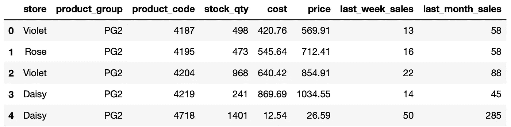

# 远大前程:数据科学和工程团队的自动化测试

> 原文：<https://towardsdatascience.com/great-expectations-automated-testing-for-data-science-and-engineering-teams-1e7c78f1d2d5>

## 验证、描述和记录您的数据


约翰尼斯·安德森在 [Unsplash](https://unsplash.com/s/photos/master?utm_source=unsplash&utm_medium=referral&utm_content=creditCopyText) 上拍摄的照片

我曾经在一家零售分析公司工作，我们提供分析解决方案来帮助零售商改善他们的业务，如库存和分配优化、需求预测和动态定价。

典型的工作流程始于客户的日常反馈，即用作我们解决方案输入的原始数据。在一系列数据清理、操作、分析和建模步骤之后，结果被创建并发送给客户。

此类流程中的一个主要挑战是来自客户的数据的验证。如果它包含一些意想不到的或荒谬的值，结果将是无用的。事实上，它们可能弊大于利。

如果在结果步骤中检测到这些问题，影响只会加速。您可能需要重新运行管道，这意味着额外的成本和时间的浪费。更糟糕的情况是将结果发送给客户，然后客户在他们的操作中使用它们。

# 解决方案

幸运的是，我们有很多工具来防止这样的灾难发生。[远大前程](https://greatexpectations.io/)就是其中之一。这是一个 Python 库，用于验证、记录和分析您的数据，以保持质量并改善团队之间的交流。

高期望值允许断言您对数据的期望，这有助于在早期阶段快速发现数据问题。

该库的主要组件是 expect，它是一个可以由计算机评估的声明性语句。期望基本上是对你的数据的单元测试。

期望被赋予直观的名称，清楚地告诉我们它们是关于什么的。这里有一个例子:

```
expect_column_values_to_be_between(
    column="price", min_value=1, max_value=10000
)
```

这个期望的作用是检查列中的值是否在指定的最小值和最大值之间。

核心库中定义了很多期望。然而，我们不仅限于或依赖于这些。

远大前程图书馆有更多来自社区的期望。

# 如何使用它

我们可以通过 pip 安装它，如下所示:

```
pip install great_expectations
```

然后，我们可以导入它:

```
import great_expectations as ge
```

让我们用我用模拟数据准备的销售数据集来做一些例子。你可以从我的 GitHub 页面上的[数据集](https://github.com/SonerYldrm/datasets)库中下载。叫做“销售 _ 数据 _ 与 _ 商店”。

为了使用期望，我们需要一个巨大的期望数据集。我们有两种不同的方法来创建它:

*   使用 from_pandas 函数从 Pandas 数据帧中
*   使用远大前程的 read_csv 函数从 CSV 文件中

```
import great_expectations as gedf = ge.read_csv("datasets/sales_data_with_stores.csv")type(df)
great_expectations.dataset.pandas_dataset.PandasDatasetdf.head()
```



df 的前 5 行(图片由作者提供)

## 期望 1

为了捕捉具有不同值的列中的意外值，我们可以使用 expect _ column _ distinct _ values _ to _ be _ in _ set 期望。它检查列中的所有值是否都在给定的集合中。

让我们在商店列上使用它。

```
df.expect_column_distinct_values_to_be_in_set(
    "store",
    ["Violet", "Rose"]    
)**# output**
{
  "result": {
    "observed_value": [
      "Daisy",
      "Rose",
      "Violet"
    ],
    "element_count": 1000,
    "missing_count": null,
    "missing_percent": null
  },
  "exception_info": {
    "raised_exception": false,
    "exception_traceback": null,
    "exception_message": null
  },
  "meta": {},
  "success": false
}
```

预期失败(即 success: false ),因为 store 列中有一个值(Daisy)不在给定的列表中。

除了指示成功和失败之外，期望值的输出还包含一些其他信息，例如观察值、值的数量以及列中缺少的值。

## 期望 2

我们可以检查列的最大值是否在特定范围内:

```
df.expect_column_max_to_be_between(
    "price",
    min_value=0.1,
    max_value=2000
)**# output**
{
  "result": {
    "observed_value": 1500.05,
    "element_count": 1000,
    "missing_count": null,
    "missing_percent": null
  },
  "exception_info": {
    "raised_exception": false,
    "exception_traceback": null,
    "exception_message": null
  },
  "meta": {},
  "success": true
}
```

输出是字典格式的，所以我们可以很容易地使用它的特定部分，并在我们的管道中使用它。

```
max_check = df.expect_column_max_to_be_between(
    "price",
    min_value=0.1,
    max_value=2000
)max_check["success"]**# output**
True
```

## 期望 3

值的唯一性对于某些功能(如 id 列)非常重要。我们可以检查一列中的所有值是否都是唯一的。

```
# for a single column
df.expect_column_values_to_be_unique("product_code")# for multiple columns
df.expect_compound_columns_to_be_unique(
    column_list=["product_code","product_group"]
)
```

这些期望值的输出很长，所以我没有在这里展示，但是它们包含了有价值的见解，比如意外值的数量和部分意外值列表。

## 期望 4

一个简单而有用的期望是检查数据集中是否存在特定的列。

```
df.expect_column_to_exist("cost")**# output**
{
  "result": {},
  "exception_info": {
    "raised_exception": false,
    "exception_traceback": null,
    "exception_message": null
  },
  "meta": {},
  "success": true
}
```

当您希望确保每日数据馈送包含所有必要的列时，这很方便。

## 结论

我们只做了 3 个例子，但是目前库中有 [297 个期望](https://greatexpectations.io/expectations/)，并且这个数字还在增加。

我非常喜欢这些期望的一点是它们的名字是不言自明的，因此很容易理解它们的作用。

您可能会争辩说，这些期望可以使用纯 Python 代码或其他一些包来检查。你是对的，但是使用远大前程库有一些好处:

*   易于实施
*   拥有标准且高度直观的语法
*   有些期望不是很简单，如果你喜欢自己做，需要写很多行代码
*   最后但同样重要的是,《远大前程》还根据这些期望创建了数据文档和数据质量报告。

*你可以成为* [*媒介会员*](https://sonery.medium.com/membership) *解锁我的全部写作权限，外加其余媒介。如果你已经是了，别忘了订阅**如果你想在我发表新文章时收到电子邮件。***

*感谢您的阅读。如果您有任何反馈，请告诉我。*