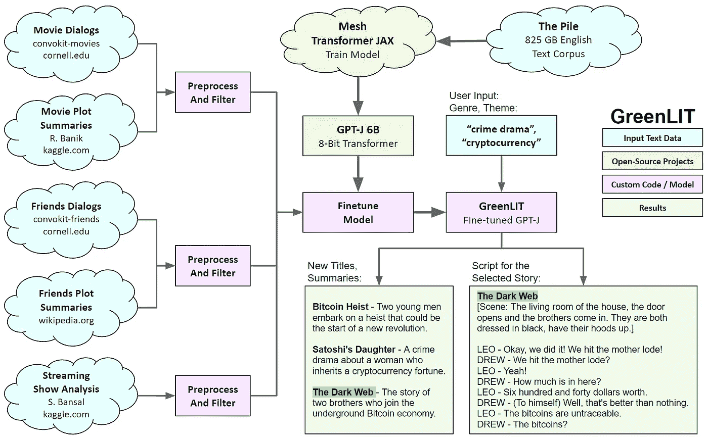
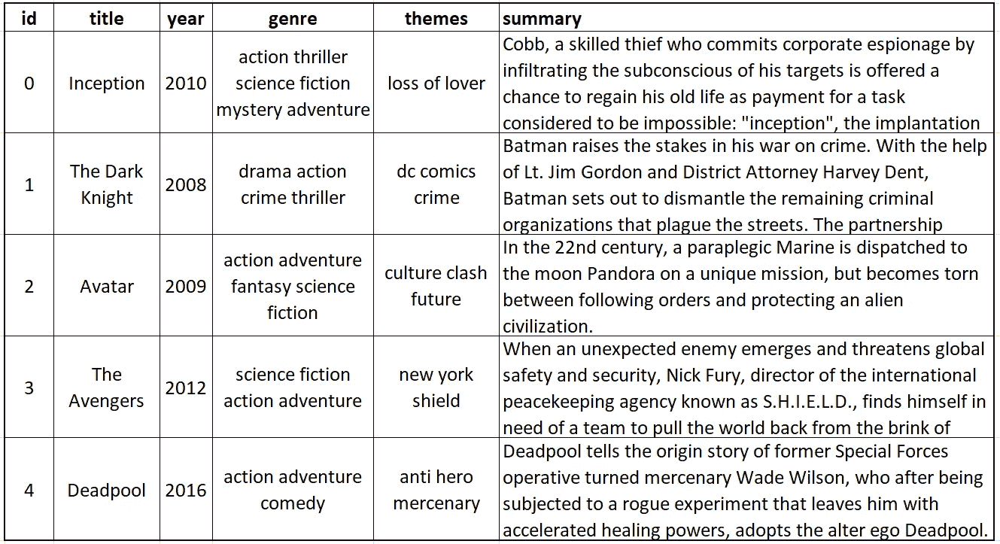
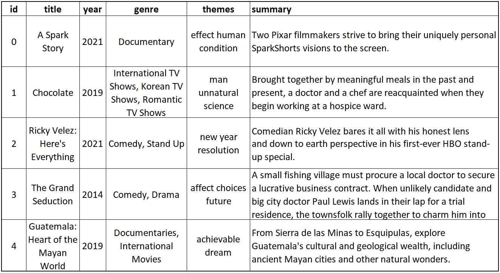
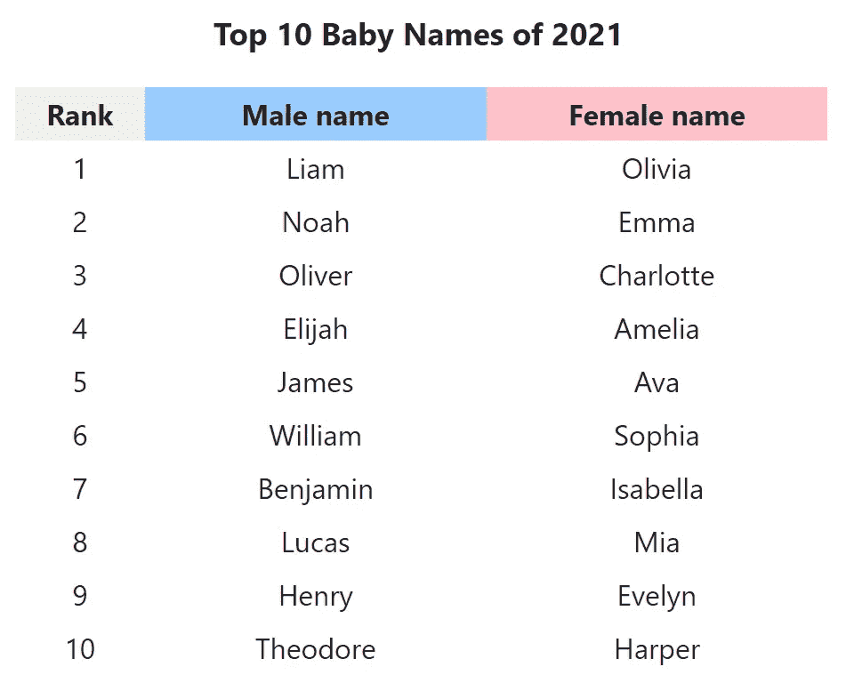
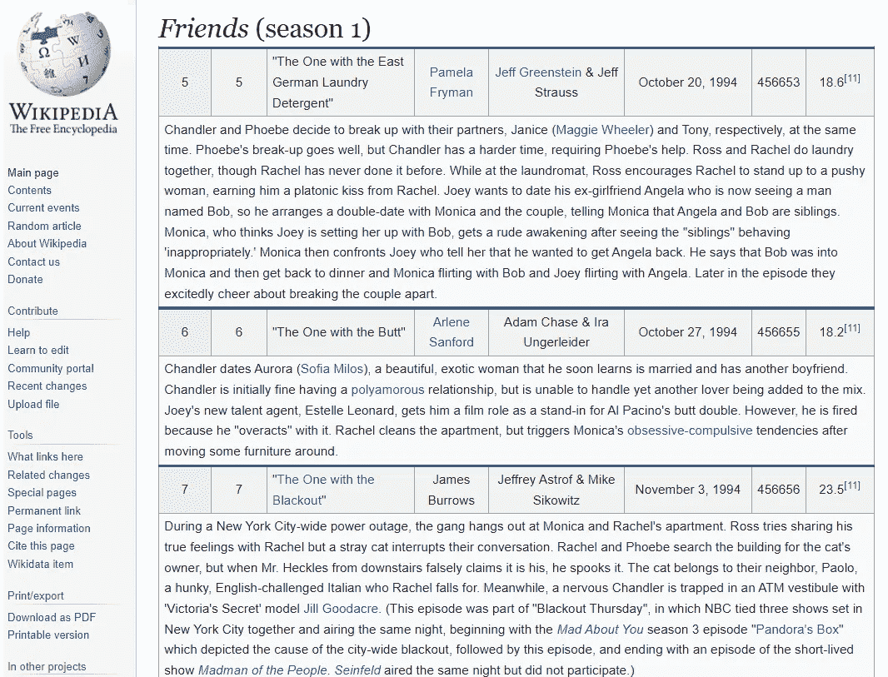
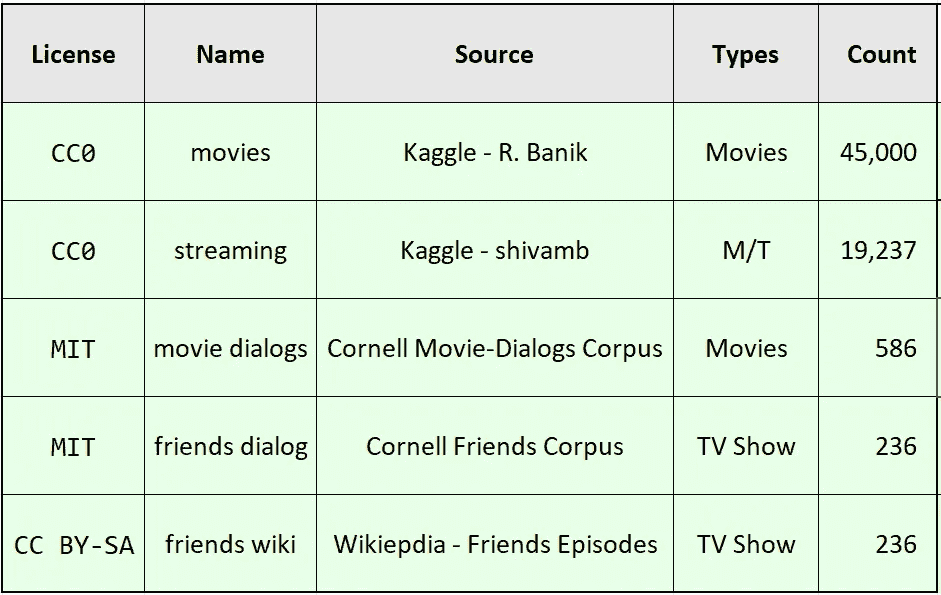

# 格林利特:使用 GPT J 与多任务学习创造新的电影剧本

> 原文：<https://towardsdatascience.com/greenlit-using-gpt-j-with-multi-task-learning-to-create-new-screenplays-54a2d04f761c>

## 如何微调一个 ML 模型来创建具有新标题、情节概要和脚本的电视节目和电影


科技日报在 [Unsplash](https://unsplash.com?utm_source=medium&utm_medium=referral) 上拍摄的

我在[的上一篇文章](/deep-haiku-teaching-gpt-j-to-compose-with-syllable-patterns-5234bca9701)中展示了我如何微调 GPT J 来生成俳句，结果相当不错。在我的最新实验 GreenLIT 中，我想突破使用 GPT J 进行创意写作的限制，看看它是否能为全新的电视节目和电影制作剧本。

这是 GreenLIT 的组件和流程框图。我将在下面的小节中详细讨论这些。



**GreenLIT 组件**，作者提供的图表

首先，我在网上搜索了一下，找到了五个带文本的开源数据集，用作训练数据:

*   康奈尔大学 ConvoKit 项目的电影对话(麻省理工学院许可)[1]
*   电影情节摘要来自 Kaggle 上的 Rounak Banik(CC0 许可证)[2]
*   来自 ConvoKit 项目的朋友对话(麻省理工学院许可)[1]
*   来自维基百科的朋友情节摘要(CC-BY-SA 许可)[3]
*   Kaggle 上 Shivam Bansal 的流媒体节目分析(CC0 许可证)[4]

第一个和第三个数据集包含电影和热门情景喜剧《老友记》中的对话其他数据集包括电视节目和电影的标题、类型和情节概要。我写了一些 Python 代码来预处理和过滤文本，为 GPT-J 要学习的四个任务创建一组条目:

1.  体裁和主题→标题和情节
2.  标题和情节→对话框
3.  标题和情节→剧本
4.  对话框→脚本

注意对话仅仅意味着角色的名字和台词，而剧本是对话加上舞台指示。我将在下面进一步详细解释这一切。

我从 GPT-J [5]模型开始，它是 GPT-3 [6]的开源变体。GPT-J 之前在一个名为 Pile [7]的网络上接受了大量文本数据的训练。

我在 Google Colab 上用超过 38，000 个训练条目对 GPT-J 进行了 20 小时的微调，以创建我的 GreenLIT 模型。在我对其进行微调之后，我使用了以下文本提示作为输入。

```
GENRE: **crime drama**
THEME: **cryptocurrency**
```

根据该提示，GreenLIT 模型生成了以下标题和情节摘要:

```
#1\. TITLE: **Bitcoin Heist**
SUMMARY: Two young men embark on a heist that could be the start of a new revolution.#2\. TITLE: **Satoshi's Daughter**
SUMMARY: A crime drama about a woman who inherits a cryptocurrency fortune.#3\. TITLE: **The Dark Web**
SUMMARY: The story of two brothers who join the underground Bitcoin economy.#4\. TITLE: **Cryptostorm**
SUMMARY: Cryptostorm revolves around the story of a young man who has been trying to keep his life on track after being sent to
prison for a crime he didn't commit.#5\. TITLE: **The Cypher**
SUMMARY: A young hacker joins a group of underground hackers to create a secure platform.
```

我从这个列表中选择了#3，黑暗之网，并将标题和摘要发送回 GreenLIT 以创建脚本的第一页。在这里。

```
TITLE: **The Dark Web** SUMMARY: The story of two brothers who join the underground Bitcoin economy.
SCRIPT:[Scene: The living room of the house, the door opens and the brothers come in. They are both dressed in black, have their hoods up.]LEO - Okay, we did it! We hit the mother lode!
DREW - We hit the mother lode?
LEO - Yeah!
DREW - How much is in here?
LEO - Six hundred and forty dollars worth.
DREW - (To himself) Well, that's better thaan nothing.
LEO - The bitcoins are untraceable.
DREW - The bitcoins?
LEO - Yeah, the Bitcoin is basically just a name for a cryptographic currency.
DREW - A cryptographic currency?
LEO - Yeah, like, a secure, internet way of transferring money from one person to another.
DREW - Sounds like they invented the internet.
LEO - Well, the internet is just a network of computers connected to other computers by phone lines, but the internet is also the thing that makes it possible to transfer money from one computer to another without a bank.
DREW - Oh, yeah?
LEO - Yeah.
DREW - How do you do that?
LEO - Well, it's actually really complicated, and I don't understand it myself, but the short version is that the Bitcoin is run by a bunch of computers all connected to each other. It's kind of like a decentralized Ponzi scheme.
DREW - A decentralized Ponzi scheme?
LEO - Yeah, you know, like the government runs a Ponzi scheme.
```

好吧，有意思。剧本似乎幽默地解释了加密货币的基础知识，并对角色进行了一些发展。加上一点社会评论。请稍等，我给我的代理人打电话。😉

你可以在 Google Colab 上免费查看 GreenLIT [这里](https://github.com/robgon-art/GreenLIT)。请务必查看下面附录中的更多示例输出。

# 系统详细信息

在接下来的小节中，我将深入探讨 GreenLIT 中使用的组件和流程的细节。我将首先讨论一种称为多任务学习的训练神经网络的技术。


**多任务**，来源:[PxHere，**CC0 公共域**](https://pxhere.com/en/photo/1538475?utm_content=clipUser&utm_medium=referral&utm_source=pxhere)

## 多任务学习

对于 GreenLIT 项目，我有两个主要目标，(A)根据给定的类型和主题创建新节目的标题和情节概要，以及(B)根据给定的标题和情节概要创建脚本的第一页。虽然微调两个专门的人工智能模型可以工作，但我想看看一个微调的模型是否可以完成这两项任务。这样做有几个好处。正如我在我的[深度俳句](/deep-haiku-teaching-gpt-j-to-compose-with-syllable-patterns-5234bca9701)项目中发现的那样，针对多个但相似的任务微调一个模型，即多任务学习，可以提高两个任务的结果。里奇·卡鲁纳在卡内基·梅隆大学研究了这一技术。

> 多任务学习是一种归纳迁移的方法，它通过使用相关任务的训练信号中包含的领域信息作为归纳偏差来提高泛化能力。它通过使用共享表示并行学习任务来做到这一点；每个任务学到的东西可以帮助其他任务学得更好。—里奇·卡鲁纳

为了解释多任务学习是如何工作的，亚历山大·巴甫洛夫·洪查尔在他的文章中描述了一个叫做“特征选择双重检查”的概念。他说，“如果一个特征对于不止一个任务是重要的，那么很可能这个特征对于你的数据来说确实是非常重要和有代表性的”，并且将在多任务学习期间被系统强化。

另一个优势是实际效率——只需要加载一个 AI 模型来执行这两项任务。使用一种模式可以减少磁盘存储、加载时间和 GPU 内存。

接下来，我将讨论我是如何为项目收集训练数据的。


[Joshua Sortino](https://unsplash.com/@sortino?utm_source=medium&utm_medium=referral) 在 [Unsplash](https://unsplash.com?utm_source=medium&utm_medium=referral) 上拍摄的照片

## **收集训练数据**

为了针对第一项任务(生成新节目的标题和剧情摘要)对系统进行微调，我寻找了包含电影和电视节目元数据的开源数据集。

## 收集电影情节

在拥有众多数据集的 Kaggle 上，我发现了一个由 Rounak Banik 编写的电影情节摘要的大型列表，名为[电影数据集](https://www.kaggle.com/datasets/rounakbanik/the-movies-dataset)。它包含标题、发行年份、类型、摘要等。，对于超过 40K 的电影。他在 CC0(公共领域)许可下发布了数据集。以下是 5 个条目的示例。



**来自电影数据集**的样本条目，来源: [Kaggle](https://www.kaggle.com/datasets/rounakbanik/the-movies-dataset) 上的 Rounak Banik，CC0 公共域

我使用了一个名为 KeyBERT [9]的模块来从摘要中提取主题。你可以在这里看到我的 Python 代码。

我在 Shivam Bansal 的 Kaggle 上找到了另一个数据集集合。他收集了网飞、亚马逊、Hulu 和 Disney+上大约 2 万个流媒体节目的摘要。这是一个数据样本。



**来自流媒体服务**的样本条目，来源: [Kaggle](https://www.kaggle.com/shivamb/datasets) 上的 Shivam Bansal，CC0 公共域

我再次使用 KeyBERT 从流媒体节目的摘要中捕捉主题。

为了教 GPT-J 如何从类型和主题中创建标题和摘要，我为每个电影和电视节目收集了一个这样的条目。

```
GENRE: action science fiction
THEME: saving the world
TITLE: The Matrix
SUMMARY: Set in the 22nd century, The Matrix tells the story of a computer hacker who joins a group of underground insurgents fighting the vast and powerful computers who now rule the earth.GENRE: comedy sitcom
THEME: workplace comedy
TITLE: 30 Rock
SUMMARY: The life of the head writer at a late-night television variety show. From the creator and stars of SNL comes this workplace comedy. A brash network executive bullies head writer Liz Lemon into hiring an unstable movie star.
```

## 收集电影和电视剧本

接下来，我搜索脚本数据集。引用黑暗网络的 Leo 的话来说，当我发现康奈尔大学的 ConvoKit 时，“我找到了主矿脉”。收集数据集的正式名称是康奈尔对话分析工具包[1]，在麻省理工学院开源许可下发布。

> [ConvoKit]包含提取对话特征和分析对话中社会现象的工具，使用受 scikit-learn 启发(并与之兼容)的单一统一界面。包括了几个大型对话数据集，以及在这些数据集上使用工具包的脚本示例。— Jonathan P. Chang 等人。

我使用了 ConvoKit 中两个数据集的 dialog 来微调 GreenLIT。以下是来自他们网站的数据集描述。

*   康奈尔电影对话语料库-从原始电影剧本中提取的大量元数据丰富的虚构对话集。(617 部电影中 10，292 对电影角色之间的 220，579 次会话交流)。
*   《老友记》语料库——收集了 10 季《老友记》中的所有对话，这是一部流行于 20 世纪 90 年代的美国电视情景喜剧。

这是康奈尔电影对话语料库中《卢旺达酒店》中的一段对话。

```
PAUL - What's wrong?
ZOZO - Beg your pardon sir, you are Hutu. You are safe there.
PAUL - You are with me, Zozo, don't worry.
ZOZO - What is it like to fly on a plane, sir?
PAUL - It depends where you sit Zozo. In coach it is like the bus to Giterama.
ZOZO - That is why they call it coach?
PAUL - Maybe. But in business class there are fine wines, linens, Belgian chocolates.
ZOZO - You have taken business class?
PAUL - Many times.
PAUL - I will try my best George but these days I have no time for rallies or politics.
GEORGE - Politics is power, Paul. And money.Gathering TV Scriptss
```


伊尔塞·奥尔塞尔在 [Unsplash](https://unsplash.com?utm_source=medium&utm_medium=referral) 上拍摄的照片

这是《老友记》的一个片段，故事发生在他们最喜欢的咖啡馆中央公园。

```
**SCRIPT:** [Scene, Central Perk]MONICA - There's nothing to tell! He's just some guy I work with!
JOEY - C'mon, you're going out with the guy! There's gotta be something wrong with him!
CHANDLER - All right Joey, be nice. So does he have a hump? A hump and a hairpiece?
PHOEBE - Wait, does he eat chalk?(They all stare, bemused.)PHOEBE - Just, 'cause, I don't want her to go through what I went through with Carl- oh!
MONICA - Okay, everybody relax. This is not even a date. It's just two people going out to dinner and- not having sex.
CHANDLER - Sounds like a date to me.
```

## 添加舞台方向

注意，与《老友记》的剧本不同，《卢旺达饭店》的剧本没有任何舞台指导。它只有对话框。

为了教 GreenLIT 模型如何添加舞台指示，我从老友记创建了一组只有对话框的脚本，如下所示，后跟脚本。这些训练条目由以下内容组成:“对话:“+台词+”脚本:“+带舞台指示的台词。

```
**DIALOG**:
MONICA - There's nothing to tell! He's just some guy I work with!
JOEY - C'mon, you're going out with the guy! There's gotta be something wrong with him!
CHANDLER - All right Joey, be nice. So does he have a hump? A hump and a hairpiece?
PHOEBE - Wait, does he eat chalk?
PHOEBE - Just, 'cause, I don't want her to go through what I went through with Carl- oh!
MONICA - Okay, everybody relax. This is not even a date. It's just two people going out to dinner and- not having sex.
CHANDLER - Sounds like a date to me.
```

微调之后，如果我用“…对话框:”结束提示，它将只创建对话框。但是如果我以“… SCRIPT:”结束提示，它会知道生成带有舞台指示的对话框。这是行动中的多任务学习！

接下来，我将讨论如何解决在生成的脚本中重复字符名称的问题。



**顶级婴儿名字**，来源:美国社会安全局，[公共领域](https://www.ssa.gov/policy/accessibility.html)

## 使角色名字多样化

经过一些初步实验后，我注意到在训练数据集中包含朋友脚本会导致模型经常使用六个中心人物的名字。例如，系统将创建以 18 世纪为背景的具有名为乔伊、菲比和钱德勒的人物的时期片断。

为了使角色名字多样化，我把 236 集《老友记》的角色名字都换了。我用的是美国社会保障办公室收集的[名](https://www.ssa.gov/oact/babynames/)列表。

例如，上面显示的脚本将这些角色名称用于训练数据:

罗斯→卢卡斯
钱德勒→安东尼奥
乔伊→埃迪
瑞秋→夏洛特
菲比→斯特拉
莫妮卡→露丝安娜

我还把所有提到“中央公园”的地方都改成了“咖啡店”，以帮助去掉剧本中的“朋友关系”。下面是修改后的脚本:

```
**SCRIPT**:
[Scene, Coffee Shop]LUCIANA - There's nothing to tell! He's just some guy I work with!
EDDIE - C'mon, you're going out with the guy! There's gotta be something wrong with him!
ANTONIO - All right Eddie, be nice. So does he have a hump? A hump and a hairpiece?
STELLA - Wait, does he eat chalk?(They all stare, bemused.)STELLA - Just, 'cause, I don't want her to go through what I went through with Carl- oh!
LUCIANA - Okay, everybody relax. This is not even a date. It's just two people going out to dinner and- not having sex.
ANTONIO - Sounds like a date to me.
```

有趣的是，仅仅改变角色的名字就让它看起来像是一部不同的电视剧。

## 为朋友收集情节摘要

因为 ConvoKit 数据集不包含任何情节摘要，所以我从维基百科上搜集了所有老友记剧集的摘要。



《老友记》第一季的剧集，来源:[维基百科](https://en.wikipedia.org/wiki/Friends_(season_1)#Episodes)， [CC-BY-SA](https://en.wikipedia.org/wiki/Wikipedia:Text_of_Creative_Commons_Attribution-ShareAlike_3.0_Unported_License)

获取摘要的源代码是这里的。我再次使用 KeyBERT 来获取剧集主题的关键词。

以下是我为训练 GPT-J 而收集的数据摘要



**green lit**的培训数据汇总，表格由作者提供

一旦我准备好了所有的训练，我就开始微调 GPT J 来创作新的节目和剧本。

## 微调 GPT J

类似于我在我的[深度俳句](/deep-haiku-teaching-gpt-j-to-compose-with-syllable-patterns-5234bca9701)项目中所做的，我微调了 GPT-J 来学习和运行 GreenLIT 所需的所有四个任务:

1.  体裁和主题→标题和情节
2.  标题和情节→对话框
3.  标题和情节→剧本
4.  对话框→脚本

来自 Eleuther AI [5]的 GPT-J 模型是 OpenAI 的*居里*模型的大小，是第二大的 GPT-3 模型[6]。Eleuther AI 在 Pile 上训练模型，这是一个用于语言建模的多样化文本的巨大(800GB)数据集[7]。

谷歌实验室只有 16g 内存的 GPU，如果照原样使用，GPT J 将耗尽内存。为了在 Colab 上运行它，我使用微软的 Edward Hu 等人的低秩自适应技术将具有 32 位参数的 GPT-J 6-B 转换为 8 位参数[8]。你可以在这里阅读艾勒瑟艾的模型卡[上的详细内容。](https://huggingface.co/hivemind/gpt-j-6B-8bit)

## 运行系统

在对模型进行微调后，我用它来创建新的标题和摘要以及节目的脚本。

然而，我注意到的第一件事是，系统经常会为以前制作的节目生成标题。这并不令人惊讶，因为我用现有节目的数据对它进行了微调。为了弥补这一点，我创建了一个小的 [Python 函数](https://gist.github.com/robgon-art/92237f1f92af32ceb4aaca4533339cfe)来检查是否有任何新创建的标题以前被使用过，使用维基百科作为参考。

例如，我用类型:**犯罪喜剧**和主题:**巴迪银行抢劫案**运行系统。七个生成的标题中有四个来自现有的节目。我在下面的结果中用一串星号标记了这些“重复”。

```
01 **The Bank Heist Gang** - A group of friends decides to do a bank heist before things go haywire.02 *** **The Bank Job** - A group of ex-cons and petty criminals rob a bank in a small town. While carrying out the heist, they become involved in romantic entanglements, and the heist itself turns into a big, silly mess.03 *** **Buddy Buddy** - The film opens with a young man who, while on a business trip, is robbed by his own bodyguard who is also the son of the man who owns the bank.04 **The Bumstead Affair** - When a bank robbery goes awry, a group of young men decide to get rich quick by robbing the other robbers.05 *** **Get Shorty** - Get Shorty is a crime comedy centered around three friends who get involved in a heist.06 **The Great American Caper** - A man and his best friend have a scheme to rob a bank.07 *** **The Hustler** - A Las Vegas bank robber attempts to double-cross the mob by holding up their own bank... and the movie changes into a slapstick comedy.
```

我从原始标题中选择了 Bumstead 事件来查看生成的脚本。在这里。

```
[Scene: All of the guys are in the basement where Trench is at the computer. The guys are discussing the upcoming robbery attempt.]D'JACK - We're gonna hit the bank on Sunday. The place is closed on Sunday. The cops will never know.
TRENCH - Yeah, but...
D'JACK - But what?
TRENCH - What about the cameras?
D'JACK - The cameras are gonna be out.(The guys are looking at the computer monitor)D'JACK - And we'll make sure the alarm's gonna be out, too.
TRENCH - Yeah, but then...
D'JACK - Then what?
TRENCH - Then we'll be in the bank and we're gonna get rich?
D'JACK - Right, that's the goal.
```

好吧，这很简单。但我喜欢特伦奇和杰克这两个角色的名字。我也喜欢包含舞台说明。

# 讨论结果

我和 GreenLIT 玩了一周左右，它似乎在为节目提出新想法方面做得很好，尽管它经常重复使用标题。请注意，插入一个新的流派和主题会减少重复。

然而，生成的脚本中的对话框对我来说似乎有点乏味。好消息是对话看起来很自然，但是散文的内容通常很简单。这可能是因为所有的新剧本都是为一部剧的第一页第一场设计的。他们直接进入介绍性的阐述。

查看附录以获得更多示例脚本。

# 源代码和 Colabs

这个项目的所有源代码都可以在 GitHub 上找到。我在 [CC BY-SA 许可](https://creativecommons.org/licenses/by-sa/4.0/)下发布了源代码。


知识共享署名共享

# 感谢

我要感谢詹尼弗·林和奥利弗·斯特瑞普对这个项目的帮助。

# 参考

[1] Jonathan P. Chang，Caleb Chiam，Liye Fu，，Justine Zhang，Cristian Dane scu-Niculescu-Mizil .2020. [**对话工具包**:对话分析工具包](https://www.cs.cornell.edu/~cristian/ConvoKit_Demo_Paper_files/convokit-demo-paper.pdf)《SIGDIAL 会议录》。

[2] R. Banik，[**Kaggle 上的电影数据集**](https://www.kaggle.com/datasets/rounakbanik/the-movies-dataset)(2018)

【3】维基百科， [**好友剧情概要**](https://en.wikipedia.org/wiki/Friends_(season_1)#Episodes)

[4] S. Bansal，[**Kaggle 上的流媒体电影和电视节目**](https://www.kaggle.com/shivamb/datasets)(2022)

[5] **GPT-J** ，[网格-变压器-JAX:模型-与 JAX 并行实现变压器语言模型](https://www.eleuther.ai/projects/mesh-transformer-jax/) (2021)

[6] **GPT-3** 、T. B .布朗、b .曼恩、n .赖德、m .苏比亚、j .卡普兰、p .达里瓦尔、A .尼拉坎坦等人[语言模型是一次性学习者](https://arxiv.org/abs/2005.14165) (2020)

[7] L.Gao 等， [**The Pile** :一个 800GB 的用于语言建模的多样化文本数据集](https://arxiv.org/pdf/2101.00027.pdf) (2020)

[8] R .卡鲁阿纳， [**多任务学习**](http://www.cs.cornell.edu/~caruana/mlj97.pdf) (1997)

[9] M. Grootendorst， [**KeyBERT** :用 BERT](https://github.com/MaartenGr/KeyBERT) 进行最小关键词提取(2020)

[10] E .胡等， [**LoRA** :大型语言模型的低秩适应](https://arxiv.org/pdf/2106.09685.pdf) (2021)

# 附录

以下新节目的剧本是用 GreenLIT 创作的。我提供了流派和主题，系统生成了 5 到 10 个标题和摘要。然后我选择我最喜欢的，系统生成脚本。

## 机器人定位系统

```
GENRE: science fiction drama
THEME: robot uprising
TITLE: Robopocalypse
SUMMARY: Robopocalypse is a science fiction drama about a coming robot uprising, and the people left behind to survive it.
SCRIPT:[Scene: A lab. Dr. Nathan Frost is looking at a robot on a cart. A technician is walking around the room, adjusting wires on the robot.]FROST - What the hell is he doing?
TECHNICIAN - We're trying to figure that out. He's been giving us static for the last three hours.
FROST - Static?
TECHNICIAN - Yeah, like he's been transmitting.
FROST - What does he do?
TECHNICIAN - I've been running diagnostics on him, but there's nothing wrong.
FROST - Does he have a malfunction?
TECHNICIAN - We've tried every possible combination of switches, buttons, and dials, and nothing seems to work.
FROST - He's got to be controlled by a central computer. Who is he?
TECHNICIAN - He doesn't have a tag, like the other robots. He's supposed to be a model.
FROST - Where'd he come from?
TECHNICIAN - He looks like the others, except for the fact that he's a few hundred years ahead of the development schedule.
FROST - Well, he's ours now, so I guess we'll have to wait till he figures out what he's supposed to do.
```

## 夜静止了

```
GENRE: thriller drama
THEME: cold war spy
TITLE: The Night Stands Still
SUMMARY: When a Russian defector arrives at the home of an American diplomat, he makes a startling confession, and the diplomat and the diplomat's wife are forced to hunt for a killer, and a traitor.[Scene: The American embassy in Moscow. The diplomat, an older man, is sitting alone in his office. His wife enters.]ROBERT - How are you doing?
SYLVIA- I'm not sure.
ROBERT- Oh.ROBERT- The guy's in there. He's a Russian defector. He came here last night.
SYLVIA - What did he say?
ROBERT - Well, he's not exactly talking, but he has to be kept alive. And he's got something to tell us.
SYLVIA- What?
ROBERT - I don't know. He came in last night and made these phone calls.SYLVIA - He's on the run.  I'm sorry.
ROBERT - It's not your fault, Sylvia.
```

## 斯托纳高中

```
GENRE: stoner comedy
THEME: goofy friends smoke pot
TITLE: Stoner High
SUMMARY:A group of high school students try to save a local marijuana grow operation from a sheriff.
SCRIPT:[Scene: A room at Stoner High. The school principal is looking at a report from the sheriff]PRINCIPAL - What's going on, Sheriff?
JASON - The grower's name is Randy "Duke" Burdon. He's got a rap sheet a mile long. They found marijuana plants growing in his garage.
PRINCIPAL - Duke Burdon?
JASON - That's the guy.  He's been arrested for growing pot twice before, but he always gets off on a technicality.
PRINCIPAL - Are you sure that's him?
JASON - I know this guy.PRINCIPAL - Okay. I'll find out what I can...
JASON - I don't think that's a good idea.
PRINCIPAL - Why not?
JASON - Because you're a principal. And because you're too old to party, and you don't need to be the target of a bunch of kids.
PRINCIPAL - I'm not going to let it happen.
JASON - And what if it does?
PRINCIPAL - I'll handle it.
```

为了无限制地访问 Medium 上的所有文章，[成为会员](https://robgon.medium.com/membership)，每月支付 5 美元。非会员每月只能看三个锁定的故事。