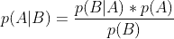
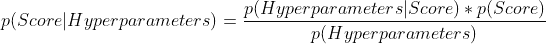
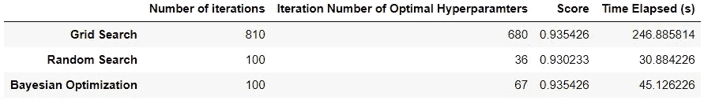

# 网格搜索 VS 随机搜索 VS 贝叶斯优化

> 原文：<https://towardsdatascience.com/grid-search-vs-random-search-vs-bayesian-optimization-2e68f57c3c46>

## 哪种超参数调优方法最好？

照片由[丹尼斯·莱昂](https://unsplash.com/@denisseleon?utm_source=medium&utm_medium=referral)在 [Unsplash](https://unsplash.com?utm_source=medium&utm_medium=referral) 上拍摄

超参数调整是开发稳健预测模型的重要步骤。毕竟，坚持使用默认参数会阻止模型达到最佳性能。

这就引出了一个问题:对于给定的模型，什么方法最适合寻找最优的超参数？

在这里，我们深入研究 3 种流行的超参数调优方法，并确定哪一种更优越。

## 网格搜索

网格搜索是最常见的超参数调整方法，因为它的过程简单明了。这是一个*未知的*搜索方法，这意味着它不会从之前的迭代中学习。

使用这种方法需要在搜索空间中测试每个超参数的唯一组合*，以确定产生最佳性能的组合。*

这种暴力方法的好处显而易见；有什么比尝试所有方法更好的方法来找到最佳解决方案呢？

不幸的是，这种方法扩展性不好；超参数搜索空间大小的增加将导致运行时间和计算的指数增长。

## 随机搜索

随机搜索也是一种独立处理迭代的无信息搜索方法。

然而，它不是在搜索空间中搜索所有超参数集，而是随机评估特定数量的超参数集。这个数字由用户决定。

由于它在超参数调整中执行较少的试验，该方法比网格搜索需要更少的计算和运行时间。

不幸的是，由于随机搜索随机测试超参数集，它冒着错过理想的超参数集和放弃峰值模型性能的风险。

## 贝叶斯优化

与独立处理超参数集的网格搜索和随机搜索不同，贝叶斯优化是一种*通知*的搜索方法，这意味着它从以前的迭代中学习。这种方法中的试验次数由用户决定。

顾名思义，该过程基于贝叶斯定理:

贝叶斯定理

对于这个用例，该定理可以修改如下:

贝叶斯定理(修正)

简单来说，这种方法创建了一个概率模型，在这个模型中，它将超参数映射到它们对应的得分概率。

贝叶斯优化方法可以*收敛*到最优超参数，而不是费力地尝试每个超参数集或随机测试超参数集。因此，无需探索整个样本空间就可以获得最佳超参数。

使用贝叶斯优化方法，用户不必忍受评估每个超参数集所带来的长时间运行。它们也不必包含随机性和错过最优解的风险。

也就是说，贝叶斯优化确实有自己的缺点。因为这是一种有根据的学习方法，所以需要额外的时间来确定下一个超参数，以基于先前迭代的结果进行评估。以减少试验次数为代价，贝叶斯优化每次迭代需要更多的时间。

## 个案研究

我们已经探讨了三种超参数调优方法的细节。为了巩固我们对这些方法的理解，最好用一个例子。

让我们用这三种方法来微调分类模型，并确定哪一种方法产生的结果最好。

在本练习中，我们将使用来自 Sklearn 模块的[负载数字](https://scikit-learn.org/stable/modules/generated/sklearn.datasets.load_digits.html)数据集。

目标是用网格搜索、随机搜索和贝叶斯优化来微调随机森林模型。

每种方法都将基于以下因素进行评估:

*   执行的试验总数
*   产生最佳超参数所需的试验次数
*   模型的分数(本例中为 f-1 分数)
*   运行时间

随机森林分类器对象和搜索空间如下所示:

总共有 810 种独特的超参数组合。

1.  **网格搜索**

首先，让我们使用网格搜索方法获得最佳超参数，并对该过程进行计时。当然，这意味着我们将测试所有 810 个超参数集，并挑选出产生最佳结果的一个。

**2。随机搜索**

接下来，我们将使用随机搜索来确定最佳超参数，并对该过程进行计时。搜索限于 100 次尝试。

**3。贝叶斯优化**

最后，我们使用贝叶斯优化执行超参数调整，并对该过程进行计时。在 Python 中，这可以通过 [Optuna](https://optuna.org/) 模块来完成。

它的语法与 Sklearn 不同，但它执行相同的操作。

为了保持一致性，我们也将在此过程中使用 100 次试验。

现在，我们已经用所有三种方法执行了超参数调优，让我们看看每种方法的结果如何相互比较。

为方便起见，我们将所有 3 个超参数调整程序的结果存储在一个数据框中。

代码输出(由作者创建)

网格搜索记录了最高分(与贝叶斯优化方法结合)。然而，该方法需要进行 810 次试验，并且仅设法在第 680 次迭代时获得最佳超参数。此外，它的运行时间远远超过了随机搜索和贝叶斯优化方法。

随机搜索方法仅需要 100 次尝试，并且仅需要 36 次迭代来找到最佳超参数集。它的执行时间也最少。然而，随机搜索法在 3 种方法中得分最低。

贝叶斯优化也进行了 100 次试验，但仅经过 67 次迭代就能够获得最高分，远远低于网格搜索的 680 次迭代。尽管它执行的试验次数与随机搜索相同，但它的运行时间更长，因为它是一种明智的搜索方法。

## 哪种方法最好？

假设网格搜索、随机搜索和贝叶斯优化在运行时间、迭代次数和性能之间都有各自的权衡，那么真的有可能就哪种方法是最好的达成共识吗？

大概不会。

毕竟，理想的超参数调优方法取决于用例。

问问你自己:

*   你的机器学习任务的约束是什么？
*   您的项目优先考虑最大化性能还是最小化运行时间和/或迭代次数？

回答这些问题将有助于决定最合适的超参数优化方法。

如果计算需求和运行时间不是限制因素，网格搜索是理想的。

如果您愿意牺牲性能来换取更少的迭代和更短的运行时间，那么随机搜索是合适的(理论上，随机搜索可以找到最佳的超参数，但这完全取决于运气)。

如果您希望通过较少的试验获得最佳超参数，但希望每次迭代运行时间更长，那么贝叶斯优化是最佳选择。

## 我的 2 美分

如果你讨厌外交答案，只想听听我的个人意见，我会说我通常倾向于贝叶斯优化。

考虑到用更大的训练数据集和搜索空间来微调模型所需的运行时间，我通常会避开网格搜索。随机搜索需要较少的迭代，是所有 3 种方法中最快的，但其成功程度取决于随机选择的超参数集。在某些情况下，它会选择最优的超参数；在其他情况下，它将完全忽略最优超参数。由于这种不一致性，我不喜欢依赖随机性来完成更大的机器学习任务。

我更喜欢贝叶斯优化方法，因为它能够以较少的迭代次数持续获得最佳超参数。它的单个迭代可能比那些不知情的搜索方法花费更多的时间，但这对我来说很少是一个交易破坏者。

## 结论

照片由 [Unsplash](https://unsplash.com?utm_source=medium&utm_medium=referral) 上的 [Prateek Katyal](https://unsplash.com/@prateekkatyal?utm_source=medium&utm_medium=referral) 拍摄

从该分析中得出的主要结论是，每种超参数调优方法在运行时间、迭代次数和性能之间都有自己独特的权衡。

最终，对你来说最好的方法将取决于你的优先权和约束。对数据和目标的深刻理解将确保您做出正确的决策。

我祝你在数据科学的努力中好运！