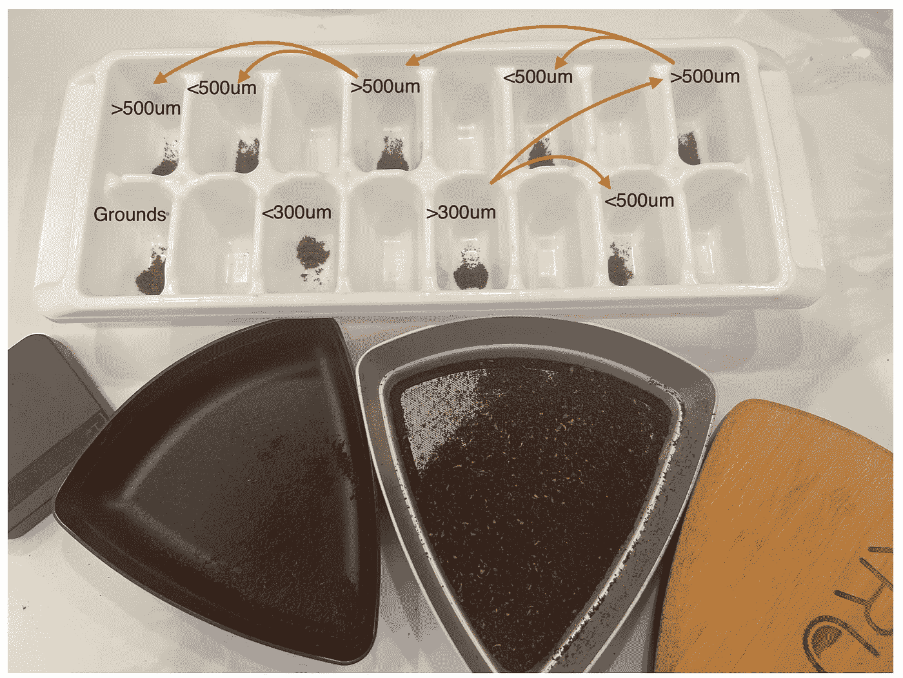
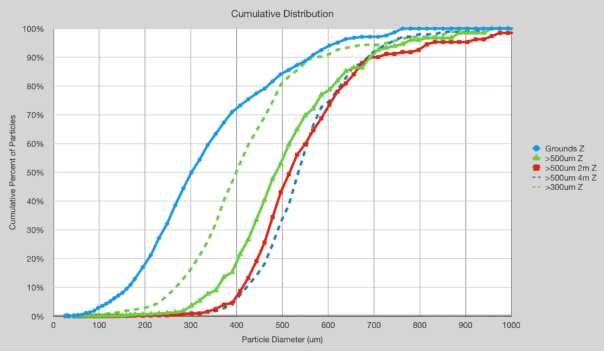
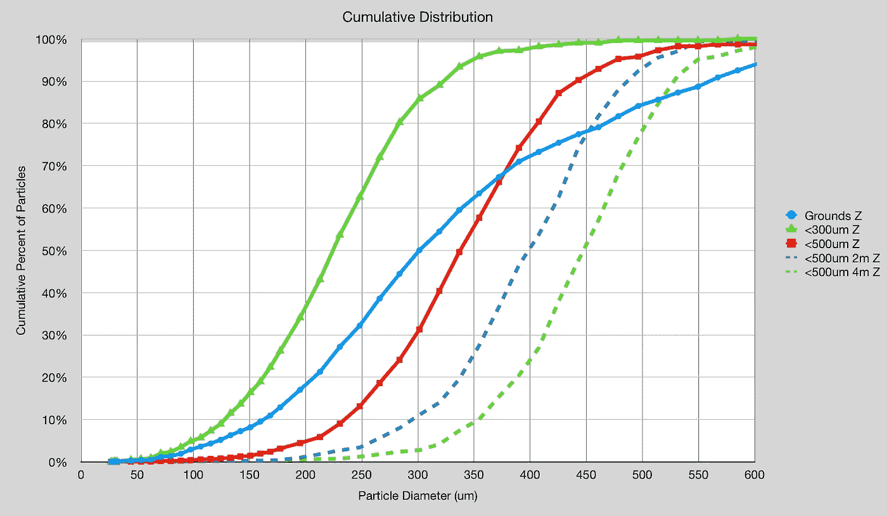
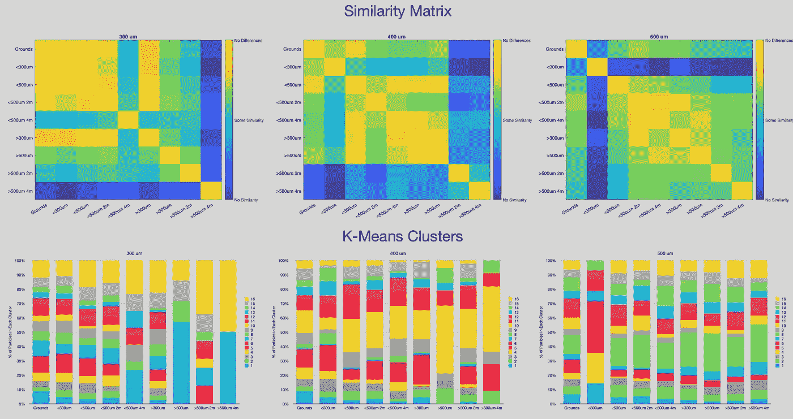
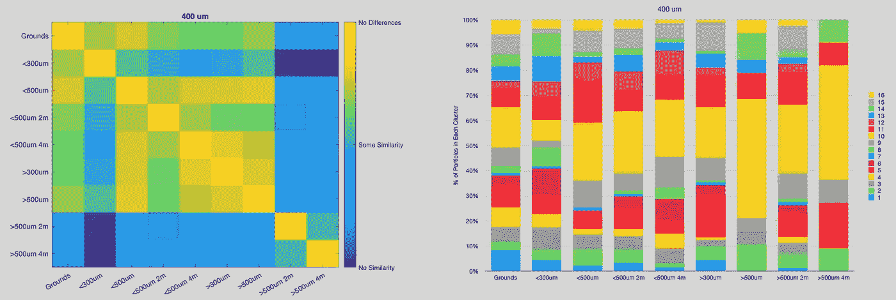
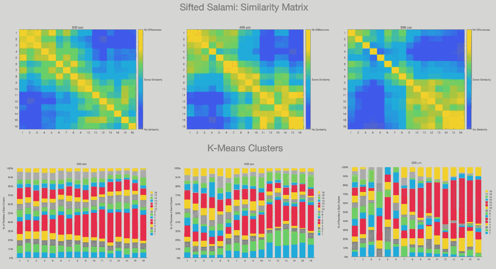
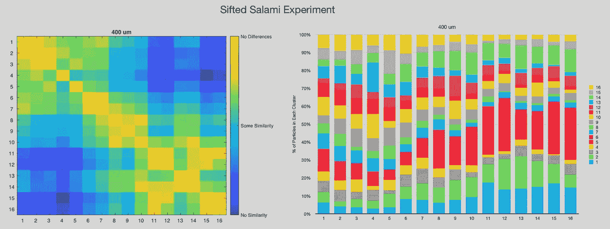

# 用筛子研磨咖啡

> 原文：<https://towardsdatascience.com/grinding-coffee-with-a-sifter-636bb8073fb5>

## 咖啡数据科学

## 深入探究如何筛选研磨咖啡

在我对筛选的许多探索中，我没有想到筛子本身会改变咖啡渣。当咖啡渣来回摩擦时，筛选的动作会改变咖啡颗粒。为了更好地理解这些理论含义，我收集了一些数据。

我的目标有两个:

1.  筛磨咖啡吗？
2.  筛分会从根本上改变颗粒形状吗？

首先，我用 Fellow Shimmy 去除了不到 300um。然后我用一个 500 微米的 Kruve 筛筛掉较粗的颗粒。我这样做了几次，收集了一些样本。我开始筛选，然后 2 分多钟，然后 4 分多钟，因此有 2m 和 4m 的标签。

# 研磨分布

这些分布显示更多的细颗粒从粗颗粒中被去除。

同时，较细的颗粒<500um start much smaller and then start to get coarser after more sifting.

# Particle Similarity

I classified the particles using K-means clustering on top of Linear Binary Patterns (LBP). I applied this method to selected particle bins to better understand how the shapes are changing.

On the top are similarity matrices to show how closely different samples match each others based on the K-means clustering. On the bottom are the K-means clustering of the particles so one can see how they develop differences.

One interesting example is >500 μm 4m 也就是最后一个样品。这些颗粒聚集在较少数量的箱中，因此颗粒形状更加均匀。对于 500 微米的颗粒，簇的数量和分布在样品中保持大致相同。

我们可以把注意力集中在 400 微米的颗粒上，有趣的是观察样品的形状是如何开始变化的。

# 筛过的意大利香肠

我还有其他关于筛选的[数据，这些数据来自我应用意大利香肠技术进行筛选的时候。这意味着我在筛选过程中筛选并采集了多个样本，以更好地了解颗粒。分布确实发生了变化，但我想知道粒子形状是如何受到影响的。所以我应用了同样的技术。](/salami-sifting-coffee-17024b484e34)

随着时间的推移，300 微米颗粒的形状发生了微小的变化，但是对于 400 微米和 500 微米颗粒来说，它们的形状在粗筛阶段发生了明显的变化。

我在这里只关注 400 微米，你可以在相似度矩阵中看到明显的变化。

这项研究强调了筛选咖啡的另一个变量。这也意味着当使用筛分机测量颗粒分布时，筛分机会改变颗粒的形状和尺寸。我不确定在与激光 PSD 比较得出结论时，应该如何考虑这一点。

这项研究也指出了使用筛子作为研磨机的可能性。如果你筛选得足够快，你可能会有一个更单峰的颗粒分布。

如果你愿意，可以在推特、 [YouTube](https://m.youtube.com/channel/UClgcmAtBMTmVVGANjtntXTw?source=post_page---------------------------) 和 [Instagram](https://www.instagram.com/espressofun/) 上关注我，我会在那里发布不同机器上的浓缩咖啡照片和浓缩咖啡相关的视频。你也可以在 [LinkedIn](https://www.linkedin.com/in/dr-robert-mckeon-aloe-01581595) 上找到我。也可以关注我在[中](https://towardsdatascience.com/@rmckeon/follow)和[订阅](https://rmckeon.medium.com/subscribe)。

# [我的进一步阅读](https://rmckeon.medium.com/story-collection-splash-page-e15025710347):

[我的书](https://www.kickstarter.com/projects/espressofun/engineering-better-espresso-data-driven-coffee)

[我的链接](https://rmckeon.medium.com/my-links-5de9eb69c26b?source=your_stories_page----------------------------------------)

[浓缩咖啡系列文章](https://rmckeon.medium.com/a-collection-of-espresso-articles-de8a3abf9917?postPublishedType=repub)

工作和学校故事集