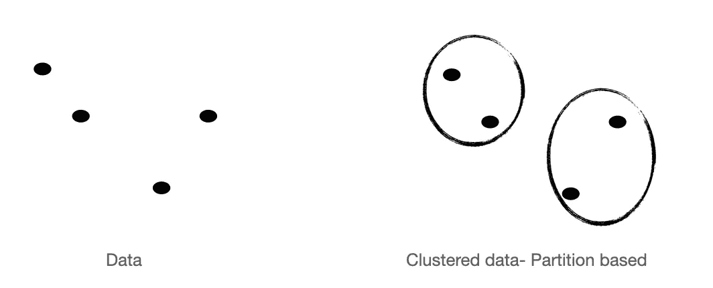
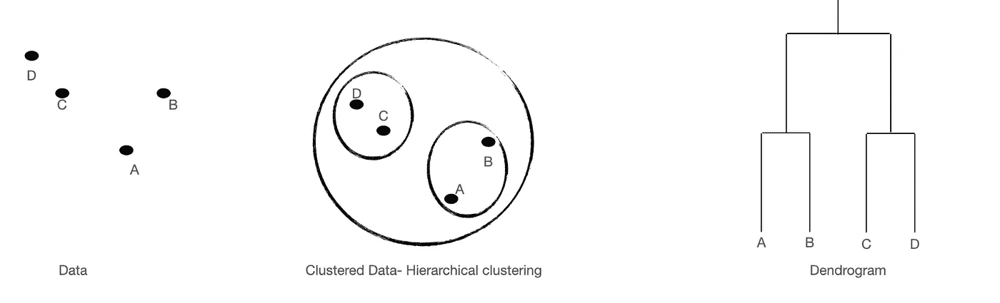
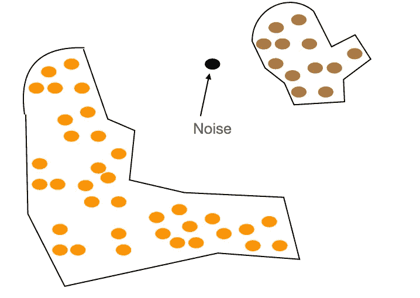

# 数据科学中的数据分组

> 原文：<https://towardsdatascience.com/grouping-data-in-data-science-be7387870c4d>

## 著名聚类算法背后的技术的简单概述

马尔万·艾哈迈德

> “物以类聚，人以群分”

这是一个众所周知的谚语，我们从小就听说过。这表明，相同类型或具有相似特征的个体往往彼此更接近。

在数据科学中，这种自然现象被称为聚类，它用于通过发现几个组来发现数据中的分组，当与其他组中的对象相比时，这些组中的对象与同一组中的对象基本相似。

## 应用程序

聚类具有多种功能，包括生成肉眼看不到的洞察力的能力。例如，一个众所周知的应用是*犯罪热点识别、*，其中可以通过聚类来定位罪犯和/或防止更多犯罪。另一方面，在通过分析具有相似特征的消费者来帮助企业完成诸如*目标营销*等任务的情况下，它可能非常有价值。

它在*数据挖掘、社会网络分析、在线集群引擎、生物数据分析、图像处理*等方面也有广泛的应用。如你所见，几乎在每个领域都有应用，理解这一点是非常有价值的。

## 聚类算法的类别

你可能认为将对象分组很容易。但是你有没有有条不紊地尝试过，以至于连机器都可以做到。

多年前，研究人员已经提出了许多算法来实现这一点，但很少有非常常用的算法，如 K 均值、聚类等。这些知识对于数据科学学习者、从业者或该领域的任何人来说都是非常有价值的。这是因为每种算法都有自己的优缺点，因此在为特定任务选择正确的聚类方法时，有必要彻底掌握它们。

本文的重点是概述聚类算法的主要类别。大多数著名的算法可以分为三类。

*   分割聚类
*   分层聚类
*   基于密度的聚类

## 分割聚类

当我们听到“隔断”这个名字时，我们脑海中浮现的是将一个空间分成几个部分，就像我们家的内墙一样。部分聚类的作用是完全一样的。它通过将更接近的项目分组在一起来创建用户指定的组数。它是如何有条不紊地完成的，

> 选择 k 个不同的聚类中心，并开始吸引最接近该聚类的数据点。

在这些技术中，每个数据点将根据一组标准被分配到第 k 个聚类，genreally 旨在改进相似性函数，以便距离成为一个重要的元素。该过程将迭代地继续，直到迭代稳定，这意味着只有当一个聚类中的样本没有传递到另一个聚类时，该过程才会结束。

作者图片:分区聚类，k=2

这些方法的一个主要特征是它们要求用户定义聚类的数量，这由变量 K 表示。 **K-means、k-medoids 和 k mode** 是划分聚类技术的三个例子。

**优势
-** 简单、有效、**可扩展**且易于部署
-同步计算所有可达到的集群**。
-当集群具有**球形**时，它们工作良好。**

****缺点
-** 需要**在开始时定义簇数**。
-尝试制作**球形**集群，不适合复杂形状
-尝试制作**大小相同的集群。**
——它们是**不确定的**，因此完全不同的排列可以由初始随机选择的聚类中心的微小变化而产生。**

## **分层聚类**

**在层次聚类中，分组是在将它们按层次排列后进行的。有两种主要方法可以做到这一点:**

*   **自下而上的方法是称为**凝聚聚类。****

> **将每个观察值视为独立聚类，然后开始迭代合并最接近的聚类对。**

**通俗地说，这类似于一个社区是如何建立的。每一对最亲密的个体首先聚在一起。然后，每一对与另一对具有最相似特征的组合，这在理论上可以反复发生，直到所有的个体都在一个群体中。**

*   **自上而下的方法被称为**分裂聚类****

> **将所有数据视为一个聚类，然后开始在每一步拆分最不相似的聚类，直到只剩下单个数据点。**

**与上面的例子类似，这可以用一个社区如何发生分裂来解释。首先，所有的个体都在一个群体中。然后，如果两个群体有不同的信仰，社区将分裂成两个群体，形成两个子社区。这在理论上可以反复发生，直到一个社区最终只有一个个体。**

****

**作者图片:层次聚类**

**集群层次的传统可视化是一个树状图*。*树状图是由这些方法产生的基于树的点层次结构。**

**类似于分区聚类，用户经常选择分层聚类中的聚类数目(k)。通过在一定深度切割树状图来创建聚类，产生 k 个更小树状图的分组。**

****优势
-确定性**过程，意味着当您对相同的输入数据执行两次算法时，聚类分配不会改变。
- **不必在开始时定义最终的聚类数**
-更高的树状图可解释性。
- **更深入地洞察**关系，有利于**小型**数据集**

****缺点
-** C **比较贵**。
-对**异常值**非常敏感**

## **基于密度的方法**

**这里分组是根据一个区域中数据点的密度进行的。它可识别点密集且被空白或稀疏区域分隔的位置。基本上，它**

> **将数据紧密包装在一起—高密度区域视为群集**

****

**作者图片:基于密度的聚类**

**与以前的聚类方法不同，这种方法不需要用户提供聚类数。相反，基于距离的参数用于设置可变阈值。此参数决定了聚类中必须包含的接近点的数量。与其他方法不同，基于密度的聚类对异常值具有鲁棒性。这里，没有必要对每个点进行聚类以形成聚类。**

**常用的基于密度的聚类算法的例子包括 **DBSCAN** (带噪声的应用的基于密度的空间聚类)和 **OPTICS** (对点进行排序以识别聚类结构)。**

****优势
-** 更擅长识别**任意形状的**星团。
-抵抗**异常值**。
-不需要在开始时定义簇的数量**

****缺点
-** 难以识别密度 **-难以处理**高维度**空间****

## ****结论****

****上面提到了一些最常用的聚类算法类别。然而，还有更多，如基于模型的、基于网格的、基于遗传的等等。实际上，没有精确的聚类方法可以提前选择，因为潜在的数学方法经常不能产生现实的可解释的结果。****

****然而，正如文献中所指出的，在许多情况下都有更好的技术，如果挖掘得足够深入，可以发现许多不同的 od 算法变体。一般来说，划分算法被认为更适合大型数据集，因为它们是可扩展的，而分层方法被认为更适合小型数据集，因为它们更具适应性。另一方面，当存在噪声和异常值时，基于密度的聚类更健壮。****