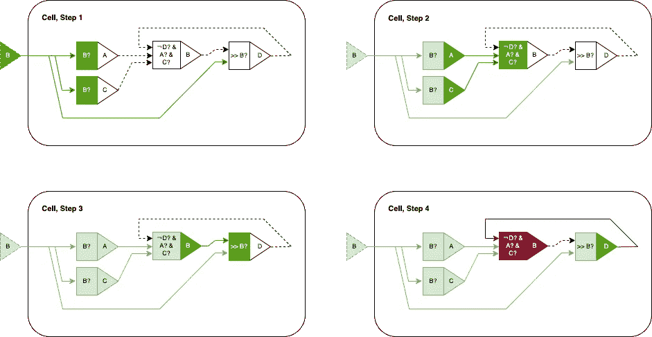
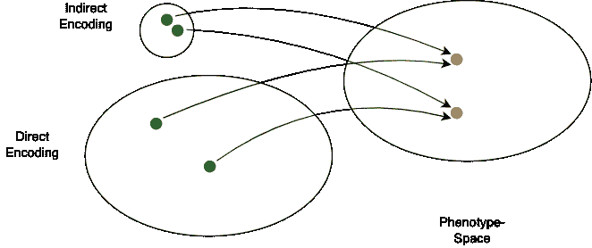
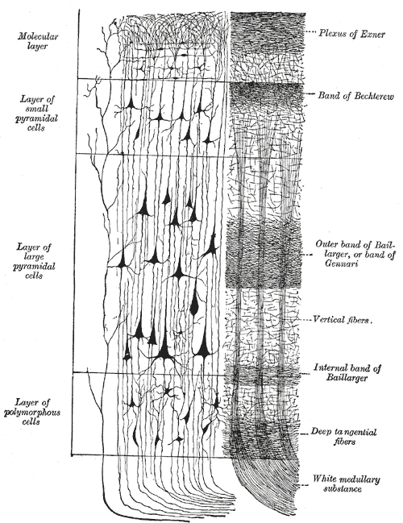
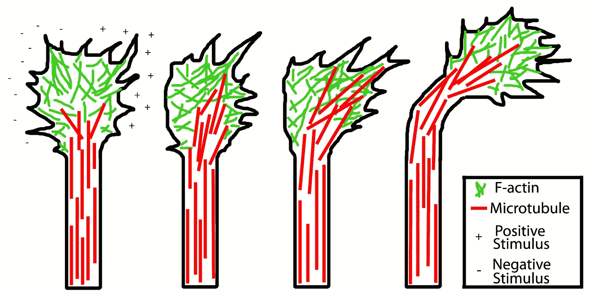
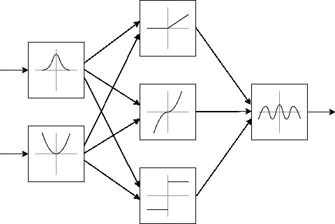

# 成长中的大脑:人工胚胎发生

> 原文：<https://towardsdatascience.com/growing-brains-artificial-embryogeny-b804179eeab9>

## 从遗传密码创造复杂的神经结构

作者提供的图片

通往人工通用智能的道路仍然不是很清楚。今天的主流方法是手工设计网络，并通过 backprop 对其进行训练，这种方法适用于非常特殊的任务。然而，它做得不太好的是充当一种更普遍的智能的培养皿。毕竟，人工设计大脑最终受限于我们对大脑结构的理解。所以我们作为设计师是瓶颈。

在过去的文章中，我研究了通过自动适应网络拓扑来消除这一瓶颈的不同学习技术。这方面的一个例子是[深入到级联相关学习架构](/cascade-correlation-a-forgotten-learning-architecture-a2354a0bec92)，它迭代地添加和训练新的神经元，作为其学习算法的一部分。

在我的上一篇文章中，我探索了另一种称为[神经进化](/neuroevolution-cb31d823f27d)的技术，这是一种基于从自然界复制的进化原则的随机优化方法。在创造人工智能(AGI)的背景下，这种方法尤其有趣，因为同样的原理创造了我们，即包括我们的大脑。换句话说，到目前为止，这是已知的唯一一个有潜力创造 AGI 的算法。然而，它的工作原理非常简单:

1.  用某种基因编码对你的网络进行编码
2.  创建一组随机化的基因组(即随机化的网络)
3.  表达基因(即重新创建实际网络和/或其参数)并在目标问题上测试它
4.  选择一些表现最好的人
5.  将它们混合在一起，改变它们的基因(在一定程度上是随机的)，创建一组新的基因组，并从第 3 步开始重复整个过程

一般来说，我们希望进化过程是**稳定的**和**充分开发的**(即缓慢和局部的)不会在过程中再次随机丢失好的解决方案，而且**探索性的**足够在几代内(尽可能快地)找到好的解决方案。

这在一定程度上受到“最适者”选择方式的影响，受到用于向基因组引入随机变化的算法的影响，更重要的是，受到遗传编码的影响。

**从神经进化到人工胚胎发生**

从我们在神经进化文章中看到的，一个令人困惑的方面突出了出来:正如 Stanley 等人在[1]中提到的，如果是间接的，遗传编码可以以不可预测的方式偏向进化。

**间接**这里指的是不直接指定哪些神经元是连接的，连接的强度如何等等。而是仅给出关于如何根据给定规则从给定种子生长或构建网络的简洁指令。事实上，这与人类大脑的发展非常相似:从单个细胞到复杂的网络结构。

**偏差**意味着*网络如何发展*可能会增加或减少在进化过程中偶然发现一个优化良好(更智能)的网络的机会。

这足以让研究人员探索人工胚胎发生(或人工发育)的空间，所以让我们利用这篇文章来了解“大脑”如何可能比你想象的更真实地生长。

*NB:要看完这篇文章，你要明白什么是* [*人工神经网络*](https://en.wikipedia.org/wiki/Artificial_neural_network) *。我还会推荐略读关于* [*神经进化*](/neuroevolution-cb31d823f27d) *的文章，在更深入的潜水之前了解一下基础。*

## 为什么要用间接编码呢？

如前所述，关于间接遗传编码效应的研究相对较少。除了 Stanley 2003 年对人工胚胎发生领域的分类[2]，我真的找不到关于*间接基因编码的不同方面如何影响或偏向进化过程的全面研究。如果在这个领域没有结论性的研究，那么这意味着我们还没有完全理解这些方面，我们没有一个可以测试的理论。这就引出了一个问题:为什么要为此费心呢？*

*我已经提到，进化需要在探索和利用之间取得平衡，才能成为一种可行的优化方法。就我所见，间接编码可以通过以下方式对此产生有益的影响:*

1.  ***搜索空间减少**:可以减少能够或者需要测试的可能网络架构的数量。*
2.  ***模块性**:它可以发现有用的模块网络结构并复制它们，或者利用对称或分形(自相似)结构来保存好的解并进一步减少搜索空间。*
3.  ***遗传算子有效性**:它可以影响什么类型的重组&变异操作是可能的，从而间接影响探索。*

## *搜索空间缩减*

*让我们简单回顾一下神经进化的文章，在那里我们讨论了遗传编码是实际神经网络(表现型)的不同表示(基因型)。在间接遗传编码的情况下，所有可能基因型的集合(基因型空间)是所有可能表型空间的压缩。用简单的英语来说:神经网络的可能构造方案应该比理论上可能的神经网络要少。*

**

*间接和直接遗传编码映射到表型空间。间接编码的搜索空间通常比直接编码小得多。作者提供的图片*

*因此，如果我们将进化过程视为对最优网络的随机搜索，那么搜索较小的基因型空间比搜索较大的基因型空间更快。*

*然而，如果搜索空间缩小，这意味着我们忽略了一些遗传上不可能的解决方案。理论上可能是最优的解决方案。在这里，我想我们已经非常接近于选择编码的问题，这样我们就不会意外地丢失好的网络配置。*

## *模块性*

*只要看一眼大自然，你就会发现它的解决方案非常有规律。大多数具有某种复杂性的生物都有某种对称的方面，或重复的结构。看看大脑，我们的新皮层(解决一般问题的地方)的基本组成部分之一是皮质柱。一个在大脑中重复几百万次的模块[3]。*

**

*新皮质层的示意图。来源:[维基百科，亨利·范戴克·卡特](https://upload.wikimedia.org/wikipedia/commons/8/89/Gray754.png)，公共领域，通过维基共享*

*有趣的是，这种解决方案的驱动力可能在很大程度上塑造了我们的审美观。更对称的人脸也被认为更有吸引力[4]。*

*所有这些至少暗示了这样一个事实，即通过进化和排列更小的部分来构建复杂性比一次性进化整个系统更有效。这并不奇怪——毕竟，由于进化本质上是随机的，我们是在处理统计数据。进化出一个复杂的、不规则的、不能慢慢建立起来的系统是极不可能发生的。*

## *遗传算子有效性*

*本质上，遗传算子只是搅动进化之水的一根棍子。搅拌是如何进行的，它需要什么样的混合，这些参数将影响我们对基因型空间的探索和利用。*

*为了找到平衡，这些运营商需要在边界内行动。在这方面，完全随机的变化实际上弊大于利。它们的定义以及基因编码会对此产生影响。具体来说，我们希望找到一种编码，其中基因型的微小变化也仅导致表型的微小变化。这样，就更容易控制变化的程度，从而控制探索新解决方案的速度。*

*对于小型网络的直接编码，这是免费的。就其本质而言，它们会直接将基因的微小变化表现为网络中的微小变化。
然而，随着我们增加复杂性，这些微小的变化会导致回报递减，我们将不得不创造越来越多的非结构化突变来真正产生探索性效果，这很可能导致网络中断或无效。*

*在间接编码的网络中，这个特性更难实现。但如果做得好，它可以启用或禁用遗传“模块”的全部功能，并让重组更有可能结合父母的有用网络结构。这保留了有用的特征并加速了进化。*

*一个真正伟大的编码将使我们能够让这种属性适应它所创造的复杂程度:微小的基因变化会导致简单网络中的微小变化，但它们在理想情况下也会导致更复杂网络中的安全和模块化变化。*

## *人工胚胎发生*

*在标题和引言中，我提到了“人工胚胎发生”作为首要主题。Stanley 在[2]的领域分类学中创造的一个术语。那到底是什么，它与进化和间接遗传编码有什么关系？*

*简而言之——间接遗传编码意味着我们必须对它做些什么，以从中创建实际的神经网络。这就是我说的‘长脑子’的意思。基因编码只是一个种子或建筑计划，但实际的建设仍然需要发生。在人类中，这种早期发育过程被称为胚胎发生。因为我们在硅中做着类似目的的事情，我们称之为人工胚胎发生。欢迎来到科学世界:)*

*婴儿通常不会仅仅从一条 DNA 链中成长，他们还需要基础设施(受精卵细胞)来发育。我们面临类似的困境。仅仅设计一个伟大的基因编码来以有利的方式偏向进化是不够的。我们还需要创造执行它的机制。*

**附注:最迷人的是，在自然界中，RNA 不仅是一种建筑计划，也可以是一种功能分子。核糖体是能够将 RNA 翻译成蛋白质的小分子，实际上是由一种特殊的 RNA 序列组成的。有一整套理论认为，正是因为这个原因，RNA 可能是所有生命的来源，也是第一个自我复制的分子。**

**

*核糖体促进 RNA 翻译成蛋白质。来源:[维基百科，本在 en.wikipedia](https://upload.wikimedia.org/wikipedia/commons/9/94/Protein_translation.gif) ， [CC BY 3.0](https://creativecommons.org/licenses/by/3.0) ，通过维基共享*

## *方法概述*

*因此，让我们来看看科学家们设计的在计算机上培育大脑的方法*。我将把这个简短的概述部分地建立在前面提到的分类法[2]的基础上，但是自从它在 2003 年被创建以来，更多的想法已经被开发出来。根据该论文，Stanley 等人将截至 2003 年的研究大致分为两个方向:**

****自上而下:**从抽象理论模型(例如[形式语法](https://en.wikipedia.org/wiki/Formal_grammar))开始的想法，并使用它来生成可以被解释为神经网络的结构。**

****自下而上:**模拟细胞化学和细胞相互作用的想法，以实现更接近真实生物系统中正在发生的神经细胞生长和网络结构。**

**这两种方法都需要一段时间的发展，即它们一步一步地迭代和“解开”遗传信息，最终创建网络。然而，这种更繁琐的方法显然是不必要的——翻译也可以一步完成:**

****与时间无关:**自 2003 年以来，Stanley 等人开发了一种与时间无关的方法——“组合模式产生网络”[5]——该方法使用来自自然界的想法，但一次性得到结果。**

## **自上而下**

**自然界中许多看似复杂的模式可以用惊人简单的规则来复制。例如，在 1968 年，Lindemayer 设计了一个现在被称为[L-系统](https://en.wikipedia.org/wiki/L-system)的形式语法，使用一些简单的规则来近似树木和杂草的生长。[6]**

****

**杂草从一个简单的基于语法的规则中生长出来。来源:[维基百科，樱木博](https://upload.wikimedia.org/wikipedia/commons/4/44/Fractal-plant.svg)， [CC BY-SA 3.0](http://creativecommons.org/licenses/by-sa/3.0/) ，通过维基共享**

**像这样的语法基本上是符号替换的规则。**

**以一个简单的规则集为例，比如:**

****S**→**AB**
**A**→A**S**
→B→B**

**从 **S** 开始，我们将用 **AB** 替换它，然后用 **S** b 替换它，再用 **AB** b、aa **S** bb 替换它，以此类推，慢慢地增加符号序列。**

**这种方法令人惊讶的地方在于，上面的杂草仅仅是从这个规则集中生成的:**

****X**→**F**+[**X**]-**X**]-**F**[-**FX**]+**X**
**F**→**FF****

**其中 **F** 表示*在当前方向*上向前生长一点，“+”和“-”表示*将生长方向倾斜+/- 25* 。括号代表新的分支，X 在实际生成杂草时被忽略。**

**规则也可以参数化，例如:**

****S(1)**→a
→S(n)→a**S(n-1)****

**当从固定的 **S(n)** 开始时，其将在 **n** 步后终止，产生 aaa… ( **n** 乘以 a)的模式。例如 **S(2)** 会产生‘aa’。**

**以此为基础，我们所需要的就是找到从一些符号序列到神经网络的映射。Kitano 于 1990 年[7]通过迭代扩展 2 乘 2 邻接矩阵来实现这一点，该矩阵表示网络的连接。**

**如果使用这种编码，网络的增长是通过迭代地生成符号序列，然后将结果转换成某种可用的网络拓扑和权重矩阵格式来实现的。当然，这种可能性还有很大的空间。这意味着在我们以这种方式得到一个好的变体之前要进行大量的试验和错误。我在这里的拙见是，首先要瞄准可以(原则上)生成与我们迄今所知的大脑相似的结构的语法和规则集。**

**顺便说一下，形式语法并不是这里唯一可以想到的自顶向下的解决方案。还会有其他生成系统从简单的初始指令中产生数据模式——例如参见[伪随机数发生器](https://en.wikipedia.org/wiki/Pseudorandom_number_generator),如果给定相同的种子，它们可以创建完全相同的看似随机的数字序列。
虽然不可否认，伪随机数发生器可能是这种方法的一个非常糟糕的选择，因为它们特别打破了“基因型空间的小变化导致表型空间的小变化”的想法。如果只是稍微改变一下种子，就会得到一个非常不同的数字序列。**

## **自下而上**

**我们体内的细胞依赖于复杂的内部机制。然而，对于外部排列，导航依赖于化学信号和梯度。**

**对于轴突——神经元的“长”部分，将脉冲传递给下一个神经元——化学梯度可以作为一个灯塔，引导生长。它们通过拉向或推开特殊的信号化学物质，找到从眼睛到大脑皮层的路径[8]。**

****

**轴突的生长锥远离负刺激并朝向正刺激。来源:[维基百科，Chris1387](https://upload.wikimedia.org/wikipedia/commons/1/19/AxonTurning.jpg) ， [CC BY-SA 3.0](https://creativecommons.org/licenses/by-sa/3.0) ，通过维基共享**

**这些原则已经在 Dellaert 等人的“基因调控网络”中以不同的详细程度实施[9]。细胞排列在一个二维网格上，可以根据这种拓扑结构生长和相互作用。**

**正如 Stanley 在[4]中所描述的，信号和基于信号的动作的机制可以例如编码在逻辑语句中。一个细胞可以通过特定的通道(类似于受体)从其他细胞或环境中接收数值。然后这触发了细胞的内部逻辑产生暂时的效果。**

****

**化学信号:细胞获得输入 B，产生 A，产生 C，这使得更多的 B 产生，这使得 D 产生，这使得 B 不能产生。**

**所以，总的想法很简单:在可行的水平上复制自然。通过这种对细胞生长、轴突导航和连接的自下而上的模拟，我们可以通过类似于生物学的方法来创建神经网络架构。**

## **与时间无关**

**当分类论文在 2003 年发表[4]时，其中讨论的文章有一个共同点:它们都是随时间增长的结构，即迭代地，直到它们达到可用的定义的最终状态。**

**然而，在 2007 年斯坦利(是的，还是那个家伙)引入了一个新的想法，“合成模式产生网络”(CPPN) [9]。这一概念基于神经网络的功能组合方式，但强调各种激活函数(如正弦、高斯和 abs/norm 以及 ReLU 等标准函数)，当这些函数组合在一起时，可以产生复杂的模式。**

****

**具有各种激活功能的合成模式产生网络的简化示例架构。作者图解。**

**这个想法源于对自然胚胎发生的观察，即细胞根据化学梯度排列自己，这些细胞通常以对称或其他模式产生，使我们的身体能够以更少的需要编码的额外数据实现更多的复杂性。这样来看:如果你的基因“知道”如何将一只手的手指放在一只手臂上，它们可以在另一只手臂上重复使用相同的基本模式(镜像)。CPPN 允许将这些图案直接编码成近似任意形状。**

**为了将其用于神经架构，神经元被放置在二维网格中，它们之间的连接(和权重)通过将它们的坐标传递给 CPPN 来直接计算。[10]**

**在此基础上，更近的方法已经利用反向传播来训练 CPPN——以完全封闭循环。[11]**

## **用途和限制**

**一般来说，在神经进化方法中，能够真正利用对称性和网络特征副本的解决方案，具有生成接近大脑结构的架构的巨大潜力。毕竟，我们知道，人类新大脑皮层的能力也源于一个简单的构建模块，一个皮层柱(或其变体)，它被复制了很多很多次。[3]因此，很可能有一天，在选定的难题上训练一个不断进化的网络，会使它显示出一般智力的某些方面。毕竟，从生物学角度来说，这或多或少是我们人类如何走到现在的。**

**然而，正如上述论文中的一些科学家已经发现的那样，紧跟自然是一件棘手的事情。事情往往会变得非常复杂，对进化网络的工作原理进行推理变得非常困难——如果遗传编码不能直接映射到后来的网络架构，那就更难了。**

**尽管如此，人工胚胎发生仍然是一个活跃的研究领域。时间会证明它是否能够提供必要的工具来破解 AGI——这是我个人密切关注这里的事态发展的一个原因。**

**与此相关的所有完成的源代码文档、笔记本和代码也可以在 [Github](https://github.com/ephe-meral/biomimicry) 上获得。请留下反馈并提出改进建议。**

**如果你想支持这篇和类似精彩文章的创作，你可以[注册一个中级会员](https://medium.com/@johannaappel/membership)和/或[关注我的账户](https://medium.com/subscribe/@johannaappel)。**

## **参考**

**[1] K. O. Stanley，R. Miikkulainen，[“通过扩充拓扑进化神经网络”](http://nn.cs.utexas.edu/downloads/papers/stanley.ec02.pdf) (2002)，进化计算 10(2):99–127**

**[2] K. O. Stanley，R. Miikkulainen，[“人工胚胎发生的分类学”](http://nn.cs.utexas.edu/downloads/papers/stanley.alife03.pdf) (2003)，《人工生命》9(2):93–130**

**[3] J .霍金斯，《一千个大脑:智力新论》(2021)，基础书籍**

**[4] K. Grammer，R. Thornhill，“人类(智人)的面部吸引力和性选择:对称性和平均性的作用”(1994)，比较心理学杂志 108(3):233–42。**

**[5] K. O. Stanley，[“合成模式产生网络:发展的新抽象”](http://citeseerx.ist.psu.edu/viewdoc/download?doi=10.1.1.643.8179&rep=rep1&type=pdf) (2007)，遗传编程和可进化机器 8(2):131–162**

**[6] A. Lindenmayer，“发育中细胞相互作用的数学模型 II。具有双侧输入的简单和分支细丝”(1968)，理论生物学杂志 18(3):300–315**

**[7] H. Kitano，“使用带有图形生成系统的遗传算法设计神经网络”(1990)，复杂系统 4:461–476**

**[8] C. Holt，[“连接大脑:轴突如何导航”](https://royalsociety.org/science-events-and-lectures/2017/03/ferrier-lecture/) 2017，皇家学会费里埃奖讲座 2017**

**[9] F. Dellaert，R. D. Beer，[“使用发展模型在自主主体中共同进化身体和大脑”](https://citeseerx.ist.psu.edu/viewdoc/download?doi=10.1.1.41.3676&rep=rep1&type=pdf) (1994 年)，(技术俄亥俄州克利夫兰市:凯斯西储大学计算机工程与科学系**

**[10] K. O. Stanley，D. B. D'Ambrosio，j .高西，[“一种用于进化大规模神经网络的基于超立方体的编码”](https://stars.library.ucf.edu/cgi/viewcontent.cgi?article=3177&context=facultybib2000) (2009)，《人工生命》15(2):185–212**

**[11] C. Fernando，D. Chrisantha 等人，[“进化卷积:可区分模式产生网络”](https://dl.acm.org/doi/pdf/10.1145/2908812.2908890) (2016)，2016 年遗传与进化计算会议论文集**