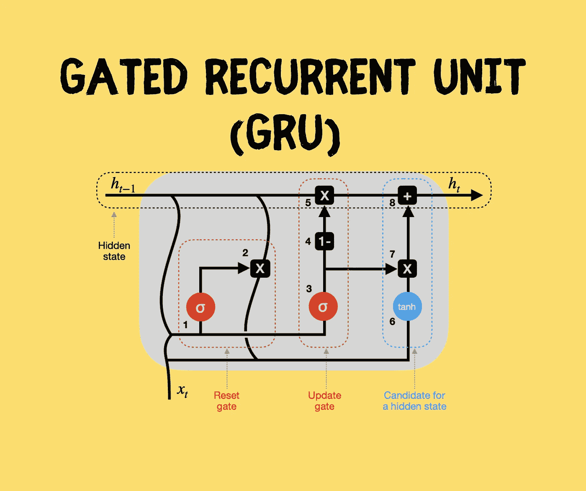
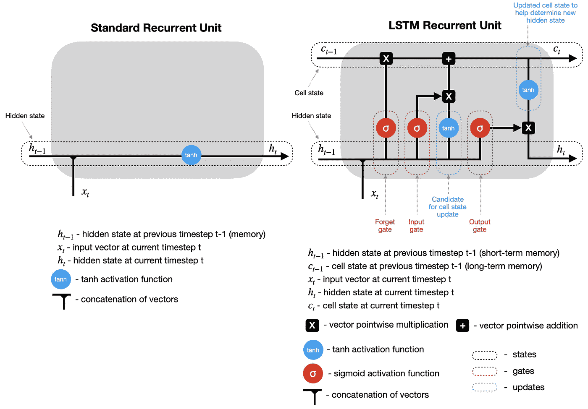
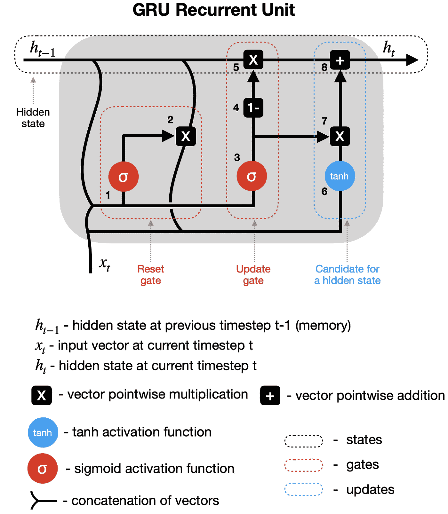
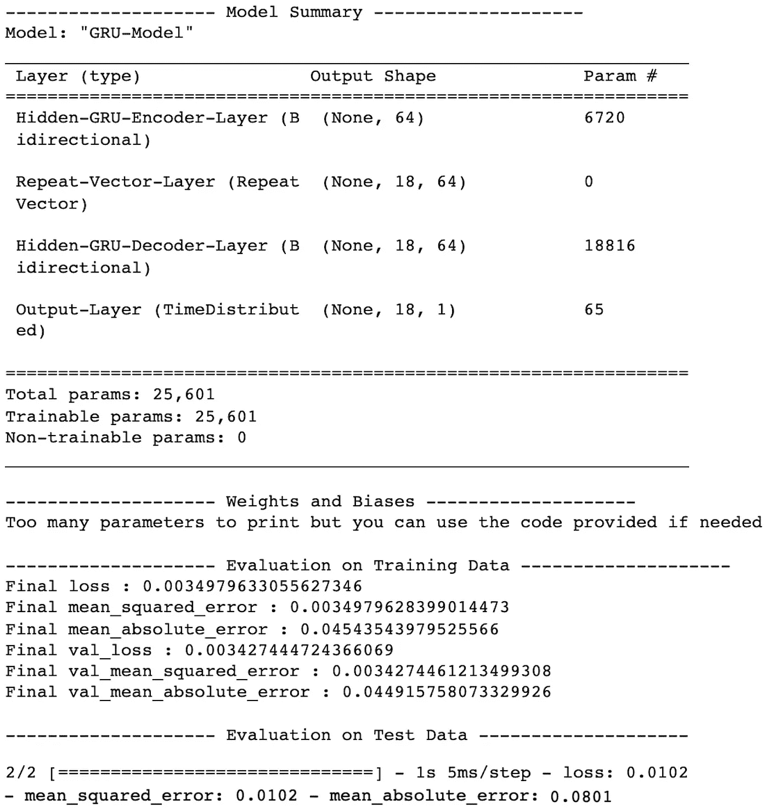
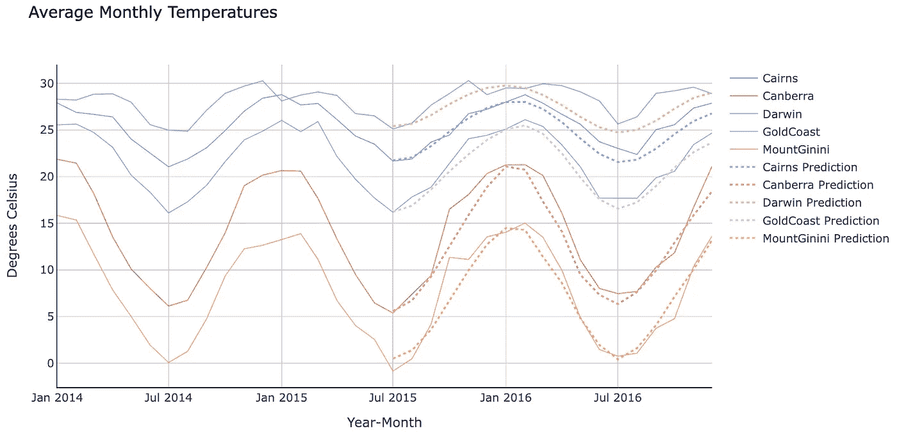

# GRU 递归神经网络——预测 Python 中序列的一种智能方法

> 原文：<https://towardsdatascience.com/gru-recurrent-neural-networks-a-smart-way-to-predict-sequences-in-python-80864e4fe9f6>

## 神经网络

## 门控循环单元的直观解释，包括用于现实生活数据预测的端到端 Python 示例



门控循环单元(GRU)。图片由[作者](https://solclover.com/)提供。

# 介绍

**门控递归单元(GRU)** 和 [**长短期记忆(LSTM)**](/lstm-recurrent-neural-networks-how-to-teach-a-network-to-remember-the-past-55e54c2ff22e) 已经被引入来处理标准[递归神经网络(RNNs)](/rnn-recurrent-neural-networks-how-to-successfully-model-sequential-data-in-python-5a0b9e494f92) 中消失/爆炸梯度的问题。

在本文中，我将向您概述 **GRU** 架构，并为您提供一个详细的 Python 示例，您可以使用它来构建自己的 GRU 模型。

# 内容

*   GRU 在机器学习领域的地位
*   GRU 是如何建造的，它与标准的 RNN 和 LSTM 有什么不同？
*   用 Keras 和 Tensorflow 库构建 GRU 神经网络的完整 Python 示例

# GRU 在机器学习领域的地位

下面的图表是我对最常见的机器学习算法进行分类的尝试。

虽然我们经常以监督的方式使用带有标签的训练数据的神经网络，但我觉得它们独特的机器学习方法值得单独归类。

因此，我的图表显示了从机器学习宇宙的核心分支出来的神经网络。递归神经网络占据 NNs 的一个子分支，并且包含诸如标准 RNNs、LSTMs 和 GRUs 的算法。

下图是**交互式的，**所以请点击不同的类别来**放大并展示更多的**👇。

机器学习算法分类。由[作者](https://solclover.com/)创建的互动图表。

***如果你喜欢数据科学和机器学习*** *，请* [*订阅*](https://solclover.com/subscribe) *获取我的新文章的电子邮件。*

# GRU 是如何建造的，它与标准的 RNN 和 LSTM 有什么不同？

让我们提醒自己典型的 RNN 结构，它包含输入层、隐藏层和输出层。请注意，您可以拥有任意数量的节点，下面的 2–3–2 设计仅用于说明。


标准递归神经网络结构。图片由[作者](https://solclover.com/)提供。

与[前馈神经网络](/feed-forward-neural-networks-how-to-successfully-build-them-in-python-74503409d99a)不同，RNNs 在其隐藏层包含**递归单元**，这允许算法处理**序列数据**。这是通过循环传递先前**时间步长**的隐藏状态并将它们与当前时间步长的输入相结合来实现的。

> 时间步长—通过递归单元对输入进行的单一处理。时间步长的数量等于序列的长度。

## 标准 RNN 和 LSTM 内部的循环单元建筑

我们知道，RNN 利用**循环单元**从序列数据中学习，这对于所有三种类型都是正确的——标准 RNN、LSTM 和 GRU

然而，在循环单元内部发生的事情在它们之间是非常不同的。

例如，标准 RNN 使用隐藏状态来记忆信息。同时，LSTM 和 GRU 引入了盖茨来控制在更新隐藏状态之前记住什么和忘记什么。除此之外，LSTM 还有一种细胞状态，它可以作为长期记忆。

以下是标准 RNN 和 LSTM 的简化循环单位图(未显示权重和偏差)。看看他们是如何相互比较的。



标准循环单位与 LSTM 循环单位。图片由[作者](https://solclover.com/)提供。

注意，在这两种情况下，在时间步长 t 计算隐藏状态(以及 LSTM 的单元状态)之后，它们被**传递回递归单元**并与时间步长 t+1 的输入组合，以计算时间步长 t+1 的新隐藏状态(以及单元状态)。对 t+2、t+3、…、t+n 重复该过程，直到达到预定数量(n)的时间步长。

## GRU 是如何工作的？

GRU 与 LSTM 相似，但它的大门更少。此外，它只依赖于一个隐藏状态在循环单元之间进行内存转移，因此没有单独的单元状态。让我们详细分析这个简化的 GRU 图(未显示权重和偏差)。



GRU 循环股。图片由[作者](https://solclover.com/)提供。

**1–2 复位门** —先前的隐藏状态(h_t-1)和当前输入(x_t)被组合(乘以各自的权重并加上偏置)并通过复位门。由于 sigmoid 函数的范围在 0 和 1 之间，第一步设置哪些值应该被丢弃(0)、记住(1)或部分保留(0 和 1 之间)。第二步重置先前的隐藏状态，将其与第一步的输出相乘。

**3–4–5 更新门** —第三步可能看起来类似于第一步，但请记住，用于缩放这些向量的权重和偏差是不同的，从而提供不同的 sigmoid 输出。因此，在通过 sigmoid 函数传递一个组合向量后，我们从一个包含全 1 的向量中减去它(步骤四)，然后乘以先前的隐藏状态(步骤五)。这是用新信息更新隐藏状态的一部分。

**6–7–8 隐藏状态候选** —在第二步中重置之前的隐藏状态后，输出与新输入(x_t)组合，将它们乘以各自的权重，并在通过双曲正切激活函数之前添加偏差(第六步)。然后，隐藏状态候选被乘以更新门的结果(步骤七)，并被加到先前修改的 h_t-1，以形成新的隐藏状态 h_t

接下来，该过程重复时间步长 t+1，等等。，直到递归单元处理整个序列。

[](https://solclover.com/membership)[](https://www.linkedin.com/in/saulius-dobilas/)

# 用 Keras 和 Tensorflow 库构建 GRU 神经网络的 Python 示例

现在，我们将使用 GRU 创建一个**多对多**预测模型，这意味着使用一个值序列来预测下面的序列。注意，GRU 也可以用于一对一(不推荐，因为它不是序列数据)、多对一和一对多设置。

## 数据准备

首先，我们需要获得以下数据和库:

*   [澳大利亚天气数据来自 Kaggle](https://www.kaggle.com/jsphyg/weather-dataset-rattle-package) (许可: [Creative Commons](http://www.bom.gov.au/other/copyright.shtml?ref=ftr) ，数据原始来源:[澳大利亚联邦气象局](http://www.bom.gov.au/climate/data/))。
*   用于数据操作的[熊猫](https://pandas.pydata.org/docs/)和 [Numpy](https://numpy.org/)
*   [Plotly](https://plotly.com/python/) 用于数据可视化
*   [用于 GRU 神经网络的 Tensorflow/Keras](https://www.tensorflow.org/api_docs/python/tf)
*   [Scikit-学习库](https://scikit-learn.org/stable/index.html)用于数据缩放( [MinMaxScaler](https://scikit-learn.org/stable/modules/generated/sklearn.preprocessing.MinMaxScaler.html) )

让我们导入所有库:

上面的代码打印了我在这个例子中使用的包版本:

```
Tensorflow/Keras: 2.7.0
pandas: 1.3.4
numpy: 1.21.4
sklearn: 1.0.1
plotly: 5.4.0
```

接下来，下载并摄取澳大利亚的天气数据(来源: [Kaggle](https://www.kaggle.com/jsphyg/weather-dataset-rattle-package) )。我们只接收列的子集，因为我们的模型不需要整个数据集。

此外，我们执行一些简单的数据操作，并得出几个新的变量:年月和中值温度。


一小段 [Kaggle 的澳大利亚天气数据](https://www.kaggle.com/jsphyg/weather-dataset-rattle-package)做了一些修改。图片由[作者](https://solclover.com/)提供。

目前，我们对每个地点和日期都有一个中值温度记录。然而，每天的温度波动很大，使得预测更加困难。因此，让我们计算月平均值，并将数据转置为以地点为行，以年月为列。


按地点和月份划分的月平均温度。图片由[作者](https://solclover.com/)提供。

由于我们使用的是现实生活中的数据，我们注意到三个月(2011 年 4 月、2012 年 12 月和 2013 年 2 月)完全从数据框架中消失了。因此，我们通过取前一个月和后一个月的平均值来估算缺失月份的值。

最后，我们可以在图表上绘制数据。


月平均气温。图片作者[作者](https://solclover.com/)。

该图最初显示了所有地点，但我选择了其中的五个(凯恩斯、堪培拉、达尔文、黄金海岸和吉尼火山)显示在上图中。

请注意不同地点的平均温度以及温度变化是如何不同的。我们可以训练一个特定位置的模型来获得更高的精度，也可以训练一个通用模型来预测每个区域的温度。

在本例中，我将创建一个通用模型**，在所有位置**进行训练。*注意，您可以在我的* [*LSTM 文章*](/lstm-recurrent-neural-networks-how-to-teach-a-network-to-remember-the-past-55e54c2ff22e) *中找到具体位置的型号代码。*

## 训练和评估 GRU 模型

在我们开始之前，这里有一些需要强调的事情。

*   我们将使用 18 个月的序列来预测未来 18 个月的平均气温。您可以根据自己的喜好进行调整，但要注意，对于长度超过 23 个月的序列，将没有足够的数据。
*   我们将把数据分成两个独立的数据帧，一个用于训练，另一个用于验证(**超时**验证)。
*   由于我们正在创建一个**多对多**预测模型，我们需要使用一个稍微复杂一点的**编码器-解码器**配置。编码器和解码器都是隐藏的 GRU 层，信息通过一个**重复向量**层从一个传递到另一个。
*   当我们想要有不同长度的序列时，例如，一个 18 个月的序列来预测接下来的 12 个月，一个**重复向量**是必要的。它确保我们为解码器层提供正确的形状。然而，如果您的输入和输出序列的长度与我的示例中的长度相同，那么您也可以选择在编码器层中设置 *return_sequences=True* 并移除重复向量。
*   注意，我们给 GRU 层添加了一个双向**包装器。它允许我们在两个方向上训练模型，这有时会产生更好的结果。但是，它的用途是**可选的*。*****
*   此外，我们需要在输出层使用一个**时间分布**包装器来单独预测每个时间步长的输出。
*   最后，我在这个例子中使用了 **MinMaxScaling** ，因为它产生了比未缩放版本更好的结果。你可以在我的 GitHub 库*(文章末尾有链接)*的 Jupyter 笔记本中找到缩放和未缩放的设置。

首先，让我们定义一个 helper 函数，将数据整形为 GRU 所需的 3D 数组。

接下来，我们在 50 个时期内训练 GRU 神经网络，并显示带有评估指标的模型概要。您可以按照我在代码中的注释来理解每一步。

上述代码为我们的 GRU 神经网络打印了以下摘要和评估指标(注意，由于神经网络训练的随机性，您的结果可能会有所不同):



GRU 神经网络性能。图片由[作者](https://solclover.com/)提供。

现在，让我们重新生成之前选择的 5 个位置的预测，并将结果绘制在图表上，以比较实际值和预测值。

***预测***

***剧情***



GRU 神经网络预测与实际。图片由[作者](https://solclover.com/)提供。

看起来我们的 GRU 模型在捕捉每个地点的温度趋势方面做得相当不错！

# 结束语

GRU 和 LSTM 不仅在建筑上相似，而且在预测能力上也相似。因此，在选择你最喜欢的之前，你可以尝试这两种方法。

如果你想要完整的 Python 代码，你可以在我的 [GitHub 库](https://github.com/SolClover/Art045_NN_GRU)中找到 Jupyter Notebook。

感谢您的阅读，如果您有任何问题或建议，请随时联系我们。

干杯！
**索尔·多比拉斯**

***如果你已经花光了这个月的学习预算，下次请记得我。*** *我的个性化链接加入媒介:*

[](https://solclover.com/membership)  

您可能感兴趣的其他文章:

[](/rnn-recurrent-neural-networks-how-to-successfully-model-sequential-data-in-python-5a0b9e494f92)  [](/feed-forward-neural-networks-how-to-successfully-build-them-in-python-74503409d99a)  [](/deep-feed-forward-neural-networks-and-the-advantage-of-relu-activation-function-ff881e58a635) 