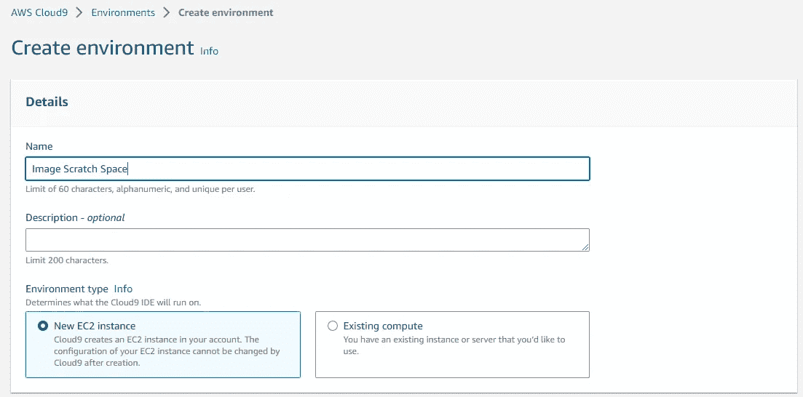
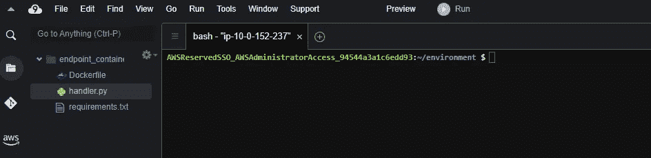
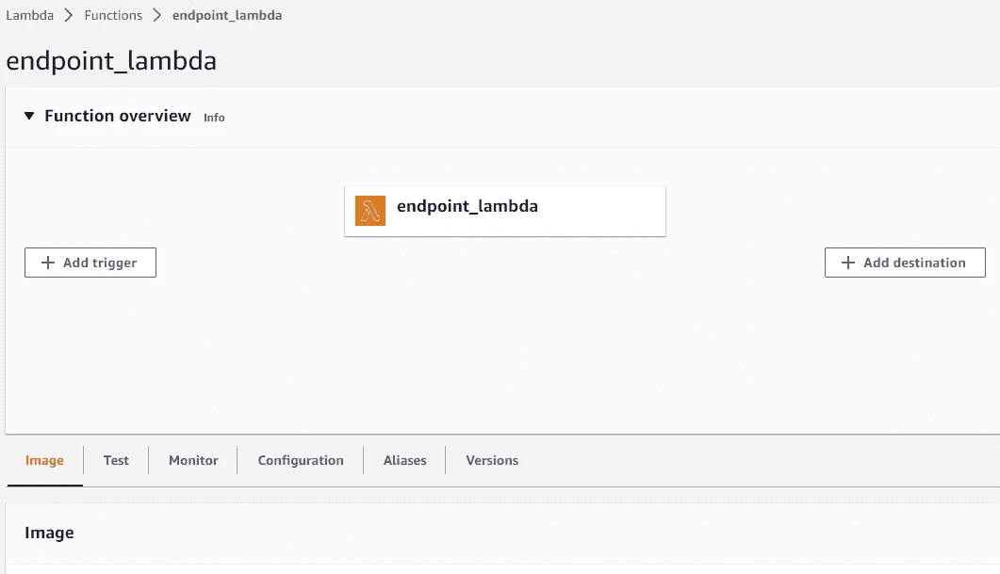
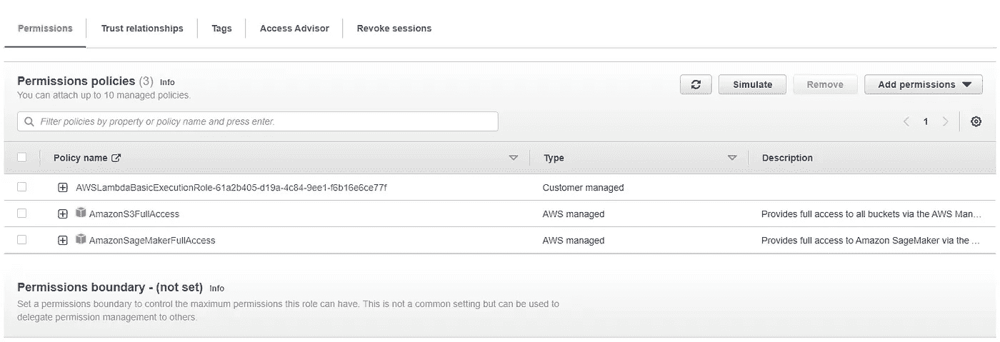
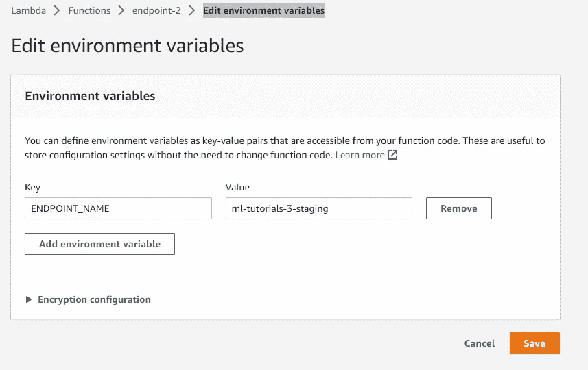
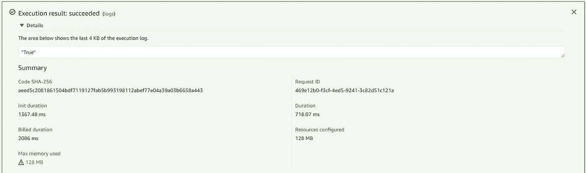

# 从 ECR 图像构建 AWS Lambda 函数以管理 SageMaker 推理端点的指南

> 原文：<https://towardsdatascience.com/guide-to-building-aws-lambda-functions-from-ecr-images-to-manage-sagemaker-inference-endpoints-4980a9b92290>

## 我们分解了为机器学习 API 端点构建 lambda 函数的过程


[图片来源](https://www.freepik.com/free-photo/container-terminal-wharf-transport_1116323.htm#query=container&position=3&from_view=search&track=sph)

Lambda 是 AWS cloud 上一个强大的无服务器托管服务。在 2014 年推出时，Lambda 提供了一种独特的事件驱动抽象，消除了管理计算资源的麻烦。在许多方面，它是第一个真正的无服务器云服务。

今天，由于它们能够灵活地执行关键的机器学习流水线任务，如批量数据处理、中小型模型训练、工作流触发、模型部署等，它们在拼接企业机器学习应用程序方面发挥着至关重要的作用。

Lambdas 可以被视为小型空计算沙箱，因此要求我们提供执行其任务所需的操作系统、代码和依赖关系。本教程将从一个 docker 图像构建一个 lambda 函数。我们 lambda 的目标将是从 S3 下载资源，接收 JSON 有效负载，执行特性工程，并将它们提供给 sagemaker 端点进行推理。

*本教程是关于使用英特尔人工智能分析工具包构建硬件优化的 SageMaker 端点系列的一部分。你可以在这里找到本教程*[](https://github.com/eduand-alvarez/ai-kit-sagemaker-templates/tree/main/xgboost-daal4py/1_lambda-container)**的所有代码。**

## ***准备我们的容器环境***

*通常，我们能够将代码和文件打包成一个. zip 文件，并利用 AWS 公共映像在 lambda 上运行我们的工作负载。然而，lambda 有严格的大小要求——我们工作的组件压缩后不能超过 50MB，解压缩后不能超过 250MB，遗憾的是大多数机器学习 python 包都超过了这一要求。这就是我们求助于 docker 的地方，docker 可以说是一种更干净、更直观的方式来构建我们的 lambda 图像。*

1.  *在 AWS 控制台中导航到 Cloud9 IDE。欢迎您在本地构建容器映像，但是我们将使用 Cloud9，因为它提供了我们需要的所有 AWS 权限和资源。
    -选择 m5.large instance(或者更大，如果你打算创建更大的图像)
    -选择 Ubuntu 作为你的平台*

**

*图一。创建 Cloud9 环境的界面—图片由作者提供*

*2.使用`touch`创建 Dockerfile、requirements.txt 和 handler.py 文件。创建后，您应该会看到左侧目录树中的所有文件—双击每个文件打开并编辑它们。*

**

*图二。Cloud9 IDE 界面—作者图片*

*3.下面，您将找到 lambda 处理程序脚本的代码，它将接收 lambda 事件并从我们的模型返回预测。在下面的例子中，我们调用一个端点作为 SageMaker 管道的一部分。让我们回顾一下脚本中的不同功能:*

*   ***process_data** 下载 transformation.sav 文件，该文件包括标签二进制化器、标准缩放器和一键编码转换，并将它们应用于我们的有效负载，以及一些基本的数据处理步骤。*
*   ***sagemaker_endpoint** 调用一个活动的 sagemaker 端点，发送我们处理过的有效载荷，并返回预测结果。*

```
*import os
import json
import boto3
import pickle
import sklearn
import warnings
import tarfile

warnings.simplefilter("ignore")
# grab environment variables
ENDPOINT_NAME = os.environ['ENDPOINT_NAME']
runtime= boto3.client('runtime.sagemaker')
trans_bucket = "your transformation bucket name"
s3_trans_key = "path to transformation.sav in your bucket"
s3 = boto3.resource('s3')

def process_data(event):
    trans = pickle.loads(s3.Object(trans_bucket, s3_trans_key).get()['Body'].read())
    event.pop('Phone')
    event['Area Code'] = int(event['Area Code'])
    obj_data = [[value for key,value in event.items() if key in trans['obj_cols']]]
    num_data = [[value for key,value in event.items() if key in trans['num_cols']]]

    obj_data = trans['One_Hot'].transform(obj_data).toarray()
    num_data = trans['scaler'].transform(num_data)

    obj_data = [str(i) for i in obj_data[0]]
    num_data = [str(i) for i in num_data[0]]

    data = obj_data + num_data

    return ",".join(data)

def sagemaker_endpoint(event, context):

    payload = process_data(event)

    response = runtime.invoke_endpoint(EndpointName=ENDPOINT_NAME,
                                       ContentType='text/csv',
                                       Body=payload)

    # decode and extract prediction                                   
    response_preds = json.loads(response['Body'].read().decode())
    result = response_preds['predictions'][0]['score']
    predicted_label = 'True' if result > 0.39 else 'False' 

    return predicted_label*
```

*4.让我们构建我们的 requirements.txt 文件。我们将使用它将必要的依赖项安装到我们的容器映像中。*

```
*boto3
numpy==1.21.4
pandas==1.3.5
sagemaker==2.93.0
scikit-learn==0.24.2*
```

*5.我们的 Dockerfile 负责配置我们的映像。我们从 AWS 的公共容器注册表中公开的 Linux ubuntu 映像开始。这个图像预装了 python 3.8。docker 文件中的其余命令将负责复制文件、安装依赖项以及执行 handler.py 脚本中的函数。*

```
*# download base image
FROM public.ecr.aws/lambda/python:3.8

# copy our lambda handler script
COPY app.py ${LAMBDA_TASK_ROOT}

# install our dependencies
COPY requirements.txt .
RUN pip3 --no-cache-dir install -r requirements.txt --target "${LAMBDA_TASK_ROOT}"

# execute function for sagemaker endpoint prediction
RUN echo Utilizing SageMaker Endpoint
CMD [ "app.sagemaker_endpoint" ]*
```

## *构建映像并注册到 ECR*

*我们将需要使我们的图像可用于我们的 lambda 函数。还有其他的图像注册中心，但是我们将使用 AWS 弹性容器注册中心(ECR)。*

**如果您需要帮助构建您的映像并将其推送到 ECR，请遵循本教程:**[***创建 ECR 注册表并推送到 Docker 映像***](https://medium.com/@eduand-alvarez/creating-an-ecr-registry-and-pushing-a-docker-image-93e372e74ff7?source=your_stories_page-------------------------------------)**

## **从 ECR 上的图像构建 Lambda 函数**

1.  **要构建您的 lambda 函数，导航到 lambda 服务，点击**创建函数，**并选择**容器图像。**提供一个*函数名*和*容器图像 URI* ，点击**创建函数**。**

****

**图 3。Lambda 管理界面—作者图片**

**2.如果我们现在尝试测试我们的函数，我们可能会得到错误，因为我们的 IAM 角色没有访问 SageMaker 或 S3 资源的权限。为了解决这个问题，我们将转到**配置>执行角色名称>添加权限>附加策略**并附加**“amazons3 full access”**和**“amazonsagemakerfull access”**在生产场景中，您可能希望限制您给予特定服务的访问权限，但这超出了我们教程的范围。**

****

**图 4。需要添加到 Lambda 函数中的 AWS 策略——作者图片**

**3.在**配置>编辑环境变量**下，为您的 SageMaker 端点名称添加一个环境变量。您的端点名称可以在 AWS SageMaker 控制台的**推断>端点**下找到。**

****

**图 5。将我们的 SageMaker 端点名称添加到环境变量中，以便于我们的函数——Image by Author——访问**

**4.一旦我们设置了权限，我们就可以测试我们的 lambda 函数了。选择 Test 选项卡并将下面的有效负载粘贴到**事件 JSON** 空间中。**

```
**{
  "State": "PA",
  "Account Length": "163",
  "Area Code": "806",
  "Phone": "403-2562",
  "Int'l Plan": "no",
  "VMail Plan": "yes",
  "VMail Message": "300",
  "Day Mins": "8.1622040217391",
  "Day Calls": "3",
  "Day Charge": "7.579173703343681",
  "Eve Mins": "3.9330349941938625",
  "Eve Calls": "4",
  "Eve Charge": "6.508638877091394",
  "Night Mins": "4.065759457683862",
  "Night Calls": "100",
  "Night Charge": "5.1116239145545554",
  "Intl Mins": "4.9281602056057885",
  "Intl Calls": "6",
  "Intl Charge": "5.673203040696216",
  "CustServ Calls": "3"
 }**
```

**点击**测试**。您的测试可能会因服务器在向端点发出第一个请求时超时而失败。如果是这样，请再次尝试测试，您应该会看到一个带有推断响应“True”的响应**

****

**图 7。来自 Lambda 测试的响应—图片由作者提供**

**恭喜，您已经成功构建了一个 lambda 函数来管理您的 SageMaker 端点资源。**

## **结论和讨论**

**AWS lambda 为管理应用程序的小组件提供了一个无服务器选项。由于 Lambda 的空间限制，大多数机器学习和数据科学包都需要专用的容器映像。**

**根据本教程中的信息，您应该能够构建引人注目的无服务器微服务架构，以支持您自己的机器学习应用程序。**

*****别忘了关注*** [***我的简介更多文章***](https://eduand-alvarez.medium.com/) ***这样！*****