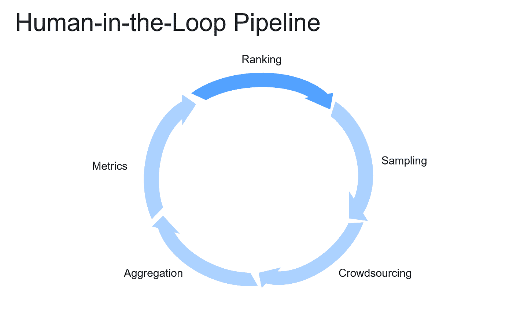
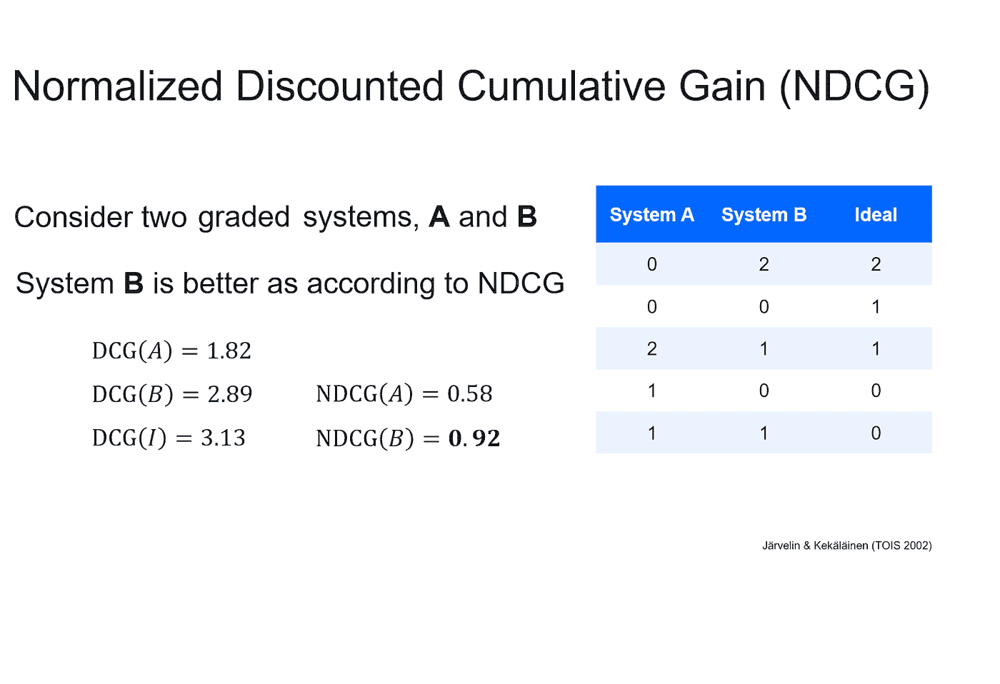
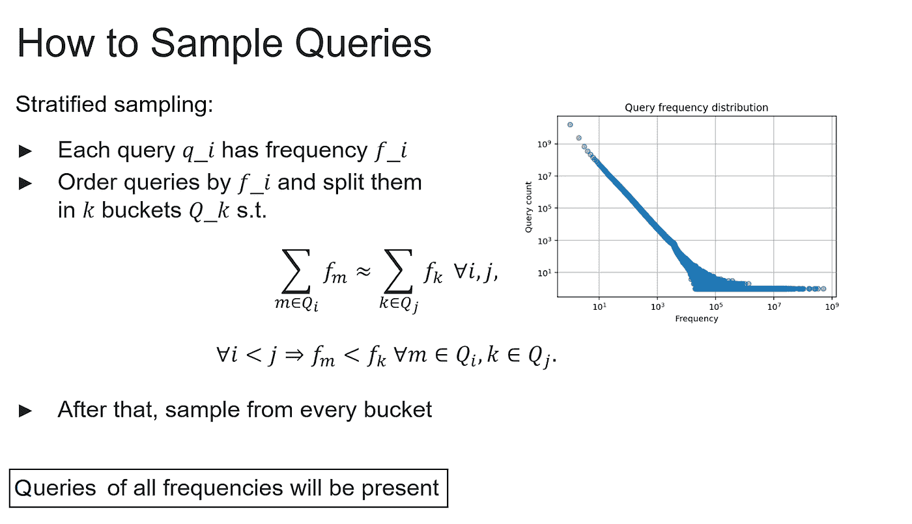
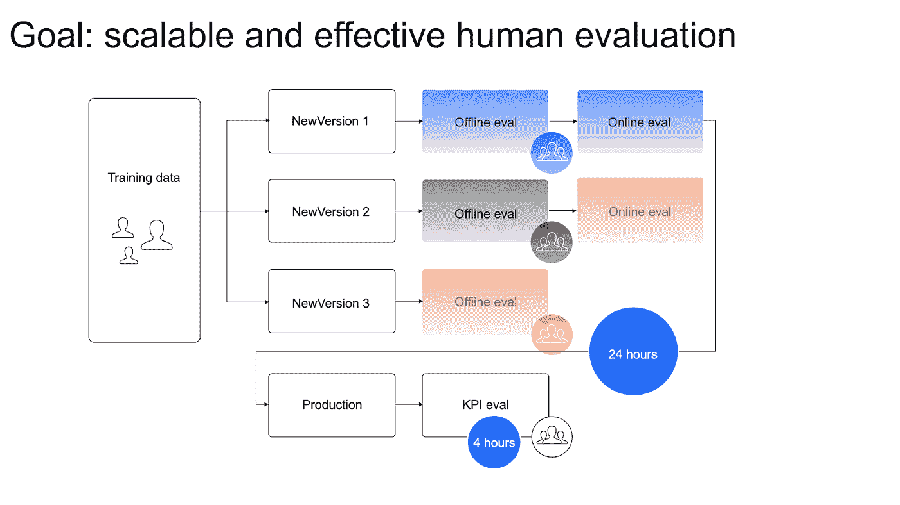
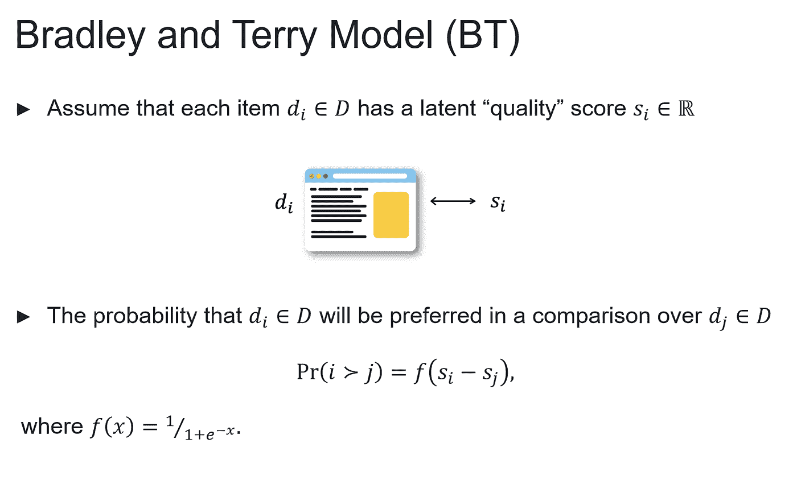
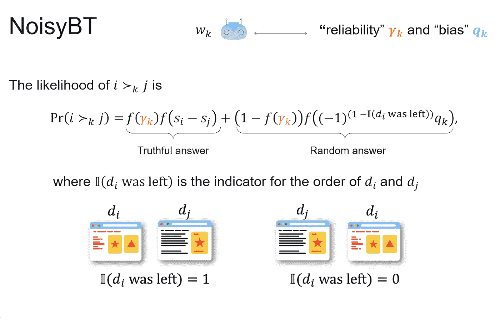
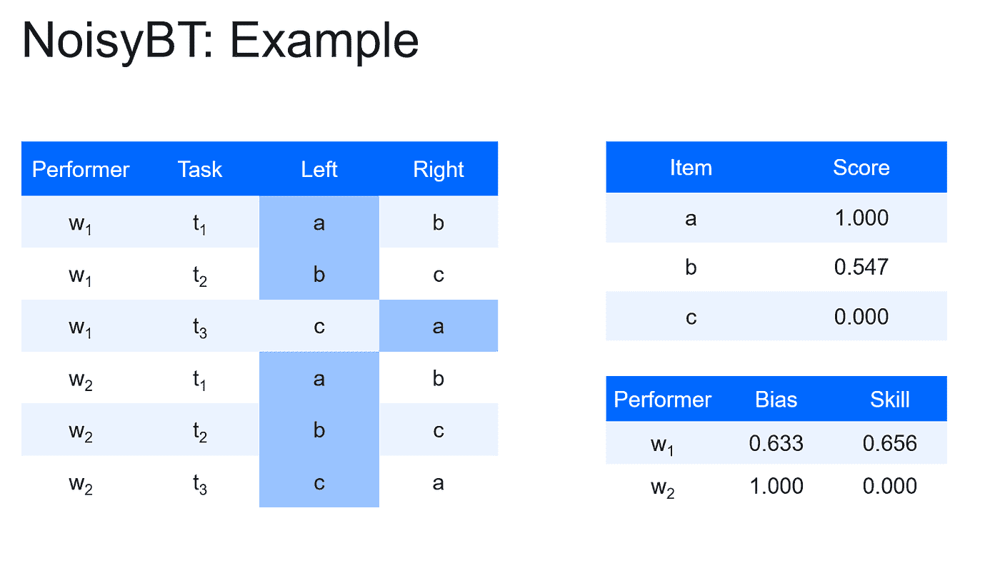

# 搜索相关性评估的数据标记指南

> 原文：<https://towardsdatascience.com/guide-to-data-labeling-for-search-relevance-evaluation-a197862e5223>

## *本指南最初作为教程的一部分出现在 21 届互联网大会上*

由[马库斯·温克勒](https://unsplash.com/@markuswinkler?utm_source=medium&utm_medium=referral)在 [Unsplash](https://unsplash.com?utm_source=medium&utm_medium=referral) 上拍摄

机器学习(ML)在现代商业中有许多应用，信息检索(IR)是最常见的应用之一。许多电子商务使用它来衡量他们平台上的搜索质量相关性，以便为用户提供更好的服务。

根据经验，在处理信息检索时，语料库越大，评估数据集就越大，评估过程就越严格。评估搜索相关性最有效的方法之一是通过人在回路中的数据标记，众包是我们选择的方法。

作者图片

**搜索质量评估**

当在搜索栏中键入短语时，任何 IR 系统都通过提供从最相关到最不相关的搜索查询输出来工作。通常情况下，用户会查看前 4-5 个回复，选择合适的内容，然后忽略其他内容。

考虑到这一点，系统始终如一地对网络搜索结果进行排名是至关重要的，要考虑到它们的相关性、及时性和可伸缩性，并使用许多离线指标来实现这一目标。NDCG(归一化折扣累积收益)是一个排名质量的措施，经常被用来衡量网络搜索引擎的有效性。在这种情况下，最理想的系统首先列出等级最高的项目。

作者图片

随着排序项目的数量接近无穷大，NDCG 收敛到 1。这两种方法都引入了折扣函数或数据集大小的超参数，可以做到以下几点:

将折扣函数从对数改为可行的，例如𝑟^(−1/2).

限制 top-𝑘检索文件的数量，即使用 NDCG@k

无论选择哪种途径，充分的取样是获得可靠结果的关键。

**查询抽样**

在离线评估中应该使用哪些查询？一些人认为这是网络用户经常进行的最流行的查询。但是那些不太频繁(甚至可能只有一次)的查询呢？

事实是，这些一次性的查询通常很难处理，因为它们通常是不明确的。然而，如果我们的服务不能很好地处理这些查询，用户很可能会转向另一家能够处理更复杂任务的公司。在流行查询和独特查询之间，还存在大范围的中档查询。

因为我们希望我们的服务在所有类型的查询上表现得一样好，所以我们希望从所有查询中获得一个平衡的样本。实现这一点的最简单的方法是在每个查询中投掷硬币来确定它是否包含在样本中。这种方法的明显缺点是，我们实际上无法控制哪些查询被接受和丢弃，所以理论上最流行的查询可能会在这个过程中被丢弃。此外，我们不能用这种方法控制样本量。

储层取样是一种更复杂的取样方法。主要思想是，我们保存一个对象列表(其长度等于所需的样本大小)，遍历查询，抛硬币，然后用一个新的对象替换列表中的一个对象，或者完全跳过这个对象。虽然这种方法提供了一种与样品性质相关的改进技术，但它仍然不能保证我们样品的代表性。

为了确保所有的查询类型都出现在我们的样本中，我们可以使用分层抽样。为此，我们将查询分成不同的存储桶，这些存储桶具有大致相同数量的非唯一用户查询，但不同数量的唯一用户查询。存储桶的排序方式是，较小存储桶中的任何查询的频率都低于较大存储桶中的查询。分割完成后，我们可以从每个存储桶中抽取查询样本。如果我们的样本足够大，我们将从最大的桶中获得最受欢迎的查询。

作者图片

获得查询样本后，我们可以在离线评估的 3 个关键领域使用它们:

KPI(关键点指标)衡量:用于衡量我们服务表现的总体日常服务评估。

验证篮子:频繁测试，包括但不限于 A/B 实验和我们服务的微调。

测试篮:用于发布前检查的独立篮子，我们可以使用它来防止 KPI 篮子中的过度配合。

使用相同的基本技术对每个篮子进行独立采样。需要考虑的一点是，长期评估要求我们经常更新我们的篮子。

**众包应用**

通过众包，来自人类注释者的独立判断被用于评估电子商务平台和其他网络服务的性能。自然，我们希望尽可能公平地评估平台的搜索相关性质量。由于人工信号容易过拟合，特别是在生产中使用时，我们需要获得一个独立的信号源。

当涉及到过度拟合时，人类的判断要稳健得多，允许我们在不受系统内置的任何因素影响的情况下测量搜索相关性。此外，我们可以使用公共人群和管理/内部人群的混合来获得最佳结果，这反过来会让我们将我们的测量扩大一个数量级。

**众包任务**

我们的离线质量评估管道使我们能够在几天内获得准确的结果，在某些情况下甚至是几个小时。但是评估过程越复杂，正常获得结果的时间就越长。

作者图片

至于细节，并排(SbS)——或成对比较——是最常见的众包任务之一。投稿人被要求以图片或文本的形式相互比较搜索结果——每次两个——并选择最合适的一个。

作者图片

重要的是要记住，人群是不断变化和发展的。因此，抵消这种影响并获得更平衡的视图的最直接的方法是选择一组验证结论，并将其与较新的标签进行比较。虽然它将测量加价质量，但质量评估的结果值受几个因素的影响，即:

说明的清晰性和例子的丰富性，即注释者是否理解了一切，并且没有矛盾或灰色区域。

黄金(预注释)任务的质量，也就是说，新的注释者可能会提交正确的答案，但是如果后者本身受到损害，他们的判断将与黄金集不匹配。

黄金任务的结构——如果结构不良(太简单或太复杂)——会导致高估或低估搜索质量。

注释者的选择，即贴标签机在背景/准备情况和可靠性/跟踪记录两方面处理特定任务的适合程度。

注释者的动机，即向贡献者提供什么激励来提高和奖励他们的勤奋和速度。

**答案汇总**

一旦我们从我们的群体注释者那里获得了答案，就可以使用许多技术来聚集这些响应，但是并不是所有的技术都同样适用于每种情况。然而在许多分类任务中，有一个只有一个正确答案的内在假设，搜索查询排名和评估所需的成对比较任务通常基于主观意见。为了考虑这一重要因素，我们可以使用布拉德利-特里模型进行汇总。

作者图片

在这个模型中，每个项目都有一个潜在的质量分数。我们可以通过计算偏好概率来推断分数，并随后使用这些分数来对我们的项目进行排序。然而，这个模型的一个缺陷是，所有的注释者都被假定为同样勤奋和诚实，但实际情况并非总是如此。

在这个问题的众多解决方案中，有一个是将 NoisyBT 集成到我们的模型中，该模型不仅将项目，而且将注释器视为具有质量参数——可靠性和偏差。然后通过应用梯度下降法修改概率似然性，如下所示。对于那些寻求简单性的人来说， [Crowd-Kit](https://github.com/Toloka/crowd-kit) 可以通过在开源 Python 库中提供所有上述算法来帮助聚合。

作者图片

作者图片

**选择配对**

为了进行成对比较任务，我们需要选择成对的项目。问题是我们如何做到这一点？为了知道选择哪一个，我们可以简单地计算所有可能的组合(对于 *n* 个对象，将有渐进的 *n* 对)；但是，这种方法成本太高。

相反，我们可以计算一个更小但合理的子集对，类似于[合并排序](https://en.wikipedia.org/wiki/Merge_sort)算法如何在*O*(*n*log*n*)中运行这样的成对比较。我们的经验表明，对这些对象的*k**n*log*n*对进行采样就足够了，其中超参数 *k* 必须进行调优(通常不超过 12)。

**结论**

ML 产品的质量在很大程度上依赖于所使用的数据，即质量、数量和及时更新。众包可以以负担得起的、快速的和可管理的方式在任何规模上提供上述所有内容。

对于众包，在数据准确性和数据集大小之间有一个权衡，所以那些试图利用众包的人需要考虑他们的长期和短期目标。一般来说，众包允许大数据集量，并且倾向于比管理/内部人群提供对 IR 和搜索查询相关性的更深入的见解。话虽如此，众包和管理人群并不相互排斥——这两者可以在一个单独的渠道中相互补充，事实上，这是一个值得推荐的策略。

**有用的资源**

文字检索会议资料:[https://trec.nist.gov/data.html](https://trec.nist.gov/data.html)

托洛卡聚合关联数据集:[https://toloka.ai/datasets](https://toloka.ai/datasets)