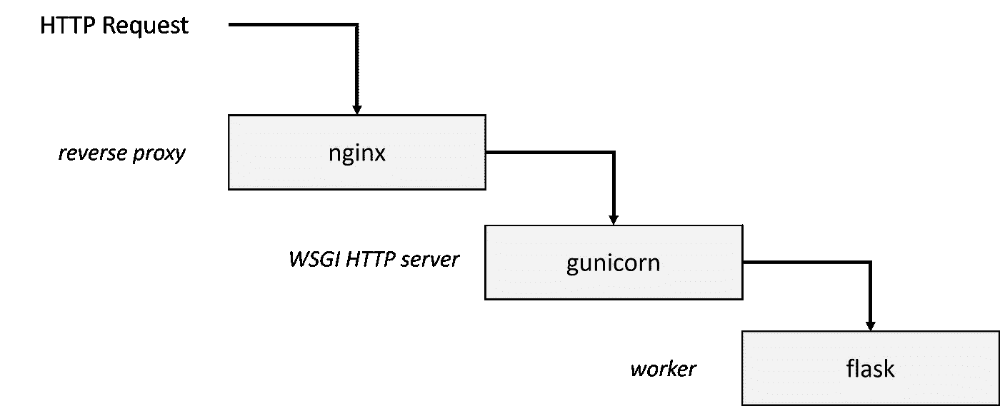

# 使用 oneAPI 和 Docker 在 SageMaker 中实现定制加速 AI 库的指南

> 原文：<https://towardsdatascience.com/guide-to-implementing-custom-accelerated-ai-libraries-in-sagemaker-with-oneapi-and-docker-97547692cb6e>

## 了解如何为加速的 ML 库构建定制的 SageMaker 模型


[图像来源](https://www.freepik.com/free-photo/image-engineering-objects-workplace-top-view-construction-concept-engineering-tools-vintage-tone-retro-filter-effect-soft-focus-selective-focus_1239496.htm#query=architect&position=2&from_view=search&track=sph)

AWS 为 SageMaker 提供了开箱即用的机器学习图像，但是当您想要部署您的自定义推理和训练解决方案时，会发生什么情况呢？

本教程将探索定制 ML 训练和推理的具体实现，它利用 [daal4py](https://www.intel.com/content/www/us/en/developer/articles/technical/improve-performance-xgboost-lightgbm-inference.html#gs.khqx45) 来优化 XGBoost 以实现英特尔硬件加速性能。本文假设您正在使用 SageMaker 模型和端点。

*本教程是关于使用英特尔人工智能分析工具包构建硬件优化的 SageMaker 端点系列的一部分。你可以在这里* *找到本教程* [***的所有代码。***](https://github.com/eduand-alvarez/ai-kit-sagemaker-templates/tree/main/xgboost-daal4py/0_xgboost-daal4py-container)

## 配置 Dockerfile 和容器设置

我们将使用 AWS Cloud9，因为它已经拥有构建容器映像的所有权限和应用程序。欢迎您在本地机器上构建这些。

让我们快速回顾一下映像中关键文件的用途。在本文的 [GitHub Repo](https://github.com/eduand-alvarez/ai-kit-sagemaker-templates/tree/main/xgboost-daal4py/0_xgboost-daal4py-container) 中，我已经将每个描述链接到适当的文件:

*   [**训练**](https://github.com/eduand-alvarez/ai-kit-sagemaker-templates/blob/main/xgboost-daal4py/0_xgboost-daal4py-container/train) **:** 这个脚本将包含训练我们模型的程序。当您构建算法时，您将编辑它以包含您的训练代码。
*   [**serve**](https://github.com/eduand-alvarez/ai-kit-sagemaker-templates/blob/main/xgboost-daal4py/0_xgboost-daal4py-container/serve)**:**这个脚本包含一个推理服务器的包装器。在大多数情况下，您可以按原样使用该文件。
*   [**wsgi.py**](https://github.com/eduand-alvarez/ai-kit-sagemaker-templates/blob/main/xgboost-daal4py/0_xgboost-daal4py-container/wsgi.py) **:** 用于个体服务器工作者的启动 shell。只有当您更改 predictor.py 的位置或名称时，才需要更改此设置。
*   [**predictor . py**](https://github.com/eduand-alvarez/ai-kit-sagemaker-templates/blob/main/xgboost-daal4py/0_xgboost-daal4py-container/predictor.py)**:**算法特定的推理代码。这是最棘手的脚本，因为它需要大量修改以适应您的原始数据处理方案——**ping**和**调用**函数，因为它们具有重要的性质。ping 功能确定容器是否正常工作。在这个示例容器中，如果我们可以成功地加载模型，我们就声明它是健康的。当向 SageMaker 端点发出 POST 请求时，就会执行调用函数。

**ScoringService** 类包含两个方法， **get_model** 和 **predict** 。 **predict** 方法有条件地将我们训练好的 xgboost 模型转换为 daal4py 模型。Daal4py 通过利用英特尔 oneAPI 数据分析库(oneDAL)，使 xgboost 机器学习算法的执行速度更快，从而在底层硬件上获得更好的性能。

```
class ScoringService(object):
    model = None  # Where we keep the model when it's loaded

    @classmethod
    def get_model(cls):
        """Get the model object for this instance, loading it if it's not already loaded."""
        if cls.model == None:
            with open(os.path.join(model_path, "xgboost-model"), "rb") as inp:
                cls.model = pickle.load(inp)
        return cls.model

    @classmethod
    def predict(cls, input, daal_opt=False):
        """Receives an input and conditionally optimizes xgboost model using daal4py conversion.
        Args:
            input (a pandas dataframe): The data on which to do the predictions. There will be
                one prediction per row in the dataframe"""

        clf = cls.get_model()

        if daal_opt:
            daal_model = d4p.get_gbt_model_from_xgboost(clf.get_booster())
            return d4p.gbt_classification_prediction(nClasses=2, resultsToEvaluate='computeClassProbabilities', fptype='float').compute(input, daal_model).probabilities[:,1]

        return clf.predict(input)
```

*   [**nginx . conf**](https://github.com/eduand-alvarez/ai-kit-sagemaker-templates/blob/main/xgboost-daal4py/0_xgboost-daal4py-container/nginx.conf)**:**管理多个 workers 的 nginx 主服务器的配置。在大多数情况下，您可以按原样使用该文件。
*   [**requirements . txt**](https://github.com/eduand-alvarez/ai-kit-sagemaker-templates/blob/main/xgboost-daal4py/0_xgboost-daal4py-container/requirements.txt)**:**定义了我们的映像所需的所有依赖项。

```
boto3
flask 
gunicorn
numpy==1.21.4
pandas==1.3.5
sagemaker==2.93.0
scikit-learn==0.24.2
xgboost==1.5.0
daal4py==2021.7.1
```

*   [**Dockerfile:**](https://github.com/eduand-alvarez/ai-kit-sagemaker-templates/blob/main/xgboost-daal4py/0_xgboost-daal4py-container/Dockerfile) 这个文件负责配置我们自定义的 SageMaker 映像。

```
FROM public.ecr.aws/docker/library/python:3.8

# copy requirement file and install python lib
COPY requirements.txt /build/
RUN pip --no-cache-dir install -r /build/requirements.txt

# install programs for proper hosting of our endpoint server
RUN apt-get -y update && apt-get install -y --no-install-recommends \
         nginx \
         ca-certificates \
    && rm -rf /var/lib/apt/lists/*

# We update PATH so that the train and serve programs are found when the container is invoked.
ENV PATH="/opt/program:${PATH}"

# Set up the program in the image
COPY xgboost_model_code/train /opt/program/train
COPY xgboost_model_code/serve /opt/program/serve
COPY xgboost_model_code/nginx.conf /opt/program/nginx.conf
COPY xgboost_model_code/predictor.py /opt/program/predictor.py
COPY xgboost_model_code/wsgi.py /opt/program/wsgi.py

#set executable permissions for all scripts
RUN chmod +x /opt/program/train
RUN chmod +x /opt/program/serve
RUN chmod +x /opt/program/nginx.conf
RUN chmod +x /opt/program/predictor.py
RUN chmod +x /opt/program/wsgi.py

# set the working directory
WORKDIR /opt/program
```

我们的 docker 执行 docker 文件中定义的以下步骤从 AWS 公共容器注册表安装一个基础映像，复制并安装 requirements.txt 文件中定义的依赖项，安装用于托管端点服务器的程序，更新路径的位置，将所有相关文件复制到我们的映像中，为所有文件提供可执行权限，并将工作目录设置为/opt/program。

## 了解 SageMaker 将如何使用我们的形象

因为我们在训练或托管中运行相同的映像，所以 Amazon SageMaker 在训练时使用参数`train`运行容器，在托管端点时使用参数`serve`。现在让我们来分析一下在培训和托管阶段到底发生了什么。

**培训阶段:**

*   你的`train`脚本就像一个普通的 Python 程序一样运行。在`/opt/ml`目录下有几个文件供您使用:

```
/opt/ml
|-- input
|   |-- config
|   |   |-- hyperparameters.json
|   | 
|   `-- data
|       `-- 
|           `-- 
|-- model
|   `-- 
`-- output
    `-- failure
```

*   `/opt/ml/input/config`包含控制程序运行方式的信息。`hyperparameters.json`是一个 JSON 格式的超参数名称到值的字典。
*   `/opt/ml/input/data/`(文件模式)包含模型训练的数据。
*   `/opt/ml/model/`是您编写算法生成的模型的目录。SageMaker 会将这个目录中的所有文件打包成一个压缩的 tar 归档文件。
*   `/opt/ml/output`是算法可以写入文件`failure`的目录，该文件描述了作业失败的原因。

**托管阶段:**

托管与训练有着非常不同的模型，因为托管通过 HTTP 响应推理请求。



图一。本教程中的代码实现的堆栈—图片由作者提供

SageMaker 将针对容器中的两个端点:

*   `/ping`将从基础设施接收`GET`请求。如果容器启动并接受请求，程序返回 200。
*   `/invocations`是接收客户端推理`POST`请求的端点。请求和响应的格式取决于算法。

## **构建图像并注册到 ECR**

我们将需要使我们的形象提供给 SageMaker。还有其他的图像注册中心，但是我们将使用 AWS 弹性容器注册中心(ECR)。

*将您的自定义映像提供给 SageMaker 管道的步骤在随附的文章中进行了概述:* [***在 SageMaker 中构建硬件加速 MLOps 管道的详细指南***](https://medium.com/@eduand-alvarez/a-detailed-guide-for-building-hardware-accelerated-mlops-pipelines-in-sagemaker-5d32459665b3)

*如果您需要帮助构建您的映像并将其推送到 ECR，请遵循本教程:**[***创建 ECR 注册表并推送到 Docker 映像***](https://medium.com/@eduand-alvarez/creating-an-ecr-registry-and-pushing-a-docker-image-93e372e74ff7?source=your_stories_page-------------------------------------)*

## *结论和讨论*

*AWS Sagemaker 为原型开发和部署机器学习管道提供了一个有用的平台。然而，由于按照 SageMaker 的规范构建底层映像的复杂性，利用您自己的定制训练/推理代码并不容易。在本文中，我们通过教您如何来应对这一挑战:*

*   *如何配置 XGBoost 培训脚本*
*   *为推理端点配置 Flask APIs*
*   *转换模型 Daal4Py 格式以加速推理*
*   *如何将上述所有内容打包到 Docker 映像中*
*   *如何注册我们的自定义 SageMaker 图像到 AWS 弹性容器注册表？*

## *来源:*

*   *Sagemaker XGBoost 集装箱回购|[https://github.com/aws/sagemaker-xgboost-container](https://github.com/aws/sagemaker-xgboost-container)*
*   *AI Kit sage maker Templates Repo |[https://github . com/edu and-Alvarez/AI-Kit-sage maker-Templates](https://github.com/eduand-alvarez/ai-kit-sagemaker-templates)*