# 在 Python 中处理缺失数据

> 原文：<https://towardsdatascience.com/handling-missing-data-in-python-c1ffe6e0f325>


约翰·马特丘克在 [Unsplash](https://unsplash.com/@john_matychuk) 上拍摄的照片。

如上图所示的停车库旨在填满每一个空间；空闲点意味着未使用的产能，这意味着收入和利润形式的产出减少。同样，数据科学家希望他们的数据完全填满每个观察值；数据集中缺失的元素会导致从原始数据中提取的信息减少，从而对分析能力产生负面影响。

不幸的是，完美的数据很少，但是 Python 中有几种工具和技术可以帮助处理不完整的数据。本指南将解释如何:

*   识别缺失数据的存在。
*   了解缺失数据的属性。
*   可视化丢失的数据。
*   确定丢失数据的位置后，准备数据集。

按照下面的例子和 [**在链接的 Github 页面**](https://github.com/kurtklingensmith/MissingDataNotebook) 下载包含代码示例和数据的完整 Jupyter 笔记本。

## 数据:Seaborn 的英里每加仑(MPG)数据，修改

Python 数据可视化库 [**Seaborn**](https://seaborn.pydata.org) 包含几个免费的开源数据集用于实验；点击了解更多信息[。在](/seaborn-essentials-for-data-visualization-in-python-291aa117583b) [**链接的 Github 页面**](https://github.com/kurtklingensmith/MissingDataNotebook) 上有一个“MPG”数据集版本，其中的元素被有目的地删除，它将作为本指南中使用的数据集。

修改后的“MPG”数据帧截图如下——注意“model_year”列中的几个“NaN”值:

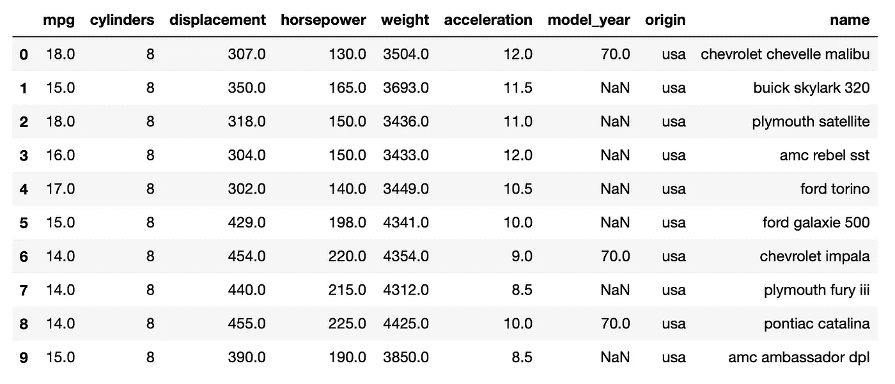

作者截图。

# 1.检查丢失的数据

前面的截图展示了寻找缺失数据的最简单的方法:目视检查。这种方法的主要缺点是处理大数据；当 Python 的 Pandas 库有一些快速简单的命令来快速找到丢失数据的位置时，为什么要查看每一行呢？

以下代码为查找缺失数据提供了一个简单的起点:

```
# Load the data into a pandas dataframe:
df **=** pd**.**read_csv('mpg-data.csv')# Display the dataframe's info:
df.info()
```

这将返回:

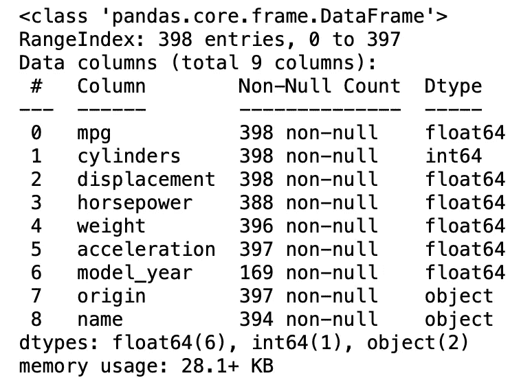

作者截图。

请注意，这将返回一个标题为“非空计数”的列，以及有关数据帧形状的信息(398 个条目，9 列)。“非空计数”列显示有几列缺少数据，可通过它们的 sub-398 非空计数来识别。

另一种方法是运行以下代码:

```
df.isnull().any()
```

的。isnull()函数标识缺失值；添加中。末尾的 any()将返回一个布尔值(True 或 False)列，这取决于该列是否完整。上述代码返回以下内容:

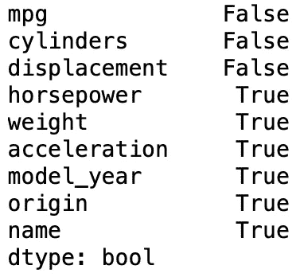

作者截图。

这清楚地说明了哪些列包含 null(缺失)值。只有三列(mpg、气缸和排量)是完整的。运行与上面相同的代码。any()返回不同的内容:

```
df.isnull()
```

这将返回:

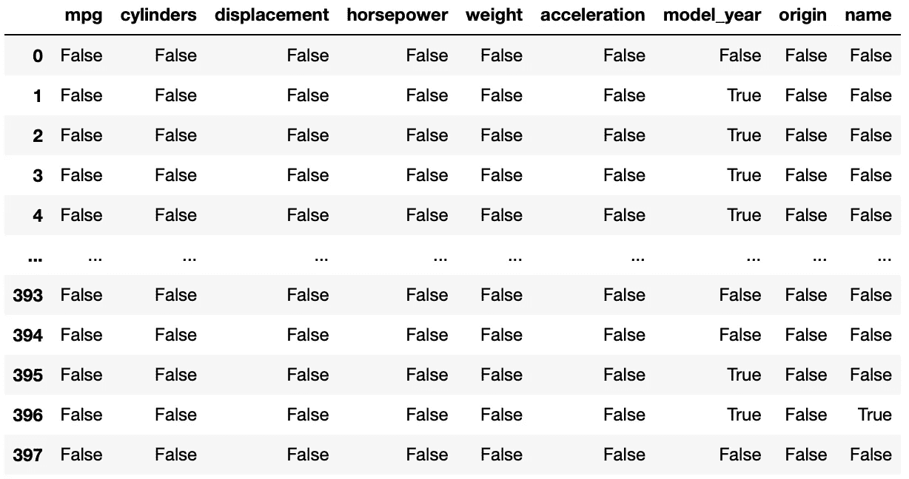

作者截图。

若要按列获取 null 值的计数，请运行以下代码。

```
df.isnull().sum()
```

这将返回:

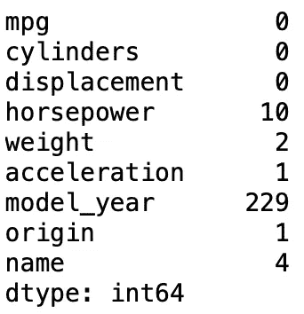

作者截图。

这回答了每一列中有多少缺失值的问题。以下代码提供了整个数据帧中所有空值的总和:

```
df.isnull().sum().sum()
```

以上返回值为 247。

另一种方法是使用 python 的 pandas 库来操作 isnull()的输出，并使用相反的函数 notna()，该函数返回数据帧中填充值的计数。下面的代码生成一个新的 dataframe，它汇总了 Null 和 Not Null 值:

```
# Determine the null values:
dfNullVals = df.isnull().sum().to_frame()
dfNullVals = dfNullVals.rename(columns = {0:'Null'})# Determine the not null values:
dfNotNullVals = df.notna().sum().to_frame()
dfNotNullVals = dfNotNullVals.rename(columns = {0:'Not Null'})# Combine the dataframes:
dfNullCount = pd.concat([dfNullVals, dfNotNullVals], ignore_index=False, axis=1).reset_index()
dfNullCount = dfNullCount.rename(columns = {'index':'Category'})# Display the new dataframe:
dfNullCount
```

这样的输出是:

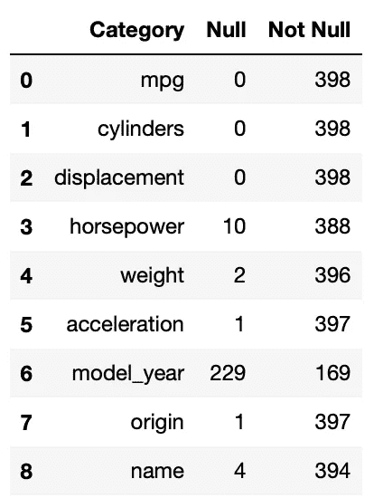

作者截图。

根据上面的代码输出，很明显数据包含许多分布在不同行和列的空值。一些列比其他列受影响更大。理解缺失值的下一步是可视化。

# 2.可视化缺失数据

## 2.1.缺少图书馆

存在几种用于发现缺失数据的可视化技术。一个例子是缺少 no。该库可通过以下方式轻松安装:

```
pip install missingno
```

一旦安装，可视化丢失的数据是简单的。以下代码导入库并显示缺失数据的条形图表示:

```
import missingno as mimi.bar(df)
plt.show()
```

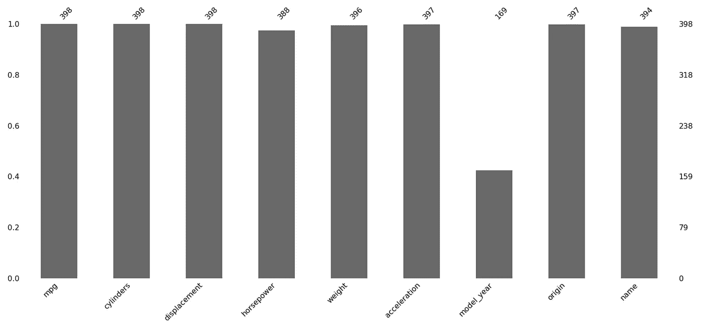

作者截图。

x 轴显示列，而 y 轴显示填充量，范围为 0 到 1。总数位于条形图的顶部。请注意，很容易就能发现“model_year”的一半以上都不见了。

以下代码显示了另一种可视化方法—矩阵:

```
mi.matrix(df)
plt.show()
```

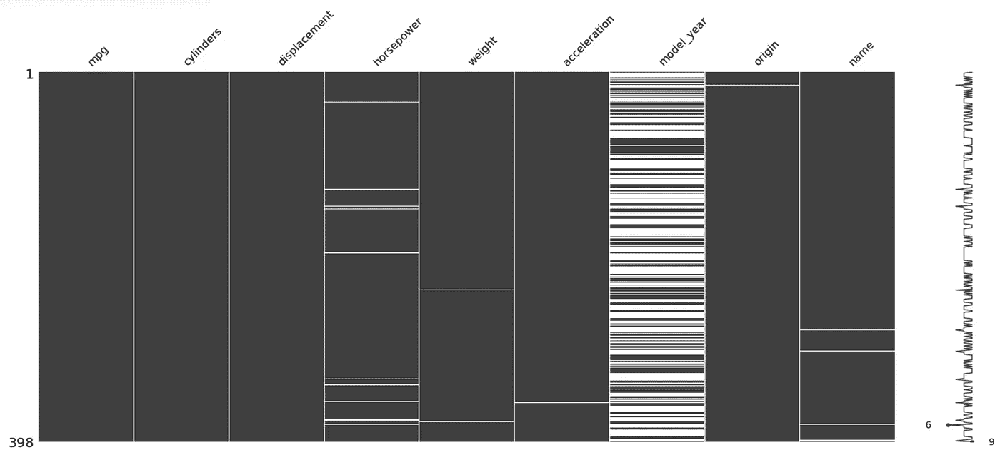

作者截图。

这与条形图不同，它揭示了缺失数据在每一列中的位置。每列中的空白表示缺失的数据；请注意“model_year”是如何在整个列中相当均匀地分布缺失数据的。有关 missingno 的更多信息，请参考数据科学文章中的[。](/using-the-missingno-python-library-to-identify-and-visualise-missing-data-prior-to-machine-learning-34c8c5b5f009)

## 2.2.Seaborn 可视化

Python 的 seaborn 库提供了一些简单的可视化选项。具体而言，seaborn 热图可以揭示缺失数据的存在，包括数据在数据帧中的空间位置。以下代码生成了一个 seaborn 热图:

```
plt.subplots(figsize=(15,5))  
sns.heatmap(df.isnull().transpose(), cmap = 'Blues')
plt.title("Missing Data in MPG Data")
plt.show()
```

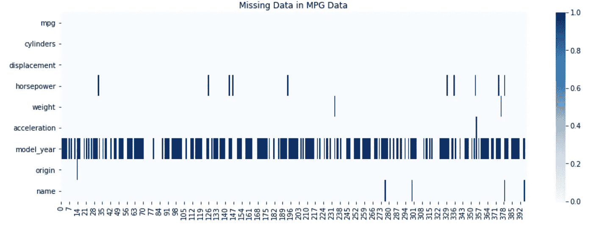

作者截图。

## 2.3.Plotly

Plotly 为可视化缺失数据提供了一些交互式选项。值得注意的是，它允许重新创建 missingno bar 可视化，并提供交互性和增强的可定制性选项。

第一步包括将数据处理成数据帧，类似于第一部分中所做的。代码块的第二部分创建条形图。代码和输出如下:

```
# Data Manipulation to Create a Dataframe and Chart Outputting Null and Not Null Value Counts# Determine the null values:
dfNullVals = df.isnull().sum().to_frame()
dfNullVals = dfNullVals.rename(columns = {0:'Null'})# Determine the not null values:
dfNotNullVals = df.notna().sum().to_frame()
dfNotNullVals = dfNotNullVals.rename(columns = {0:'Not Null'})# Combine the dataframes:
dfNullCount = pd.concat([dfNullVals, dfNotNullVals], ignore_index=False, axis=1).reset_index()
dfNullCount = dfNullCount.rename(columns = {'index':'Category'})# Generate Plot
fig = px.bar(dfNullCount, x="Category", y = ['Not Null', 'Null'])
fig.update_xaxes(categoryorder='total descending')
fig.update_layout(
    title={'text':"Null Values Visualization",
           'xanchor':'center',
           'yanchor':'top',
           'x':0.5},
    xaxis_title = "Category",
    yaxis_title = "Count")
fig.update_layout(legend_title_text = 'Status')
fig.show()
```

输出:


作者截图。

虽然与 missingno 提供的非常相似，但 plotly 可视化的优势在于可定制性和交互性，包括 hoverdata 和易于导出的截图。

# 3.丢失的数据怎么办？

最后一步是确定如何处理丢失的数据。这将取决于数据科学家试图回答的问题。从上面的可视化中可以明显看出,“model_year”缺少一半以上的条目，这大大降低了它的有用性。

假设“model_year”是一个无用的列，删除它并创建一个新的数据框架很简单:

```
dfNew = df.drop('model_year', axis=1)
```

删除剩余的空值也很简单，只需要一行代码就可以创建一个没有空值的新数据帧:

```
dfNoNull = dfNew.dropna()# Show if there are any nulls in the new dataframe:
dfNoNull.isnull().any()
```

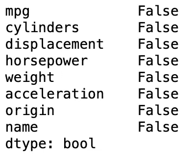

作者截图。

假设查看具有空值的列是有价值的；创建不完整观察的数据框架很简单:

```
dfNulls = dfNew[dfNew.isnull().any(axis=1)]# Show if here are any nulls in the new dataframe:
dfNulls.isnull().any()
```

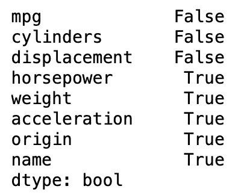

作者截图。

前面的操作产生了两个新的数据帧:一个没有任何缺失的数据，另一个只包含有缺失数据元素的观察值。

# 4.结论

虽然数据科学家经常会处理不完整的数据，但有许多方法可以识别给定数据帧中的缺失数据。各种可视化技术有助于发现空值，并帮助讲述数据完整性的故事。选择最合适的方法来发现、可视化和处理空数据将完全取决于客户的需求。

# 参考资料:

[1] Seaborn， [Seaborn:统计数据可视化](https://seaborn.pydata.org) (2022)。

[2] M. Alam，[Seaborn Python 中数据可视化的基础知识](/seaborn-essentials-for-data-visualization-in-python-291aa117583b) (2020)，走向数据科学。

[3] A. McDonald，[使用 missingno Python 库在机器学习](/using-the-missingno-python-library-to-identify-and-visualise-missing-data-prior-to-machine-learning-34c8c5b5f009) (2021)之前识别和可视化缺失数据，走向数据科学。