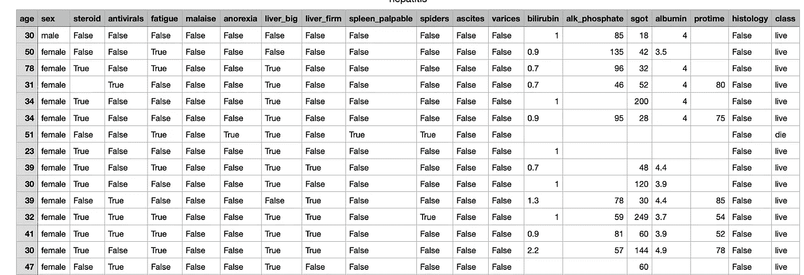
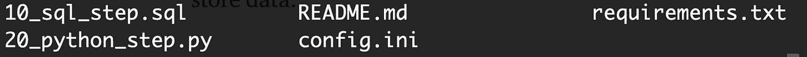

# 处理通用数据工具包中的缺失值

> 原文：<https://towardsdatascience.com/handling-missing-values-in-versatile-data-kit-bb4f2a907b9c>

## 数据预处理

## 关于如何使用 VDK 处理缺失值来构建数据管道的教程


由[马库斯·斯皮斯克](https://unsplash.com/@markusspiske?utm_source=medium&utm_medium=referral)在 [Unsplash](https://unsplash.com?utm_source=medium&utm_medium=referral) 上拍摄的照片

VMware 最近发布了一个新的框架，[多功能数据工具包](https://github.com/vmware/versatile-data-kit) (VDK)，您可以使用它进行数据摄取和数据处理。 **VDK 帮助您轻松执行复杂的操作，例如使用 SQL 或 Python 从不同来源获取数据**。换句话说，您可以使用 VDK 来构建**数据湖**，在这里您接收从不同来源提取的原始数据，包括结构化、半结构化和非结构化数据。

VDK 还提供了许多**插件**，可以用来导入不同格式的数据，比如 CSV、HTTP 等等。所有可用插件的列表可在 [VDK 官方文档](https://github.com/vmware/versatile-data-kit/tree/main/projects/vdk-plugins)中找到。

**除了数据的原始导入，您还可以使用 VDK 处理数据，并将其转换为其他人(如数据科学家或数据分析师)可以直接阅读的格式。**

数据预处理是将原始数据导入数据湖后的下一步。通常，数据预处理包括不同的步骤，如处理缺失值、数据格式化、数据规范化、数据标准化和数据宁滨。

您可以结合 SQL 和 Python 的力量，直接在 VDK 中执行数据预处理。本文将通过一个实例向您展示如何处理 VDK 缺失的价值观。

文章组织如下:

*   VDK 的环境设置
*   场景描述
*   在 VDK 摄取原始数据
*   处理 VDK 缺失的价值观。

# 1 VDK 的环境设置

您可以通过`pip`安装多功能数据套件，如下所示:

```
pip install -U pip setuptools wheel
pip install **quickstart-vdk**
```

要使 VDK 正常工作，您需要安装 Python 3.7+。

VDK 支持不同的存储系统，包括 Postgres、Trino 等等。为了简单起见，在这个例子中，我们将使用 SQLite。因此，我们需要安装如下相关插件:

```
pip install vdk-sqlite
```

此外，我们将使用`vdk-csv`插件来获取数据，因此我们也需要如下安装它:

```
pip install vdk-csv
```

# 2 场景描述

例如，我们将使用`hepatitis.csv`数据集，可在[此链接](https://datahub.io/machine-learning/hepatitis)下的公共领域专用和许可下获得。

下图显示了数据集的前 15 行:



作者图片

数据集包含许多缺失值。

这个场景的目标是:

*   通过`vdk-csv`插件将数据集摄取到 SQLite 数据库中
*   使用 VDK 创建一个没有缺失值的新表
*   使用 VDK 定义用其他值替换缺失值的策略。

要创建新的数据作业，我们打开一个终端，然后运行以下命令:

```
vdk create -n missing-values -t my-team --local
```

`vdk create`命令创建一个新的数据作业，`-n`参数指定项目名称，`-t`参数指定团队名称，`--local`参数指定项目将使用本地文件系统存储数据。

作为输出，该命令创建一个名为 missing-values 的目录，其中包含下图所示的模板文件。



作者图片

扩展名为`.sql`和`.py`的文件包含摄取或处理步骤。VDK 按照字母顺序运行作业步骤，因此`10_sql_step.sql`在`20_python_step.py`之前执行。文件`requirements.txt`包含项目所需的 Python 包列表。`config.ini`文件包含运行项目所需的配置。在我们的例子中，我们可以使用默认配置。如果您想使用不同的数据库，您应该正确配置`config.ini`文件的以下部分:

```
[vdk]db_default_type=SQLITE
ingest_method_default=SQLITE
```

# 3 在 VDK 摄取原始数据

为了在 VDK 获取原始数据，我们使用了`vdk-csv` 插件。目标是将`hepatitis.csv`接收到 SQLite 数据库中。首先，我们配置一个环境变量，它将被`vdk-csv` 插件用来理解如何接收数据:

```
export VDK_INGEST_METHOD_DEFAULT="sqlite"
```

然后，我们使用`vdk-csv`插件获取数据集:

```
vdk ingest-csv -f hepatitis.csv
```

我们使用了`-f`参数来指定要摄取的文件。

我们可以通过运行查询来检查我们是否正确地导入了数据集。例如，我们可以通过以下命令直接计算 VDK 中的记录总数:

```
vdk sqlite-query -q "SELECT count(*) FROM hepatitis"
```

有 155 项记录。

# 4 处理 VDK 缺失的价值观

缺失值是数据集中没有提供的值。处理缺失值时有很多策略。在本文中，我们描述两种方式:

*   删除所有丢失的值
*   用其他值替换缺失值，如平均值或常数值。

我们将讨论如何在 VDK 使用这两种 SQL 实现这两种策略。

## 4.1 删除所有缺失值

我们将所有非空值存储在一个新表中，名为`dropped_missing_values`。首先，我们定义一个名为`10_drop_dropped_missing_values_table.sql`的新作业步骤，如果该表存在，它将删除该表:

```
DROP TABLE IF EXISTS dropped_missing_values;
```

现在，我们构建一个名为`20_drop_dropped_missing_values_table.sql` 的新作业步骤，它创建了只包含非空值的`dropped_missing_values`表。以下代码显示了作业的 SQL 版本:

```
CREATE TABLE dropped_missing_values AS
SELECT *
FROM hepatitis
WHERE age IS NOT NULL AND
  sex IS NOT NULL AND
  steroid IS NOT NULL AND
  antivirals IS NOT NULL AND
  fatigue IS NOT NULL AND
  malaise IS NOT NULL AND
  anorexia IS NOT NULL AND
  liver_big IS NOT NULL AND
  liver_firm IS NOT NULL AND
  spleen_palpable IS NOT NULL AND
  spiders IS NOT NULL AND
  ascites IS NOT NULL AND
  varices IS NOT NULL AND 
  bilirubin IS NOT NULL AND
  alk_phosphate IS NOT NULL AND
  sgot IS NOT NULL AND
  albumin IS NOT NULL AND
  protime IS NOT NULL AND 
  histology IS NOT NULL AND
  class IS NOT NULL
;
```

前面的代码只是检查所有字段不包含空值。

我们可以如下运行`missing-values`数据作业中的所有步骤:

```
vdk run missing-values
```

## 4.2 替换缺失值

或者，您可以用其他值替换缺少的值，例如最常见的值或平均值。

在我们的例子中，我们有 3 种类型的列:数字、布尔和字符串。我们替换以下内容中缺失的值:

*   具有平均值的数字
*   具有常数值 *False* 的布尔值
*   具有常数值的字符串。

在所有情况下，我们使用`COALESCE()`功能来搜索和替换丢失的值。

在 vdk 中，我们在数据作业中定义了两个步骤。名为`10_drop_replace_missing_values_table.sql`的第一个作业删除`replaced_missing_values`表，如果它存在的话:

```
DROP TABLE IF EXISTS replaced_missing_values;
```

第二步名为`20_create_missing_values_table.sql`，创建 replaced_missing 值表:

```
CREATE TABLE replaced_missing_values AS
    SELECT COALESCE(age, AVG(age) OVER()) AS age,
      COALESCE(sex, "female") AS sex,
      COALESCE(steroid, False) AS steroid,
      COALESCE(antivirals, False) AS antivirals,
      COALESCE(fatigue, False) AS fatigue,
      COALESCE(malaise, False) AS malaise,
      COALESCE(anorexia, False) AS anorexia,
      COALESCE(liver_big, False) AS liver_big,
      COALESCE(liver_firm,False) AS liver_firm,
      COALESCE(spleen_palpable, False) AS spleen_palpable,
      COALESCE(spiders, False) AS spiders,
      COALESCE(ascites, False) AS ascites,
      COALESCE(varices, False) AS varices,
      COALESCE(bilirubin, AVG(bilirubin) OVER()) AS bilirubin,
      COALESCE(alk_phosphate, AVG(alk_phosphate) OVER()) AS alk_phosphate,
      COALESCE(sgot, AVG(sgot) OVER()) AS sgot,
      COALESCE(albumin, AVG(albumin) OVER()) AS albumin,
      COALESCE(protime, AVG(protime) OVER()) AS protime,
      COALESCE(histology, False) AS histology,
      COALESCE(class, "live") AS class
FROM hepatitis;
```

我们可以按如下方式运行所有作业:

```
vdk run missing-values
```

# 摘要

恭喜你！您刚刚学习了如何使用 VDK 处理缺失值！您可以将 VDK 用于数据接收和处理。

VDK 是一个非常强大的框架，它允许你建立一个数据湖，并通过其插件合并多个来源。在这个例子中，您已经使用了`vdk-csv` 和`vdk-sqlite`插件。您可以在[此链接](https://github.com/vmware/versatile-data-kit/tree/main/projects/vdk-plugins)查看可用插件的完整列表。

更多信息，可以阅读 [VDK 官方文档](https://github.com/vmware/versatile-data-kit)，也可以加入 [VDK slack 频道](https://communityinviter.com/apps/cloud-native/cncf)。

# 你想知道如何用 Trino DB 配置 VDK 吗？

你可以阅读[这篇文章](/from-raw-data-to-a-cleaned-database-a-deep-dive-into-versatile-data-kit-ab5fd992a02e)，它使用 Trino 数据库和 MySQL 服务器来存储数据，使用 VDK 来摄取数据库中的数据。

# 您可能也有兴趣了解如何使用 VDK 从 REST API 接收和处理数据

[本文](/using-versatile-data-kit-to-ingest-and-process-data-from-rest-api-6e3e0660b791)描述了 VDK 的另一个例子，它从 REST API 中提取数据。由于访问 REST API 需要一个秘密密钥，因此该示例还描述了如何配置 VDK 服务器来存储秘密。