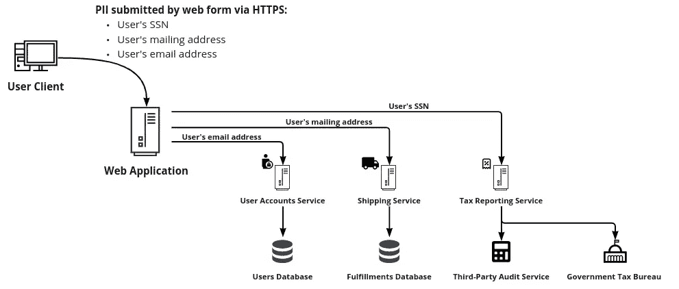

# 处理敏感数据:入门

> 原文：<https://towardsdatascience.com/handling-sensitive-data-a-primer-caed9b408de1>

## 如何了解和管理客户的敏感数据

正确保护敏感的客户数据比以往任何时候都更加重要。消费者越来越坚持认为他们的数据应该得到妥善的保护和管理。监管环境也变得越来越严格，业务需求也变得越来越复杂。公司及其开发团队肩负着在满足这些需求的同时还能取悦用户的重任。

如果这让你陷入困境，我们在这里帮助你快速的数据隐私入门！首先，我们将帮助您了解各种敏感的客户数据以及适用于这些数据的法规。接下来，我们将指导您评估当前对这些数据的处理。最后，我们将提供如何正确管理这些数据的指导。

# 学习

第一项任务是了解您已经在处理哪种敏感的客户数据，以及哪些法规适用于这些数据。三个因素决定了哪些法规适用于给定的一组数据:

*   数据本身
*   贵公司的垂直行业
*   您企业运营的地点

首先，考虑数据本身。根据系统中存储的数据类型，适用不同的法规。

先说**个人信息** (PI)。这可能是最广泛的受管制数据类别，指的是几乎任何与人相关或可能与人相关的东西。PI 受[通用数据保护条例](https://gdpr-info.eu/)(GDPR)[加州隐私权利法案](https://iapp.org/resources/article/the-california-privacy-rights-act-of-2020/)(CRPA)[NY SHIELD](https://ag.ny.gov/internet/data-breach)等法规管制。这些数据的例子包括:

*   IP 地址
*   地理位置信息
*   内部 ID 号
*   人种或种族

**个人身份信息** (PII)是个人身份信息的一个子类，指的是可用于区分或确定个人身份的任何数据。总的来说，适用于保护投资的同样规定也适用于 PII，尽管敏感度不同。PII 的例子包括:

*   名称
*   电话号码
*   驾照或其他身份证号码
*   社会安全号码(社会安全号码比其他 PII 更受管制)
*   生物识别记录

其他类别的私人消费者数据往往是特定行业的。例如，**受保护的健康信息** (PHI)是指所有“可单独识别的健康信息”这在美国由 [HIPAA](https://www.cdc.gov/phlp/publications/topic/hipaa.html) 管理，定义为与以下任何内容相关的任何信息:

*   个人过去、现在或未来的身体或精神健康或状况
*   向个人提供医疗保健
*   向个人提供医疗保健的过去、现在或未来付款

类似地，**非公开个人信息** (NPI)是指由消费者向金融机构提供的个人可识别金融信息，因此是金融服务机构所特有的。在美国，NPI 受[gram-Leach Bliley Act](https://www.ftc.gov/business-guidance/privacy-security/gramm-leach-bliley-act)(GLBA)监管。

最后，某些类型的个人信息受特定于位置的法规管辖。**敏感个人信息** (SPI)由 [CPRA](https://thecpra.org/) 定义。这是指不直接识别个人身份但如果公开可能造成伤害的数据。示例包括 ID 号、地理位置、帐户登录信息和遗传信息。

**私人信息**由 [NY SHIELD Act](https://ag.ny.gov/internet/data-breach) 定义，适用于与纽约居民相关的任何数据。此外，几乎每个隐私法规都有某种位置范围(如欧盟的 GDPR、美国的 HIPAA 等)。

这不是敏感客户数据的法规或类别的详尽列表。然而，考虑到这一点，我们可以看到几个趋势。首先，这些类别中有许多相互重叠。相同的数据可能属于多个法规的范围，必须根据与您的业务相关的所有法规的要求进行处理。第二，相关的法规将在很大程度上取决于你的组织的垂直行业和它运作的地点。最后，即使在给定的法规中，不同的数据也可能具有不同的敏感度。

了解了各种类型的敏感客户数据后，我们现在准备开始评估流程。本评估将回答“我的敏感客户数据现在是如何处理的？”

# 评定

在确定应如何处理敏感客户数据*之前，花些时间评估*当前如何处理*是有帮助的。首先，汇编一个已经被处理和存储的客户数据列表。接下来，您应该执行两项评估:一项技术评估和一项政策评估*

一个**技术评估**告诉你数据在系统中的流向。从数据进入系统的那一刻开始，通过应用程序的各个部分跟踪它。确保考虑应用程序、服务和数据层。此外，记下数据*离开*系统的任何地方，并记下数据去了哪里，比如另一个应用程序或业务报告工具。为当前系统中的每一条敏感客户数据执行此操作。当你继续这样做时，记下任何不一致或处理不当的地方，以便以后解决。

追踪用户 PII 在系统中的流动。图片由作者提供。

通过**策略评估**，您可以审查当前关于数据治理的策略和控制。首先，围绕敏感数据编写您组织的内部文档，并审查书面政策和程序。在此基础上，考虑这些策略是否充分涵盖了贵公司当前处理的敏感数据的类型和数量。该评估的另一个关键部分是确定这些策略是否被有效地执行，或者实际的治理是否偏离了最初的意图。

有了这两项评估，您应该能够自信地描述您的组织当前对敏感客户数据的处理。此外，您将确定需要改进的领域或需要进一步研究的领域。现在，我们准备定义应该对您的敏感客户数据做什么*。*

# 管理

为了正确管理您的敏感客户数据，我们建议采用三步流程。

1.  首先，确定适用于您的法规，以及它们适用于哪些数据子集。
2.  其次，确定哪些策略需要应用于每个敏感数据子集。
3.  最后，根据所需的策略，设计或找到一个技术解决方案来实施和加强这些策略。

对敏感客户数据进行适当的技术治理可以保护敏感数据，而不会使其变得不必要的难以使用。考虑将您的敏感数据隔离在零信任数据隐私库中，而不是简单地将其与您的其他数据并排存储。这种方法允许您的敏感数据通过自己独立的控件得到适当的管理。此外，您的 data privacy vault 可以随着您的组织处理的敏感数据的范围而增长，从而实现可扩展性。

如果您希望在几天而不是几周内达到数据隐私法规的合规性，那么您可以选择使用专用数据隐私保险库 [Skyflow](https://www.skyflow.com/) 。Skyflow 采用零信任方式存储所有类型的敏感数据。数据是隔离的、加密的、安全的，但仍可用于您的业务工作流。vault 中的所有数据都有精确的访问策略，并且可以通过 Skyflow 数据治理引擎轻松定义。所有操作都被记录和审计。Skyflow 为金融科技、医疗保健、PII 等行业提供解决方案，并且符合全球隐私法规。

# 总结

我们已经经历了三个步骤(学习。评估。治理。)来处理您组织中的敏感客户数据。首先，我们浏览了各种类型的敏感数据以及适用于它们的法规。接下来，我们描述了如何评估您的组织如何处理敏感的客户数据。最后，我们勾画了一个适当管理您的敏感客户数据的流程。我们还考虑了像 Skyflow 这样的隔离式数据隐私保险库如何对此有所帮助。

随着新法规的产生和现有法规的加强，敏感数据治理的格局在不断变化。因此，这个过程不是一次就能完成的；它必须随着组织的发展和法规的变化而不断更新。