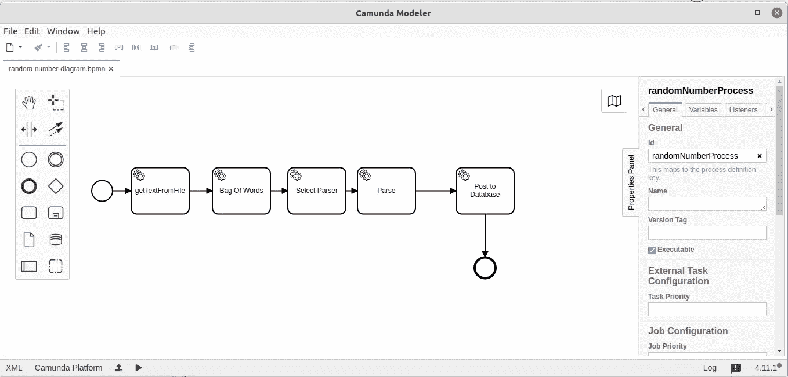
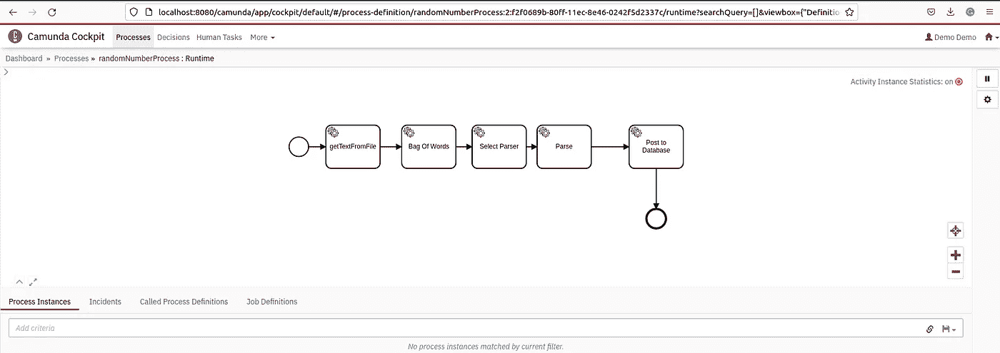
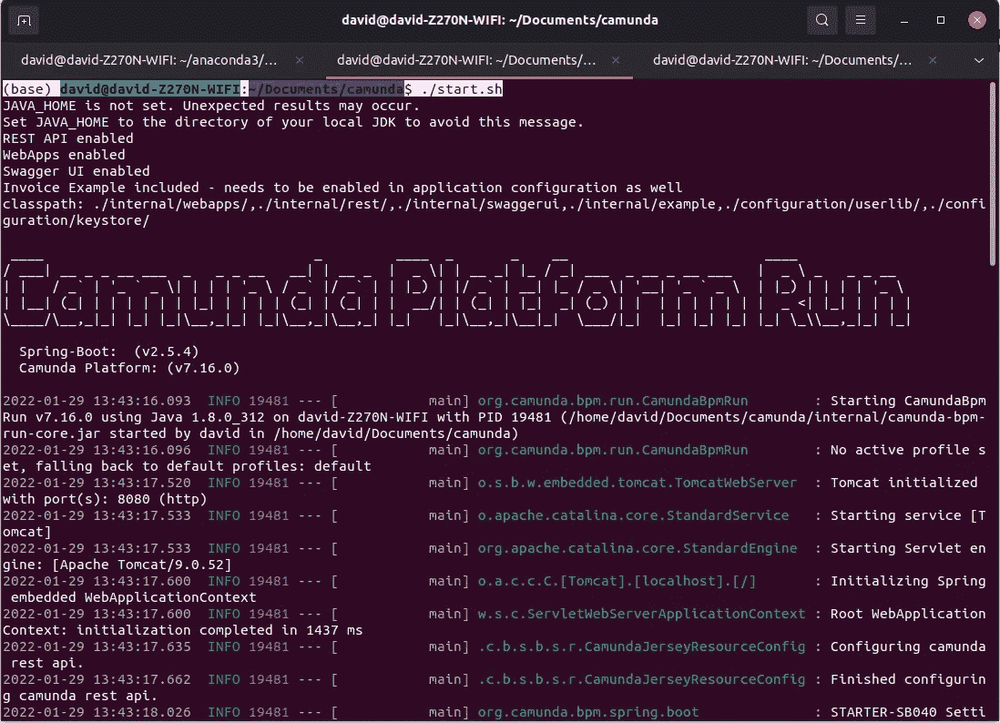

# 处理非结构化数据

> 原文：<https://towardsdatascience.com/handling-unstructured-data-feaeec2a6231>

## 使用可执行的 BPMN 图和工作流引擎走向智能自动化。


[活动发起人](https://unsplash.com/@campaign_creators?utm_source=medium&utm_medium=referral)在 [Unsplash](https://unsplash.com?utm_source=medium&utm_medium=referral) 上的照片

在这一点上，我相信可以说我们已经很好地处理了结构化数据。作为一个行业，我们有大量的工具来处理、存储和分析数据的行和列。我们有更多的工具来绘制视觉效果、创建仪表板和生成报告。每天都有很多关于执行探索性数据分析(EDA)、机器学习、统计和 SQL 主题的文章。每个月甚至有更多的课程和书籍被开发和发布。但是对于那些行列不整齐的文档，比如 PDF 或网页，该怎么办呢？这些也是结构化的，但是它们没有始终如一的行和列结构。在这些上下文中，术语“非结构化”经常被不严格地使用。我相信，真的没有非结构化数据这个概念。一切都有组织的模式；否则，我们作为人类什么都不会懂。

每天都有大量信息在文档中产生、发布、张贴和共享。我每天都收到大量的电子邮件。因此，我开始考虑创建一个环境，让所有这些“非结构化”的文档可以无缝地转化为信息，被处理、读取、解析并组织成“行和列”。我越想越兴奋。请继续阅读，了解我的想法和方法。

# 工作流或管道

我们希望处理文档，通过信息提取读取值，建立数据记录并将记录发送到数据库。用一句话写下这样的要求看起来很容易，但是很难与合作的观众交流和想象。和很多人坐下来，让它发生，那就更难了！

所以我们需要的是流程图或图表。如果我们使用可执行图表而不是 PowerPoint 或 Visio 图像会怎么样？现在，开发人员和非开发人员可以平等地参与讨论。最近，我对可执行的 BPMN ( [业务流程模型和符号](https://en.wikipedia.org/wiki/Business_Process_Model_and_Notation))图表产生了兴趣。下面的图 1 展示了我们用例的 BPMN 图。



图 1:运行在 Ubuntu 上的 [Camunda modeller](https://camunda.com/download/modeler/) 应用程序的截图——图片由作者于 2022 年 1 月提供

图 1 直观地表示了需求，但是也可以部署到工作流引擎，因此是可执行的。让我们先看看这些步骤，然后讨论它们是如何执行的。

## 步伐

*   从文件中获取文本:对于给定的文档，我们需要提取文本
*   单词袋:嗯，不是一个非常用户友好的描述。[单词包](https://en.wikipedia.org/wiki/Bag-of-words_model)是对 n 元文法列表的文本挖掘描述。或许我们可以将描述更新为***‘剖析文本’。*** 我们需要分析每个文档的文本，以找出如何用可用的解析器匹配文本。
*   选择解析器:有些人可能不知道什么是解析器！在我们的例子中，我们将从文本中提取信息。然后，基于文本概要，我们将调用特定的解析策略。
*   Parse:在流程图上可能不是一个有用的描述，但是它从文本中提取了信息。我们也可以将该步骤描述为 ***检索信息*** 或特定内容。
*   提交到数据库:一旦我们提取了所需的信息，我们需要创建一个记录，并根据解析策略将该记录提交到数据库。

通过对图表进行一些调整和更新，我们可以很容易地对从给定文档中提取信息的管道和步骤达成共识。制定一个工作流程图，列出要采取的步骤，这是很好的第一步。我们将此理解为——对于每个文档，创建一个工作流实例，执行并跟踪所有步骤，直到完成。

# 在引擎上执行工作流程图

有一个清晰和一致的可执行图当然很好，但是你还需要执行该执行的技术。因此，举例来说，如果您有一个工作流引擎和服务工作，它会有所帮助。

服务作业需要作为流程模型的助手。在这里，我们谈论这样的事情:-

*   服务作业可能会检测到要处理的新文档
*   服务作业必须检索文档名称，并在工作流引擎上创建工作流的新实例，以启动流程迭代
*   作为工作流的一部分，需要服务作业来处理和执行外部任务。

工作流引擎实现工作流图并管理每个任务的完成状态。图 2 展示了部署到工作流引擎的工作流图。



图 2:[cam unda 工作流引擎](https://camunda.com/products/camunda-platform/)的截图，带有部署的 BPMN 图——图片由作者于 2022 年 1 月提供

此时，我们有了一个部署在工作流引擎上的业务流程模型图。如下图所示，启动工作流引擎就像执行。蝙蝠还是。提供了 sh 文件。

```
(base) david@david-Z270N-WIFI:~/Documents/camunda$ ./start.sh
```

在生产环境中，您可能希望使用 [systemd](https://medium.com/@benmorel/creating-a-linux-service-with-systemd-611b5c8b91d6) 或类似的策略创建一个服务，并让该服务在引导时启动，在失败时重启。使用 crontab 启动引擎通常是可行的，但是如果没有 systemd 提供的监控或服务重启模式，服务通常会变得不可用或不稳定。

当引擎启动时，您将获得大量日志数据，如图 3 所示



图 3:作者 2022 年 1 月拍摄的 Camunda 工作流引擎启动截图

您可以导航到 localhost:8080 以查看工作流引擎驾驶舱。

随着引擎的运行，我们现在已经在引擎上部署了一个可执行的 BPMN 图，一切都在等待文档的到来。我们现在需要一份服务工作和一份文件。工作流程图可以定义各种任务，例如:-

*   人工任务:需要人工交互和确认任务完成的表单、web UI 或其他动作。手动离线活动。
*   外部任务:外部服务任务提供服务并确认任务完成。
*   内部任务:内置任务或决策可以由平台在没有帮助的情况下执行。

为本文部署的图是基于外部任务的，因此工作流引擎将不会找到任何工作，直到服务作业创建了一个实例，并且每个任务都分配了一个外部工作器。图 4 展示了外部任务的参数。


图 4:作者 2022 年 1 月发布的 BPMN 图和外部任务的截图

图表中的每个步骤或任务都有一组参数。实现被定义为外部的，主题名是外部服务作业的标签。每个具有主题名称的外部任务都需要一个服务作业。因此，我们在图 4 中看到,“getTextFromFile”是一个外部任务，通过主题名“getTextFromFile”引用。哦，亲爱的，不是用户友好的，但向前！

# 服务工作

就这一点而言，架构很简单。绘制 BPMN 图是客户端笔记本电脑或台式机的一项活动。运行工作流引擎可通过不同方式实现，例如:-

*   在本地，比如本文中
*   使用第三方或专有供应商的 SaaS 托管版本
*   启动云实例、AWS 保留的虚拟机或其他 spot 实例，并托管您自己的服务器。重要的是，使用 systemd 定义的服务安排引擎启动，管理防火墙安全和备份。

因此，如果您有一个独特的工作流引擎服务器或主机，那将是最好的。此外，至少需要两种类型的服务工作，它们是

*   检测新文档并在工作流引擎上创建实例的作业。您可能正在轮询 SharePoint 列表，监视系统目录中的文件更改，或者对数据库触发器做出反应。将电子邮件接收到邮箱中可能会使用服务作业来注册工作流实例并触发工作流处理。
*   与工作流引擎连接并为这些外部任务提供服务的作业

如果您有运行时环境、凭证、API 密钥、防火墙访问和其他元素来在生产环境中部署服务作业，这将会很有帮助。为了便于说明，我们将讨论本文工作流中的几个外部任务。

我们需要一个函数从给定的文档中获取文本。您可能开始问自己什么类型的文档，我们是否需要一种方法来用不同的模块或阅读器打开特定的文档？好吧，我希望你问的是这些问题，这些都是很棒的问题。

上面显示的函数“get_data_from_given_path”值得进行一些讨论。它采用一个参数 file_name，该参数的数据类型为“pycamunda.variable.variable”。我们正在使用 Python Camunda 客户端，并使用工作流实例的数据结构。

```
textback = p.from_file(file_name.value)
```

那行代码是伏都教的吗！p 是什么？我们需要讨论变量名、清晰可读的代码，以及更好地让人们以后阅读。p 是在代码文件顶部的模块导入阶段定义的。

```
from tika import parser as p
```

p 代表 [Apache Tika Python](https://tika.apache.org/) 包装

所以我们将文件传递给 Apache Tika，它会计算出我们传递的是什么类型的文件，以及如何为我们获取文本。一行代码，我们就能得到文本！Tika 可以返回文档内容和/或文件级元数据。在 Tika 中，有不同的操作，如语言检测、语言转换和 OCR。一种技术是调用语言检测，并基于返回代码；您知道文件是否包含图像或文本，因此需要 OCR，Tika 可以处理。Tika 与 Tesseract 集成，可从图像中恢复文本。

其余代码行决定返回数据结构，并确保字符串值不超过 Camunda 引擎中的最大字符串长度(4000 个字符)

```
if len(text) < 4000:
        return {'text': text}
    else:
        return {'text': text[0:3800]}
```

该函数将返回一个字典或键-值对，键为“text ”,字符串变量不超过 3，800 个字符。这不是一个特别聪明的捷径，但是我们可以将数据类型从字符串类型改为 JSON 对象，以避免数据类型的限制。显然，从简单的字符串类型转移到更复杂的结构会引入更多的处理和代码。

使用 Apache Tika 和 Python 函数，我们可以从文件中获取文本，而无需设计和处理不同的文件格式。Apache 项目和开源维护者万岁！您确实需要阅读文档并构建错误处理。许多文档类型是可用的，并且是很少使用的旧格式的遗产。

```
def bag_of_words(text: pycamunda.variable.Variable) -> typing.Dict:
    bow = textProcessor.tokenize(text.value)
    print("bow")
    return  {'BoW' : bow}
```

下一个函数是“单词包”函数。它在调用中使用一个工作流变量，并利用 textProcessor 对象方法 tokenize，从文本中创建一个标记([n-gram](https://en.wikipedia.org/wiki/N-gram))或单词列表。textProcessor 对象是我的 NLP 类的一个实例，你可以在 Github [上找到它。](https://github.com/CognitiveDave/nlp/blob/main/nlp.py)

这两个函数是外部 Python 任务的示例。外部任务可以根据用例用不同的语言编码。接下来，我们需要将这些服务作业粘附到工作流图和引擎上。

```
worker.subscribe(
        topic="getTextFromFile",
       func=(get_data_from_given_path),
        variables=['file_name']
        )

worker.subscribe(
        topic='BagOfWords',
        func=bag_of_words,
        variables=['text']
    )
```

BPMN 图中的主题“getTextFromFile”通过订阅 BPMN 任务主题连接到函数 get _ data _ from _ 给定 _path。现在，您可以开始看到服务工作的构建。使用工作人员和主题订阅来执行粘附到工作流引擎的任务的函数。该模型类似于使用 MQTT 和其他消息代理的 Pub/Sub 模型。

我在本文中使用的工作对象是由[彼得·克劳克](https://medium.com/u/eb4cfdd77b0d?source=post_page-----feaeec2a6231--------------------------------)开发和解释的。如果你想了解工人，我建议你读彼得的文章，链接如下。工作人员连接到工作流引擎，收集感兴趣的可用外部任务，使用锁更新工作流引擎以保留任务，然后向引擎提供完成状态和返回值。工作人员必须始终与引擎保持联系，并轮询工作流实例以查找要处理的新任务。

但是。我们如何创建工作流实例或处理单个文档？考虑以下代码。

首先，第 1 行是要处理的文件列表，在本例中是四个测试 PDF 文档。我可以使用操作系统模块，直接从文件夹中获取文件，轮询 SharePoint 列表或任何数量的组合，包括 S3 桶。

在第 7 行，我们有工作流引擎的 URL。第 11 行和第 12 行遍历文件列表，并为每个文件创建一个工作流实例。第 14 行实际上是将实例发送到工作流引擎。

在不涉及太多细节的情况下，我们可以使用 Python 谈论 BPMN 图、工作流引擎和服务作业，让我们能够对文档执行自然语言处理，而不用担心服务器性能或阻塞线程。事实上，将 Apache Tika 与 OCR 相结合，我们可以从文档中获取文本，而不用担心文档的格式。

无可否认，从文档中获取文本并将其转换成单词包(n-grams)是手头任务中最简单的部分。然而，从文本中提取信息并将该信息映射到数据库记录格式要复杂得多。

## 选择解析器

我们没有讨论工作流中的两个后续步骤，因为它们必须为给定用例中的特定文档流构建。

当确定给定文本流的正确解析器时，开发人员和设计人员有许多不同的机制和选项。工作流引擎支持决策。我们可以基于文档元数据建立一个规则，并且如果有少量具有可靠元数据标记的良好描述的文档类，那么定义一个决策步骤，这是非常简洁和理想的。但是，如果存在定义不完善的文档类或元数据，那么选择合适的解析器可能是一项基于带有下拉选择器的表单的人工任务。任务和参与者的这种强大组合允许某些问题浮出水面进行人工干预，但仍然保持最高水平的自动化。

尽管如此，将文本流映射到预定义的解析器并不是真正的问题。更确切地说，为一类文档预先定义信息提取策略是很有挑战性的。基于 OCR 的发票处理就是一个例子，工程师记录了良好的准确性，这是由于使用标准软件生成大致相似的发票布局的组织很少使用变体。同样，公用事业账单也遵循类似的模式。然而，阅读法律合同更复杂的是提取某些条款、条件和义务。

## 从语法上分析

如果您成功地预定义、测试和验证了一个信息提取函数，那么调用解析器需要在服务作业中进行编排，以便根据前面的步骤将文本路由到正确的函数。工作流引擎和服务作业策略将运行良好。

## 构建数据记录并将其发布到数据库

我们开始从非结构化范式过渡回结构化领域。我们可以将提取的信息编码到传统的行和列中，甚至用 JSON 结构表示信息，从而允许对文档数据库(MongoDB 或 CouchDB)进行 CRUD 操作。我更喜欢在解析器函数中进行处理，并在一个离散的步骤中返回要提交的数据库对象。

# 关闭

从非结构化文档中提取信息是一个大课题，而编排自动化管道是极其复杂的。在这篇文章中，我分享了一个让我感兴趣和兴奋的方法。以前，我对可执行的 BPMN 声明和工作流引擎的优点不自信，但是经过大量的思考、研究和原型制作，我更加自信了。

我使用 Celery workers、REDIS、RabbitMQ、Apache Spark 和许多线程和集群并行处理的变体评估了其他方法。

写这篇文章对我来说是一次旅程，是对不同可用方法的调和，我对 ***智能自动化*** 的整个概念感到更舒服。这里描述的方法利用了自然语言处理、OCR 和业务规则确定。一旦这些模型被验证和批准使用，使用分类器或其他机器学习模型很容易作为一个步骤插入到 BPMN 图中。

如果您对智能自动化、从文档中提取信息或工作流程编排有什么看法，我很想听听您的想法。

# 参考资料和原始材料

## 彼得的文章链接

[](https://medium.com/@klauke.peter/implementing-an-external-task-worker-for-camunda-in-python-566b5ebff488)  

## 使用 Apache Tika 转换文档

[](https://medium.com/@masreis/text-extraction-and-ocr-with-apache-tika-302464895e5f)  [](https://medium.com/mlearning-ai/convert-any-type-of-document-to-text-with-apache-tika-using-python-api-ff306c467b3)  

## 替代方法

拥有 RabbitMQ 的芹菜工人可以结合 Apache Tika 来实现类似的工作流，但是没有可执行的 BPMN 图。

[](https://betterprogramming.pub/background-processing-with-rabbitmq-python-and-flask-5ca62acf409c)  

本文中对特定供应商或第三方的引用并不表示认可，所有讨论的技术都基于可用的开源软件。专有工作流引擎提供了重要的功能，如日志和审计跟踪，这些功能更适合集成到受监管的行业中，如 GMP、Sarbanes Oxley 或金融服务监管环境。在部署智能自动化解决方案之前，务必评估控制和监管要求。

[](https://cognitivedave.medium.com/membership) 