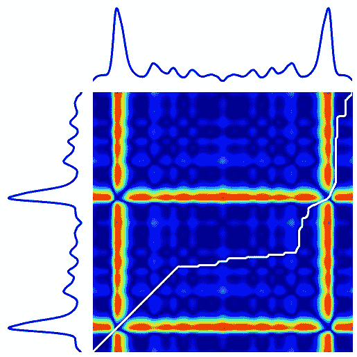

# 使用机器学习和 Python 进行气候时间序列聚类实践

> 原文：<https://towardsdatascience.com/hands-on-climate-time-series-clustering-using-machine-learning-with-python-6a12ce1607f9>

## 下面介绍如何用很少几行代码使用机器学习对无标签的时间序列进行分类。

乔纳森·鲍尔斯在 [Unsplash](https://unsplash.com/s/photos/weather?utm_source=unsplash&utm_medium=referral&utm_content=creditCopyText) 上的照片

T 何的第一堂机器学习课是这样开始的:

> 在机器学习场景中有两种任务:分类和回归。

假设你有一张图片，用数学术语来说就是一个矩阵，你想说这是一只猫还是一只狗的图片。这是一个**分类**问题，因为你当然是在对一个输入对象进行分类。

另一方面，给定一个输入对象，您可能想要获得一个**实值**。例如，给定一所房子某些特征，你可能想猜测它的价格。

这是一个非常简单的介绍，理解机器学习是关于什么的是有效和有见地的。隐藏的是，当我们考虑所谓的**监督机器学习时，这种区别是真实的。**

尽管如此，机器学习算法的一个可能不太著名的应用是**无监督的**和对应的**分类**操作，对于**未被标记为**的数据，该操作被称为**聚类。**

给定一个对象，你想对它进行分类，却不知道它可能有什么标签。让我们说得更清楚些。

想象一下，你是一个**外星人**，你在一家杂货店里。
即使你是**外星人**(我不知道是不是真的:)，你也可能会认出**剃须刀片**和**苹果是不同的。这意味着你在对物品进行“分类”,即使你对它们的标签一无所知。
这就是**集群**的作用。**

现在，我们有多种机器学习算法来完成聚类工作。最广为人知的叫做[**K 的意思是**](https://en.wikipedia.org/wiki/K-means_clustering) **。**我们来看看吧。

# 1.k-均值算法

好的，首先，我要说的是，有人非常详细地解释了 K 的意思，这不是我在这篇博文中打算做的。尽管如此，让我来介绍一下 K 均值算法的步骤。

看下面这张 GIF:

学分:Chire-Own work，CC BY-SA 4.0，[https://commons.wikimedia.org/w/index.php?curid=59409335](https://commons.wikimedia.org/w/index.php?curid=59409335)

想象一下，就像我们说的，我们一开始没有任何标签。所以我们只有 N 个数据点。每个数据点由两个值组成:x 和 y。

现在(**第一步**)我们在这个二维空间内随机定义三个(一般为 k 个)点。我们称这 k 个数据点为“**质心**”。
**第二步**是根据数据点和三个(一般也是 k)质心之间的距离对每个数据点进行“分类”。假设这个新的点 **x** ，我们有三个质心之间的距离值。让我们称这个距离值为 D1，D2 和 D3。我们根据 d_1，d_2，d_3 的 argmin 把这个点分为 1，2，3。比如如果 d_1 < d_2 < d_3 或者 **d_1 < d_2 > d_3 就会归类为 **1。** 接下来我们要做的(**第三步**)是通过考虑分类为 1、2 或 3 的所有点的平均值来更新这个质心的值。
第**第四步**是返回到**第二步**L 次，其中 L 为迭代次数。**

# 2.时间序列聚类

当然，K 均值算法也可以应用于**时间序列**。我们唯一要考虑的是数据集的维数是 M，其中 M 是时间序列的长度。不管怎样，我们可以做得更好。:)

首先，Python 中有一个库叫做 [**tslearn**](https://tslearn.readthedocs.io/en/stable/index.html) **。**他们所做的是将预处理步骤应用于时间序列，并将众所周知的算法应用于时间序列。其中一个算法是我们到目前为止讨论过的**聚类**算法。

为什么不能直接应用 K 均值呢？有一个问题。如果两个时间序列相同，但其中一个移动了一个单位，则使用传统方法(如均方误差或平均绝对误差)计算的**距离**仍然很大，即使两个时间序列之间的差异基本上为 0。

我们希望计算“最短路径”并将其称为两个时间序列之间的距离，而不是以传统方式计算距离。
这种操作被称为 [**距离时间扭曲**](https://en.wikipedia.org/wiki/Dynamic_time_warping) ，其工作原理的实际演示可在下图或这里的 [tslearn 文档](https://tslearn.readthedocs.io/en/stable/auto_examples/metrics/plot_dtw.html)中找到:

图片由作者制作，使用的代码可以在[这里](https://tslearn.readthedocs.io/en/stable/auto_examples/metrics/plot_dtw.html)找到

# 3.气候时间序列聚类

在这篇博文中，我们将使用上文解释过的距离时间弯曲算法对气候时间序列进行聚类。特别是，我们将有世界上一些主要城市的平均温度。我们希望对所有时间序列(2012–2017)中天气相似的城市进行聚类。

数据集可以在[这里](https://www.kaggle.com/datasets/selfishgene/historical-hourly-weather-data)找到。可以免费下载并用于商业目的(更多信息[请点击](https://opendatacommons.org/licenses/odbl/))。

让我们开始玩吧！

## 3.0 导入库

## 3.1 数据预处理

让我们导入数据集并查看一下:

让我们绘制一个时间序列:

对于我们正在使用的算法来说，时间序列当然太混乱了:这需要很长时间。出于我们的目的，让我们对数据集进行欠采样:

很好看，都准备好了:)

## 3.2 集群

现在，预处理可能有点漫长和无聊，但一如既往，应用模型需要两行代码。

这是:

我们决定用 k=3。
让我们将拟合的模型应用于我们的数据集:

让我们定义我们的时间步长数组:

太好了。让我们画出结果:

这实际上是信息丰富的:

*   **第一**级范围很广，但好像总是小于等于 310。一般来说，最低值似乎在 260 左右(250 左右的值似乎是异常值)。
*   **第二类**量程较小，但数值明显较大；较低和较大的数值均大于第一类对应的数值
*   第三个类恰好和第一个类似，但是我们在高温下的值比在低温下的值多。

我同意这些结论可能不明显。其实我作弊了一点点:)。在查看了三个类别的直方图后，我找到了这些解释:

为什么我们说这个信息量大，不明显？嗯，因为这些城市在趋势和范围上看起来很相似，但在位置上并不接近。
另一方面，如果你只是在位置上做一个 K 的意思(像这样):

然后我们看到相应的直方图:

没什么意义吧？
这是因为在地理位置上以某种方式“聚集”在一起的城市在气候上并不一定具有相同的行为。我们都知道气候远比这复杂。

# 6.结论

如果你喜欢这篇文章，你想知道更多关于机器学习的知识，或者你只是想问我一些你可以问的问题:

A.在 [**Linkedin**](https://www.linkedin.com/in/pieropaialunga/) 上关注我，在那里我发布我所有的故事
B .订阅我的 [**简讯**](https://piero-paialunga.medium.com/subscribe) 。这会让你了解新的故事，并给你机会发短信给我，让我收到你所有的更正或疑问。
C .成为 [**推荐会员**](https://piero-paialunga.medium.com/membership) ，这样你就不会有任何“本月最大数量的故事”，你可以阅读我(以及成千上万其他机器学习和数据科学顶级作家)写的任何关于最新可用技术的文章。