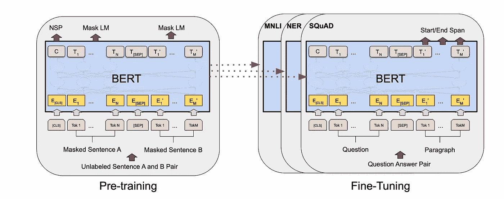
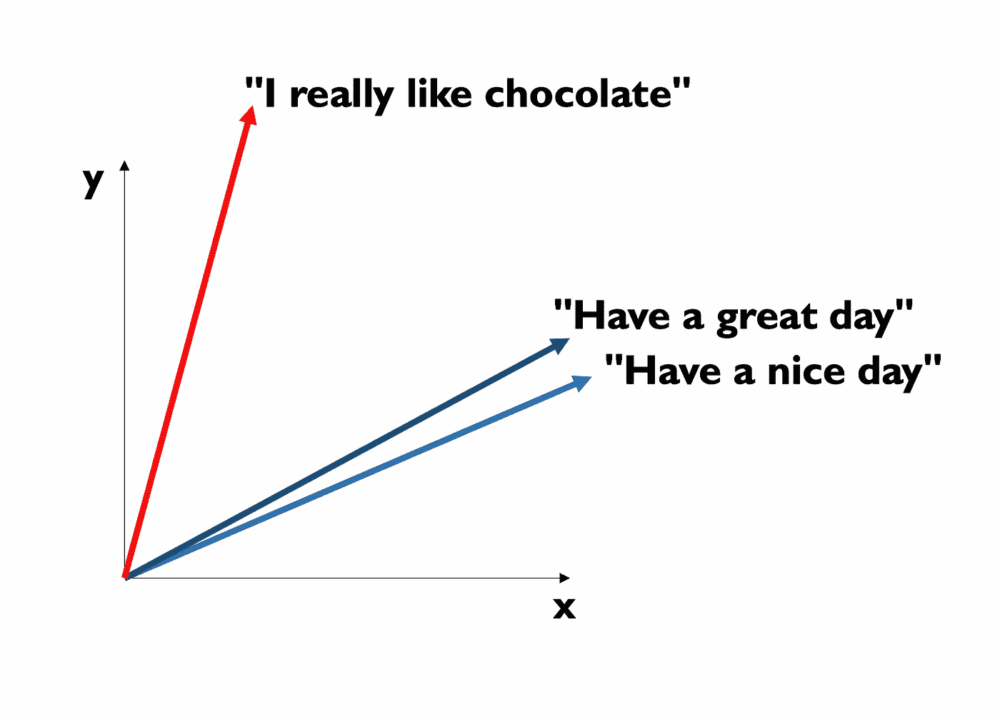

# 基于 Python 的实用内容推荐系统

> 原文：<https://towardsdatascience.com/hands-on-content-based-recommender-system-using-python-1d643bf314e4>

乔纳斯·雅各布森在 [Unsplash](https://unsplash.com/s/photos/help?utm_source=unsplash&utm_medium=referral&utm_content=creditCopyText) 上拍摄的照片

# 基于 Python 的实用内容推荐系统

## 以下是如何用 Python 通过几个步骤创建一个基于内容的推荐系统

人工智能最令人惊讶和着迷的应用之一无疑是推荐系统。

简而言之，推荐系统是一种工具，它根据你已经看过和喜欢的内容向你推荐下一个内容。像 **Spotify、网飞**或 **Youtube** 这样的公司使用推荐系统向你推荐你已经看过或听过的下一个视频或歌曲。

建立推荐系统的想法肯定不是昨天才产生的。2006 年，网飞宣布奖励研究团队 100 万美元，奖励他们在给定一些测试数据的情况下，能够构建出最好的推荐系统。这叫做“ [**Netflix 奖**](https://en.wikipedia.org/wiki/Netflix_Prize) **”，**对了。

由于这个想法相对来说比较古老，所以有一些疯狂的好的推荐系统，他们考虑了很多变量和关于用户的具体信息。当然，网飞的推荐系统并不是真正的开源，即使我们有一些关于他们如何工作的想法，我们也没有他们预先训练好的可以使用的神奇模型。

无论如何，有一种方法可以让推荐系统非常简单，易于运行，并且实际上非常有效！

在这本笔记本中，我将向您展示如何使用几行代码和一些关于**机器学习**和**代数**的领域知识来构建基于内容的推荐系统。

让我们开始吧:)

# 0.图书馆

这是让它工作所需要的:

> 附言:我安装了 KMeans 来进行非监督学习方法，但我没有在本笔记本中使用它，所以如果你没有它，就不需要安装它:我们不会使用它。

# 1.数据集

我们首先需要的当然是**数据集**。我在这里找到了数据集[，它基本上是从 **IMDb** (是的，著名的](https://www.kaggle.com/harshitshankhdhar/imdb-dataset-of-top-1000-movies-and-tv-shows)[网站](https://www.imdb.com))中提取的集合。在这个集合中，我们有一个电影列表和它们相应的特征。我们正在使用的功能有:

*   电影的**概述**(即简短描述)
*   其**标题**
*   它的**流派**(其实每部电影都有多个流派)

让我们来看看:

## 1.1 导入它:

## 1.2 查看它:

# 2.方法

当处理文本数据时，首先要做的是将文本转换成数字。更准确地说，我们正在将一串文本转换成一个**向量**。

但是我们是如何做到的呢？我们应该如何聪明地转换字符串，使向量代表文本的含义？
嗯，这是一个非常好的问题，当然要找到一个最佳答案并不容易。尽管如此，还是有真正好的模型(或者更准确地说是**变形金刚**)，比如 [**BERT**](https://arxiv.org/pdf/1810.04805.pdf) ，它们能够明智地将句子转换成文本。如果你对细节感兴趣，这张[纸](https://arxiv.org/pdf/1810.04805.pdf)实际上是一张杰作，而且如此清晰。

BERT 预训练和微调的想法。图片摘自伯特的论文([此处](https://arxiv.org/pdf/1810.04805.pdf))

但是为什么我们首先要把文本转换成向量呢？

嗯，因为现在我们有了**向量**我们能够做所有你通常在向量上做的操作:)

假设你正在做一个分类任务，你想使用[支持向量机](https://en.wikipedia.org/wiki/Support-vector_machine)。当然，你需要有**个向量**来做这件事。因此，如果你必须对一个文本进行分类，你首先要将文本转换成一个向量，然后应用 SVM 算法。

在我们的例子中，我们将使用向量化测试来寻找两个向量之间的相似性。我们的推荐将是与我们正在考虑的向量最相似的(5)**。**

**下面是一个例子:**

****

**我制作的图像**

**假设 x 和 y 是两个分量(我们会有比两个多得多的分量)。如果一部电影谈论科学、太空和火箭，而另一部或多或少谈论相同的东西，我们希望这两个向量接近，就像蓝色的向量一样。另一方面，如果另一部电影是关于一个爱情故事，我们会期望这个向量很远，像红色和蓝色的。**

**所以我们要做的是:**

1.  **使用 **BERT** 将我们的文本转换成矢量**
2.  **得到一个固定电影(向量)和所有其他电影的**余弦相似度**(两个向量夹角的余弦)**
3.  ****挑选余弦相似度最大的电影(矢量)。我们将挑选其中的 5 个。****

**就这样:)**

**我希望这听起来已经很简单了，但是当我告诉你怎么做的时候，它会变得更加清晰。所以让我们开始吧！**

# **3.该方法**

## **3.1 从文本到矢量:**

**下面是你如何将一个**文本**转换成一个**向量**:**

## **3.2 PCA(可选)**

**我现在使用一种非常已知的方法来降低我们数据集的维度(**主成分分析**)。它只是画出图来，给你一个文本-向量转换结果的概念，所以你可以安全地跳过它。**

## **3.3 余弦相似度和推荐函数**

**下面是如何计算**余弦** **相似度**(一行代码)和**函数**，我们将用它来获得我们的推荐:**

# **4.结果呢**

**让我们**剧情**一些推荐:**

**我们可以欣赏一些非常酷的东西。算法识别出**教父、教父 II 和教父 III 是相似的！****

**让我们更深入地探索一下。**

**所以，如果你刚刚看完《黑暗骑士》,它会给你《小丑》、《肮脏的哈利》、《蝙蝠侠诞生》、《银河护卫队》和《死亡笔记》!我发现这些建议非常准确，尤其是如果我们考虑到算法非常简单的话！**

**我们可以通过查看**图**来了解这些建议的准确性:**

**所以，**你看过的电影有以下的剧情**:**

> **“当被称为小丑的威胁对哥谭市的人民造成破坏和混乱时，蝙蝠侠必须接受一次最大的心理和身体测试，以测试他对抗不公正的能力。”**

****第一部推荐的电影有这个情节**:**

> **“在哥谭市，精神有问题的喜剧演员亚瑟·弗莱克被社会忽视和虐待。然后，他走上了革命和血腥犯罪的恶性循环。这条路让他直面他的另一个自我:小丑。”**

**所以他们其实挺像的！**

**我们甚至可以欣赏到推荐的电影也有相同的类型:**

**所以你看的电影是一部**剧情**和**家庭**电影，而推荐的电影是:**

1.  ****戏剧****
2.  ****剧情****
3.  ****剧情****
4.  ****戏剧、历史、战争****
5.  ****冒险、历史、家庭****

**同样，这是一个非常简单的算法的质量指标！**

****最后，这是你将你的推荐存储到数据帧中的方式:****

# **5.结论**

**我知道有很多方法可以得到一个推荐系统。我们这里的假设是，我们推荐的东西与你已经看过的东西**相似**，但是也许你想**给用户一个惊喜，所以它不应该像我们建议的那样相似。****

**此外，我们只考虑一部电影，我们并没有真正考虑用户的口味，这只是关于电影本身。**

**换句话说，这只是众多方法中的一种，而且实际上非常简单。尽管如此，我发现这些建议非常准确和有趣，所以这是一个有效的方法，而且从计算上来说，非常便宜！**

**写这篇文章让我很开心。我希望你读它的时候有很多乐趣。如果你有任何问题或意见，我很高兴在这里听到他们:【piero.paialunga@hotmail.com 。**

**再见:)**