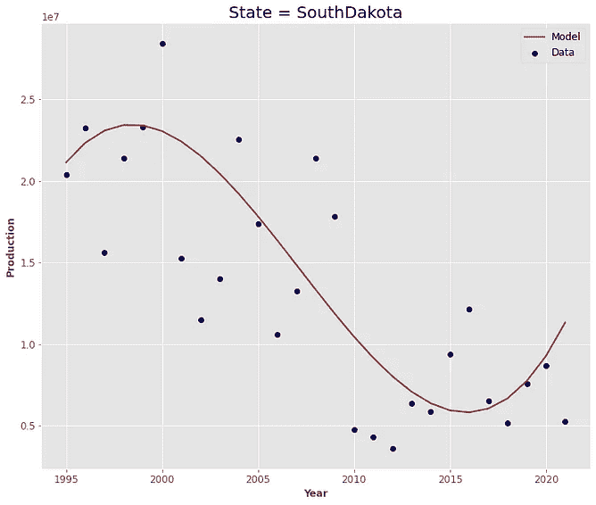
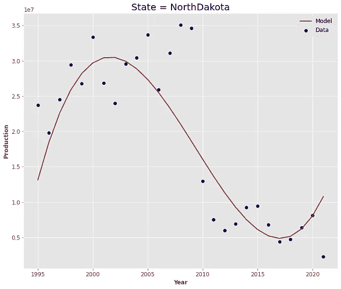
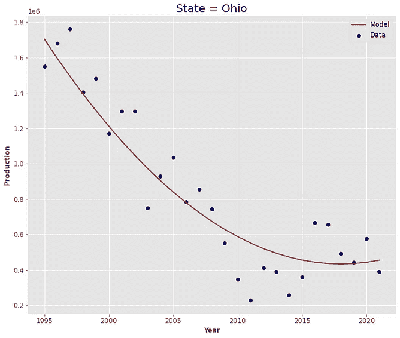
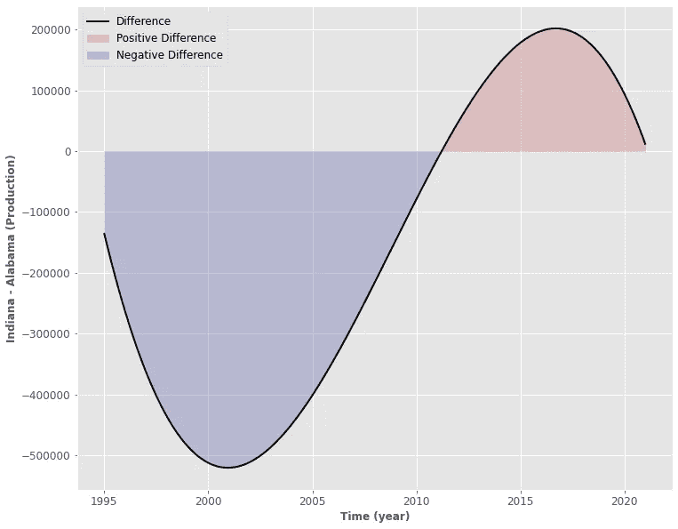
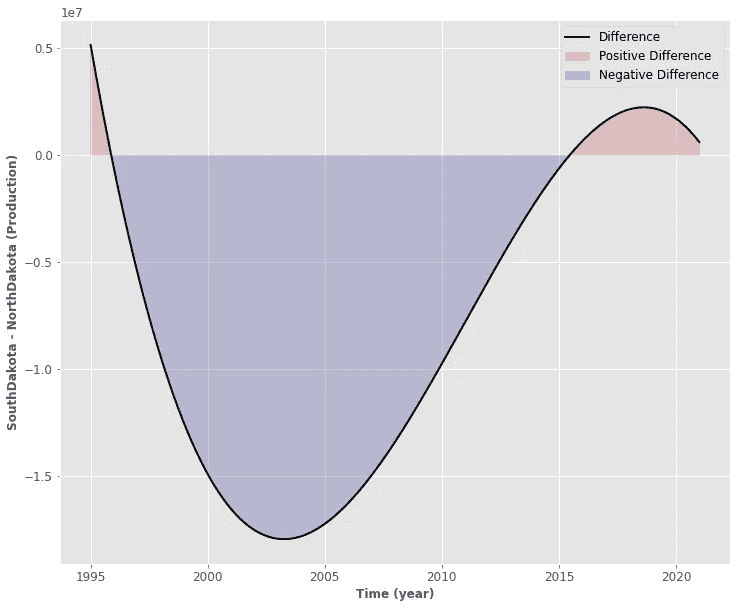
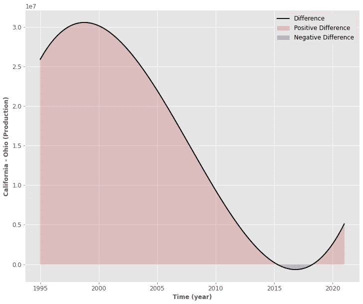
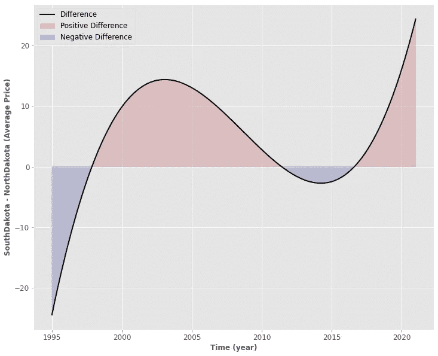

# 使用 Python 对美国蜂蜜消费进行实践探索性数据分析

> 原文：<https://towardsdatascience.com/hands-on-exploratory-data-analysis-on-honey-consumption-in-the-usa-using-python-ddfb8be519d7>

## 这是我对美国蜂蜜的探索性数据分析，用了几行代码

照片由 [Aaron Burden](https://unsplash.com/@aaronburden?utm_source=unsplash&utm_medium=referral&utm_content=creditCopyText) 在 [Unsplash](https://unsplash.com/s/photos/Bee?utm_source=unsplash&utm_medium=referral&utm_content=creditCopyText)

> **免责声明**:这篇文章可能会冒犯那些关注我并阅读这些故事的素食主义者。虽然我对此提前表示歉意，但请注意，这个练习并不是为了促进蜂蜜的使用、消费或销售。

在下面的文章中，我们将对美国蜂蜜的生产和消费进行探索性的数据分析。

特别是:

1.  我们将从查看数据集开始
2.  我们将定义我们将在分析过程中使用的 **Python 环境**。
3.  我们将**清理**我们的数据
4.  我们将执行**时间独立**和**时间独立**分析
5.  我们将查看**相关值**
6.  我们会玩得很开心。:)

那我们开始吧！

# 0.关于数据集

EDA 的第一步根本不涉及任何代码，只是基于对数据的定性描述。
首先，数据集来自[美国国家农业统计局，USDA](https://www.nass.usda.gov/) ，许可为 [CC0:公共领域](https://creativecommons.org/publicdomain/zero/1.0/)(开源)。描述说:

> “这个数据集提供了对蜂蜜不同状态**的**生产**、**需求**和**供应**的洞察。蜂蜜是蜜蜂制造的天然产品。”**

这正是我们要做的:对不同州的蜂蜜产量和价格进行探索性的数据分析。

数据集的另一个重要特性是名为“year”的列
这意味着对于给定的州，我们有给定年份的平均产量和平均价格**。正如我们将看到的，这将使我们能够比较各州的产量和价格，并了解它如何随着时间的推移而变化。**

听起来很刺激，对吧？🙃

让我们从代码开始。

# 1.导入库

在开始分析之前，我们必须导入我们将要使用的库。很多分析会用到一些绘图，所以我也附上了我对绘图部分的偏好。如果你不喜欢美丽的情节，请随意摆脱它😏

# 2.导入数据集

让我们导入并显示第一个条目:

很好，让我用魔法数据。数据信息 ***()* :**

我们可以看到，除了**状态**列之外，所有列都是**数字**。这很好😮‍💨

正如我们所看到的，“state”列是告诉我们实例所在的美国州(阿拉巴马、亚利桑那、阿肯色州等)的列。).

**产量**列、**平均价格**和**年份**列是我们在这个具体示例中最常使用的

*1.Kaggle 用户告诉我们**产量**是菌落数量和每个菌落产量的乘积。从广义上讲，考虑到我们正在使用的空间和我们有多少蜂群，我们生产了多少蜂蜜。所以我想说这个名字很简单，但是很明确。这是蜂蜜产量的一个恰当的概括。*

*2.**平均价格**是指基于扩大销售的每磅平均价格。*

> **请记住，这种方法很容易推广，只需更改列字符串，正如我们将看到的那样。*

*3.数据集中的所有实例都与数据集的**年列**中指示的特定**年**相关。*

# *3.动手探索性数据分析*

## *3.1 关于美国*

*第一个问题*

> *我们有数据集中的所有州吗？*

*为了回答这个问题，我已经从[这个 GitHub 文件夹](https://gist.github.com/JeffPaine/3083347)下载了数据集列表(多懒啊，对吧？)，将其命名为 ***状态*** ，并将其与我们数据集中的状态列表进行比较:*

*所以看起来我们遗漏了很多州，但事实并非如此。我给你看下面这个情节:*

*我们真正缺失的状态是:*

1.  ***阿拉斯加***
2.  ***康涅狄格州***
3.  ***哥伦比亚特区***
4.  ***特拉华州***
5.  ***马萨诸塞州***
6.  ***罗德岛***

*所有其他状态实际上都在数据集中。唯一的问题是，在原始列表中我们有“NewYork”(空格)，而在我们的数据集中，它变成了“New York”(非空格)。**

> **要查看这种效果，请查看上面图中的 xticks。*

***现在，为什么我们没有这些状态？**真正的答案当然是不知道。*

*我推测在那些州我们没有足够的蜂蜜产量。这一假设被**证实**，因为如果我们看一下[美国农业部的报告](https://downloads.usda.library.cornell.edu/usda-esmis/files/hd76s004z/7m01cp956/df65wc389/hony0322.pdf)，这 6 个州都在“其他州”之内，并且加起来的产量比数据集中的其他单个州要小。*

## *3.2 时间独立分析*

*好吧，让我们暂时忘记时间栏。我们想要得到所有值的汇总。为此，我们可以使用以下函数:*

*让我给你看一些例子:*

1.  *俄亥俄州(我的家乡❤)*

*2.**加州***

*好，举个例子，我们可以画出每个州的平均产量和平均价格。如果我们这样做，我们可以获得哪个州的**产量最大**(或最小)**以及哪个州的**平均价格最大**(或最小)**的信息。为此，我们必须使用我们定义的 summary_state 函数和以下代码块:*****

1.  *******十大生产州**:*****

*****2.**平均价格前 10 名的州**(最贵):*****

*****3.**概要图:*******

*****我们可以看到的是，平均数的(相对)价格范围小于生产的价格范围。那大概是因为产量和你所在的地方有严格的关系(你不能强迫蜂蜜生长在阿拉斯加)。另一方面，价格与很多商业因素有关，是由男人而不是自然选择的。*****

*****现在，我会立即停止做这个分析，因为我感觉它会把我们引向错误的结论。事实上，正如我们将看到的，我们拥有的数据集确实是极其依赖于时间的。这种按时间平均的研究可能会让我们丢失很多重要的分析信息。*****

## *****3.2 时间相关分析*****

*****让我们随机选取三个州，比如俄亥俄州、加利福尼亚州和纽约州，绘制出年与生产线图。*****

*****Mh。**幅度上的巨大**差异。有意思。*****

*****让我们对平均价格做同样的事情。*****

*****现在**那个**就有意思了。就我们数据集的平均价格而言，我们有一个巨大的下降。有两种可能的解释。*****

*****A.我们在数据采集阶段遇到了问题。例如，在第一个年份范围(1995 年至 2018 年)，我们正在以美元为单位考虑事情，而从 2018 年至 2021 年，我们正在将单位改为“数百美元”或类似的东西。*****

*****B.导致平均价格下降是有实际原因的。这也是可能的。这项研究解决了这个问题，并给出了蜂蜜价格下降的统计推理。*****

*****我会说选项 A 是最合理的。我努力想出每磅 350 多美元的价格。😅
我非常确信这是一个 bug，规模不是以美元(如 Kaggle 用户所说)计算，而是以**美分计算。**无论如何，为了这个分析的目的，我们将在我们的分析中去掉那部分数据，这样我们就不会犯任何错误。*****

*****现在，我们要做的是:*****

*****A.**从我们的数据集
B 中提取**与**时间**和**状态**相关的数据。对产量和平均价格进行**回归分析研究**
比较不同状态的值，查看产量和平均价格的变化。*****

*****比如说。让我拿俄亥俄州来说。我们将执行以下操作:*****

1.  *****数据集上的训练验证测试拆分*****
2.  *****使用验证集*构建最佳(最小均方误差)多项式回归模型*****
3.  *****提取我们的最优多项式模型，并应用它来拟合生产曲线*****

> ******多项式的次数是我们正在调整的超参数。*****

*****为此，您需要:*****

*****这就是我们从中得到的:*****

*****现在我们要做的是一个州一个州地做。*****

1.  *****回归函数:*****

*****2.绘图功能:*****

*****3.一些例子:*****

******************************

*****作者提供的图片*****

*****但是我们为什么要这么做呢？*****

*****因为我们现在有了模型，所以我们可以对更多的数据点进行采样(比如说 1000 个而不是 20 个)。我们将使用这个**代理模型**来比较两个不同的州。*****

*****我们将使用以下函数来实现这一点:*****

*****让我给你看一些例子:*****

******************************

*****作者提供的图片*****

*****这个代理模型让我们看到两个函数的交集在哪里。*****

*****换句话说，它告诉我们加州(州 1)何时比俄亥俄州(州 2)生产得多，以及俄亥俄州(州 2)何时比加州(州 1)生产得多。*****

*****从我所举的例子中，我们可以得出一些非常有趣的观点。*****

1.  *****从 1995 年到 2012 年，阿拉巴马州的产量远远低于印第安纳州，但在过去 10 年里，它的产量超过了印第安纳州(2015 年有什么变化吗？)*****
2.  *****同样，在过去的 5-6 年里，除了 T5 之外，北达科他州 T1 的产量似乎已经超过了 T2、南达科他州 T3 和 T4，但是现在他们开始越来越接近了，这看起来趋势又要逆转了。*****
3.  *******加州**在整个范围内产生了比**俄亥俄州**更多的产量(我不会那么信任那一小块正区域)，但是随着时间的推移，它们会越来越接近。在过去的两年里，这一差距似乎又要加大了。*****

*****我认为这可能非常有用。例如，我们可以使用一个州作为基线(我不知道…弗吉尼亚州)，并将其与所有其他州进行比较。作为工程师，我们经常使用“**基线**的概念和“**基线减法”**的概念。*****

*****如前所述，如果我们想对价格做同样的事情，我们只需小心地将其调整到正确的点，以避免下跌。
我太爱你了，不想让你知道这个繁琐的数据清理步骤的细节，但是请相信我**或者**看看这个威风凛凛的笔记本。*****

*****因此，如果您想做同样的分析，但是使用的是**平均价格**而不是**产量**列，您可以运行以下代码:*****

*****这是一个可爱的例子:*****

**********

*****作者图片*****

## *****3.3 相关性研究*****

*****让我以一个关于相关性的非常小的研究来结束这篇文章。假设我们想知道哪些参数对平均价格的影响最大。我们可以使用两种方法:*****

1.  *******相互信息*******
2.  *******皮尔森相关性*******

*****Pearson 相关性是用 pd.corr()实现的，它只不过是一个指标，表明特性之间有多少线性相关性。正如我们已经看到的，即使在第一个数据中，年份和平均价格之间的相关性看起来根本不是线性的。出于这个原因，我还使用了**互信息**得分，它让您了解两个特征之间的**统计相关性**，这是我们真正想要的。*****

1.  *******互信息代码和结果:*******

*****除了年份列的之外，没有太多的相关性**。这可能是因为数据看起来相当分散(看一些平均价格图)。**年**和均价高度相关，这和我们在价格图中看到的巨幅下跌是百分之百相关的。如果我们对干净的数据进行分析，我相信这个值会降低。*******

***2.**线性相关码和结果:*****

***这很有趣。你拥有的越多，花费越少。这是商业 101，反映在产量和价格之间的负相关性上。线性相关对我们看到的平均价格的下降也是有意义的。我相信，通过使用过滤后的数据，这种相关性将会增加。***

# ***4.考虑***

***在这项关于美国蜂蜜消费和价格的探索性数据分析中，我们做了以下工作:***

1.  ***我们数据集中**缺失状态**的**探索**。***
2.  ***对美国最大产量和最贵蜂蜜的**非时变**分析。***
3.  ***一个**回归**，时间相关，蜂蜜产量和平均价格的分析。这允许我们为美国的每个州建立一个代理模型。***
4.  ***使用替代模型产生的两个输入状态之间的**时间相关比较**。通过比较，我们得出了一些非常有趣的观点和观察结果。***
5.  ***与最后一点相同的研究为**平均价格*****
6.  ***对我们的数据集和 **average_price** 数据集的特征之间的相关性进行微观研究。***

# ***5.结论***

***如果你喜欢这篇文章，你想了解更多关于机器学习的知识，或者你只是想问我一些问题，你可以:***

***A.在 [**Linkedin**](https://www.linkedin.com/in/pieropaialunga/) 上关注我，在那里我发布我所有的故事
B .订阅我的 [**简讯**](https://piero-paialunga.medium.com/subscribe) 。这会让你了解新的故事，并给你机会发短信给我，让我收到你所有的更正或疑问。
C .成为 [**推荐会员**](https://piero-paialunga.medium.com/membership) ，这样你就不会有任何“本月最大数量的故事”，你可以阅读我(以及数千名其他机器学习和数据科学顶级作家)写的任何关于最新可用技术的文章。***