# 用 Python 实现信号处理的生成式对抗网络(GAN)

> 原文：<https://towardsdatascience.com/hands-on-generative-adversarial-networks-gan-for-signal-processing-with-python-ff5b8d78bd28>

## 以下是如何用几行代码构建信号处理的生成式深度学习模型

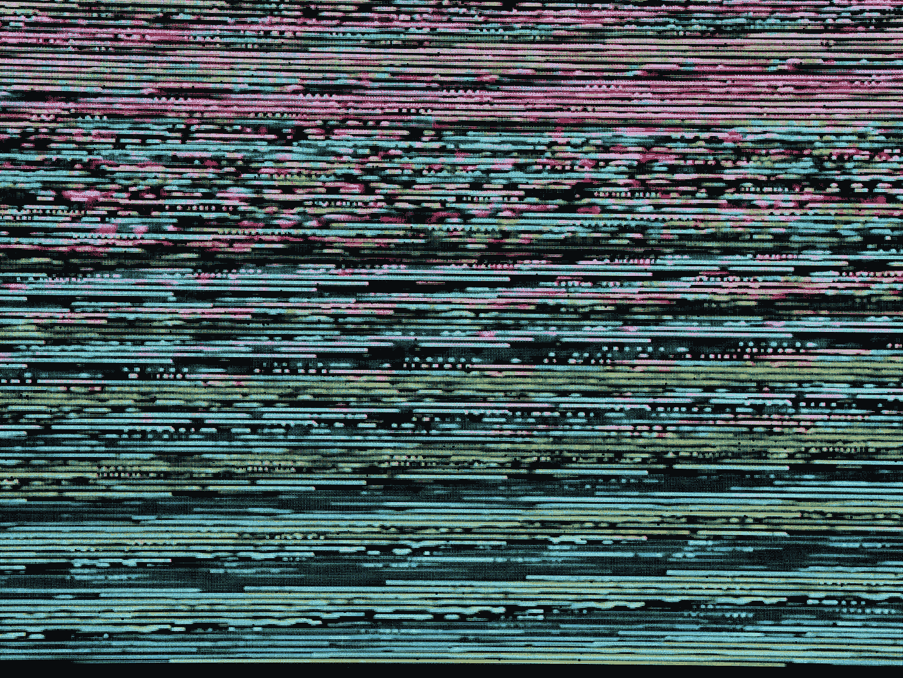

迈克尔·泽兹奇在 [Unsplash](https://unsplash.com?utm_source=medium&utm_medium=referral) 上的照片

在我的研究中，我大量使用机器(深度)学习。两天前，我正在研究生成性对抗网络(GAN ),看看如何将它应用到我的工作中。

代码准备好之后，我开始在[媒体](https://medium.com/u/504c7870fdb6?source=post_page-----ff5b8d78bd28--------------------------------)上写这篇文章，我试着找到最好的词来开始一个适当的介绍，就像我一直做的那样。

我开始问自己这样的问题:

> “读者为什么要读这个？为什么我试图传达的东西是有意义的？在阅读这篇文章之前，我们需要有一个什么样的框架？”

现在，**当然，**我相信读者应该读这个，因为我觉得我写的东西有意义，有意思。

但事实是**我喜欢信号处理，**和**我喜欢写这方面的东西，因为我喜欢信号处理**。这篇文章讲的是我最爱的两件事:**信号处理**和**人工智能。**我把我所有的爱、精力和激情都投入到这两个项目中(我实际上是漂洋过海来研究它们的)，我希望你会对这个话题感兴趣。

正如你可能从标题中猜到的，我们将使用**生成对抗网络**进行**信号处理**。我们要做的游戏如下:

想象做一个**实验**。这个实验的设置是由一个**发生器**完成的。该发生器的输出是一个**时间序列**(也称为信号)。

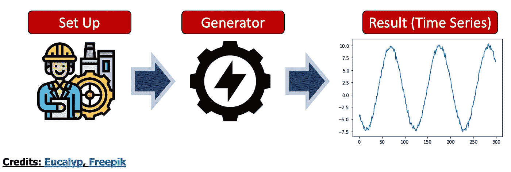

作者图片

想象一下，这个实验**昂贵**，耗费大量**能量**和**计算**的努力。我们最终想停止做这个实验。要做到这一点，我们需要将我们的生成器变成一个代理。

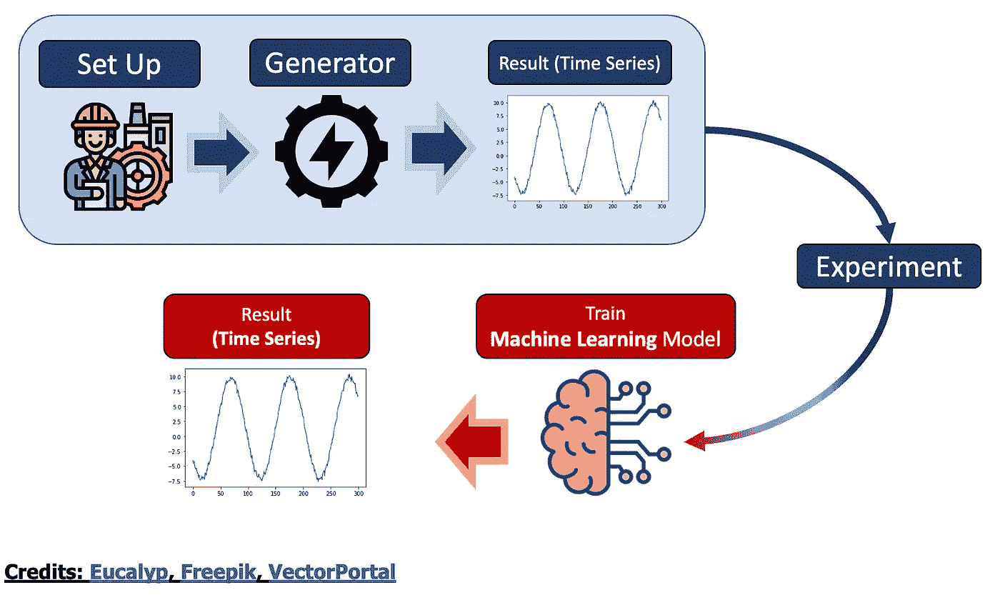

作者图片

你看到的那个鲑鱼粉色的小脑袋是我们的代理模特。具体来说，这个代理是一个**机器学习**模型。顾名思义，这个机器学习模型是一个**生成式对抗网络** (GAN)。

这篇文章是这样写的:

1.  构建我们的**实验:**我们将生成我们控制的**数据集**，我们将描述它。
2.  定义我们的**机器学习模型**:我们将描述我们的 GAN 模型的具体特征。
3.  探索**结果**:我们将运行我们的生成模型，并使用我们的代理模型来提取我们的信号。

我希望你和我一样兴奋。我们开始吧！

# 1.关于实验

来自电气/机械工程师设置的大多数信号都是**正弦信号***

> *有兴趣的话我写了一篇关于它的文章！这里是你能找到它的地方。

这意味着输出信号是这样的:

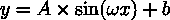

作者图片

其中:

*   **A** 是我们信号的**振幅**
*   **ω**是**频率**
*   **b** 是**偏向**

实际上，在现实世界的实验中，我们有噪音元素。
现在，有多种噪声，它们都有各自的颜色对(*白色噪声、粉色噪声、蓝色噪声、绿色噪声……*)。最典型的噪声之一是所谓的**高斯白噪声**，这是一种存在于**所有频率**并且具有**高斯分布的噪声。**

所以目标信号看起来更像这样:

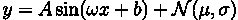

作者图片

现在，在实践中:

*   **表示**通常为 0
*   **标准偏差**可以变化，但在我们的实验中，假设它为 1 并且是固定的是安全的。
*   另一个常数可以被认为是噪声因子前面的一种噪声**振幅**

所以到最后，它看起来更像这样:

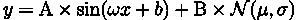

作者图片

现在，这是我们的**完美世界，**我们的**潘多拉，**就像他们在《阿凡达》中说的😄

在现实生活中，事情会有所不同。
假设我们固定了一个幅度，但是这个幅度变化很大。
例如，让我们说:

1.  **振幅**的范围为 0.1 至 10，步长= 0.1
2.  **偏差**可以在 0.1 到 10 的范围内变化，步长= 0.1
3.  **频率**的范围为 1 到 2，步长= 0.001
4.  **噪声幅度**是固定的，为 0.3(无论如何，噪声的随机性在其概率分布中)

如果我们想合并所有这些随机性，我们可以使用下面几行代码:

以下是一些输出:

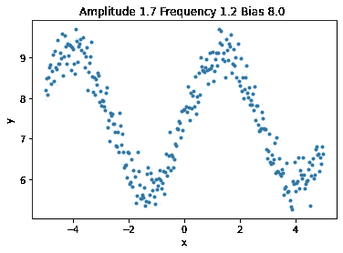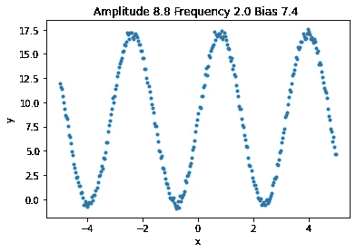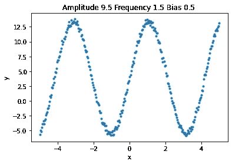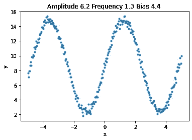

作者的图片，使用上面的代码生成

此时，目标应该足够明确:

> “假设我们没有目标函数，我们如何生成看起来像是由源生成的信号？”

那我们就从机器学习开始吧🤗

# 2.关于机器学习

我们正在使用的机器学习模型是**生成对抗网络(GAN)** 。

我真的想要这篇关于信号处理的文章，而不是对 GAN 的从头到脚的描述，但我会尝试简单地介绍一下。**免责声明:有些人做得**比我更好**方式**(关于这一点，请大点声[约瑟夫·罗卡](https://medium.com/u/b17ebd108358?source=post_page-----ff5b8d78bd28--------------------------------):[理解生成性敌对网络(GANs)](/understanding-generative-adversarial-networks-gans-cd6e4651a29) )

假设**甘** s 是用于 [**深假**](https://en.wikipedia.org/wiki/Deepfake) **的型号。** 这些是生成模型，顾名思义，是通过训练一个**生成**零件和一个**鉴别器实现的。**

**创成式**零件试图生成一个尽可能**接近真实模型的模型。如果是这样的话，那就和标准的编码器-解码器没什么区别了。“真正的交易”是**区别性**部分的存在。**

判别部分是一个分类器，试图区分**真实**和“**虚假”(由生成模型生成)**实例。

因此，这个游戏是试图构建看起来像训练数据对象的假对象的**生成模型**和试图区分训练数据对象和假对象的**鉴别模型**之间的竞争。这个“游戏”是通过**最小-最大损失函数**和[伊恩·j·古德菲勒](https://en.wikipedia.org/wiki/Ian_Goodfellow)的美丽心灵构建的优雅而简单的算法来实现的。

现在，GAN 最常用的是**条件 GAN。**条件 gan 是与某个输入相关的生成模型。
假设输入是一个**字符串**

> “一只可爱的飞上月球的猫”

并且输出是**图像**:


作者图片

在这个例子中，模型比那个更简单，并且创成式模型与特定输入无关。
这个生成模型的输入现在是**噪声**，所以模型试图从噪声到可能从源产生的信号。

**创成式**模型的架构如下:

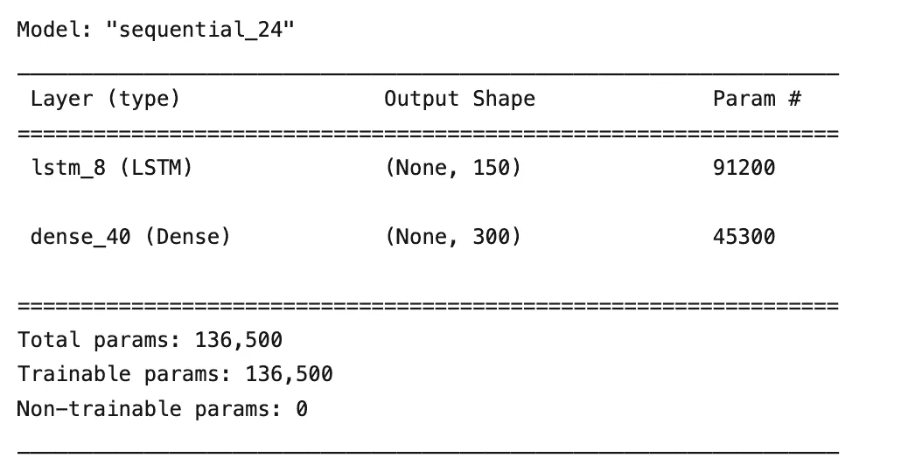

作者图片

**区别性**模型的架构如下:

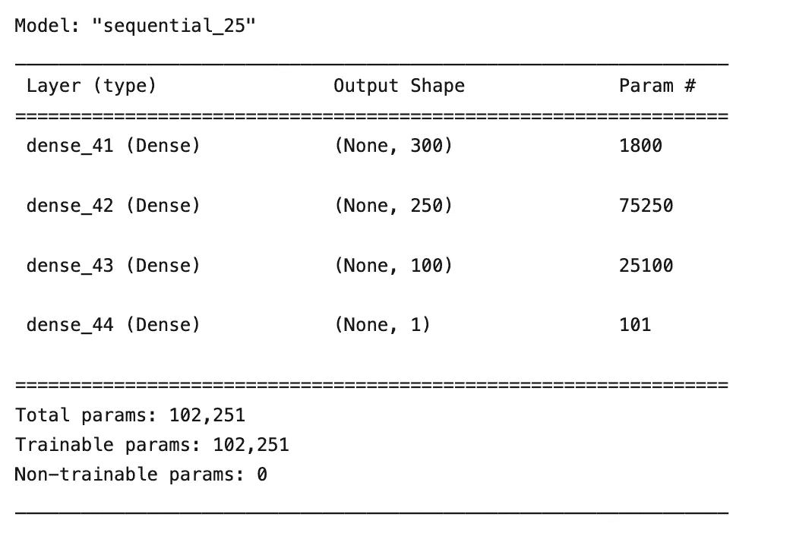

作者图片

生成模型是一个 **LSTM** **模型**，它将一个随机噪声向量(一个三维向量)作为输入，并输出一个 300 长的向量，该向量是理想的期望信号:

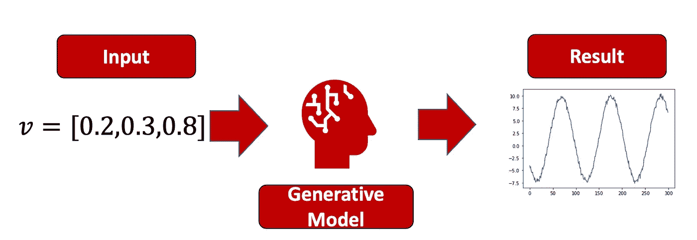

作者图片

判别模型区分真实(来自**训练数据**)和虚假(由**生成模型**生成)输出:

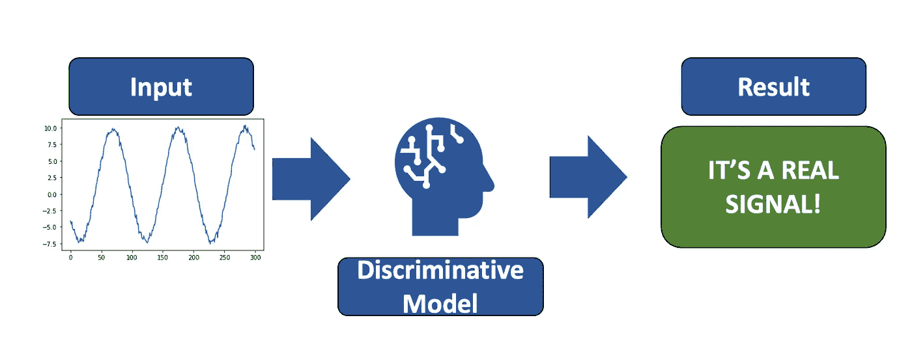

作者图片

该 GAN 的实际实施如下:

现在输入的长度是我们模型的一个参数:

```
LENGHT_INPUT = 300
```

噪声向量的维数是 *latent_dim* 参数。

现在我们必须生成数据集。这意味着建立一个产生 n 个信号的函数。我们还必须产生 n 个具有给定维数的随机噪声输入，并且我们必须构建代码，在给定 n 个随机噪声信号的情况下产生伪信号。

最后但同样重要的是，我们必须构建我们的训练函数。

这段代码将训练我们的生成模型。它还将在每个 **n_eval** 步骤中，通过绘制真实和虚假数据来显示生成模型的进度(同样，我们所说的虚假是指“由我们的模型生成”)。

# 3.完整代码

整个剧本

*   **生成**数据集**数据集**
*   **建**造**甘**模型
*   **火车**火车**甘**

是以下内容:

让我向你展示一些进展:

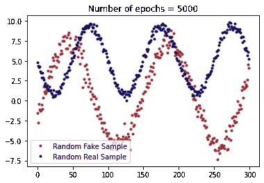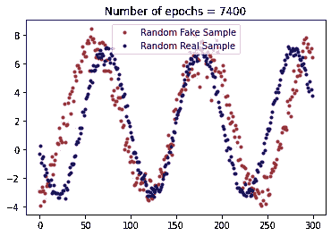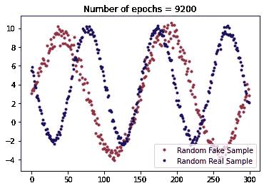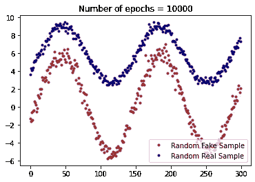

作者图片

现在让我们产生 100000 个随机信号。

这太棒了。想象一下，每个实验花费你 0.5 美元。你刚刚“节省”了 5 万美元。想象一下，每个实验需要 1 分钟。你刚刚“节省”了 70 天。那就是最后用这些 GANs 模型的目的:
“省时省力”。

现在让我们产生 100k 个真实信号。

让我们绘制一些结果:

# 4.包装它

在本文中，我们:

1.  我们确立**人工智能**和**信号处理**是**牛逼**，所以我们决定把它们放在一起。
2.  我们设计了一个**信号处理**场景，其中有一个高噪声正弦发生器。这个正弦可以有不同的**振幅**，不同的**频率**和不同的**偏置**。
3.  我们简要描述了 GAN 模型。我们描述了什么是模型的**生成**部分，什么是**判别**部分，什么是模型的**损失**。生成模型的输入是三维噪声，输出是看起来像训练数据之一的**信号**。
4.  我们**训练**GAN 模型，我们**生成**一些随机信号。

这个模型的关键部分是它的生成能力，因此经过训练的生成模型可以节省我们的时间、金钱和精力。这是因为，不需要做实验，你只需要在你的 python 环境中点击“运行”🚀

# 5.结论

如果你喜欢这篇文章，你想了解更多关于机器学习的知识，或者你只是想问我一些问题，你可以:

A.在 [**Linkedin**](https://www.linkedin.com/in/pieropaialunga/) 上关注我，在那里我发布我所有的故事
B .订阅我的 [**简讯**](https://piero-paialunga.medium.com/subscribe) 。这会让你了解新的故事，并给你机会发短信给我，让我收到你所有的更正或疑问。
C .成为 [**推荐会员**](https://piero-paialunga.medium.com/membership) ，这样你就不会有任何“本月最大数量的故事”，你可以阅读我(以及成千上万其他机器学习和数据科学顶级作家)写的任何关于最新技术的文章。