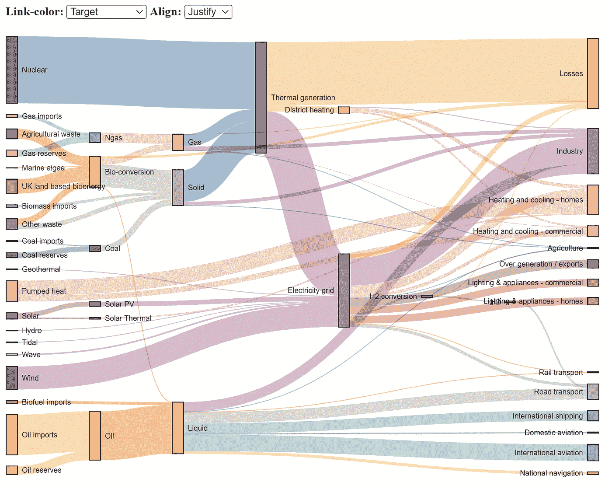
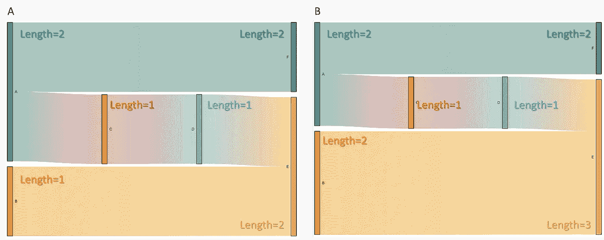

# 使用 Python 在 d3js 中创建漂亮的 Sankey 图表的实践指南

> 原文：<https://towardsdatascience.com/hands-on-guide-to-create-beautiful-sankey-charts-in-d3js-with-python-8ddab43edb43>

## 桑基图表是一个很好的方法，通过观察单个项目如何在各州之间流动，就可以发现最突出的贡献。



桑基图表示例。(图片由作者提供)

如果您需要了解系统中的流程，以揭示流程中潜在的低效状态，Sankey 图非常有用。输入数据类似于带有源/目标和权重的网络图，但可以揭示对最突出贡献的新见解。它可以用于许多用例，如改善营销、成本分析、能源流动等方面的客户旅程。 *Sankey* 图表是[D3 blocks 库 的一部分，可以使用 Python 创建。输出完全封装在一个 HTML 文件中，您只需要一个互联网浏览器来显示图形。分享和发布因此变得超级简单。 ***在这篇博客中，我将介绍桑基图表，并用实际例子演示如何使用它。***](/d3blocks-the-python-library-to-create-interactive-and-standalone-d3js-charts-3dda98ce97d4)

*如果你觉得这篇文章很有帮助，可以使用我的* [*推荐链接*](https://medium.com/@erdogant/membership) *继续无限制学习，并注册成为中级会员。另外，* [*关注我*](http://erdogant.medium.com) *关注我的最新内容！*

# 桑基图表是 D3Blocks 的一部分。

[*D3Blocks*](/d3blocks-the-python-library-to-create-interactive-and-standalone-d3js-charts-3dda98ce97d4) 是一个包含各种图表的库，可视化部分构建在(d3) javascript 上，但可使用 Python 进行配置。通过这种方式， *D3Blocks 库*将 d3-javascript 的优势(如速度、可伸缩性、灵活性和无限创造力)与 Python 结合在一起，以便快速轻松地访问广泛的社区，如数据科学领域。特别是对于这个领域，关键是它应该能够轻松地扩展到非常大的数据集。D3Blocks 中的每个图表，如 Sankey 图表，都完全封装在一个 HTML 文件中，这使得在网站上共享或发布非常容易。此外，除了浏览器之外，它不需要任何其他技术来发布或共享图表。关于[*D3 blocks*](/d3blocks-the-python-library-to-create-interactive-and-standalone-d3js-charts-3dda98ce97d4)*库的更多信息可以在本博客 [1](/d3blocks-the-python-library-to-create-interactive-and-standalone-d3js-charts-3dda98ce97d4) 中找到。*

# *桑基图表。*

*可以用 Python 创建 *Sankey* 图表，而不用担心任何 d3 javascript 模块。导入 D3Blocks 库后，您可以设置用户定义的参数，并基于您的输入数据集创建图表。 ***在后台，Sankey 模块将为数据集中的状态和流创建颜色、位置、排序和标签。*** 它还将包含用户自定义的参数，连接所有 d3 部分，然后最终将其转换成一个单独的 HTML 文件存储在磁盘上。*

## *使用桑基图表的理由。*

*当一个动作跟随另一个动作跨越时间或状态时，桑基图是有洞察力的。它有助于揭示流程中潜在的低效状态，例如发现流程中的瓶颈。尽管使用*源-目标-权重*的输入类似于网络分析的输入，但是当需要分析流量时，使用网络分析可能很难解释。桑基图中的每个流的高度可能不同，这取决于其数量，因此确定最突出或最有问题的状态变得更简单。这样的细分使得从数据中得出结论变得容易。*

## *安装。*

*在我们浏览 Sankey 的功能之前，我们首先需要安装 [*D3Blocks 库*](/d3blocks-the-python-library-to-create-interactive-and-standalone-d3js-charts-3dda98ce97d4) :*

```
*pip install d3blocks*
```

## *输入数据框。*

*输入数据是一个包含以下三列的*数据帧*:*

*   ****源*** :描述源状态。*
*   ****目标*** :描述目标状态*。**
*   ****权重*** *:* 描述了*源*和*目标状态*之间流的相对重要性。*

*让我们从 [*能量数据集*](https://observablehq.com/@d3/sankey)*【2】*加载一个输入数据帧的例子。在这个例子中，有 68 行 3 列。 ***权重的解释*** 可以看作*源-目标关系的强度，从而使得流量的宽度*。*

```
*print(df) source                   target            weight
0      Agricultural 'waste'     Bio-conversion    124.729
1      Bio-conversion           Liquid            0.597
2      Bio-conversion           Losses            26.862
3      Bio-conversion           Solid             280.322
4      Bio-conversion           Gas               81.144
..                ...           ...               ...
63     Thermal generation       District heating  79.329
64     Tidal                    Electricity grid  9.452
65     UK land based bioenergy  Bio-conversion    182.010
66     Wave                     Electricity grid  19.013
67     Wind                     Electricity grid  289.366[68 rows x 3 columns]*
```

## *输入参数。*

*Sankey 块包含代码部分 1 中描述的各种输入参数。*

*代码部分 1。桑基图表的输入参数*

## *输出文件。*

*输出是一个 HTML 文件，存储在磁盘上的指定路径。HTML 包含一个可以共享和发布的全功能图表。*

# *示例:将数据转换为 Sankey 图表。*

*让我们从一个小例子开始，演示如何将输入数据转换成图表。在下面的代码段中创建一个数据帧，它有 5 个关系，每个关系都有 *weight=1* 。*

*代码部分 2:一个小输入数据集如何转化为 Sankey 图的示例。*

*图 1A 中的图表显示了*源*和*目标*状态之间的五个预期流量，所有状态的*权重=1* 。这表明所有状态的长度相等。然而，状态 ***A*** ( *蓝色*)和 *E* ( *黄色*)的垂直长度是其他状态的两倍。这是因为在数据帧中，状态 ***A*** 被列为源状态两次( *A > F 和 A > C* ，状态**E被列为目标状态两次( *B > E 和 D > E* )。让我们改变状态 ***B*** 的权重，看看会发生什么。如果我们为状态 ***B*** *【橙色】*设置 *weight=2* ，则流的强度加倍(*从 1 到 2* )，状态 ***B*** 的长度变成之前的两倍垂直长度(如图 1B，橙色状态)。此外，状态 ***E*** 的垂直长度也增加，因为状态 *B > E* 之间的流动强度增加。或者换句话说: ***一个状态的垂直长度就是特定源/目标状态被看到的次数，加上权重。*** *注意，状态计数和权重是归一化的，并且彼此相关。*我将加载下一节中设置的*能量数据*来创建桑基图表。***

**

*图 Sankey 图表是使用代码部分 1 创建的，具有 5 种状态之间的流程。画面 A:所有权重都设置为 1。画面 B:状态 B->E 之间的权重设置为 2。(图片由作者提供)*

# *例如:能源数据集。*

*这里，我们将使用*能源数据集*创建桑基图表。如前所述，数据集包含 68 个源-目标行。当我们运行代码部分 1 时，会创建下面的图表:*

**

*图 2:能源数据集的桑基图。(图片由作者提供)*

*整个数据之间的流动是用所有状态组织的，现在可以揭示最突出的贡献或瓶颈的新见解。一些州可能值得进一步调查，因为每个州的总贡献变得异常。*

# *最后的话。*

*总之，我演示了如何使用 Python 和 d3js 功能创建自己的 Sankey 图表。该图表的开发方式可以处理各种数据集，并允许以交互方式更改颜色、排序和状态定位。桑基图表是 [*D3Blocks*](/d3blocks-the-python-library-to-create-interactive-and-standalone-d3js-charts-3dda98ce97d4) 中的一个模块，d3-javascript 在其中形成基础。使用 d3-javascript 有很多优点，比如速度和灵活性，除了浏览器之外，你不需要任何其他技术来绘制图表。*随意摆弄图书馆吧！**

*注意安全。保持冷静。*

****欢呼，E.****

**如果你觉得这篇文章很有帮助，可以使用我的* [*推荐链接*](https://medium.com/@erdogant/membership) *继续无限制学习，并注册成为中级会员。另外，* [*关注我*](http://erdogant.medium.com) *关注我的最新内容！**

## *软件*

*   *[D3Blocks Github](https://github.com/d3blocks/d3blocks)*
*   *[D3Blocks 文档页面](https://d3blocks.github.io/d3blocks/)*

## *我们连线吧！*

*   *[我们在 LinkedIn 上连线](https://www.linkedin.com/in/erdogant/)*
*   *[在 Github 上关注我](https://github.com/erdogant)*
*   *[在 Medium 上跟随我](https://erdogant.medium.com/)*

## *参考*

1.  **Taskesen，E，*[*D3 blocks:Python 库，用于创建交互式和独立的 D3js 图表。*](/d3blocks-the-python-library-to-create-interactive-and-standalone-d3js-charts-3dda98ce97d4) 中等，2022 年 9 月*
2.  *【observablehq.com】， [*能源数据集*](https://observablehq.com/@d3/sankey) ，2019 (ISC 许可)*