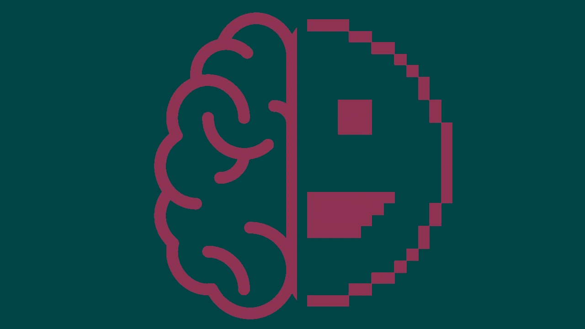
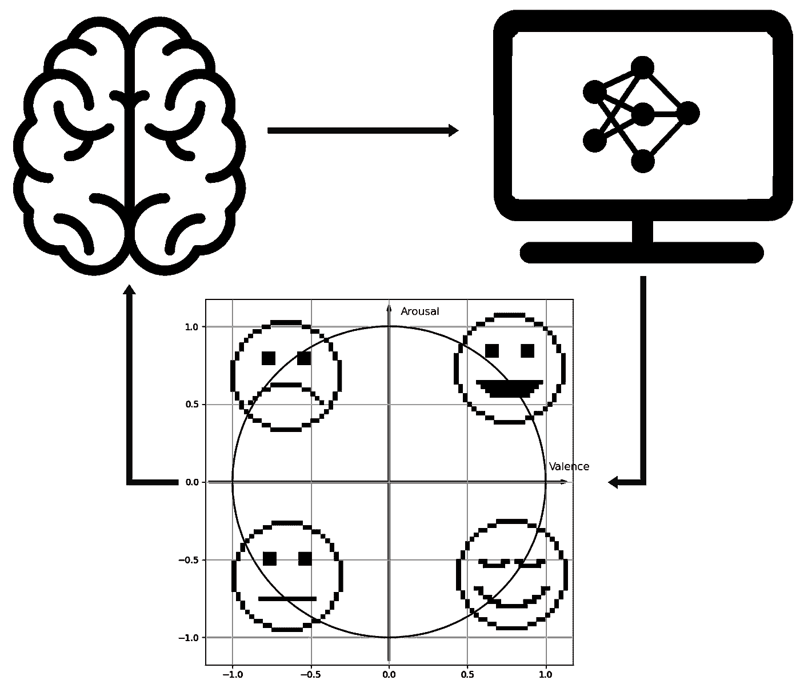
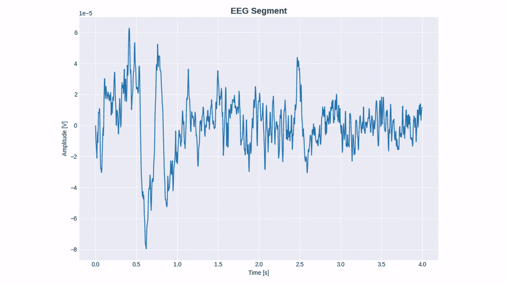

# 脑机接口设计实践指南

> 原文：<https://towardsdatascience.com/hands-on-guide-to-design-brain-computer-interface-b99bcc198428>

## 情绪估计的一个例子



作者图片

# 简介—什么是 BCI？

在过去的十年中，脑-机接口(BCI)，一种旨在连接大脑和计算机的工具，已经引起了人们极大的兴趣。这种热情的一个具体例子是埃隆·马斯克旨在将大脑与计算机连接起来的初创公司 Neuralink 的每一个公告所引起的大肆宣传。Neuralink 能够创造出能够进行多项任务的植入物，例如用思想控制运动或直接在大脑中播放音乐。

> 你感到害怕吗？别担心，这很正常。

然而，在这篇博客文章中，我们将只关注一个简单的 BCI 的实现，它带有一个记录大脑电活动的娱乐设备[2]，即脑电图(EEG)，而不需要任何手术(疼痛或死亡风险)。你(可悲？)不能用它听你最喜欢的播放列表，但可以实时观察穿着 BCI 的人的情绪(用[码](https://github.com/VDelv/eeg_unicorn_basics)😉).

# 一个用例——使用 EEG Unicorn 进行情绪估计

如前所述，在本教程中，我们将通过所有必要的步骤来设计一个 BCI 进行一个具体的任务，从想法到具体的实施。作为一个例子，我们提出了一个情绪估计背景下的 BCI。该应用程序旨在评估参与者感受到的*情绪*。



作者对 BCI 情感的阐释。

所提出的流水线的目的是将来自参与者的 EEG 信号作为输入，并在效价/唤醒框架中返回相应的情绪。最后一个目的是在两个轴上表示情绪:第一个轴对应于情绪的情感方面(即积极或消极)，第二个轴对应于感受到的情绪的强度。

# 设计情感识别 BCI 的关键步骤

更具体地说，要设计和部署 BCI，必须遵循几个关键步骤。

## 范例定义和信号记录

我想建模或评估什么？我申请的目的是什么？我想控制机械手/脚吗？在驾驶任务中评估警惕性？预测疾病？检测癫痫发作？科学界对几个可以插入 BCI 的研究项目有很大兴趣。
在我们的案例中，我们决定专注于之前的一项工作，旨在评估观看视频时的情绪状态[3]。该文件还提出了一个促进特定情绪状态的视频列表(这让我们很感兴趣！).视频列表和相应的情绪都可以在 youtube 上找到，并在[4]中列出。

因此，我们设计了一个实验基准，在观看促进特定情绪的视频时记录 EEG 信号。在我们的[库](https://github.com/VDelv/eeg_unicorn_basics)中，脚本`[registration_pipeline.py](https://github.com/VDelv/eeg_unicorn_basics/blob/main/registration_pipeline.py)`提出了一个完成这项任务的代码，用户只需将他想要处理的视频放在专用目录中(或者改变路径)。

## **大纲分析**

在上述基准的帮助下，有可能继续记录 EEG 信号。这些最后将构成训练 ML 模型(甚至 DL)所必需的数据集。

> 让我们做模型…等一下！

在拥有能够从 EEG 信号中估计情绪的管道之前，我们必须在处理过程中提取信息来帮助模型。如果您有很多信号和/或可用的计算资源，可以跳过这一步。然而，为了保持简单，我们考虑一个更简单的模型来保持一切简单。一种可能的提取信息的方法是基于 EEG 信号的频率特性，即*“这个 EEG 段是在高频还是低频范围内振荡？”*。在过去，科学家已经发现一些 EEG 信号由几个频带组成，每个频带在特定的任务或行为中增加/减少[4]:

*   深度睡眠的δ，[0–4Hz]。
*   θ表示困倦，[4–7Hz]。
*   α用于闭眼时的放松和反射，[8–15Hz]。
*   β代表积极思考和专注相关的状态[16–31Hz]。
*   γ表示压力更大的状态[32–50Hz]。



作者对特征提取的说明。

按照这个过程，我们从每个 EEG 片段中提取了一个信息向量。该过程旨在提取信息以更好地处理生物医学信号。这一步可以从脚本的第一部分`[outline_analysis.py](https://github.com/VDelv/eeg_unicorn_basics/blob/main/outline_analysis.py)`开始。

最后，如果你还在这里，你知道剩下的步骤包括创建一个模型，旨在估计情绪状态(例如，快乐？难过？)从上面预先计算的特征向量。这里，为了保持一种简单易懂的方法，我们将考虑一个由[决策树](https://scikit-learn.org/stable/modules/tree.html)组成的简单模型。这个简单方法背后的思想是找到动态阈值来区分信息向量，例如，对应于低唤醒的第 I 个电极的高α贡献，对应于高价的第 j 个电极的中等γ贡献，等等。

给定特征向量`X`及其标签`y`，有可能创建一个分类器(对应于一个决策树)编写为`clf`。分类器可以很容易地用下面几行代码来训练:

```
from **sklearn** import **tree**clf = **tree**.**DecisionTreeClassifier**() # definition of the model
clf.**fit**(X, y) # training of the model...
```

`[outline_analysis.py](https://github.com/VDelv/eeg_unicorn_basics/blob/main/outline_analysis.py)`的第二部分给出了更完整的解释，包括总体模型描述和培训。在训练完简单的决策树后，可以用`joblib`库保存它:

```
...from **joblib** import **dump**
**dump**(clf, 'classifier_file_name')
```

## **实时实现**

在训练和保存模型之后，剩下的步骤是将每个部分合并在一起。

两个联合脚本必须并行工作:第一个脚本旨在记录、处理和评估来自 EEG 的情绪状态`[pylsl_emotion.py](https://github.com/VDelv/eeg_unicorn_basics/blob/main/pylsl_emotion.py)`，第二个脚本旨在在图表上显示相应的情绪，并带有相应的笑脸，如所述`[play_emotion.py](https://github.com/VDelv/eeg_unicorn_basics/blob/main/play_emotion.py)`。

## **我们来玩**

最后(也是最不重要的):自己试试！代码和自述文件可在 [Github](https://github.com/VDelv/eeg_unicorn_basics) 上获得。您可以自己尝试，或者为不同型号或 EEG 耳机改编代码。

乡亲们就这些，感谢阅读！我不声称代码是完美的，但如果你有意见，问题或想知道更多，不要犹豫，与我联系！😊

# 参考

[1]罗尔夫·温克勒(Rolfe Winkler)，埃隆·马斯克(Elon Musk)推出 Neuralink 将大脑与计算机连接起来，*《华尔街日报》*，2017 ( [link](https://www.wsj.com/articles/elon-musk-launches-neuralink-to-connect-brains-with-computers-1490642652) )

[2]独角兽混血黑人——大脑接口，([链接](https://www.unicorn-bi.com/))

[3] Katsigiannis，s .和 Ramzan，N. DREAMER:通过来自无线低成本现成设备的 EEG 和 ECG 信号进行情绪识别的数据库。 *IEEE 生物医学与健康信息学* (2017 — [链接](https://ieeexplore.ieee.org/abstract/document/7887697))。

[4] Gabert-Quillen，Crystal A.《情感电影剪辑的分级》。*行为研究方法* (2015 — [链接](https://link.springer.com/article/10.3758/s13428-014-0500-0))。

Katsigiannis，s .和 Ramzan，N. DREAMER:通过来自无线低成本现成设备的 EEG 和 ECG 信号进行情绪识别的数据库。 *IEEE 生物医学与健康信息学* (2017 — [链接](https://ieeexplore.ieee.org/abstract/document/7887697))。

[5]威廉·O·塔图姆，埃伦·r·格拉斯讲座:非凡脑电图，2014 ( [链接](https://www.tandfonline.com/doi/pdf/10.1080/21646821.2014.11079932?casa_token=n-ihxSAXmd0AAAAA:BMdy9jII81ZvHj6bATpxS1tRyAlSXtxEBPylgZbY5qasO9-Aqk1M9flXJQ__Qhvr9KiPfHr6QOkvz8g))。