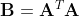
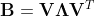
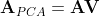
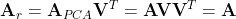
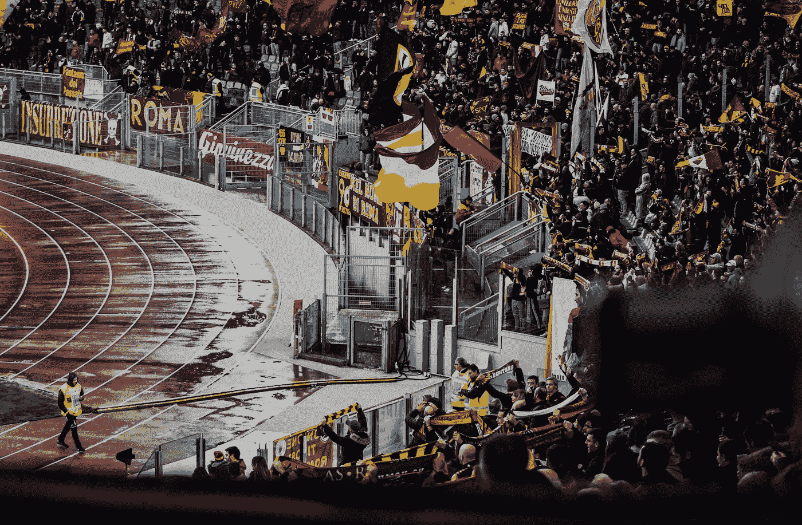

# 使用 Python 通过主成分分析进行图像压缩

> 原文：<https://towardsdatascience.com/hands-on-image-compression-using-principal-component-analysis-with-python-1cd6cad72366>

照片由 [Unsplash](https://unsplash.com/s/photos/small?utm_source=unsplash&utm_medium=referral&utm_content=creditCopyText) 上的记者拍摄

# 使用 Python 通过主成分分析进行图像压缩

## 从理论到实践，这就是如何使用 PCA 压缩你的图像而不破坏质量

当我和埃森哲<https://www.accenture.com/us-en?c=acn_glb_brandexpressiongoogle_12722872&n=psgs_1221&&c=ad_usadfy17_10000001&n=psgs_Brand-%7c-US-%7c-Exact_accenture&gclid=Cj0KCQiAi9mPBhCJARIsAHchl1zGVurARH3g4nQKqa8WBZgAE0gxEfbulbQYZ0hrLC72izQCidNYa1caAuXpEALw_wcB&gclsrc=aw.ds>**一起写硕士学位论文时，我们曾经使用一个确定的固定大小的图像。特别是，我们正在研究一个非常著名的机器学习挑战，它被称为 [**快速 MRI**](https://fastmri.org/) ，是由[脸书人工智能研究](https://ai.facebook.com/)(现在的**元人工智能**)提出的。**

**我不会说得太详细，但我们有一个具体的目标，那就是提高这些图像的质量。一旦我们做到了这一点，我们开始问自己是否有办法以压缩的形式存储这些大图像，以节省一些存储空间。**

**我们决定应用**主成分分析(PCA)。****

**我希望这篇(相当长的)介绍能让你了解 PCA 是如何在**行业**和**研究**中使用的，因为它是一种非常强大而又相当简单的算法，可以**降低你的图像的维度**并节省一些空间**而不会真正破坏你的图像质量**。**

**让我们开始吧。**

## **1.直观的解释**

**好吧，假设你有这样的数据:**

**如果你看看这些数据，你会发现一个围绕对角线的特定分布。在某种程度上，如果你只考虑对角线，你也许可以改变数据的维度，从二维转换到一维。**

**主成分分析方法正是这样做的。它会找到您拥有最多数据集信息的方向，并将您的数据投影到这些方向上。**

**让我们看看结果:**

**正如你所看到的,**组件 0** 非常有用，你可以使用这个组件来绘制数据。**

**假设你的数据集中有 M 个维度。当您使用 PCA 时，您最终会得到:**

*   **P**
*   **允许您切换回原始尺寸的模型**

**当 P <**

**Imagine that your data is an image. By all means, this is just a matrix of numbers, let’s say N rows and M columns. What you can do is reduce the columns of your matrix and have a N x P matrix with P <**

> **The next chapter is pretty technical and explains exactly how PCA does what we said it does. Nonetheless, above there should be all you really need to know to go on and produce a practical implementation of the PCA method. So you should be able to implement the PCA and understand it even if you skip chapter 2.**

## **2\. Technical Explanation**

**So that was the idea. Let’s try to make it more technical. Let’s say that the matrix (image) is **A** 时，这允许具有重要的计算优势。假设 A 是 m x p
那么，我们来定义矩阵 **B:****

****

**我用[这个工具](https://latex.codecogs.com/eqneditor/editor.php)制作的图像。**

**特征值分解如下:**

****

**我用[这个工具](https://latex.codecogs.com/eqneditor/editor.php)制作的图像。**

**这些分解矩阵是:**

*   ****V** 是矩阵的特征向量的 p×p 正交矩阵。**
*   ****λ**是一个 p×p 的正方形对角矩阵。对角线上的条目是非负实数的特征值。**

**PCA 定义的矩阵如下:**

****

**我用[这个工具](https://latex.codecogs.com/eqneditor/editor.php)制作的图像**

**它是在这 p 个标准正交特征向量上的投影。它的形状和原来的 m x p 一样。**

**如果使用所有的特征向量，可以使用下面的公式重建 **A** 。**

****

**我用[这个工具](https://latex.codecogs.com/eqneditor/editor.php)制作的图像**

**这是因为特征向量是正交的。通常是前几个(按特征值降序排列)特征向量包含原始矩阵 **A** 的大部分整体信息。在这种情况下，我们可以只用少量的特征向量来重构矩阵 **A** 。例如我们可以用 k 个< < p 个特征向量。k 个向量按照**方差**值排序。使用它们，你可以有一个更小的矩阵**、一个** _PCA 和一个模型(我们讨论过的矩阵乘法)来将其转换成原始大小的矩阵。**

## **3.实际实施**

**即使执行上述操作并不十分困难，也有一些非常实用的工具可以帮你完成并加速这个过程。伟大的 sklearn 可能是数据科学领域最著名的一个。这里是[的**文档**的](https://scikit-learn.org/stable/modules/generated/sklearn.decomposition.PCA.html)。**

**让我们用一张免费下载的[我的团队成员(❤):)的图片](https://unsplash.com/photos/NE1ePoe3gSI)**

****

**照片由 [Danilo Obradovic](https://unsplash.com/@tamentali?utm_source=unsplash&utm_medium=referral&utm_content=creditCopyText) 在 [Unsplash](https://unsplash.com/?utm_source=unsplash&utm_medium=referral&utm_content=creditCopyText) 上拍摄**

**我们要做这些事情:**

1.  ****对不同数量的组件应用**PCA 方法**

**2.**重建**组件数量较少的图像**

**3.**评估**重建图像的质量，将其与原始图像进行比较**

**我们分析了 1。第二。工作细节，所以我们将花一些时间进行评估。**

**有许多方法来评估具有地面真实性的重建图像的质量。尽管如此，为了保持简单，让我们使用一个相当通用但有用的方法，即 [**归一化的 Frobenius 范数**](https://en.wikipedia.org/wiki/Matrix_norm) 的差。**

**我们用 4 种不同数量的成分: **0%** 、 **33%** 、 **66%** 和 **100%** 。**

**让我们绘制重建的图像:**

**我觉得这个**很漂亮**。第一次重建绝对是扯淡。当然，当我们增加组件的数量时，重建变得与原始图像相似。尽管如此，这意味着**我们也在减少我们的计算优势**，因为我们存储了更多的组件(减少的图像的维度增加)。**

**让我们绘制原始图像和重建图像之间的距离(Frobenius 范数),作为组件数量的变化:**

**如果我在专业或研究环境中使用它，我可能会使用更多的点来更好地拟合曲线，并了解最佳的组件数量。然而，我觉得这对于我们的目的来说已经足够了，因为**表明当我们增加组件的数量时，重建变得更好，**这是完全合理的。**

## **4.结论**

**在某些情况下，降维是**必须**做的事情。当你必须对高维图像进行预处理时，看看你是否可以使用 PCA 来存储低维图像是一个很好的实践，并且让你这样做的代码非常简单。**

**如果你喜欢这篇文章，你想知道更多关于机器学习的知识，或者你只是想问我一些你可以问的问题:**

**A.在 [**Linkedin**](https://www.linkedin.com/in/pieropaialunga/) 上关注我，在那里我发布我所有的故事
B .订阅我的 [**简讯**](https://piero-paialunga.medium.com/subscribe) 。这会让你了解新的故事，并给你机会发短信给我，让我收到你所有的更正或疑问。
C .成为 [**推荐会员**](https://piero-paialunga.medium.com/membership) ，这样你就不会有任何“本月最大数量的故事”，你可以阅读我(以及成千上万其他机器学习和数据科学顶级作家)写的任何关于最新可用技术的文章。**

**再见:)**