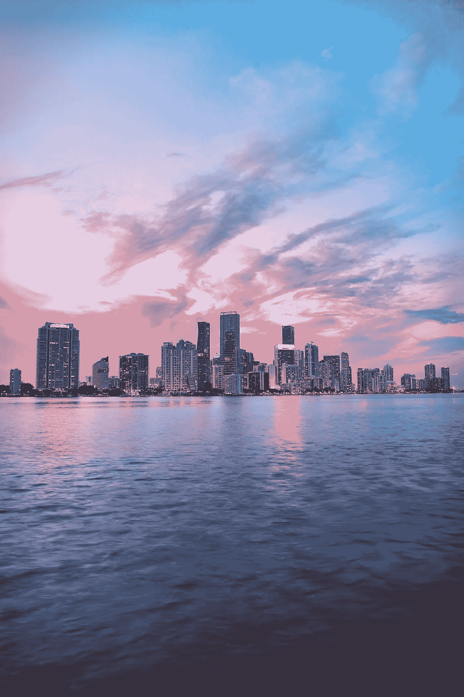
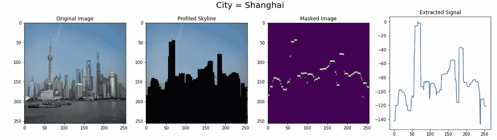
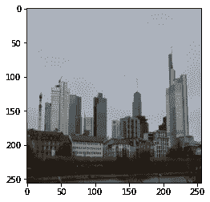
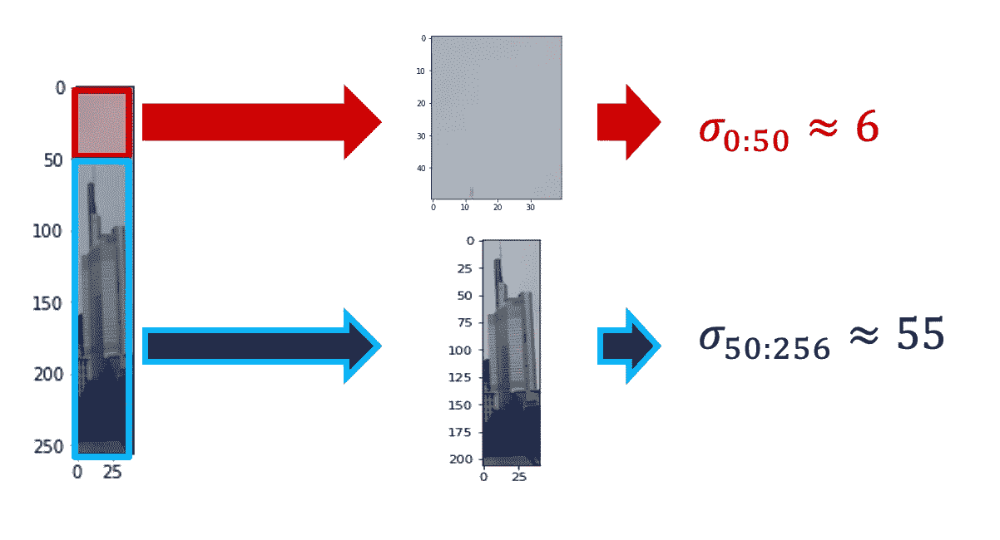
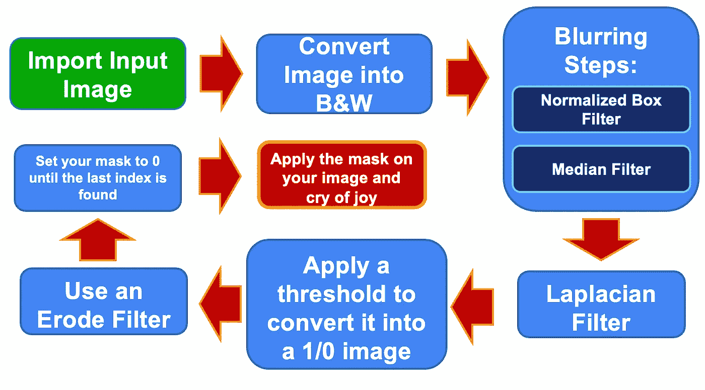
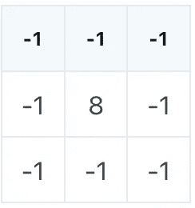

# 使用 Python 对天际线进行动手图像处理

> 原文：<https://towardsdatascience.com/hands-on-image-processing-on-skylines-using-python-a73571ec7c7a>

## 这里有一个关于使用 Python 在几行代码中描绘城市天际线的快速教程

照片由 [Unsplash](https://unsplash.com/s/photos/skyline?utm_source=unsplash&utm_medium=referral&utm_content=creditCopyText) 上的[穆扎米尔·苏尔马](https://unsplash.com/@muzammilo?utm_source=unsplash&utm_medium=referral&utm_content=creditCopyText)拍摄

让我陈述一个显而易见的事实:**天际线很美。**

我从小就梦想住在美国，其中一个原因是想住在纽约、芝加哥或旧金山美丽的天际线之间。

随着我的成长(并开始在美国生活),我确实意识到美国除了天际线之外还有很多东西，但我仍然非常喜欢它们。

在这篇文章中，我们将学习如何从图片中获取天际线轮廓。大概是这样的:

**图片(1)** :作者图片，数据来自[此处](https://www.kaggle.com/datasets/vassiliskrikonis/skylines-12)(许可: [CC0:公共领域](https://creativecommons.org/publicdomain/zero/1.0/))

让我们开始吧。🤩

# 0.这个想法

想法很简单。为了检测天际线，我们只需检测**天空**并拍摄互补图像。

在你之前看到的例子中，我们真正做的是**识别天空**。下一步当然是获取掩模图像并将其转换为信号，但正如我们将看到的那样，这相对容易。

那么，为什么探测天空比探测摩天大楼容易呢？
嗯，这个概念就是一张天空的图片是相对**平的。另一方面，摩天大楼部分是颜色、形状、窗户、水泥和其他材料的混合体。**

从数学上来说，我们希望天空的方差比摩天大楼的方差小，并且我们希望 T21 这个参数在区分天空和摩天大楼时是决定性的。

我想用一个例子来证明我所说的。让我们照这张照片。

**图片(2)** :作者图片，数据来自[此处](https://www.kaggle.com/datasets/vassiliskrikonis/skylines-12)(许可: [CC0:公共领域](https://creativecommons.org/publicdomain/zero/1.0/))

太好了。现在让我们在这个区域修剪这张图片:

**图片(3)** :作者图片，数据来自[此处](https://www.kaggle.com/datasets/vassiliskrikonis/skylines-12)(许可: [CC0:公共领域](https://creativecommons.org/publicdomain/zero/1.0/))

现在让我们取 0 和 50 之间的部分，并打印标准偏差:

**图片(4)** :作者图片，数据来自[此处](https://www.kaggle.com/datasets/vassiliskrikonis/skylines-12)(许可: [CC0:公共领域](https://creativecommons.org/publicdomain/zero/1.0/))

这种方差变化可以使用**二阶导数来检测。**当我们在讨论离散 2D 情形时，我们实际上在讨论**拉普拉斯算子。**如果我们使用所谓的 [**五点模板近似**](https://en.wikipedia.org/wiki/Five-point_stencil) ，可以证明拉普拉斯算子可以被视为卷积，这只不过是使用泰勒近似定义导数。

我太溺爱了。让我在下一节进入正题。

# 1.该算法

执行图(1)中所示操作的算法如下:

**图片(5)** :作者图片

我明白这是一个烂摊子。让我一步一步来解释。

## 1.1 将图像转换成 B&W

我知道你知道一切。但重要的是要说明我们为什么要这么做。如你所知，所有的模糊步骤和过滤在应用到一个**矩阵时都是有意义的。**彩色图像在技术上是一个张量，因为它有行数 X 列数 X 3 个通道值(红绿蓝)。一幅 B & W 图像实际上是一个由行数 X 列数组成的矩阵。

将此应用于彩色图像的一个简单方法是重复上述相同的过程三次，但我不认为这是必要的。最后，无论如何，即使使用 B&W 的图像，我们也能分辨出天际线。

## 1.2 模糊步骤

中值和归一化箱式滤波器步骤都是用于在保留边缘的同时过滤信号噪声的步骤。

## 1.3 拉普拉斯滤波器

这个项目的明星当然是**拉普拉斯滤波器**。该滤波器被认为是离散空间的二阶时间导数。

> 为什么我们首先需要二阶时间导数？

嗯，我们说过天空和摩天大楼的**标准差**是有区别的。这种标准差的变化发生在一个特定的点上，这个点就是一幅图像(以及摩天大楼)的**边缘**。
所以我们想在图像中看到一个**的快速变化**。特别是，我们希望变化最大为**。这意味着我们想要二阶时间导数为零的点(或点的邻居)。**

**当我们谈论一个离散的 2D 情况时，我们实际上是在谈论**拉普拉斯算子。**可以证明，如果我们使用所谓的**五点模板近似，拉普拉斯算子可以被视为卷积，这不过是使用泰勒近似的导数的定义。****

****二阶导数是这样的:****

********

****作者图片****

****这是一个我们将在图像上运行的内核，它将为我们提供**二阶导数图像。******

## ****1.4 应用 1/0 阈值****

****我们不关心二阶导数是正还是负。我们关心的只是 0 的一小部分，因为我们认为这是**边缘。这就是我们应用 1/0 阈值的原因。******

## ****1.5 腐蚀过滤器****

****腐蚀过滤器是我们用来平滑图像的东西。这背后的想法是，我们想使图像**更清晰。**用更专业的话来说，有一个内核会忽略图像，并用最小值替换这些值。同样，因为我们现在有 1/0 的图像，它只是让我们的图像更清晰。****

## ****1.6 将掩码设置为 0，直到找到最后一个索引****

****这一步解释起来有点复杂，但是很容易理解。当您完成所有这些操作后，您的图像列中可能会出现 0 和 1 的序列。这没有多大意义，因为你不可能拥有类似“摩天大楼-天空-又是摩天大楼”的东西。为此，我们在列中找到值为 0 的最大索引，并将所有内容设置为 0，直到找到该值。然后，其他都是 0。****

# ****2.动手实施****

****解释起来有点长，但是实现起来非常容易。让我们一步一步来:****

## ****2.1 导入库:****

## ****2.1 导入数据:****

****我从 **Kaggle 那里得到了[数据](https://www.kaggle.com/datasets/vassiliskrikonis/skylines-12)。**数据集是开源的，没有版权( [CC0:公共领域](https://creativecommons.org/publicdomain/zero/1.0/))。特别是，我只下载了数据集的一部分，其中有 12 个城市的图像，每个城市有 10 座摩天大楼:****

## ****2.2 可视化数据****

## ****2.3 定义功能:****

****上述所有理论都是通过以下方式实现的:****

## ****2.4 应用算法****

****这是算法在整个数据集上的应用:****

****这是一个例子:****

****输入是原始图像(左)。我们“在意”的结果是中间那个。经处理的拉普拉斯滤波器的结果是正确的。很酷吧？🥰****

## ****2.5 将其转换为信号****

****为了得到正确的图像 ***图像(1)*** 我们应用以下函数:****

****我们可以将其应用于数据集的所有图像:****

# ****3.精神食粮！****

****我认为这项研究很有趣，原因有很多。首先，它很有趣，因为有两个理论上站得住脚的理由。****

*   ****它解释了如何使用**拉普拉斯滤波器**以非深度学习的方式应用**边缘检测******
*   ****它解释了如何使用图像进行从头到脚的实验，以及如何创建一个正常工作的图像处理管道****

****然后，当然，它本身是有趣的，因为它给了你一个分析不同城市天际线的工具！
您可以看到城市 A 和城市 B 具有不同的轮廓，特别是使用**提取的信号**我们可以通过以下方式深化这项研究:****

*   ****提取天际线的平均值、中值和标准偏差****
*   ****使用深度学习对城市的天际线进行分类****
*   ****对天际线与时间进行统计研究(天际线如何随时间演变？)****

****请记住，这个项目背后的整个想法是**天空的标准差低于摩天大楼的标准差**。这种方法的问题可能是，如果天空中发生了一些奇怪的事情，或者天际线是奇怪的平坦。例如，有多朵云的非常分散的天空可能是一个问题。****

****例如，我们可以使用这种方法作为更复杂研究的起点，并且我们可以使用**编码器-解码器来改进这些结果。******

# ****4.结论****

****如果你喜欢这篇文章，你想知道更多关于机器学习的知识，或者你只是想问我一些你可以问的问题:****

****A.在 [**Linkedin**](https://www.linkedin.com/in/pieropaialunga/) 上关注我，在那里我发布我所有的故事
B .订阅我的 [**简讯**](https://piero-paialunga.medium.com/subscribe) 。这会让你了解新的故事，并给你机会发短信给我，让我收到你所有的更正或疑问。
C .成为 [**推荐会员**](https://piero-paialunga.medium.com/membership) ，这样你就不会有任何“本月最大数量的故事”，你可以阅读我(以及成千上万其他机器学习和数据科学顶级作家)写的任何关于最新可用技术的文章。****