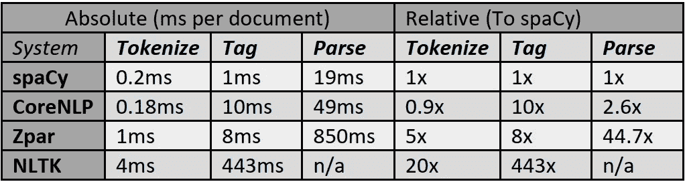
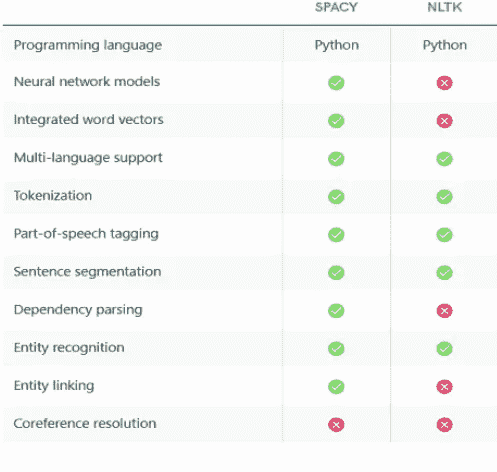
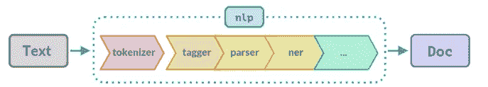
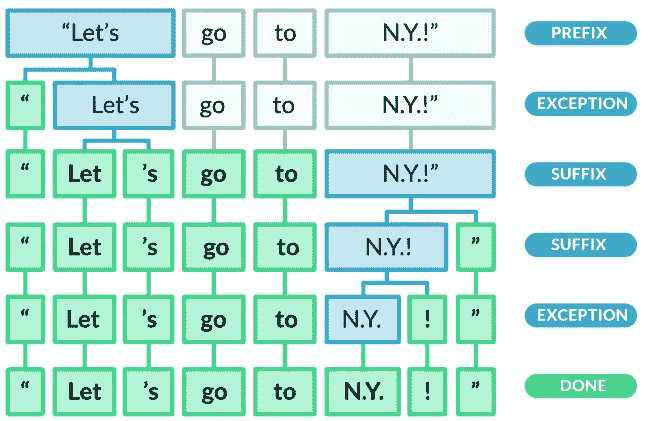
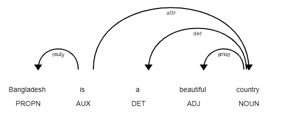
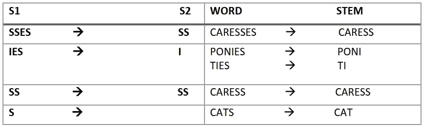
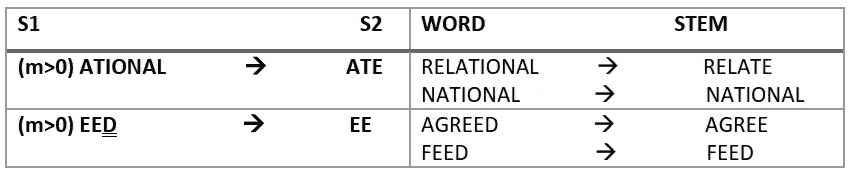

# 用 spaCy 实现基本 NLP 技术的完整指南(第 4 部分)

> 原文：<https://towardsdatascience.com/hands-on-implementation-of-basic-nlp-techniques-nltk-or-spacy-687099e02816>

# 用 spaCy 实现基本 NLP 技术的完整指南(第 4 部分)

## 了解如何使用 Python 库实现基本的 NLP 技术


由 [Unsplash](https://unsplash.com?utm_source=medium&utm_medium=referral) 上的 [Shubham Dhage](https://unsplash.com/@theshubhamdhage?utm_source=medium&utm_medium=referral) 拍摄的照片

## 动机

自然语言处理(NLP)是一项非常有趣的技术，因为通过这项技术，计算机可以识别我们的自然语言，并像智能人一样做出反应。起初，当我开始了解 NLP 的魔力时，我感到非常惊讶。

*【如果你想了解我的自然语言处理之旅以及自然语言处理的基础知识，我强烈推荐你阅读这篇文章——*[](/a-complete-guide-to-natural-language-processing-nlp-c91f1cfd3b0c)**。]**

*我相信实践经验是学习一项技术的最好方法，只有理论知识是没有帮助的。苹果的 Siri，微软的 Cortana，谷歌的语音助手，亚马逊的 Alexa 等。，都在用 NLP。他们的作品多有趣啊！希望我们也能创造一些有趣的项目。*

*所以，是时候动手实践实现标记化、词汇化、词干化、停用词、词性标注等了。我们还将了解哪个 python 库最适合实际应用，以及原因。*

****让我们开始吧……****

> ***自然语言处理** ( **NLP** )是语言学、计算机科学和人工智能的一个分支，涉及计算机和人类语言之间的交互，特别是如何编写计算机程序来处理和分析大量自然语言数据[1]。*

## *空间和 NLTK 概述*

*spaCy 和 NLTK 都是开源的自然语言处理库。*

*◉ **空间***

*spaCy 在 2015 年作为开源的 NLP 库首次进入聚光灯下。它可以有效地执行大多数 NLP 任务。spaCy 主要实现最常见的高效 NLP 技术来执行任务。没有选择特定算法来执行任务的选项。例如，有多种词干提取技术，您希望选择其中一种。不幸的是，空间没有给我们提供灵活性；相反，它会自动选择最常用的算法来执行任务。*

**想了解更多 spaCy 的信息，请登陆*[*spaCy【2】官网。*](https://spacy.io/)*

*◉ **NLTK***

*NLTK 代表自然语言工具包，是最古老和最流行的自然语言处理库之一。它于 2001 年首次发布，这意味着它比 spaCy 早得多。它促进了许多 NLP 功能，但是效率较低。您可以在 NLTK 中选择不同的算法。*

**你可以从* [*这里*](https://www.nltk.org/)*【3】获得 NLTK 的官方文档。**

*➤**nltk 和 spaCy 的对比分析***

*NLTK 和 spaCy 都是 NLP 的重要库。有些任务在 spaCy 中是高效的，有些在 NLTK 中是高效的。我们需要在不同的环境中使用这两个库，让我们来看一些比较。*

**

*spaCy 与其他 NLP 库的比较(图片由作者提供)*

*上图清楚地表明，在 ***标记化*** 和 ***标记*** 的情况下，spaCy 分别比 NLTK 快 20 倍和 443 倍。*

**

*SpaCy，NLTK 提供的功能比较[4]*

*我们不能根据优势对图书馆进行分类；相反，在不同的情况下两者都需要。一般来说，在速度和实现方面，spaCy 比 NLTK 工作得更好，但是 NLTK 也是必需的。*

*在整篇文章中，我将向您展示 NLP 任务的基本实现，如标记化、词干化、词汇化、词性标注、文本匹配等。让我们用一些代码来弄脏我们的手。首先，我将展示如何为空间创造环境。*

## *空间库的安装和设置*

*如果您使用 Anaconda，您必须将以下命令写入 Anaconda 命令提示符。*

```
*conda install -c conda-forge spacy
or 
pip install -U spacy*
```

*如果您在本地使用除 Anaconda 之外的库，您可以使用下面的命令。*

```
*pip install -U spacy*
```

*因为我们使用英语进行演示，所以我们需要下载英语的必要元素。在命令提示符下运行命令。*

**注意——您必须以管理员身份运行该命令或使用* `*sudo*` *。**

```
*python -m spacy download en*
```

*◉ **与空间合作***

```
*import spacy
nlp = spacy.load('en_core_web_sm')*
```

*当我们运行下面这段代码时，它将导入空间库并将模型加载到`nlp`。如果我们在文本上调用对象`nlp`，spaCy 将标记文本并保存到一个`Doc`对象。之后，`Doc`对象再次通过不同的步骤，这个过程被称为流水线。通常，管道包含标记器、语法分析器、解析器和命名实体识别器。下图清晰地描述了管道流程[5]。*

**

*空间管道的图形表示[5]*

*通过运行代码`nlp.pipepline`，我们可以找出管道的组件。有一些用于查找原始标记文本、词汇化、词性标注等的标记属性。在下表中，还有一些其他属性。*

## *使用空间的标记化:*

*标记化技术将文本分割成小单元。我们来举个例子[6]。*

```
*doc = nlp('"Let\'s go to N.Y.!"')
for token in doc:
    print(token.text)*
```

*如果我们运行代码，我们会发现输出如下。*

```
*"
Let
's
go
to
N.Y.
!
"*
```

*`doc`对象包含文本的标记，属性`.text`保存原始文本。spaCy 非常聪明，因为它没有把`N.Y.`分开，也没有把`‘s`当作一个令牌。下图清楚地描述了标记化的过程。*

**

*来源:https://spacy.io/usage/linguistic-features*

## *具有空间的命名实体*

*在一个句子中，一个单词或一组单词表示名称(例如，地名、人名、地区名、国家名、州名、货币值等)。命名实体的主要目的是识别它。命名实体可以通过`Doc`对象的`ents`属性访问。*

**代码的输出**

```
*Google | 's | monthly | revenue | is | $ | 6 | million | 
______________________________________________________
Google - ORG - Companies, agencies, institutions, etc.
monthly - DATE - Absolute or relative dates or periods
$6 million - MONEY - Monetary values, including unit*
```

*输出的第一行显示了句子的标记，其余的行显示了命名的实体以及适当的文档。通过使用`.noun_chunks`属性，我们将得到 ***基本名词短语*** 。*

## *可视化命名实体*

*spaCy 有一个内置的可视化工具来可视化命名实体。为此，我们必须从`spaCy`库中导入`displacy`模块。以下代码显示了如下输出。*

```
*from spacy import displacy
doc = nlp(u'Over last few years USA generates $6 million revenue.')
displacy.render(doc, style='ent', jupyter=True)*
```

*输出*

**

*作者图片*

## *可视化依赖关系*

*使用 **spaCy** ，我们还可以可视化一个句子的标记的依赖关系。出于演示目的，请遵循以下代码片段。*

```
*from spacy import displacydocument = nlp(u'Bangladesh is a beautiful country')
displacy.render(document, style='dep', jupyter=True, options={'distance': 110})*
```

**输出**

**

*标记的依赖性(作者的图像)*

## *用 NLTK 做词干*

*词干化意味着切分单词/记号以找出它们的词根。但是它并不总是提供有意义的字符串。空间库没有词干分析器；相反，它完全依赖于词汇化。*

*◉ **波特梗器***

*波特词干分析器有自己的映射规则，根据这些规则，单词在不同阶段被切分。该算法使用五个阶段来缩减单词。首先，使用一些预定义的规则来删除后缀，这些规则在下面给出。*

**

*波特词干分析器的一般规则(图片由作者提供)*

*这里，S1 表示较长文本的后缀，S2 表示单词缩减后的缩减形式。一次只能应用一个规则。*

**

*波特词干分析器的复杂规则(图片由作者提供)*

*上述规则比第一个规则更复杂。`m`表示长度的度量。如果你想了解更多波特词干分析器算法，请访问 [*链接*](https://tartarus.org/martin/PorterStemmer/)【7】。我们来举个编码的例子。*

```
*import nltk
from nltk.stem.porter import *
p_stemmer = PorterStemmer()
words = ['run','runner','running','ran','runs','easily','fairly']
for word in words:
    print(word+' --> '+p_stemmer.stem(word))*
```

*输出*

```
*run --> run
runner --> runner
running --> run
ran --> ran
runs --> run
easily --> easili
fairly --> fairli*
```

*◉ **雪球阻止器***

*词干分析器是 porter 词干分析器的改进版本，它在逻辑和速度方面比以前的词干算法提供了更好的结果。让我们用 **NLTK 来实现。***

```
*from nltk.stem.snowball import SnowballStemmers_stemmer = SnowballStemmer(language='english')
words = ['run','runner','running','ran','runs','easily','fairly']for word in words:
    print(word+' --> '+s_stemmer.stem(word))*
```

*输出*

```
*run --> run
runner --> runner
running --> run
ran --> ran
runs --> run
easily --> easili
fairly --> fair*
```

*结果似乎略有改善。*

## *词汇化和词性标注*

*词汇化不仅仅是像词干化一样减少或删减单词。词汇化的主要思想是找出主要的词根。请从 [*这里*](/a-complete-guide-to-natural-language-processing-nlp-c91f1cfd3b0c) 把我之前的文章读出来，了解更多关于词汇化的知识。*

*上面的代码产生以下输出*

```
*He           PRON   561228191312463089     -PRON-
is           VERB   10382539506755952630   be
a            DET    11901859001352538922   a
runner       NOUN   12640964157389618806   runner
running      VERB   12767647472892411841   run
in           ADP    3002984154512732771    in
a            DET    11901859001352538922   a
competition  NOUN   4661638505416061516    competition
because      ADP    16950148841647037698   because
he           PRON   561228191312463089     -PRON-
loves        VERB   3702023516439754181    love
to           PART   3791531372978436496    to
run          VERB   12767647472892411841   run
since        ADP    10066841407251338481   since
he           PRON   561228191312463089     -PRON-
ran          VERB   12767647472892411841   run
today        NOUN   11042482332948150395   today*
```

*`.pos_`属性返回单词的词性，`.lemma`提供特定单词的哈希值，`.lemma_`给出单词的引理。如果我们观察令牌`running, run, ran,`，我们会发现它来自同一个引理`run`。这真是一份有趣又神奇的工作。*

## *用空格停止单词*

*停用词在句子中出现得如此频繁，但对改变句子的意思并不重要。像 spaCy 库中的`a, an, the, then, etc.`，默认有 ***305*** 停用词。我们可以根据需要修改停用词列表。让我们举一个成文的例子。*

```
*import spacy
nlp = spacy.load('en_core_web_sm')print(nlp.Defaults.stop_words)*
```

*输出*

```
*{'hers', 'show', 'though', 'various', 'sixty', 'say', 'quite', 'ten', 'anything', 'although', 'hereby', 'in', 'ours', 'herself', 'among', 'unless', 'and', 'whole', 'anywhere', 'latter', 'therein', 'whereafter', 'that', 'one', 'whose', 'either', 'within', 'eight', 'three', 'latterly', 'anyone', 'a', 'less', 'former', 'been', 'same', 'anyway', 'else', 'cannot', 'five', 'i', 'until', 'last', 'thus', 'give', 'move', 'thereafter', 'via', 'than', 'empty', 'off', 'neither', 'too', 'please', 'over', 'just', 'otherwise', 'has', 'her', 'put', 'its', 'whether', 'herein', 'myself', 'me', 'nevertheless', 'whatever', 'someone', 'towards', 'whereby', 'onto', 'sometimes', 'thence', 'them', 'done', 'at', 'back', 'nor', 'another', 'behind', 'together', 'take', 'amongst', 'being', 'seemed', 'seeming', 'fifteen', 'do', 'further', 'something', 'again', 'this', 'were', 'wherein', 'how', 'up', 'must', 'get', 'whereas', 'much', 'upon', 'yet', 'both', 'many', 'very', 'may', 'after', 'regarding', 'full', 'through', 'below', 'his', 'well', 'everything', 'so', 'our', 'should', 'seem', 'while', 'for', 'might', 'mine', 'when', 'with', 'you', 'few', 'never', 'because', 'own', 'also', 'due', 'hence', 'it', 'more', 'their', 'such', 'becomes', 'first', 'hereupon', 'since', 'third', 'twenty', 'who', 'she', 'nobody', 'name', 'really', 'enough', 'least', 'two', 'whoever', 'which', 'yours', 'moreover', 'seems', 'before', 'therefore', 'then', 'used', 'even', 'nowhere', 'without', 'other', 'around', 'made', 'hundred', 'no', 'twelve', 'several', 'your', 'meanwhile', 'per', 'except', 'yourselves', 'why', 'some', 'not', 'yourself', 'sometime', 'somehow', 'become', 'beyond', 'almost', 'will', 'somewhere', 'the', 'everyone', 'about', 'everywhere', 'anyhow', 'side', 'next', 'fifty', 'they', 'most', 'perhaps', 'across', 'themselves', 'besides', 'against', 'can', 'him', 'there', 'noone', 'under', 'formerly', 'already', 'all', 'if', 'my', 'or', 'serious', 'four', 'thereupon', 'whence', 'here', 'whither', 'beside', 'wherever', 'to', 'himself', 'between', 'ourselves', 'none', 'on', 'became', 'an', 'have', 'part', 'did', 'had', 'each', 'six', 'those', 'from', 'whenever', 'any', 'am', 'would', 'make', 'could', 'does', 'go', 'call', 'indeed', 'these', 'often', 'above', 'during', 'by', 'nine', 'thereby', 'others', 'afterwards', 'throughout', 'whom', 'amount', 'as', 'hereafter', 'top', 'mostly', 'us', 'whereupon', 'once', 'only', 'still', 'namely', 'forty', 'ca', 'along', 'be', 'itself', 'where', 'see', 'into', 'toward', 'but', 'is', 'keep', 'bottom', 'ever', 'becoming', 'every', 'always', 'front', 'nothing', 'we', 'of', 'out', 'eleven', 'alone', 'he', 'however', 'rather', 'down', 'thru', 'now', 'using', 'are', 'doing', 'what', 'beforehand', 're', 'was', 'elsewhere'}*
```

*◉ **检查一个特定的令牌是否是一个停用词。***

```
*nlp.vocab['myself'].is_stop*
```

*它返回`**True**` ，因为默认的停用词列表包含单词`‘myself’`。*

```
*nlp.vocab['mystery'].is_stop*
```

*代码返回`False`，因为默认的停用词列表不包含单词`‘mystery’`。*

*◉ **在默认空间停用词表中添加和删除停用词***

*代码`nlp.Defaults.stop_words.add(‘btw’)`将字符串`btw` 添加到默认列表中，而`nlp.Defaults.stop_words.remove(‘hers’)`将单词`hers`从默认停用单词列表中移除。*

## *使用空间创建匹配器*

*spaCy 提供了名为`Matcher`的基于规则的匹配工具，它允许我们设置规则或正则表达式来匹配一个 Doc 对象，并返回一个包含找到的匹配的列表。要了解更多信息，请访问 [*链接*](https://spacy.io/usage/rule-based-matching)【7】*。**

*◉ **基于规则的匹配器***

*➤ *导入* `*Matcher*` *库并创建一个匹配器对象。**

```
*from spacy.matcher import Matcher
matcher = Matcher(nlp.vocab)*
```

*➤ *创建图案并将其添加到匹配器**

```
*pattern_1 = [{'LOWER': 'solarpower'}]
pattern_2 = [{'LOWER': 'solar'}, {'LOWER': 'power'}]
pattern_3 = [{'LOWER': 'solar'}, {'IS_PUNCT': True}, {'LOWER': 'power'}]matcher.add('SolarPower', None, pattern1, pattern2, pattern3)*
```

*上面这段代码包含三种模式。*

*   *`pattern_1`用小写`solarpower`表示任何匹配。*
*   *`pattern_2` 表示与相邻小写`solar` 和`power`的任何匹配。*
*   *`pattern_3` 表示带有小写`solar` 和`power` 以及它们之间的任何标点符号的任何匹配。*

*➤ *将匹配器应用于一个文档对象。**

```
*document = nlp(u'The Solar Power industry continues to grow as demand \
for solarpower increases. Solar-power cars are gaining popularity.')found_matches = matcher(document)
print(found_matches)*
```

*`matcher`返回元组列表。每个元组包含一个匹配的 ID，start & end 标记映射到 span `doc[start:end].`*

*➤为比赛找出课文。*

```
*for match_id, start, end in found_matches:
    # get string representation
    string_id = nlp.vocab.strings[match_id]
    # get the matched span
    span = doc[start:end]       
    print(match_id, string_id, start, end, span.text)*
```

**输出**

```
*8656102463236116519 SolarPower 1 3 Solar Power
8656102463236116519 SolarPower 10 11 solarpower
8656102463236116519 SolarPower 13 16 Solar-power*
```

*`match_id`就是`string_ID`‘太阳能’的哈希值。*

*◉ **短语匹配器***

*如果你想了解 PhraseMatcher，请访问*[***链接***](https://spacy.io/usage/rule-based-matching#phrasematcher)*。***

## ***结论***

***NLP 是现代计算中令人惊叹的技术之一，通过它，计算机可以识别我们的自然语言。有一些计算机处理自然语言的技术，因为人类和机器的学习过程是不同的。spaCy、NLTK 等不同的库使这个过程变得简单。不可能在一篇文章中包含所有必要的技术。因此，请关注即将发布的文章，了解更多令人惊叹的 NLP 实现技术和项目。你也可以读一下我写的关于 NLP 的文章。***

***[](/a-complete-guide-to-natural-language-processing-nlp-c91f1cfd3b0c) [## 自然语言处理(NLP)完全指南

### 机器如何识别人类语言并据此行动

towardsdatascience.com](/a-complete-guide-to-natural-language-processing-nlp-c91f1cfd3b0c) [](/tips-and-tricks-to-work-with-text-files-in-python-89f14a755315) [## 使用 Python 处理文本文件的技巧和诀窍

### 使用文本文件并熟悉 Python 中令人惊叹的技术

towardsdatascience.com](/tips-and-tricks-to-work-with-text-files-in-python-89f14a755315) [](/manipulate-pdf-files-extract-information-with-pypdf2-and-regular-expression-39ff697db0ca) [## 操作 PDF 文件，用 PyPDF2 和正则表达式提取信息

### 使用 PyPDF2 和正则表达式简化 PDF 操作任务

towardsdatascience.com](/manipulate-pdf-files-extract-information-with-pypdf2-and-regular-expression-39ff697db0ca) 

## 参考

[1].[https://en.wikipedia.org/wiki/Natural_language_processing](https://en.wikipedia.org/wiki/Natural_language_processing)

[2].Python 中的 spaCy 工业级自然语言处理

[3]. [NLTK::自然语言工具包](https://www.nltk.org/)

[4].【https://spacy.io/usage/facts-figures 

[5].[https://spacy.io/usage/spacy-101#pipelines](https://spacy.io/usage/spacy-101#pipelines)

[6].[https://spacy.io/usage/linguistic-features](https://spacy.io/usage/linguistic-features)

[7].[https://spacy.io/usage/rule-based-matching](https://spacy.io/usage/rule-based-matching)

[8].[https://spacy.io/usage/rule-based-matching#phrasematcher](https://spacy.io/usage/rule-based-matching#phrasematcher)***