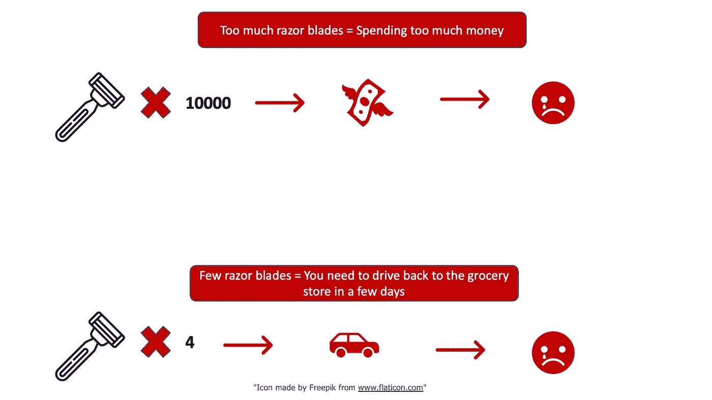
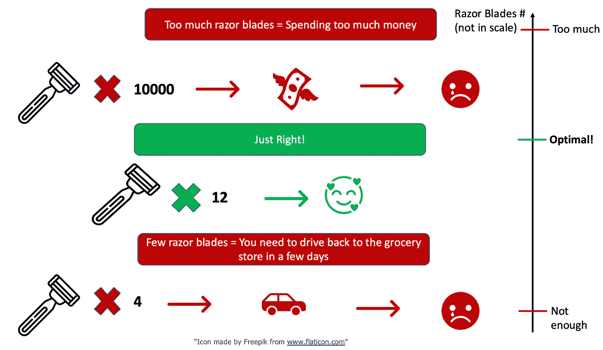
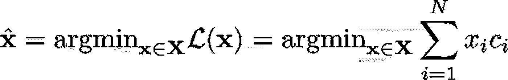
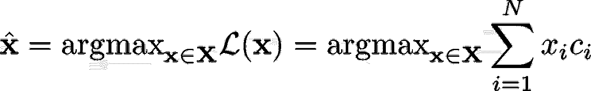
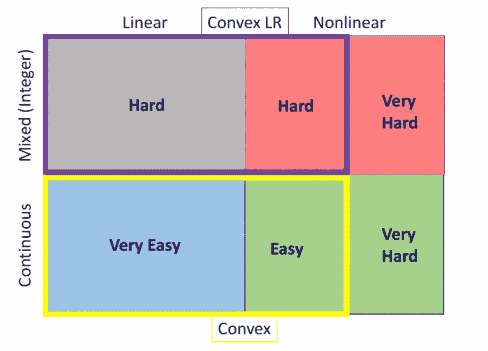
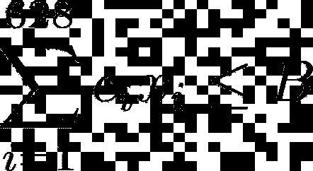
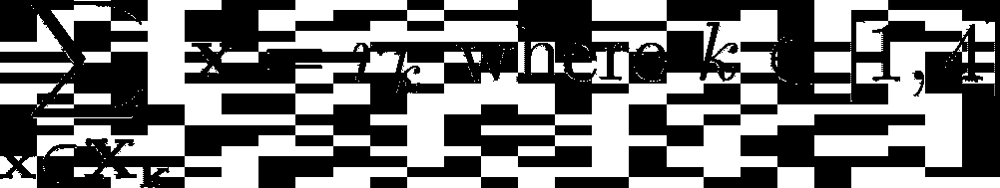
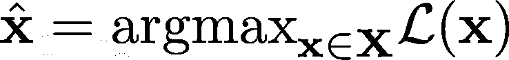

# 使用 Python 进行整数(二进制)线性优化

> 原文：<https://towardsdatascience.com/hands-on-integer-binary-linear-optimization-using-python-b6d8160cb1de>

## 用几行代码逐步介绍二元线性优化


乔恩·泰森在 [Unsplash](https://unsplash.com/s/photos/best?utm_source=unsplash&utm_medium=referral&utm_content=creditCopyText) 上的照片

# 1.介绍

我们在日常生活中大量使用优化。有时候我们想都没想就做了。

假设你正在买杂货，你需要买刀片。当然，如果你买了 10000 片剃须刀片，你的银行里就没有钱了。尽管如此，如果你买了 4 个剃须刀片，你将需要在 4 天内再次购买剃须刀片(假设你每天都刮胡子)，你将在汽油上花更多的钱，这是不明智的。所以我们通常做的是在心里解决一个**最优化**问题。



作者制作的图像

我们购买的数量介于两者之间:

*   足够大，有足够数量的刀片，可以用一两个星期
*   银行账户里还有足够的钱:)



作者制作的图像

现在，它是真正的最优值吗？大概不会。:)

你在超市里，有特定的价格，特定数量的剃须刀片。所以你只是在探索一个很小的选择范围。

此外，**你没有使用任何数学模型**。这意味着，即使这个模型实际上是最优的，你也无法证明它。这可不好。

当然，我们在谈论购买食品杂货，如果你告诉我，至少当你购买食品杂货时，你不想写任何代码或做任何数学计算，我相信你。尽管如此，在某些情况下，线性优化可能会变得很方便。

# 2.理论背景

在本文中，我们将讨论**二元线性优化**。让我们正确地定义这个问题:

1.  **二进制:**这意味着我们试图回答的问题并不像“我应该买多少刀片？”，但更像是“我该不该采取这种策略？”。这意味着答案不会是 0 到无穷大之间的整数，而是可能是 0 或 1。
2.  **线性:**这意味着解决方案是我们所有变量和一个成本/得分向量的线性组合。


作者图片

例如，在该等式中，成本(损失)函数是 x_i 值(也是 1 和 0)与由 c_i 值构成的成本向量之和，其中 I 在 1 和 N 之间(在这种情况下，我们需要做出 N 个二元决策)。

**3。优化:**意思是我们要找到我们上面表达的损失函数的最小值或者最大值。
换句话说，我们想要找到的最优解是这样的(最小化问题):



作者图片

或者类似这样的最大化问题:



作者图片

你可能已经注意到，在最小化和最大化问题中，我们已经定义了一个 **X** 集合。但这是什么呢？

想象一下，如果我告诉你，你的银行账户里有无限的钱。你会买多少刀片？我猜你会买下商店里所有的剃须刀片，因为你移动它们不会有任何问题(就像你有无限的钱去买世界上所有的汽车一样)，你也不会有储存它们的问题(因为你有无限的钱去买世界上所有的房子。

现在，想象你是一个外星人，你根本不需要刮胡子。由于你是外星人，你的问题的解决方案将是花 0 块钱买 0 片剃须刀片。

当然，这简直是荒谬的。因为，当然，没有人有无限的钱，每个人在人生的某个阶段都需要刮胡子。这被正式称为你的问题的一个**约束。**约束是让你所有的优化模型**变得棘手的东西**。没有任何约束，答案永远是 0，+无穷大或-无穷大。

现在，我们为什么非要谈 ***二元*线性优化呢？为什么一定要二进制？**

嗯，事情是这样的:



作者图片

当它是连续的时候，线性问题是非常容易的。事实上，有一个非常著名的算法可以解决这类问题，它被命名为“ [**单纯形算法**](https://en.wikipedia.org/wiki/Simplex_algorithm) ”。如果域是连续的，并且损失函数是凸的，那么求解它也相对容易。如果损失函数甚至不是凸的，问题就很难解决。

从图中可以看出我们定义“**难**的问题时，问题是整数。尽管如此，这并没有吓到我们！在实践中，再次使用单纯形算法，当函数至少是凸的时，我们很擅长解决这类问题。

***坏消息*** :我们的问题在技术上“很难”，但正如我们将看到的，它将在几分之一秒内得到解决。尽管如此，重要的是要考虑到，当决策变量和约束的数量增加时，我们可能无法得到一个经过验证的最优解。

***好消息*** :事实并非如此。:)我们的解决方案实际上将是最优的，因为它被认为是用于标准的线性整数优化问题

# 3.动手示例

正如我所承诺的，将会有一个例子。我拿了一个很有名的问题，那就是**梦幻足球那个。我使用了不同的数据集，做了与你在网上找到的其他博客文章不同的事情。然而，你将在这篇文章中看到的东西的一个很好的替代品可以在这个 other(在我看来非常好)[文章](/how-to-build-a-fantasy-premier-league-team-with-data-science-f01283281236)中找到。**

我们将使用的数据集是公开的，每个人都可以下载和使用，可以在这里找到。

让我们通过观察来描述这个问题。首先，这是你需要的:

不外乎一些非常著名的库(numpy，pandas，matplotlib，seaborn，…)和 **Pulp，**这是我们将用于适当优化部分的库。

您可以像往常一样安装它，就像这样:

```
pip install pulp
```

到目前为止没有大的惊喜:)
让我们来看看数据集:

我们有不同的玩家，他们有不同的成本、位置、积分和一系列其他特征。

如果你玩梦幻足球，你的预算有限。这意味着所有参与者的成本之和不能超过某个值(例如 100，1000，2000)。尽管如此，当然，你希望你的最终团队拥有最高的**分**。这也意味着，你希望所有玩家的分数总和尽可能的高。而且，你还得遵守以下规则(列在官方[梦幻英超页面](https://fantasy.premierleague.com/)):

*   5 名防守队员
*   两名守门员
*   5 名中场队员
*   3 名前锋

让我们试着把它转换成一个数学模型:

1.  **我们的变量。我们有 628 行。这意味着我们有 628 个二进制变量(1/0)。如果我们选择了这个玩家，我们会得到 1，如果我们不选择这个玩家，我们会得到 0。因此，最终结果是由 628 个条目组成的向量 **x** :**


作者图片

**2。预算有限**。每个玩家都有成本。这意味着我们将有一个成本列表，姑且称之为向量 **c** 。给定预算 B，预算约束如下。



作者图片

**2。角色约束**。我们需要挑选 5 名后卫，2 名守门员，3 名中场和 3 名前锋。假设我们有下面的向量:


作者图片

好的。这部分有点棘手。我们定义了 4 个不同的参与者子集(**x1，x2，x3，x4)**。第一个子集是后卫的子集，第二个是守门员的子集，第三个是中场的子集，第四个是前锋的子集。那么我们可以说:



作者图片

如果你不从事数学工作，或者你更像是一个软件工程师而不是数据科学家，这可能会很棘手，但这个想法非常简单。我们只是强加了我们正好有 5 个后卫，2 个守门员，…

3.**得分功能**。在我们的例子中，每个玩家都有一些分数。当然，我们希望**最大化**它。我们把这个点的矢量叫做 **p** 。因此，损失(得分)函数如下:


我们的最佳解决方案是:



其中 X 是服从我们讨论过的所有约束的域。

现在一切都有严格的定义。先说编码部分。

首先，让我们创建感兴趣的数据集:

画出玩家角色的分布图:

现在，让我们定义角色约束。

我们已经把它们储存在字典里了。
我们现在将以**参数化**的方式定义我们的模型。这意味着我们将得到更好的阵容，因为我们将允许我们球队的预算增加。:)

用这个函数我们将打印出实际**最优**团队给定的一定预算:

让我们探索三种场景:

*   **预算低。** B=80
*   **中间预算**。B=100
*   **高预算**。B=3000

从数学上来说，我们正在探索的领域越来越大。这意味着我们应该找到更好的解决方案(最大的积分总和)和更好的玩家。我们来看看是不是这样。

现在，有一堆属性被打印出来，但有一个是最重要的:

```
(B=80) Objective value: 1676
(B=100) Objective value: 2007
(B=3000) Objective value: 2266 
```

所以我们确实是对的。我们团队的点数随着预算变大而增加。不错:)

让我们打印结果:

**B = 80 的最佳团队:**

**B = 100 的最佳团队:**

**B = 3000 的最佳团队**:

有趣的是，当 B=3000 时，我几乎认识所有玩家，当 B=100 时，我认识一些玩家，而当 B=80 时，我几乎不认识任何玩家:)

现在，我们当然可以添加多个约束。也考虑将这种方法用于长凳。加入一些关于分数，受伤概率，球员被出售的概率的聪明考虑。

尽管如此，看到那几行代码(我不知道，也许 20 行？)可以解决，一个具有数百个变量的非常具有挑战性的问题。我不相信这可能是一个超级智能(实际上我确定它不是 T1)，但它肯定在理论上是有趣的，而且对所有幻想的足球经理来说是有实际洞察力的:)

# 4.结论

如果你喜欢这篇文章，你想知道更多关于机器学习的知识，或者你只是想问我一些你可以问的问题:

A.在 [**Linkedin**](https://www.linkedin.com/in/pieropaialunga/) 上关注我，在那里我发布我所有的故事
B .订阅我的 [**简讯**](https://piero-paialunga.medium.com/subscribe) 。这会让你了解新的故事，并给你机会发短信给我，让我收到你所有的更正或疑问。
C .成为 [**推荐会员**](https://piero-paialunga.medium.com/membership) ，这样你就不会有任何“本月最大数量的故事”，你可以阅读我(以及成千上万其他机器学习和数据科学顶级作家)写的任何关于最新可用技术的文章。