# 面向数据科学家的 Github 操作实践介绍

> 原文：<https://towardsdatascience.com/hands-on-introduction-to-github-actions-for-data-scientists-f422631c9ea7>

## Github 操作

## 了解如何通过权重和偏差、单元测试、工件创建等实现自动化实验跟踪…


安迪·赫尔曼万在 [Unsplash](https://unsplash.com/s/photos/rocket?utm_source=unsplash&utm_medium=referral&utm_content=creditCopyText) 上的照片

# 为什么选择 Github Actions？

通俗地说，Github Actions 可以让您自动执行一些例行的和重复的任务——无论是在每次将代码部署到生产分支时测试代码，检查 PRs 上的良好编码实践，跨浏览器代码测试，单元测试，从 [MLFlow](https://mlflow.org/) / [WandB](https://wandb.ai/site) 跟踪中检索运行，自动关闭陈旧问题，等等。这个清单真的是无穷无尽的。

虽然你当然可以自己从头开始编写所有这些 Github 动作，但我建议不要重新发明轮子。相反，为您的特定用例搜索可用操作的好地方是[市场](https://github.com/marketplace?type=actions)。让我们看看如何在行动中使用它们。

<https://github.com/V-Sher/Github-Actions-PlayGround>  

*注意:尽管运行随心所欲的操作可能很诱人，但私人回购每月只有有限的免费分钟数(约 2000 分钟)和存储空间(约 500MB)(分钟数每月重置，但存储空间不会)。然而，公开回购对 Github 操作的使用没有这样的限制。更多关于计费的细节可以在* [*这里找到*](https://docs.github.com/en/billing/managing-billing-for-github-actions/about-billing-for-github-actions) *。*

# 让我们开始吧…

首先，我们需要在 repo 中创建`.github/workflows`目录，并在其中创建一个新的`.yml`文件。一个典型的`.yml`文件如下所示:

```
name: Github Actions Demo
on:
  issues:
    types: [opened, edited, deleted] 
jobs:
  Job1:
    runs-on: ubuntu-latest     
    steps:
      - name: "This is Step 1 with bash command."
        run: echo "hello World"
        shell: bash
      - name: "This is step 2 using marketplace action."
        uses: actions/checkout@v3
  Job2:
    ..... Job3:
    .....
```

需要考虑的事情很少:

*   我们需要为工作流定义一个`name`以及*何时*该工作流应该运行。前者可以是您喜欢的任何东西，后者需要使用`on`来指定。例如，我们可能希望仅在打开问题、关闭问题、评论 PR、创建和编辑标签时运行工作流。查看可以触发工作流的事件的完整[列表。在我们的示例中，每当有人打开、编辑和/或删除问题时，就会触发该事件。](https://docs.github.com/en/actions/using-workflows/events-that-trigger-workflows)
*   这里我们定义了三个作业(`job1`、`job2`、`job3`)，但实际上，您可以在单个`.yml`文件中定义任意数量的作业，当`on`中定义的事件被触发时，它们将同时运行(对此有变通办法，可以延迟运行`job2`，直到`job1`完成)。
*   我们可以选择使用`runs-on`定义一个服务器来运行您的工作流。稳定的[选择](https://docs.github.com/en/actions/using-workflows/workflow-syntax-for-github-actions#choosing-github-hosted-runners)包括`ubuntu-latest`、`macos-latest`和`windows-latest`。
    *注意:注意选择，因为一些 Github 托管的跑步者比其他人消耗更多的时间。从文档来看，运行在 Windows 和 macOS 上的* [*作业消耗的时间是运行在 Linux 上的*](https://docs.github.com/en/billing/managing-billing-for-github-actions/about-billing-for-github-actions#included-storage-and-minutes) *作业的 2 到 10 倍。*
*   作业中的步骤是按顺序运行的。一定要给一个步骤起一个有意义的名字，因为这有助于以后的调试。
*   作业中的步骤可以做两件事之一——(a)使用`run`(例如，`echo "hello World"`)运行 bash 命令，或者(b)使用`uses`使用 marketplace 或第三方 Github 动作(例如，`[actions/checkout@v3](https://github.com/actions/checkout)`——这是一个流行的动作，可以帮助您签出一个 repo 并使用其中的任何文件作为工作流的一部分——我们将在本教程的后面介绍它)。

# 动手示例

我们有一个名为`Dump event payload`的工作流，其中包含一个名为`Comment`的作业，每次打开、编辑或删除一个问题时都会触发这个作业。

在解释发生了什么之前，让我们通过创建一个新问题来看看它是如何工作的。

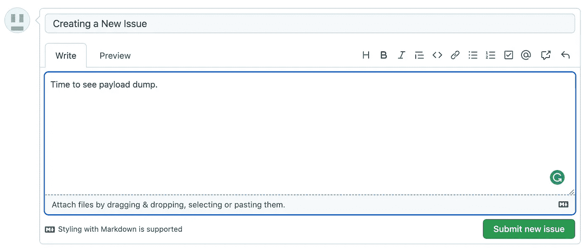

接下来，转到**动作**选项卡，您会看到一个黄色圆点，表示工作流程正在运行。一旦完成，它将变成绿色。

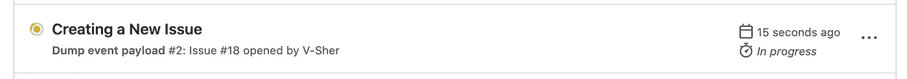

完成后，点击它来查看状态、总持续时间和创建的工件(我们将在教程的后面介绍工件)。

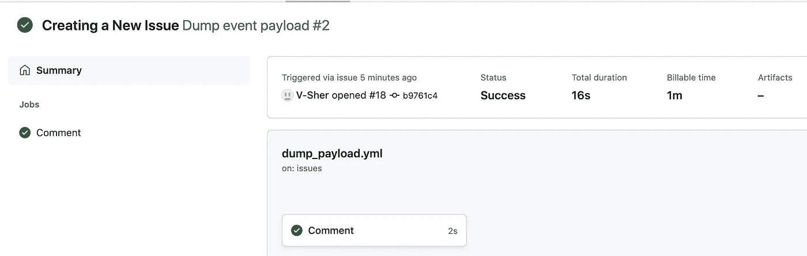

最后，进入`Comment`作业，我们应该能够看到我们在工作流中定义的所有步骤的输出。

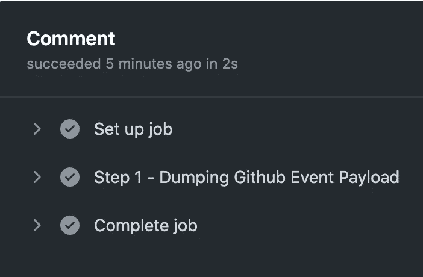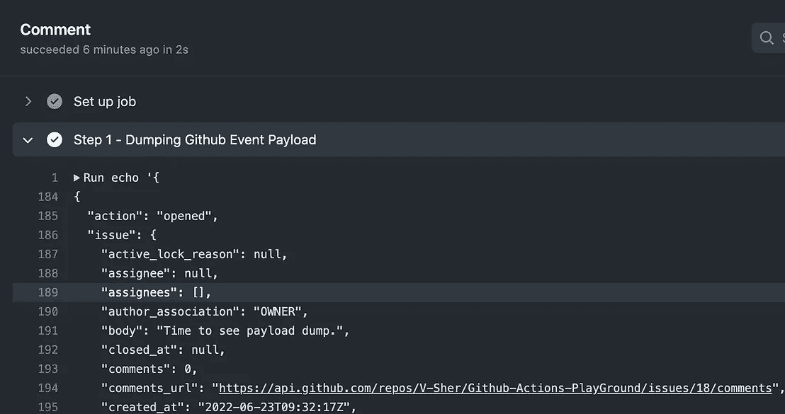

让我们来分解一下工作流程中发生了什么。

它包含一个将转储整个 Github 事件有效负载的步骤。我总是发现将`github.event`上下文中所有可用的内容转储到终端以查看触发工作流运行的事件的信息非常有用。这通常会返回一个嵌套的字典，我们将使用`toJSON()`打印出来。

*注意:您还可以检查其他上下文，如触发工作流运行的分支名称的* `*github.ref*` *，回购名称的* `*github.repository*` *等。完整的名单可以在* [*这里找到*](https://docs.github.com/en/actions/learn-github-actions/contexts#github-context) *。*

如上图所示，返回的上下文包含关于操作的信息(即`opened`)、关于问题本身的信息，例如，创建时间、问题正文、评论数量等。

*注意:* `*github.event*` *中的信息将取决于触发工作流的事件类型。例如，* `*github.event*` *的内容会根据问题是否打开而变化，而不是推送到* `*main*` *分支。*

现在我们已经知道了所有的上下文信息，我们可以在工作流中添加一个新的步骤 2，这个步骤将把这些信息的一部分`echo`到标准输出中。特别是，我们将比较由`github.event`记录的动作是否是一个*问题-编辑*事件，而不是一个*问题-打开*事件。

为了查看实际效果，我们将创建一个新问题，转到 Actions 选项卡，并检查输出。正如所料，它输出一个布尔值 0，表示为`False`。

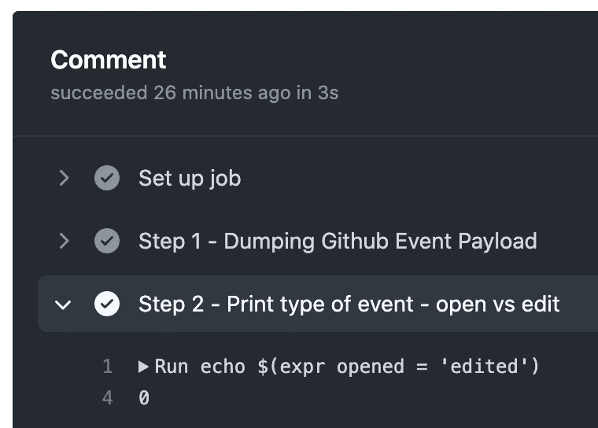

到目前为止，我们只添加了运行 bash 命令来打印标准输出的步骤。如前所述，通过使用`uses`而不是`run`，我们还可以在一个步骤中使用来自 Github marketplace 的动作。为了演示这一点，我们将使用 Peter Evan 的[Create-or-Update-Comment](https://github.com/peter-evans/create-or-update-comment)操作来创建一个自动感谢新问题创建者的评论。Readme 中解释了它的[用法](https://github.com/peter-evans/create-or-update-comment#add-a-comment-to-an-issue-or-pull-request),并且非常简单——我们必须提供需要进行评论的问题编号，以及消息的实际正文。幸运的是，我们可以将前者作为`github.event.issue`上下文的一部分，后者可以是您想要的任何内容。

让我们添加步骤 3 来实现这一点。我们将添加一个`if`子句，以确保只有当问题是`opened`(而不是`edited`或`deleted`)时才运行该步骤。

为了测试这一点，创建一个新的问题，您应该会看到下面的 bot 消息。


*注意:在下面的完整示例中，我还添加了一些额外的步骤，用于根据问题是已编辑还是已打开来定制消息。*

# 完整示例:

这是我日常使用的三个主要 Github 操作的入门知识。

# 用例 1:在一个分支上运行测试`push`

每当我们将提交推送到一个分支时，我们倾向于使用`pytest`运行一些单元测试，以确保过程中没有任何中断。

为了模拟这个过程，让我们假设我们现在正在处理一个[新的](https://github.com/V-Sher/Github-Actions-PlayGround/tree/hello-world) `[hello-world](https://github.com/V-Sher/Github-Actions-PlayGround/tree/hello-world)` [分支](https://github.com/V-Sher/Github-Actions-PlayGround/tree/hello-world)，它增加了三个新的内容——两个目录(`src`和`tests`以及一个`requirements.txt`文件)。目录结构如下所示:

```
[Github-Actions-PlayGround](https://github.com/V-Sher/Github-Actions-PlayGround)
│   README.md
│   requirements.txt    
└───src
│   │   utils.py
└───tests
    │   test_example.py
```

`utils.py`(左侧)和`test_example.py`(右侧)的内容如下:

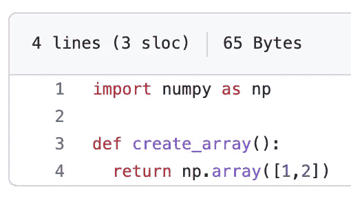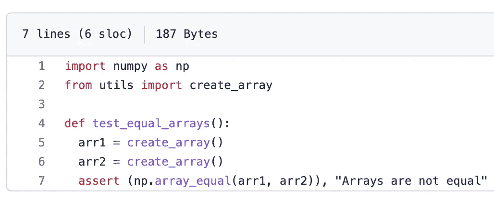

左边:`utils.py; On right test_example.py`

最后，我们准备在`hello-world`分支上的`.github/worklfows/unit_test.yml`中创建一个工作流，该工作流将在提交到分支的任何时候运行`tests`目录中的测试(目前，我们在`tests/test_example.py`中只定义了一个测试，但您已经明白了)。

为了让工作流成功运行，我们需要确保在运行测试之前，我们应该定义在运行环境中安装`requirements.txt`文件的步骤(参见下面的步骤 2)并将目录添加到`PYTHONPATH`，如果有的话(参见下面的步骤 3)。
*(附:如果你还在疑惑我是否/如何/为什么需要一个* `*pythonpath*` *，看看* [*这篇*](/understanding-python-imports-init-py-and-pythonpath-once-and-for-all-4c5249ab6355) *的文章吧。)*

需要考虑的事情很少:

*   如果我们在一个步骤中运行多个 bash 命令，我们使用管道符号(`|`)。例如，请参见步骤 2。
    *P.S .其他步骤我加了* `*|*` *只是为了简洁。*
*   在步骤 3 中，我们可以简单地执行以下操作来设置正确的`PYTHONPATH`。

```
- name: "Step3: Add ./src to PYTHONPATH"
  id: first_update_step
  run: PYTHONPATH=$GITHUB_WORKSPACE/src
```

因为我想证明我们确实正确地设置了 pythonpath，所以在步骤 3 中我们将输出`echo`到`$GITHUB_ENV`——稍后在步骤 4 中使用`env.PYTHONPATH`检索。

*   如前所述，一个步骤可以是您通常可以在终端中运行的任何 bash 命令，在最后一步，即步骤 5 中，我们使用`pytest`命令运行单元测试。

现在有趣的部分来了——看到我们的工作流程在运行。用这个新的分支`hello-world`创建一个公共关系，并尝试向它提交一个新的承诺。在每次推送时，您会看到检查自动开始，由一个黄色标记表示(见左图)。一旦完成，它们将变成绿色(见右图)。

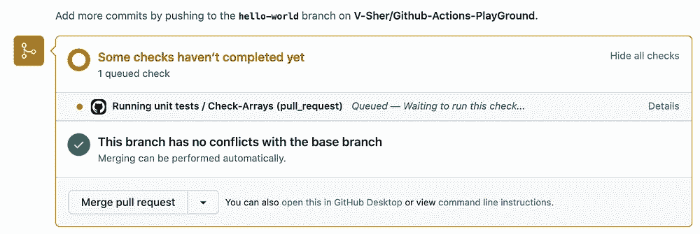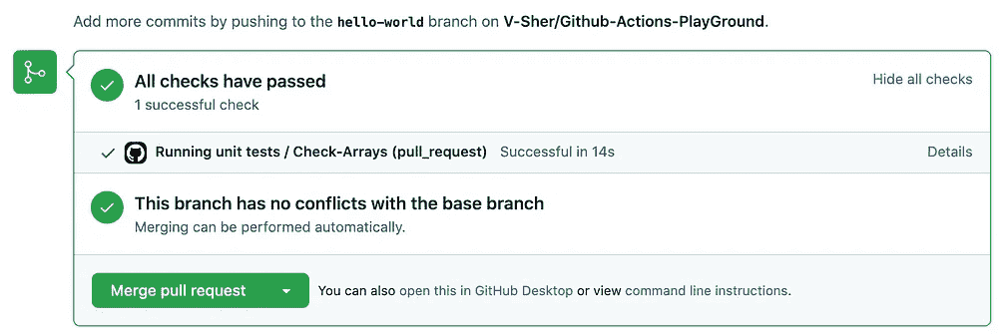

# 用例#2:在一个拉取请求下，显示从 WandB 运行的注释

对任何数据科学家来说，修改超参数都是模型训练的一部分。通常实施某种实验跟踪(如 MLFlow 或 Weights & Biases(或`wandb`))来跟踪每个不同超参数组合的结果。

因为重要的决策(比如是否合并分支并在生产中使用模型)必须基于这些来制定，所以我们获取这些运行并将其作为拉请求的一部分进行文档化是很重要的。这有助于提高代码审查过程中的透明度和责任性，因为每个人都可以看到模型的性能。

为此，`[machine-learning-apps/wandb-action](https://github.com/marketplace/actions/get-runs-from-weights-biases)` marketplace action 提供了一个简单易用的解决方案。让我们看看如何通过在`main`分支中创建一个新的工作流`.github/workflows/wandb_runs.yml`来获取一个虚拟运行(从所有记录的`wandb`运行中获取[，这里是](https://wandb.ai/vsher/GithubActionsDemo/table?workspace=user-vsher))。我们将一步一步地构建它。

*注意:我记录的模拟运行是一个涉及拥抱脸变形金刚项目的一部分。如果您想了解如何使用 Wandb 和*记录跑步，请查看 [*这个*](https://docs.wandb.ai/guides/integrations/huggingface) *快速演示🤗*变形金刚*与*只是多了 2 行代码。即使您没有使用 Huggingface，* `*wandb*` *也将为您工作，因为它是框架不可知的——这意味着它可以记录使用 Pytorch、Tensorflow、Scikit Learn、Keras 等训练的模型。具体框架查看他们的教程* [*这里*](https://docs.wandb.ai/guides/integrations) *。**

## 检测触发短语

首先，我们需要一个触发词/短语，当它出现在 PR 注释的主体中时，指示工作流获取一个`wandb`运行。除了这个触发字，我们还必须传递我们想要获取的运行的 id。我们将使用名为`[machine-learning-apps/actions-chatops](https://github.com/machine-learning-apps/actions-chatops)`的市场行动来达到同样的目的。

要使用这个动作，我们只需要使用`with`定义一个`TRIGGER_PHRASE`。它可以是任何字符串，但在我们的例子中是`/get-runs`。

*注意:您会注意到该操作还需要使用* `*env*` *设置一个名为* `*GITHUB_TOKEN*` *的环境变量，但是，GitHub 会自动创建一个唯一的* `*GITHUB_TOKEN*` *秘密以在您的工作流中使用——这意味着您不需要做任何事情！你可以在这里阅读更多关于*<https://docs.github.com/en/actions/security-guides/automatic-token-authentication#about-the-github_token-secret>**。**

*因为我想检查该步骤返回的所有内容，所以我将用它指定一个`id`。现在，我们可以使用这个带点符号的`id`(例如，`steps.chatops`)将所有内容转储到第 3 步中使用的`toJSON()`的标准输出中。*

*要查看工作流，创建一个新的 PR，希望将推送到`hello-world`分支的提交与`main`分支合并。接下来，用触发词和运行 id 在 PR 下添加新注释(见下图):*

*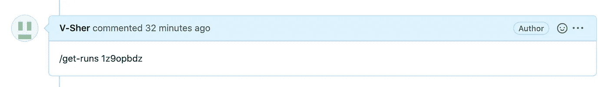*

*用 Github 动作检测触发字*

**注:您可以在* `*wandb*` *工作区的* `*run.id*` *栏中找到运行 id。**

*现在，让我们转到 Actions 选项卡，看看步骤 3 返回了什么。*

*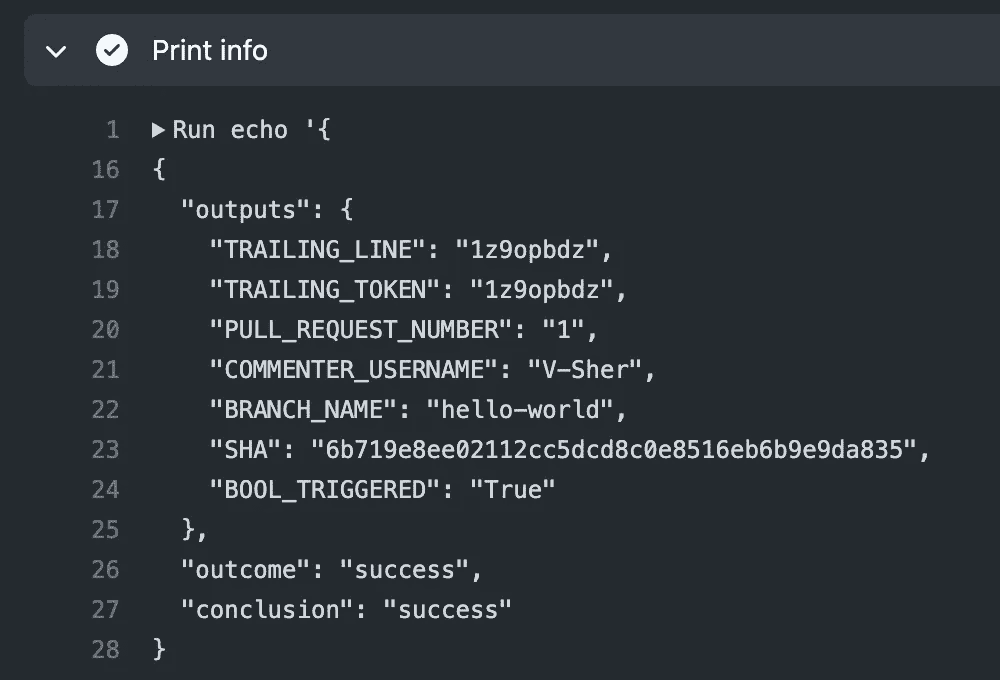*

*不出所料，我们得到了一些有用的信息，比如分支机构名称和评论者姓名。此外，与触发字一起传递的运行 id 存储在`TRAILING_TOKEN`下。至此，我们已经准备好进入步骤 4，该步骤将使用`machine-learning-apps/wandb-action`获取运行结果。*

*在步骤 4 中，我们遵循官方文档中的[指南](https://github.com/marketplace/actions/get-runs-from-weights-biases#inputs)，并使用`with`条款提供一些强制输入。*

*   *`PROJECT_NAME`是与您的`wandb`项目相关联的实体/项目名称。在上面的代码片段中，`entity`是 *vsher* 而`project`是 *GithubActionsDemo* 。*
*   *从上一步转储的数据中，我们知道可以使用`steps.chatops.outputs.TRAILING_TOKEN`提取`RUN_ID`。*
*   *除了由`RUN_ID`指定的运行，我还想获取我在重量和偏差[工作区](https://wandb.ai/vsher/GithubActionsDemo/table?workspace=user-vsher)中手动标记为`baseline`和`reference`的运行。这可以使用`BASELINE_TAGS`来完成。*
*   *还定义了一些指标(`DISPLAY_METRICS`)和配置变量(`DISPLAY_CONFIG_VARS`)。确保您在这里传递的列名也作为`wandb`日志记录的一部分被记录，并且没有任何打字错误。*
*   *我们需要提供的最后一个输入是`WANDB_API_KEY`。一旦你登录到你的`wandb`账户，你会在这里找到你的 API 密匙:[**https://wandb.ai/authorize**](https://wandb.ai/authorize)**。**复制它，然后前往 Github Settings - > Secrets(在左侧窗格)- > Actions，创建一个**新的库秘密**，名称为`WANDB_API_KEY`，值为您刚刚复制的密钥！*

**

*创建 Github 操作秘密*

*最后，我们将使用`toJSON(steps.wandb)`转储该步骤的全部输出。要查看实际情况，请向 PR 提交一个 commit，然后前往 Actions 选项卡进行检查。*

*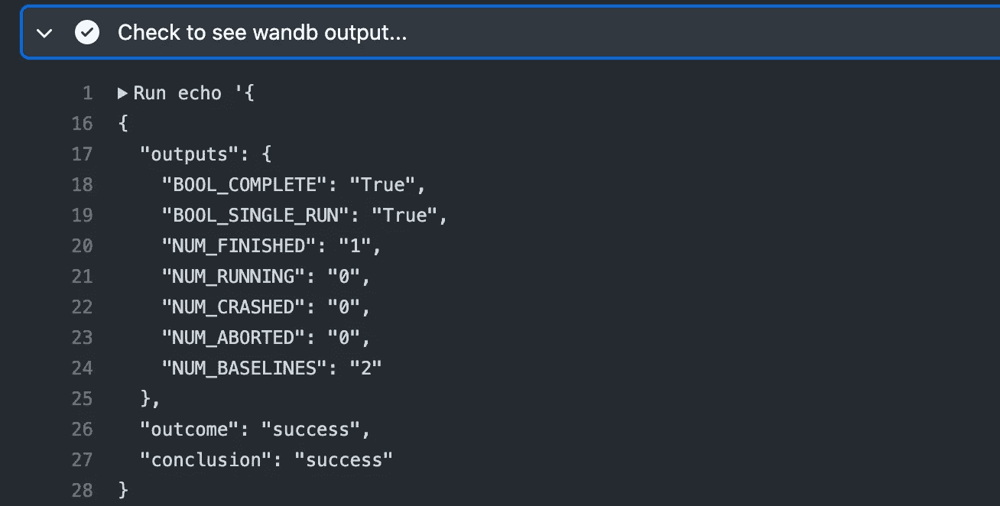*

*输出是不言自明的，但是，您可以在这里检查每个字典键[的含义。更重要的是，我们可以使用点符号引用这些输出，例如`steps.wandb.outputs.BOOL_COMPLETE`或`steps.wandb.outputs.outcome`。](https://github.com/marketplace/actions/get-runs-from-weights-biases#outputs)*

## *创建工件*

*现在你可能会想，所有这些步骤都很好，但是实际的运行应该在哪里被获取并显示在 PR 评论中！*

*通读[文档](https://github.com/marketplace/actions/get-runs-from-weights-biases#saving--displaying-model-run-data)，要记住的一件事是`machine-learning-apps/wandb-action`不在 PR 注释中显示运行，而是将一个名为`wandb_report.csv`的 csv 文件(包含提取的运行)保存到默认工作目录指定的路径中。由于我们已经在工作流的步骤 1 中使用`actions/checkout@v3`检查了回购，我们的 csv 文件将在`home/runner/work/Github-Actions-PlayGround/Github-Actions-PlayGround`中创建。*

*为了验证这一点，我们将添加一个新步骤，使用 [**操作/upload-artifact**](https://github.com/actions/upload-artifact) 操作从我们的工作流中上传这个 csv 工件。*

*要看到这一点，将一个新的 commit 推送到 PR 分支，然后转到 Actions 选项卡。您将在屏幕底部的**工件**选项卡下看到一个新创建的 **wandb_report** 。请随意下载并检查它的内容。*

*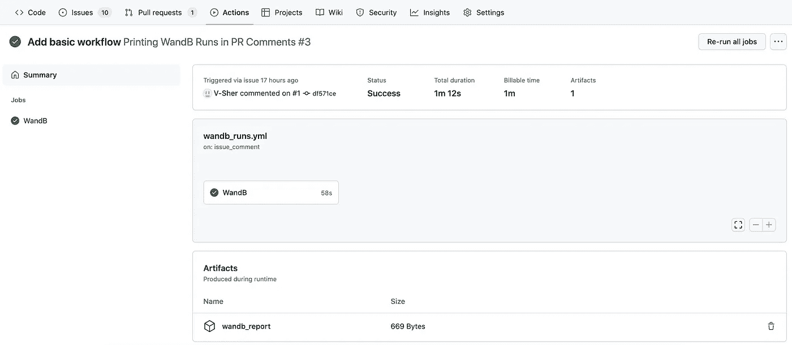*

*通过 Github 操作创建的工件*

## *在公共关系评论中显示 wandb 运行*

*现在进入工作流中最激动人心的一步——在拉请求中将这个 csv 显示为 markdown 格式的注释。我们将使用标准的 Github REST [API 来创建注释](https://docs.github.com/en/rest/issues/comments#create-an-issue-comment)。*

**注意:简单介绍一下 API 的工作原理。利用 python 的* `*requests*` *模块，我们制作一个***的 API 调用到 URL :* `*https://api.github.com/repos/{repo-name}/issues/{pr_num}/comments*` *，其中* `*repo-name*` *和* `*pr_num*` *需要显式传递。post 请求的* ***主体*** *是反映评论内容的简单字符串。***

```
***# REST API Example: Add a simple comment to PR*import requestsurl = f"https://api.github.com/repos/{repo-name}/issues/{pr_num}/comments"
data = {"body": "Making a new comment using API"}
result = requests.post(url=url, headers=headers, json=data)**
```

**API 示例排序后，我们将在一个名为`[wandb_results.py](https://github.com/V-Sher/Github-Actions-PlayGround/blob/main/action_files/wandb_results.py)`的新文件中实现类似的功能，我们将在工作流中运行该文件。python 脚本包含上述的`requests.post()`方法，以及应用于 csv 文件的一些数据帧重新格式化(在作为消息体传递之前)。**

***注:我要承认* `*wandb_results.py*` *很大程度上是基于代码可用* [*这里*](https://github.com/machine-learning-apps/actions-ml-cicd/blob/c10862b2765f7dfee78cef1c72e0223db46dc0a1/.github/workflows/repo-dispatch.yaml) *。***

**您会注意到，在`[wandb_results.py](https://github.com/V-Sher/Github-Actions-PlayGround/blob/main/action_files/wandb_results.py)`的最开始，我们使用了三个环境变量。前者，即`GITHUB_REPOSITORY`对运行工作流的服务器自动可用。后两个— `GITHUB_TOKEN`和`PR_NUM` —需要在工作流步骤中设置(参见下面的第 42–43 行)。**

## **最终揭示**

**要查看我们的完整工作流程，请前往公关部门，做一个类似于`/get-runs <run-id>`的新评论。几分钟后，您应该会看到机器人显示提取的运行。**

**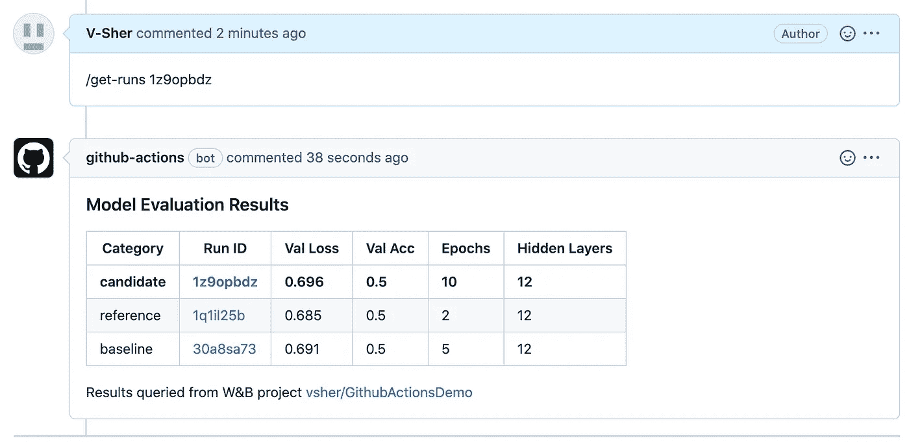**

# **用例 3:在多个 python 版本上测试脚本**

**在不涉及太多细节的情况下，我将快速介绍 Github 动作的另一个用例。[动作/设置——python](https://github.com/actions/setup-python)允许你在多个版本上测试你的 python 脚本。参见下面的示例用法。**

```
**jobs:
  build:
    runs-on: ubuntu-latest
    strategy:
      matrix:
        python-version: ['2.x', '3.x']
    name: Python ${{ matrix.python-version }} sample
    steps:
      - uses: actions/checkout@v3
      - name: Set up Python
        uses: actions/setup-python@v4
        with:
          python-version: ${{ matrix.python-version }}
          architecture: x64
      - run: python my_script.py**
```

# **结论**

**到现在为止，您已经对 GitHub Actions 的许多奇迹有了更深的理解和深刻的欣赏。希望到现在为止，您也应该能够使用相关文档自己实现它们。作为一名数据科学家，如果您在日常工作中遇到其他有用的节省时间的行动，请告诉我！**

**一如既往，如果有更简单的方法来做/解释本文中提到的一些事情，一定要让我知道。一般来说，避免不请自来的破坏性/垃圾/敌意评论！**

**直到下一次✨**

***注:除特别注明外，所有图片均为作者所有。***

**我喜欢写循序渐进的初学者指南、操作指南、面试问题、ML/AI 中使用的解码术语等。如果你想完全访问我的所有文章(和其他媒体上的文章)，那么你可以注册使用 [***我的链接***](https://varshitasher.medium.com/membership)**这里* ***。******

**</understanding-python-imports-init-py-and-pythonpath-once-and-for-all-4c5249ab6355>  </how-to-make-most-of-your-python-debugger-in-vscode-9e05dfce533f>  </step-by-step-guide-to-explaining-your-ml-project-during-a-data-science-interview-81dfaaa408bf> **