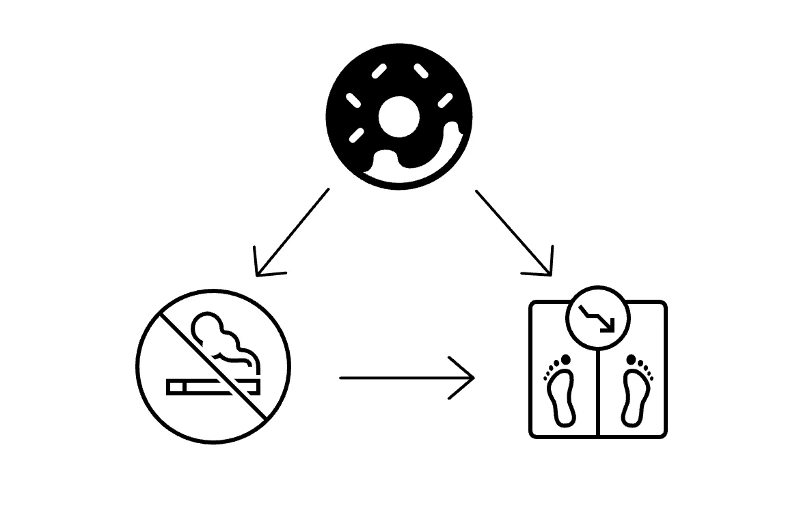
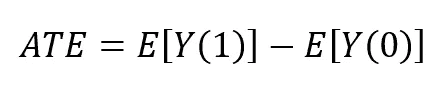
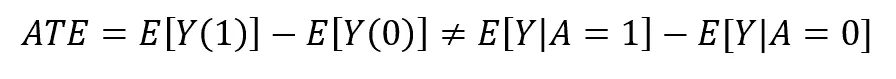
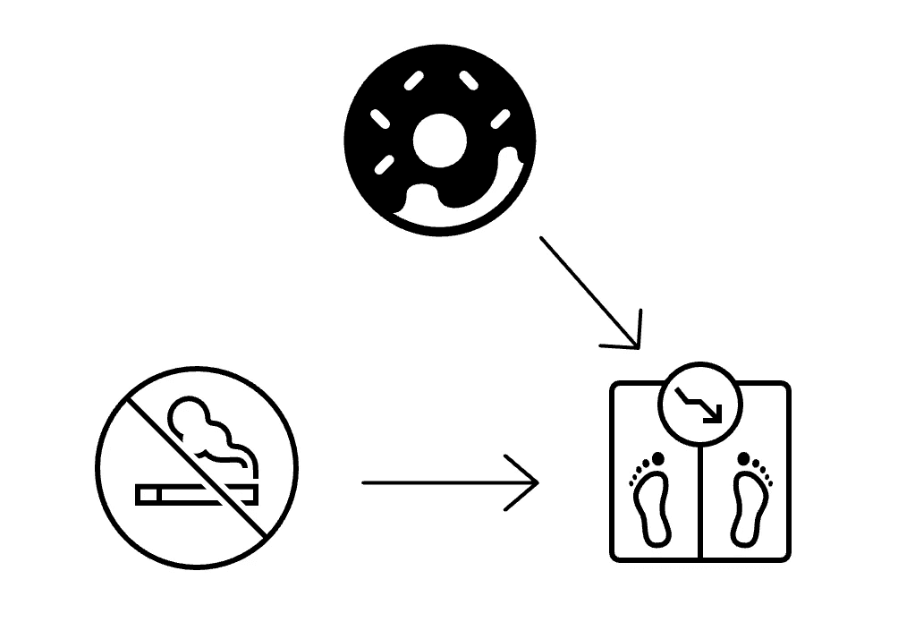
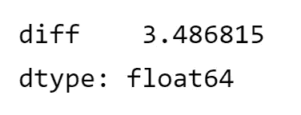
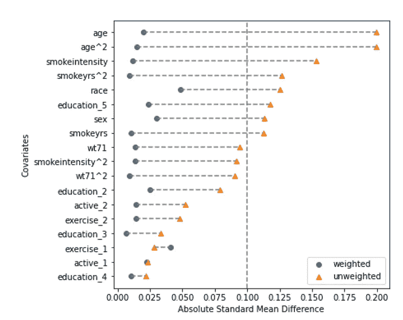
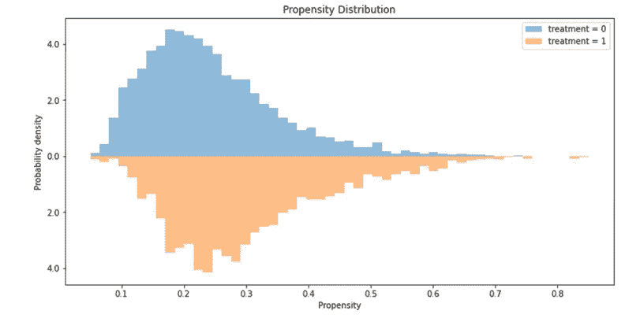

# 在 Python 中使用 causallib 进行实际操作的反向倾向加权

> 原文：<https://towardsdatascience.com/hands-on-inverse-propensity-weighting-in-python-with-causallib-14505ebdc109>

## 因果推理世界的介绍，并附有一个用最流行的方法回答因果问题的实例

照片由 [Unsplash](https://unsplash.com?utm_source=medium&utm_medium=referral) 上的 [Piret Ilver](https://unsplash.com/@saltsup?utm_source=medium&utm_medium=referral) 拍摄

# 因果问题

理解一个行为对观察到的结果的影响对于许多领域都是重要的。例如，戒烟如何影响体重增加。这类问题似乎很容易回答:只要看一个已经戒烟的人，将他们的平均体重变化与没有戒烟的人进行比较(也称为未调整估计)。假设戒烟者的平均体重增加了 3 公斤，而未戒烟者的平均体重增加了 1 公斤。那么我们可以得出结论，戒烟会导致体重增加。然而，这个结论将是非常错误的，因为这些群体不一定具有可比性。可能有混淆的因素导致了这一点。例如，戒烟者可能会感到食欲增加[，因此体重增加更多。](https://www.ncbi.nlm.nih.gov/pmc/articles/PMC2895960/)

作者图片

估计因果效应的“黄金标准”是进行随机对照试验。这意味着我们招募人员，并通过例如抛硬币的方式将他们随机分配到暴露组。这在我们的例子中是行不通的，因为我最后一次检查时，告诉人们开始/戒烟，然后检查他们 10 年内的体重是不道德和不合时宜的😁(布雷迪·尼尔有很好的[例子](https://www.youtube.com/watch?v=DXBPtpBhGqo&list=PLoazKTcS0RzZ1SUgeOgc6SWt51gfT80N0&index=1)来介绍因果关系)。

让我们从数学上来看这个(我保证前面没有吓人的方程！).在因果关系领域，符号 Y(a)是某个人接受治疗的潜在结果，意味着如果他们接受治疗，会发生什么。因此，群体的平均治疗效果(最常见的是两个潜在结果之间的预期差异):

作者图片

正如我们在上面看到的，如果有混淆，这是**而不是**等于两个观察组(戒烟者与持续吸烟者)之间的关联差异:

作者图片

尽管存在这种不平等，但获得治疗效果的无偏估计是因果推断的本质。当我们确定这三个基本假设成立时，这个陈述就变成真的了(米格尔·埃尔南的[“因果推论:如果”](https://cdn1.sph.harvard.edu/wp-content/uploads/sites/1268/2021/03/ciwhatif_hernanrobins_30mar21.pdf)第三章)。一旦我们断定影响是可识别的，我们就可以使用像 IPW 这样的因果效应估计器来估计给定治疗 E[Y|A]的平均结果。

# 可能的解决方案

反向倾向加权(IPW)是一种通过给每个数据点不同的权重来平衡组的方法，因此每个组中要素的加权分布是相似的。

为了理解 IPW 是如何发挥其魔力的，我们需要知道什么是倾向得分。倾向得分只是一个花哨的词，用于描述在给定其特征 X 的情况下，个体属于治疗组 A 的概率:

作者图片

这个概率可以用你内心渴望的任何 ML 模型来估计💕(虽然我们在技术上可以使用任何 ML 模型，但重要的是避免通过使用非常复杂的模型来过度拟合。要进一步了解这一点，请查看[这本笔记本](https://github.com/IBM/causallib/blob/master/examples/TMLE.ipynb)。一旦我们估计了这个概率，给每个样本的权重就是倾向得分的倒数！(有关 IPW 的更详细解释，请参见 Miguel Hernan 的[“因果推断:如果...会怎样”](https://cdn1.sph.harvard.edu/wp-content/uploads/sites/1268/2021/03/ciwhatif_hernanrobins_30mar21.pdf)的第 12 章)重新加权创建了一个不再具有潜在混杂关联的伪总体，这相当于移除了因果图中的箭头:

作者图片

## 何时选择 IPW

所有因果模型都需要有多个假设才能可靠:

*   存在混杂因素——治疗分配和结果都受到一些协变量的影响。如果不是，则不需要对混杂进行校正。
*   没有不可测量的混杂因素——所有的混杂变量都在您的模型中考虑到了。
*   不存在阳性违规——每个样本都有属于两个治疗组的阳性概率。

在以下情况下，应选择 IPW 而非其他因果模型:

*   您不需要单个水平的预测，只需要整个群体的平均值。
*   由于 IPW 在给定协变量的情况下对治疗分配进行建模，您需要感觉自己很好地理解了治疗分配程序。

这一切都很棒，但实际上是如何做到的呢？这就是 causallib 发挥作用的地方。

# 用 causallib 寻找因果关系

Causallib 是一个开源的 python 包，只要对数据的假设有效，它就可以让你插入任何 sklearn ML 模型，得到因果预测。该软件包可以执行多种因果模型，如 IPW、结果模型和双稳健方法，并提供一套评估模型性能的评估。它在 PyPi 上可用，可以通过运行`pip install causallib`来安装。这里显示的代码是使用版本 0.9.0 运行的。

在这个例子中，我们将观察戒烟对体重变化的影响。数据来自 1566 名年龄在 25-74 岁的吸烟者，他们进行了基线访问和 10 年后的随访。接受治疗的个体(A=1)是那些在随访前报告戒烟的个体，而未接受治疗的个体(A=0)则不然。数据摘自 Miguel Hernan 的[“因果推理:如果……会怎样”](https://cdn1.sph.harvard.edu/wp-content/uploads/sites/1268/2021/03/ciwhatif_hernanrobins_30mar21.pdf)，可以在找到[。](https://www.hsph.harvard.edu/miguel-hernan/causal-inference-book/)

我们的目标是估计戒烟(治疗) *A* 对体重增加(结果) *Y* 的平均因果效应。从数据来看，戒烟者的平均体重增加了 4.5 公斤，非戒烟者的平均体重增加了 2.0 公斤。因此，差异为 2.5 千克，95%置信区间为 1.7 至 3.4。正如我在本文开头提到的，这种类型的估计被称为“未调整的估计”。所以，你可能会想，太好了，我们找到了问题的答案！但是这并没有告诉我们戒烟对减肥有什么影响，它只是报告了戒烟者和非戒烟者之间体重变化的差异。如果戒烟是随机分配的，我们可以将此作为有效的效果评估。但是，由于戒烟的可能性本身受到个体协变量的影响，简单地比较两组的平均值会产生对治疗效果的有偏估计。为了消除估计的偏差，我们需要对混杂因素进行偏差调整。所以，让我们在 IPW 的帮助下再试一次。

causallib 的 IPW 是一个“元学习者”。它包装了一个通用的二元结果预测模型，并使用它来估计倾向和效果。底层学习者可以是任何东西，只要它支持 sklearn 接口。对于这个例子，我们将使用良好的旧逻辑回归作为我们的核心估计，因为它对过度拟合相对稳健，并且在我对该数据进行实验时具有与其他模型相当的性能。

首先，我们用我们选择的学习者实例化 IPW 类，并使其适合数据:

*   数据。x 是所有对象的特征矩阵
*   data.a 是每个受试者的治疗(戒烟/未戒烟)

接下来，我们估计每个治疗组的平均平衡结果。我们将使用 hor vitz–Thompson 估计值，它是 *Y* 的反向倾向加权平均值。

该函数输出一系列(“结果”)，其中预测了两个治疗组的平均潜在结果。

最后，一个“效果”是两个潜在结果的对比，我们必须在加法(差异)和乘法(比率)尺度上自由指定治疗效果。我们将使用不同之处:

作者图片

我们可以看到，戒烟者的平均体重增加了 3.4 公斤，这与我们未经调整的估计值(2.5 公斤)不同。这与 Miguel Hernan 的[“因果推理:如果”](https://cdn1.sph.harvard.edu/wp-content/uploads/sites/1268/2021/03/ciwhatif_hernanrobins_30mar21.pdf)第 152 页中看到的结果相同。

# 使用 causallib 进行评估

因果推理模型和最大似然模型之间的关键区别是，在监督学习中，我们几乎总是有基础真理。假设我们正在训练一个分类器来预测戒烟十年后体重下降的公斤数。当我们测试模型时，我们可以看到哪些样本具有较大的残差，因为它们被标记了。因为“因果推理的基本问题”(在布雷迪·尼尔[因果推理简介](https://www.bradyneal.com/Introduction_to_Causal_Inference-Dec17_2020-Neal.pdf) 2.2 中深入解释)，这种检查你的模型实际工作得有多好的能力在这里并不存在。简而言之，我们永远无法直接验证潜在的结果是否正确，因为我们无法在同一个人身上，在两种不同的行动下，观察到两种不同的结果。一个人不可能既戒烟又不戒烟。

Matheus Facure Alves 的照片，来自“[勇敢和真实的因果推理](https://matheusfacure.github.io/python-causality-handbook/landing-page.html)”

即使您不能评估因果推理中的基本事实，causallib 也提供了一些评估来帮助您检测模型中的问题。

`evaluate`功能使我们能够交叉验证模型，创建评估图并计算分数。首先，我们为我们的模型指定我们感兴趣的评估指标。评估是通过交叉验证和在每个折叠上重新装配模型来完成的。

我们将生成一个新的模型，这个模型与之前的数据不符，并检查它的执行情况。

## 爱情情节

爱情图计算加权前后每个协变量组间的标准化平均差异。我们希望加权后所有协变量的差异将小于某个阈值，通常为 0.1。这一结果表明，加权成功地创建了一个伪群体，其中协变量在两组之间平均分布。

作者图片

## 倾向分布图

另一个重要的评估图是两个治疗组的倾向分数的分布。理想情况下，这两个分布应该是重叠的，但不是相同的。如果它们是相同的，这将意味着在给定协变量的情况下，两个治疗组是不可区分的。这也证实了不存在阳性违反，因为每个受试者在任一治疗组中都有非零概率，并且分布重叠(查看[本笔记本](https://github.com/IBM/causallib/blob/master/examples/lalonde.ipynb)中的阳性违反示例)。

作者图片

# 讨论

在这篇文章中，我们展示了如何使用 causallib 的 IPW 来了解治疗和结果之间的因果关系。causallib 包使我们能够利用丰富的 Scikit-Learn 模型和评估指标库来进行因果估计，从而可以轻松地将这些类型的问题纳入任何数据探索流程。

有更多的因果模型可以使用，如标准化、双稳健模型、X-learners 等。每个都有不同的超参数来调整个性化的评估，因为你喜欢。

## 一些有用的链接:

*   [Causallib 示例 IPW 笔记本](https://github.com/IBM/causallib/blob/master/examples/ipw.ipynb)
*   [caussallib GitHub](https://github.com/IBM/causallib)
*   [《因果推理:如果》,作者米格尔·埃尔南](https://cdn1.sph.harvard.edu/wp-content/uploads/sites/1268/2021/03/ciwhatif_hernanrobins_30mar21.pdf)
*   [布雷迪·尼尔的因果推理课程](https://www.youtube.com/playlist?list=PLoazKTcS0RzZ1SUgeOgc6SWt51gfT80N0)
*   《勇敢和真实的因果推理》作者马修斯·法库·阿尔维斯

感谢[迈克尔·M·丹齐格](https://medium.com/u/fb192dded1d1?source=post_page-----14505ebdc109--------------------------------)和[埃胡德·卡拉瓦尼](https://medium.com/u/2f86c3f9b1e0?source=post_page-----14505ebdc109--------------------------------)帮助创建这个帖子！