# 实践强化学习课程:第 5 部分

> 原文：<https://towardsdatascience.com/hands-on-reinforcement-learning-course-part-5-bdb2e7fa243c>

## 深度 Q 学习

我们再深入一点！🙏来自 [Pexels](https://www.pexels.com/photo/photo-of-sea-turtle-2765872/?utm_content=attributionCopyText&utm_medium=referral&utm_source=pexels) 的 Jeremy Bishop

# 欢迎来到我的强化学习课程❤️

这是强化学习实践课程的第 5 部分，带你从零到英雄🦸‍♂️.

[第一部分:强化学习简介](/hands-on-reinforcement-learning-course-part-1-269b50e39d08)
[第二部分:表格 Q-learning](/hands-on-reinforcement-learning-course-part-2-1b0828a1046b)
[第三部分:表格 SARSA](/hands-on-reinforcement-learning-course-part-3-5db40e7938d4)
[第四部分:线性 Q-learning](/hands-on-reinforcement-learning-course-part-4-55da5eae851f)
👉🏻**第五部分:深度 Q 学习**(今天)

在第 4 部分中，我们为 Cart Pole 环境构建了一个不错的代理。我们使用线性模型的参数 Q 学习。

今天我们将用一个**神经网络**代替这个线性模型。

我们将彻底解决手推车的环境问题😎

今天的课程有点长，因为它包括一个关于训练神经网络模型的迷你速成班。除非你是深度学习方面的专家，否则我强烈建议你不要跳过它。

本课所有代码都在 [**本 Github repo**](https://github.com/Paulescu/hands-on-rl) **中。Git 克隆它来跟进今天的问题。**

如果你喜欢这个课程，请[在 Github 上给它一个⭐](https://github.com/Paulescu/hands-on-rl) ！

[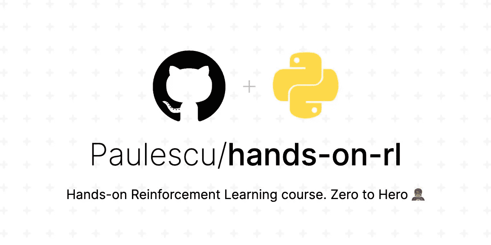](https://github.com/Paulescu/hands-on-rl)

☕.喝了一大口我们准备开始了！

# 第五部分

# 内容

1.  [我们深入吧！](#1391)
2.  [深度学习实践介绍](#459b)
3.  [深度 Q 学习解决大车杆子](#2d1f)
4.  [重述✨](#16f3)
5.  [作业📚](#1a9f)
6.  [接下来呢？❤️](#dffb)

# 1.我们深入吧！

在上一课中，我们使用这种线性参数化来表示最佳 q 函数。

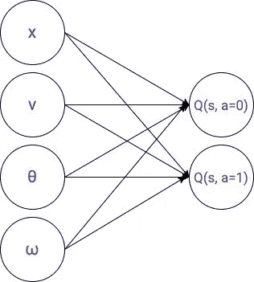

线性 q 函数(图片由作者提供)

这是一个只有 10 个参数的小模型。

参数 Q 学习代理的成功(或失败)很大程度上取决于我们用来逼近最优 Q 值函数的参数化。

线性模型概念简单，训练速度快，运行速度快。然而，他们不是很*灵活*。给定一组输入和输出，线性图层很难将输入映射到输出。

这是神经网络进入游戏的时候。

神经网络模型是我们拥有的最强大的函数逼近。它们非常灵活，可用于揭示输入要素和目标标注之间的复杂模式。

> ***普适逼近定理*** 📘*是一个数学结果，本质上是说*
> 
> 神经网络就像你希望的那样灵活。如果您设计了一个足够大的神经网络(即具有足够的参数)，您将发现输入特征和目标值之间的精确映射。

或者如果你喜欢更哲学的风格…

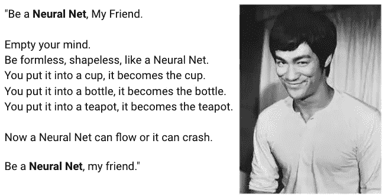

布鲁斯大师说得再好不过了(由作者从[剪贴画](https://openclipart.org/detail/223057/bruce-lee-1973)编辑)

今天，我们将用最简单的神经网络架构取代第 4 部分中的线性模型:一个**前馈**神经网络。

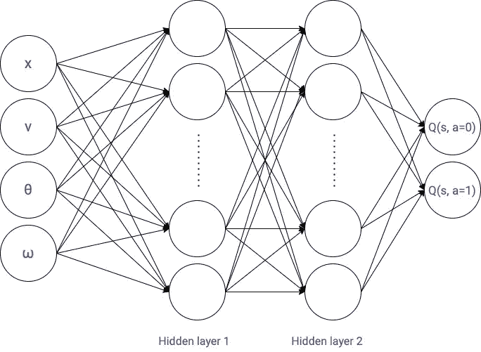

前馈神经网络(图片由作者提供)

在课程的后面，我们将使用其他神经网络来处理更复杂的*状态*空间(例如卷积神经网络)。

正如我在课程开始时所说的，我并不期望你成为神经网络方面的专家。

如果你确实是其中之一，请随意跳过下一部分，直接进入第 3 部分。

否则，就让我们用下面这个我今天为大家创造的模仿学习问题来预热我们的深度学习掌握吧。

要涵盖的内容相当多，所以用深度聚焦来武装自己。

# 2.深度学习实践介绍:从标记数据中学习最优策略

[👉🏽notebooks/05 _ crash _ course _ on _ neural _ nets . ipynb](https://github.com/Paulescu/hands-on-rl/blob/main/03_cart_pole/notebooks/05_crash_course_on_neural_nets.ipynb)

在本节中，我们将使用深度学习解决一个有监督的机器学习问题。

*但是，我们为什么不直接解决大车杆子呢？🤔*

有监督的最大似然问题与我们在参数 Q 学习中解决的优化之间的关键区别在于，在超最大似然中，目标是**固定的**，而在参数 Q 学习中，目标是**不固定的**，而是*移动* **。**

正因为如此，有监督的最大似然问题更容易解决，因此它们是我们接触神经网络模型的更好起点。

在监督机器学习中，你有一个数据集对 ***(输入，输出)*** ，你想找到输入(又名特征)和输出(又名目标/标签)之间的*右*映射。

*好，我们要解决的有监督 ML 问题是什么？*

我采用了我们将在下一节中训练的完美 deep-q 代理(也称为*完美*代理),并生成了 1000 个状态的样本(输入),以及这个完美代理采取的相应动作(输出)。从这个观察样本中，我们想了解代理遵循的基本最优策略。

就当是模仿学习问题吧。从专家的表现中给你 1000 个样本(状态，动作)，你的工作是学习代理遵循的基本策略。

说够了。让我们看看代码。我们首先看看如何生成训练数据。然后，我们将训练几个神经网络模型，并提取一些学习。

## 2.1 生成列车数据

像往常一样，我们从加载环境开始

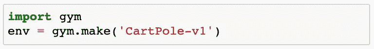

为了生成训练数据，我们首先需要获得完美的代理参数(和超参数)。我把这些上传到了你可以访问的公共 Google Drive，你可以从那里下载，如下所示:

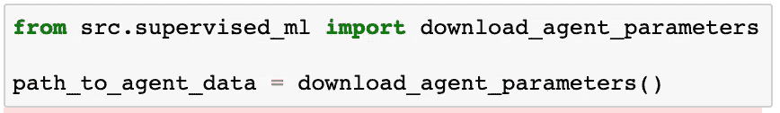

在`path_to_agent_data`中，您有两个文件:

*   `model` →用参数函数的参数保存 PyTorch 模型，本例中为神经网络。
*   `hparams.json` →用于培训代理的超参数

现在，您可以从这些参数(和超参数)实例化一个`QAgent`对象，如下所示:

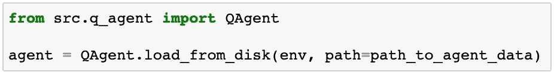

在继续之前，我希望你相信我说的代理人是完美的。我们随机 1000 集评估一下，查看一下总奖励。

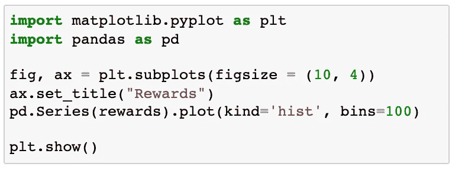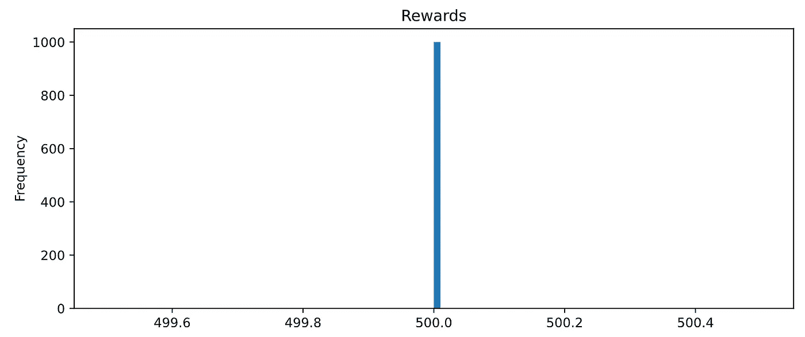

满分！

500 是最高总奖励，我们的经纪人在所有 1000 集里都拿到了。太棒了。您需要等到下一节自己来训练这个完美的代理。

现在，我们让代理与环境交互几集，直到我们收集到 1000 对(状态、动作)。这就是我们如何生成我们的**训练数据**。

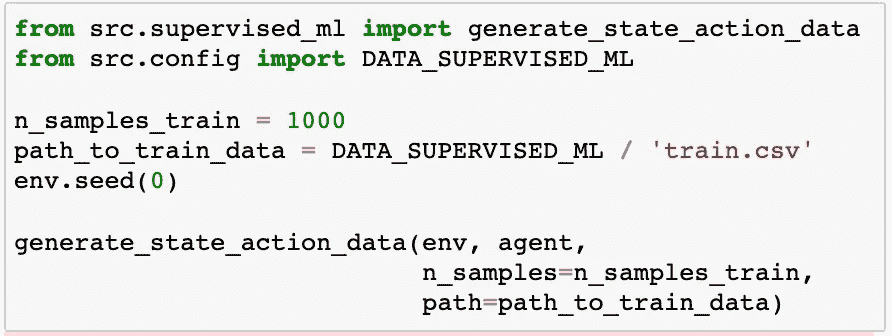

`generate_state_action_data`函数生成一个 CSV 文件，如下所示:

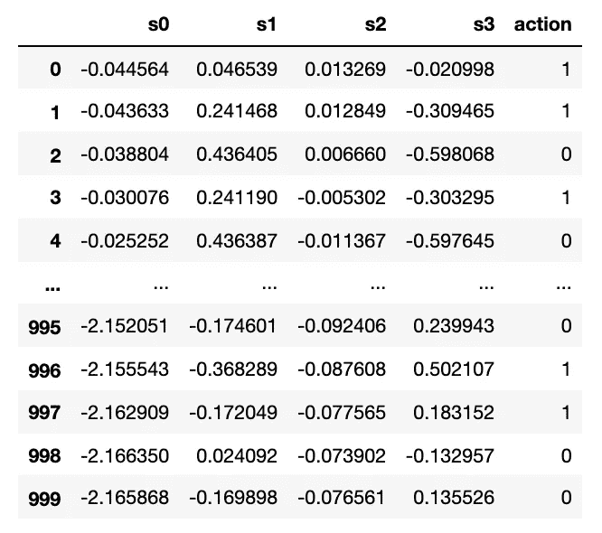

train.csv

其中:

*   `s1, s2, s3, s4`是输入特征，和
*   `action`是目标，在本例中是二进制目标(0 或 1)。我们将解决一个**二元分类问题**。

现在，在我们进入建模部分之前，我们还需要做一件事。

当你训练有监督的 ML 模型(尤其是神经网络)并且想要正确评估它们的准确性时，你**不能**使用你用来训练它们的相同数据集。

*为什么？*

因为可能发生的情况是，你的模型只是简单地记住了训练数据，而不是揭示特征和目标之间的真实相关性。这在高参数模型中很容易发生，比如大型神经网络。因此，当您将模型用于模型的新的和不可见的数据时，您的模型性能将低于您在训练期间获得的性能。

为了解决这个问题，我们生成另一个数据集，称为**测试数据**，我们不使用它来调整任何模型参数。测试数据专门用于评估模型的性能。

我们生成的方式和火车集一样。

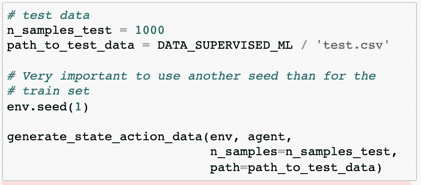

观察我们如何使用不同于`train.csv`的种子，以保证我们不会为训练和测试数据集生成相同的样本。

酷毙了。我们得到了数据。让我们继续到建模部分。

## 2.2.系统模型化

正如我们在强化学习问题中经常做的那样，最好从建立一个快速基线模型开始，以了解问题有多难。

让我们加载 CSV 文件:

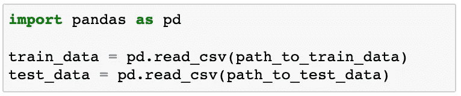

如果我们检查训练数据，我们可以看到目标值(即最佳行动)具有完全平衡的分布。

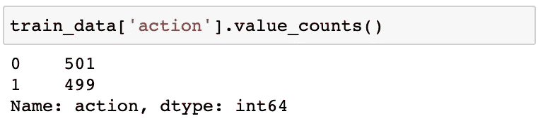

这意味着预测总是 action = 0(或 action = 1)的非常虚拟的基线模型具有 50%的准确性，这意味着模型预测有 50%的时间匹配正确的标签。

## 将数据加载到 PyTorch 模型中

在我们进入模型之前，我们需要构建一个*数据* *管道*来快速地将数据从 *pandas 数据帧*成批移动到我们的 PyTorch 模型。

PyTorch API 提供了两个辅助对象来让您轻松完成这项工作:

*   `torch.utils.data.Dataset` →包裹您的熊猫数据框的便捷包装。它检索数据帧特征并一次标记一个样本。
*   `torch.utils.data.DataLoader` →为您完成繁重的工作，批量将数据从`Dataset`转移到 Pytorch 模型。它使用 Python 的`multiprocessing`库来加速数据检索。

我们需要两条数据管道，一条用于训练数据，一条用于测试数据。

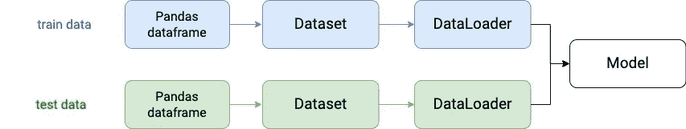

数据管道(图片由作者提供)

我们创建了一个自定义的`Dataset`类，并实现了 3 个必不可少的方法:`__init__()`、`__len__()`和`__getitem__(idx).`

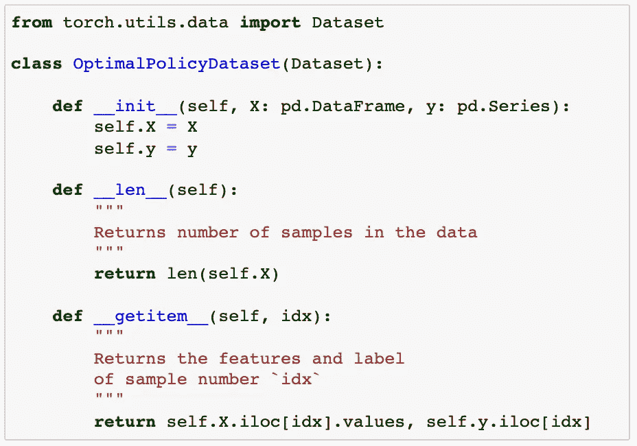

然后，我们实例化 2 个`Dataset`对象:

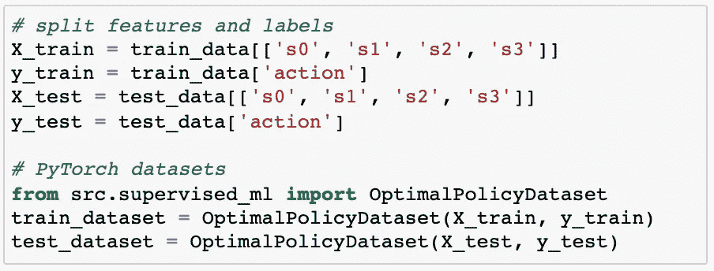

`DataLoaders`甚至更容易实现，因为我们只需要声明它们，如下所示:

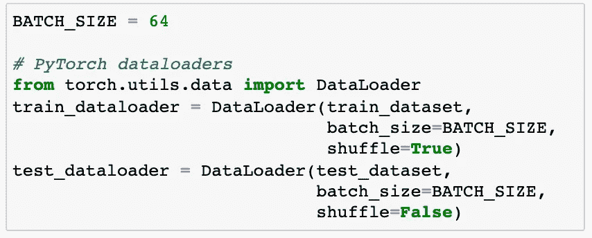

很好！数据管道准备好了。现在，我们有了一种快速成批移动数据并将其提供给我们将要构建的模型的方法。

所有模型都将使用[交叉熵损失函数](https://pytorch.org/docs/stable/generated/torch.nn.CrossEntropyLoss.html)进行训练，这是分类问题的标准选择。

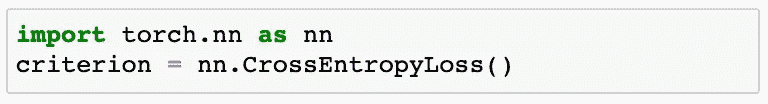

我们将使用 [TensorBoard](https://www.tensorflow.org/tensorboard) 来可视化培训和测试指标(损失和准确性)。尽管 Tensorboard 是由 Google 为其 DL 框架 TensorFlow 开发的，但它与 PyTorch 集成得非常好。

## 2.2.1 线性模型→ 10 个参数

这是我们学习最优策略的第一个候选人。

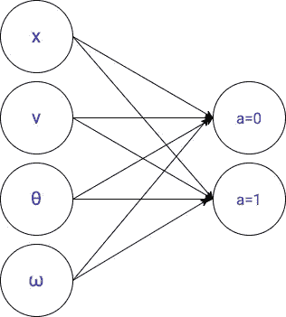

线性模型=无隐层的神经网络(图片由作者提供)

我们创建 PyTorch 模型如下:

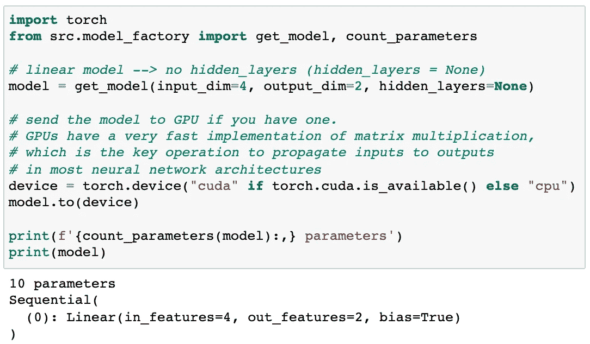

我们训练这个模型 150 个纪元。一个历元是整个列车数据的完整传递。因此，我们将使用训练数据中的每个样本 150 次来调整模型参数

在每个时期结束时，我们使用测试数据计算模型损失和精确度。通过这种方式，我们可以衡量*模型有多好*。

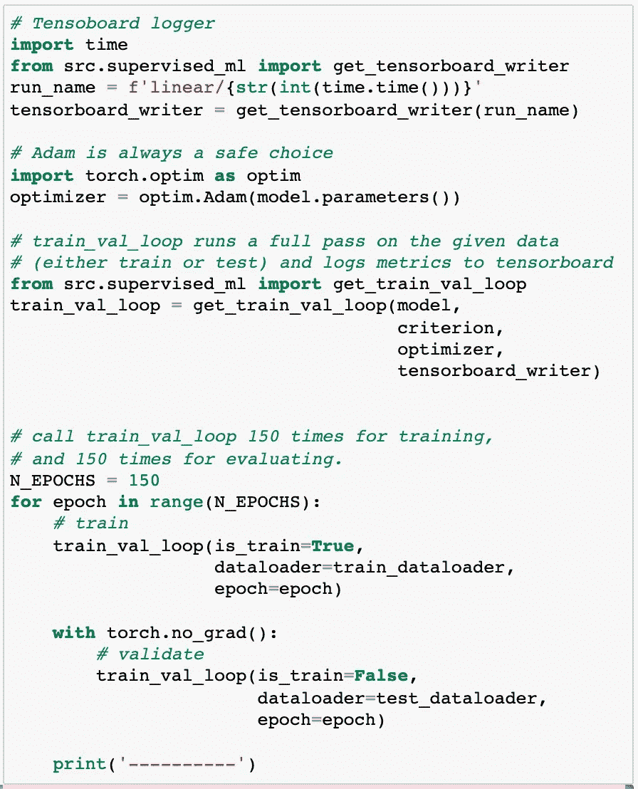

让我们启动 Tensorboard 服务器来可视化训练和测试指标。我们可以在 Jupyter 笔记本上使用

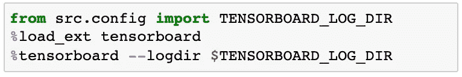

> **注意**:如果你愿意，你可以直接从命令行启动 Tensorboard，并导航到控制台上打印的 URL，在我这里是`localhost:6009/`

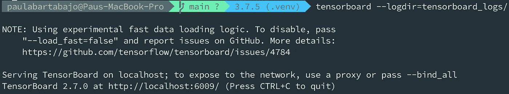

打开 Tensoboard，选择最近一次跑步。您应该会看到这两个图表:

*   **列车数据上的精度**，一批接一批。它稳定在 70%左右。

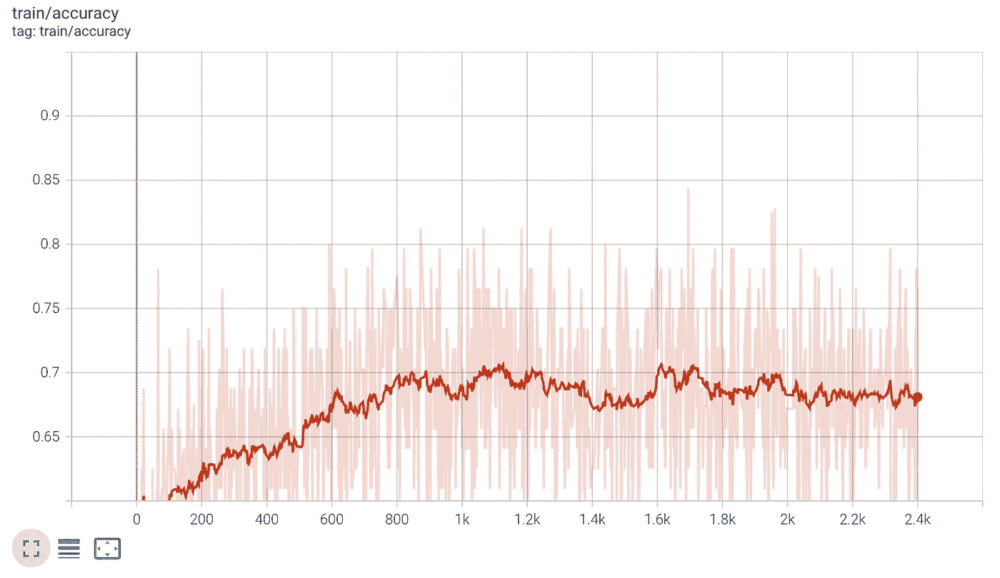

列车精度(图片由作者提供)

*   **测试数据的准确性**，一批接一批。它也稳定在 70%左右。这个数字大于 50%的基线，因此模型正在学习一些东西。

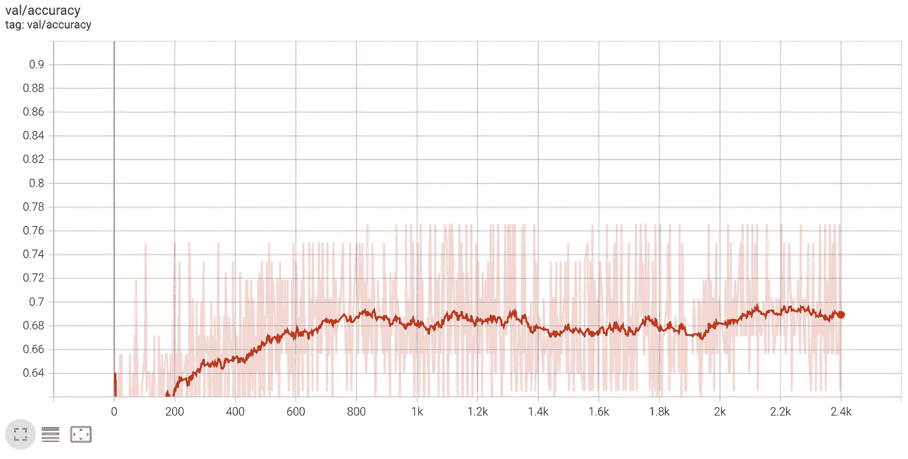

测试准确度(图片由作者提供)

70%没那么差，但也远非完美。

> ***💡提示:绘制训练度量来检测 bug*** 总是绘制训练准确性和损失，因为它可以帮助您找到代码中的 bug。如果准确度(损失)在每个时期后没有增加(减少)，这意味着你的网络没有学习。这可能是由于您需要修复代码中的一个 bug。
> 
> ***🧠学习:欠拟合训练数据***
> 如果模型对于任务来说太小，我们观察到训练和测试精度都处于中等水平，在这种情况下为 70%。我们说模型**不符合数据**，我们需要尝试一个更大的模型。

让我们扩大网络以改善结果。

## 2.2.2 具有 1 个隐含层的神经网络→1795 个参数

我们创建一个具有 256 个单元的隐藏层的神经网络:

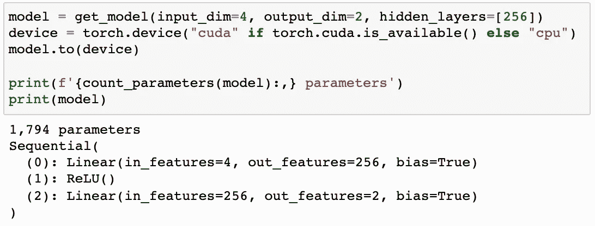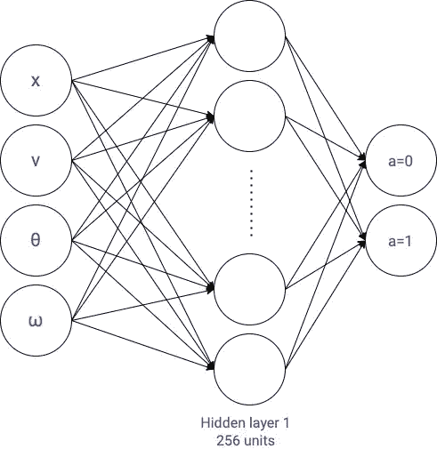

带有 1 个隐藏层的神经网络(图片由作者提供)

我们训练它 150 个历元，然后去 Tensorboard 检查指标

*   **测试数据的准确性。**我们从 70%提高到了 85%左右。

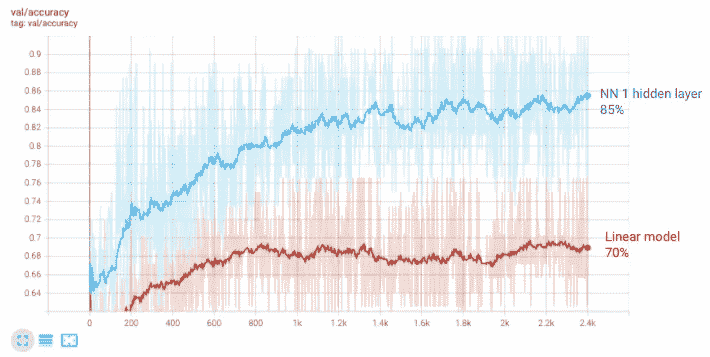

测试准确度(图片由作者提供)

85%看起来好多了。但是，我认为我们可以做得更好。让我们试试更大的神经网络。

## 2.2.3 具有两个隐藏层的神经网络→ 67，586 个参数

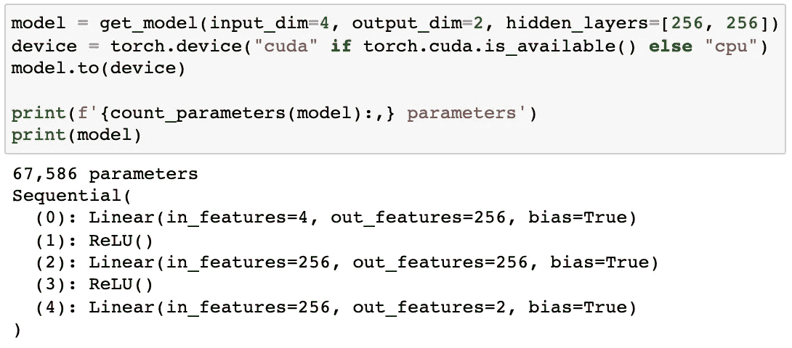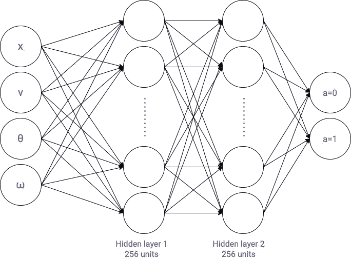

带有两个隐藏层的神经网络(图片由作者提供)

你会观察到它的**测试准确率**达到 90%。

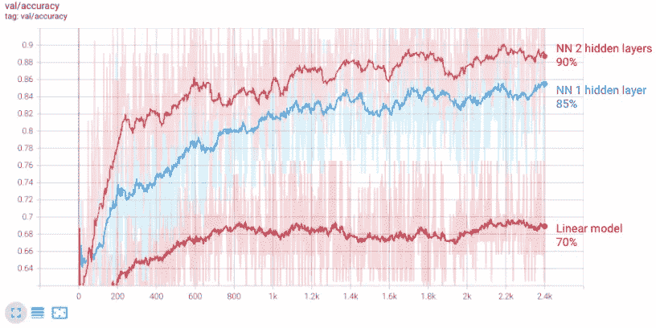

测试准确度(图片由作者提供)

增加网络规模似乎是一个明智的策略。我们再进一步，再加一层。

## 2 . 2 . 4 3 隐层神经网络→ 133，378 个参数

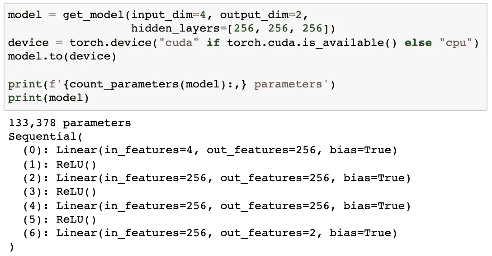

具有 3 个隐藏层的神经网络(图片由作者提供)

如果你在测试数据上检查它的准确性，你会看到它达到 90%。因此，这种模式并不能改善我们的最佳结果。

测试准确度(图片由作者提供)

直观地看，我们之前的模型，有两个隐藏层和大约 67k 的参数，做得足够好了。使用更复杂的模型并不能真正带来更好的结果。

> ***🧠学习:过拟合训练数据*** 如果你的模型相对于训练数据量过大，你会**过拟合**训练数据。要检测过度拟合，看一看火车和测试损失。
> 如果训练损失继续减少，而测试损失保持平稳，这意味着你开始过度拟合

在这种情况下，我们可以通过查看序列和测试损耗来检查过度拟合:

*   **列车数据丢失**几乎达到 0 **。**

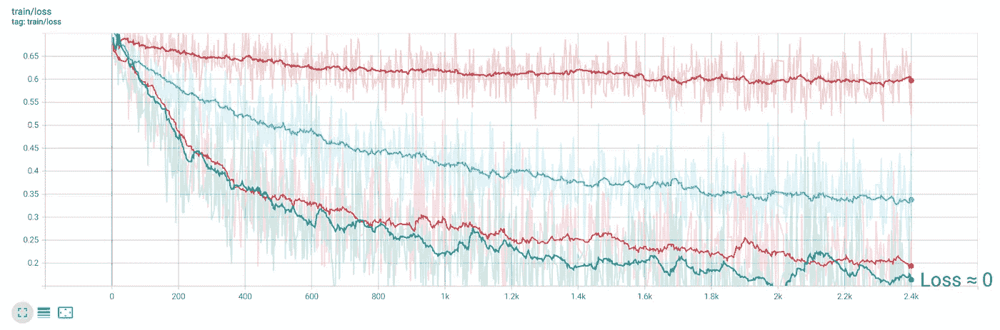

列车数据丢失几乎达到 0！(图片由作者提供)

*   **测试数据损失**在 0.3 处达到平稳状态，这与具有两个隐藏层的先前模型相同。

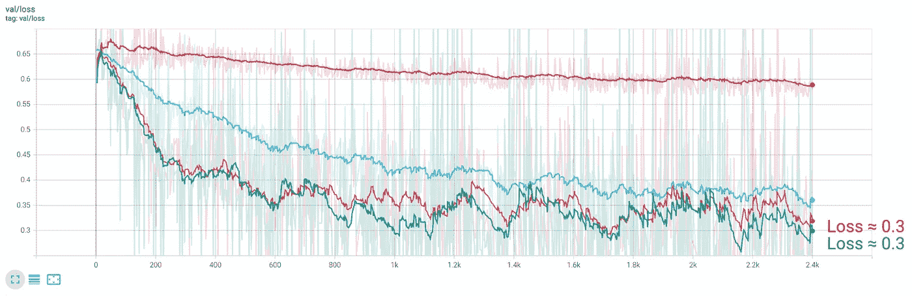

测试数据丢失(图片由作者提供)

> **💡提示:收集更多的数据来改善结果**
> 
> 改进神经网络模型的最有效策略是使用更大的训练集。这个建议适用于任何机器学习模型，而不仅仅是神经网络。然而，神经网络是从更大的训练集受益最多的网络，因为它们是高度参数化的，并且可以灵活地适应数据中最复杂的模式。

正如你所看到的，有相当多的实验来为这个问题找到正确的神经网络结构。

你可能会问…

*有没有系统的方法来为我的数据找到合适的架构？*

是的，有。在这一节中，我们从小模型到大模型，以便逐步增加复杂性。然而，在实践中，你应该走另一条路。

> **💡提示:由大变小**
> 
> 一般来说，你应该从一个足够大的网络开始，这个网络要能够适应训练数据。一旦您确定网络有足够的容量，您就开始减少它，以减少对训练数据的过度拟合并提高验证数据的准确性。
> 
> [安德烈·卡帕西](https://twitter.com/karpathy)有一篇关于这方面的非常好的博文，我强烈推荐你阅读
> 📝[训练神经网络的方法](http://karpathy.github.io/2019/04/25/recipe/)

我希望在本节之后，您对如何训练神经网络模型有更好的理解。

我建议您浏览一下`[src/supervised_ml.py](https://github.com/Paulescu/hands-on-rl/blob/main/03_cart_pole/src/supervised_ml.py)`中的代码，以巩固我们在本节中所讨论的内容。在监督设置中训练神经网络模型是现实世界中深度学习的一个非常实际的用例。练习 100 次，如果有问题就告诉我📩。

在下一节中，我们将回到车杆问题。

你准备好把 RL 和你刚刚学到的关于神经网络的知识混合起来了吗？

# 3.深度 Q-学习解大车杆子

回到参数 Q 学习和推车杆。

我们将完全重用第 4 部分的代码，唯一的区别是我们将替换最优 q 函数的线性参数化

线性模型(图片由作者提供)

具有两个隐藏层的神经网络

带有两个隐藏层的神经网络(图片由作者提供)

这将是课程中第一个深度强化学习算法。在这种情况下，深度 Q 网络。

*超参数呢？*

RL 算法对超参数极其敏感。深度 Q 学习也不例外。

我不想对你撒谎。寻找正确的超参数可能非常耗时。超参数在深度强化学习中非常关键，许多作者都没有发表它们。这对任何进入这个领域的人来说都是相当令人沮丧的。

甚至训练循环中的随机性，例如来自存储器中成批训练数据的混洗，也会对最终的代理参数产生很大的影响。

正因为如此，我们总是在 Python 脚本的开头修复所有的种子

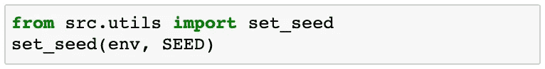

然而，这不足以确保机器间的可重复性。可能发生的情况是，你和我都使用相同的超参数和随机种子，但我们得到不同的模型，只是因为你在 GPU 上训练，而我没有。

换句话说，不能保证 PyTorch 版本、不同平台或硬件设置(GPU 与 CPU)之间完全可再现的结果。

> ***结果的再现性***
> 当使用我在本节分享的完全相同的超参数时，您可能不会得到与我相同的结果。
> 
> 不要沮丧。在下一课中，我们将学习如何自己调整超参数，您将能够找到那些对您的设置非常有用的参数，以防它们对您不起作用。

## 错误的超参数

[👉🏽notebooks/06 _ deep _ q _ agent _ bad _ hyperparameters . ipynb](https://github.com/Paulescu/hands-on-rl/blob/main/03_cart_pole/notebooks/06_deep_q_agent_bad_hyperparameters.ipynb)

这些超参数绝对不是我发现的最差的。我称它们为*坏的*，因为它们给出了与第 4 部分中的线性 q 模型相似的结果。

当超参数设置不当时，使用复杂的神经网络模型有什么意义？

这些是超参数:

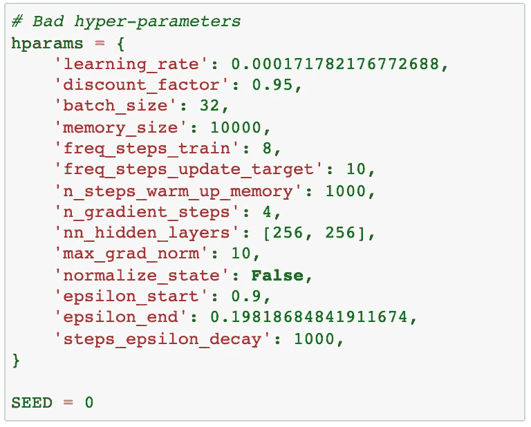

像往常一样，我们修复种子

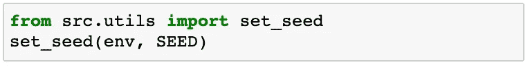

我们从这些超参数中声明`QAgent`

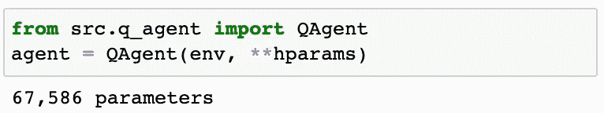

我们训练了 200 集:

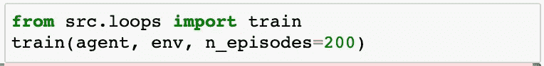

然后我们对 1000 集的代理进行评估

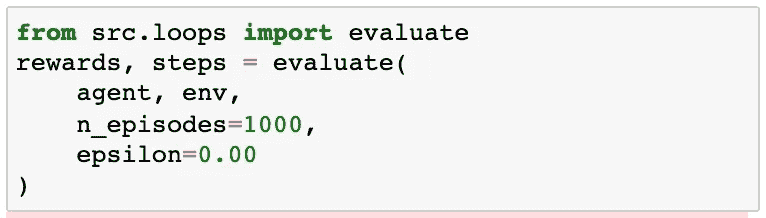

结果还不错，但我们可以做得更好。

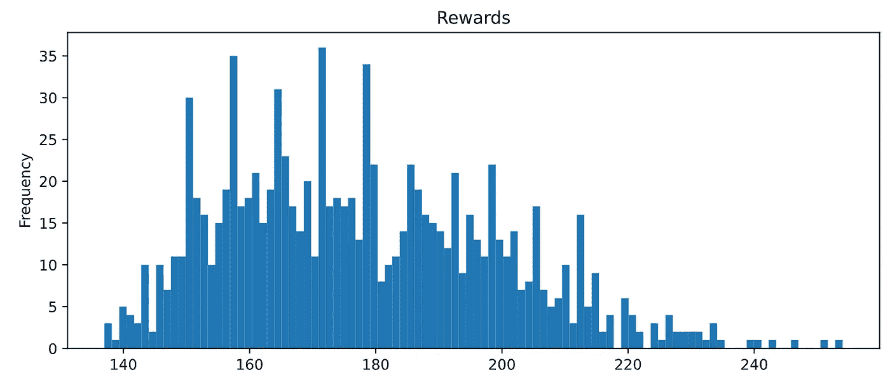

那就开始吧！

## 良好的超参数

[👉🏽notebooks/07 _ deep _ q _ agent _ good _ hyperparameters . ipynb](https://github.com/Paulescu/hands-on-rl/blob/main/03_cart_pole/notebooks/07_deep_q_agent_good_hyperparameters.ipynb)

这些超级参数在我的 MacBook 上非常管用:

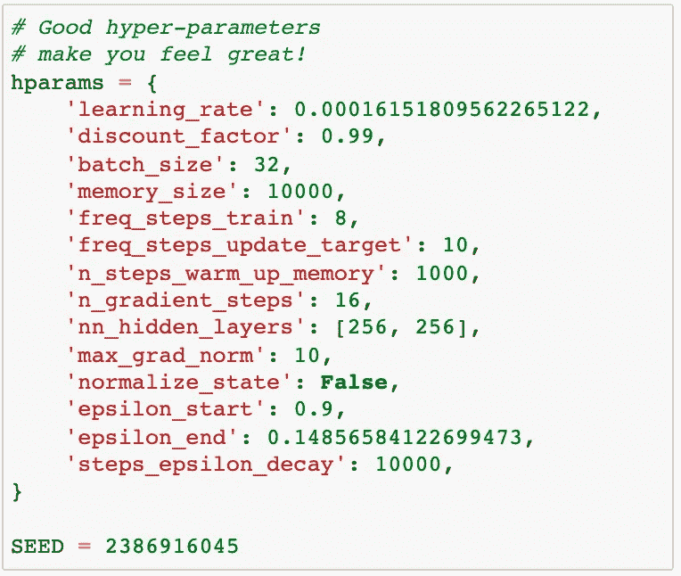

像往常一样，我们修复种子

我们从这些超参数中声明`QAgent`

我们训练了 200 集:

如果你评价《T2》剧集的经纪人

您将看到它达到了 100%的性能:

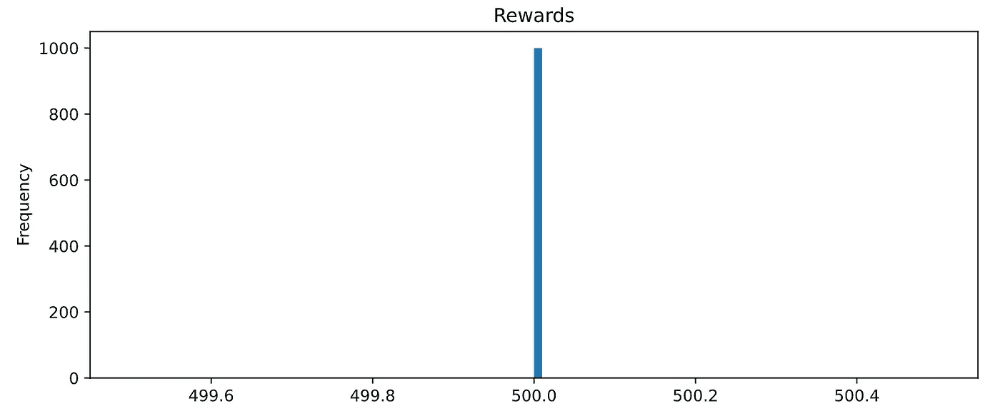

呜哇！！Amaaaziiiing！！！

这很酷。我们在 CartPole 环境中找到了完美的 deep q-agent！(如果您还没有在您的计算机上，请等待第 6 部分，我将揭示超参数调谐背后的科学和工程😉).

今天就到这里吧，伙计们。

渴望了解更多信息？

凯·❤️意大利面(图片由作者提供)

# 4.重述✨

这些是我希望你们从今天的课程中汲取的重要知识:

*   神经网络是非常强大的函数逼近器。您可以在完全监督的设置中使用它们(例如，从标记数据中学习最佳策略)，或者作为 RL 算法的一个组件(例如，逼近最佳 q 值函数)。
*   找到正确的神经网络架构并不容易。过大(过小)的神经导致过度拟合(欠拟合)。一般来说，从一个过度拟合训练数据的大型网络开始。然后你开始减少它来提高验证的准确性。
*   深度 Q 学习中的超参数对于确保训练循环收敛到最优解至关重要。此外，跨平台(例如 Windows vs Mac)、底层硬件(GPU vs CPU)和 PyTorch 版本的完全再现性极其困难，如果目前还不可能的话。

# 5.家庭作业📚

[👉🏽笔记本/08 _ 作业. ipynb](https://github.com/Paulescu/hands-on-rl/blob/main/03_cart_pole/notebooks/08_homework.ipynb)

让我们弄脏你的手:

1.  [**Git 克隆**](https://github.com/Paulescu/hands-on-rl) 回购到你的本地机器。
2.  [**设置**](https://github.com/Paulescu/hands-on-rl/tree/main/02_mountain_car#quick-setup) 本课的环境`03_cart_pole`
3.  打开`[03_cart_pole/notebooks/08_homework.ipynb](https://github.com/Paulescu/hands-on-rl/blob/main/03_cart_pole/notebooks/08_homework.ipynb)`并尝试完成 2 个挑战。

如果你不是深度学习高手，我推荐你解决第 1 个挑战。在我们的*模拟问题*中，增加训练数据量并尝试达到至少 95%的准确率。

在第二个挑战中，我希望你能找到一个更简单的神经网络(例如，只有一个隐藏层)，它可以完美地解决横竿问题。

# 6.下一步是什么？❤️

在下一课中，我们将学习如何像专业人士一样使用正确的工具来调整超参数。

在那之前，

爱和学习。

还要特别感谢 [Neria Uzan](https://www.linkedin.com/in/neria-uzan-369803107/) ，感谢他对课程如此投入。感谢你的辛勤工作和给我的反馈！

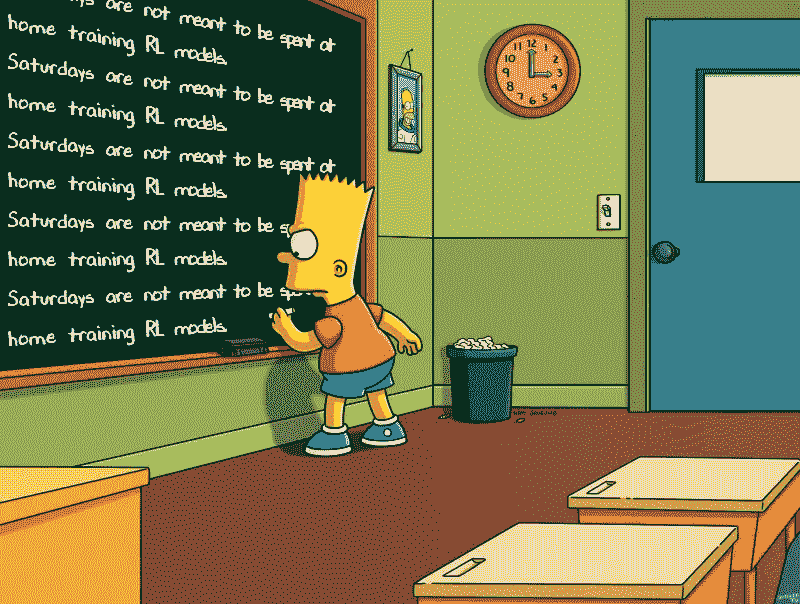

来吧伙计。(图片由作者提供)

*你想成为(甚至)更好的数据科学家，接触关于机器学习和数据科学的顶级课程吗？*

👉🏽订阅 [***datamachines* 简讯**](https://datamachines.xyz/subscribe/) **。**

👉🏽 [**跟着我**](https://pau-labarta-bajo.medium.com/) 上媒。

👉🏽给课程一个⭐[github 回购](https://github.com/Paulescu/hands-on-rl)

祝你愉快，🧡❤️💙

避寒胜地