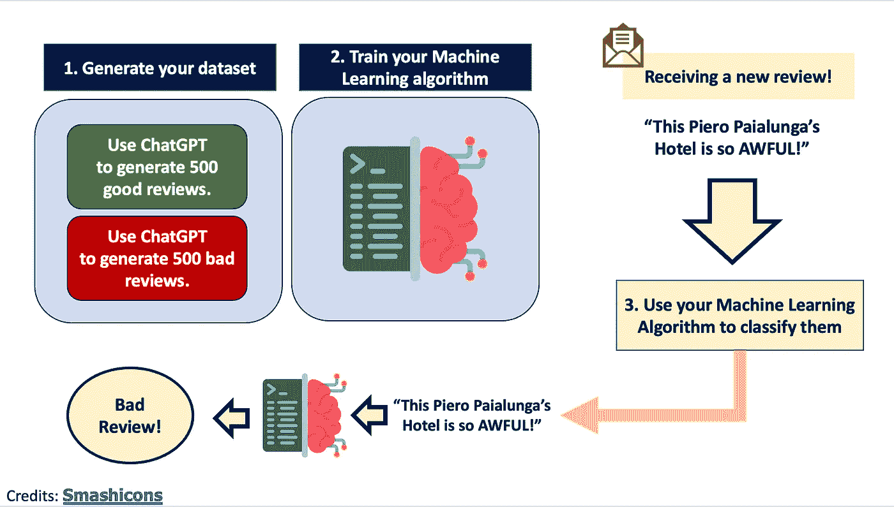
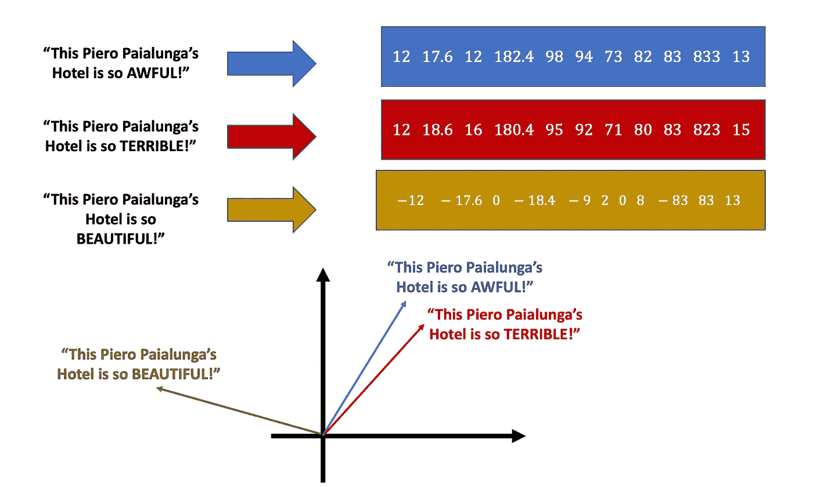

# 使用人工智能和 Open AI 的 ChatGPT，使用 Python 对酒店评论进行实际情感分析

> 原文：<https://towardsdatascience.com/hands-on-sentiment-analysis-on-hotels-reviews-using-artificial-intelligence-and-open-ais-chatgpt-d1939850c79e>

## 以下是如何使用机器学习自动分类好的和坏的评论，只需几行代码


弗洛里安·施梅兹在 [Unsplash](https://unsplash.com/s/photos/yes?utm_source=unsplash&utm_medium=referral&utm_content=creditCopyText) 上的照片

我是一名研究人员，每天和 AI 一起工作。我可以说，处在我位置上的每个人都兴奋得像一只盯着冰淇淋蛋卷的狗。🤩

这是原因:

> 打开人工智能的聊天 GPT 是真棒。

对于那些不知道我在说什么的人来说， [**聊天 GPT**](https://chat.openai.com/chat) 是一个人工智能聊天机器人，它可以做，嗯，几乎所有的事情。
它可以[编码](https://blog.bitsrc.io/i-asked-chat-gpt-to-build-a-to-do-app-have-we-finally-met-our-replacement-ad347ad74c51)，它可以写[文章](https://news.sky.com/story/chatgpt-we-let-an-ai-chatbot-help-write-an-article-heres-how-it-went-12763244)，它可以帮你装修[家](https://twitter.com/GuyP/status/1598020781065527296)，它可以编一个[菜谱](https://www.linkedin.com/feed/update/urn:li:activity:7005299096924172288/)(如果你是意大利人我不建议这么做)，不胜枚举。

是的，我们可以说它会在未来引发伦理(不仅仅是伦理)问题。我的母亲是一名高中老师，她非常害怕她的学生会利用聊天 GPT 在考试中作弊，这只是这种令人难以置信的强大技术会出问题的众多例子之一。

但是，问题还是在于**的用途，**而不是**产品。**如果我们严格地谈论**技术方面**(坦白地说，这是我更感兴趣的一个，因为我是一个认证的书呆子)，它是**令人惊讶的。**

现在，许多开发人员已经使用并测试了这个聊天机器人，试图开发他们的代码和他们的人工智能想法，当然，这个聊天机器人的使用严格取决于你的背景。例如，如果您是一名 web 开发人员，您会要求 ChatGPT 使用 HTML 构建一个网站。如果您是一名测试人员，您可以让 ChatGPT 帮助您找到特定系统中的 bug。

就我的具体情况而言，我是一名**研究员**。具体来说，我的工作是用人工智能建造一些**代理模型**。假设你想对“A”进行研究，但是要做“A”，你需要**大量的钱**、**大量的能量、**和**大量的计算时间。**这种替代模型背后的想法是用一种使用人工智能的数据驱动方法来取代它。

***现在我们暂时完全换个话题。***

假设我是一个企业家，我在美国有很多酒店。给定一个给定酒店的特定评论，我想知道该评论对该酒店是好是坏。我该怎么做？我有三个选择:

1.  我雇了一个每天阅读数百万条评论并进行分类的人，我可能会被逮捕，因为这显然是对人权的侵犯。
2.  我雇了一个人，他每天阅读*数百篇评论，并对它们进行分类。在**个月**之后，我能够用这个建立一个数据集。我从数据集中训练出一个机器学习模型。*
3.  ***我自动生成好差评*。**我**立即**用这个建立一个数据集。我**从数据集中训练出一个机器学习模型**。

因为我重视读者的时间，所以让我跳过第一个选项。

第二个选项是在 ChatGPT 之前你会做什么**。你无法提前知道一个评论是好是坏，所以如果你想据此建立一个数据集，你需要雇人，等到数据集准备好。**

**现在我们有了 ChatGPT，**我们可以简单地让他们生成**好的和不好的评论！这将需要几分钟(而不是几个月)，它将允许我们建立我们的机器学习算法来自动分类我们的客户评论！**

恭喜你，这是你的第一个**代孕模特。😊**

记住**我们不会训练 ChatGPT 或者做任何微调。**这种模式非常适合这样的任务，在这种情况下不需要微调。现在，ChatGPT 模型的训练当然不是开源的(就像模型本身一样)。我们所知道的只是在[开放 AI 的博客](https://openai.com/blog/chatgpt/)中的小描述。他们解释说，该模型是由人类人工智能训练员和一种强化学习监督算法训练的。*

> OpenAI 的 ChatGPT 不是开源的这一事实引发了一些非常棘手和有趣的**伦理问题**。这么强大的模型是应该开源，让所有人(坏人也一样)都能用，还是不开源，让没人能真正信任？

让我重述一下:



作者图片

你看到的这个小小的脑壳是代理模型；正如我们将看到的，这将是一个**随机森林**。但我说是**动手**文章，那就一头扎进去吧！(好激动！！！)

> 抱歉，我喜欢剧透。

# 1.生成我们的数据集

第一步是使用 **Open 的 AI Python API 来生成我们的模拟。**
需要考虑的几件事:
1。**开放 AI 是天才为非天才用户做的**。由于这个原因，如果你想安装它，你只需要做:

```
pip install --upgrade openai
```

(那就是**可爱的**)

2.当然，如果你想发送大量的请求，你将不得不支付额外的费用。假设我们不想这么做，我们只需要等大约 30 分钟就能得到我们的虚假评论数据集。同样，与我们手动操作需要等待的**个月**的等待时间(和成本)相比，这算不了什么。你也必须登录打开人工智能，并获得你的人工智能钥匙。

3.我们将通过**以同一句话开始**来自动输入这是一个好评还是差评:“这家酒店太糟糕了。”差评和“这家酒店太棒了。”为了好评。ChatGPT 将为我们完成审查。当然，除了这前四个词，我们无论如何都不会在我们的评论中包括这四个词，其余的评论都会有所不同。

我举个差评的例子:

和一个好的:

现在这是你需要生成整个数据集的代码。

然后，我们将使用 **Pandas** 将所有内容存储在**数据帧**中。

1.  **进口**熊猫和**造** df:

2.**填充** df:

3.**导出** df:

# 2.机器学习时间！

所以现在我们需要建立和训练一个机器学习算法。
在我们处理**文本时，**我们需要做的第一件事是使用 [**矢量器**](/getting-started-with-text-vectorization-2f2efbec6685) **。**矢量器是将**文本**转换为**矢量**的工具。

比如:



作者形象

如你所见，**相似** **的文字**有**相似** **的向量**(我知道，相似性是个棘手的概念，但你知道我的意思)。而**不同的文本**具有**不相似的向量。**

执行向量化步骤的方法有很多。有些方法比其他方法更复杂；有些方法比其他方法更有效率**；**有些方法需要机器学习，有些则不需要。

就本项目而言(因为我不是 NLP 机器学习工程师)，我们将使用一个相当简单的，名为 [TfIDF](https://it.wikipedia.org/wiki/Tf-idf) 向量器，准备在 [SkLearn](https://scikit-learn.org/stable/modules/generated/sklearn.feature_extraction.text.TfidfVectorizer.html) 上使用。

让我们从导入库开始:

通过导入我们刚刚使用 ChatGPT 生成的数据集，这里那里做了点预处理……

现在我们来看看:

太棒了。现在我们来做一下向量化:

正如我之前所说，我们将使用的机器学习模型被称为 **Random Forest。**什么是随机森林？它是**决策树**的集合。什么是决策树？

决策树是一种机器学习算法，在给定某种信息论标准的情况下，它会优化数据集要素的所有可能拆分的树搜索，直到找到基于该拆分区分什么是 1 和什么是 0 的方法。*

> *我很抱歉，如果这是超级混乱，但解释这在 4 行是一个困难的任务。 [**这篇文章**](/random-forests-algorithm-explained-with-a-real-life-example-and-some-python-code-affbfa5a942c) 从容应对，表现出色。强烈推荐。

现在让我们:

1.定义我们的随机林:

2.将我们的数据集分解为培训和测试:

3.培训我们的模型:

这个结果给**留下了非常深刻的印象，特别是考虑到缺少超参数调整。**

# **3.情绪分析**

**因为我们已经有了训练好的模型，你可以在一个新的，未标记的数据集上使用它。我用了一套在网上找到的纽约市酒店评论，但你也可以用自己的**或**来做一个评论，看看效果如何。**

**这个数据集是开源的( [CC0:公共领域](https://creativecommons.org/publicdomain/zero/1.0/))，非常小(2MB)，可以在 [Kaggle](https://www.kaggle.com/datasets/thedevastator/discovering-new-york-city-through-airbnb-user-re) 上下载。**

**让我们对评论栏(或您的文本)进行预处理:**

**让我们打印出我们的预测:**

**我们可以看到，这 5 个被归类为 1 的随机评论其实都不错！**

**让我们展示一个计数图:**

# **4.考虑**

**我们在这里做了什么？**

1.  **我们承认 **ChatGPT 很牛逼**。**
2.  **我们使用 ChatGPT 为我们的代理模型构建数据集。更具体地说，我们使用 ChatGPT 来弥补酒店的好评和差评。**
3.  **我们使用我们构建的标记为数据集的**来训练我们的机器学习模型。我们使用的模型是一个随机森林分类器。****
4.  **我们在一个新的数据集上测试了我们训练的模型，得到了**有希望的结果。****

**还有改进的空间吗？一吨。**

1.  **我们可以获得开放的人工智能**高级服务**并产生远远超过 1000 条评论的**。****
2.  **我们可以通过给出不同的输入来提高我们的查询技巧，也许还可以用其他语言而不仅仅是英语**
3.  **我们可以**通过做一些超参数调整来改进我们的机器学习模型****

**现在，让我用一个想法来结束我的发言。

现在有，将来也会有很多关于如何以及谁来使用 Open AI ChatGPT 的担忧。虽然我不是律师(更不用说伦理人工智能专家)，但我可以想象这个工具在许多方面和许多不同层面上是多么危险。**

**我强烈反对那些对 ChatGPT 的**性能**不感兴趣的人，因为我发现它非常令人惊讶，我非常期待看到这项技术将如何发展。我希望这个玩具的例子也能在我的读者中激起一些火花。❤️**

# **5.结论**

**如果你喜欢这篇文章，你想了解更多关于机器学习的知识，或者你只是想问我一些问题，你可以:**

**A.在 [**Linkedin**](https://www.linkedin.com/in/pieropaialunga/) 上关注我，在那里我发布我所有的故事
B .订阅我的 [**简讯**](https://piero-paialunga.medium.com/subscribe) 。这会让你了解新的故事，并给你机会发短信给我，让我收到你所有的更正或疑问。
C .成为 [**推荐会员**](https://piero-paialunga.medium.com/membership) ，这样你就不会有任何“本月最大数量的故事”，你可以阅读我(以及成千上万其他机器学习和数据科学顶级作家)写的任何关于最新可用技术的文章。**