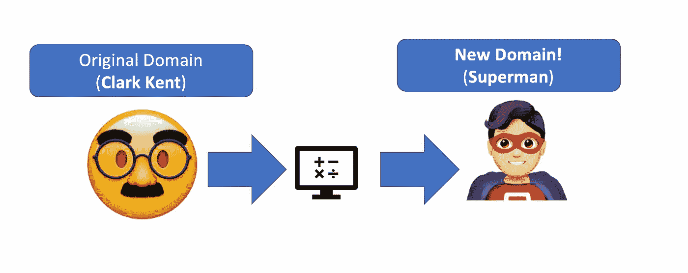
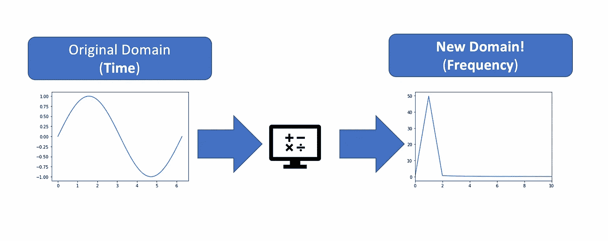
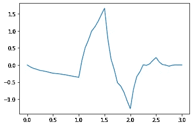

# 用 Python 实践信号处理

> 原文：<https://towardsdatascience.com/hands-on-signal-processing-with-python-9bda8aad39de>

在 [Unsplash](https://unsplash.com/s/photos/digital-signal?utm_source=unsplash&utm_medium=referral&utm_content=creditCopyText) 上由[Sao tusar](https://unsplash.com/@sasotusar?utm_source=unsplash&utm_medium=referral&utm_content=creditCopyText)拍摄的照片

## 从理论到实践:下面是如何使用 Python 执行频率分析、噪声过滤和振幅谱提取

如果你想和数据打交道，有一件事是肯定的:**要么专攻，要么去死。这种认为数据科学家可以处理文本数据、信号、图像、表格数据和乐高积木的想法是看待这个职业的一种过时的方式。**

如今，随着机器学习的出现以及数据分析和计算机硬件方面的巨大进步，深入了解如何处理特定类别的数据至关重要。这是因为在进入另一个数据科学分支之前，关于这个分支有太多的知识需要了解。

就我而言，我每天都用**信号工作。我了解他们，因为我有物理学硕士学位，我可以从他们那里获得有用的信息，因为我是一名数据科学家。**

在这篇博文中，我将向你展示信号处理的基本操作，即**频率分析**、**噪声过滤**和**振幅谱提取**技术。

我们将从这些技术的简单理论背景开始，我们将展示它们在应用于一个非常简单(且公开)的数据集时是如何工作的，我们将使用该数据集作为我们的“信号”。

# 1.理论背景

## 1.1 傅立叶变换

在我们看来,( 1D)信号只不过是一个时间序列。这意味着我们有一个 x 轴，即时间，和一个 y 轴，即我们考虑的量(如电压)。

从直观的角度来看，对信号进行傅立叶变换意味着在另一个域中看到这个信号。

让我们把它变得更简单。假设你是**超人**。你所有的朋友都知道你叫克拉克·肯特。然后有一些犯罪，你做你的转变，你成为超人！**你永远是你**(尽管他们不知道)，但他们看到你在另一个领域，穿着另一套服装，做着另一种事情。

作者图片

现在我们可以对信号和它们的**正弦**分量做同样的事情。

想法是将信号从**时域**看向**频域**。

作者图片

在该图的左侧，我们看到一个频率为 1 的正弦信号。事实上，在右边，你只看到频率=1 时的一个峰值，其他地方都是 0。

假设您有多个正弦和余弦相互作用:您将看到多个幅度和多个非零频率，因为信号中存在多个模式。

**这为什么有用？**好吧，多种原因，但让我们选择两个:

1.  **你可以过滤你的信号**。你知道，一般来说，你的信号会有一个有限的频带。如果你看到该波段之外的东西，你可以假设它是白噪声(存在于所有频率的噪声)，你可以将其过滤掉。(**噪声过滤**)
2.  你可以分析你的信号的周期模式，并发现对你的系统的季节性部分非常有用的洞察力。(**频率分析**)

## 1.2 小波变换

让我们回到傅立叶变换。进行变换意味着**将傅里叶频谱的所有成分(所有频率的所有正弦)投射到信号中**。在我们的例子中，通过做这种投影，除了频率 1，你在任何地方都得到 0，当你得到一个不同于 0 的值时。

现在，让我们用一个比正弦函数更复杂的函数，比如下面的 dyb2。

作者图片

我们可以玩这个小东西，收缩和扩张它，分析完整信号的投影。

投影会给我们一个“过滤”的信号，残差是这个投影和原始投影之间的差。

这是一种更多样、更通用的从噪声中过滤信号的方法，它有很大的优势，我们将在后面的动手实践部分看到。

## 1.3 希尔伯特变换

有时候你看到你的信号充满了起伏，但你并不是真的想要它。你只想拿到信封。从数学上讲，这个操作是通过使用**卷积**来完成的。特别的，核是 1/(pi*t)。在这个阶段，这里没有什么可谈的，但我们将在一分钟后的实践部分看到这种算法的威力！

# 2.动手举例

我们将要使用的数据集是一个公共数据集，可以在[这里](https://www.kaggle.com/datasets/robikscube/hourly-energy-consumption)找到。
这基本上是一个能源消耗的时间序列，它非常适合我们的研究，因为无论如何它都可以被视为一个信号。数据集为公共领域数据集( [CC0: Public Domain](https://creativecommons.org/publicdomain/zero/1.0/) )，无需事先授权即可免费下载使用。

让我们从编码开始。

## 2.1 导入库

这是我们需要的:

## 2.2 数据预处理

让我们绘制数据集

我们可以看到，它有一种趋势，它没有零均值。这两个特征会干扰我们的分析。让我们使用 scipy 的**去趋势**选项来纠正它。

## 2.3 频率分析

现在是时候使用傅立叶变换对信号进行频率分析了。让我们绘制傅立叶频谱:

我们可以在这里看到非常有趣的山峰。例如，存在大约 24 小时(1 天)或 12 小时(0.5 天)或大约 80 小时(3 天)的周期。

特别是，我们可以对峰进行排序并打印相应的指数:

现在这些索引是粗体的。

我们也可以用“天数”单位打印这些指数:

## 2.4 噪声过滤(傅立叶变换)

现在我们可以以最高峰为参考，开始筛选比这个最高峰低 0.1，0.2，…0.9 的。例如，我们可以将低于最高峰值振幅 0.5 倍的所有值设置为零。

我们需要小心。如果我们将阈值设置得太高，我们不仅会滤除噪声，还会滤除信号的重要特征。如果阈值太低，我们基本上不过滤任何东西，仍然保留所有的噪声。

让我们做一些尝试:

以下是一些结果:

在这种情况下，0.30 似乎是一个很好的替代值。:)

> 附注:关于这一特定应用的更多信息，请参阅这篇[文章](/noise-cancellation-with-python-and-fourier-transform-97303314aa71)。

## 2.5 噪声过滤(小波变换)

我们也可以使用小波变换进行噪声滤波。在这种情况下，我们有多级过滤。第一级将仅过滤纯噪声，但它们将是保守的。越深入，噪声越少，但也会丢失信号的特征(残差将与原始信号相似)。

> 附注:关于这一具体应用的更多信息，请参阅这篇[文章](/hey-wavelet-turn-that-noise-down-80a30796dfcf)。

## 2.6 振幅提取

对于这一部分，我只是做了一个向上和柔和的信号。假设我们只想提取它的包络(即所谓的振幅)。您只需要应用 scipy Hilbert 变换并计算绝对值:

超级简单，但在处理信号的数据科学家的日常生活中非常有用。

# 3.结论

如果你喜欢这篇文章，你想知道更多关于机器学习的知识，或者你只是想问我一些你可以问的问题:

A.在 [**Linkedin**](https://www.linkedin.com/in/pieropaialunga/) 上关注我，在那里我发布我所有的故事
B .订阅我的 [**简讯**](https://piero-paialunga.medium.com/subscribe) 。这会让你了解新的故事，并给你机会发短信给我，让我收到你所有的更正或疑问。
C .成为 [**推荐会员**](https://piero-paialunga.medium.com/membership) ，这样你就不会有任何“本月最大数量的故事”，你可以阅读我(以及成千上万其他机器学习和数据科学顶级作家)写的任何关于最新可用技术的文章。