# 使用 Python 进行主题建模实践

> 原文：<https://towardsdatascience.com/hands-on-topic-modeling-with-python-1e3466d406d7>

## 使用潜在狄利克雷分配(LDA)和 pyLDAvis 可视化的主题建模教程

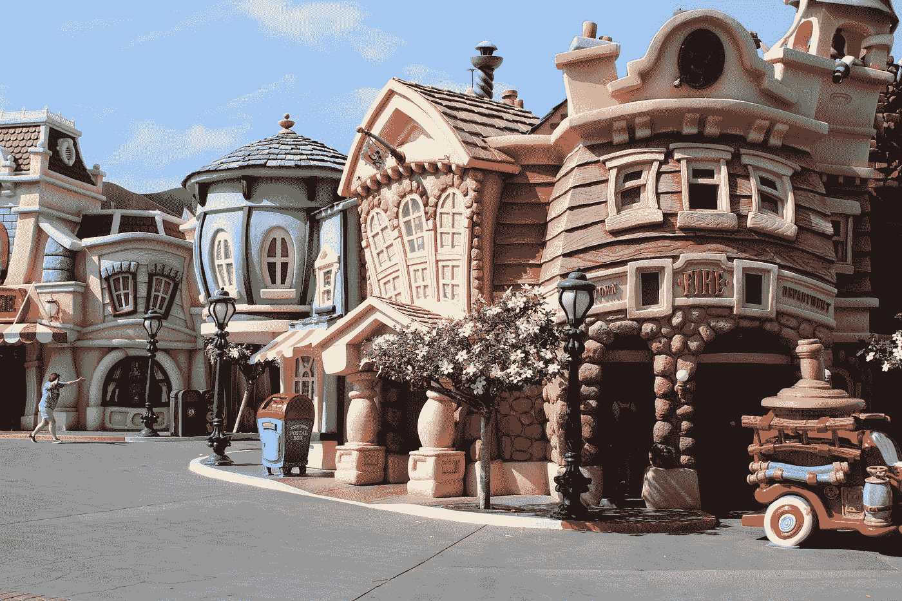

[布拉德利·辛格尔顿](https://unsplash.com/@bradleysingleton?utm_source=medium&utm_medium=referral)在 [Unsplash](https://unsplash.com?utm_source=medium&utm_medium=referral) 拍摄的照片

主题建模是自然语言处理和文本挖掘中提取给定文本主题的一种流行技术。利用主题建模，我们可以扫描大量的非结构化文本，以检测关键字、主题和主题。

主题建模是一种无监督的机器学习技术，不需要标记数据来进行模型训练。它不应该与*主题分类*混淆，后者是一种受监督的机器学习技术，需要标记数据进行训练以适应和学习。在某些情况下，主题建模可以与主题分类一起使用，其中我们首先执行主题建模，以检测给定文本中的主题，并用相应的主题标记每个记录。然后，这个标记的数据用于训练分类器，并对看不见的数据执行主题分类。

在本文中，我们将重点关注主题建模，并介绍如何通过文本预处理准备数据，通过 coherence score 分配最佳数量的主题，使用潜在 Dirichlet 分配(LDA)提取主题，以及使用 pyLDAvis 可视化主题。

在阅读本文的同时，我鼓励您查看我的 GitHub 上的 [Jupyter 笔记本](https://github.com/Idilismiguzel/NLP-with-Python/blob/master/Topic%20Modeling/Disneyland_Reviews_Topic_Modeling_LDA.ipynb)以获得完整的分析和代码。

我们有很多事情要谈，让我们开始吧！🤓

# 1.数据

我们将使用可以从 Kaggle 下载的[迪士尼乐园评论数据集](https://www.kaggle.com/datasets/arushchillar/disneyland-reviews)。它对巴黎、加州和香港的迪士尼乐园分店有 42，000 条评论和评级。评级栏包括评级分数，可用于主题分类，将未查看的评论分为正面、负面或中性。这超出了本文的范围，但是如果你对主题分类感兴趣，你可以查看下面的文章。

<https://medium.com/analytics-vidhya/applying-text-classification-using-logistic-regression-a-comparison-between-bow-and-tf-idf-1f1ed1b83640>  

我们来读一下数据，看看前几行。

```
# Read the data
reviews = pd.read_csv('/content/DisneylandReviews.csv', encoding='latin-1')

# Remove missing values
reviews = reviews.dropna()
```

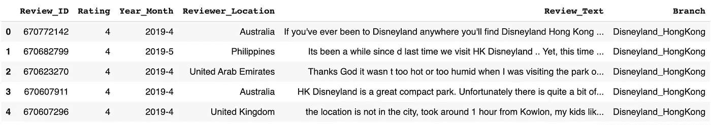

数据集的前 5 行

让我们只过滤“评论”和“评级”列。

```
# Filter only related columns and drop duplicated reviews
reviews = reviews[["Review_Text", "Rating"]]
reviews = reviews.drop_duplicates(subset='Review_Text')
```

让我们使用 seaborn 的`countplot`打印一个价值计数柱状图，以了解评论的总体情绪。

```
# Create a bar plot with value counts
sns.countplot(x='Rating', data=reviews)
```

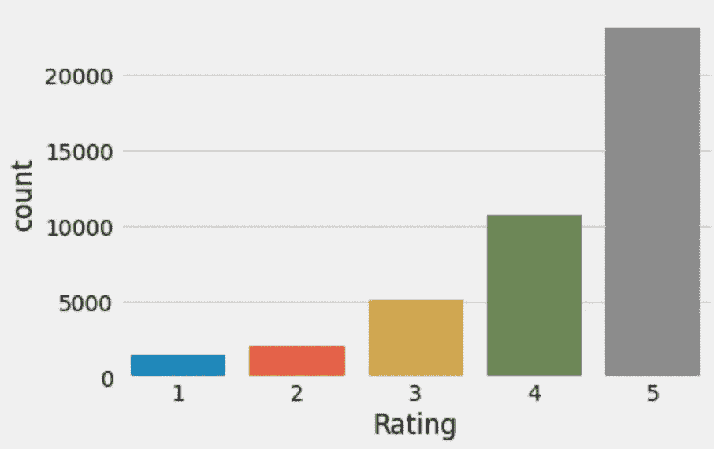

大多数是正面的，但也有一些负面的评价

# 2.数据清理和预处理

在开始主题建模之前，我们需要准备文本并进行清洗和预处理。这是所有文本挖掘管道中至关重要的一步，最终模型的性能高度依赖于此。对于该数据集，我们将遵循以下步骤:

1.  **小写**每个单词
2.  **将缩写**替换为更长的形式
3.  **删除特殊字符和不需要的单词**
4.  使用`nltk.WordPunctTokenizer()`对每个单词进行标记化我们将从单词或句子的字符串中提取标记。
5.  **使用`nltk.stem.WordNetLemmatizer()`对每个单词进行词条整理，我们将把单词恢复到它们的字典形式，这样所有具有相似意思的单词将被链接成一个单词。**

为了应用所有列出的步骤，我将使用以下函数。然而，为了增加模块化和易于调试，您可以在单独的函数中定义每个任务。

```
def text_preprocessing(text):

    # Convert words to lower case
    text = text.lower()

    # Expand contractions
    if True:
        text = text.split()
        new_text = []
        for word in text:
            if word in contractions:
                new_text.append(contractions[word])
            else:
                new_text.append(word)
        text = " ".join(new_text)

    # Format words and remove unwanted characters
    text = re.sub(r'https?:\/\/.*[\r\n]*', '', text, flags=re.MULTILINE)
    text = re.sub(r'\<a href', ' ', text)
    text = re.sub(r'&amp;', '', text) 
    text = re.sub(r'[_"\-;%()|+&=*%.,!?:#$@\[\]/]', ' ', text)
    text = re.sub(r'<br />', ' ', text)
    text = re.sub(r'\'', ' ', text) 

    # Tokenize each word
    text = nltk.WordPunctTokenizer().tokenize(text)

    # Lemmatize each word
    text = [nltk.stem.WordNetLemmatizer().lemmatize(token, pos='v') for token in text if len(token)>1]

return text
```

```
def to_string(text):
    # Convert list to string
    text = ' '.join(map(str, text))

    return text

# Create a list of review by applying text_preprocessing function
reviews['Review_Clean_List'] = list(map(text_preprocessing, reviews.Review_Text))

# Return to string with to_string function
reviews['Review_Clean'] = list(map(to_string, reviews['Review_Clean_List']))
```

让我们通过打印一个随机的行来看看新的列。

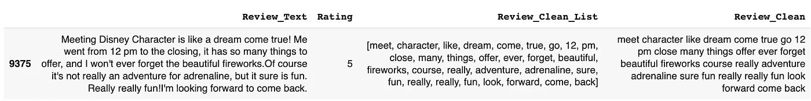

最后但同样重要的是，在进入下一步之前，我们需要删除停用词。停用词是特定于语言的常用词(即英语中的“the”、“a”和“an”)，既不会增加价值，也不会改善对综述的解释，并且往往会在建模中引入偏差。我们将从`nltk`库中加载英语停用词表，并从我们的语料库中删除这些单词。

因为我们要删除停用词，所以我们可能要检查语料库中最常用的词，并评估我们是否也要删除其中的一些词。这些单词中的一些可能只是经常重复，并没有给意思增加任何价值。

我们将使用藏书库中的`Counter`来统计字数。

```
# Import Counter 
from collections import Counter

# Join all word corpus
review_words = ','.join(list(reviews['Review_Clean'].values))

# Count and find the 30 most frequent
Counter = Counter(review_words.split())
most_frequent = Counter.most_common(30)

# Bar plot of frequent words
fig = plt.figure(1, figsize = (20,10))
_ = pd.DataFrame(most_frequent, columns=("words","count"))
sns.barplot(x = 'words', y = 'count', data = _, palette = 'winter')
plt.xticks(rotation=45);
```

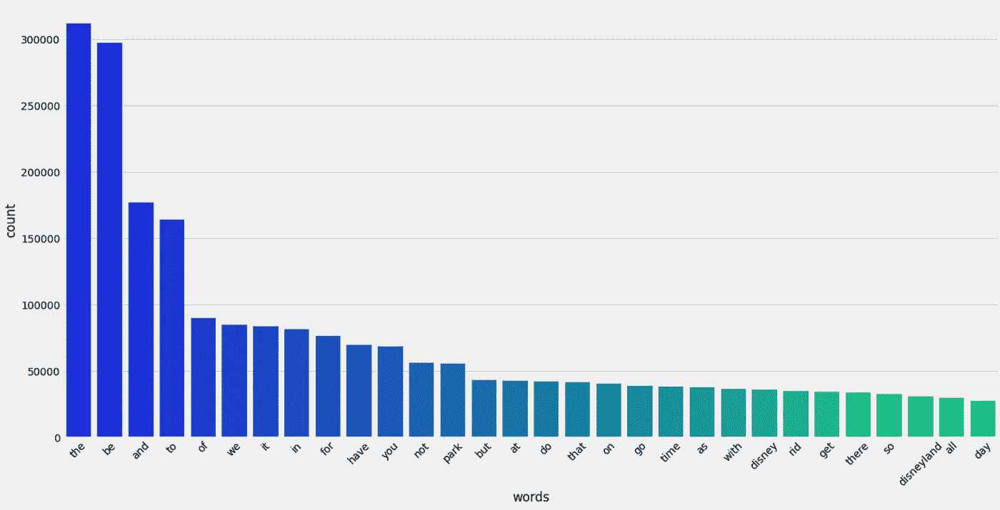

30 个最常用的单词(删除停用词之前)

不出所料，前 30 名中经常出现与迪士尼和公园内容相关的词，如“公园”、“迪士尼”和“迪士尼乐园”。我们将通过将这些词添加到停用词列表中来删除它们。您也可以创建一个单独的列表。

```
# Load the list of stopwords
nltk.download('stopwords')

stopwords_list = stopwords.words('english')
stopwords_list.extend(['park', 'disney', 'disneyland'])

reviews['Review_Clean_List'] = [[word for word in line if word not in stopwords_list] for line in reviews['Review_Clean_List']]
reviews['Review_Clean'] = list(map(text_as_string, reviews['Review_Clean_List']))

# Join all word corpus
review_words = ','.join(list(reviews['Review_Clean'].values))

# Count and find the 30 most frequent
Counter = Counter(review_words.split())
most_frequent = Counter.most_common(30)

# Bar plot of frequent words
fig = plt.figure(1, figsize = (20,10))
_ = pd.DataFrame(most_frequent, columns=("words","count"))
sns.barplot(x = 'words', y = 'count', data = _, palette = 'winter')
plt.xticks(rotation=45);
```

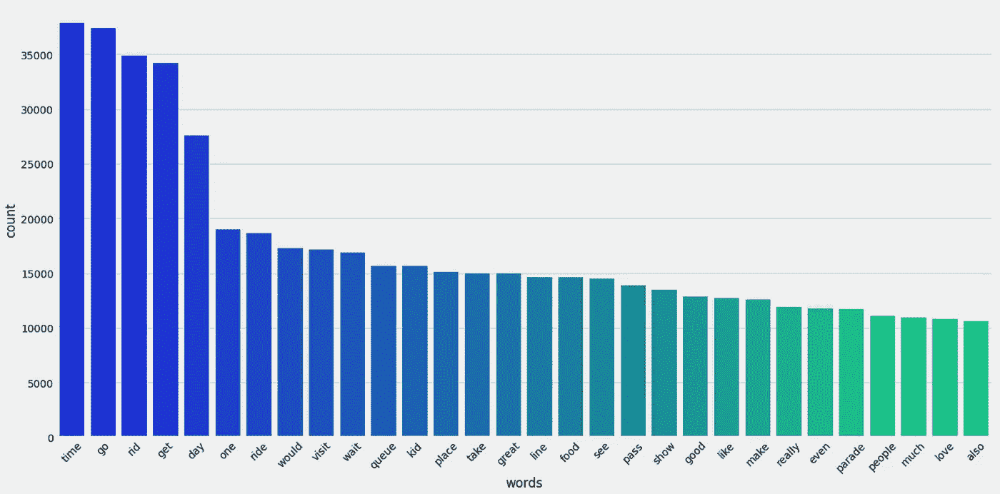

30 个最常用的单词(删除停用词和一些常用词后)

# 奖金

让我们使用之前创建的`review_words`创建预处理文本语料库的词云。☁️️ ️️☁️ ☁️

```
# Generate the word cloud
wordcloud = WordCloud(background_color="white",
                      max_words= 200,
                      contour_width = 8,
                      contour_color = "steelblue",
                      collocations=False).generate(review_words)

# Visualize the word cloud
fig = plt.figure(1, figsize = (10, 10))
plt.axis('off')
plt.imshow(wordcloud)
plt.show()
```

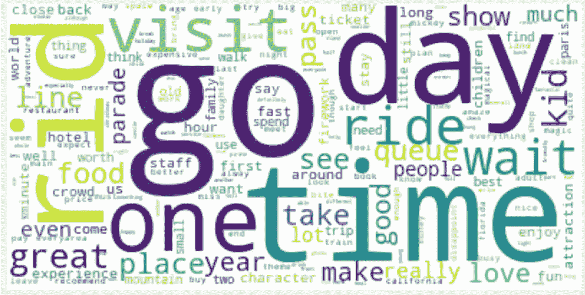

文本预处理后的 Wordcloud

# 3.词汇袋

为了使用文本作为机器学习算法的输入，我们需要以数字格式呈现它。单词袋是一个[向量空间模型](https://en.wikipedia.org/wiki/Vector_space_model)，表示单词在文档中的出现。换句话说，单词袋将每个评论转换成单词计数的集合，而不考虑顺序或意义的重要性。

我们将首先使用 Gensim 的`corpora.Dictionary`创建字典，然后使用`dictionary.doc2bow`创建单词包。

```
# Create Dictionary
id2word = gensim.corpora.Dictionary(reviews['Review_Clean_List'])

# Create Corpus: Term Document Frequency
corpus = [id2word.doc2bow(text) for text in reviews['Review_Clean_List']]
```

通过创建字典，我们用一个整数 id(又名 id2word)映射每个单词，然后我们在每个字典上调用 doc2bow 函数来创建一个(id，frequency)元组列表。

# 4.确定主题的数量

决定主题建模的主题数量可能很困难。由于我们已经初步了解了上下文，确定建模主题的数量不会太离谱。但是，如果这个数字太大，那么模型可能无法检测到实际上更广泛的主题，如果这个数字太小，那么主题可能有大量重叠的单词。因为这些原因，我们会使用话题连贯性评分。

```
from gensim.models import CoherenceModel

# Compute coherence score
number_of_topics = []
coherence_score = []
for i in range(1,10):
  lda_model = gensim.models.ldamodel.LdaModel(corpus=corpus,
                                           id2word=id2word,
                                           iterations=50,
                                           num_topics=i)
  coherence_model_lda = CoherenceModel(model=lda_model, 
                                       texts=reviews['Review_Clean_List'], 
                                       dictionary=id2word, 
                                       coherence='c_v')
  coherence_lda = coherence_model_lda.get_coherence()
  number_of_topics.append(i)
  coherence_score.append(coherence_lda)

# Create a dataframe of coherence score by number of topics 
topic_coherence = pd.DataFrame({'number_of_topics':number_of_topics,
                                'coherence_score':coherence_score})

# Print a line plot
sns.lineplot(data=topic_coherence, x='number_of_topics', y='coherence_score')
```

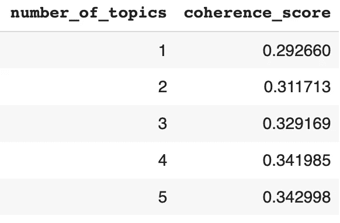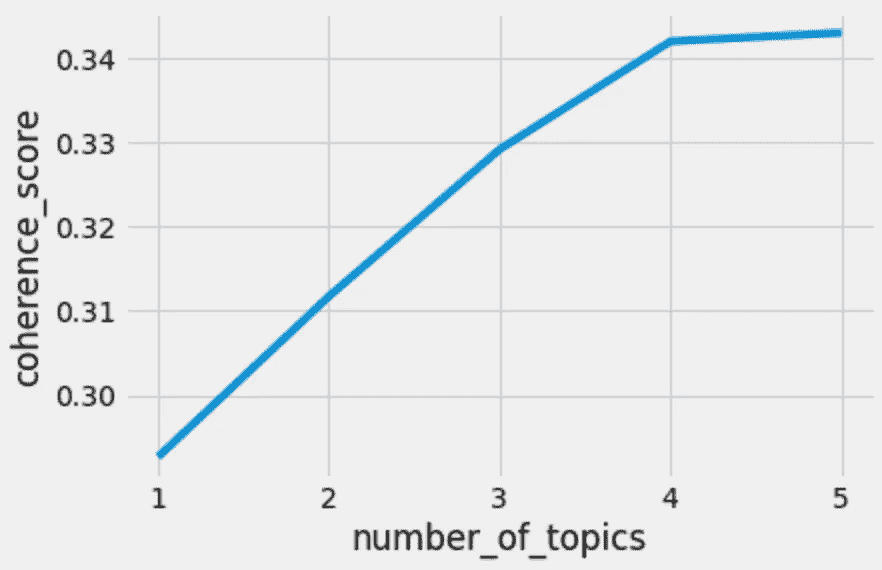

主题数量的连贯性得分

由于使用四个主题获得了非常高的一致性分数(0.3429)，并且从四个主题到五个主题没有大的跳跃，所以我们将使用四个主题构建我们的 LDA 模型。然而，需要注意的是，我们将相干超参数定义为`coherence='c_v'`，但也有其他选项，如*‘u _ mass’，‘c _ UCI’，‘c _ npmi’*，验证它们将是最佳实践。(详细信息请查看 Gensim 的[文档](https://radimrehurek.com/gensim/models/coherencemodel.html)。)

# 5.基于 LDA 的主题建模

[潜在狄利克雷分配](https://en.wikipedia.org/wiki/Latent_Dirichlet_allocation)是一种流行的用于主题建模的统计无监督机器学习模型。它假设每个主题由单词组成，每个文档(在我们的例子中是每个综述)由这些单词的集合组成。因此，LDA 试图找到最能描述每个主题的词，并匹配这些词所代表的评论。

LDA 使用[狄利克雷分布](https://en.wikipedia.org/wiki/Dirichlet_distribution)，这是贝塔分布的一种推广，为两个或更多结果(K)的概率分布建模。例如，K = 2 是贝塔分布的狄利克雷分布的特例。

狄利克雷分布用 Dir( *α)* 表示，其中 *α* < 1(对称)表示稀疏性，这正是我们想要如何呈现主题和词以进行主题建模。正如你在下面看到的，使用 *α* < 1，我们在边/角上有彼此分开的圆(换句话说是稀疏的)，而使用 *α >* 1，我们在中心有彼此非常接近并且难以区分的圆。你可以把这些圈想象成话题。

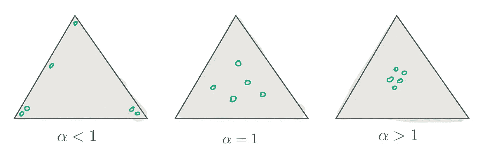

LDA 使用两种狄利克雷分布，其中

*   k 是主题的数量
*   *M* 表示文件的数量
*   *N* 表示给定文档中的字数
*   Dir(alpha)是每文档主题分布的 Dirichlet 分布
*   Dir(beta)是每主题单词分布的狄利克雷分布

然后，它对每个单词位置使用多项式分布

*   为文档 I 中的第 *j* 个单词选择一个题目；z_{i，j}
*   为特定单词选择一个单词；w_{i，j}

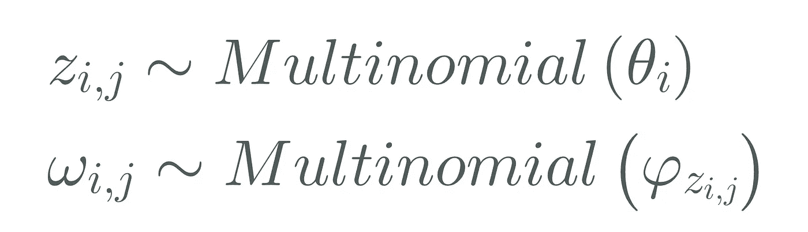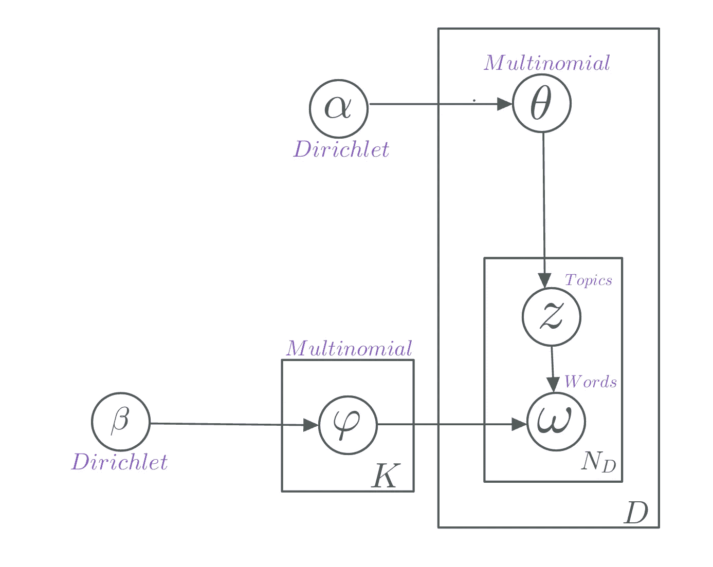

文献中 LDA 的平板标记

如果我们把所有的片段放在一起，我们得到下面的公式，它描述了具有两个狄利克雷分布和多项式分布的文档的概率。

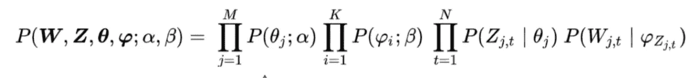

文件的概率

理论够了！🤓让我们看看如何使用 Gensim 中的`ldaModel`在 Python 中执行 LDA 模型。

```
 # Define the number of topics 
n_topics = 4

# Run the LDA model
lda_model = gensim.models.ldamodel.LdaModel(corpus=corpus,
                                           id2word=id2word,
                                           num_topics=n_topics, 
                                           random_state=100,
                                           update_every=1,
                                           chunksize=10,
                                           passes=10,
                                           alpha='symmetric',
                                           iterations=100,
                                           per_word_topics=True)
```

让我们来探究每个主题中出现的单词及其相对权重。

```
for idx, topic in lda_model.print_topics(-1):
    print("Topic: {} Word: {}".format(idx, topic))
```

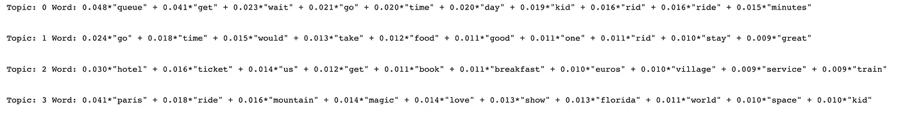

每个主题中出现的单词及其相对权重

我们可以看到，一个话题与排队等待有关；下一个和参观、住宿、美食有关；还有一个跟酒店、门票、村庄有关；最后一个与魔术、爱情和突出巴黎和佛罗里达的节目有关。

# 6.用 pyLDAvis 可视化

pyLDAvis 是一个基于 web 的交互式可视化工具，用于可视化主题模型。您可以使用`pip install pyldavis`轻松地在 python 中安装，并使用`enable_notebook().`在 Python 笔记本上运行可视化

```
# Import and enable notebook to run visualization
import pyLDAvis.gensim_models
pyLDAvis.enable_notebook()

vis = pyLDAvis.gensim_models.prepare(lda_model, 
                                     corpus, 
                                     dictionary=lda_model.id2word)
vis
```

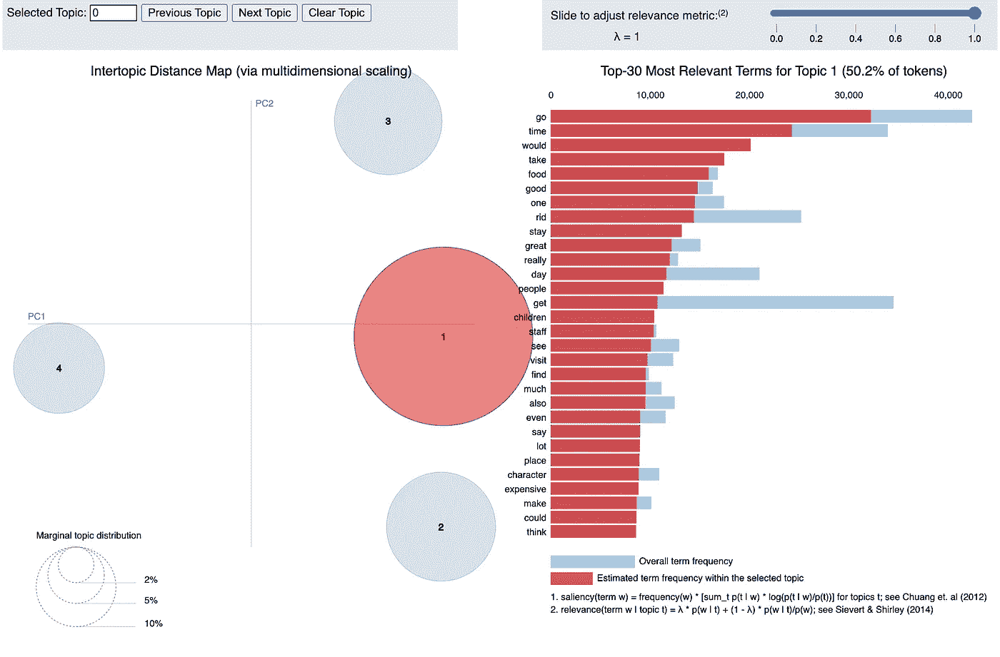

主题 1 的 pyLDAvis 表示(λ = 1)

在左侧，我们可以看到每个主题在主题间距离图上表示为一个气泡(多维标度到 x 和 y 轴上),如果我们单击一个主题，可视化会自动调整到该特定主题。气泡之间的距离代表主题之间的语义距离，如果气泡重叠，这意味着有很多常用词。在我们的例子中，主题被很好地分开，没有重叠。此外，主题气泡的面积表示每个主题的覆盖范围，主题 1 覆盖了大约 50%的评论，而其他主题共享几乎相等的数量。

右侧的可视化显示了每个主题的前 30 个最相关的词。蓝色阴影条表示该词在所有评论中的出现，红色条表示该词在所选主题中的出现。在它的顶部，您可以看到一张调整相关性度量λ(其中 0 ≤ λ ≤ 1)的幻灯片，λ = 1 调整每个主题中最有可能出现的单词的可视化，λ = 0 调整仅特定于所选主题的单词。

让我们检查话题 2👀

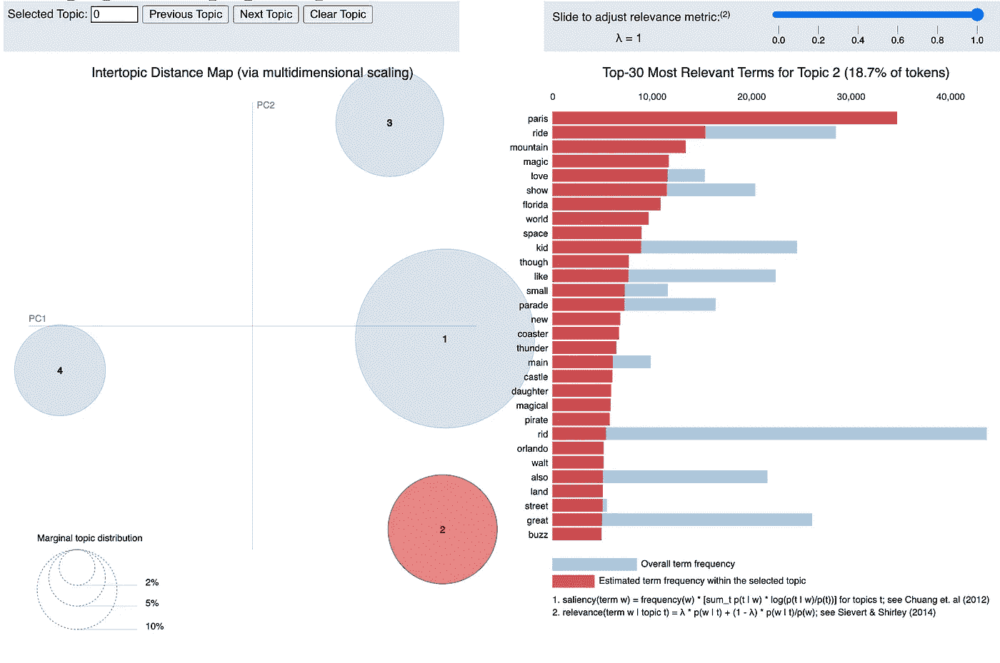

主题 2 的 pyLDAvis 表示(λ = 1)

主题 3👀

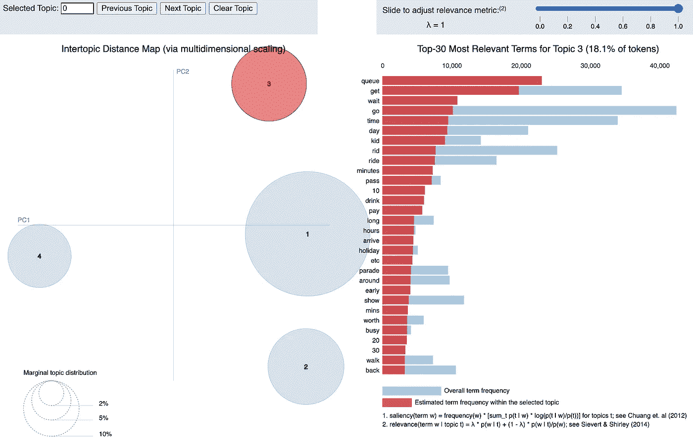

最后是主题 4👀

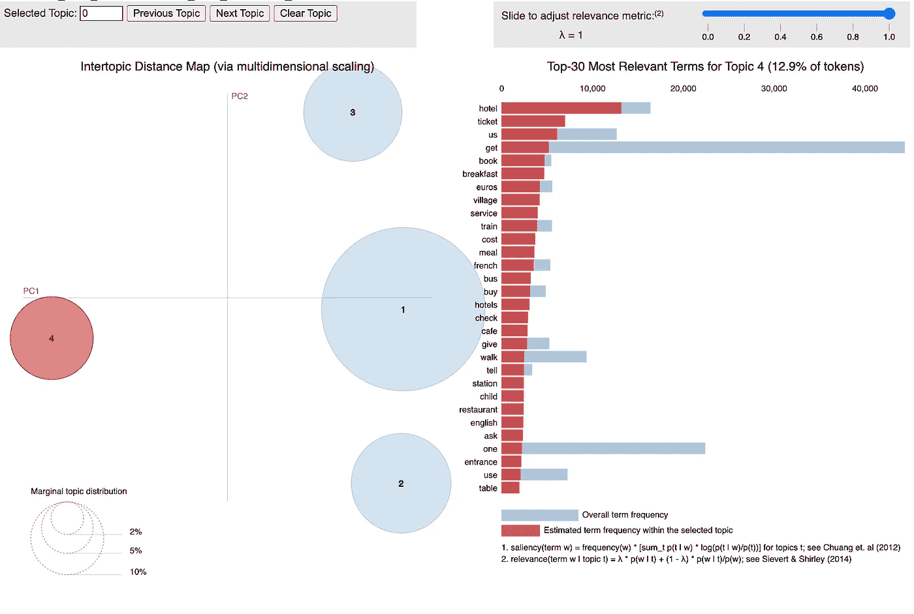

# 结论

在本文中，我们探讨了如何从文本数据中检测主题和关键字，以便在不需要扫描整个文本的情况下理解内容。我们讨论了如何应用预处理，包括清理文本、词汇化和删除停用词&为机器学习准备数据的最常用词。我们还创建了一个单词云，帮助我们可视化整体内容。为了找到迪士尼乐园评论数据集的主题，我们使用了潜在狄利克雷分配(LDA)，这是一种用于主题建模的概率方法，假设*主题*可以表示为文本语料库中单词的分布。每个文档(在我们的案例回顾中)可以展示不止一个不同比例的主题。比例最高的主题被选为该文档的*主题*。我们通过使用 coherence score 来定义主题的数量，最后使用 pyLDAvis 来可视化我们的主题和关键词。

LDA 是一种相对简单的主题建模技术，多亏了 pyLDAvis，您可以向不熟悉该技术范围的其他人展示结果。可视化也有助于描述功能原理，并使主题模型更易于解释和说明。

虽然我们只讨论了 LDA 技术，但是还有许多其他技术可以用于主题建模。举几个例子，[(LSA)](https://en.wikipedia.org/wiki/Latent_semantic_analysis)，[非负矩阵分解](https://en.wikipedia.org/wiki/Non-negative_matrix_factorization)， [Word2vec](https://en.wikipedia.org/wiki/Word2vec) 。如果你对这个话题感兴趣，我强烈建议你也探索一下这些方法，它们都有不同的优点&缺点，这取决于用例。

我希望您喜欢阅读和学习主题建模，并发现这篇文章很有用！✨

**喜欢这篇文章吗？** [**成为会员求更！**](https://idilismiguzel.medium.com/membership)

*你可以在这里* [***阅读我的其他文章***](https://medium.com/@idilismiguzel)**和* [***关注我上媒***](http://medium.com/@idilismiguzel/follow)*如果有任何问题或建议，请告诉我。✨**

**参考**

1.  **迪士尼乐园查看来自 Kaggle 的数据集。许可证: [CC0:公共领域](https://creativecommons.org/publicdomain/zero/1.0/)**
2.  **标题照片由[布拉德利·辛格尔顿](https://unsplash.com/@bradleysingleton?utm_source=medium&utm_medium=referral)在 [Unsplash](https://unsplash.com?utm_source=medium&utm_medium=referral) 上拍摄**
3.  **所有其他图片均由作者提供**