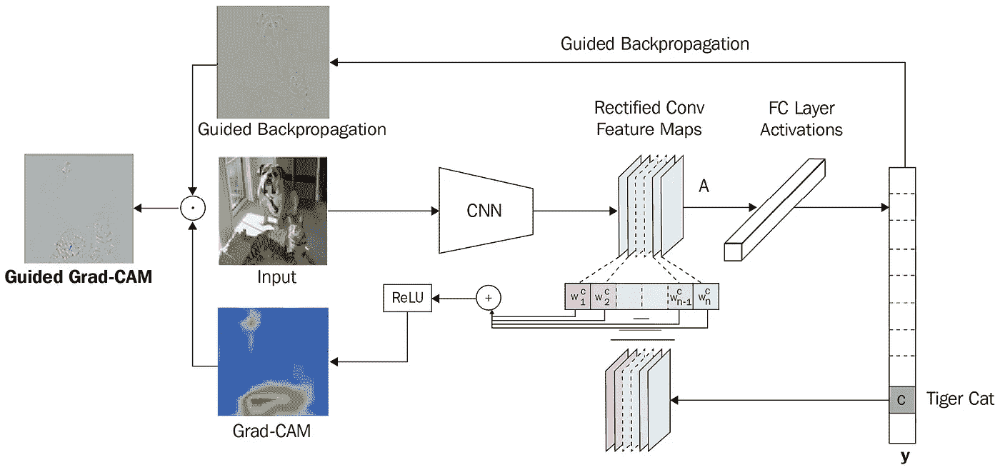
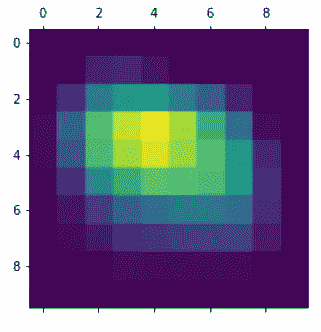

# 使用 Keras 和 TensorFlow 讲解图像分类器的 Grad-cam 应用实践教程

> 原文：<https://towardsdatascience.com/hands-on-tutorial-for-applying-grad-cams-for-explaining-image-classifiers-using-keras-and-cbdcef68bb89>

## 了解如何使用 Keras 和 TensorFlow 应用 Grad-CAM 来解释基于深度学习的图像分类器


解释图像分类器的 Grad-CAM 方法的输出(作者图片，基本图片来源: [Unsplash](https://unsplash.com/photos/DJ4vjcD0s0I?utm_source=unsplash&utm_medium=referral&utm_content=creditShareLink)

当应用于图像和文本等非结构化数据时，经典的机器学习(ML)算法与深度学习(DL)算法相比效率不高。由于与经典 ML 中的手动特征工程相比，DL 中的自动特征提取的好处，DL 算法在模型精度方面更有效，因此更受欢迎。然而，这些模型比经典的 ML 模型更复杂，更难解释。因此，对于像图像这样的非结构化数据的 DL 模型来说，可解释性总是一个问题。**逐层相关性传播** ( **LRP** )是一种可解释方法，它突出图像的相关区域来解释模型预测。

如果你不太熟悉可解释的人工智能(XAI)概念，我强烈建议观看我过去在 2021 年 APAC 人工智能加速器节上发表的关于 XAI 的演讲:

你也可以浏览我的书 [**应用机器学习可解释技术**](https://amzn.to/3cY4c2h) 并看看[代码库](https://github.com/PacktPublishing/Applied-Machine-Learning-Explainability-Techniques/)以获得对其他 XAI 方法的实际接触。

<https://www.amazon.com/Applied-Machine-Learning-Explainability-Techniques/dp/1803246154?_encoding=UTF8&pd_rd_w=Wr6SJ&content-id=amzn1.sym.716a1ed9-074f-4780-9325-0019fece3c64&pf_rd_p=716a1ed9-074f-4780-9325-0019fece3c64&pf_rd_r=6P2PM599T97MRG7NZD9J&pd_rd_wg=m4qUW&pd_rd_r=6e349d93-5ba0-4bfe-9055-905c0153fe58&linkCode=li3&tag=adib0073-20&linkId=35506e1847de5c011fc57aa66c2b1d8e&language=en_US&ref_=as_li_ss_il>  

如果你想得到关于这本书的详细反馈，这个视频可能对你有用:

在这篇文章中，我将提到一种叫做 **Grad-CAM** 的流行 LRP 技术的实际应用，用于解释图像分类器。我还将介绍使用 Keras 和 TensorFlow 应用 Grad-CAMs 的一步一步的代码教程。

现在，让我们开始吧！

# LRP 简介

为了解释 DL 模型，LRP 是最突出的方法之一。直观地说，这种方法利用网络中的权重和前向传递神经激活，通过网络中的各个层将输出传播回输入层。因此，在网络权重的帮助下，我们可以将对最终模型输出贡献最大的数据元素(图像中的像素和文本数据中的单词)可视化。这些数据元素的贡献是通过网络层传播的相关性的定性度量。此外，对于具有多层的深度神经网络，当通过层间梯度流动过程的信息流保持一致时，学习就发生了。因此，为了解释任何深度学习模型，LRP 方法允许我们可视化网络不同层中的*激活的*或最有影响力的数据元素，并定性地检查算法的功能。

<https://www.amazon.com/Applied-Machine-Learning-Explainability-Techniques/dp/1803246154?_encoding=UTF8&pd_rd_w=Wr6SJ&content-id=amzn1.sym.716a1ed9-074f-4780-9325-0019fece3c64&pf_rd_p=716a1ed9-074f-4780-9325-0019fece3c64&pf_rd_r=6P2PM599T97MRG7NZD9J&pd_rd_wg=m4qUW&pd_rd_r=6e349d93-5ba0-4bfe-9055-905c0153fe58&linkCode=li3&tag=adib0073-20&linkId=35506e1847de5c011fc57aa66c2b1d8e&language=en_US&ref_=as_li_ss_il>  

# 什么是 Grad-CAM？

**类激活图(CAMs)** 是用于解释深度学习模型的可视化方法。在这种方法中，模型预测的类别分数被追溯到最后的卷积层，以突出图像中的有区别的感兴趣区域，这些区域是特定于类别的，甚至不是其他计算机视觉或图像处理算法所通用的。 **Gradient CAM** 或俗称 **Grad-CAMs** 结合了导向反向传播和 CAM 的效果，在不突出颗粒像素重要性的情况下，突出类别区分感兴趣区域。但是 Grad-CAM 可以应用于任何 CNN 架构，不像 CAM 可以应用于在预测层之前对来自卷积层的输出特征图执行全局平均汇集的架构。为了更详细地了解 Grad-CAM 过程，您可以看看这篇研究论文 *Grad-CAM:通过基于梯度的定位从深度网络进行可视化解释，Ramprasaath 等人。艾尔—*[https://arxiv.org/abs/1610.02391](https://arxiv.org/abs/1610.02391)。



引导 Grad-CAM 的架构图(来源: *Grad-CAM:通过基于梯度的定位，来自深度网络的视觉解释，Ramprasaath 等人。艾尔—*[https://arxiv.org/abs/1610.02391](https://arxiv.org/abs/1610.02391)

# 使用 Keras 和 TensorFlow 应用 Grad-cam

现在来看这篇文章有趣的部分:学习如何应用 Grad-CAMs！我们将使用 Keras 和 TensorFlow 来应用 Grad-cam 来解释预训练的图像分类器。您将需要以下 Python 框架来应用 Grad-CAMs，这些框架可以使用 Python pip 安装程序进行安装:

```
**!**pip install --upgrade numpy matplotlib tensorflow
```

让我们从用 Python 加载所需的模块开始。我会推荐使用本地 Jupyter 笔记本或 Google colab 来运行这个代码教程。

```
**import** numpy **as** np
**import** matplotlib.pyplot **as** plt
**import** matplotlib.cm **as** c_map
**from** IPython.display **import** Image, display
**import** tensorflow **as** tf
**from** tensorflow **import** keras
**from** tensorflow.keras.applications.xception **import** Xception, preprocess_input, decode_predictions
**from** tensorflow.keras.preprocessing **import** image
**import** os
```

我们将使用 TensorFlow 和 Keras 框架在 **ImageNet** 数据集上获得一个预训练的网络，并在从来源:[https://images . unsplash . com/photo-1615963244664-5b 845 b 2025 ee？IX lib = r b-4 . 0 . 3&ixid = mnwxmja 3 fdb 8 mhxwag 90 by 1 wywdlfhx 8 fgvufdb 8 fhx 8&auto = format&fit = crop&w = 464&q = 80](https://images.unsplash.com/photo-1615963244664-5b845b2025ee?ixlib=rb-4.0.3&ixid=MnwxMjA3fDB8MHxwaG90by1wYWdlfHx8fGVufDB8fHx8&auto=format&fit=crop&w=464&q=80)。更多使用 Keras 和 TensorFlow 的例子请访问:【https://keras.io/examples/】T4。

```
model_builder **=** Xception
preprocess_input **=** preprocess_input
decode_predictions **=** decode_predictions
IMG_SIZE **=** (299, 299)
last_conv_layer **=** "block14_sepconv2_act"*# The local path to our target image*
image_path **=** keras**.**utils**.**get_file(
    "tiger.jpg", "[https://images.unsplash.com/photo-1615963244664-5b845b2025ee?ixlib=rb-4.0.3&ixid=MnwxMjA3fDB8MHxwaG90by1wYWdlfHx8fGVufDB8fHx8&auto=format&fit=crop&w=464&q=80](https://images.unsplash.com/photo-1615963244664-5b845b2025ee?ixlib=rb-4.0.3&ixid=MnwxMjA3fDB8MHxwaG90by1wYWdlfHx8fGVufDB8fHx8&auto=format&fit=crop&w=464&q=80)"
)

display(Image(image_path))
```


来源推断图像(来源: [Unsplash](https://unsplash.com/photos/DJ4vjcD0s0I?utm_source=unsplash&utm_medium=referral&utm_content=creditShareLink)

加载图像后，您需要应用预处理层。由于我们将使用来自 Keras 和 TensorFlow 的预训练**异常**模型，我们将需要应用相同的预处理。

```
**def** vectorize_image(img_path, size):
    '''
    Vectorize the given image to get a numpy array
    '''
    img **=** image**.**load_img(img_path, target_size**=**size)
    array **=** image**.**img_to_array(img)
    array **=** np**.**expand_dims(array, axis**=**0) *# Adding dimension to convert array into a batch of size (1,299,299,3)*
    **return** array
```

现在，让我们将预训练的模型应用于我们预处理的图像，并查看预测。

```
vectorized_image **=** preprocess_input(vectorize_image(image_path, size**=**IMG_SIZE))
model **=** model_builder(weights**=**"imagenet")
model**.**layers[**-**1]**.**activation **=** **None** *# Removing the last layer as it is the softmax layer used for classification*

model_prediction **=** model**.**predict(vectorized_image)
print(f"The predicted class is : {decode_predictions(model_prediction, top**=**1)[0][0][1]}")
```

这是我们得到的输出:

```
The predicted class is : tiger
```

因此，我们的模型正确地预测了我们的推断图像为老虎。现在，让我们来理解使用 Grad-cam 进行预测背后的基本原理。

# 建筑 Grad-CAM 热图

我们将构建一个 Grad-CAM 热图可视化工具来突出显示模型中有影响力的超像素。

```
**def** get_heatmap(vectorized_image, model, last_conv_layer, pred_index**=None**):
    '''
    Function to visualize grad-cam heatmaps
    '''
    gradient_model **=** tf**.**keras**.**models**.**Model(
        [model**.**inputs], [model**.**get_layer(last_conv_layer)**.**output, model**.**output]
    )

    *# Gradient Computations*
    **with** tf**.**GradientTape() **as** tape:
        last_conv_layer_output, preds **=** gradient_model(vectorized_image)
        **if** pred_index **is** **None**:
            pred_index **=** tf**.**argmax(preds[0])
        class_channel **=** preds[:, pred_index]

    grads **=** tape**.**gradient(class_channel, last_conv_layer_output)
    pooled_grads **=** tf**.**reduce_mean(grads, axis**=**(0, 1, 2))
    last_conv_layer_output **=** last_conv_layer_output[0]
    heatmap **=** last_conv_layer_output **@** pooled_grads[**...**, tf**.**newaxis]
    heatmap **=** tf**.**squeeze(heatmap)
    heatmap **=** tf**.**maximum(heatmap, 0) **/** tf**.**math**.**reduce_max(heatmap) *# Normalize the heatmap*
    **return** heatmap**.**numpy()

plt**.**matshow(get_heatmap(vectorized_image, model, last_conv_layer))
plt**.**show()
```

当我们将热图应用于预训练模型的第四卷积层时，我们得到的输出热图图像如下:



Grad-CAM 热图来自推理老虎图片(来源:作者)

但是这并不能告诉我们什么，除非我们把这个图像叠加到我们的推理图像上。因此，让我们使用下面的代码片段来看看如何做到这一点:

```
**def** superimpose_gradcam(img_path, heatmap, output_path**=**"grad_cam_image.jpg", alpha**=**0.4):
    '''
    Superimpose Grad-CAM Heatmap on image
    '''
    img **=** image**.**load_img(img_path)
    img **=** image**.**img_to_array(img)

    heatmap **=** np**.**uint8(255 ***** heatmap) *# Back scaling to 0-255 from 0 - 1*
    jet **=** c_map**.**get_cmap("jet") *# Colorizing heatmap*
    jet_colors **=** jet(np**.**arange(256))[:, :3] *# Using RGB values*
    jet_heatmap **=** jet_colors[heatmap]
    jet_heatmap **=** image**.**array_to_img(jet_heatmap)
    jet_heatmap **=** jet_heatmap**.**resize((img**.**shape[1], img**.**shape[0]))
    jet_heatmap **=** image**.**img_to_array(jet_heatmap)

    superimposed_img **=** jet_heatmap ***** alpha **+** img *# Superimposing the heatmap on original image*
    superimposed_img **=** image**.**array_to_img(superimposed_img)

    superimposed_img**.**save(output_path) *# Saving the superimposed image*
    display(Image(output_path)) *# Displaying Grad-CAM Superimposed Image*

superimpose_gradcam(image_path, get_heatmap(vectorized_image, model, last_conv_layer))
```

瞧啊。我们得到了参考图像的以下叠加热图图像:


用于解释图像分类器的 Grad-CAM 方法的输出(图片由作者提供，基本图片来源: [Unsplash](https://unsplash.com/photos/DJ4vjcD0s0I?utm_source=unsplash&utm_medium=referral&utm_content=creditShareLink)

使用 Grad-CAMs 是不是太难了？绝对不行！Keras 和 TensorFlow 使得将这种可解释的技术应用于图像分类器变得更加容易！这是一种非常强大的技术，用于解释复杂的深度学习算法对图像等非结构化数据的工作。虽然这种方法对于初学者来说很难理解。然而，一旦你掌握了它，这是一个非常强大的方法，对模型的可解释性非常有帮助。

希望你喜欢这篇文章！完整的教程笔记本可在:[https://github . com/packt publishing/Applied-Machine-Learning-explability-Techniques/blob/main/chapter 02/layer wise % 20 propagation . ipynb](https://github.com/PacktPublishing/Applied-Machine-Learning-Explainability-Techniques/blob/main/Chapter02/Layerwise%20Propagation.ipynb)获得。我推荐阅读这本书: [**【应用机器学习可解释技术】**](https://amzn.to/3cY4c2h) 并探索 [GitHub 库](https://github.com/PacktPublishing/Applied-Machine-Learning-Explainability-Techniques)以获得更多实际操作的代码示例。

在 [Medium](https://adib0073.medium.com/membership) 和 [LinkedIn](https://www.linkedin.com/in/aditya-bhattacharya-b59155b6/) 上关注我，了解更多可解释的 AI 和机器学习。

<https://www.amazon.com/Applied-Machine-Learning-Explainability-Techniques/dp/1803246154?_encoding=UTF8&pd_rd_w=Wr6SJ&content-id=amzn1.sym.716a1ed9-074f-4780-9325-0019fece3c64&pf_rd_p=716a1ed9-074f-4780-9325-0019fece3c64&pf_rd_r=6P2PM599T97MRG7NZD9J&pd_rd_wg=m4qUW&pd_rd_r=6e349d93-5ba0-4bfe-9055-905c0153fe58&linkCode=li3&tag=adib0073-20&linkId=35506e1847de5c011fc57aa66c2b1d8e&language=en_US&ref_=as_li_ss_il>  

# 作者关于 TDS 的其他 XAI 相关文章:

1.  [用于在文本数据上训练的模型的可解释机器学习:将 SHAP 与变压器模型相结合](/explainable-machine-learning-for-models-trained-on-text-data-combining-shap-with-transformer-5095ea7f3a8)
2.  [EUCA——一个有效的 XAI 框架，让人工智能更贴近终端用户](/euca-an-effective-xai-framework-to-bring-artificial-intelligence-closer-to-end-users-74bb0136ffb1)
3.  [理解可解释人工智能中使用的 SHAP 和沙普利值的工作原理](/understand-the-working-of-shap-based-on-shapley-values-used-in-xai-in-the-most-simple-way-d61e4947aa4e)
4.  [如何用石灰解释图像分类器](/how-to-explain-image-classifiers-using-lime-e364097335b4)

<https://www.amazon.com/Applied-Machine-Learning-Explainability-Techniques/dp/1803246154?_encoding=UTF8&pd_rd_w=Wr6SJ&content-id=amzn1.sym.716a1ed9-074f-4780-9325-0019fece3c64&pf_rd_p=716a1ed9-074f-4780-9325-0019fece3c64&pf_rd_r=6P2PM599T97MRG7NZD9J&pd_rd_wg=m4qUW&pd_rd_r=6e349d93-5ba0-4bfe-9055-905c0153fe58&linkCode=li3&tag=adib0073-20&linkId=35506e1847de5c011fc57aa66c2b1d8e&language=en_US&ref_=as_li_ss_il>  

# 参考

1.  Keras Tensorflow 教程示例—[https://keras.io/examples/](https://keras.io/examples/)
2.  Grad-CAM:通过基于梯度的定位来自深度网络的视觉解释。艾尔*—*[https://arxiv.org/abs/1610.02391](https://arxiv.org/abs/1610.02391)。
3.  应用机器学习解释技术
4.  GitHub repo 自《应用机器学习可解释技术》——[https://GitHub . com/packt publishing/Applied-Machine-Learning-explability-Techniques/](https://github.com/PacktPublishing/Applied-Machine-Learning-Explainability-Techniques/)