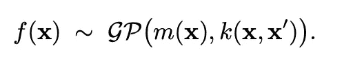
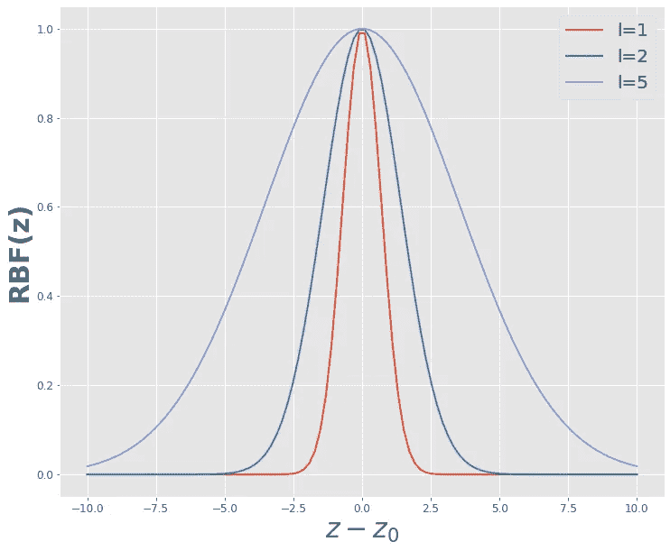

# 使用机器学习和 Python 进行实际操作的无监督离群点检测

> 原文：<https://towardsdatascience.com/hands-on-unsupervised-outlier-detection-using-machine-learning-with-python-ec599fe5a6b5>

威尔·梅尔斯在 [Unsplash](https://unsplash.com/s/photos/outlier?utm_source=unsplash&utm_medium=referral&utm_content=creditCopyText) 上拍照

## 以下是如何使用简单的机器学习算法来检测未标记数据集的异常值

数据科学中最丰富和最强大的技术之一是**异常检测**。

这项技术如此吸引人的地方在于“离群值”的定义非常普遍。换句话说，我们可以将数据集的任意集合定义为“离群集合”，并尝试通过使用我们拥有的其他特征来识别它。

当然，检测异常值的一个非常简单的方法是绘制分布图，并提取远离分布中值的值。这种方法的问题是，它意味着您的数据具有类似于高斯分布的分布，但这并不总是正确的。

另一种方法是使用分类方法，并对您的数据应用二元分类算法(异常值/非异常值)。尽管如此，这种方法需要**标记的数据。**

那么我们能用什么呢？我们可以用**高斯过程回归**。该模型为您提供了一种回归技术，可输出一个**均值**和一些与某个概率不确定性相关的预测性**边界**。

让我们开始吧:

# 1.高斯过程回归

正如我所说，高斯过程回归的假设是，你的数据只不过是一个高斯过程的随机实现，其中这个高斯过程的均值和方差是某个**均值函数**，方差是某个**方差函数。**

使用[这个](https://latex2png.com/)制作的图像

这个均值和方差函数都依赖于所使用的**内核**函数。

使用最多的只是径向基函数(RBF)核:

我制作的图像

在 **l** 值给出协方差
的地方，我们添加了一个**白噪声内核**，它考虑到了您的测量也可能有噪声的事实。

# 2.代码

## 2.1 图书馆

这是一篇实践文章，所以让我们开始写代码吧。这就是你需要的:

基本就是 GPR 部分有 **Sklearn，matplotlib，numpy 和 pandas**

## 2.2 数据集

我使用的数据集是一个时间序列，我在这里找到了<https://www.kaggle.com/arashnic/learn-time-series-forecasting-from-gold-price>****。** 数据集将主要用于回归任务，但该方法的实际用途来自我们能够预测的边界。**

**我们来导入一下:**

**并显示一些行:**

**因为我们的目的只是展示该方法的工作原理，所以让我们使用稍微小一些的数字，并将我们自己限制在数据集的 80%上:**

**如果我们想应用 GPR 方法，我们有“日期时间对象”的事实是令人不安的。让我们把第 0 天和第 0 天之间的距离看作我们的时间:**

**让我们绘制日期和新的时间轴(X):**

## **2.3 模型**

**让我们使用下面的代码来拟合 GPR 模型(可能需要一段时间):**

**让我们得到**的平均值**和**的标准界限:****

**让我们将它们转换成两个 dataframe 对象:**

**让我们画出结果:**

**我们之前已经表明，原始时间采样是不均匀的，并且它也反映在我们的较小部分数据中。这就是为什么在最低的图中，GPR 方法不太能够识别方差并且很可能高估它( ***说到底，如果你的数据点很少，你怎么能说一个新的是异常值呢？*** )**

## **2.4 异常值检测**

**我们在前面两个图中设置的阈值相当大(99.7%置信区间)。**由于这个原因，我们可以说，在这个边界之外的一切可能是我们过程的异常(或异常值)**。**

**让我们创建一个新列，说明“值”是否超出了每行的边界。**

**让我们画出如此定义的**异常值**:**

**有趣的是，我们能够检测出异常值是大于上边界还是小于下边界的异常值。**换句话说，我们能够检测出黄金价格是高于我们的预期还是低于我们的预期**:**

**给你:**

# **3.结论**

**这个想法看起来简单而天真，但是当定制**内核函数**时，它实际上会变得非常复杂和有趣(假设对我们正在考虑的系统有更精确的理解)。**

**强有力的想法是，您可以在没有任何标签的情况下分析系统的行为，并通过这样做来检测异常值。**

**我希望这篇文章是有趣和鼓舞人心的。如果是这样，你想讨论一下，或者你有什么问题，请给我发邮件:*或者在[**LinkedIn**](https://www.linkedin.com/in/pieropaialunga/)**上加我。*****

***再见:)***