# 更难、更好、更快、更轻的深度学习，具有直接反馈一致性

> 原文：<https://towardsdatascience.com/harder-better-faster-lighter-deep-learning-with-direct-feedback-alignment-9e837b076baa>

## 通过随机性和激光提高深度学习效率的温和指南

托拜厄斯·科奈尔在 [Unsplash](https://unsplash.com?utm_source=medium&utm_medium=referral) 上的照片

在这篇文章中，我们将谈论自从我发现深度学习以来，我所面临的最有趣的主题之一:直接反馈对齐(DFA)。这种方法是标准深度学习训练方法(反向传播)的一种令人难以置信和令人难以置信的替代方法，同时允许更有效的训练。在这篇文章结束时，你会明白混合神经网络，激光和随机性可以提供更多的力量！

这篇文章不是神经网络的介绍。尽管我们将对神经网络背后的数学做一个简要的回顾，但它是为了共享符号并介绍反向传播和 DFA 之间的区别。如果你想在深入研究之前了解更多关于神经网络和深度学习的知识，你可以阅读[这篇文章](https://medium.com/towards-data-science/deep-learnings-mathematics-f52b3c4d2576)。

# 神经网络 101 概述

神经网络被广泛使用，因为它们能够很好地逼近每一个可能的函数，并且可以扩展到高维空间。它们的主要用途是监督学习，在监督学习中，它们被用于使用数据示例来推断输入和输出之间的关系，我们试图减少预测和目标之间的误差。然而，它们超出了这个范围，可以用来最小化或最大化任何给定的数字目标。

神经网络由相互连接的神经元层组成。这种结构允许使用一系列非线性变换将输入信号处理成输出信号，最终产生全局复变换。给定神经网络执行的转换由其参数(也称为权重和偏差)和激活函数来定义。为了清楚起见，本文中我们只考虑全连通网络。

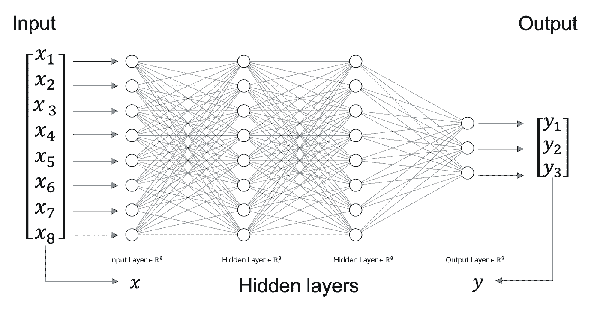

作者图片

## 前进传球

现在让我们深入研究它背后的数学原理。

首先，神经网络如何处理输入:

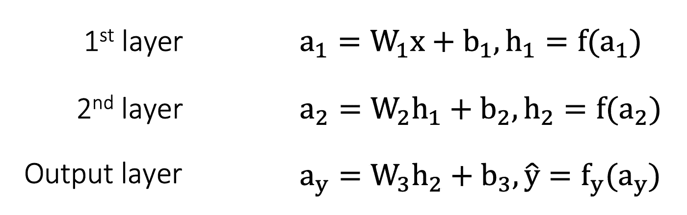

正向传播方案(注意:最后一层的激活不同于其他层)。作者图片

输入被馈送到第一层，在那里使用权重和偏差应用线性变换。然后，通过激活函数修改线性变换的输出，从而允许引入非线性(使用 sigmoid、tanh 或 swish 等函数)或线性修改(如 ReLU 及其变体)。然后，使用激活函数的结果作为下一层的输入，通过其他层重复该过程。

在过程开始时，由于权重已经被随机初始化(这是神经网络中最常见的初始化类型)，正向传递的结果输出(以及网络的预测)本质上是随机的。

神经网络的基本问题是:

> 我如何改变权重，使神经网络做我想要它做的事情？

## 目标(损失)

知道如何改变权重取决于我们所说的“我希望网络做什么”是什么意思。这个目标的详细说明是通过一个目标函数来完成的，通常称为损失。损失(表示为 L 或 J)是神经网络参数(权重和偏差，表示为θ)的函数，其描述了如何将我们的神经网络的输出与预期输出进行比较。它本质上是对网络错误程度的量化，并因此被最小化。例如，在二进制分类中，一个常见的损失是二进制交叉熵:

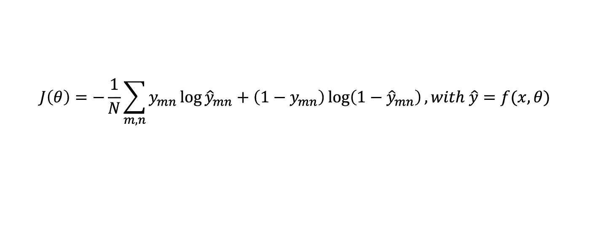

二进制交叉熵，其中 m 和 n 是输出单元和小批量索引(符号保持与 DFA 原始论文相同)。作者图片

因此，在这种情况下，目标是最小化这个损失函数，以使网络做我们想要的。我们现在可以将问题更新为:

> 我如何改变权重，使神经网络最小化损失？

## 反向传播

损失告诉我们离我们的目标有多远，我们希望有一种方法通过网络传播此信息，将权重(和偏差)更改为一个值，从而导致更低的损失。这意味着揭示每个个体重量对输出的贡献(以及损失)，以便能够适当地调整它们。让我们从调整最后一层的权重开始。为此，我们首先想知道我们的损耗(或误差)如何随最后一层的输出而变化:

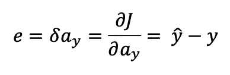

使用二进制交叉熵和逻辑激活，损耗相对于最后一层激活的导数被简化为输出和标签之间的差。作者图片

现在我们知道了损耗如何随输出层变化，我们想利用这一知识使激活以降低损耗的方式变化。因此，我们想知道如何以这样一种方式改变权重，以引起激活的期望变化:

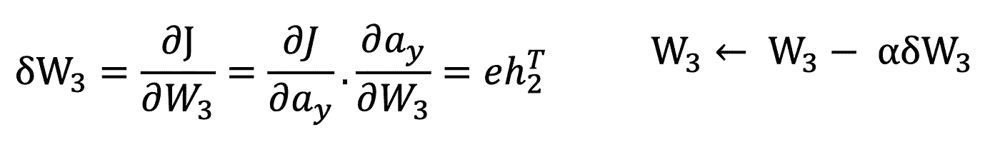

左:减少损失所需的重量变化，右:重量更新(增加了学习率α)。作者图片

现在，我们将相同的方案应用于其他层:

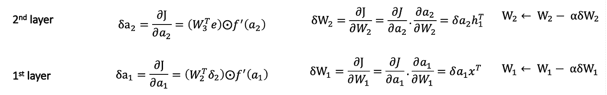

隐藏层和输入层的权重更新方案。“带点的 o”运算符是 Hadamard 乘积(逐元素乘法)。作者图片

然后…瞧！我们更新了权重(类似的过程也适用于偏差)以减少损失。我们现在可以对新的示例重复该过程，以逐渐降低损失，直到收敛。

# 那么反向传播有什么问题呢？

尽管这一过程可行，但也并非没有缺陷:

*   **反向传播是一个连续的过程:**在计算前一层的梯度之前，我们需要计算最后一层的梯度，然后需要计算前一层的梯度，等等。对于更深的网络，这使得过程非常慢
*   **梯度计算需要矩阵转置**:这是一种昂贵的计算(具有 O(n^2 的复杂性)，并且需要大量内存。对于较大的网络，这可能很快成为一个问题。

另一个问题，根据[原始论文](https://arxiv.org/abs/1411.0247)的作者，问题不太大但仍然相关，就是反向传播不是“生物学上合理的”。这是因为在真实的神经元中，一致认为没有信号反向传播。

> 反向传播学习算法是强大的，但是需要生物学上难以置信的单个突触权重信息的传输。对于反向传播，神经元必须知道彼此的突触权重。[……]在计算机上，在正向和反向计算中使用突触权重很简单，但大脑中的突触单向传递信息
> 
> [*来源*](https://arxiv.org/abs/1411.0247) *:随机反馈权重支持深度神经网络中的学习，T. P. Lillicrap，D. Cownden，D. B. Tweed，C. J. Akerman，2014*

我们不打算在本文中讨论这种说法的真实性，但我们仍然会注意到，这种信念导致了旨在更具生物学合理性的方法的诞生。思路是，如果我们更接近地模仿大脑，我们将有更好的方法，因为大脑比现有的方法更有效。其中一种更符合生物学原理的方法是我们今天感兴趣的。

> 那么，我们能解决反向传播的缺陷吗？

# 直接反馈校准

让我们从反向传播开始，在没有顺序计算和矩阵转置的情况下构造我们的梦更新。我们不在乎它是否有意义…现在还不在乎。

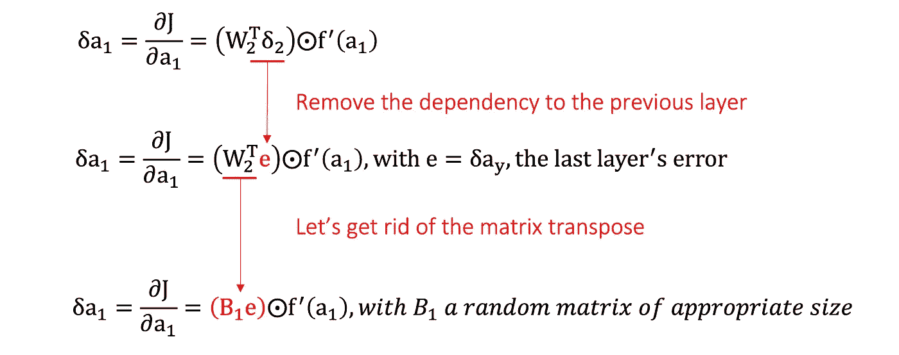

从反向传播(BP)到 DFA 的第一层更新修改。图片作者。

为了消除对前一层的依赖性，并因此消除顺序性以允许并行计算，**我们使所有层使用相同的反馈**:我们将跨所有层使用最后一层的误差(在上面的等式中表示为 e ),而不是使用损耗相对于前一层的激活的梯度(上面的等式中的δ2)。
然后，为了移除矩阵转置，**我们用适当大小的固定随机矩阵**替换转置的权重矩阵。没有转置计算来运行每一个更新了，只是生成一个随机矩阵每一层，并使用它进行所有的计算。

瞧，我们有一个表达式，它不需要任何顺序计算，因为各层之间没有依赖关系，一旦我们计算了最后一层的误差，我们就可以同时计算所有其他层的更新。我们还删除了矩阵转置，这将进一步加速计算！这种更新称为直接反馈校准(DFA):

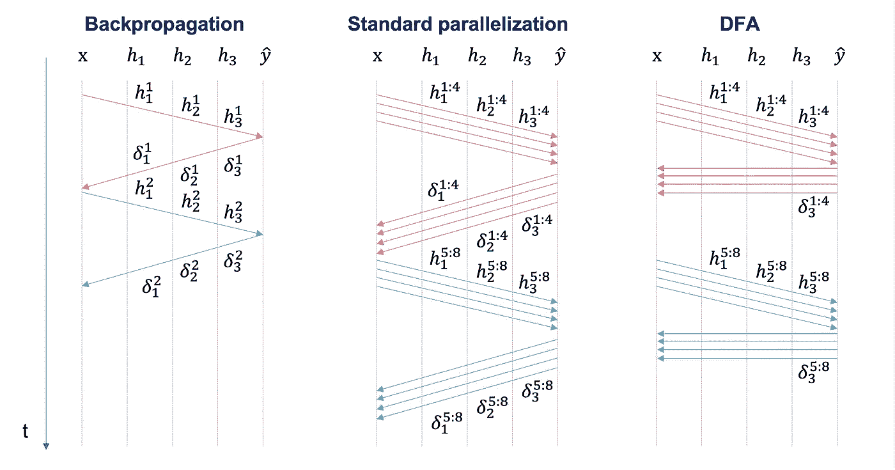

与同时计算几个示例的更新但仍以顺序方式进行的并行化不同，DFA 同时处理几个示例，同时更新所有层。红色是第一批，蓝色是第二批，箭头表示不同输入的向前和向后传递。作者图片，灵感来自[https://slideplayer.com/slide/12651467/](https://slideplayer.com/slide/12651467/)

DFA 是类似技术家族的一部分:

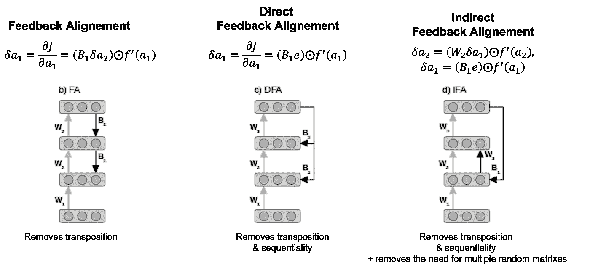

不同反馈校准方法的表示。来源:[直接反馈对齐提供深度神经网络中的学习](https://arxiv.org/pdf/1609.01596.pdf)，Arild nkland，2016 年

*   反馈对准是该过程的第一步，仅去除矩阵转置，但保留反向信号。
*   直接反馈调整，我们已经讨论过了。
*   间接反馈对齐，它消除了换位，并将最后一层的误差直接传播到第一层，然后继续向前传播。这允许使用单个随机矩阵而不是每层一个矩阵，从而节省存储器。实际上，这个版本没有 DFA 有趣，除非你的内存很紧张，所以我们不会关注它。

## 深度魔法

但是等一下…有了这个“*更好地更新*”我们基本上已经破坏了这个过程中的反向传播，不是吗？我们的新更新如何允许训练神经网络？**随机矩阵如何在有意义的更新中发挥作用？**

这是一个非常好的问题！首先，让我们看看它与反向传播有何不同:

我们可以看到，尽管进行了修改，DFA 仍然与反向传播(BP)结果相匹配。来源:[直接反馈对齐提供深度神经网络中的学习](https://arxiv.org/pdf/1609.01596.pdf)，Arild nkland，2016

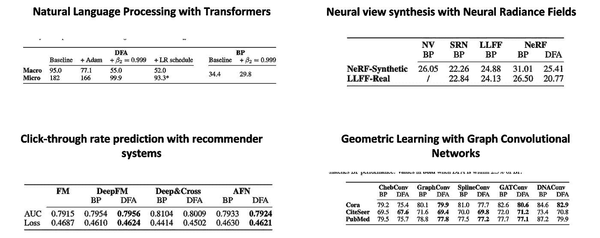

我们可以看到，在几个深度学习任务上，DFA 匹配甚至优于 BP 的结果。来源:[现代深度学习任务和架构的直接反馈校准量表](https://arxiv.org/pdf/2006.12878.pdf)，j .劳奈、I .里坡、f .博尼法斯和 f .克尔扎卡拉，2020

令人吃惊不是吗？

我们获得了与 BP 类似的结果(更好的结果会令人震惊，因为我们只是使信号变得更糟)，同时允许更简单的计算。我们可以更快地得到相同的结果！

## 但是…怎么做？

太好了，但是……**如何**？让我们试着理解为什么我们看似破碎的更新仍然为我们的网络传递着一个有意义的信号。

原论文的作者解释说，网络“*学习如何学习*”。Mhhh，我们见过更清晰的。他们指出，由于反馈现在是一个固定的和随机修改的误差，前馈权重必须自己适应。反馈不再是明确的，而是隐含的。

> 网络学习如何学习——它逐渐发现如何使用 B(随机矩阵),然后允许有效地修改隐藏单元。起初，对隐藏层的更新没有帮助，但通过改变 W 的隐式反馈过程，它们很快得到改善，使得 eT WBe > 0。为了揭示这一点，我们绘制了由反馈对齐和反向投影规定的隐藏单元更新之间的角度，最初角度平均约为 90°。但随着算法开始采取更接近反向投影的步骤，它们很快就会缩小。h 的这种排列意味着 b 已经开始像 W^T 一样行动。因为 b 是固定的，所以这种排列是由前向权重 w 的变化驱动的。这样，随机反馈权重开始向网络深处的神经元传输有用的教学信号。**
> 
> 来源:[随机反馈权重支持深度神经网络中的学习](https://arxiv.org/pdf/1411.0247.pdf)，T. P. Lillicrap、D. Cownden、D. B. Tweed 和 C. J. Akerman，2014 年

让我们试着解释一下，好吗？基本上，信号在有意义的信息方面要差得多，然而，更新方向大致是正确的，尽管如此，允许学习。更新方向与反向传播大致相同，因此称为“对齐”。

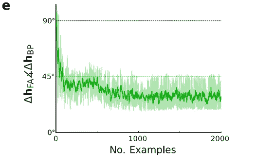

DFA 和 BP 更新之间的角度。随着训练的进行，DFA 的更新几乎与 BP 的更新一致。来源:[随机反馈权重支持深度神经网络中的学习](https://arxiv.org/pdf/1411.0247.pdf)，T. P. Lillicrap、D. Cownden、D. B. Tweed 和 C. J. Akerman，2014 年

DFA 的更新围绕真实 BP 更新“振荡”。

## 直觉

让我们尝试建立一些关于为什么会发生这种情况的直觉(这种直觉大多来自 [Yannic Kilcher 的视频](https://www.youtube.com/watch?v=Hdo81GtLC_4&ab_channel=YannicKilcher)，关于这篇文章的视频带有我自己理解的包装)。

即使反向传播的信号被随机矩阵调制，它也不会从误差中去除所有信息。这是由于向量(在我们的例子中是误差 e)乘以一个随机矩阵来表示一个保持角度和距离的投影的性质(为什么会发生这种情况与 Jonhson-Lidenstrauss 引理有关，但我不能 100%确定为什么会发生这种情况，所以我们将在本文中假设它是正确的)。换句话说，通过将我们的信号乘以随机矩阵，我们只是应用了随机旋转，而没有其他修改。

让我们试着从最后一层开始想象。为了举例，我们将假设在一个分类问题中有 3 个可能的类别:c1、c2 和 c3。我们的网络对每个示例(y hat)进行预测，更新告诉我们应该在哪个方向上改变多少权重，以正确地将该示例归属于其类。换句话说，我们希望将预测(y hat，不同类别的概率向量，例如[0.7，0.1，0.2])与正确的类别(例如 c1:[1，0，0])对齐。在这种情况下，要进行的修改将是[0.3，-0.1，-0.2]。

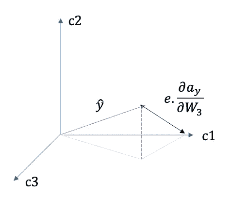

表示将预测(y hat)正确映射到其类(此处:c1)的更新。作者图片

现在对于前面的层，我们必须处理随机乘法。这意味着我们的坐标系被随机旋转，同时保持角度和距离不变。在这个系统中，误差不传达我们应该如何修改预测以使其更接近目标，而是传达如何使其更接近目标的一些随机旋转。

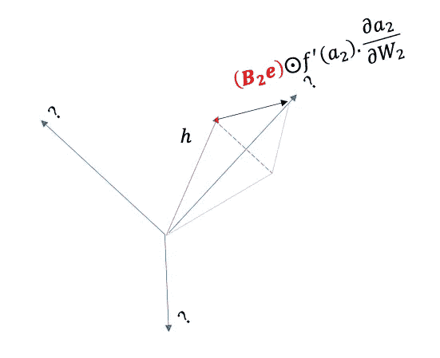

随机矩阵乘法使更新随机旋转，从而不再处于原始方向。作者图片

从单个例子的角度来看，这是不好的，因为更新似乎朝着一个随机错误的方向进行。然而，如果我们考虑多个示例，由于旋转保持不变，属于同一类的示例仍将被拉近，因为它们将被投影到同一旋转的类上。结果，传播的信号不允许指定权重应该被更新的绝对方向。然而，我们仍然可以用相对论的方式做到这一点:不是每次更新都在正确的绝对方向上移动权重，而是网络学习将应该靠近的例子聚集在一起。从某种意义上来说，这可以归结为对示例进行聚类，然后对聚类进行分类，而不是单独对它们进行分类。

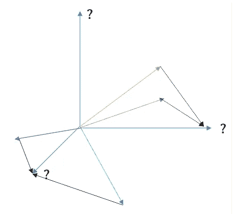

隐藏层过程的表示:相同类的例子(绿色+蓝色和绿色+红色)被分组到相同的随机投影类上。作者图片

换句话说，我们确实传播了错误，但是我们没有传播它应该如何解决最终任务。我们只宣传例子应该如何分组在一起。这使得最后一层对示例进行分类的任务大大简化了。为了证实这一点，让我们看看 BP 和 DFA 通过网络各层对输入到网络的示例的内部表示进行比较。

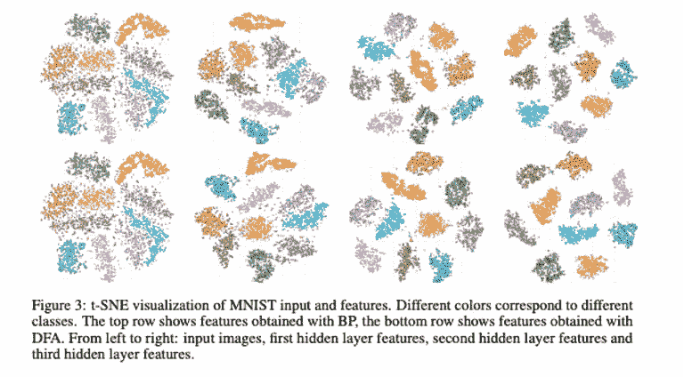

来源:[直接反馈对齐提供深度神经网络中的学习](https://arxiv.org/pdf/1609.01596.pdf)，Arild nkland，2016

查看这些表示证实了这种“聚类”方法导致了与 BP 构建的表示类似的结果。换句话说，我们以不同且更简单的方式实现了相同的结果，因为看起来隐藏层不需要显式地将示例映射到空间的特定部分，它们只需要对它们进行聚类。隐藏层构造的变换允许在两种方法中轻松分离最后一层。**重要的是隐藏的特征，而不是我们获得它们的方式。DFA 是 BP 更新的一个较弱版本，它保留了聚类特性，因此也保留了学习特性。DFA“足够好”可以工作。**

既然我们对它的工作原理有了更清晰的直觉，让我们回到它的性能上来。

# 我为什么要使用 DFA？

正如我们所看到的，对于相似数量的例子，DFA 收敛得和反向传播一样快(就例子而言)。

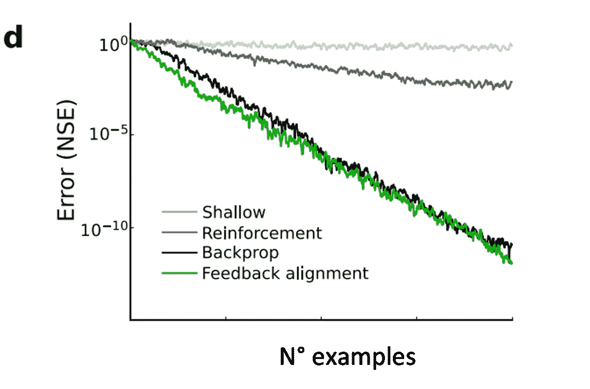

各种更新机制中的错误减少。来源:[随机反馈权重支持深度神经网络中的学习](https://arxiv.org/pdf/1411.0247.pdf)，T. P. Lillicrap，D. Cownden，D. B. Tweed 和 C. J. Akerman，2014

然而，由于缺少转置和并行化所有层更新的能力，使用 DFA 的网络更新在计算上应该比使用反向传播快得多。虽然我们将在后面看到确切的数字，但由于下一点，很难在速度方面比较 DFA 和 BP。

> 如果 DFA 在保持性能的同时速度更快，那么我们为什么不使用它呢？

自 1986 年以来，反向传播一直存在并被大量研究。基本上，所有现有的深度学习都围绕着它。作者声称，缺乏 DFA 的优化实现以及研究人员和实践者的习惯阻碍了 DFA 的采用。然而，另一个技巧应该有助于 DFA 获胜…

# london and south eastern regional library system 伦敦与东南地区图书系统

激光，是的，激光。

到目前为止，我们一直在标准硬件(CPU 或 GPU)上比较 DFA 和 BP。然而，依赖于随机矩阵乘法的 DFA 更新的特异性允许我们利用一个非常有趣的物理现象:**动态光散射**

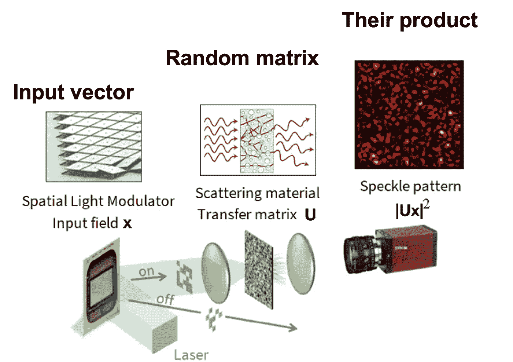

动态光散射的示意图。来源: [*通过多重光学散射的随机投影:光速下的近似核*](https://arxiv.org/pdf/1510.06664.pdf) *，a .萨阿德、f .卡尔塔基龙、I .卡隆、l .道代特、a .德雷莫、s .盖刚、f .克尔扎卡拉，2015*

> 532nm 的单色**激光**被望远镜放大，然后照射数字微镜装置(DMD)**，该装置能够通过振幅调制对光束**上的数字信息进行空间编码，如第三节 b 所述。然后，携带信号的光束**通过透镜聚焦在随机介质**上。这里，介质是一层厚(几十微米)的 T iO2(二氧化钛)纳米粒子(沉积在显微镜载玻片上的白色颜料)。**透射光由第二透镜在远侧**收集，穿过偏振器，并由标准单色 CCD 摄像机测量。
> 
> *来源:* [*通过多重光学散射的随机投影:光速下的近似核*](https://arxiv.org/pdf/1510.06664.pdf) *，a .萨阿德、f .卡尔塔基龙、I .卡隆、l .道代、a .德雷莫、s .盖刚、f .克尔扎卡拉，2015*

换句话说:

> 我们正在以光速计算随机矩阵乘法。

你可能会说这种技术只限于实验室和研究论文…但不，它已经存在了！法国初创公司 [LightOn](https://lighton.ai/) 已经设计并销售了光学处理单元(OPUs ),可以精确地做到这一点(随机矩阵乘法也可以用于其他应用)。

> LightOn 成立于 2016 年，与总部位于巴黎的云计算服务提供商 OVH 集团合作，**声称某些机器学习任务**的性能有所提高。
> 
> **OPU 使用激光**照射到数字微镜装置(DMD) **上，用光**对 1 和 0 进行编码，然后通过透镜和**随机散射介质组件**进行重定向，然后被偏振，并由传统相机读取**。**这允许并行处理非常大的矩阵**。可以做的一个操作就是内核分类。**通常，DMD 可以处理 1k 乘 1k 数量级的矩阵。****
> 
> 对于一个名为**转移学习**的任务， **OPU 显示出比基于 GPU 的解决方案快 6 倍的速度和 5 倍的能效**。这意味着耗电量减少了 30 倍。另一个基于**时间序列分析的基准测试显示，递归神经网络的速度比采用大内存的传统 CPU 快 200 倍**。
> 
> 来源:[https://www . eenewsanalog . com/en/startup-integrated-optical-processing-within-data-center-2/](https://www.eenewsanalog.com/en/startup-integrates-optical-processing-within-data-center-2/)

总之，这项技术允许更快地运行随机矩阵乘法计算，极大地改善了缩放，并允许更大的输入。

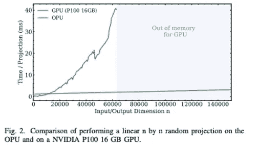

来源:[HPC 中的光子协处理器:使用 LightOn OPUs 进行随机数值线性代数](https://arxiv.org/pdf/2104.14429.pdf)，Daniel Hesslow、Alessandro Cappelli、Igor Carron、Laurent Daudet、Raphael Lafargue、Kilian Muller、Ruben Ohana、Gustave Pariente 和 Iacopo 里坡，2021

# 结论

通过这篇文章，我们发现了反向传播的一种替代方法，它允许通过巧妙的数学技巧，用更简单的计算表达式来近似相同的更新。尽管在传输的信号中不太明确，但是该表达式仍然允许传播重要的信息，从而允许以隐含的方式进行正确的更新。此外，这种计算更新的方式为通过专用硬件大大加速计算打开了大门，专用硬件利用光物理现象以光速进行计算。

总之，一旦我们获得了通用库中的高效实现以及负担得起且易于使用的专用硬件，直接反馈对准必将在计算速度、内存需求以及降低深度学习及其所有应用的能耗方面带来巨大的改进。

感谢您通读了整篇文章。我希望你和我第一次遇到这个算法时一样对它感到惊讶。如果你有一个替代的直觉命题，我会很高兴知道它们。敬请关注更多内容！

# 资源

扬尼克·基尔彻在 DFA 上的视频:[https://www.youtube.com/watch?v=Hdo81GtLC_4&ab _ channel =扬尼克·基尔彻](https://www.youtube.com/watch?v=Hdo81GtLC_4&ab_channel=YannicKilcher)

最初的 FA 和 DFA 论文:[随机反馈权重支持深度神经网络中的学习](https://arxiv.org/pdf/1411.0247.pdf)，T. P. Lillicrap，D. Cownden，D. B. Tweed 和 C. J. Akerman，2014

另一篇关于 DFA 的有趣论文:[直接反馈对齐提供深度神经网络中的学习](https://arxiv.org/pdf/1609.01596.pdf)，Arild nkland，2016

关于 DFA 性能的后续论文:[直接反馈校准适用于现代深度学习任务和架构](https://arxiv.org/pdf/2006.12878.pdf)，j .劳奈、I .里坡、f .博尼法斯和 f .克尔扎卡拉，2020 年

关于动态光散射的论文: [*通过多重光学散射的随机投影:光速下的近似核*](https://arxiv.org/pdf/1510.06664.pdf) *，A. Saade，F. Caltagirone，I. Carron，L. Daudet，A. Drémeau，s .盖刚，F. Krzakala，2015*

莱顿的作品网站:[https://lighton.ai/photonic-computing-for-ai/](https://lighton.ai/photonic-computing-for-ai/)

特别感谢 Benjamin Farcy 审阅本文。