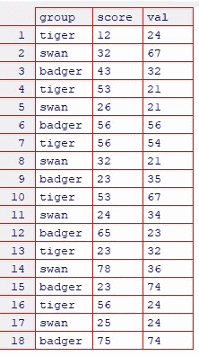
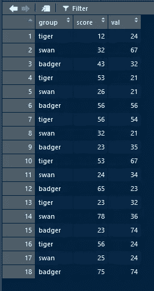
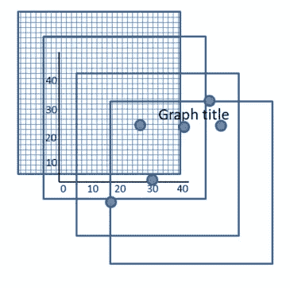
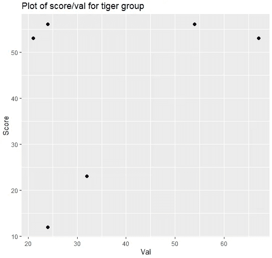
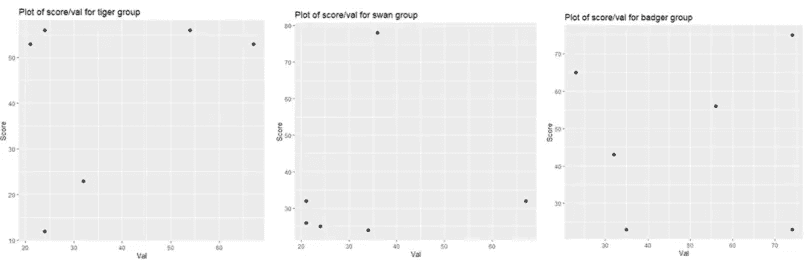
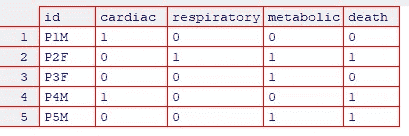

# 利用编程技术改进 R 脚本:

> 原文：<https://towardsdatascience.com/harnessing-programming-techniques-to-improve-r-scripts-e28d09fa0489>

## 使用循环和函数自动化重复性任务


图片来自 Pexels 的 Quang Nguyen Vinh

许多 R 用户是从统计学背景而不是编程/软件工程背景进入 R 编程的，他们以前使用过 SPSS、Excel 等软件。因此，他们可能不了解一些可以用来改进代码的编程技术。这可以包括使代码更加模块化，从而更容易发现和解决错误，但也可以用于自动化重复的任务，如制作表格和绘图等。

这篇短文包括一些基本的编程技术，可以用来提高 R 脚本的质量和可维护性。如果你执行的是重复的任务，而这些重复的任务只有很小的不同，那么这也会节省你大量的时间。我们假设您对用 r 编写简单的脚本有基本的了解。

让我们从一个简单的例子开始。假设我们有几个不同小组的数据。在这种情况下，有 3 种动物(老虎、天鹅和獾)，我们收集了一些与此相关的数据(某种分数和数值)。



作者图片

我们可以将它作为 CSV 文件读入 R，或者将其重新创建为数据帧，如下所示:

```
df <- data.frame(group = rep(c("tiger","swan","badger"), 6), 
 score = c(12,32,43,53,26,56,56,32,23,53,24,65,23,78,23,56,25,75), 
 val = c(24,67,32,21,21,56,54,21,35,67,34,23,32,36,74,24,24,74))
```

我们可以用 r 中的向量来表示值的列表/列。这是通过使用`c`函数将这些值放在逗号分隔的列表中来实现的，该函数用于将值组合成一个向量。例如数字 1 到 4:

```
my_list <- c(1,2,3,4)
```

如果我们通过输入列表的名称来输出列表:

```
my_list
```

哪些输出:

```
[1] 1 2 3 4
```

我们用它来为列`score`和`val`提供数据框中的值。我们可以对`group`列做同样的事情，添加 6 批“老虎”、“天鹅”和“獾”。相反，我们使用`rep`(复制)函数将这些值重复 6 次。

```
rep(c("tiger","swan","badger"), 6)
```

数据框中每一列的值的数量需要相同，否则 R 将产生错误。

我们可以用几种方法查看 R 中的数据帧。我们可以输入数据帧的名称:

```
df
```

哪些输出:

```
 group score val
1 tiger    12  24
2 swan     32  67
3 badger   43  32
4 tiger    53  21
5 swan     26  21
6 badger   56  56
7 tiger    56  54
8 swan     32  21
9 badger   23  35
10 tiger   53  67
11 swan    24  34
12 badger  65  23
13 tiger   23  32
14 swan    78  36
15 badger  23  74
16 tiger   56  24
17 swan    25  24
18 badger  75  74
```

如果你用的是 R studio。查看功能(大写 V)将在新选项卡中打开数据框，并以表格格式显示:

```
View(df)
```



“查看”功能的输出。作者图片

您可以通过单击向上/向下箭头对列进行排序。`utils`包中还有另一个视图功能(包含实用功能)，可以这样访问:

```
utils::View(df)
```

这将在弹出窗口中打开数据框，如下图所示。当您想要在不切换标签的情况下同时比较代码和数据时，这很有用。这也将显示比其他`View`功能更多的数据。


“utils”中“View”函数的输出。作者图片

假设现在我们有一些数据，我们想要绘制三个组中每个组的分数和值。

首先我们可以导入一些有用的库。

```
library(ggplot2)
library(tidyverse)
```

`ggplot2`库用于制作出版质量图。`tidyverse`库有一些有用的功能，可以过滤和传输来自数据集的数据。例如，我们可以从数据帧中选择与特定组相对应的数据，例如“老虎”。

```
selected_group <- df %>% filter(group == "tiger")
```

这里，我们将数据`%>%`从数据帧传输到名为`selected_group`的变量中，通过选择对应于“tiger”的组值来过滤组名。接下来，我们可以创建一个简单的散点图，如下所示:

```
plt1 <- selected_group %>% ggplot(aes(x = val, y = score)) +
    geom_point(size=2) +
    labs(x = "Val", y = "Score") +
    ggtitle("Plot of score/val for tiger group")
```

`ggplot`包的工作原理是用不同的信息向图表添加图层，如下图所示:



绘制图层。作者图片

这里我们添加了一个美学(aes)来定义 x 和 y 轴的值。

```
ggplot(aes(x = val, y = score))
```

然后我们添加点(圆点)，设置它们的大小为 2。

```
geom_point(size=2)
```

最后，我们添加轴标签:

```
labs(x = "Val", y = "Score")
```

还有一个剧情标题:

```
ggtitle("Plot of score/val for tiger group")
```

然后，我们可以输出该图:

```
plt1
```



显示分数和价值的老虎组图(图片由作者提供)

然后，我们可以简单地剪切和粘贴这些内容，并针对不同的组进行修改:

```
selected_group <- df %>% filter(group == "tiger")plt1 <- selected_group %>% ggplot(aes(x = val, y = score)) +
    geom_point(size=2) +
    labs(x = "Val", y = "Score") +
    ggtitle("Plot of score/val for tiger group")
plt1selected_group <- df %>% filter(group == "swan")plt2 <- selected_group %>% ggplot(aes(x = val, y = score)) +
    geom_point(size=2) +
    labs(x = "Val", y = "Score") +
    ggtitle("Plot of score/val for swan group")
plt2selected_group <- df %>% filter(group == "badger")plt3 <- selected_group %>% ggplot(aes(x = val, y = score)) +
    geom_point(size=2) +
    labs(x = "Val", y = "Score") +
    ggtitle("Plot of score/val for badger group")
plt3
```

虽然这样做可行，但是存在不必要的代码重复。想象你有更多的小组，10 个，100 个，更多？这种方法是不可扩展的，任何改变都需要应用于每个图(例如，改变点的大小需要应用于所有图)。理想情况下，您希望尽可能多地重用代码。这减少了维护工作，并扩展了您的代码以处理任何数量的潜在组。

## 使用循环

改善这种情况的一种方法是使用“循环”。循环是一种编程结构，它允许我们重复一定次数的代码块，或者直到满足特定的条件。为了将代码重复设定的次数，通常使用一个`for`循环。

首先，我们将创建一个包含 3 个组的名称的向量:

```
groups <- c("tiger","swan","badger")
```

接下来，我们可以创建一个从 1 开始重复 3 次的循环(每组一次)。

```
for(i in 1:3)
{
}
```

大括号({ })之间的每一行代码重复 3 次。我们还有一个叫做`i`的循环计数器。每次执行循环内容时，这个值都会自动增加。在编程中，传统的做法是将循环计数器命名为 I，j，k，x，y 等。尽管你可以用任何你喜欢的名字来命名你的循环计数器。

接下来，您需要考虑如何修改原始代码块，使其在循环中工作。哪些位是所有组通用的，哪些位需要更改以反映不同的组？主要的变化在于我们筛选的分组和图表标题。

```
selected_group <- df %>% filter(group == groups[i])
```

我们可以在我们的`groups`向量中改变所选的组，使其被感兴趣的组过滤。循环计数器`i`可以用来指向从 1 (tiger)开始的向量中不同的组名。接下来，我们可以为标题创建一个变量，并使用`paste0`函数将文本的标题字符串连接起来，更新它以显示相关组的名称:

```
group_title <- paste0("Plot of score/val for ", groups[i], "group")
```

完成的循环图如下所示:

```
groups <- c("tiger","swan","badger")for(i in 1:3)
{
    selected_group <- df %>% filter(group == groups[i])
    group_title <- paste0("Plot of score/val for ", groups[i], "group")
    plt <- selected_group %>% ggplot(aes(x = val, y = score)) +  
    geom_point(size=2) +
    labs(x = "Val", y = "Score") +
    ggtitle(group_title) print(plt)
}
```

唯一的变化是使用`print`功能来显示图表。由于某种原因，如果在循环和函数中没有使用打印功能，则不会显示图形。



使用循环输出的三个图(图片由作者提供)

另一种使其更加健壮的方法是，不要“硬编码”循环应该运行的次数，因为将来组的列表可能会扩展，或者相反，项目会被删除。相反，我们可以使用`length`函数返回组向量中的项目数。这样，如果从 vector 中添加或删除项目，它将始终工作。

```
for(i in 1:length(groups))
{
    …
}
```

我们还可以使用在 groups 列中查找所有唯一组名的功能来更改 vector 中的显式组名。这对于 3 个组来说似乎没什么大不了的，但是再一次考虑这对于更大数量的组和/或更大的数据集来说如何更有用，以确保没有组被遗漏。

这将改变这一点:

```
groups <- c("tiger","swan","badger")
```

变成这样:

```
groups <- unique(df$group)
```

这实际上返回了数据框的 group 列中所有唯一项的向量，因此您最终会得到一个更健壮的原始版本，它会自动选取数据框中添加/删除的新组。

## 使用函数

可以进一步改进的另一种方法是将这段代码放入一个函数中。函数允许你模块化你的代码，使得追踪问题、阅读代码以及以一种逻辑的方式将功能组合在一起变得更加容易。代码块可以放在函数中，只在函数被调用时运行(执行)。数据可以传递给函数进行处理，函数也可以返回数据，尽管您不需要向所有函数提供数据，也不是所有函数都返回数据。这方面的一个例子是将一个数字向量传递给一个函数，该函数计算这些数字的平均值，然后返回计算结果。

这里我们创建了一个名为`generateGroupScatterPlots`的函数，使用变量`current_group`传入数据帧和感兴趣的组，更新代码以使用我们传入的组。

```
generateGroupScatterPlots <- function(df, current_group)
{
    selected_group <- df %>% filter(group == current_group)
    group_title <- paste0("Plot of score/val for ", current_group, "group") plt <- selected_group %>% ggplot(aes(x = val, y = score)) +
        geom_point(size=2) +
        labs(x = "Val", y = "Score") +
        ggtitle(group_title) print(plt)
}
```

该函数在被调用之前不会运行。为了执行这个函数，我们需要调用它的名字并传入任何可能需要的参数。我们调用循环中的函数，传递数据帧和感兴趣的组`groups[i]`。

```
groups <- unique(df$group)for(i in 1:length(groups))
{
    generateGroupScatterPlots(df, groups[i])
}
```

当试图利用循环和函数时，人们经常遇到的另一个问题是动态访问数据帧中的列。例如，假设我们想要对包含数字数据的列求和，您通常会通过指定 dataframe 来访问 R 中的列，然后指定用美元符号`$`分隔的列名:

```
df$score
```

然后，我们可以使用打印功能或查看功能之一来查看该列:

```
utils::View(df$score)
```

但是我们如何修改它来使用一个变量呢？在 R 中做同样事情的另一种方法是使用列表符号，它由一组双方括号组成:

```
df[["score"]]
```

这将给出与使用美元符号相同的结果。然后，我们可以创建一个变量来指向不同的列名，我们可以使用这种符号，但不使用双引号。例如:

```
score_col <- "score"
utils::View(df[[score_col]])
```

然后，我们可以使用一个循环对所有感兴趣的列求和。同样，在本例中，只有两个，因此这没问题:

```
print(sum(df$score))
print(sum(df$val))
```

然而，假设您有更多的列，并且您可能还想计算其他指标，如标准差、平均值、总和等。这就是循环的威力所在。首先，我们需要存储感兴趣的列的名称。我们可以做:

```
col_names <- c("score", "val")
```

另一种方法是使用`colnames`函数，并通过数字(即数字 2 和 3，忽略组名的第一列)指定我们想要保留的列名。

```
col_names <- colnames(df)[2:3]
```

然后，我们可以对输出总和、平均值和标准差的列进行循环:

```
for(i in 1:length(col_names))
{
    col <- col_names[i]
    cat("\n\nColumn: ", col, "\n")
    print(sum(df[[col]]))
    print(mean(df[[col]]))
    print(sd(df[[col]]))
}
```

它产生以下输出:

```
Column: score
[1] 755
[1] 41.94444
[1] 19.99551Column: val
[1] 719
[1] 39.94444
[1] 19.65428
```

注意，我们取列名，并将其存储在名为`col`的变量中。然后，我们使用列表符号[[ ]]添加变量名`col`，每次循环运行指向向量中的下一列时，变量名都会更新。`cat`函数(concatenate and print)用于显示输出中的列名。`\n`表示我们需要一个新行(回车)来防止文本出现在同一行。

让我们以最后一个例子来结束，把这些想法放在一起。假设我们有一个不同的数据集，看起来像这样。



作者图片

在这里，我们有 5 名不同疾病分类的参与者，例如心脏问题、呼吸问题和代谢问题。1 表示他们有那一类的情况，0 表示他们没有。同样，死亡列中的 1 表示他们已经死亡，0 表示他们仍然活着(或者在收集数据时仍然活着)。你可以想象有更多的参与者和更多的疾病分类。假设我们想要获取死于各种疾病的人数。同样，在这种情况下，只需查看表就可以相对容易地做到这一点，但我们希望编写可扩展的代码，以处理更大的数据集和具有许多行和列的问题。

让我们编写一些代码来输出每个类别中死亡的人数。我们将从计算每个类别中的死亡人数的函数开始:

```
deathsPerCategory <- function(df, col_name)
{
    cols_to_keep <- c("id", "death", col_name)
    selected_col <- df %>% select(cols_to_keep)
    filtered_col <- subset(selected_col, selected_col[[col_name]] == 1 & selected_col$death == 1)
    table <- filtered_col %>% group_by(death) %>% summarise(n=n(), .groups = ‘drop’)

    return(table$n)
}
```

与前面的例子类似，我们传入数据帧和感兴趣的列的名称。接下来，我们创建一个向量，其中包含我们希望保留在数据框中的列。这是`id`和`death`列以及感兴趣的列。接下来，我们使用`select`函数从数据帧中选择这些列。然后，我们使用`subset`函数进一步对其进行子集划分，以过滤数据，从而在死亡列和感兴趣的疾病类别列中都需要有“1”。接下来，我们通过按`death`分组并汇总死亡人数来生成一个表格。最后，我们返回这个汇总值进行输出。

然后，我们可以在一个循环中使用这个函数来输出 3 个疾病类别的摘要。首先，我们需要从列名中获取疾病类别名称:

```
col_names <- colnames(df)[2:4]
```

然后我们可以在循环中使用它来输出每个类别的列名和死亡人数。

```
for (i in 1:length(col_names)) 
{
    cat("\n", col_names[i], "deaths = ", deathsPerCategory(df, col_names[i]), "\n")
}
```

这将产生以下输出，我们可以通过查看该表来确认:

```
cardiac deaths = 1respiratory deaths = 1metabolic deaths = 2
```

完整代码:

```
library(tidyverse)deathsPerCategory <- function(df, col_name)
{
    cols_to_keep <- c("id", "death", col_name)
    selected_col <- df %>% select(cols_to_keep)
    filtered_col <- subset(selected_col, selected_col[[col_name]] == 1 & selected_col$death == 1)
    table <- filtered_col %>% group_by(death) %>% summarise(n=n(), .groups = "drop") return(table$n)
}col_names <- colnames(df)[2:4]for (i in 1:length(col_names)) 
{
    cat("\n", col_names[i], "deaths = ", deathsPerCategory(df, col_names[i]), "\n")
}
```

尽管这里给出的例子使用的是小数据集，但希望您能够看到考虑和构建扩展代码以处理更大数据集和更复杂问题的能力的优势。这使得代码更易于管理、维护和修改，而不必重复不必要的代码。数据科学家的技能之一是能够在分析中利用编程技术，以使用 Excel 等软件无法处理的方式处理大量数据。如果您正从其他更直观的电子表格风格的软件转向 R，那么使用 R 和 Python 之类的工具的主要优势之一就是能够以这种方式扩展您的代码。例如，我通常会先编写代码来生成一个单独的图或计算，检查我是否得到了正确的/期望的输出，然后使用函数、循环等来重构代码。来处理剩余的任务。开始时可能看起来更复杂，但随着时间的推移，对于大型数据集，从长远来看，这将为您节省更多时间，因为单个更改可以级联到所有的图、表、计算中，从而使更改变得简单快捷。